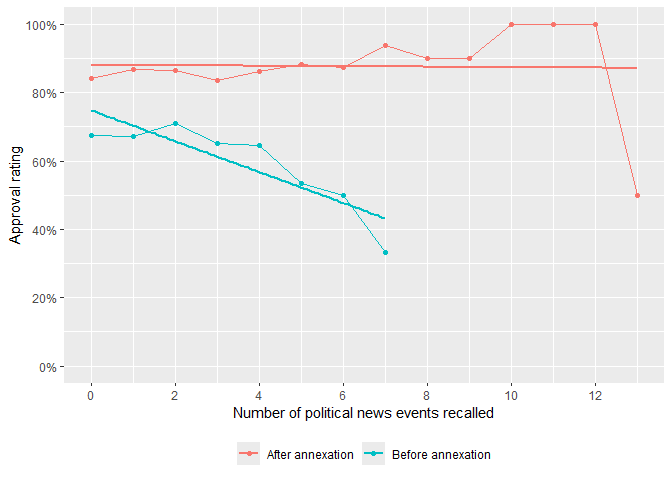

# Example Practicum
Romain Ferrali

> This is a partial response to the practicum assignment, meant to
> illustrate how to approach the assignment and how to write up your
> results. It is not a complete response, but is meant to illustrate how
> to approach describing data and results clearly, accurately, and in a
> way that is both accessible to a non-technical audience, yet satisfies
> more technical readers.

Following the annexation of Crimea in Februrary 2014, Vladimir Putin’s
approval ratings soared. The Levada Center, a respected and reliable
polling institution in Russia, conducts regular public opinion polls on
large (about 1,600 respondents), representative samples of the Russian
population. In their January 2014 survey, Putin’s approval rating was
67.7%, while in their May 2014 survey, it increased to 86.1%, an
important and statistically significant increase.

Some have argued that the annexation of Crimea boosted Putin’s approval
ratings because of the Russian state propaganda machine, mostly through
television. While the Levada Center surveys do not measure TV
consumption directly, several questions featured in the survey allow
evaluating the claim, albeit imperfectly. In particular, the survey asks
respondents how many recent news events they can recall, which can be
used as a proxy for news consumption. If the propaganda machine was
responsible for the increase in approval, we would expect that people
who consume more news would show larger increases in approval following
the annexation of Crimea.

<a href="#fig-news-consumption" class="quarto-xref">Figure 1</a> below
shows that after the war, respondents all had a level of approval
hovering around 90%, regardless of how many news events they recalled.
In contrast, before the war, there was a clear negative relationship
between news consumption and approval: people who recalled more news
events were more likely to disapprove of Putin. This, in turn, implies
that respondents who consumed more news saw their approval increase more
than respondents less exposed to political news. At first sight, the
pattern would thus support our hypothesis: after the annexation, the
propaganda machine disproportionately garnered the support of heavy
consumers of political news.

Figure 1: Approval ratings by news consumption before and after the
annexation of Crimea. Points and thin lines represent raw data averages,
while thick lines represent linear trends.

Yet, the insight does not withstand further scrutiny. First, while
important, the observed differential increase in approval is not
statistically significant at conventional levels. Second, we used
regression analysis to make more pointed comparisons and thus improve
the precision of our estimates. Comparing individuals before and after
the annexation that shared not only the same level of news consumption,
but also the same gender, age, and education level, we still find that
the observed differential increase is not statistically significant. We
also examined other proxies for news consumption, including (1) a binary
variable indicating whether respondents recalled any news event, (2)
whether respondents used the internet at all, and whether they used the
internet for news. In all cases, we found no evidence that the increase
in approval was significantly larger among heavy consumers of political
news (see <a href="#tbl-regression" class="quarto-xref">Table 1</a> for
details).

## Appendix

Table 1: Regression results for the relationship between news
consumption and approval ratings before and after the annexation of
Crimea. Controls include age, gender, and education level. The Yes
category for the interaction term indicates that the respondent recalled
at least one news event, used the internet, or used the internet for
news, depending on the model.

<table class="cell" style="width:94%;">
<colgroup>
<col style="width: 12%" />
<col style="width: 10%" />
<col style="width: 10%" />
<col style="width: 10%" />
<col style="width: 10%" />
<col style="width: 10%" />
<col style="width: 10%" />
<col style="width: 10%" />
<col style="width: 10%" />
</colgroup>
<thead>
<tr>
<th></th>
<th colspan="2">Remembers (count)</th>
<th colspan="2">Remembers (binary)</th>
<th colspan="2">Internet</th>
<th colspan="2">Internet for news</th>
</tr>
<tr>
<th></th>
<th><ol type="1">
<li></li>
</ol></th>
<th><ol start="2" type="1">
<li></li>
</ol></th>
<th><ol start="3" type="1">
<li></li>
</ol></th>
<th><ol start="4" type="1">
<li></li>
</ol></th>
<th><ol start="5" type="1">
<li></li>
</ol></th>
<th><ol start="6" type="1">
<li></li>
</ol></th>
<th><ol start="7" type="1">
<li></li>
</ol></th>
<th><ol start="8" type="1">
<li></li>
</ol></th>
</tr>
</thead>
<tbody>
<tr>
<td>After</td>
<td>0.171***</td>
<td>0.159***</td>
<td>0.204***</td>
<td>0.206***</td>
<td>0.181***</td>
<td>0.180***</td>
<td>0.167***</td>
<td>0.157***</td>
</tr>
<tr>
<td></td>
<td>(0.035)</td>
<td>(0.023)</td>
<td>(0.025)</td>
<td>(0.025)</td>
<td>(0.018)</td>
<td>(0.018)</td>
<td>(0.036)</td>
<td>(0.023)</td>
</tr>
<tr>
<td>Yes</td>
<td>0.008</td>
<td>-0.007</td>
<td>0.035</td>
<td>0.051*</td>
<td>-0.005</td>
<td>-0.002</td>
<td>0.003</td>
<td>-0.009</td>
</tr>
<tr>
<td></td>
<td>(0.024)</td>
<td>(0.009)</td>
<td>(0.022)</td>
<td>(0.025)</td>
<td>(0.023)</td>
<td>(0.023)</td>
<td>(0.024)</td>
<td>(0.009)</td>
</tr>
<tr>
<td>After x Yes</td>
<td>0.013</td>
<td>0.013</td>
<td>-0.032</td>
<td>-0.037</td>
<td>0.009</td>
<td>0.009</td>
<td>0.018</td>
<td>0.015</td>
</tr>
<tr>
<td></td>
<td>(0.039)</td>
<td>(0.010)</td>
<td>(0.031)</td>
<td>(0.031)</td>
<td>(0.032)</td>
<td>(0.031)</td>
<td>(0.039)</td>
<td>(0.010)</td>
</tr>
<tr>
<td>Num.Obs.</td>
<td>3171</td>
<td>3171</td>
<td>3171</td>
<td>3171</td>
<td>3171</td>
<td>3171</td>
<td>3171</td>
<td>3171</td>
</tr>
<tr>
<td>R2</td>
<td>0.059</td>
<td>0.060</td>
<td>0.048</td>
<td>0.061</td>
<td>0.047</td>
<td>0.059</td>
<td>0.047</td>
<td>0.048</td>
</tr>
<tr>
<td>Controls</td>
<td>No</td>
<td>Yes</td>
<td>No</td>
<td>Yes</td>
<td>No</td>
<td>Yes</td>
<td>No</td>
<td>Yes</td>
</tr>
</tbody><tfoot>
<tr>
<td colspan="9"><ul>
<li>p &lt; 0.1, * p &lt; 0.05, ** p &lt; 0.01, *** p &lt; 0.001</li>
</ul></td>
</tr>
</tfoot>
&#10;</table>

