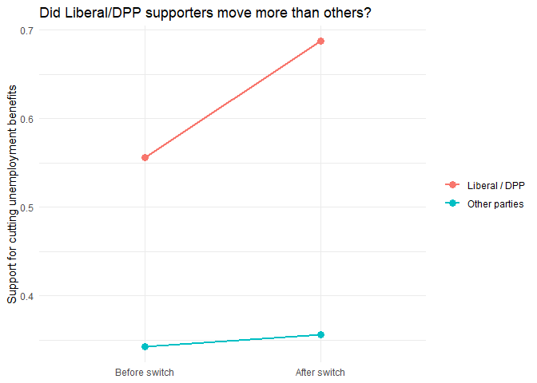
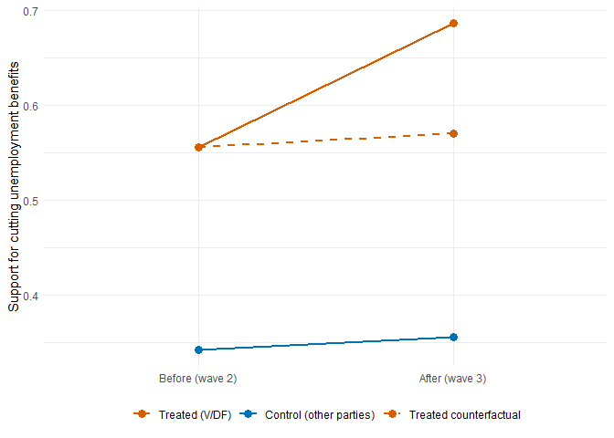
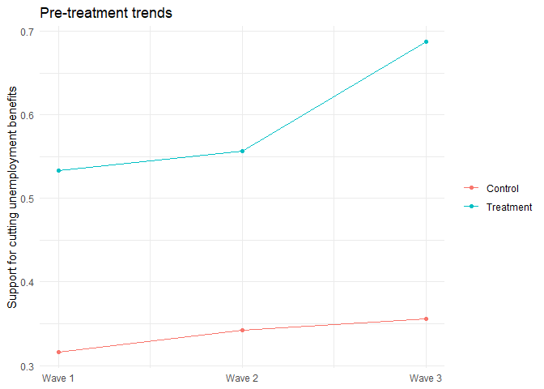

# Lecture 20-21: Time series
Romain Ferrali

So far in this course we have mostly worked with *static* data: a single
snapshot of a population, where each row is one unit and time does not
enter the picture. Most of the questions political scientists actually
care about, though, have a time element. Did approval go up after an
event? Did a policy reform change behavior? How long does an effect
last? To answer these we need data with a time dimension — what
statisticians call **dynamic** data, and what we will more loosely call
**time-series** data.

Two flavors are worth distinguishing. **Panel data** follow the same
units repeatedly: you survey the same individuals every year, or track
the same countries’ GDP every year. **Repeated cross-section** data
observe multiple units at multiple time points, but not the same units
at each point: every wave of the survey draws a fresh sample. The
practicum data are repeated cross-sections — the Levada Center surveyed
about 1,600 Russians in January 2014 and a different 1,600 Russians in
May 2014. The Danish data we will use today are panel: the same Danes
were surveyed across five waves.

Time-series data buy us several things at once. They let us **forecast**
— what will turnout look like next year? They let us **measure the
importance of events** — how did the 2008 financial crisis change
consumer confidence? They let us study **treatment effect dynamics** —
does a policy effect last, or does it fade after a year? And, most
importantly for this lecture, they let us **estimate causal effects when
treatment is not randomly assigned**. Real-world treatments are almost
never randomized: governments, companies, and parties make decisions for
reasons, and their decisions are correlated with everything else going
on at the time. Time-series data give us a way to claw back some causal
leverage even without randomization.

## A quick recap of where the practicum left us

The practicum took us through the rally around Putin after the Crimea
annexation. Approval rose by roughly ten percentage points in four
months, and we tested several explanations by interacting an `after`
indicator with respondent characteristics: news consumption, disapproval
of the West, nationalist sympathies. We found suggestive evidence for
some of these explanations and not for others (see the [worked
example](../homework/practicum-example.qmd)).

What the practicum did *not* let us do was claim a causal effect of the
annexation itself. Two reasons. First, there is no control group: every
Russian was exposed to the same news cycle, so we cannot rule out that
some other event in those same four months also moved approval. Second,
almost all of the candidate moderators (resentment, hostility to the
United States, recent news exposure) were measured *after* the
annexation, which means they could be mediators rather than moderators —
variables that the war itself changed, rather than stable traits that
shaped how respondents reacted to it.

Both problems would dissolve if we had **panel data with a clear control
group** — the same respondents observed before and after, with some of
them affected by the event and others not. That is exactly the setup we
will work with for the rest of this lecture.

## A new running example: Denmark, 2010–2011

We leave Crimea and move to Denmark in 2010–2011. The setup is admirably
clean. In late 2011 the Danish **Liberal Party** (*Venstre*, “V”)
suddenly reversed its long-standing position on two welfare policies: it
called for halving the maximum unemployment benefits period from four
years to two, and for abolishing the early-retirement pension
(*efterløn*). The **Danish People’s Party** (*Dansk Folkeparti*, “DF”)
backed the Liberals on unemployment benefits. Other Danish parties did
not change their positions. While this debate was unfolding, a five-wave
panel survey happened to be in the field — the same 2,902 respondents,
surveyed five times in close succession, bracketing the position switch
(Slothuus & Bisgaard 2021, *American Journal of Political Science*).

The question this setup lets us ask is unusually pointed: **did
Liberal-leaning voters change their opinions when their party changed
its position?** The conventional story in political science runs the
other way around — parties chase their voters’ preferences. The Danish
episode lets us look at the rarer reverse path: do voters follow when
their party leads?

``` r
danish <- read_csv("data/lecture-20-21-danish.csv", show_col_types = FALSE)
danish
```

    # A tibble: 14,510 × 4
       respondent_id  wave party benefit_cut_support
               <dbl> <dbl> <chr>               <dbl>
     1             1     1 SF                      0
     2             1     2 SF                     NA
     3             1     3 SF                     NA
     4             1     4 SF                     NA
     5             1     5 SF                     NA
     6             2     1 <NA>                    0
     7             2     2 <NA>                   NA
     8             2     3 <NA>                   NA
     9             2     4 <NA>                   NA
    10             2     5 <NA>                   NA
    # ℹ 14,500 more rows

Each row is one respondent in one wave. The variables we will use are
`respondent_id` (one of 2,902 unique Danes), `wave` (1 to 5), `party`
(the respondent’s party at wave 1, before the switch), and
`benefit_cut_support` (a 0–1 scale, higher meaning more support for
cutting unemployment benefits).

This is a much better setup than the Crimea practicum for three reasons.
First, the same people are surveyed repeatedly, so we can tell
*within-person change* from stable personal differences. Second, there
is a clear treatment group (Liberal and Danish People’s Party
supporters, whose party switched) and a clear control group (everyone
else). Third, party affiliation was measured at wave 1, *before* the
switch, and the gap between waves is a few months — short enough that
party identification barely budges. So we can use a respondent’s
pre-switch party as a clean group label, free of contamination by
treatment. In Crimea, by contrast, every respondent was treated.

## A first look at the data

The Liberal Party announced its switch on unemployment benefits between
waves 2 and 3 of the survey. Let us compare those two waves: the average
level of support for cutting unemployment benefits, separately for
treated respondents (Liberal and DPP supporters) and control respondents
(everyone else), before and after the switch.

``` r
danish |>
  filter(wave %in% c(2, 3), !is.na(party)) |>
  mutate(
    group = ifelse(party %in% c("V", "DF"), "Liberal / DPP", "Other parties"),
    wave_label = ifelse(wave == 2, "Before switch", "After switch")
  ) |>
  group_by(group, wave_label) |>
  summarize(
    mean_support = mean(benefit_cut_support, na.rm = TRUE)
  ) |>
  ggplot(aes(
    x = factor(wave_label, levels = c("Before switch", "After switch")),
    y = mean_support,
    color = group,
    group = group
  )) +
  geom_point(size = 3) +
  geom_line(linewidth = 1) +
  labs(
    x = NULL,
    y = "Support for cutting unemployment benefits",
    color = NULL,
    title = "Did Liberal/DPP supporters move more than others?"
  ) +
  theme_minimal()
```

    `summarise()` has regrouped the output.
    ℹ Summaries were computed grouped by group and wave_label.
    ℹ Output is grouped by group.
    ℹ Use `summarise(.groups = "drop_last")` to silence this message.
    ℹ Use `summarise(.by = c(group, wave_label))` for per-operation grouping
      (`?dplyr::dplyr_by`) instead.



The picture is suggestive. Both groups are relatively flat from wave 2
to wave 3 — except that the treated group jumps noticeably while the
control group barely moves. The gap between the two lines widens, and it
widens between exactly the two waves the party switch happened. If we
could trust this widening as the effect of the party switch, we would be
done.

Can we? What does the *gap between the two lines* measure at each point
in time? What does the *change in the gap* measure? And what would have
to be true for that change in the gap to be the causal effect of the
Liberal Party’s position switch? Holding those questions for a moment,
let us first look at why the more obvious comparisons would not work.

## Two bad comparisons that combine into a good one

We want to know what effect the Liberal/DPP position switch had on its
supporters’ support for the new policy line. There are two obvious
comparisons we could make, and both of them, by themselves, are bad.

**Bad comparison \#1: treated, after vs. treated, before.** Just look at
the Liberal/DPP supporters and ask how much their support changed from
wave 2 to wave 3. The trouble is that *anything* that happened in those
weeks could be responsible for the change — a recession deepening, a
news event, a celebrity making the cause fashionable. The pre/post
difference confounds the treatment with the secular trend.

**Bad comparison \#2: treated, after vs. control, after.** Just look at
wave 3 and compare Liberal/DPP supporters to everyone else. The trouble
is that the two groups are systematically different to begin with.
Right-wing voters are wealthier on average, and wealthier people tend to
want lower taxes and lower redistribution; they were more in favor of
cutting benefits *before* the switch and would be more in favor of
cutting them after, even if no party had moved an inch. The
cross-sectional difference confounds the treatment with stable group
differences.

The clever move is to take the difference of these two bad comparisons.
Specifically, we compare:

- the pre-to-post change among **treated** respondents (Liberal + DPP
  supporters),
- with the pre-to-post change among **control** respondents (everyone
  else).

The control group’s pre-to-post change is our best estimate of the
**secular trend** — everything that would have moved treated respondents
too, even if their party had said nothing. If treated respondents moved
*more* than that, the extra movement is what we attribute to the
treatment. In the Danish data, control respondents barely moved: their
support rose by about one percentage point. Treated respondents rose by
something like thirteen percentage points. Subtract one from thirteen,
and the *causal effect of the policy switch* on its supporters’ support
for the policy is something like twelve percentage points — a striking
move in only a few weeks.

This is the **difference-in-differences** estimator. It is a small
algebraic move with a big payoff: by combining two bad comparisons, each
of which is confounded in a different way, we strip out the confound and
isolate the treatment effect — without needing randomization.

## The 2 × 2 table and the formula

Let us write it out cleanly. The data we are working with is a 2 × 2
table: two groups (treated, control) by two times (pre, post). Four cell
means.

``` r
danish_23 <- danish |>
  filter(wave %in% c(2, 3), !is.na(party)) |>
  mutate(
    treated = as.integer(party %in% c("V", "DF")),
    post = as.integer(wave == 3)
  )

danish_23 |>
  group_by(treated, post) |>
  summarize(
    mean_support = mean(benefit_cut_support, na.rm = TRUE),
    .groups = "drop"
  )
```

    # A tibble: 4 × 3
      treated  post mean_support
        <int> <int>        <dbl>
    1       0     0        0.342
    2       0     1        0.356
    3       1     0        0.556
    4       1     1        0.687

The difference-in-differences estimator is:

$$\widehat{\text{DiD}} = \bigl(\bar y_{T,\text{post}} - \bar y_{T,\text{pre}}\bigr) - \bigl(\bar y_{C,\text{post}} - \bar y_{C,\text{pre}}\bigr)$$

The first term is how much treated respondents moved. The second is how
much control respondents moved — our estimate of what would have
happened to treated respondents in the absence of treatment. Their
difference is the *extra* movement among the treated, attributable to
the treatment.

It is worth pausing on one piece of intuition. The two groups do not
need to start at the same level for difference-in-differences to work.
Liberal voters were more in favor of cutting benefits than left-wing
voters at every wave; that is fine. What matters is whether their
*changes* over time would have been similar absent treatment. We will
return to this assumption shortly.

## As a regression

The 2 × 2 difference-in-differences has a tidy regression
representation: just an interaction. Writing $y_{it}$ for respondent
$i$’s support at wave $t$, $\text{treated}_i$ for a dummy equal to one
for Liberal/DPP supporters, and $\text{post}_t$ for a dummy equal to one
at wave 3, the specification is:

$$y_{it} = \alpha + \beta_1 \cdot \text{treated}_i + \beta_2 \cdot \text{post}_t + \beta_3 \cdot (\text{treated}_i \times \text{post}_t) + \varepsilon_{it}$$

It is easier to read this if we split it by group. For control
respondents ($\text{treated}_i = 0$):

$$y_{it} = \underbrace{\alpha}_{\alpha_{\text{control}}} + \beta_2 \cdot \text{post}_t + \varepsilon_{it}$$

For treated respondents ($\text{treated}_i = 1$):

$$y_{it} = \underbrace{(\alpha + \beta_1)}_{\alpha_{\text{treated}}} + (\beta_2 + \beta_3) \cdot \text{post}_t + \varepsilon_{it}$$

Each group gets its own intercept (different baseline support) and its
own slope on `post` (different pre-to-post change). Control respondents
move by $\beta_2$; treated respondents move by $\beta_2 + \beta_3$. The
*extra* movement in the treated group — the difference-in-differences —
is $\beta_3$.

``` r
lm(benefit_cut_support ~ treated * post, data = danish_23) |>
  modelsummary(
    stars = TRUE,
    gof_map = c("nobs", "r.squared")
  )
```

<table style="width:39%;">
<colgroup>
<col style="width: 23%" />
<col style="width: 15%" />
</colgroup>
<thead>
<tr>
<th></th>
<th><ol type="1">
<li></li>
</ol></th>
</tr>
</thead>
<tbody>
<tr>
<td>(Intercept)</td>
<td>0.342***</td>
</tr>
<tr>
<td></td>
<td>(0.011)</td>
</tr>
<tr>
<td>treated</td>
<td>0.214***</td>
</tr>
<tr>
<td></td>
<td>(0.020)</td>
</tr>
<tr>
<td>post</td>
<td>0.014</td>
</tr>
<tr>
<td></td>
<td>(0.015)</td>
</tr>
<tr>
<td>treated × post</td>
<td>0.117***</td>
</tr>
<tr>
<td></td>
<td>(0.029)</td>
</tr>
<tr>
<td>Num.Obs.</td>
<td>3243</td>
</tr>
<tr>
<td>R2</td>
<td>0.106</td>
</tr>
</tbody><tfoot>
<tr>
<td colspan="2"><ul>
<li>p &lt; 0.1, * p &lt; 0.05, ** p &lt; 0.01, *** p &lt; 0.001</li>
</ul></td>
</tr>
</tfoot>
&#10;</table>

Reading the four coefficients takes a bit of practice. A useful trick:
ask “what does setting all the variables to zero correspond to?” Setting
`treated = 0` and `post = 0` corresponds to a control respondent at wave
2 — so the **intercept** ($\alpha$) is the average support for control
respondents before the switch.

- `treated` ($\beta_1$): the gap between treated and control respondents
  *before* the switch — how much more right-wing voters supported
  cutting benefits at baseline.
- `post` ($\beta_2$): the pre-to-post change for the *control* group —
  our estimate of the secular trend.
- `treated:post` ($\beta_3$): the **difference-in-differences** itself —
  the extra movement in the treated group, on top of the secular trend.

Compare the four cell means above to these four coefficients and you
will see they encode exactly the same information.

A picture helps tie the formula to the data.
<a href="#fig-did-counterfactual" class="quarto-xref">Figure 1</a> plots
the four cell means and then draws a dashed line showing the
counterfactual trajectory of the treated group — where they would have
ended up if they had moved at the same pace as the control group. The
vertical gap at wave 3 between the observed treated point and that
dashed counterfactual is exactly the difference-in-differences.

``` r
cells <- danish_23 |>
  group_by(treated, post) |>
  summarize(
    mean_support = mean(benefit_cut_support, na.rm = TRUE),
    .groups = "drop"
  )

control_delta <- cells$mean_support[cells$treated == 0 & cells$post == 1] -
  cells$mean_support[cells$treated == 0 & cells$post == 0]
treated_pre <- cells$mean_support[cells$treated == 1 & cells$post == 0]

cf <- tibble(
  post = c(0, 1),
  mean_support = c(treated_pre, treated_pre + control_delta),
  series = "Treated counterfactual"
)

observed <- cells |>
  mutate(
    series = ifelse(treated == 1, "Treated (V/DF)", "Control (other parties)")
  ) |>
  select(post, mean_support, series)

bind_rows(observed, cf) |>
  mutate(
    wave_label = factor(
      ifelse(post == 0, "Before (wave 2)", "After (wave 3)"),
      levels = c("Before (wave 2)", "After (wave 3)")
    ),
    series = factor(
      series,
      levels = c(
        "Treated (V/DF)",
        "Control (other parties)",
        "Treated counterfactual"
      )
    )
  ) |>
  ggplot(aes(
    x = wave_label,
    y = mean_support,
    group = series,
    color = series,
    linetype = series
  )) +
  geom_point(size = 3) +
  geom_line(linewidth = 1) +
  scale_linetype_manual(
    values = c(
      "Treated (V/DF)" = "solid",
      "Control (other parties)" = "solid",
      "Treated counterfactual" = "dashed"
    )
  ) +
  scale_color_manual(
    values = c(
      "Treated (V/DF)" = "#D55E00",
      "Control (other parties)" = "#0072B2",
      "Treated counterfactual" = "#D55E00"
    )
  ) +
  labs(
    x = NULL,
    y = "Support for cutting unemployment benefits",
    color = NULL,
    linetype = NULL
  ) +
  theme_minimal() +
  theme(legend.position = "bottom")
```

<div id="fig-did-counterfactual">



Figure 1: Decomposing the difference-in-differences. Solid lines show
observed pre-to-post movement for each group. The dashed line shows the
counterfactual for the treated group — how they would have moved if they
had followed the control group’s trend. The gap at wave 3 between the
observed treated line and the dashed counterfactual is the estimated
treatment effect.

</div>

## The parallel-trends assumption

For the `treated:post` coefficient to be the causal effect of the policy
switch, we have to believe one specific thing:

> In the absence of the switch, Liberal/DPP supporters would have moved
> on this issue by the same amount as supporters of other parties.

This is the **parallel-trends assumption**. It says that the time
dynamics of the control group are a credible counterfactual for what
would have happened to the treated group, had they not been treated.

The catch is that we cannot test parallel trends directly. It is a
counterfactual: we do not get to see the world in which the Liberal
Party did not switch. What we *can* do is check whether the two groups
were moving in parallel *before* the switch — if they were, it is at
least plausible they would have continued to move in parallel
afterwards.

``` r
danish |>
  filter(!is.na(party), wave <= 3) |>
  mutate(treated = ifelse(party %in% c("V", "DF"), "Treatment", "Control")) |>
  group_by(treated, wave) |>
  summarize(
    mean_support = mean(benefit_cut_support, na.rm = TRUE)
  ) |>
  ggplot(aes(x = wave, y = mean_support, color = factor(treated))) +
  geom_point() +
  geom_line() +
  scale_x_continuous(breaks = 1:3, labels = c("Wave 1", "Wave 2", "Wave 3")) +
  labs(
    x = NULL,
    y = "Support for cutting unemployment benefits",
    color = NULL,
    title = "Pre-treatment trends"
  ) +
  theme_minimal()
```

    `summarise()` has regrouped the output.
    ℹ Summaries were computed grouped by treated and wave.
    ℹ Output is grouped by treated.
    ℹ Use `summarise(.groups = "drop_last")` to silence this message.
    ℹ Use `summarise(.by = c(treated, wave))` for per-operation grouping
      (`?dplyr::dplyr_by`) instead.



From wave 1 to wave 2 — when nothing in particular was going on — the
two groups move pretty much in parallel: a small increase for both,
almost identical in size. Then wave 3 happens, and only the treated
group jumps. If you wanted to test the wave-1-to-wave-2 parallelism
formally, you could run a placebo difference-in-differences between
waves 1 and 2:

``` r
danish |>
  filter(wave %in% c(1, 2), !is.na(party)) |>
  mutate(
    treated = as.integer(party %in% c("V", "DF")),
    post12 = as.integer(wave == 2)
  ) |>
  lm(benefit_cut_support ~ treated * post12, data = _) |>
  modelsummary(
    stars = TRUE,
    gof_map = c("nobs", "r.squared")
  )
```

<table style="width:42%;">
<colgroup>
<col style="width: 26%" />
<col style="width: 15%" />
</colgroup>
<thead>
<tr>
<th></th>
<th><ol type="1">
<li></li>
</ol></th>
</tr>
</thead>
<tbody>
<tr>
<td>(Intercept)</td>
<td>0.316***</td>
</tr>
<tr>
<td></td>
<td>(0.009)</td>
</tr>
<tr>
<td>treated</td>
<td>0.218***</td>
</tr>
<tr>
<td></td>
<td>(0.016)</td>
</tr>
<tr>
<td>post12</td>
<td>0.027*</td>
</tr>
<tr>
<td></td>
<td>(0.013)</td>
</tr>
<tr>
<td>treated × post12</td>
<td>-0.004</td>
</tr>
<tr>
<td></td>
<td>(0.025)</td>
</tr>
<tr>
<td>Num.Obs.</td>
<td>4124</td>
</tr>
<tr>
<td>R2</td>
<td>0.071</td>
</tr>
</tbody><tfoot>
<tr>
<td colspan="2"><ul>
<li>p &lt; 0.1, * p &lt; 0.05, <strong> p &lt; 0.01, </strong>* p &lt;
0.001</li>
</ul></td>
</tr>
</tfoot>
&#10;</table>

The interaction is small and statistically insignificant — what we hoped
to see. A small, insignificant pre-period interaction is reassuring; a
large or significant one would be a warning sign that the two groups
were already on different trajectories before treatment.

It is worth being honest that this is only ever circumstantial evidence.
Trends can be parallel before treatment and diverge after for reasons
that have nothing to do with the treatment itself — say, a leadership
change inside the Liberal Party that happened to coincide with the
policy switch. Such a confound would only affect the treatment group and
would be invisible in the pre-period. We cannot rule it out from the
data alone; we can only argue, as substantively as possible, that no
such confound is plausible.

## Unit fixed effects

We have a difference-in-differences estimate. But notice something: our
regression so far does not actually use the fact that we observe the
*same* respondents at wave 2 and wave 3. It treats the data as two
independent cross-sections of treated and control respondents. We can do
better.

The key idea is to give each respondent their own intercept. We have
already seen, way back in the regression lectures, that adding a dummy
variable shifts the intercept for one group:

$$y_i = \alpha + \beta_1 \cdot \text{female}_i + \beta_2 x_i + \varepsilon_i$$

Splitting this regression by group makes the intercept-shifting
explicit:

$$\begin{aligned}
\text{Males:}   &\quad y_i = \underbrace{\alpha}_{\alpha_{\text{male}}} + \beta_2 x_i + \varepsilon_i \\
\text{Females:} &\quad y_i = \underbrace{(\alpha + \beta_1)}_{\alpha_{\text{female}}} + \beta_2 x_i + \varepsilon_i
\end{aligned}$$

Men and women share the same slope $\beta_2$ on $x_i$, but each group
has its own intercept: $\alpha$ for men, $\alpha + \beta_1$ for women.
What if we did the same thing, but with one dummy per *individual*?

### A tiny toy panel

Let me make this concrete with four people, observed before and after.

``` r
toy <- tribble(
  ~id , ~wave  , ~opinion ,
  "A" , "pre"  ,        2 ,
  "A" , "post" ,        4 ,
  "B" , "pre"  ,        3 ,
  "B" , "post" ,        5 ,
  "C" , "pre"  ,        8 ,
  "C" , "post" ,        9 ,
  "D" , "pre"  ,        7 ,
  "D" , "post" ,        9
) |>
  mutate(
    post = as.integer(wave == "post"),
    id = factor(id)
  )

toy
```

    # A tibble: 8 × 4
      id    wave  opinion  post
      <fct> <chr>   <dbl> <int>
    1 A     pre         2     0
    2 A     post        4     1
    3 B     pre         3     0
    4 B     post        5     1
    5 C     pre         8     0
    6 C     post        9     1
    7 D     pre         7     0
    8 D     post        9     1

Persons A and B start low; persons C and D start high. Everyone moves up
from pre to post, by different amounts. If we run a regression with one
dummy per person plus a `post` indicator:

``` r
lm(opinion ~ id + post, data = toy) |>
  summary()
```


    Call:
    lm(formula = opinion ~ id + post, data = toy)

    Residuals:
         1      2      3      4      5      6      7      8 
    -0.125  0.125 -0.125  0.125  0.375 -0.375 -0.125  0.125 

    Coefficients:
                Estimate Std. Error t value Pr(>|t|)    
    (Intercept)   2.1250     0.2795   7.603 0.004722 ** 
    idB           1.0000     0.3536   2.828 0.066276 .  
    idC           5.5000     0.3536  15.556 0.000577 ***
    idD           5.0000     0.3536  14.142 0.000766 ***
    post          1.7500     0.2500   7.000 0.005986 ** 
    ---
    Signif. codes:  0 '***' 0.001 '**' 0.01 '*' 0.05 '.' 0.1 ' ' 1

    Residual standard error: 0.3536 on 3 degrees of freedom
    Multiple R-squared:  0.9929,    Adjusted R-squared:  0.9835 
    F-statistic:   105 on 4 and 3 DF,  p-value: 0.001487

The dummies on `idB`, `idC`, `idD` are each person’s intercept relative
to person A. The coefficient on `post` is the *average within-person
change* from pre to post: A went up by 2, B by 2, C by 1, D by 2, so the
average is 1.75 — exactly what the regression reports. Each person is
being compared to themselves.

Splitting by individual shows the same structure as the male/female
example above, but with one equation per respondent instead of one per
gender:

$$\begin{aligned}
\text{Person A:} &\quad y_{A,t} = \underbrace{\text{Intercept}}_{\alpha_A} + \beta \cdot \text{post}_t + \varepsilon_{A,t} \\
\text{Person B:} &\quad y_{B,t} = \underbrace{(\text{Intercept} + \text{idB})}_{\alpha_B} + \beta \cdot \text{post}_t + \varepsilon_{B,t} \\
\text{Person C:} &\quad y_{C,t} = \underbrace{(\text{Intercept} + \text{idC})}_{\alpha_C} + \beta \cdot \text{post}_t + \varepsilon_{C,t} \\
\text{Person D:} &\quad y_{D,t} = \underbrace{(\text{Intercept} + \text{idD})}_{\alpha_D} + \beta \cdot \text{post}_t + \varepsilon_{D,t}
\end{aligned}$$

Everyone gets their own intercept; everyone shares the same slope
$\beta$ on `post`. Those person-specific intercepts are called **unit
fixed effects**.

### What unit fixed effects buy us

A unit fixed effect gives every respondent their own intercept that
absorbs *everything stable about them*: childhood, personality, baseline
partisanship, deep values, education for adults, things we never
bothered to measure, things we never thought of. As long as a
characteristic does not change over time, it cannot bias the coefficient
on a variable that does change over time, because the person’s fixed
effect has already swallowed it.

To see this algebraically, split a respondent’s characteristics into
**time-varying** pieces $x_{it}$ (this month’s news consumption, current
income) and **time-invariant** pieces $x_i$ (year of birth, gender,
childhood socialization, deep personality traits). A regression with
both kinds of variables looks like:

$$y_{it} = \alpha + \beta_1 \cdot \text{income}_{it} + \beta_2 \cdot \text{female}_i + \beta_3 \cdot \text{birthplace}_i + \varepsilon_{it}$$

Unit fixed effects replace the whole collection of time-invariant
variables — the $\beta_2 \text{female}_i$, the
$\beta_3 \text{birthplace}_i$, and everything else about the person we
can or cannot measure — with a single per-person intercept $\alpha_i$:

$$y_{it} = \alpha_i + \beta_1 \cdot \text{income}_{it} + \varepsilon_{it}$$

Said differently: if I want to estimate the effect of some treatment on
an outcome, the cleanest possible comparison is the same person before
and after treatment. You cannot get more comparable than that. Unit
fixed effects let me do exactly this kind of comparison, except averaged
across many people. It is exactly what we could not do in the Crimea
practicum: there we never observed the same respondent twice.

There is a constraint that comes with this. You cannot include any
**time-invariant** variable (like `female`, or birthplace, or year of
birth) in a regression that already has unit fixed effects. The
following specification simply cannot be estimated:

$$y_{it} = \alpha_i + \beta_1 \cdot \text{income}_{it} + \beta_2 \cdot \text{female}_i + \varepsilon_{it}$$

The fixed effect $\alpha_i$ has already absorbed the effect of being a
particular person, which includes the effect of being female, the effect
of being from Aarhus, and so on. Trying to estimate the gender effect on
top of the unit effect is asking the regression to separate two things
that are perfectly collinear — and it cannot.

### The within-group view

A second way to think about fixed effects: subtract each person’s own
average from each of their observations.

``` r
toy <- toy |>
  group_by(id) |>
  mutate(
    opinion_demeaned = opinion - mean(opinion),
    post_demeaned = post - mean(post)
  ) |>
  ungroup()
toy
```

    # A tibble: 8 × 6
      id    wave  opinion  post opinion_demeaned post_demeaned
      <fct> <chr>   <dbl> <int>            <dbl>         <dbl>
    1 A     pre         2     0             -1            -0.5
    2 A     post        4     1              1             0.5
    3 B     pre         3     0             -1            -0.5
    4 B     post        5     1              1             0.5
    5 C     pre         8     0             -0.5          -0.5
    6 C     post        9     1              0.5           0.5
    7 D     pre         7     0             -1            -0.5
    8 D     post        9     1              1             0.5

Once we demean, person A’s opinions become $-1$ and $+1$, person D’s
also become $-1$ and $+1$, and so on. The huge gap between their
*baselines* is gone — what remains is each person’s pre-to-post
movement. Running `lm(opinion_demeaned ~ post_demeaned)` on the demeaned
data gives *exactly* the same `post` coefficient as the dummy-variable
regression:

``` r
list(
  lm(opinion ~ id + post, data = toy),
  lm(opinion_demeaned ~ post_demeaned, data = toy)
) |>
  modelsummary(
    stars = TRUE,
    coef_rename = c("post" = "Post", "post_demeaned" = "Post (demeaned)"),
    gof_map = c("nobs", "r.squared")
  )
```

<table style="width:56%;">
<colgroup>
<col style="width: 25%" />
<col style="width: 15%" />
<col style="width: 15%" />
</colgroup>
<thead>
<tr>
<th></th>
<th><ol type="1">
<li></li>
</ol></th>
<th><ol start="2" type="1">
<li></li>
</ol></th>
</tr>
</thead>
<tbody>
<tr>
<td>(Intercept)</td>
<td>2.125**</td>
<td>0.000</td>
</tr>
<tr>
<td></td>
<td>(0.280)</td>
<td>(0.088)</td>
</tr>
<tr>
<td>idB</td>
<td>1.000+</td>
<td></td>
</tr>
<tr>
<td></td>
<td>(0.354)</td>
<td></td>
</tr>
<tr>
<td>idC</td>
<td>5.500***</td>
<td></td>
</tr>
<tr>
<td></td>
<td>(0.354)</td>
<td></td>
</tr>
<tr>
<td>idD</td>
<td>5.000***</td>
<td></td>
</tr>
<tr>
<td></td>
<td>(0.354)</td>
<td></td>
</tr>
<tr>
<td>Post</td>
<td>1.750**</td>
<td></td>
</tr>
<tr>
<td></td>
<td>(0.250)</td>
<td></td>
</tr>
<tr>
<td>Post (demeaned)</td>
<td></td>
<td>1.750***</td>
</tr>
<tr>
<td></td>
<td></td>
<td>(0.177)</td>
</tr>
<tr>
<td>Num.Obs.</td>
<td>8</td>
<td>8</td>
</tr>
<tr>
<td>R2</td>
<td>0.993</td>
<td>0.942</td>
</tr>
</tbody><tfoot>
<tr>
<td colspan="3"><ul>
<li>p &lt; 0.1, * p &lt; 0.05, ** p &lt; 0.01, *** p &lt; 0.001</li>
</ul></td>
</tr>
</tfoot>
&#10;</table>

In words: unit fixed effects throw away all the *between-person*
variation and use only the *within-person* movement to estimate the
treatment effect. Stable personal characteristics get subtracted out in
the demeaning step and cannot bias the treatment coefficient. Mr. A is
no longer being compared to Mr. D — Mr. A is being compared to Mr. A.

This intuition generalizes well beyond panels of individuals. Region
fixed effects compare municipalities to other municipalities in the same
region: when you look at Moroccan election data, you no longer compare
the capital to the Sahara, you compare towns within Marrakech to other
towns within Marrakech. Continent fixed effects compare countries within
the same continent: Ghana gets compared to Côte d’Ivoire and Senegal,
not to Vietnam. The closer the comparison group, the cleaner the
estimate.

### Doing this efficiently with `fixest`

With 2,902 Danes, writing out 2,902 dummies is a bad idea — your
regression table becomes unreadable and the computation is slow. The
`fixest` package handles fixed effects efficiently: instead of literally
fitting 2,902 dummies, it does the demeaning under the hood.

``` r
feols(opinion ~ post | id, data = toy)
```

    OLS estimation, Dep. Var.: opinion
    Observations: 8
    Fixed-effects: id: 4
    Standard-errors: IID 
         Estimate Std. Error t value  Pr(>|t|)    
    post     1.75       0.25       7 0.0059863 ** 
    ---
    Signif. codes:  0 '***' 0.001 '**' 0.01 '*' 0.05 '.' 0.1 ' ' 1
    RMSE: 0.216506     Adj. R2: 0.983452
                     Within R2: 0.942308

The vertical bar `| id` means “absorb a unit fixed effect for `id`.”
Same `post` estimate as `lm(opinion ~ id + post, data = toy)`, but fast
and tidy.

### Fixed effects inside difference-in-differences

Back to the Danish panel. The plain difference-in-differences regression
was

$$y_{it} = \alpha + \beta_1 \cdot \text{treated}_i + \beta_2 \cdot \text{post}_t + \beta_3 \cdot (\text{treated}_i \times \text{post}_t) + \varepsilon_{it}$$

The piece $\alpha + \beta_1 \cdot \text{treated}_i$ depends only on
stable respondent characteristics — being Liberal/DPP or not — so it is
exactly the kind of thing a unit fixed effect absorbs. Swap it for
$\alpha_i$ and you get:

$$y_{it} = \alpha_i + \beta_2 \cdot \text{post}_t + \beta_3 \cdot (\text{treated}_i \times \text{post}_t) + \varepsilon_{it}$$

Two things have happened. The standalone `treated` term has dropped out:
it is time-invariant within a respondent, so it is already absorbed. The
interaction term has *not* dropped out, because it does vary within
respondent — it is zero at wave 2 and one at wave 3 for treated
respondents. That is the coefficient we care about.

Let us run both specifications side by side and confirm the
treatment-effect coefficient is unchanged.

``` r
list(
  "DiD" = feols(benefit_cut_support ~ treated * post, data = danish_23),
  "DiD + unit FE" = feols(
    benefit_cut_support ~ post + treated:post | respondent_id,
    data = danish_23
  )
) |>
  modelsummary(
    stars = TRUE,
    coef_map = c(
      "treated:post" = "Treated x Post",
      "post:treated" = "Treated x Post",
      "post" = "Post",
      "treated" = "Treated"
    ),
    gof_map = c("nobs", "r.squared")
  )
```

    NOTE: 1,785 observations removed because of NA values (LHS: 1,785).

    NOTES: 1,785 observations removed because of NA values (LHS: 1,785).
           389 fixed-effect singletons were removed (389 observations).

<table style="width:61%;">
<colgroup>
<col style="width: 23%" />
<col style="width: 15%" />
<col style="width: 22%" />
</colgroup>
<thead>
<tr>
<th></th>
<th>DiD</th>
<th>DiD + unit FE</th>
</tr>
</thead>
<tbody>
<tr>
<td>Treated x Post</td>
<td>0.117***</td>
<td>0.120***</td>
</tr>
<tr>
<td></td>
<td>(0.029)</td>
<td>(0.018)</td>
</tr>
<tr>
<td>Post</td>
<td>0.014</td>
<td>0.027**</td>
</tr>
<tr>
<td></td>
<td>(0.015)</td>
<td>(0.009)</td>
</tr>
<tr>
<td>Treated</td>
<td>0.214***</td>
<td></td>
</tr>
<tr>
<td></td>
<td>(0.020)</td>
<td></td>
</tr>
<tr>
<td>Num.Obs.</td>
<td>3243</td>
<td>2854</td>
</tr>
<tr>
<td>R2</td>
<td>0.106</td>
<td>0.852</td>
</tr>
</tbody><tfoot>
<tr>
<td colspan="3"><ul>
<li>p &lt; 0.1, * p &lt; 0.05, ** p &lt; 0.01, *** p &lt; 0.001</li>
</ul></td>
</tr>
</tfoot>
&#10;</table>

Two things to notice. First, the difference-in-differences coefficient
(`Treated x Post`) is the same in both columns. Adding unit fixed
effects did not change the headline number. Second, the standalone
`Treated` term has disappeared from the second column. That is not a bug
— `treated` is constant over time within a respondent, so it has been
swallowed whole by the unit fixed effect. The model is now identifying
the treatment effect from *within-person movement* only.

## Time fixed effects

Look back at the difference-in-differences regression:

$$y_{it} = \alpha + \beta_1 \cdot \text{treated}_i + \beta_2 \cdot \text{post}_t + \beta_3 \cdot (\text{treated}_i \times \text{post}_t) + \varepsilon_{it}$$

What is `post` actually doing? It is a dummy for the second wave. With
only two waves it is just a single indicator, but conceptually it is a
**time fixed effect** with two values. Time fixed effects absorb
anything that hits *everyone* at the same moment — an economic shock, a
media cycle, the weather, a national news event.

With many waves we would generalize by giving each wave its own dummy:

$$y_{it} = \alpha_i + \alpha_t + \beta \cdot T_{it} + \varepsilon_{it}$$

where $\alpha_i$ is the unit fixed effect (a person’s own intercept),
$\alpha_t$ is the time fixed effect (a wave-specific intercept), and
$T_{it}$ is 1 only if person $i$ is in the treated group *and* wave $t$
is after the switch. It is worth pausing on what each piece absorbs:

- **Unit fixed effects** $\alpha_i$ soak up everything stable about a
  person — personality, baseline partisanship, deep values, education
  for adults, anything we cannot measure.
- **Time fixed effects** $\alpha_t$ soak up everything shared across
  people in a given period — the state of the economy, a media cycle,
  the weather, a national news event.
- **Treatment indicator** $T_{it}$ is what remains: the “extra
  something” that hits treated units in treated periods.

The coefficient $\beta$ captures that extra something. This
specification has a name — **two-way fixed effects** — and it is the
workhorse of modern panel-data analysis.

## Two-way fixed effects: same answer, more general

In the simple 2 × 2 case, all three forms — the interaction regression,
the unit-fixed-effects version, and the two-way-fixed-effects version —
give exactly the same estimate.

``` r
list(
  "DiD (interaction)" = feols(
    benefit_cut_support ~ treated * post,
    data = danish_23
  ),
  "DiD + unit FE" = feols(
    benefit_cut_support ~ post + treated:post | respondent_id,
    data = danish_23
  ),
  "Two-way FE" = feols(
    benefit_cut_support ~ treated:post | respondent_id + wave,
    data = danish_23
  )
) |>
  modelsummary(
    stars = TRUE,
    coef_map = c(
      "treated:post" = "Treated x Post",
      "post:treated" = "Treated x Post",
      "post" = "Post",
      "treated" = "Treated"
    ),
    gof_map = c("nobs", "r.squared")
  )
```

    NOTE: 1,785 observations removed because of NA values (LHS: 1,785).

    NOTES: 1,785 observations removed because of NA values (LHS: 1,785).
           389 fixed-effect singletons were removed (389 observations).

    NOTES: 1,785 observations removed because of NA values (LHS: 1,785).
           389/0 fixed-effect singletons were removed (389 observations).

<table style="width:92%;">
<colgroup>
<col style="width: 23%" />
<col style="width: 27%" />
<col style="width: 22%" />
<col style="width: 18%" />
</colgroup>
<thead>
<tr>
<th></th>
<th>DiD (interaction)</th>
<th>DiD + unit FE</th>
<th>Two-way FE</th>
</tr>
</thead>
<tbody>
<tr>
<td>Treated x Post</td>
<td>0.117***</td>
<td>0.120***</td>
<td>0.120***</td>
</tr>
<tr>
<td></td>
<td>(0.029)</td>
<td>(0.018)</td>
<td>(0.018)</td>
</tr>
<tr>
<td>Post</td>
<td>0.014</td>
<td>0.027**</td>
<td></td>
</tr>
<tr>
<td></td>
<td>(0.015)</td>
<td>(0.009)</td>
<td></td>
</tr>
<tr>
<td>Treated</td>
<td>0.214***</td>
<td></td>
<td></td>
</tr>
<tr>
<td></td>
<td>(0.020)</td>
<td></td>
<td></td>
</tr>
<tr>
<td>Num.Obs.</td>
<td>3243</td>
<td>2854</td>
<td>2854</td>
</tr>
<tr>
<td>R2</td>
<td>0.106</td>
<td>0.852</td>
<td>0.852</td>
</tr>
</tbody><tfoot>
<tr>
<td colspan="4"><ul>
<li>p &lt; 0.1, * p &lt; 0.05, ** p &lt; 0.01, *** p &lt; 0.001</li>
</ul></td>
</tr>
</tfoot>
&#10;</table>

So why bother with the two-way-fixed-effects form if it gives the same
number? Because it **scales** to situations the simple interaction does
not handle:

- More than two waves (just keep adding wave fixed effects).
- More than two groups (just keep adding unit fixed effects).
- *Staggered* treatment, where different units get treated at different
  times — for instance, a study of US states where some adopt a policy
  in 2010, others in 2013, others never. The interaction form simply
  cannot handle this; the two-way-fixed-effects form can.

A footnote on staggered designs: the recent econometrics literature
(roughly 2020–2023) has identified subtle problems with the classical
two-way-fixed-effects estimator when treatment timing varies across
units. There are now better estimators in the staggered-treatment case.
We will not cover them in this course, but be aware that “I just ran a
two-way-fixed-effects regression” is no longer the end of the
conversation when treatment timing varies — flag it for yourself if you
ever build a project around staggered adoption.

## A practical workflow for the final project

If you take a difference-in-differences or fixed-effects approach in
your final project, a useful default is to present three regressions
side by side, in increasing order of sophistication:

1.  **Raw**: `outcome ~ treatment`. Just the headline difference, no
    fixed effects, no controls. This is what is easiest for a
    non-technical reader to understand, and it usually corresponds to a
    simple plot.
2.  **With fixed effects**:
    `feols(outcome ~ treatment | unit + region + ...)`, with whatever
    fixed-effect groupings make sense for your data. You hope the result
    stays similar; if it shifts substantially, prefer the fixed-effects
    column because the comparisons are more pointed.
3.  **With fixed effects and controls**: the same specification, plus
    the time-varying controls you want to adjust for.

A sophisticated reader wants to see the whole progression, not just the
most heavily controlled column at the end. Showing all three lets them
follow how the estimate evolves as you tighten the comparison.

When choosing fixed-effect groupings, finer is usually better — but only
up to a point. New York City data: borough fixed effects compare
Manhattan as a whole to the Bronx, which is fine, but neighborhood fixed
effects compare Harlem to the Upper East Side, which is much sharper.
Push as fine as your sample size allows. The constraint is that a group
with only one observation effectively drops out of the regression: there
is no within-group variation for the model to use. So go fine, but stop
before your groups collapse to one observation each.

One last point. **Even if you do not believe parallel trends — even if
you are not making a causal argument at all — fixed effects are a good
idea.** Adding them moves your comparisons within tighter, more similar
groups (different years for the same person, different cities within the
same region, different products within the same company), which gives
you a cleaner estimate of the *association* between treatment and
outcome even if you cannot claim causality. In nearly every applied
setting, fixed effects make the estimate better, not worse.

## Wrap-up

We started with a picture: a treated and a control group, before and
after, with the gap widening. We turned the picture into a 2 × 2 table,
then into a regression with an interaction term.
**Difference-in-differences** is just that regression: it strips out the
secular trend by using the control group’s change as a counterfactual
for what would have happened to the treated absent treatment. **Unit
fixed effects** sharpen the design by absorbing every stable personal
characteristic, leaving only within-person movement to identify the
treatment effect. **Time fixed effects** generalize the `post` dummy to
many periods, absorbing whatever hits everyone at once. **Two-way fixed
effects** combine the two and scale gracefully to many groups, many
periods, and staggered treatment timing. In the simple 2 × 2 case, all
of these forms give the same number — but the more general form is the
one to write, because it extends.

Underneath all of this sits the **parallel-trends assumption**: that the
control group’s trend is a credible counterfactual for the treated
group’s trend. It is untestable in the strict sense — it is about a
counterfactual world we never see — but we can do circumstantial checks
by looking at pre-treatment trends. And even when we cannot defend
parallel trends, fixed effects remain a useful tool for making cleaner
comparisons.
