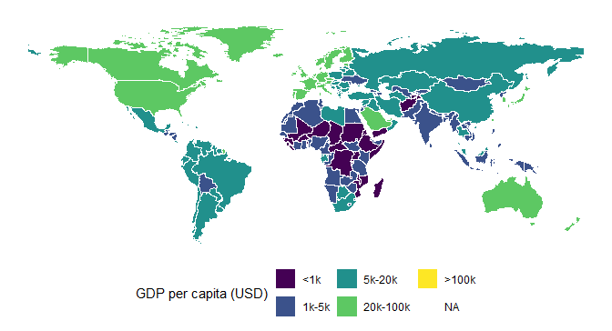
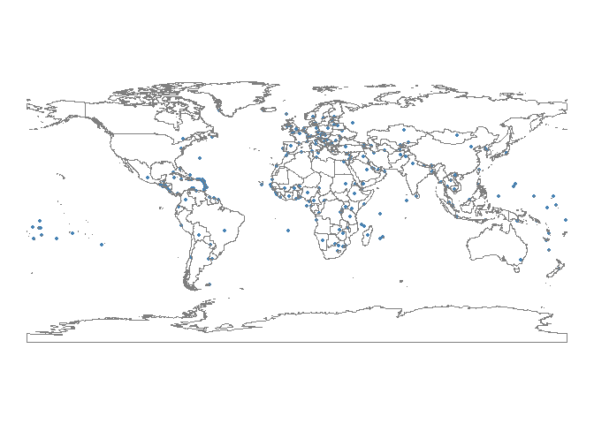
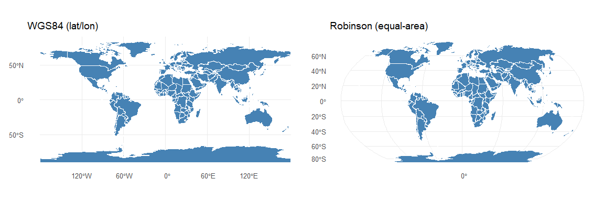

# Lecture 23: Spatial analysis
Romain Ferrali

This is the third stop on our short tour of unstructured data. Text was
the first flavor, networks the second, and today we land on **spatial
data**: anything where a row in your eventual table has a location
attached to it. The recipe is the same as it has always been in this
course — take data that does not start out in the shape of a table, turn
it into one, and then bring all the regression and visualization tools
you already know to bear on it.

Political scientists end up with spatial data more often than they
expect. Electoral districts and the entire literature on
**gerrymandering** start there. Gerrymandering is the practice of
drawing electoral district boundaries to engineer election outcomes —
for example, a Republican-leaning state legislature could split a
strongly Democratic city like Houston in two, attaching each half to a
much larger rural Republican area, so that two safely Republican
districts emerge where a fairer map would have produced one Democratic
and one Republican district. That kind of question is unavoidable as
soon as you have polygons and votes. Conflict events from datasets like
ACLED, protest locations, and migration flows are inherently geocoded.
Many of the most useful regressors in comparative politics are spatial:
distance to the capital as a proxy for state reach, distance to the
nearest border, distance to the nearest active conflict event. Even an
ordinary survey can be made spatial by geocoding respondents to their
neighborhood and merging in features of that neighborhood. Once the data
sits in a table with a location column, the rest of your toolkit applies
unchanged.

## Two flavors of geometry

Spatial data come in two main shapes. **Polygons** have an interior and
a boundary — countries, electoral districts, census tracts, watersheds.
**Points** are single locations — events, cities, geocoded respondents.
Lines (roads, rivers, pipelines) exist too, but we will not cover them
today. Both shapes live happily in R inside the **sf** package — short
for *simple features* — and the trick that makes everything work is that
an `sf` object is just a data frame with one extra column called
`geometry` that holds the shape.

### Polygons: a world map from `rnaturalearth`

The `rnaturalearth` package bundles a clean polygon dataset of the
world’s countries. Reading it in gives us back something that prints
almost like a normal data frame, except for a small header announcing
that it is also a spatial object.

``` r
countries <- ne_countries(scale = "medium", returnclass = "sf")
countries
```

    Simple feature collection with 242 features and 168 fields
    Geometry type: MULTIPOLYGON
    Dimension:     XY
    Bounding box:  xmin: -180 ymin: -89.99893 xmax: 180 ymax: 83.59961
    Geodetic CRS:  WGS 84
    First 10 features:
            featurecla scalerank labelrank                     sovereignt sov_a3
    1  Admin-0 country         1         3                       Zimbabwe    ZWE
    2  Admin-0 country         1         3                         Zambia    ZMB
    3  Admin-0 country         1         3                          Yemen    YEM
    4  Admin-0 country         3         2                        Vietnam    VNM
    5  Admin-0 country         5         3                      Venezuela    VEN
    6  Admin-0 country         6         6                        Vatican    VAT
    7  Admin-0 country         1         4                        Vanuatu    VUT
    8  Admin-0 country         1         3                     Uzbekistan    UZB
    9  Admin-0 country         1         4                        Uruguay    URY
    10 Admin-0 country         3         6 Federated States of Micronesia    FSM
       adm0_dif level              type tlc                          admin adm0_a3
    1         0     2 Sovereign country   1                       Zimbabwe     ZWE
    2         0     2 Sovereign country   1                         Zambia     ZMB
    3         0     2 Sovereign country   1                          Yemen     YEM
    4         0     2 Sovereign country   1                        Vietnam     VNM
    5         0     2 Sovereign country   1                      Venezuela     VEN
    6         0     2 Sovereign country   1                        Vatican     VAT
    7         0     2 Sovereign country   1                        Vanuatu     VUT
    8         0     2 Sovereign country   1                     Uzbekistan     UZB
    9         0     2 Sovereign country   1                        Uruguay     URY
    10        0     2 Sovereign country   1 Federated States of Micronesia     FSM
       geou_dif                        geounit gu_a3 su_dif
    1         0                       Zimbabwe   ZWE      0
    2         0                         Zambia   ZMB      0
    3         0                          Yemen   YEM      0
    4         0                        Vietnam   VNM      0
    5         0                      Venezuela   VEN      0
    6         0                        Vatican   VAT      0
    7         0                        Vanuatu   VUT      0
    8         0                     Uzbekistan   UZB      0
    9         0                        Uruguay   URY      0
    10        0 Federated States of Micronesia   FSM      0
                              subunit su_a3 brk_diff       name
    1                        Zimbabwe   ZWE        0   Zimbabwe
    2                          Zambia   ZMB        0     Zambia
    3                           Yemen   YEM        0      Yemen
    4                         Vietnam   VNM        0    Vietnam
    5                       Venezuela   VEN        0  Venezuela
    6                         Vatican   VAT        0    Vatican
    7                         Vanuatu   VUT        0    Vanuatu
    8                      Uzbekistan   UZB        0 Uzbekistan
    9                         Uruguay   URY        0    Uruguay
    10 Federated States of Micronesia   FSM        0 Micronesia
                            name_long brk_a3   brk_name brk_group abbrev postal
    1                        Zimbabwe    ZWE   Zimbabwe      <NA>  Zimb.     ZW
    2                          Zambia    ZMB     Zambia      <NA> Zambia     ZM
    3                           Yemen    YEM      Yemen      <NA>   Yem.     YE
    4                         Vietnam    VNM    Vietnam      <NA>  Viet.     VN
    5                       Venezuela    VEN  Venezuela      <NA>   Ven.     VE
    6                         Vatican    VAT    Vatican      <NA>   Vat.      V
    7                         Vanuatu    VUT    Vanuatu      <NA>   Van.     VU
    8                      Uzbekistan    UZB Uzbekistan      <NA>   Uzb.     UZ
    9                         Uruguay    URY    Uruguay      <NA>   Ury.     UY
    10 Federated States of Micronesia    FSM Micronesia      <NA> F.S.M.    FSM
                              formal_en                          formal_fr
    1              Republic of Zimbabwe                               <NA>
    2                Republic of Zambia                               <NA>
    3                 Republic of Yemen                               <NA>
    4     Socialist Republic of Vietnam                               <NA>
    5  Bolivarian Republic of Venezuela República Bolivariana de Venezuela
    6         State of the Vatican City                               <NA>
    7               Republic of Vanuatu                               <NA>
    8            Republic of Uzbekistan                               <NA>
    9      Oriental Republic of Uruguay                               <NA>
    10   Federated States of Micronesia                               <NA>
                            name_ciawf note_adm0 note_brk
    1                         Zimbabwe      <NA>     <NA>
    2                           Zambia      <NA>     <NA>
    3                            Yemen      <NA>     <NA>
    4                          Vietnam      <NA>     <NA>
    5                        Venezuela      <NA>     <NA>
    6          Holy See (Vatican City)      <NA>     <NA>
    7                          Vanuatu      <NA>     <NA>
    8                       Uzbekistan      <NA>     <NA>
    9                          Uruguay      <NA>     <NA>
    10 Micronesia, Federated States of      <NA>     <NA>
                             name_sort name_alt mapcolor7 mapcolor8 mapcolor9
    1                         Zimbabwe     <NA>         1         5         3
    2                           Zambia     <NA>         5         8         5
    3                      Yemen, Rep.     <NA>         5         3         3
    4                          Vietnam     <NA>         5         6         5
    5                    Venezuela, RB     <NA>         1         3         1
    6               Vatican (Holy See) Holy See         1         3         4
    7                          Vanuatu     <NA>         6         3         7
    8                       Uzbekistan     <NA>         2         3         5
    9                          Uruguay     <NA>         1         2         2
    10 Micronesia, Federated States of     <NA>         5         2         4
       mapcolor13  pop_est pop_rank pop_year gdp_md gdp_year
    1           9 14645468       14     2019  21440     2019
    2          13 17861030       14     2019  23309     2019
    3          11 29161922       15     2019  22581     2019
    4           4 96462106       16     2019 261921     2019
    5           4 28515829       15     2019 482359     2014
    6           2      825        2     2019    -99     2019
    7           3   299882       10     2019    934     2019
    8           4 33580650       15     2019  57921     2019
    9          10  3461734       12     2019  56045     2019
    10         13   113815        9     2019    401     2018
                          economy              income_grp fips_10 iso_a2 iso_a2_eh
    1     5. Emerging region: G20           5. Low income      ZI     ZW        ZW
    2   7. Least developed region  4. Lower middle income      ZA     ZM        ZM
    3   7. Least developed region  4. Lower middle income      YM     YE        YE
    4     5. Emerging region: G20  4. Lower middle income      VM     VN        VN
    5     5. Emerging region: G20  3. Upper middle income      VE     VE        VE
    6  2. Developed region: nonG7 2. High income: nonOECD      VT     VA        VA
    7   7. Least developed region  4. Lower middle income      NH     VU        VU
    8        6. Developing region  4. Lower middle income      UZ     UZ        UZ
    9     5. Emerging region: G20  3. Upper middle income      UY     UY        UY
    10       6. Developing region  4. Lower middle income      FM     FM        FM
       iso_a3 iso_a3_eh iso_n3 iso_n3_eh un_a3 wb_a2 wb_a3   woe_id woe_id_eh
    1     ZWE       ZWE    716       716   716    ZW   ZWE 23425004  23425004
    2     ZMB       ZMB    894       894   894    ZM   ZMB 23425003  23425003
    3     YEM       YEM    887       887   887    RY   YEM 23425002  23425002
    4     VNM       VNM    704       704   704    VN   VNM 23424984  23424984
    5     VEN       VEN    862       862   862    VE   VEN 23424982  23424982
    6     VAT       VAT    336       336   336   -99   -99 23424986  23424986
    7     VUT       VUT    548       548   548    VU   VUT 23424907  23424907
    8     UZB       UZB    860       860   860    UZ   UZB 23424980  23424980
    9     URY       URY    858       858   858    UY   URY 23424979  23424979
    10    FSM       FSM    583       583   583    FM   FSM 23424815  23424815
                         woe_note adm0_iso adm0_diff adm0_tlc adm0_a3_us adm0_a3_fr
    1  Exact WOE match as country      ZWE      <NA>      ZWE        ZWE        ZWE
    2  Exact WOE match as country      ZMB      <NA>      ZMB        ZMB        ZMB
    3  Exact WOE match as country      YEM      <NA>      YEM        YEM        YEM
    4  Exact WOE match as country      VNM      <NA>      VNM        VNM        VNM
    5  Exact WOE match as country      VEN      <NA>      VEN        VEN        VEN
    6  Exact WOE match as country      VAT      <NA>      VAT        VAT        VAT
    7  Exact WOE match as country      VUT      <NA>      VUT        VUT        VUT
    8  Exact WOE match as country      UZB      <NA>      UZB        UZB        UZB
    9  Exact WOE match as country      URY      <NA>      URY        URY        URY
    10 Exact WOE match as country      FSM      <NA>      FSM        FSM        FSM
       adm0_a3_ru adm0_a3_es adm0_a3_cn adm0_a3_tw adm0_a3_in adm0_a3_np adm0_a3_pk
    1         ZWE        ZWE        ZWE        ZWE        ZWE        ZWE        ZWE
    2         ZMB        ZMB        ZMB        ZMB        ZMB        ZMB        ZMB
    3         YEM        YEM        YEM        YEM        YEM        YEM        YEM
    4         VNM        VNM        VNM        VNM        VNM        VNM        VNM
    5         VEN        VEN        VEN        VEN        VEN        VEN        VEN
    6         VAT        VAT        VAT        VAT        VAT        VAT        VAT
    7         VUT        VUT        VUT        VUT        VUT        VUT        VUT
    8         UZB        UZB        UZB        UZB        UZB        UZB        UZB
    9         URY        URY        URY        URY        URY        URY        URY
    10        FSM        FSM        FSM        FSM        FSM        FSM        FSM
       adm0_a3_de adm0_a3_gb adm0_a3_br adm0_a3_il adm0_a3_ps adm0_a3_sa adm0_a3_eg
    1         ZWE        ZWE        ZWE        ZWE        ZWE        ZWE        ZWE
    2         ZMB        ZMB        ZMB        ZMB        ZMB        ZMB        ZMB
    3         YEM        YEM        YEM        YEM        YEM        YEM        YEM
    4         VNM        VNM        VNM        VNM        VNM        VNM        VNM
    5         VEN        VEN        VEN        VEN        VEN        VEN        VEN
    6         VAT        VAT        VAT        VAT        VAT        VAT        VAT
    7         VUT        VUT        VUT        VUT        VUT        VUT        VUT
    8         UZB        UZB        UZB        UZB        UZB        UZB        UZB
    9         URY        URY        URY        URY        URY        URY        URY
    10        FSM        FSM        FSM        FSM        FSM        FSM        FSM
       adm0_a3_ma adm0_a3_pt adm0_a3_ar adm0_a3_jp adm0_a3_ko adm0_a3_vn adm0_a3_tr
    1         ZWE        ZWE        ZWE        ZWE        ZWE        ZWE        ZWE
    2         ZMB        ZMB        ZMB        ZMB        ZMB        ZMB        ZMB
    3         YEM        YEM        YEM        YEM        YEM        YEM        YEM
    4         VNM        VNM        VNM        VNM        VNM        VNM        VNM
    5         VEN        VEN        VEN        VEN        VEN        VEN        VEN
    6         VAT        VAT        VAT        VAT        VAT        VAT        VAT
    7         VUT        VUT        VUT        VUT        VUT        VUT        VUT
    8         UZB        UZB        UZB        UZB        UZB        UZB        UZB
    9         URY        URY        URY        URY        URY        URY        URY
    10        FSM        FSM        FSM        FSM        FSM        FSM        FSM
       adm0_a3_id adm0_a3_pl adm0_a3_gr adm0_a3_it adm0_a3_nl adm0_a3_se adm0_a3_bd
    1         ZWE        ZWE        ZWE        ZWE        ZWE        ZWE        ZWE
    2         ZMB        ZMB        ZMB        ZMB        ZMB        ZMB        ZMB
    3         YEM        YEM        YEM        YEM        YEM        YEM        YEM
    4         VNM        VNM        VNM        VNM        VNM        VNM        VNM
    5         VEN        VEN        VEN        VEN        VEN        VEN        VEN
    6         VAT        VAT        VAT        VAT        VAT        VAT        VAT
    7         VUT        VUT        VUT        VUT        VUT        VUT        VUT
    8         UZB        UZB        UZB        UZB        UZB        UZB        UZB
    9         URY        URY        URY        URY        URY        URY        URY
    10        FSM        FSM        FSM        FSM        FSM        FSM        FSM
       adm0_a3_ua adm0_a3_un adm0_a3_wb     continent region_un          subregion
    1         ZWE        -99        -99        Africa    Africa     Eastern Africa
    2         ZMB        -99        -99        Africa    Africa     Eastern Africa
    3         YEM        -99        -99          Asia      Asia       Western Asia
    4         VNM        -99        -99          Asia      Asia South-Eastern Asia
    5         VEN        -99        -99 South America  Americas      South America
    6         VAT        -99        -99        Europe    Europe    Southern Europe
    7         VUT        -99        -99       Oceania   Oceania          Melanesia
    8         UZB        -99        -99          Asia      Asia       Central Asia
    9         URY        -99        -99 South America  Americas      South America
    10        FSM        -99        -99       Oceania   Oceania         Micronesia
                        region_wb name_len long_len abbrev_len tiny homepart
    1          Sub-Saharan Africa        8        8          5  -99        1
    2          Sub-Saharan Africa        6        6          6  -99        1
    3  Middle East & North Africa        5        5          4  -99        1
    4         East Asia & Pacific        7        7          5    2        1
    5   Latin America & Caribbean        9        9          4  -99        1
    6       Europe & Central Asia        7        7          4    4        1
    7         East Asia & Pacific        7        7          4    2        1
    8       Europe & Central Asia       10       10          4    5        1
    9   Latin America & Caribbean        7        7          4  -99        1
    10        East Asia & Pacific       10       30          6  -99        1
       min_zoom min_label max_label   label_x    label_y      ne_id wikidataid
    1         0       2.5       8.0  29.92544 -18.911640 1159321441       Q954
    2         0       3.0       8.0  26.39530 -14.660804 1159321439       Q953
    3         0       3.0       8.0  45.87438  15.328226 1159321425       Q805
    4         0       2.0       7.0 105.38729  21.715416 1159321417       Q881
    5         0       2.5       7.5 -64.59938   7.182476 1159321411       Q717
    6         0       5.0      10.0  12.45342  41.903323 1159321407       Q237
    7         0       4.0       9.0 166.90876 -15.371530 1159321421       Q686
    8         0       3.0       8.0  64.00543  41.693603 1159321405       Q265
    9         0       3.0       8.0 -55.96694 -32.961127 1159321353        Q77
    10        0       5.0      10.0 158.23402   6.887553 1159320691       Q702
                         name_ar              name_bn
    1                   زيمبابوي             জিম্বাবুয়ে
    2                     زامبيا              জাম্বিয়া
    3                      اليمن               ইয়েমেন
    4                     فيتنام             ভিয়েতনাম
    5                    فنزويلا            ভেনেজুয়েলা
    6                  الفاتيكان        ভ্যাটিকান সিটি
    7                    فانواتو               ভানুয়াতু
    8                  أوزبكستان           উজবেকিস্তান
    9                 الأوروغواي                উরুগুয়ে
    10 ولايات ميكرونيسيا المتحدة মাইক্রোনেশিয়া যুক্তরাজ্য
                                  name_de                        name_en
    1                            Simbabwe                       Zimbabwe
    2                              Sambia                         Zambia
    3                               Jemen                          Yemen
    4                             Vietnam                        Vietnam
    5                           Venezuela                      Venezuela
    6                        Vatikanstadt                   Vatican City
    7                             Vanuatu                        Vanuatu
    8                          Usbekistan                     Uzbekistan
    9                             Uruguay                        Uruguay
    10 Föderierte Staaten von Mikronesien Federated States of Micronesia
                               name_es  name_fa                     name_fr
    1                         Zimbabue زیمبابوه                    Zimbabwe
    2                           Zambia   زامبیا                      Zambie
    3                            Yemen      یمن                       Yémen
    4                          Vietnam   ویتنام                    Viêt Nam
    5                        Venezuela  ونزوئلا                   Venezuela
    6              Ciudad del Vaticano  واتیکان             Cité du Vatican
    7                          Vanuatu  وانواتو                     Vanuatu
    8                       Uzbekistán ازبکستان                 Ouzbékistan
    9                          Uruguay  اروگوئه                     Uruguay
    10 Estados Federados de Micronesia میکرونزی États fédérés de Micronésie
                                    name_el       name_he                  name_hi
    1                            Ζιμπάμπουε      זימבבואה                  ज़िम्बाब्वे
    2                                Ζάμπια         זמביה                  ज़ाम्बिया
    3                                Υεμένη          תימן                      यमन
    4                               Βιετνάμ       וייטנאם                  वियतनाम
    5                            Βενεζουέλα       ונצואלה                   वेनेज़ुएला
    6                              Βατικανό קריית הוותיקן                वैटिकन नगर
    7                             Βανουάτου        ונואטו                    वानूआटू
    8                          Ουζμπεκιστάν     אוזבקיסטן                उज़्बेकिस्तान
    9                            Ουρουγουάη     אורוגוואי                     उरुग्वे
    10 Ομόσπονδες Πολιτείες της Μικρονησίας     מיקרונזיה माइक्रोनेशिया के संघीकृत राज्य
                              name_hu    name_id                      name_it
    1                        Zimbabwe   Zimbabwe                     Zimbabwe
    2                          Zambia     Zambia                       Zambia
    3                           Jemen      Yaman                        Yemen
    4                         Vietnám    Vietnam                      Vietnam
    5                       Venezuela  Venezuela                    Venezuela
    6                         Vatikán    Vatikan           Città del Vaticano
    7                         Vanuatu    Vanuatu                      Vanuatu
    8                     Üzbegisztán Uzbekistan                   Uzbekistan
    9                         Uruguay    Uruguay                      Uruguay
    10 Mikronéziai Szövetségi Államok Mikronesia Stati Federati di Micronesia
                name_ja           name_ko      name_nl    name_pl     name_pt
    1        ジンバブエ          짐바브웨     Zimbabwe   Zimbabwe    Zimbábue
    2          ザンビア            잠비아       Zambia     Zambia      Zâmbia
    3          イエメン              예멘        Jemen      Jemen       Iémen
    4          ベトナム            베트남      Vietnam    Wietnam    Vietname
    5        ベネズエラ        베네수엘라    Venezuela  Wenezuela   Venezuela
    6          バチカン       바티칸 시국 Vaticaanstad    Watykan    Vaticano
    7          バヌアツ          바누아투      Vanuatu    Vanuatu     Vanuatu
    8    ウズベキスタン      우즈베키스탄  Oezbekistan Uzbekistan Uzbequistão
    9        ウルグアイ          우루과이      Uruguay    Urugwaj     Uruguai
    10 ミクロネシア連邦 미크로네시아 연방   Micronesia Mikronezja  Micronésia
          name_ru                   name_sv    name_tr    name_uk      name_ur
    1    Зимбабве                  Zimbabwe   Zimbabve   Зімбабве      زمبابوے
    2      Замбия                    Zambia    Zambiya     Замбія       زیمبیا
    3       Йемен                     Jemen      Yemen       Ємен          یمن
    4     Вьетнам                   Vietnam    Vietnam    В'єтнам       ویتنام
    5   Венесуэла                 Venezuela  Venezuela  Венесуела    وینیزویلا
    6     Ватикан             Vatikanstaten    Vatikan    Ватикан   ویٹیکن سٹی
    7     Вануату                   Vanuatu    Vanuatu    Вануату      وانواتو
    8  Узбекистан                Uzbekistan Özbekistan Узбекистан     ازبکستان
    9     Уругвай                   Uruguay    Uruguay    Уругвай     یوراگوئے
    10 Микронезия Mikronesiska federationen Mikronezya Мікронезія مائیکرونیشیا
             name_vi          name_zh         name_zht      fclass_iso tlc_diff
    1       Zimbabwe         津巴布韦           辛巴威 Admin-0 country     <NA>
    2         Zambia           赞比亚           尚比亞 Admin-0 country     <NA>
    3          Yemen             也门             葉門 Admin-0 country     <NA>
    4       Việt Nam             越南             越南 Admin-0 country     <NA>
    5      Venezuela         委内瑞拉         委內瑞拉 Admin-0 country     <NA>
    6  Thành Vatican           梵蒂冈           梵蒂岡 Admin-0 country     <NA>
    7        Vanuatu         瓦努阿图           萬那杜 Admin-0 country     <NA>
    8     Uzbekistan     乌兹别克斯坦         烏茲別克 Admin-0 country     <NA>
    9        Uruguay           乌拉圭           烏拉圭 Admin-0 country     <NA>
    10    Micronesia 密克罗尼西亚联邦 密克羅尼西亞聯邦 Admin-0 country     <NA>
            fclass_tlc fclass_us fclass_fr fclass_ru fclass_es fclass_cn fclass_tw
    1  Admin-0 country      <NA>      <NA>      <NA>      <NA>      <NA>      <NA>
    2  Admin-0 country      <NA>      <NA>      <NA>      <NA>      <NA>      <NA>
    3  Admin-0 country      <NA>      <NA>      <NA>      <NA>      <NA>      <NA>
    4  Admin-0 country      <NA>      <NA>      <NA>      <NA>      <NA>      <NA>
    5  Admin-0 country      <NA>      <NA>      <NA>      <NA>      <NA>      <NA>
    6  Admin-0 country      <NA>      <NA>      <NA>      <NA>      <NA>      <NA>
    7  Admin-0 country      <NA>      <NA>      <NA>      <NA>      <NA>      <NA>
    8  Admin-0 country      <NA>      <NA>      <NA>      <NA>      <NA>      <NA>
    9  Admin-0 country      <NA>      <NA>      <NA>      <NA>      <NA>      <NA>
    10 Admin-0 country      <NA>      <NA>      <NA>      <NA>      <NA>      <NA>
       fclass_in fclass_np fclass_pk fclass_de fclass_gb fclass_br fclass_il
    1       <NA>      <NA>      <NA>      <NA>      <NA>      <NA>      <NA>
    2       <NA>      <NA>      <NA>      <NA>      <NA>      <NA>      <NA>
    3       <NA>      <NA>      <NA>      <NA>      <NA>      <NA>      <NA>
    4       <NA>      <NA>      <NA>      <NA>      <NA>      <NA>      <NA>
    5       <NA>      <NA>      <NA>      <NA>      <NA>      <NA>      <NA>
    6       <NA>      <NA>      <NA>      <NA>      <NA>      <NA>      <NA>
    7       <NA>      <NA>      <NA>      <NA>      <NA>      <NA>      <NA>
    8       <NA>      <NA>      <NA>      <NA>      <NA>      <NA>      <NA>
    9       <NA>      <NA>      <NA>      <NA>      <NA>      <NA>      <NA>
    10      <NA>      <NA>      <NA>      <NA>      <NA>      <NA>      <NA>
       fclass_ps fclass_sa fclass_eg fclass_ma fclass_pt fclass_ar fclass_jp
    1       <NA>      <NA>      <NA>      <NA>      <NA>      <NA>      <NA>
    2       <NA>      <NA>      <NA>      <NA>      <NA>      <NA>      <NA>
    3       <NA>      <NA>      <NA>      <NA>      <NA>      <NA>      <NA>
    4       <NA>      <NA>      <NA>      <NA>      <NA>      <NA>      <NA>
    5       <NA>      <NA>      <NA>      <NA>      <NA>      <NA>      <NA>
    6       <NA>      <NA>      <NA>      <NA>      <NA>      <NA>      <NA>
    7       <NA>      <NA>      <NA>      <NA>      <NA>      <NA>      <NA>
    8       <NA>      <NA>      <NA>      <NA>      <NA>      <NA>      <NA>
    9       <NA>      <NA>      <NA>      <NA>      <NA>      <NA>      <NA>
    10      <NA>      <NA>      <NA>      <NA>      <NA>      <NA>      <NA>
       fclass_ko fclass_vn fclass_tr fclass_id fclass_pl fclass_gr fclass_it
    1       <NA>      <NA>      <NA>      <NA>      <NA>      <NA>      <NA>
    2       <NA>      <NA>      <NA>      <NA>      <NA>      <NA>      <NA>
    3       <NA>      <NA>      <NA>      <NA>      <NA>      <NA>      <NA>
    4       <NA>      <NA>      <NA>      <NA>      <NA>      <NA>      <NA>
    5       <NA>      <NA>      <NA>      <NA>      <NA>      <NA>      <NA>
    6       <NA>      <NA>      <NA>      <NA>      <NA>      <NA>      <NA>
    7       <NA>      <NA>      <NA>      <NA>      <NA>      <NA>      <NA>
    8       <NA>      <NA>      <NA>      <NA>      <NA>      <NA>      <NA>
    9       <NA>      <NA>      <NA>      <NA>      <NA>      <NA>      <NA>
    10      <NA>      <NA>      <NA>      <NA>      <NA>      <NA>      <NA>
       fclass_nl fclass_se fclass_bd fclass_ua                       geometry
    1       <NA>      <NA>      <NA>      <NA> MULTIPOLYGON (((31.28789 -2...
    2       <NA>      <NA>      <NA>      <NA> MULTIPOLYGON (((30.39609 -1...
    3       <NA>      <NA>      <NA>      <NA> MULTIPOLYGON (((53.08564 16...
    4       <NA>      <NA>      <NA>      <NA> MULTIPOLYGON (((104.064 10....
    5       <NA>      <NA>      <NA>      <NA> MULTIPOLYGON (((-60.82119 9...
    6       <NA>      <NA>      <NA>      <NA> MULTIPOLYGON (((12.43916 41...
    7       <NA>      <NA>      <NA>      <NA> MULTIPOLYGON (((166.7458 -1...
    8       <NA>      <NA>      <NA>      <NA> MULTIPOLYGON (((70.94678 42...
    9       <NA>      <NA>      <NA>      <NA> MULTIPOLYGON (((-53.37061 -...
    10      <NA>      <NA>      <NA>      <NA> MULTIPOLYGON (((162.9832 5....

The header tells you four things: it is a *simple feature collection*;
how many features (rows) and fields (columns) it has; the geometry type
— here, **multi-polygon** — and a *bounding box*, which is the smallest
rectangle in coordinate space that contains every shape in the dataset.
A multi-polygon is just several polygons treated as a single feature:
think of the United Arab Emirates, whose territory includes both the
mainland and the Musandam exclave on the other side of Oman, and which
therefore needs two polygons to represent one country.

Beyond that header, this is a regular data frame, and every tidyverse
verb works on it without modification. Let me add a column for GDP per
capita the way I would on any other dataset.

``` r
countries <- countries |>
  mutate(gdp_pc = gdp_md * 1e6 / pop_est)

countries |>
  select(admin, continent, pop_est, gdp_pc) |>
  head(3)
```

    Simple feature collection with 3 features and 4 fields
    Geometry type: MULTIPOLYGON
    Dimension:     XY
    Bounding box:  xmin: 21.97891 ymin: -22.40205 xmax: 54.51113 ymax: 18.99614
    Geodetic CRS:  WGS 84
         admin continent  pop_est    gdp_pc                       geometry
    1 Zimbabwe    Africa 14645468 1463.9341 MULTIPOLYGON (((31.28789 -2...
    2   Zambia    Africa 17861030 1305.0199 MULTIPOLYGON (((30.39609 -1...
    3    Yemen      Asia 29161922  774.3317 MULTIPOLYGON (((53.08564 16...

Notice how the `geometry` column stays attached even though I never
selected it: `sf` carries the geometry through every operation by
default, so you do not have to think about it. That is the whole point
of having a special class — it lets you keep working with familiar
tidyverse verbs while the spatial information rides along for free.

### Plotting polygons

Plotting these polygons is essentially a one-liner in `ggplot2`. The
relevant geom is `geom_sf`, which knows how to render whatever is in the
geometry column. Let us start with a naive map and improve it step by
step.

``` r
countries |>
  filter(name != "Antarctica") |>
  mutate(
    gdp_pc = cut(
      gdp_pc,
      breaks = c(0, 1000, 5000, 20000, 100000, Inf),
      labels = c("<1k", "1k-5k", "5k-20k", "20k-100k", ">100k")
    )
  ) |>
  ggplot(aes(fill = gdp_pc)) +
  geom_sf(color = "white", linewidth = 0.1) +
  theme_void() +
  theme(legend.position = "bottom") +
  scale_fill_viridis_d(name = "GDP per capita (USD)")
```



Four small decisions in this plot are worth pausing on, because they all
compound:

The first is dropping **Antarctica**. The Natural Earth dataset includes
it as a country, and because the dataset has no real GDP for it,
Antarctica ends up with a misleading per-capita value that paints the
entire south of the map in the highest-income shade. The honest fix is
to filter it out — almost no political question we care about touches it
anyway.

The second is `theme_void()`. By default `ggplot2` draws a gray
background and an x/y axis with degree labels. That is appropriate for a
scatterplot, not for a map: nobody reads “longitude 47” off a world map.
`theme_void()` strips all of that away and leaves just the geography.

The third is **moving the legend to the bottom**. Maps tend to be wider
than they are tall, so a side legend wastes horizontal space. Bottom
legends use that space more efficiently.

The fourth — and the most important — is **binning GDP per capita**
rather than mapping it to a continuous gradient. Continuous fill scales
feel natural, but with quantities that span orders of magnitude (the
richest countries have roughly a hundred times the GDP per capita of the
poorest), they squash most of the world into one or two
indistinguishable shades. Professional cartographers almost always
prefer discrete bins, because the human eye is much better at telling
distinct colors apart than at reading position along a gradient. Bins
also force the reader to register *meaningful* differences — Russia is
in a different bracket from India, the Sahel is in a different bracket
from coastal West Africa — rather than vague shading. A log scale is a
partial fix, but binning is cleaner. The base R function `cut` makes
this trivial: hand it a set of breakpoints and it returns a categorical
variable you can map to `fill`.

### Points: capitals from the `maps` package

Points come into R as a regular data frame with latitude and longitude
columns, which we promote to an `sf` object with `st_as_sf`. The `maps`
package ships a list of world cities; we filter down to capitals.

``` r
capitals <- maps::world.cities |>
  filter(capital == 1) |>
  as_tibble() |>
  st_as_sf(
    coords = c("long", "lat"),
    crs = 4326
  )

capitals |>
  select(name, country.etc, pop) |>
  head(3)
```

    Simple feature collection with 3 features and 3 fields
    Geometry type: POINT
    Dimension:     XY
    Bounding box:  xmin: 7.17 ymin: 9.18 xmax: 54.37 ymax: 31.95
    Geodetic CRS:  WGS 84
    # A tibble: 3 × 4
      name      country.etc              pop      geometry
      <chr>     <chr>                  <int>   <POINT [°]>
    1 'Amman    Jordan               1303197 (35.93 31.95)
    2 Abu Dhabi United Arab Emirates  619316 (54.37 24.48)
    3 Abuja     Nigeria               178462   (7.17 9.18)

Two arguments do the work in `st_as_sf`. The `coords` argument tells it
which columns hold the coordinates — and notice what happens after the
conversion: the `long` and `lat` columns disappear from the data frame
and are replaced by a single `geometry` column of points. The `crs`
argument announces which coordinate system those numbers were recorded
in, which we will unpack in a moment; for now it is enough to know that
`4326` is the standard latitude/longitude reference used by GPS.

Plotting points alone gives us a map that looks unmoored — just dots
floating in empty coordinate space. The cure is to draw the country
polygons underneath the points in the same plot, layering two `geom_sf`
calls.

``` r
ggplot(capitals) +
  geom_sf(color = "steelblue", size = 1) +
  geom_sf(data = countries, fill = NA, color = "gray50", linewidth = 0.1) +
  theme_void()
```



Note one detail of `ggplot2` we have not stressed before: each `geom_*`
call can have its own `data =` argument. Here the outer
`ggplot(capitals)` sets the default data to the points; the second
`geom_sf` overrides it with the countries dataset to draw the borders
underneath. This is the standard pattern for combining several spatial
layers — points on top of polygons on top of a basemap, each with its
own source.

## What makes spatial data hard

If you compare spatial work to text analysis, the difficulty is
reversed. With text, getting the data into R is easy — it is just
strings — and the hard part is wringing meaning out of those strings.
With spatial data the operations themselves are usually straightforward
(joining, distance, filtering), and the hard part is loading the data
correctly in the first place. Two ugly facts about the field do most of
the damage.

### File formats are a museum

Spatial data has been around forever, and good map data is expensive to
make, which means a lot of it is locked in old proprietary formats that
have never quite died. You will mostly meet four:

The most common — and sadly the oldest — is the **shapefile**,
originally an ESRI format. A single shapefile is not actually one file
but a small folder full of them: `.shp` (the geometry), `.dbf` (the
attribute table), `.shx` (an index), and several others, all of which
must be present together for the file to be readable. Column names in
the attribute table are also limited to ten characters, which is the
kind of constraint that you only discover after it has truncated
something important.

**GeoJSON** (`.geojson`) is plain text and looks a lot like the JSON we
saw in the web-scraping lecture. You can open it in any text editor and
see what is inside, which makes it pleasant to debug. It is what most
modern web APIs return.

**GeoPackage** (`.gpkg`) is a single-file format built on SQLite. It is
the modern standard, it is open, it embeds the coordinate system
metadata correctly, and if you get to choose your output format, this is
the one to pick.

**KML/KMZ** is the legacy Google Earth format. You will see it
occasionally in older datasets.

The good news is that `sf` reads and writes all of these through a
uniform pair of functions, `st_read()` and `st_write()`. Whatever your
file is, you point `st_read` at it and you get back an `sf` object.

If you ever need to *make* a map yourself — for instance to digitize an
old paper map from an archive — the workhorse desktop tools are
**ArcGIS** (the commercial standard, made by ESRI) and **QGIS** (its
free, open-source equivalent). For everything we will do in this course
R is enough, but for serious cartography most working geographers use
one of those.

### Coordinate reference systems

The other thing that makes spatial data hard is that the Earth is not
flat, and every map is a compromise. You cannot lay a sphere onto a
rectangle without distorting at least one of three things: shape, area,
or distance. A **coordinate reference system** (CRS) records which
compromise was made and how the resulting flat coordinates relate back
to real positions on the globe.



(A small aside on the figure above: those are two `ggplot` objects, `p1`
and `p2`, displayed side by side using the `patchwork` package. Once
`patchwork` is loaded, adding two plots with `+` arranges them next to
each other, and you can build more elaborate layouts — say, a two-by-two
grid — by combining `+`, `/`, and parentheses. Worth knowing the moment
you want to show two maps, or a map and a chart, in a single figure.)

The map on the left is the familiar **Mercator** projection, the one you
grew up with: a flat rectangle where lines of longitude run as straight
verticals. The price is that it preserves angles at the cost of badly
distorting area. Greenland looks the size of Africa; Antarctica swells
into a massive band along the bottom; countries near the equator appear
smaller than they really are. The map on the right is the **Robinson**
projection, which is approximately equal-area: every country covers a
screen area roughly proportional to its real size on the globe.
Antarctica becomes a strip rather than a continent.

The same set of polygons, reshaped into the two projections, has
different numerical coordinates in each. So when a file shows up on your
computer with a column of x and y values, those numbers are meaningless
until you know which coordinate system they live in.

Most modern formats — GeoJSON, GeoPackage — embed that metadata, so `sf`
reads it and converts everything to a common reference system under the
hood. Older shapefiles, and any data you constructed yourself from a
spreadsheet of latitudes and longitudes, may not. When `sf` does not
know the system, you have to declare it (that is what `crs = 4326` did
when we built the capitals dataset earlier).

The way you usually realize you have the wrong system is visual. You
plot your points on a map and they all show up in the wrong continent —
Moroccan cities scattered across Australia, or every survey respondent
in the middle of the ocean. That is the symptom of a coordinate-system
mismatch. The fix is unglamorous: read the dataset’s documentation if
there is any, ask whoever made it, and otherwise try the few most common
systems for the region until the points land where they should.

## Spatial joins

Because an `sf` object behaves like a data frame, all the joins from
earlier in the course still work — `left_join` on a country code merges
country-level GDP into a survey, no different from any other join. What
is *new* with spatial data is a join based on geometry rather than on a
shared key. Suppose you have a survey where each respondent has GPS
coordinates but no neighborhood label. You want to know which
neighborhood each respondent lives in so that you can merge in
neighborhood-level features. Doing this by hand for thousands of
respondents is unthinkable. Doing it spatially is one line of R: drop
each respondent’s point on the neighborhood map, find the polygon it
falls inside, and inherit the polygon’s attributes.

That operation is a **spatial join**, and `sf` provides it as `st_join`.

``` r
countries_trim <- countries |>
  select(country = admin, continent, gdp_pc)

capitals_mini <- capitals |> select(name, pop)
capitals_joined <- st_join(capitals_mini, countries_trim, join = st_within)

capitals_joined
```

    Simple feature collection with 230 features and 5 fields
    Geometry type: POINT
    Dimension:     XY
    Bounding box:  xmin: -176.13 ymin: -51.7 xmax: 179.2 ymax: 78.21
    Geodetic CRS:  WGS 84
    # A tibble: 230 × 6
       name            pop         geometry country              continent gdp_pc
     * <chr>         <int>      <POINT [°]> <chr>                <chr>      <dbl>
     1 'Amman      1303197    (35.93 31.95) Jordan               Asia       4405.
     2 Abu Dhabi    619316    (54.37 24.48) United Arab Emirates Asia      43103.
     3 Abuja        178462      (7.17 9.18) Nigeria              Africa     2230.
     4 Accra       2029143      (-0.2 5.56) Ghana                Africa     2202.
     5 Adamstown        51  (-130.1 -25.05) <NA>                 <NA>         NA 
     6 Addis Abeba 2823167     (38.74 9.03) Ethiopia             Africa      856.
     7 Agana          1041   (144.75 13.47) Guam                 Oceania   35387.
     8 Algiers     2029936     (3.04 36.77) Algeria              Africa     3974.
     9 Alofi           627 (-169.92 -19.05) Niue                 Oceania    6173.
    10 Amsterdam    744159     (4.89 52.37) Netherlands          Europe    52331.
    # ℹ 220 more rows

Read the result carefully: the capitals dataset started with just the
city’s name and population; after the join it has the country, the
continent, and GDP per capita merged in. None of those columns came from
a shared key — they came from each capital city’s geometry falling
inside a country polygon. That is the whole magic of the spatial join:
it lets point-level data inherit polygon-level attributes through
geography alone.

The optional `join` argument controls how `sf` decides whether two
features are related. The most common predicates are:

- `st_within` — a point lies inside a polygon (what we used here).
- `st_intersects` — two shapes have any overlap at all.
- `st_contains` — one polygon wholly encloses another.
- `st_touches` — two shapes share a boundary but no interior.

Pick the predicate that matches the question you are actually asking. A
respondent inside a neighborhood: `st_within`. Two electoral districts
that share a border: `st_touches`. A protest event that falls anywhere
in a province: `st_intersects`.

## Distances

The other thing you can do with spatial data that you cannot do without
it is compute distances. The function `st_distance` takes a set of
points (or polygons) and returns a matrix of pairwise distances, with
proper physical units attached.

``` r
african_caps <- capitals_joined |>
  filter(continent == "Africa") |>
  select(name, country)

D <- st_distance(african_caps, african_caps)
dim(D)
```

    [1] 47 47

We get a square $n \times n$ matrix where $D_{ij}$ is the distance from
capital $i$ to capital $j$. The diagonal is zero (every city is zero
kilometers from itself); the matrix is symmetric.

A distance matrix on its own is not very interesting — the fact that
Accra is about 900 kilometers from Abuja is a piece of trivia, not an
analysis. What makes distance matrices useful is that they let you build
**regressors** that depend on geography. A few examples that show up
repeatedly in political science:

- **Distance to capital** as a measure of state reach. Areas farther
  from the capital tend to receive less public investment, fewer state
  services, and to have weaker tax enforcement; many state-capacity
  papers start from this regressor.
- **Distance to the nearest border** in migration and trade work, where
  the gravity model says interaction falls off with distance.
- **Distance to the nearest active conflict event**, used to measure
  exposure or spillovers in studies of how conflict affects civilian
  behavior, voting, or attitudes.

A concrete example from my own research. In a project on a new
agricultural technology in Uganda, I wanted to know whether someone’s
decision to adopt was influenced by their literal next-door neighbors.
To build that measure I computed the distance matrix between every
respondent and every other respondent, and then constructed, for each
respondent, a weighted average of *other* respondents’ adoption
decisions, weighted by **inverse distance**. Inverse distance weighting
puts most of the weight on people who live close to you and almost no
weight on people far away. The intuition is direct — neighbors plausibly
influence each other; strangers across the country plausibly do not —
and the distance matrix is the only thing that makes the regressor
possible to compute.

## When distance is the wrong tool

Before you reach for a distance matrix, it is worth asking whether
**distance is what your question is really about**. Political science is
mostly about administrative boundaries, and administrative boundaries
cut through space in ways that pure distance ignores.

Consider two New Yorkers who live a few blocks apart, one in the very
north of Manhattan and one just across the river in the south Bronx. By
distance they are neighbors. But politically they live in different
worlds: they vote for different borough presidents, their trash is
collected by different sanitation districts, and the city services they
receive depend on which side of the boundary they fall on. A North
Korean and a South Korean within walking distance of each other lead
lives that have almost nothing in common. For most political-science
questions about *who gets what*, the answer hinges on which polygon
contains you, not on how far you are from anything in particular.
Distance is what matters for logistics — how long does it take to get
there, how expensive is it to ship — but for politics it is usually the
wrong tool.

That makes the spatial-join workflow we saw earlier the more useful
default for political-science projects. If a student is studying the
geographic distribution of environmental projects in New York, the right
move is usually not a distance matrix between projects, but a spatial
join from the projects to a neighborhood map, followed by simple counts:
how many projects in Harlem, how many in the Upper East Side, how many
in Bushwick. Once each project carries a neighborhood label, every
regression and visualization tool from earlier in the course is back in
play, and you can ask the question that actually matters — *do some
neighborhoods get more than others, and why?* — using only counts and
group means.

## Wrap-up

Spatial data is the same recipe as everything else in this course: a
data frame with one extra column for geometry. Polygons and points cover
almost everything you need; lines exist but we skipped them. The `sf`
package and `geom_sf` keep the rest of your tidyverse and `ggplot2`
knowledge fully usable.

The hard part of working with spatial data is not analysis but loading.
File formats are a museum: prefer GeoPackage or GeoJSON, tolerate
shapefiles when you must. Coordinate reference systems are the silent
killer: most of the time `sf` handles them for you, and the moment your
points end up in the wrong ocean, suspect a coordinate-system mismatch
first.

Two operations are genuinely new with spatial data. **Spatial joins**
let points inherit polygon attributes through geography, which is the
right tool for almost every political-science project that needs to
merge in neighborhood, district, or country features. **Distance
matrices** let you build regressors based on proximity, which is
powerful when proximity is what you actually want — and it is worth
remembering that, for most political questions, administrative
boundaries matter more than raw distance, so the spatial join is usually
the workhorse and the distance matrix the specialist.

For most projects in this course, maps are illustrative — a way to show
your reader where the action is happening, not a substitute for the
regressions and tables that carry the analytical argument. Make the map
clean (drop polygons that distort the story, use bins instead of
gradients, strip the axes with `theme_void`), put it near the start of
your report to set the stage, and then move on to the rows-and-columns
analysis the rest of the course has been building toward.
