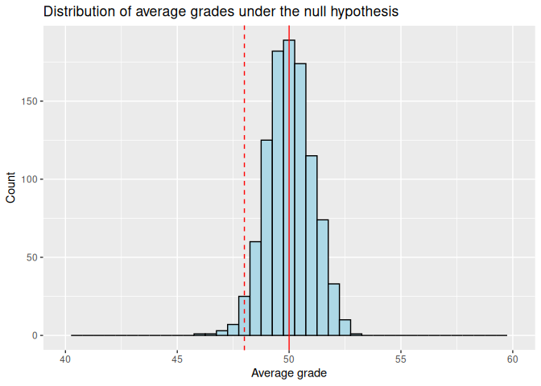
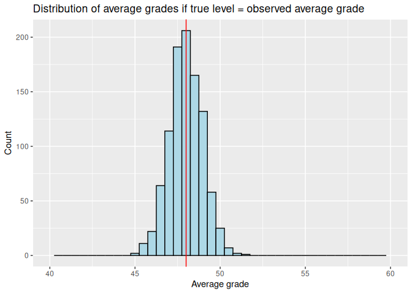

# Lecture 5: hypothesis testing
Romain Ferrali

            X       Date Season                     home                  visitor
    1       1 1888-09-08   1888         Bolton Wanderers             Derby County
    2       2 1888-09-08   1888                  Everton          Accrington F.C.
    3       3 1888-09-08   1888        Preston North End                  Burnley
    4       4 1888-09-08   1888               Stoke City     West Bromwich Albion
    5       5 1888-09-08   1888  Wolverhampton Wanderers              Aston Villa
    6       6 1888-09-15   1888              Aston Villa               Stoke City
    7       7 1888-09-15   1888         Blackburn Rovers          Accrington F.C.
    8       8 1888-09-15   1888         Bolton Wanderers                  Burnley
    9       9 1888-09-15   1888             Derby County     West Bromwich Albion
    10     10 1888-09-15   1888                  Everton             Notts County
    11     11 1888-09-15   1888  Wolverhampton Wanderers        Preston North End
    12     12 1888-09-22   1888              Aston Villa                  Everton
    13     13 1888-09-22   1888         Blackburn Rovers     West Bromwich Albion
    14     14 1888-09-22   1888             Derby County          Accrington F.C.
    15     15 1888-09-22   1888        Preston North End         Bolton Wanderers
    16     16 1888-09-22   1888               Stoke City             Notts County
    17     17 1888-09-22   1888  Wolverhampton Wanderers                  Burnley
    18     18 1888-09-29   1888              Aston Villa             Notts County
    19     19 1888-09-29   1888         Bolton Wanderers                  Everton
    20     20 1888-09-29   1888             Derby County        Preston North End
    21     21 1888-09-29   1888               Stoke City          Accrington F.C.
    22     22 1888-09-29   1888     West Bromwich Albion                  Burnley
    23     23 1888-09-29   1888  Wolverhampton Wanderers         Blackburn Rovers
    24     24 1888-10-06   1888          Accrington F.C.  Wolverhampton Wanderers
    25     25 1888-10-06   1888                  Burnley         Bolton Wanderers
    26     26 1888-10-06   1888                  Everton              Aston Villa
    27     27 1888-10-06   1888             Notts County         Blackburn Rovers
    28     28 1888-10-06   1888        Preston North End               Stoke City
    29     29 1888-10-06   1888     West Bromwich Albion             Derby County
    30     30 1888-10-13   1888          Accrington F.C.             Derby County
    31     31 1888-10-13   1888              Aston Villa         Blackburn Rovers
    32     32 1888-10-13   1888         Bolton Wanderers               Stoke City
    33     33 1888-10-13   1888                  Burnley  Wolverhampton Wanderers
    34     34 1888-10-13   1888             Notts County                  Everton
    35     35 1888-10-13   1888        Preston North End     West Bromwich Albion
    36     36 1888-10-20   1888          Accrington F.C.        Preston North End
    37     37 1888-10-20   1888         Blackburn Rovers  Wolverhampton Wanderers
    38     38 1888-10-20   1888         Bolton Wanderers              Aston Villa
    39     39 1888-10-20   1888             Derby County                  Everton
    40     40 1888-10-20   1888               Stoke City                  Burnley
    41     41 1888-10-20   1888     West Bromwich Albion             Notts County
    42     42 1888-10-27   1888              Aston Villa          Accrington F.C.
    43     43 1888-10-27   1888         Blackburn Rovers               Stoke City
    44     44 1888-10-27   1888                  Everton             Derby County
    45     45 1888-10-27   1888             Notts County                  Burnley
    46     46 1888-10-27   1888        Preston North End  Wolverhampton Wanderers
    47     47 1888-11-03   1888                  Burnley         Blackburn Rovers
    48     48 1888-11-03   1888                  Everton         Bolton Wanderers
    49     49 1888-11-03   1888             Notts County        Preston North End
    50     50 1888-11-03   1888               Stoke City              Aston Villa
    51     51 1888-11-03   1888     West Bromwich Albion          Accrington F.C.
    52     52 1888-11-03   1888  Wolverhampton Wanderers             Derby County
    53     53 1888-11-05   1888     West Bromwich Albion         Bolton Wanderers
    54     54 1888-11-10   1888         Blackburn Rovers                  Everton
    55     55 1888-11-10   1888                  Burnley     West Bromwich Albion
    56     56 1888-11-10   1888             Notts County          Accrington F.C.
    57     57 1888-11-10   1888        Preston North End              Aston Villa
    58     58 1888-11-10   1888  Wolverhampton Wanderers         Bolton Wanderers
    59     59 1888-11-12   1888               Stoke City        Preston North End
    60     60 1888-11-17   1888         Blackburn Rovers              Aston Villa
    61     61 1888-11-17   1888         Bolton Wanderers     West Bromwich Albion
    62     62 1888-11-17   1888                  Burnley                  Everton
    63     63 1888-11-17   1888        Preston North End          Accrington F.C.
    64     64 1888-11-17   1888               Stoke City  Wolverhampton Wanderers
    65     65 1888-11-24   1888          Accrington F.C.     West Bromwich Albion
    66     66 1888-11-24   1888              Aston Villa  Wolverhampton Wanderers
    67     67 1888-11-24   1888         Bolton Wanderers        Preston North End
    68     68 1888-11-24   1888             Derby County         Blackburn Rovers
    69     69 1888-11-24   1888                  Everton                  Burnley
    70     70 1888-11-24   1888             Notts County               Stoke City
    71     71 1888-12-01   1888          Accrington F.C.                  Burnley
    72     72 1888-12-01   1888                  Everton     West Bromwich Albion
    73     73 1888-12-01   1888               Stoke City         Blackburn Rovers
    74     74 1888-12-08   1888         Blackburn Rovers         Bolton Wanderers
    75     75 1888-12-08   1888                  Burnley               Stoke City
    76     76 1888-12-08   1888             Notts County              Aston Villa
    77     77 1888-12-08   1888        Preston North End             Derby County
    78     78 1888-12-08   1888  Wolverhampton Wanderers          Accrington F.C.
    79     79 1888-12-15   1888          Accrington F.C.              Aston Villa
    80     80 1888-12-15   1888         Blackburn Rovers             Notts County
    81     81 1888-12-15   1888                  Burnley        Preston North End
    82     82 1888-12-15   1888               Stoke City                  Everton
    83     83 1888-12-15   1888  Wolverhampton Wanderers     West Bromwich Albion
    84     84 1888-12-22   1888              Aston Villa                  Burnley
    85     85 1888-12-22   1888         Bolton Wanderers          Accrington F.C.
    86     86 1888-12-22   1888             Derby County             Notts County
    87     87 1888-12-22   1888        Preston North End                  Everton
    88     88 1888-12-22   1888     West Bromwich Albion         Blackburn Rovers
    89     89 1888-12-22   1888  Wolverhampton Wanderers               Stoke City
    90     90 1888-12-26   1888             Derby County         Bolton Wanderers
    91     91 1888-12-26   1888     West Bromwich Albion        Preston North End
    92     92 1888-12-29   1888          Accrington F.C.                  Everton
    93     93 1888-12-29   1888              Aston Villa             Derby County
    94     94 1888-12-29   1888         Bolton Wanderers  Wolverhampton Wanderers
    95     95 1888-12-29   1888                  Burnley             Notts County
    96     96 1888-12-29   1888        Preston North End         Blackburn Rovers
    97     97 1888-12-29   1888     West Bromwich Albion               Stoke City
    98     98 1889-01-05   1888                  Burnley              Aston Villa
    99     99 1889-01-05   1888        Preston North End             Notts County
    100   100 1889-01-05   1888     West Bromwich Albion  Wolverhampton Wanderers
    101   101 1889-01-12   1888              Aston Villa         Bolton Wanderers
    102   102 1889-01-12   1888         Blackburn Rovers        Preston North End
    103   103 1889-01-12   1888                  Burnley          Accrington F.C.
    104   104 1889-01-12   1888             Derby County  Wolverhampton Wanderers
    105   105 1889-01-12   1888                  Everton               Stoke City
    106   106 1889-01-12   1888             Notts County     West Bromwich Albion
    107   107 1889-01-19   1888          Accrington F.C.         Blackburn Rovers
    108   108 1889-01-19   1888              Aston Villa     West Bromwich Albion
    109   109 1889-01-19   1888                  Burnley             Derby County
    110   110 1889-01-19   1888                  Everton        Preston North End
    111   111 1889-01-19   1888             Notts County  Wolverhampton Wanderers
    112   112 1889-01-19   1888               Stoke City         Bolton Wanderers
    113   113 1889-01-26   1888          Accrington F.C.             Notts County
    114   114 1889-01-26   1888         Bolton Wanderers         Blackburn Rovers
    115   115 1889-01-26   1888             Derby County               Stoke City
    116   116 1889-01-26   1888     West Bromwich Albion              Aston Villa
    117   117 1889-01-26   1888  Wolverhampton Wanderers                  Everton
    118   118 1889-02-04   1888         Blackburn Rovers                  Burnley
    119   119 1889-02-09   1888              Aston Villa        Preston North End
    120   120 1889-02-09   1888                  Everton  Wolverhampton Wanderers
    121   121 1889-02-23   1888     West Bromwich Albion                  Everton
    122   122 1889-02-23   1888  Wolverhampton Wanderers             Notts County
    123   123 1889-03-02   1888             Derby County                  Burnley
    124   124 1889-03-05   1888             Notts County         Bolton Wanderers
    125   125 1889-03-09   1888         Bolton Wanderers             Notts County
    126   126 1889-03-09   1888             Derby County              Aston Villa
    127   127 1889-03-16   1888             Notts County             Derby County
    128   128 1889-03-23   1888          Accrington F.C.         Bolton Wanderers
    129   129 1889-03-30   1888                  Everton         Blackburn Rovers
    130   130 1889-04-06   1888               Stoke City             Derby County
    131   131 1889-04-15   1888         Blackburn Rovers             Derby County
    132   132 1889-04-20   1888          Accrington F.C.               Stoke City
    133   133 1889-09-07   1889              Aston Villa                  Burnley
    134   134 1889-09-07   1889                  Everton         Blackburn Rovers
    135   135 1889-09-07   1889               Stoke City             Derby County
    136   136 1889-09-07   1889  Wolverhampton Wanderers             Notts County
    137   137 1889-09-14   1889              Aston Villa             Notts County
    138   138 1889-09-14   1889         Blackburn Rovers  Wolverhampton Wanderers
    139   139 1889-09-14   1889         Bolton Wanderers          Accrington F.C.
    140   140 1889-09-14   1889             Derby County     West Bromwich Albion
    141   141 1889-09-14   1889                  Everton                  Burnley
    142   142 1889-09-14   1889        Preston North End               Stoke City
    143   143 1889-09-16   1889  Wolverhampton Wanderers                  Everton
    144   144 1889-09-21   1889              Aston Villa        Preston North End
    145   145 1889-09-21   1889         Blackburn Rovers             Derby County
    146   146 1889-09-21   1889         Bolton Wanderers                  Everton
    147   147 1889-09-21   1889                  Burnley          Accrington F.C.
    148   148 1889-09-21   1889             Notts County     West Bromwich Albion
    149   149 1889-09-28   1889          Accrington F.C.         Blackburn Rovers
    150   150 1889-09-28   1889                  Burnley        Preston North End
    151   151 1889-09-28   1889             Derby County             Notts County
    152   152 1889-09-28   1889                  Everton         Bolton Wanderers
    153   153 1889-09-28   1889               Stoke City  Wolverhampton Wanderers
    154   154 1889-09-28   1889     West Bromwich Albion              Aston Villa
    155   155 1889-09-30   1889                  Everton  Wolverhampton Wanderers
    156   156 1889-10-05   1889                  Burnley              Aston Villa
    157   157 1889-10-05   1889             Derby County                  Everton
    158   158 1889-10-05   1889             Notts County               Stoke City
    159   159 1889-10-05   1889        Preston North End     West Bromwich Albion
    160   160 1889-10-05   1889  Wolverhampton Wanderers          Accrington F.C.
    161   161 1889-10-12   1889          Accrington F.C.             Notts County
    162   162 1889-10-12   1889              Aston Villa             Derby County
    163   163 1889-10-12   1889         Bolton Wanderers        Preston North End
    164   164 1889-10-12   1889                  Burnley     West Bromwich Albion
    165   165 1889-10-12   1889  Wolverhampton Wanderers               Stoke City
    166   166 1889-10-19   1889          Accrington F.C.                  Burnley
    167   167 1889-10-19   1889         Blackburn Rovers              Aston Villa
    168   168 1889-10-19   1889             Derby County        Preston North End
    169   169 1889-10-19   1889             Notts County                  Everton
    170   170 1889-10-19   1889               Stoke City         Bolton Wanderers
    171   171 1889-10-19   1889     West Bromwich Albion  Wolverhampton Wanderers
    172   172 1889-10-26   1889              Aston Villa     West Bromwich Albion
    173   173 1889-10-26   1889         Blackburn Rovers                  Burnley
    174   174 1889-10-26   1889         Bolton Wanderers             Notts County
    175   175 1889-10-26   1889             Derby County               Stoke City
    176   176 1889-10-26   1889                  Everton          Accrington F.C.
    177   177 1889-10-26   1889        Preston North End  Wolverhampton Wanderers
    178   178 1889-11-02   1889              Aston Villa  Wolverhampton Wanderers
    179   179 1889-11-02   1889         Blackburn Rovers        Preston North End
    180   180 1889-11-02   1889                  Everton               Stoke City
    181   181 1889-11-02   1889             Notts County                  Burnley
    182   182 1889-11-04   1889     West Bromwich Albion         Bolton Wanderers
    183   183 1889-11-09   1889         Bolton Wanderers         Blackburn Rovers
    184   184 1889-11-09   1889                  Burnley  Wolverhampton Wanderers
    185   185 1889-11-09   1889             Notts County              Aston Villa
    186   186 1889-11-09   1889        Preston North End          Accrington F.C.
    187   187 1889-11-09   1889               Stoke City                  Everton
    188   188 1889-11-09   1889     West Bromwich Albion             Derby County
    189   189 1889-11-11   1889               Stoke City        Preston North End
    190   190 1889-11-16   1889          Accrington F.C.             Derby County
    191   191 1889-11-16   1889         Blackburn Rovers             Notts County
    192   192 1889-11-16   1889         Bolton Wanderers              Aston Villa
    193   193 1889-11-16   1889                  Everton        Preston North End
    194   194 1889-11-16   1889               Stoke City     West Bromwich Albion
    195   195 1889-11-23   1889              Aston Villa                  Everton
    196   196 1889-11-23   1889         Blackburn Rovers          Accrington F.C.
    197   197 1889-11-23   1889             Derby County  Wolverhampton Wanderers
    198   198 1889-11-23   1889        Preston North End         Bolton Wanderers
    199   199 1889-11-23   1889     West Bromwich Albion                  Burnley
    200   200 1889-11-30   1889          Accrington F.C.              Aston Villa
    201   201 1889-11-30   1889         Blackburn Rovers     West Bromwich Albion
    202   202 1889-11-30   1889         Bolton Wanderers             Derby County
    203   203 1889-11-30   1889        Preston North End                  Burnley
    204   204 1889-12-07   1889              Aston Villa               Stoke City
    205   205 1889-12-07   1889         Bolton Wanderers     West Bromwich Albion
    206   206 1889-12-07   1889                  Everton             Notts County
    207   207 1889-12-07   1889        Preston North End         Blackburn Rovers
    208   208 1889-12-07   1889  Wolverhampton Wanderers                  Burnley
    209   209 1889-12-14   1889             Notts County  Wolverhampton Wanderers
    210   210 1889-12-21   1889         Blackburn Rovers         Bolton Wanderers
    211   211 1889-12-21   1889             Notts County             Derby County
    212   212 1889-12-21   1889        Preston North End                  Everton
    213   213 1889-12-21   1889     West Bromwich Albion          Accrington F.C.
    214   214 1889-12-21   1889  Wolverhampton Wanderers              Aston Villa
    215   215 1889-12-23   1889               Stoke City         Blackburn Rovers
    216   216 1889-12-25   1889        Preston North End              Aston Villa
    217   217 1889-12-26   1889              Aston Villa          Accrington F.C.
    218   218 1889-12-26   1889             Derby County         Bolton Wanderers
    219   219 1889-12-26   1889     West Bromwich Albion        Preston North End
    220   220 1889-12-26   1889  Wolverhampton Wanderers         Blackburn Rovers
    221   221 1889-12-28   1889          Accrington F.C.               Stoke City
    222   222 1889-12-28   1889         Blackburn Rovers                  Everton
    223   223 1889-12-28   1889             Derby County              Aston Villa
    224   224 1889-12-28   1889  Wolverhampton Wanderers     West Bromwich Albion
    225   225 1890-01-01   1889          Accrington F.C.  Wolverhampton Wanderers
    226   226 1890-01-04   1889          Accrington F.C.         Bolton Wanderers
    227   227 1890-01-04   1889         Blackburn Rovers               Stoke City
    228   228 1890-01-04   1889             Derby County                  Burnley
    229   229 1890-01-04   1889                  Everton              Aston Villa
    230   230 1890-01-04   1889     West Bromwich Albion             Notts County
    231   231 1890-01-04   1889  Wolverhampton Wanderers        Preston North End
    232   232 1890-01-11   1889                  Burnley               Stoke City
    233   233 1890-01-11   1889             Notts County         Bolton Wanderers
    234   234 1890-01-11   1889        Preston North End             Derby County
    235   235 1890-01-11   1889     West Bromwich Albion         Blackburn Rovers
    236   236 1890-01-25   1889              Aston Villa         Bolton Wanderers
    237   237 1890-01-25   1889  Wolverhampton Wanderers             Derby County
    238   238 1890-02-08   1889          Accrington F.C.     West Bromwich Albion
    239   239 1890-02-08   1889         Bolton Wanderers               Stoke City
    240   240 1890-02-08   1889                  Burnley                  Everton
    241   241 1890-02-08   1889             Derby County         Blackburn Rovers
    242   242 1890-02-15   1889             Derby County          Accrington F.C.
    243   243 1890-02-18   1889             Notts County         Blackburn Rovers
    244   244 1890-02-22   1889          Accrington F.C.                  Everton
    245   245 1890-02-22   1889                  Burnley         Blackburn Rovers
    246   246 1890-02-24   1889         Bolton Wanderers  Wolverhampton Wanderers
    247   247 1890-03-01   1889                  Burnley         Bolton Wanderers
    248   248 1890-03-01   1889        Preston North End             Notts County
    249   249 1890-03-01   1889               Stoke City          Accrington F.C.
    250   250 1890-03-08   1889                  Burnley             Derby County
    251   251 1890-03-08   1889                  Everton     West Bromwich Albion
    252   252 1890-03-10   1889               Stoke City                  Burnley
    253   253 1890-03-13   1889             Notts County          Accrington F.C.
    254   254 1890-03-15   1889          Accrington F.C.        Preston North End
    255   255 1890-03-15   1889                  Burnley             Notts County
    256   256 1890-03-15   1889                  Everton             Derby County
    257   257 1890-03-15   1889     West Bromwich Albion               Stoke City
    258   258 1890-03-15   1889  Wolverhampton Wanderers         Bolton Wanderers
    259   259 1890-03-17   1889         Bolton Wanderers                  Burnley
    260   260 1890-03-17   1889               Stoke City              Aston Villa
    261   261 1890-03-22   1889     West Bromwich Albion                  Everton
    262   262 1890-03-24   1889               Stoke City             Notts County
    263   263 1890-03-27   1889             Notts County        Preston North End
    264   264 1890-03-31   1889              Aston Villa         Blackburn Rovers
    265   265 1890-09-06   1890          Accrington F.C.                  Burnley
    266   266 1890-09-06   1890         Bolton Wanderers             Notts County
    267   267 1890-09-06   1890             Derby County         Blackburn Rovers
    268   268 1890-09-06   1890     West Bromwich Albion                  Everton
    269   269 1890-09-06   1890  Wolverhampton Wanderers              Aston Villa
    270   270 1890-09-13   1890              Aston Villa             Notts County
    271   271 1890-09-13   1890         Blackburn Rovers          Accrington F.C.
    272   272 1890-09-13   1890         Bolton Wanderers             Derby County
    273   273 1890-09-13   1890                  Everton  Wolverhampton Wanderers
    274   274 1890-09-13   1890        Preston North End     West Bromwich Albion
    275   275 1890-09-13   1890               Sunderland                  Burnley
    276   276 1890-09-15   1890               Sunderland  Wolverhampton Wanderers
    277   277 1890-09-20   1890         Bolton Wanderers                  Everton
    278   278 1890-09-20   1890                  Burnley              Aston Villa
    279   279 1890-09-20   1890             Derby County        Preston North End
    280   280 1890-09-20   1890             Notts County          Accrington F.C.
    281   281 1890-09-20   1890     West Bromwich Albion               Sunderland
    282   282 1890-09-22   1890  Wolverhampton Wanderers             Notts County
    283   283 1890-09-27   1890          Accrington F.C.                  Everton
    284   284 1890-09-27   1890              Aston Villa     West Bromwich Albion
    285   285 1890-09-27   1890         Blackburn Rovers  Wolverhampton Wanderers
    286   286 1890-09-27   1890                  Burnley               Sunderland
    287   287 1890-09-27   1890             Notts County             Derby County
    288   288 1890-09-27   1890        Preston North End         Bolton Wanderers
    289   289 1890-10-02   1890             Notts County         Bolton Wanderers
    290   290 1890-10-04   1890         Bolton Wanderers              Aston Villa
    291   291 1890-10-04   1890                  Everton             Derby County
    292   292 1890-10-04   1890        Preston North End         Blackburn Rovers
    293   293 1890-10-04   1890     West Bromwich Albion                  Burnley
    294   294 1890-10-04   1890  Wolverhampton Wanderers          Accrington F.C.
    295   295 1890-10-11   1890          Accrington F.C.        Preston North End
    296   296 1890-10-11   1890              Aston Villa                  Everton
    297   297 1890-10-11   1890         Blackburn Rovers               Sunderland
    298   298 1890-10-11   1890                  Burnley         Bolton Wanderers
    299   299 1890-10-11   1890             Notts County     West Bromwich Albion
    300   300 1890-10-11   1890  Wolverhampton Wanderers             Derby County
    301   301 1890-10-18   1890                  Burnley         Blackburn Rovers
    302   302 1890-10-18   1890             Derby County              Aston Villa
    303   303 1890-10-18   1890                  Everton         Bolton Wanderers
    304   304 1890-10-18   1890        Preston North End  Wolverhampton Wanderers
    305   305 1890-10-18   1890               Sunderland          Accrington F.C.
    306   306 1890-10-18   1890     West Bromwich Albion             Notts County
    307   307 1890-10-25   1890          Accrington F.C.             Notts County
    308   308 1890-10-25   1890              Aston Villa             Derby County
    309   309 1890-10-25   1890         Blackburn Rovers        Preston North End
    310   310 1890-10-25   1890         Bolton Wanderers               Sunderland
    311   311 1890-10-25   1890                  Everton     West Bromwich Albion
    312   312 1890-10-25   1890  Wolverhampton Wanderers                  Burnley
    313   313 1890-11-01   1890                  Burnley  Wolverhampton Wanderers
    314   314 1890-11-01   1890             Notts County                  Everton
    315   315 1890-11-01   1890        Preston North End          Accrington F.C.
    316   316 1890-11-01   1890               Sunderland         Blackburn Rovers
    317   317 1890-11-01   1890     West Bromwich Albion              Aston Villa
    318   318 1890-11-03   1890     West Bromwich Albion         Bolton Wanderers
    319   319 1890-11-08   1890          Accrington F.C.             Derby County
    320   320 1890-11-08   1890              Aston Villa                  Burnley
    321   321 1890-11-08   1890         Blackburn Rovers                  Everton
    322   322 1890-11-08   1890        Preston North End             Notts County
    323   323 1890-11-08   1890               Sunderland     West Bromwich Albion
    324   324 1890-11-08   1890  Wolverhampton Wanderers         Bolton Wanderers
    325   325 1890-11-15   1890              Aston Villa          Accrington F.C.
    326   326 1890-11-15   1890         Bolton Wanderers        Preston North End
    327   327 1890-11-15   1890                  Burnley             Derby County
    328   328 1890-11-15   1890                  Everton               Sunderland
    329   329 1890-11-15   1890             Notts County         Blackburn Rovers
    330   330 1890-11-22   1890          Accrington F.C.               Sunderland
    331   331 1890-11-22   1890              Aston Villa         Bolton Wanderers
    332   332 1890-11-22   1890         Blackburn Rovers                  Burnley
    333   333 1890-11-22   1890             Derby County     West Bromwich Albion
    334   334 1890-11-22   1890             Notts County  Wolverhampton Wanderers
    335   335 1890-11-22   1890        Preston North End                  Everton
    336   336 1890-11-29   1890                  Burnley          Accrington F.C.
    337   337 1890-11-29   1890                  Everton         Blackburn Rovers
    338   338 1890-11-29   1890             Notts County              Aston Villa
    339   339 1890-11-29   1890     West Bromwich Albion             Derby County
    340   340 1890-11-29   1890  Wolverhampton Wanderers        Preston North End
    341   341 1890-12-06   1890         Blackburn Rovers              Aston Villa
    342   342 1890-12-06   1890                  Burnley     West Bromwich Albion
    343   343 1890-12-06   1890             Derby County          Accrington F.C.
    344   344 1890-12-06   1890             Notts County        Preston North End
    345   345 1890-12-06   1890  Wolverhampton Wanderers                  Everton
    346   346 1890-12-13   1890              Aston Villa         Blackburn Rovers
    347   347 1890-12-13   1890         Bolton Wanderers          Accrington F.C.
    348   348 1890-12-13   1890             Derby County                  Everton
    349   349 1890-12-13   1890     West Bromwich Albion  Wolverhampton Wanderers
    350   350 1890-12-15   1890             Notts County               Sunderland
    351   351 1890-12-20   1890         Blackburn Rovers     West Bromwich Albion
    352   352 1890-12-20   1890                  Burnley             Notts County
    353   353 1890-12-20   1890        Preston North End             Derby County
    354   354 1890-12-20   1890               Sunderland                  Everton
    355   355 1890-12-26   1890              Aston Villa               Sunderland
    356   356 1890-12-26   1890             Derby County         Bolton Wanderers
    357   357 1890-12-26   1890                  Everton          Accrington F.C.
    358   358 1890-12-26   1890  Wolverhampton Wanderers         Blackburn Rovers
    359   359 1890-12-27   1890             Derby County             Notts County
    360   360 1890-12-27   1890                  Everton                  Burnley
    361   361 1890-12-27   1890  Wolverhampton Wanderers               Sunderland
    362   362 1890-12-29   1890         Bolton Wanderers  Wolverhampton Wanderers
    363   363 1891-01-01   1890          Accrington F.C.  Wolverhampton Wanderers
    364   364 1891-01-01   1890                  Everton              Aston Villa
    365   365 1891-01-03   1890         Blackburn Rovers             Derby County
    366   366 1891-01-03   1890                  Everton             Notts County
    367   367 1891-01-03   1890  Wolverhampton Wanderers     West Bromwich Albion
    368   368 1891-01-10   1890          Accrington F.C.         Bolton Wanderers
    369   369 1891-01-10   1890             Derby County  Wolverhampton Wanderers
    370   370 1891-01-10   1890                  Everton        Preston North End
    371   371 1891-01-10   1890               Sunderland              Aston Villa
    372   372 1891-01-24   1890             Derby County                  Burnley
    373   373 1891-01-24   1890        Preston North End              Aston Villa
    374   374 1891-01-24   1890               Sunderland             Notts County
    375   375 1891-02-05   1890        Preston North End                  Burnley
    376   376 1891-02-07   1890             Derby County               Sunderland
    377   377 1891-02-07   1890     West Bromwich Albion        Preston North End
    378   378 1891-02-10   1890             Notts County                  Burnley
    379   379 1891-02-10   1890               Sunderland         Bolton Wanderers
    380   380 1891-02-21   1890        Preston North End               Sunderland
    381   381 1891-03-04   1890          Accrington F.C.         Blackburn Rovers
    382   382 1891-03-07   1890         Blackburn Rovers         Bolton Wanderers
    383   383 1891-03-07   1890                  Burnley        Preston North End
    384   384 1891-03-07   1890     West Bromwich Albion          Accrington F.C.
    385   385 1891-03-09   1890              Aston Villa        Preston North End
    386   386 1891-03-09   1890     West Bromwich Albion         Blackburn Rovers
    387   387 1891-03-14   1890              Aston Villa  Wolverhampton Wanderers
    388   388 1891-03-14   1890         Blackburn Rovers             Notts County
    389   389 1891-03-14   1890         Bolton Wanderers     West Bromwich Albion
    390   390 1891-03-14   1890                  Burnley                  Everton
    391   391 1891-03-14   1890               Sunderland        Preston North End
    392   392 1891-03-21   1890          Accrington F.C.              Aston Villa
    393   393 1891-03-21   1890         Bolton Wanderers                  Burnley
    394   394 1891-03-21   1890               Sunderland             Derby County
    395   395 1891-03-28   1890         Bolton Wanderers         Blackburn Rovers
    396   396 1891-04-18   1890          Accrington F.C.     West Bromwich Albion
    397   397 1891-09-05   1891          Accrington F.C.                  Burnley
    398   398 1891-09-05   1891              Aston Villa         Blackburn Rovers
    399   399 1891-09-05   1891                   Darwen         Bolton Wanderers
    400   400 1891-09-05   1891             Notts County        Preston North End
    401   401 1891-09-05   1891               Stoke City             Derby County
    402   402 1891-09-05   1891               Sunderland  Wolverhampton Wanderers
    403   403 1891-09-05   1891     West Bromwich Albion                  Everton
    404   404 1891-09-07   1891                  Burnley        Preston North End
    405   405 1891-09-07   1891                  Everton                   Darwen
    406   406 1891-09-12   1891              Aston Villa     West Bromwich Albion
    407   407 1891-09-12   1891         Blackburn Rovers             Notts County
    408   408 1891-09-12   1891         Bolton Wanderers                   Darwen
    409   409 1891-09-12   1891             Derby County          Accrington F.C.
    410   410 1891-09-12   1891        Preston North End               Sunderland
    411   411 1891-09-12   1891               Stoke City  Wolverhampton Wanderers
    412   412 1891-09-14   1891  Wolverhampton Wanderers          Accrington F.C.
    413   413 1891-09-19   1891         Bolton Wanderers               Sunderland
    414   414 1891-09-19   1891                  Burnley               Stoke City
    415   415 1891-09-19   1891                   Darwen          Accrington F.C.
    416   416 1891-09-19   1891             Derby County             Notts County
    417   417 1891-09-19   1891                  Everton         Blackburn Rovers
    418   418 1891-09-19   1891        Preston North End              Aston Villa
    419   419 1891-09-19   1891     West Bromwich Albion  Wolverhampton Wanderers
    420   420 1891-09-21   1891        Preston North End                  Burnley
    421   421 1891-09-26   1891          Accrington F.C.                  Everton
    422   422 1891-09-26   1891         Blackburn Rovers                  Burnley
    423   423 1891-09-26   1891         Bolton Wanderers        Preston North End
    424   424 1891-09-26   1891             Notts County               Stoke City
    425   425 1891-09-26   1891  Wolverhampton Wanderers             Derby County
    426   426 1891-09-28   1891              Aston Villa               Sunderland
    427   427 1891-09-28   1891  Wolverhampton Wanderers                   Darwen
    428   428 1891-10-01   1891             Notts County         Bolton Wanderers
    429   429 1891-10-03   1891         Bolton Wanderers          Accrington F.C.
    430   430 1891-10-03   1891                   Darwen               Stoke City
    431   431 1891-10-03   1891             Derby County              Aston Villa
    432   432 1891-10-03   1891        Preston North End  Wolverhampton Wanderers
    433   433 1891-10-03   1891               Sunderland                  Everton
    434   434 1891-10-03   1891     West Bromwich Albion         Blackburn Rovers
    435   435 1891-10-10   1891          Accrington F.C.                   Darwen
    436   436 1891-10-10   1891              Aston Villa         Bolton Wanderers
    437   437 1891-10-10   1891         Blackburn Rovers  Wolverhampton Wanderers
    438   438 1891-10-10   1891                  Everton        Preston North End
    439   439 1891-10-10   1891             Notts County     West Bromwich Albion
    440   440 1891-10-10   1891               Stoke City                  Burnley
    441   441 1891-10-17   1891         Bolton Wanderers                  Everton
    442   442 1891-10-17   1891                  Burnley              Aston Villa
    443   443 1891-10-17   1891                   Darwen         Blackburn Rovers
    444   444 1891-10-17   1891             Derby County               Stoke City
    445   445 1891-10-17   1891     West Bromwich Albion               Sunderland
    446   446 1891-10-17   1891  Wolverhampton Wanderers             Notts County
    447   447 1891-10-24   1891          Accrington F.C.  Wolverhampton Wanderers
    448   448 1891-10-24   1891         Blackburn Rovers        Preston North End
    449   449 1891-10-24   1891         Bolton Wanderers                  Burnley
    450   450 1891-10-24   1891             Derby County                  Everton
    451   451 1891-10-24   1891             Notts County                   Darwen
    452   452 1891-10-24   1891               Stoke City              Aston Villa
    453   453 1891-10-24   1891               Sunderland     West Bromwich Albion
    454   454 1891-10-31   1891         Bolton Wanderers         Blackburn Rovers
    455   455 1891-10-31   1891                   Darwen              Aston Villa
    456   456 1891-10-31   1891             Derby County  Wolverhampton Wanderers
    457   457 1891-10-31   1891        Preston North End                  Everton
    458   458 1891-10-31   1891               Sunderland          Accrington F.C.
    459   459 1891-10-31   1891     West Bromwich Albion             Notts County
    460   460 1891-11-02   1891     West Bromwich Albion         Bolton Wanderers
    461   461 1891-11-07   1891          Accrington F.C.         Bolton Wanderers
    462   462 1891-11-07   1891              Aston Villa             Notts County
    463   463 1891-11-07   1891         Blackburn Rovers               Sunderland
    464   464 1891-11-07   1891                  Everton     West Bromwich Albion
    465   465 1891-11-07   1891               Stoke City        Preston North End
    466   466 1891-11-07   1891  Wolverhampton Wanderers                  Burnley
    467   467 1891-11-09   1891               Stoke City         Blackburn Rovers
    468   468 1891-11-14   1891         Bolton Wanderers               Stoke City
    469   469 1891-11-14   1891                  Burnley          Accrington F.C.
    470   470 1891-11-14   1891                   Darwen                  Everton
    471   471 1891-11-14   1891             Notts County  Wolverhampton Wanderers
    472   472 1891-11-14   1891        Preston North End         Blackburn Rovers
    473   473 1891-11-14   1891               Sunderland             Derby County
    474   474 1891-11-14   1891     West Bromwich Albion              Aston Villa
    475   475 1891-11-21   1891          Accrington F.C.             Notts County
    476   476 1891-11-21   1891              Aston Villa               Stoke City
    477   477 1891-11-21   1891         Blackburn Rovers         Bolton Wanderers
    478   478 1891-11-21   1891             Derby County                   Darwen
    479   479 1891-11-21   1891               Sunderland                  Burnley
    480   480 1891-11-21   1891     West Bromwich Albion        Preston North End
    481   481 1891-11-21   1891  Wolverhampton Wanderers                  Everton
    482   482 1891-11-28   1891                  Burnley     West Bromwich Albion
    483   483 1891-11-28   1891                   Darwen             Derby County
    484   484 1891-11-28   1891                  Everton              Aston Villa
    485   485 1891-11-28   1891             Notts County          Accrington F.C.
    486   486 1891-11-28   1891        Preston North End         Bolton Wanderers
    487   487 1891-11-28   1891               Stoke City               Sunderland
    488   488 1891-11-28   1891  Wolverhampton Wanderers         Blackburn Rovers
    489   489 1891-12-05   1891              Aston Villa                  Burnley
    490   490 1891-12-05   1891         Blackburn Rovers                  Everton
    491   491 1891-12-05   1891         Bolton Wanderers  Wolverhampton Wanderers
    492   492 1891-12-05   1891             Derby County        Preston North End
    493   493 1891-12-05   1891               Stoke City                   Darwen
    494   494 1891-12-05   1891               Sunderland             Notts County
    495   495 1891-12-05   1891     West Bromwich Albion          Accrington F.C.
    496   496 1891-12-12   1891                  Burnley         Blackburn Rovers
    497   497 1891-12-12   1891                  Everton  Wolverhampton Wanderers
    498   498 1891-12-12   1891        Preston North End             Notts County
    499   499 1891-12-12   1891               Stoke City         Bolton Wanderers
    500   500 1891-12-12   1891               Sunderland                   Darwen
    501   501 1891-12-12   1891     West Bromwich Albion             Derby County
    502   502 1891-12-19   1891         Bolton Wanderers     West Bromwich Albion
    503   503 1891-12-19   1891             Derby County                  Burnley
    504   504 1891-12-19   1891             Notts County         Blackburn Rovers
    505   505 1891-12-19   1891               Stoke City          Accrington F.C.
    506   506 1891-12-19   1891  Wolverhampton Wanderers              Aston Villa
    507   507 1891-12-25   1891         Blackburn Rovers                   Darwen
    508   508 1891-12-25   1891                  Everton               Sunderland
    509   509 1891-12-25   1891        Preston North End               Stoke City
    510   510 1891-12-26   1891              Aston Villa                   Darwen
    511   511 1891-12-26   1891         Blackburn Rovers          Accrington F.C.
    512   512 1891-12-26   1891             Derby County         Bolton Wanderers
    513   513 1891-12-26   1891     West Bromwich Albion                  Burnley
    514   514 1891-12-26   1891  Wolverhampton Wanderers               Sunderland
    515   515 1891-12-28   1891              Aston Villa                  Everton
    516   516 1891-12-28   1891  Wolverhampton Wanderers     West Bromwich Albion
    517   517 1892-01-01   1891         Bolton Wanderers             Derby County
    518   518 1892-01-01   1891                   Darwen        Preston North End
    519   519 1892-01-02   1891          Accrington F.C.        Preston North End
    520   520 1892-01-02   1891         Blackburn Rovers             Derby County
    521   521 1892-01-02   1891                  Everton                  Burnley
    522   522 1892-01-02   1891             Notts County              Aston Villa
    523   523 1892-01-02   1891  Wolverhampton Wanderers               Stoke City
    524   524 1892-01-04   1891          Accrington F.C.              Aston Villa
    525   525 1892-01-09   1891          Accrington F.C.               Stoke City
    526   526 1892-01-09   1891              Aston Villa             Derby County
    527   527 1892-01-09   1891                  Burnley                   Darwen
    528   528 1892-01-09   1891             Notts County                  Everton
    529   529 1892-01-09   1891        Preston North End     West Bromwich Albion
    530   530 1892-01-23   1891          Accrington F.C.     West Bromwich Albion
    531   531 1892-02-06   1891             Derby County     West Bromwich Albion
    532   532 1892-02-06   1891               Stoke City             Notts County
    533   533 1892-02-13   1891                  Burnley                  Everton
    534   534 1892-02-20   1891             Notts County             Derby County
    535   535 1892-02-27   1891          Accrington F.C.         Blackburn Rovers
    536   536 1892-02-27   1891                   Darwen             Notts County
    537   537 1892-03-01   1891                   Darwen  Wolverhampton Wanderers
    538   538 1892-03-01   1891             Notts County                  Burnley
    539   539 1892-03-01   1891               Sunderland         Bolton Wanderers
    540   540 1892-03-05   1891          Accrington F.C.               Sunderland
    541   541 1892-03-05   1891         Blackburn Rovers              Aston Villa
    542   542 1892-03-05   1891                  Burnley         Bolton Wanderers
    543   543 1892-03-05   1891                  Everton               Stoke City
    544   544 1892-03-05   1891        Preston North End             Derby County
    545   545 1892-03-12   1891              Aston Villa          Accrington F.C.
    546   546 1892-03-12   1891         Blackburn Rovers     West Bromwich Albion
    547   547 1892-03-12   1891               Stoke City                  Everton
    548   548 1892-03-12   1891               Sunderland        Preston North End
    549   549 1892-03-19   1891         Blackburn Rovers               Stoke City
    550   550 1892-03-19   1891             Derby County               Sunderland
    551   551 1892-03-19   1891                  Everton          Accrington F.C.
    552   552 1892-03-26   1891         Bolton Wanderers             Notts County
    553   553 1892-03-26   1891                  Burnley  Wolverhampton Wanderers
    554   554 1892-03-26   1891             Derby County         Blackburn Rovers
    555   555 1892-03-26   1891               Sunderland              Aston Villa
    556   556 1892-04-02   1891          Accrington F.C.             Derby County
    557   557 1892-04-02   1891         Bolton Wanderers              Aston Villa
    558   558 1892-04-02   1891                   Darwen                  Burnley
    559   559 1892-04-02   1891               Sunderland               Stoke City
    560   560 1892-04-02   1891  Wolverhampton Wanderers        Preston North End
    561   561 1892-04-04   1891     West Bromwich Albion                   Darwen
    562   562 1892-04-09   1891             Notts County               Sunderland
    563   563 1892-04-11   1891     West Bromwich Albion               Stoke City
    564   564 1892-04-15   1891                  Burnley             Notts County
    565   565 1892-04-15   1891                  Everton             Derby County
    566   566 1892-04-15   1891        Preston North End          Accrington F.C.
    567   567 1892-04-16   1891              Aston Villa        Preston North End
    568   568 1892-04-16   1891                  Burnley             Derby County
    569   569 1892-04-16   1891                   Darwen     West Bromwich Albion
    570   570 1892-04-16   1891                  Everton             Notts County
    571   571 1892-04-16   1891               Sunderland         Blackburn Rovers
    572   572 1892-04-16   1891  Wolverhampton Wanderers         Bolton Wanderers
    573   573 1892-04-18   1891              Aston Villa  Wolverhampton Wanderers
    574   574 1892-04-18   1891                  Everton         Bolton Wanderers
    575   575 1892-04-18   1891        Preston North End                   Darwen
    576   576 1892-04-23   1891                   Darwen               Sunderland
    577   577 1892-04-23   1891               Stoke City     West Bromwich Albion
    578   578 1892-04-30   1891                  Burnley               Sunderland
    579   579 1892-09-03   1892          Accrington F.C.               Sunderland
    580   580 1892-09-03   1892         Blackburn Rovers        Manchester United
    581   581 1892-09-03   1892                  Everton        Nottingham Forest
    582   582 1892-09-03   1892             Notts County      Sheffield Wednesday
    583   583 1892-09-03   1892        Preston North End         Bolton Wanderers
    584   584 1892-09-03   1892               Stoke City             Derby County
    585   585 1892-09-03   1892  Wolverhampton Wanderers                  Burnley
    586   586 1892-09-03   1892          Birmingham City                Port Vale
    587   587 1892-09-03   1892            Burton Swifts          Crewe Alexandra
    588   588 1892-09-03   1892             Grimsby Town       Northwich Victoria
    589   589 1892-09-03   1892          Manchester City                   Bootle
    590   590 1892-09-03   1892         Sheffield United             Lincoln City
    591   591 1892-09-03   1892                  Walsall                   Darwen
    592   592 1892-09-05   1892                  Burnley              Aston Villa
    593   593 1892-09-10   1892              Aston Villa                  Everton
    594   594 1892-09-10   1892         Bolton Wanderers     West Bromwich Albion
    595   595 1892-09-10   1892             Derby County        Preston North End
    596   596 1892-09-10   1892        Manchester United                  Burnley
    597   597 1892-09-10   1892        Nottingham Forest               Stoke City
    598   598 1892-09-10   1892      Sheffield Wednesday          Accrington F.C.
    599   599 1892-09-10   1892               Sunderland             Notts County
    600   600 1892-09-10   1892  Wolverhampton Wanderers         Blackburn Rovers
    601   601 1892-09-10   1892                   Bootle         Sheffield United
    602   602 1892-09-10   1892          Crewe Alexandra             Grimsby Town
    603   603 1892-09-10   1892                   Darwen            Burton Swifts
    604   604 1892-09-10   1892       Northwich Victoria          Manchester City
    605   605 1892-09-10   1892                  Walsall          Birmingham City
    606   606 1892-09-12   1892        Preston North End      Sheffield Wednesday
    607   607 1892-09-12   1892               Stoke City              Aston Villa
    608   608 1892-09-12   1892          Manchester City                Port Vale
    609   609 1892-09-17   1892              Aston Villa               Sunderland
    610   610 1892-09-17   1892         Blackburn Rovers                  Everton
    611   611 1892-09-17   1892         Bolton Wanderers      Sheffield Wednesday
    612   612 1892-09-17   1892                  Burnley        Manchester United
    613   613 1892-09-17   1892             Notts County             Derby County
    614   614 1892-09-17   1892        Preston North End        Nottingham Forest
    615   615 1892-09-17   1892               Stoke City          Accrington F.C.
    616   616 1892-09-17   1892     West Bromwich Albion  Wolverhampton Wanderers
    617   617 1892-09-17   1892                   Bootle                Port Vale
    618   618 1892-09-17   1892          Crewe Alexandra       Northwich Victoria
    619   619 1892-09-17   1892             Grimsby Town                   Darwen
    620   620 1892-09-17   1892         Sheffield United          Birmingham City
    621   621 1892-09-17   1892                  Walsall          Manchester City
    622   622 1892-09-19   1892     West Bromwich Albion              Aston Villa
    623   623 1892-09-24   1892          Accrington F.C.      Sheffield Wednesday
    624   624 1892-09-24   1892         Bolton Wanderers              Aston Villa
    625   625 1892-09-24   1892                  Burnley               Stoke City
    626   626 1892-09-24   1892             Derby County     West Bromwich Albion
    627   627 1892-09-24   1892                  Everton        Manchester United
    628   628 1892-09-24   1892        Nottingham Forest        Preston North End
    629   629 1892-09-24   1892               Sunderland         Blackburn Rovers
    630   630 1892-09-24   1892  Wolverhampton Wanderers             Notts County
    631   631 1892-09-24   1892          Birmingham City             Lincoln City
    632   632 1892-09-24   1892            Burton Swifts                   Bootle
    633   633 1892-09-24   1892                   Darwen                  Walsall
    634   634 1892-09-24   1892          Manchester City       Northwich Victoria
    635   635 1892-09-24   1892                Port Vale          Crewe Alexandra
    636   636 1892-09-27   1892         Sheffield United             Grimsby Town
    637   637 1892-10-01   1892         Blackburn Rovers          Accrington F.C.
    638   638 1892-10-01   1892         Bolton Wanderers  Wolverhampton Wanderers
    639   639 1892-10-01   1892             Derby County        Nottingham Forest
    640   640 1892-10-01   1892                  Everton              Aston Villa
    641   641 1892-10-01   1892             Notts County        Preston North End
    642   642 1892-10-01   1892      Sheffield Wednesday                  Burnley
    643   643 1892-10-01   1892               Sunderland               Stoke City
    644   644 1892-10-01   1892     West Bromwich Albion        Manchester United
    645   645 1892-10-01   1892          Crewe Alexandra            Burton Swifts
    646   646 1892-10-01   1892             Grimsby Town          Birmingham City
    647   647 1892-10-01   1892             Lincoln City         Sheffield United
    648   648 1892-10-01   1892          Manchester City                  Walsall
    649   649 1892-10-01   1892       Northwich Victoria                   Bootle
    650   650 1892-10-01   1892                Port Vale                   Darwen
    651   651 1892-10-03   1892      Sheffield Wednesday        Nottingham Forest
    652   652 1892-10-03   1892            Burton Swifts          Birmingham City
    653   653 1892-10-06   1892             Notts County         Bolton Wanderers
    654   654 1892-10-08   1892          Accrington F.C.         Bolton Wanderers
    655   655 1892-10-08   1892                  Burnley             Derby County
    656   656 1892-10-08   1892                  Everton               Sunderland
    657   657 1892-10-08   1892        Manchester United     West Bromwich Albion
    658   658 1892-10-08   1892             Notts County        Nottingham Forest
    659   659 1892-10-08   1892        Preston North End         Blackburn Rovers
    660   660 1892-10-08   1892  Wolverhampton Wanderers              Aston Villa
    661   661 1892-10-08   1892          Birmingham City          Crewe Alexandra
    662   662 1892-10-08   1892                   Darwen          Manchester City
    663   663 1892-10-08   1892             Grimsby Town                   Bootle
    664   664 1892-10-08   1892                Port Vale            Burton Swifts
    665   665 1892-10-08   1892                  Walsall             Lincoln City
    666   666 1892-10-10   1892              Aston Villa               Stoke City
    667   667 1892-10-10   1892                Port Vale          Manchester City
    668   668 1892-10-15   1892              Aston Villa        Nottingham Forest
    669   669 1892-10-15   1892         Blackburn Rovers      Sheffield Wednesday
    670   670 1892-10-15   1892         Bolton Wanderers               Stoke City
    671   671 1892-10-15   1892        Manchester United  Wolverhampton Wanderers
    672   672 1892-10-15   1892        Preston North End                  Burnley
    673   673 1892-10-15   1892               Sunderland          Accrington F.C.
    674   674 1892-10-15   1892     West Bromwich Albion                  Everton
    675   675 1892-10-15   1892         Sheffield United                   Darwen
    676   676 1892-10-19   1892             Derby County             Notts County
    677   677 1892-10-19   1892        Manchester United                  Everton
    678   678 1892-10-20   1892        Nottingham Forest         Bolton Wanderers
    679   679 1892-10-22   1892                  Burnley             Notts County
    680   680 1892-10-22   1892             Derby County         Blackburn Rovers
    681   681 1892-10-22   1892                  Everton          Accrington F.C.
    682   682 1892-10-22   1892        Preston North End              Aston Villa
    683   683 1892-10-22   1892      Sheffield Wednesday        Manchester United
    684   684 1892-10-22   1892               Stoke City        Nottingham Forest
    685   685 1892-10-22   1892               Sunderland     West Bromwich Albion
    686   686 1892-10-22   1892  Wolverhampton Wanderers         Bolton Wanderers
    687   687 1892-10-22   1892                   Darwen                   Bootle
    688   688 1892-10-22   1892             Lincoln City                Port Vale
    689   689 1892-10-22   1892          Manchester City          Birmingham City
    690   690 1892-10-22   1892       Northwich Victoria          Crewe Alexandra
    691   691 1892-10-22   1892                  Walsall             Grimsby Town
    692   692 1892-10-29   1892              Aston Villa             Derby County
    693   693 1892-10-29   1892         Blackburn Rovers        Preston North End
    694   694 1892-10-29   1892         Bolton Wanderers                  Everton
    695   695 1892-10-29   1892                  Burnley          Accrington F.C.
    696   696 1892-10-29   1892        Nottingham Forest        Manchester United
    697   697 1892-10-29   1892      Sheffield Wednesday               Sunderland
    698   698 1892-10-29   1892               Stoke City  Wolverhampton Wanderers
    699   699 1892-10-29   1892     West Bromwich Albion             Notts County
    700   700 1892-10-29   1892          Birmingham City                   Darwen
    701   701 1892-11-05   1892          Accrington F.C.        Preston North End
    702   702 1892-11-05   1892              Aston Villa     West Bromwich Albion
    703   703 1892-11-05   1892             Derby County                  Everton
    704   704 1892-11-05   1892        Manchester United         Blackburn Rovers
    705   705 1892-11-05   1892             Notts County               Stoke City
    706   706 1892-11-05   1892      Sheffield Wednesday         Bolton Wanderers
    707   707 1892-11-05   1892               Sunderland                  Burnley
    708   708 1892-11-05   1892  Wolverhampton Wanderers        Nottingham Forest
    709   709 1892-11-05   1892                   Bootle          Birmingham City
    710   710 1892-11-05   1892            Burton Swifts       Northwich Victoria
    711   711 1892-11-05   1892          Crewe Alexandra                  Walsall
    712   712 1892-11-05   1892                   Darwen                Port Vale
    713   713 1892-11-05   1892             Grimsby Town          Manchester City
    714   714 1892-11-07   1892     West Bromwich Albion         Bolton Wanderers
    715   715 1892-11-12   1892         Blackburn Rovers  Wolverhampton Wanderers
    716   716 1892-11-12   1892             Derby County                  Burnley
    717   717 1892-11-12   1892                  Everton               Stoke City
    718   718 1892-11-12   1892        Manchester United             Notts County
    719   719 1892-11-12   1892        Nottingham Forest              Aston Villa
    720   720 1892-11-12   1892     West Bromwich Albion          Accrington F.C.
    721   721 1892-11-12   1892          Birmingham City            Burton Swifts
    722   722 1892-11-12   1892             Lincoln City                   Darwen
    723   723 1892-11-12   1892                Port Vale                   Bootle
    724   724 1892-11-14   1892               Stoke City        Preston North End
    725   725 1892-11-19   1892         Bolton Wanderers        Preston North End
    726   726 1892-11-19   1892        Manchester United              Aston Villa
    727   727 1892-11-19   1892             Notts County     West Bromwich Albion
    728   728 1892-11-19   1892      Sheffield Wednesday         Blackburn Rovers
    729   729 1892-11-19   1892               Stoke City                  Burnley
    730   730 1892-11-19   1892               Sunderland        Nottingham Forest
    731   731 1892-11-19   1892  Wolverhampton Wanderers          Accrington F.C.
    732   732 1892-11-19   1892                   Darwen         Sheffield United
    733   733 1892-11-26   1892          Accrington F.C.        Manchester United
    734   734 1892-11-26   1892              Aston Villa        Preston North End
    735   735 1892-11-26   1892         Blackburn Rovers         Bolton Wanderers
    736   736 1892-11-26   1892                  Burnley        Nottingham Forest
    737   737 1892-11-26   1892             Derby County  Wolverhampton Wanderers
    738   738 1892-11-26   1892                  Everton      Sheffield Wednesday
    739   739 1892-11-26   1892             Notts County               Sunderland
    740   740 1892-11-26   1892     West Bromwich Albion               Stoke City
    741   741 1892-11-26   1892          Crewe Alexandra                Port Vale
    742   742 1892-11-26   1892          Manchester City            Burton Swifts
    743   743 1892-11-26   1892       Northwich Victoria                  Walsall
    744   744 1892-11-26   1892         Sheffield United                   Bootle
    745   745 1892-12-01   1892        Nottingham Forest      Sheffield Wednesday
    746   746 1892-12-03   1892         Bolton Wanderers        Manchester United
    747   747 1892-12-03   1892                  Burnley         Blackburn Rovers
    748   748 1892-12-03   1892             Derby County          Accrington F.C.
    749   749 1892-12-03   1892        Nottingham Forest               Sunderland
    750   750 1892-12-03   1892        Preston North End                  Everton
    751   751 1892-12-03   1892      Sheffield Wednesday              Aston Villa
    752   752 1892-12-03   1892  Wolverhampton Wanderers               Stoke City
    753   753 1892-12-03   1892          Birmingham City         Sheffield United
    754   754 1892-12-03   1892                   Bootle       Northwich Victoria
    755   755 1892-12-03   1892                   Darwen          Crewe Alexandra
    756   756 1892-12-03   1892             Grimsby Town            Burton Swifts
    757   757 1892-12-03   1892                Port Vale             Lincoln City
    758   758 1892-12-08   1892             Notts County                  Burnley
    759   759 1892-12-10   1892          Accrington F.C.             Notts County
    760   760 1892-12-10   1892              Aston Villa         Blackburn Rovers
    761   761 1892-12-10   1892                  Everton  Wolverhampton Wanderers
    762   762 1892-12-10   1892        Manchester United         Bolton Wanderers
    763   763 1892-12-10   1892        Nottingham Forest                  Burnley
    764   764 1892-12-10   1892      Sheffield Wednesday             Derby County
    765   765 1892-12-10   1892     West Bromwich Albion        Preston North End
    766   766 1892-12-10   1892                   Darwen          Birmingham City
    767   767 1892-12-10   1892                Port Vale         Sheffield United
    768   768 1892-12-17   1892          Accrington F.C.     West Bromwich Albion
    769   769 1892-12-17   1892         Blackburn Rovers                  Burnley
    770   770 1892-12-17   1892             Derby County              Aston Villa
    771   771 1892-12-17   1892             Notts County                  Everton
    772   772 1892-12-17   1892               Stoke City      Sheffield Wednesday
    773   773 1892-12-17   1892               Sunderland        Preston North End
    774   774 1892-12-17   1892  Wolverhampton Wanderers        Manchester United
    775   775 1892-12-17   1892          Birmingham City                  Walsall
    776   776 1892-12-17   1892                   Bootle             Grimsby Town
    777   777 1892-12-17   1892            Burton Swifts             Lincoln City
    778   778 1892-12-17   1892          Manchester City                   Darwen
    779   779 1892-12-17   1892         Sheffield United                Port Vale
    780   780 1892-12-24   1892              Aston Villa         Bolton Wanderers
    781   781 1892-12-24   1892         Blackburn Rovers             Notts County
    782   782 1892-12-24   1892             Derby County               Stoke City
    783   783 1892-12-24   1892                  Everton                  Burnley
    784   784 1892-12-24   1892        Manchester United      Sheffield Wednesday
    785   785 1892-12-24   1892        Nottingham Forest  Wolverhampton Wanderers
    786   786 1892-12-24   1892     West Bromwich Albion               Sunderland
    787   787 1892-12-24   1892            Burton Swifts                   Darwen
    788   788 1892-12-24   1892             Grimsby Town          Crewe Alexandra
    789   789 1892-12-24   1892             Lincoln City          Manchester City
    790   790 1892-12-24   1892       Northwich Victoria          Birmingham City
    791   791 1892-12-24   1892                  Walsall                   Bootle
    792   792 1892-12-26   1892          Accrington F.C.               Stoke City
    793   793 1892-12-26   1892             Derby County         Bolton Wanderers
    794   794 1892-12-26   1892        Preston North End        Manchester United
    795   795 1892-12-26   1892     West Bromwich Albion         Blackburn Rovers
    796   796 1892-12-26   1892  Wolverhampton Wanderers               Sunderland
    797   797 1892-12-26   1892             Lincoln City          Crewe Alexandra
    798   798 1892-12-27   1892  Wolverhampton Wanderers     West Bromwich Albion
    799   799 1892-12-31   1892          Accrington F.C.  Wolverhampton Wanderers
    800   800 1892-12-31   1892         Blackburn Rovers        Nottingham Forest
    801   801 1892-12-31   1892                  Burnley     West Bromwich Albion
    802   802 1892-12-31   1892        Manchester United             Derby County
    803   803 1892-12-31   1892             Notts County              Aston Villa
    804   804 1892-12-31   1892        Preston North End               Stoke City
    805   805 1892-12-31   1892                   Bootle                   Darwen
    806   806 1892-12-31   1892          Crewe Alexandra          Birmingham City
    807   807 1892-12-31   1892       Northwich Victoria             Lincoln City
    808   808 1892-12-31   1892                Port Vale                  Walsall
    809   809 1893-01-02   1892          Accrington F.C.         Blackburn Rovers
    810   810 1893-01-02   1892         Bolton Wanderers             Derby County
    811   811 1893-01-02   1892      Sheffield Wednesday     West Bromwich Albion
    812   812 1893-01-02   1892               Sunderland  Wolverhampton Wanderers
    813   813 1893-01-03   1892               Sunderland                  Everton
    814   814 1893-01-07   1892              Aston Villa      Sheffield Wednesday
    815   815 1893-01-07   1892         Blackburn Rovers             Derby County
    816   816 1893-01-07   1892                  Everton             Notts County
    817   817 1893-01-07   1892        Nottingham Forest          Accrington F.C.
    818   818 1893-01-07   1892        Preston North End               Sunderland
    819   819 1893-01-07   1892               Stoke City        Manchester United
    820   820 1893-01-07   1892     West Bromwich Albion                  Burnley
    821   821 1893-01-07   1892          Crewe Alexandra                   Bootle
    822   822 1893-01-07   1892             Lincoln City          Birmingham City
    823   823 1893-01-07   1892       Northwich Victoria             Grimsby Town
    824   824 1893-01-07   1892         Sheffield United                  Walsall
    825   825 1893-01-12   1892        Nottingham Forest                  Everton
    826   826 1893-01-14   1892          Accrington F.C.                  Burnley
    827   827 1893-01-14   1892                  Everton     West Bromwich Albion
    828   828 1893-01-14   1892        Manchester United        Nottingham Forest
    829   829 1893-01-14   1892             Notts County         Blackburn Rovers
    830   830 1893-01-14   1892      Sheffield Wednesday        Preston North End
    831   831 1893-01-14   1892               Stoke City         Bolton Wanderers
    832   832 1893-01-14   1892               Sunderland              Aston Villa
    833   833 1893-01-14   1892          Birmingham City       Northwich Victoria
    834   834 1893-01-14   1892            Burton Swifts          Manchester City
    835   835 1893-01-14   1892                   Darwen             Lincoln City
    836   836 1893-01-14   1892             Grimsby Town                Port Vale
    837   837 1893-01-14   1892                  Walsall          Crewe Alexandra
    838   838 1893-01-21   1892                   Bootle          Manchester City
    839   839 1893-01-23   1892         Sheffield United       Northwich Victoria
    840   840 1893-01-26   1892             Notts County        Manchester United
    841   841 1893-01-28   1892         Blackburn Rovers     West Bromwich Albion
    842   842 1893-01-28   1892        Nottingham Forest             Derby County
    843   843 1893-01-28   1892               Stoke City                  Everton
    844   844 1893-01-28   1892               Sunderland      Sheffield Wednesday
    845   845 1893-01-28   1892          Crewe Alexandra             Lincoln City
    846   846 1893-01-30   1892          Manchester City             Grimsby Town
    847   847 1893-02-04   1892            Burton Swifts                  Walsall
    848   848 1893-02-04   1892          Crewe Alexandra          Manchester City
    849   849 1893-02-06   1892         Sheffield United            Burton Swifts
    850   850 1893-02-11   1892         Blackburn Rovers              Aston Villa
    851   851 1893-02-11   1892                  Burnley         Bolton Wanderers
    852   852 1893-02-11   1892             Derby County        Manchester United
    853   853 1893-02-11   1892                  Everton        Preston North End
    854   854 1893-02-11   1892             Notts County          Accrington F.C.
    855   855 1893-02-11   1892               Stoke City     West Bromwich Albion
    856   856 1893-02-11   1892  Wolverhampton Wanderers      Sheffield Wednesday
    857   857 1893-02-11   1892             Lincoln City            Burton Swifts
    858   858 1893-02-11   1892                Port Vale             Grimsby Town
    859   859 1893-02-11   1892                  Walsall       Northwich Victoria
    860   860 1893-02-13   1892      Sheffield Wednesday                  Everton
    861   861 1893-02-14   1892               Sunderland         Bolton Wanderers
    862   862 1893-02-14   1892                   Darwen       Northwich Victoria
    863   863 1893-02-18   1892          Birmingham City                   Bootle
    864   864 1893-02-18   1892             Grimsby Town             Lincoln City
    865   865 1893-02-18   1892          Manchester City          Crewe Alexandra
    866   866 1893-02-18   1892       Northwich Victoria         Sheffield United
    867   867 1893-02-18   1892                  Walsall                Port Vale
    868   868 1893-02-25   1892          Accrington F.C.                  Everton
    869   869 1893-02-25   1892         Blackburn Rovers               Stoke City
    870   870 1893-02-25   1892         Bolton Wanderers                  Burnley
    871   871 1893-02-25   1892        Nottingham Forest             Notts County
    872   872 1893-02-25   1892  Wolverhampton Wanderers             Derby County
    873   873 1893-02-25   1892          Birmingham City             Grimsby Town
    874   874 1893-02-25   1892                   Bootle            Burton Swifts
    875   875 1893-02-25   1892          Crewe Alexandra                   Darwen
    876   876 1893-02-25   1892             Lincoln City       Northwich Victoria
    877   877 1893-03-02   1892        Nottingham Forest     West Bromwich Albion
    878   878 1893-03-04   1892         Bolton Wanderers          Accrington F.C.
    879   879 1893-03-04   1892        Manchester United               Sunderland
    880   880 1893-03-04   1892             Lincoln City             Grimsby Town
    881   881 1893-03-04   1892          Manchester City         Sheffield United
    882   882 1893-03-04   1892                Port Vale       Northwich Victoria
    883   883 1893-03-04   1892                  Walsall            Burton Swifts
    884   884 1893-03-06   1892              Aston Villa        Manchester United
    885   885 1893-03-11   1892        Nottingham Forest         Blackburn Rovers
    886   886 1893-03-11   1892      Sheffield Wednesday  Wolverhampton Wanderers
    887   887 1893-03-11   1892               Stoke City             Notts County
    888   888 1893-03-11   1892               Sunderland             Derby County
    889   889 1893-03-18   1892          Accrington F.C.        Nottingham Forest
    890   890 1893-03-18   1892              Aston Villa             Notts County
    891   891 1893-03-18   1892         Bolton Wanderers         Blackburn Rovers
    892   892 1893-03-18   1892                  Burnley        Preston North End
    893   893 1893-03-18   1892               Stoke City               Sunderland
    894   894 1893-03-18   1892     West Bromwich Albion      Sheffield Wednesday
    895   895 1893-03-18   1892  Wolverhampton Wanderers                  Everton
    896   896 1893-03-18   1892                   Bootle                  Walsall
    897   897 1893-03-18   1892            Burton Swifts                Port Vale
    898   898 1893-03-18   1892                   Darwen             Grimsby Town
    899   899 1893-03-18   1892         Sheffield United          Crewe Alexandra
    900   900 1893-03-25   1892              Aston Villa          Accrington F.C.
    901   901 1893-03-25   1892         Bolton Wanderers             Notts County
    902   902 1893-03-25   1892             Derby County      Sheffield Wednesday
    903   903 1893-03-25   1892                   Bootle          Crewe Alexandra
    904   904 1893-03-25   1892       Northwich Victoria            Burton Swifts
    905   905 1893-03-25   1892                Port Vale          Birmingham City
    906   906 1893-03-25   1892         Sheffield United          Manchester City
    907   907 1893-03-31   1892          Accrington F.C.             Derby County
    908   908 1893-03-31   1892         Blackburn Rovers               Sunderland
    909   909 1893-03-31   1892         Bolton Wanderers        Nottingham Forest
    910   910 1893-03-31   1892                  Burnley      Sheffield Wednesday
    911   911 1893-03-31   1892        Manchester United               Stoke City
    912   912 1893-03-31   1892        Preston North End             Notts County
    913   913 1893-03-31   1892             Grimsby Town         Sheffield United
    914   914 1893-03-31   1892             Lincoln City                  Walsall
    915   915 1893-04-01   1892         Bolton Wanderers               Sunderland
    916   916 1893-04-01   1892                  Burnley  Wolverhampton Wanderers
    917   917 1893-04-01   1892                  Everton         Blackburn Rovers
    918   918 1893-04-01   1892        Manchester United        Preston North End
    919   919 1893-04-01   1892      Sheffield Wednesday               Stoke City
    920   920 1893-04-01   1892     West Bromwich Albion             Derby County
    921   921 1893-04-01   1892          Birmingham City          Manchester City
    922   922 1893-04-01   1892            Burton Swifts         Sheffield United
    923   923 1893-04-01   1892             Grimsby Town                  Walsall
    924   924 1893-04-01   1892             Lincoln City                   Bootle
    925   925 1893-04-03   1892              Aston Villa  Wolverhampton Wanderers
    926   926 1893-04-03   1892                  Everton         Bolton Wanderers
    927   927 1893-04-03   1892        Preston North End          Accrington F.C.
    928   928 1893-04-03   1892      Sheffield Wednesday             Notts County
    929   929 1893-04-03   1892               Stoke City         Blackburn Rovers
    930   930 1893-04-03   1892     West Bromwich Albion        Nottingham Forest
    931   931 1893-04-04   1892              Aston Villa                  Burnley
    932   932 1893-04-04   1892               Sunderland        Manchester United
    933   933 1893-04-08   1892                  Burnley                  Everton
    934   934 1893-04-08   1892             Derby County               Sunderland
    935   935 1893-04-08   1892        Manchester United          Accrington F.C.
    936   936 1893-04-08   1892             Notts County  Wolverhampton Wanderers
    937   937 1893-04-08   1892            Burton Swifts             Grimsby Town
    938   938 1893-04-08   1892          Manchester City             Lincoln City
    939   939 1893-04-08   1892       Northwich Victoria                Port Vale
    940   940 1893-04-10   1892        Preston North End  Wolverhampton Wanderers
    941   941 1893-04-12   1892          Crewe Alexandra         Sheffield United
    942   942 1893-04-13   1892        Preston North End     West Bromwich Albion
    943   943 1893-04-15   1892          Accrington F.C.              Aston Villa
    944   944 1893-04-15   1892                  Burnley               Sunderland
    945   945 1893-04-15   1892                  Everton             Derby County
    946   946 1893-04-15   1892  Wolverhampton Wanderers        Preston North End
    947   947 1893-04-15   1892                   Bootle             Lincoln City
    948   948 1893-04-15   1892       Northwich Victoria                   Darwen
    949   949 1893-04-15   1892                  Walsall         Sheffield United
    950   950 1893-04-17   1892        Preston North End             Derby County
    951   951 1893-09-02   1893              Aston Villa     West Bromwich Albion
    952   952 1893-09-02   1893         Bolton Wanderers               Stoke City
    953   953 1893-09-02   1893                   Darwen         Blackburn Rovers
    954   954 1893-09-02   1893                  Everton         Sheffield United
    955   955 1893-09-02   1893        Manchester United                  Burnley
    956   956 1893-09-02   1893        Nottingham Forest  Wolverhampton Wanderers
    957   957 1893-09-02   1893        Preston North End             Derby County
    958   958 1893-09-02   1893      Sheffield Wednesday               Sunderland
    959   959 1893-09-02   1893                  Arsenal         Newcastle United
    960   960 1893-09-02   1893          Crewe Alexandra             Notts County
    961   961 1893-09-02   1893             Grimsby Town       Northwich Victoria
    962   962 1893-09-02   1893             Lincoln City           Rotherham Town
    963   963 1893-09-02   1893 Middlesbrough Ironopolis                Liverpool
    964   964 1893-09-02   1893                Port Vale          Manchester City
    965   965 1893-09-02   1893                  Walsall          Birmingham City
    966   966 1893-09-04   1893                  Burnley                   Darwen
    967   967 1893-09-04   1893                  Everton        Nottingham Forest
    968   968 1893-09-04   1893         Sheffield United             Derby County
    969   969 1893-09-04   1893  Wolverhampton Wanderers      Sheffield Wednesday
    970   970 1893-09-04   1893          Birmingham City           Rotherham Town
    971   971 1893-09-09   1893         Blackburn Rovers      Sheffield Wednesday
    972   972 1893-09-09   1893                  Burnley        Preston North End
    973   973 1893-09-09   1893             Derby County                  Everton
    974   974 1893-09-09   1893         Sheffield United                   Darwen
    975   975 1893-09-09   1893               Stoke City        Nottingham Forest
    976   976 1893-09-09   1893               Sunderland              Aston Villa
    977   977 1893-09-09   1893     West Bromwich Albion        Manchester United
    978   978 1893-09-09   1893  Wolverhampton Wanderers         Bolton Wanderers
    979   979 1893-09-09   1893          Birmingham City            Burton Swifts
    980   980 1893-09-09   1893                Liverpool             Lincoln City
    981   981 1893-09-09   1893          Manchester City Middlesbrough Ironopolis
    982   982 1893-09-09   1893       Northwich Victoria          Crewe Alexandra
    983   983 1893-09-09   1893             Notts County                  Arsenal
    984   984 1893-09-09   1893           Rotherham Town             Grimsby Town
    985   985 1893-09-09   1893                  Walsall                Port Vale
    986   986 1893-09-11   1893              Aston Villa               Stoke City
    987   987 1893-09-11   1893                  Arsenal                  Walsall
    988   988 1893-09-11   1893          Manchester City            Burton Swifts
    989   989 1893-09-11   1893       Northwich Victoria             Notts County
    990   990 1893-09-16   1893         Bolton Wanderers         Blackburn Rovers
    991   991 1893-09-16   1893                   Darwen               Stoke City
    992   992 1893-09-16   1893             Derby County     West Bromwich Albion
    993   993 1893-09-16   1893                  Everton              Aston Villa
    994   994 1893-09-16   1893        Nottingham Forest                  Burnley
    995   995 1893-09-16   1893        Preston North End               Sunderland
    996   996 1893-09-16   1893      Sheffield Wednesday        Manchester United
    997   997 1893-09-16   1893          Birmingham City                  Walsall
    998   998 1893-09-16   1893             Grimsby Town            Burton Swifts
    999   999 1893-09-16   1893             Lincoln City       Northwich Victoria
    1000 1000 1893-09-16   1893          Manchester City                Liverpool
    1001 1001 1893-09-16   1893                Port Vale          Crewe Alexandra
    1002 1002 1893-09-16   1893           Rotherham Town             Notts County
    1003 1003 1893-09-18   1893  Wolverhampton Wanderers                   Darwen
    1004 1004 1893-09-18   1893                Port Vale Middlesbrough Ironopolis
    1005 1005 1893-09-20   1893            Burton Swifts          Manchester City
    1006 1006 1893-09-23   1893              Aston Villa                  Everton
    1007 1007 1893-09-23   1893         Blackburn Rovers  Wolverhampton Wanderers
    1008 1008 1893-09-23   1893        Manchester United        Nottingham Forest
    1009 1009 1893-09-23   1893        Preston North End                   Darwen
    1010 1010 1893-09-23   1893         Sheffield United         Bolton Wanderers
    1011 1011 1893-09-23   1893               Stoke City             Derby County
    1012 1012 1893-09-23   1893               Sunderland      Sheffield Wednesday
    1013 1013 1893-09-23   1893     West Bromwich Albion                  Burnley
    1014 1014 1893-09-23   1893            Burton Swifts         Newcastle United
    1015 1015 1893-09-23   1893             Lincoln City             Grimsby Town
    1016 1016 1893-09-23   1893                Liverpool          Birmingham City
    1017 1017 1893-09-23   1893 Middlesbrough Ironopolis          Manchester City
    1018 1018 1893-09-23   1893       Northwich Victoria                Port Vale
    1019 1019 1893-09-23   1893                  Walsall          Crewe Alexandra
    1020 1020 1893-09-25   1893      Sheffield Wednesday     West Bromwich Albion
    1021 1021 1893-09-25   1893                  Arsenal             Grimsby Town
    1022 1022 1893-09-25   1893                Port Vale          Birmingham City
    1023 1023 1893-09-26   1893                  Walsall           Rotherham Town
    1024 1024 1893-09-30   1893              Aston Villa             Derby County
    1025 1025 1893-09-30   1893         Bolton Wanderers        Preston North End
    1026 1026 1893-09-30   1893                  Burnley               Stoke City
    1027 1027 1893-09-30   1893                   Darwen        Manchester United
    1028 1028 1893-09-30   1893                  Everton               Sunderland
    1029 1029 1893-09-30   1893        Nottingham Forest     West Bromwich Albion
    1030 1030 1893-09-30   1893      Sheffield Wednesday         Blackburn Rovers
    1031 1031 1893-09-30   1893  Wolverhampton Wanderers         Sheffield United
    1032 1032 1893-09-30   1893            Burton Swifts           Rotherham Town
    1033 1033 1893-09-30   1893          Crewe Alexandra Middlesbrough Ironopolis
    1034 1034 1893-09-30   1893             Grimsby Town                  Walsall
    1035 1035 1893-09-30   1893          Manchester City          Birmingham City
    1036 1036 1893-09-30   1893         Newcastle United                  Arsenal
    1037 1037 1893-09-30   1893             Notts County                Liverpool
    1038 1038 1893-09-30   1893                Port Vale       Northwich Victoria
    1039 1039 1893-10-02   1893         Sheffield United              Aston Villa
    1040 1040 1893-10-02   1893            Burton Swifts       Northwich Victoria
    1041 1041 1893-10-05   1893        Nottingham Forest         Bolton Wanderers
    1042 1042 1893-10-05   1893             Notts County             Grimsby Town
    1043 1043 1893-10-07   1893         Blackburn Rovers        Preston North End
    1044 1044 1893-10-07   1893         Bolton Wanderers                   Darwen
    1045 1045 1893-10-07   1893                  Burnley                  Everton
    1046 1046 1893-10-07   1893             Derby County        Manchester United
    1047 1047 1893-10-07   1893        Nottingham Forest              Aston Villa
    1048 1048 1893-10-07   1893         Sheffield United               Sunderland
    1049 1049 1893-10-07   1893               Stoke City      Sheffield Wednesday
    1050 1050 1893-10-07   1893     West Bromwich Albion  Wolverhampton Wanderers
    1051 1051 1893-10-07   1893          Birmingham City             Grimsby Town
    1052 1052 1893-10-07   1893          Crewe Alexandra            Burton Swifts
    1053 1053 1893-10-07   1893             Lincoln City         Newcastle United
    1054 1054 1893-10-07   1893                Liverpool Middlesbrough Ironopolis
    1055 1055 1893-10-07   1893          Manchester City                Port Vale
    1056 1056 1893-10-07   1893       Northwich Victoria                  Walsall
    1057 1057 1893-10-14   1893         Bolton Wanderers         Sheffield United
    1058 1058 1893-10-14   1893                   Darwen              Aston Villa
    1059 1059 1893-10-14   1893                  Everton         Blackburn Rovers
    1060 1060 1893-10-14   1893        Manchester United     West Bromwich Albion
    1061 1061 1893-10-14   1893        Preston North End                  Burnley
    1062 1062 1893-10-14   1893      Sheffield Wednesday             Derby County
    1063 1063 1893-10-14   1893               Sunderland               Stoke City
    1064 1064 1893-10-14   1893  Wolverhampton Wanderers        Nottingham Forest
    1065 1065 1893-10-14   1893          Birmingham City                Liverpool
    1066 1066 1893-10-14   1893             Notts County         Newcastle United
    1067 1067 1893-10-16   1893         Sheffield United      Sheffield Wednesday
    1068 1068 1893-10-16   1893               Stoke City              Aston Villa
    1069 1069 1893-10-21   1893         Blackburn Rovers               Sunderland
    1070 1070 1893-10-21   1893         Bolton Wanderers  Wolverhampton Wanderers
    1071 1071 1893-10-21   1893                  Burnley        Manchester United
    1072 1072 1893-10-21   1893             Derby County      Sheffield Wednesday
    1073 1073 1893-10-21   1893                  Everton                   Darwen
    1074 1074 1893-10-21   1893        Nottingham Forest               Stoke City
    1075 1075 1893-10-21   1893     West Bromwich Albion              Aston Villa
    1076 1076 1893-10-21   1893          Birmingham City                  Arsenal
    1077 1077 1893-10-21   1893            Burton Swifts                Liverpool
    1078 1078 1893-10-21   1893          Crewe Alexandra             Lincoln City
    1079 1079 1893-10-21   1893             Grimsby Town             Notts County
    1080 1080 1893-10-21   1893          Manchester City         Newcastle United
    1081 1081 1893-10-21   1893                Port Vale           Rotherham Town
    1082 1082 1893-10-21   1893                  Walsall Middlesbrough Ironopolis
    1083 1083 1893-10-26   1893             Notts County                Port Vale
    1084 1084 1893-10-28   1893              Aston Villa                  Burnley
    1085 1085 1893-10-28   1893                   Darwen         Bolton Wanderers
    1086 1086 1893-10-28   1893                  Everton        Preston North End
    1087 1087 1893-10-28   1893        Nottingham Forest      Sheffield Wednesday
    1088 1088 1893-10-28   1893         Sheffield United     West Bromwich Albion
    1089 1089 1893-10-28   1893               Stoke City         Blackburn Rovers
    1090 1090 1893-10-28   1893               Sunderland             Derby County
    1091 1091 1893-10-28   1893  Wolverhampton Wanderers        Manchester United
    1092 1092 1893-10-28   1893                  Arsenal                Liverpool
    1093 1093 1893-10-28   1893          Crewe Alexandra       Northwich Victoria
    1094 1094 1893-10-28   1893             Grimsby Town             Lincoln City
    1095 1095 1893-10-28   1893          Manchester City             Notts County
    1096 1096 1893-10-28   1893 Middlesbrough Ironopolis            Burton Swifts
    1097 1097 1893-10-28   1893         Newcastle United          Birmingham City
    1098 1098 1893-10-28   1893           Rotherham Town                Port Vale
    1099 1099 1893-10-30   1893              Aston Villa         Sheffield United
    1100 1100 1893-11-04   1893         Blackburn Rovers              Aston Villa
    1101 1101 1893-11-04   1893                  Burnley        Nottingham Forest
    1102 1102 1893-11-04   1893             Derby County         Sheffield United
    1103 1103 1893-11-04   1893        Manchester United                   Darwen
    1104 1104 1893-11-04   1893        Preston North End         Bolton Wanderers
    1105 1105 1893-11-04   1893      Sheffield Wednesday                  Everton
    1106 1106 1893-11-04   1893               Sunderland  Wolverhampton Wanderers
    1107 1107 1893-11-04   1893     West Bromwich Albion               Stoke City
    1108 1108 1893-11-04   1893                Liverpool         Newcastle United
    1109 1109 1893-11-04   1893             Notts County Middlesbrough Ironopolis
    1110 1110 1893-11-06   1893     West Bromwich Albion         Bolton Wanderers
    1111 1111 1893-11-11   1893              Aston Villa               Sunderland
    1112 1112 1893-11-11   1893                   Darwen     West Bromwich Albion
    1113 1113 1893-11-11   1893                  Everton             Derby County
    1114 1114 1893-11-11   1893        Manchester United  Wolverhampton Wanderers
    1115 1115 1893-11-11   1893        Preston North End         Blackburn Rovers
    1116 1116 1893-11-11   1893               Stoke City                  Burnley
    1117 1117 1893-11-11   1893                  Arsenal          Manchester City
    1118 1118 1893-11-11   1893             Lincoln City          Birmingham City
    1119 1119 1893-11-11   1893 Middlesbrough Ironopolis             Grimsby Town
    1120 1120 1893-11-11   1893           Rotherham Town            Burton Swifts
    1121 1121 1893-11-11   1893                  Walsall                Liverpool
    1122 1122 1893-11-13   1893      Sheffield Wednesday         Sheffield United
    1123 1123 1893-11-13   1893               Stoke City        Preston North End
    1124 1124 1893-11-13   1893                  Arsenal           Rotherham Town
    1125 1125 1893-11-16   1893             Notts County             Lincoln City
    1126 1126 1893-11-18   1893         Blackburn Rovers                  Burnley
    1127 1127 1893-11-18   1893         Bolton Wanderers              Aston Villa
    1128 1128 1893-11-18   1893             Derby County                   Darwen
    1129 1129 1893-11-18   1893        Nottingham Forest         Sheffield United
    1130 1130 1893-11-18   1893            Burton Swifts                  Arsenal
    1131 1131 1893-11-18   1893                Liverpool             Notts County
    1132 1132 1893-11-18   1893          Manchester City                  Walsall
    1133 1133 1893-11-18   1893       Northwich Victoria         Newcastle United
    1134 1134 1893-11-20   1893         Sheffield United        Preston North End
    1135 1135 1893-11-23   1893             Notts County       Northwich Victoria
    1136 1136 1893-11-25   1893              Aston Villa        Preston North End
    1137 1137 1893-11-25   1893                  Everton                  Burnley
    1138 1138 1893-11-25   1893        Nottingham Forest         Blackburn Rovers
    1139 1139 1893-11-25   1893         Sheffield United        Manchester United
    1140 1140 1893-11-25   1893               Sunderland     West Bromwich Albion
    1141 1141 1893-11-25   1893  Wolverhampton Wanderers               Stoke City
    1142 1142 1893-11-25   1893 Middlesbrough Ironopolis          Birmingham City
    1143 1143 1893-11-25   1893         Newcastle United                Liverpool
    1144 1144 1893-11-25   1893                Port Vale             Notts County
    1145 1145 1893-11-27   1893     West Bromwich Albion      Sheffield Wednesday
    1146 1146 1893-11-30   1893             Notts County            Burton Swifts
    1147 1147 1893-12-02   1893         Blackburn Rovers         Bolton Wanderers
    1148 1148 1893-12-02   1893                  Burnley               Sunderland
    1149 1149 1893-12-02   1893             Derby County              Aston Villa
    1150 1150 1893-12-02   1893        Manchester United                  Everton
    1151 1151 1893-12-02   1893        Preston North End        Nottingham Forest
    1152 1152 1893-12-02   1893      Sheffield Wednesday  Wolverhampton Wanderers
    1153 1153 1893-12-02   1893               Stoke City                   Darwen
    1154 1154 1893-12-02   1893          Birmingham City       Northwich Victoria
    1155 1155 1893-12-02   1893          Crewe Alexandra                  Walsall
    1156 1156 1893-12-02   1893             Grimsby Town                Port Vale
    1157 1157 1893-12-02   1893                Liverpool          Manchester City
    1158 1158 1893-12-02   1893           Rotherham Town             Lincoln City
    1159 1159 1893-12-04   1893     West Bromwich Albion        Preston North End
    1160 1160 1893-12-04   1893  Wolverhampton Wanderers                  Everton
    1161 1161 1893-12-04   1893                Port Vale             Grimsby Town
    1162 1162 1893-12-06   1893               Sunderland        Manchester United
    1163 1163 1893-12-06   1893          Birmingham City          Crewe Alexandra
    1164 1164 1893-12-07   1893      Sheffield Wednesday               Stoke City
    1165 1165 1893-12-09   1893              Aston Villa      Sheffield Wednesday
    1166 1166 1893-12-09   1893         Bolton Wanderers        Manchester United
    1167 1167 1893-12-09   1893                  Burnley     West Bromwich Albion
    1168 1168 1893-12-09   1893             Derby County        Nottingham Forest
    1169 1169 1893-12-09   1893         Sheffield United                  Everton
    1170 1170 1893-12-09   1893               Sunderland         Blackburn Rovers
    1171 1171 1893-12-09   1893  Wolverhampton Wanderers        Preston North End
    1172 1172 1893-12-09   1893            Burton Swifts          Birmingham City
    1173 1173 1893-12-09   1893          Crewe Alexandra                Port Vale
    1174 1174 1893-12-09   1893                Liverpool                  Walsall
    1175 1175 1893-12-09   1893          Manchester City             Grimsby Town
    1176 1176 1893-12-09   1893 Middlesbrough Ironopolis           Rotherham Town
    1177 1177 1893-12-09   1893         Newcastle United             Notts County
    1178 1178 1893-12-09   1893       Northwich Victoria                  Arsenal
    1179 1179 1893-12-11   1893                   Darwen      Sheffield Wednesday
    1180 1180 1893-12-16   1893         Blackburn Rovers                  Everton
    1181 1181 1893-12-16   1893        Manchester United              Aston Villa
    1182 1182 1893-12-16   1893        Preston North End  Wolverhampton Wanderers
    1183 1183 1893-12-16   1893      Sheffield Wednesday         Bolton Wanderers
    1184 1184 1893-12-16   1893               Stoke City         Sheffield United
    1185 1185 1893-12-16   1893               Sunderland                  Burnley
    1186 1186 1893-12-16   1893     West Bromwich Albion                   Darwen
    1187 1187 1893-12-16   1893          Birmingham City         Newcastle United
    1188 1188 1893-12-16   1893 Middlesbrough Ironopolis             Notts County
    1189 1189 1893-12-16   1893                Port Vale            Burton Swifts
    1190 1190 1893-12-23   1893                  Burnley         Blackburn Rovers
    1191 1191 1893-12-23   1893                   Darwen        Nottingham Forest
    1192 1192 1893-12-23   1893             Derby County               Stoke City
    1193 1193 1893-12-23   1893                  Everton      Sheffield Wednesday
    1194 1194 1893-12-23   1893        Preston North End        Manchester United
    1195 1195 1893-12-23   1893     West Bromwich Albion               Sunderland
    1196 1196 1893-12-23   1893  Wolverhampton Wanderers              Aston Villa
    1197 1197 1893-12-23   1893          Birmingham City Middlesbrough Ironopolis
    1198 1198 1893-12-23   1893             Lincoln City            Burton Swifts
    1199 1199 1893-12-23   1893                  Walsall       Northwich Victoria
    1200 1200 1893-12-25   1893         Blackburn Rovers                   Darwen
    1201 1201 1893-12-25   1893         Bolton Wanderers      Sheffield Wednesday
    1202 1202 1893-12-25   1893                  Burnley         Sheffield United
    1203 1203 1893-12-25   1893        Preston North End               Stoke City
    1204 1204 1893-12-25   1893                  Arsenal                Port Vale
    1205 1205 1893-12-25   1893             Lincoln City          Crewe Alexandra
    1206 1206 1893-12-25   1893 Middlesbrough Ironopolis         Newcastle United
    1207 1207 1893-12-26   1893              Aston Villa                   Darwen
    1208 1208 1893-12-26   1893             Derby County         Bolton Wanderers
    1209 1209 1893-12-26   1893      Sheffield Wednesday                  Burnley
    1210 1210 1893-12-26   1893     West Bromwich Albion         Sheffield United
    1211 1211 1893-12-26   1893  Wolverhampton Wanderers         Blackburn Rovers
    1212 1212 1893-12-26   1893             Grimsby Town                  Arsenal
    1213 1213 1893-12-26   1893             Lincoln City Middlesbrough Ironopolis
    1214 1214 1893-12-26   1893          Manchester City           Rotherham Town
    1215 1215 1893-12-26   1893                  Walsall         Newcastle United
    1216 1216 1893-12-27   1893  Wolverhampton Wanderers     West Bromwich Albion
    1217 1217 1893-12-27   1893          Crewe Alexandra         Newcastle United
    1218 1218 1893-12-28   1893          Crewe Alexandra                Liverpool
    1219 1219 1893-12-30   1893                  Everton     West Bromwich Albion
    1220 1220 1893-12-30   1893        Nottingham Forest             Derby County
    1221 1221 1893-12-30   1893               Stoke City  Wolverhampton Wanderers
    1222 1222 1893-12-30   1893               Sunderland         Bolton Wanderers
    1223 1223 1893-12-30   1893          Birmingham City             Lincoln City
    1224 1224 1893-12-30   1893            Burton Swifts             Notts County
    1225 1225 1893-12-30   1893                Liverpool             Grimsby Town
    1226 1226 1893-12-30   1893          Manchester City                  Arsenal
    1227 1227 1893-12-30   1893 Middlesbrough Ironopolis                  Walsall
    1228 1228 1893-12-30   1893         Newcastle United                Port Vale
    1229 1229 1893-12-30   1893           Rotherham Town       Northwich Victoria
    1230 1230 1894-01-01   1893         Bolton Wanderers             Derby County
    1231 1231 1894-01-01   1893                   Darwen                  Everton
    1232 1232 1894-01-01   1893         Sheffield United        Nottingham Forest
    1233 1233 1894-01-01   1893               Sunderland        Preston North End
    1234 1234 1894-01-01   1893                Liverpool                  Arsenal
    1235 1235 1894-01-01   1893 Middlesbrough Ironopolis                Port Vale
    1236 1236 1894-01-01   1893         Newcastle United             Lincoln City
    1237 1237 1894-01-02   1893         Newcastle United Middlesbrough Ironopolis
    1238 1238 1894-01-06   1893         Bolton Wanderers                  Burnley
    1239 1239 1894-01-06   1893                   Darwen         Sheffield United
    1240 1240 1894-01-06   1893             Derby County        Preston North End
    1241 1241 1894-01-06   1893                  Everton        Manchester United
    1242 1242 1894-01-06   1893      Sheffield Wednesday              Aston Villa
    1243 1243 1894-01-06   1893     West Bromwich Albion         Blackburn Rovers
    1244 1244 1894-01-06   1893  Wolverhampton Wanderers               Sunderland
    1245 1245 1894-01-06   1893 Middlesbrough Ironopolis          Crewe Alexandra
    1246 1246 1894-01-06   1893         Newcastle United          Manchester City
    1247 1247 1894-01-06   1893       Northwich Victoria          Birmingham City
    1248 1248 1894-01-06   1893                Port Vale                  Arsenal
    1249 1249 1894-01-06   1893           Rotherham Town                Liverpool
    1250 1250 1894-01-06   1893                  Walsall            Burton Swifts
    1251 1251 1894-01-11   1893             Notts County           Rotherham Town
    1252 1252 1894-01-13   1893         Blackburn Rovers     West Bromwich Albion
    1253 1253 1894-01-13   1893        Manchester United      Sheffield Wednesday
    1254 1254 1894-01-13   1893        Nottingham Forest               Sunderland
    1255 1255 1894-01-13   1893        Preston North End                  Everton
    1256 1256 1894-01-13   1893         Sheffield United  Wolverhampton Wanderers
    1257 1257 1894-01-13   1893               Stoke City         Bolton Wanderers
    1258 1258 1894-01-13   1893            Burton Swifts                Port Vale
    1259 1259 1894-01-13   1893          Crewe Alexandra          Birmingham City
    1260 1260 1894-01-13   1893             Grimsby Town          Manchester City
    1261 1261 1894-01-13   1893                Liverpool           Rotherham Town
    1262 1262 1894-01-13   1893 Middlesbrough Ironopolis             Lincoln City
    1263 1263 1894-01-13   1893         Newcastle United       Northwich Victoria
    1264 1264 1894-01-15   1893         Blackburn Rovers         Sheffield United
    1265 1265 1894-01-15   1893      Sheffield Wednesday                   Darwen
    1266 1266 1894-01-18   1893        Nottingham Forest                  Everton
    1267 1267 1894-01-18   1893        Preston North End              Aston Villa
    1268 1268 1894-01-20   1893               Stoke City     West Bromwich Albion
    1269 1269 1894-01-20   1893               Sunderland         Sheffield United
    1270 1270 1894-01-20   1893  Wolverhampton Wanderers             Derby County
    1271 1271 1894-01-20   1893          Crewe Alexandra             Grimsby Town
    1272 1272 1894-01-20   1893       Northwich Victoria             Lincoln City
    1273 1273 1894-01-20   1893             Notts County                  Walsall
    1274 1274 1894-01-20   1893           Rotherham Town         Newcastle United
    1275 1275 1894-01-27   1893          Crewe Alexandra           Rotherham Town
    1276 1276 1894-01-27   1893          Manchester City       Northwich Victoria
    1277 1277 1894-02-03   1893              Aston Villa        Manchester United
    1278 1278 1894-02-03   1893         Blackburn Rovers        Nottingham Forest
    1279 1279 1894-02-03   1893                  Burnley         Bolton Wanderers
    1280 1280 1894-02-03   1893                   Darwen        Preston North End
    1281 1281 1894-02-03   1893             Derby County  Wolverhampton Wanderers
    1282 1282 1894-02-03   1893         Sheffield United               Stoke City
    1283 1283 1894-02-03   1893     West Bromwich Albion                  Everton
    1284 1284 1894-02-03   1893             Grimsby Town Middlesbrough Ironopolis
    1285 1285 1894-02-03   1893             Lincoln City                  Arsenal
    1286 1286 1894-02-03   1893                Liverpool       Northwich Victoria
    1287 1287 1894-02-03   1893             Notts County          Birmingham City
    1288 1288 1894-02-03   1893                Port Vale         Newcastle United
    1289 1289 1894-02-03   1893           Rotherham Town                  Walsall
    1290 1290 1894-02-06   1893                   Darwen                  Burnley
    1291 1291 1894-02-06   1893      Sheffield Wednesday        Preston North End
    1292 1292 1894-02-06   1893               Sunderland                  Everton
    1293 1293 1894-02-06   1893           Rotherham Town                  Arsenal
    1294 1294 1894-02-10   1893                  Arsenal          Crewe Alexandra
    1295 1295 1894-02-10   1893            Burton Swifts             Lincoln City
    1296 1296 1894-02-10   1893             Grimsby Town           Rotherham Town
    1297 1297 1894-02-10   1893       Northwich Victoria          Manchester City
    1298 1298 1894-02-10   1893                Port Vale                  Walsall
    1299 1299 1894-02-12   1893                  Walsall                  Arsenal
    1300 1300 1894-02-17   1893                  Arsenal             Lincoln City
    1301 1301 1894-02-17   1893         Newcastle United           Rotherham Town
    1302 1302 1894-02-17   1893       Northwich Victoria             Grimsby Town
    1303 1303 1894-02-17   1893             Notts County          Crewe Alexandra
    1304 1304 1894-02-24   1893            Burton Swifts                  Walsall
    1305 1305 1894-02-24   1893          Crewe Alexandra          Manchester City
    1306 1306 1894-02-24   1893             Lincoln City                Port Vale
    1307 1307 1894-02-24   1893 Middlesbrough Ironopolis                  Arsenal
    1308 1308 1894-02-24   1893         Newcastle United             Grimsby Town
    1309 1309 1894-03-03   1893              Aston Villa         Bolton Wanderers
    1310 1310 1894-03-03   1893        Manchester United               Sunderland
    1311 1311 1894-03-03   1893        Preston North End     West Bromwich Albion
    1312 1312 1894-03-03   1893         Sheffield United         Blackburn Rovers
    1313 1313 1894-03-03   1893               Stoke City                  Everton
    1314 1314 1894-03-03   1893  Wolverhampton Wanderers                  Burnley
    1315 1315 1894-03-03   1893          Crewe Alexandra                  Arsenal
    1316 1316 1894-03-03   1893             Grimsby Town          Birmingham City
    1317 1317 1894-03-03   1893                Liverpool            Burton Swifts
    1318 1318 1894-03-03   1893 Middlesbrough Ironopolis       Northwich Victoria
    1319 1319 1894-03-05   1893      Sheffield Wednesday        Nottingham Forest
    1320 1320 1894-03-07   1893             Derby County               Sunderland
    1321 1321 1894-03-10   1893                  Burnley             Derby County
    1322 1322 1894-03-10   1893                   Darwen  Wolverhampton Wanderers
    1323 1323 1894-03-10   1893        Manchester United         Sheffield United
    1324 1324 1894-03-10   1893                  Arsenal Middlesbrough Ironopolis
    1325 1325 1894-03-10   1893             Grimsby Town          Crewe Alexandra
    1326 1326 1894-03-10   1893         Newcastle United                  Walsall
    1327 1327 1894-03-10   1893       Northwich Victoria            Burton Swifts
    1328 1328 1894-03-10   1893                Port Vale             Lincoln City
    1329 1329 1894-03-12   1893        Manchester United         Blackburn Rovers
    1330 1330 1894-03-12   1893                  Walsall             Notts County
    1331 1331 1894-03-15   1893        Nottingham Forest                   Darwen
    1332 1332 1894-03-15   1893             Notts County          Manchester City
    1333 1333 1894-03-17   1893        Manchester United             Derby County
    1334 1334 1894-03-17   1893               Sunderland        Nottingham Forest
    1335 1335 1894-03-17   1893          Birmingham City          Manchester City
    1336 1336 1894-03-17   1893            Burton Swifts Middlesbrough Ironopolis
    1337 1337 1894-03-17   1893             Lincoln City                Liverpool
    1338 1338 1894-03-23   1893         Blackburn Rovers             Derby County
    1339 1339 1894-03-23   1893         Bolton Wanderers        Nottingham Forest
    1340 1340 1894-03-23   1893                  Burnley      Sheffield Wednesday
    1341 1341 1894-03-23   1893        Manchester United               Stoke City
    1342 1342 1894-03-23   1893                  Arsenal       Northwich Victoria
    1343 1343 1894-03-23   1893             Lincoln City             Notts County
    1344 1344 1894-03-23   1893         Newcastle United          Crewe Alexandra
    1345 1345 1894-03-23   1893           Rotherham Town          Birmingham City
    1346 1346 1894-03-24   1893              Aston Villa         Blackburn Rovers
    1347 1347 1894-03-24   1893                  Everton  Wolverhampton Wanderers
    1348 1348 1894-03-24   1893        Manchester United         Bolton Wanderers
    1349 1349 1894-03-24   1893        Nottingham Forest        Preston North End
    1350 1350 1894-03-24   1893               Stoke City               Sunderland
    1351 1351 1894-03-24   1893     West Bromwich Albion             Derby County
    1352 1352 1894-03-24   1893                  Arsenal             Notts County
    1353 1353 1894-03-24   1893          Birmingham City                Port Vale
    1354 1354 1894-03-24   1893             Lincoln City          Manchester City
    1355 1355 1894-03-24   1893                Liverpool          Crewe Alexandra
    1356 1356 1894-03-24   1893         Newcastle United            Burton Swifts
    1357 1357 1894-03-24   1893                  Walsall             Grimsby Town
    1358 1358 1894-03-26   1893              Aston Villa  Wolverhampton Wanderers
    1359 1359 1894-03-26   1893         Blackburn Rovers        Manchester United
    1360 1360 1894-03-26   1893                  Everton         Bolton Wanderers
    1361 1361 1894-03-26   1893        Preston North End      Sheffield Wednesday
    1362 1362 1894-03-26   1893         Sheffield United                  Burnley
    1363 1363 1894-03-26   1893     West Bromwich Albion        Nottingham Forest
    1364 1364 1894-03-26   1893           Rotherham Town          Manchester City
    1365 1365 1894-03-26   1893                  Walsall             Lincoln City
    1366 1366 1894-03-27   1893               Sunderland                   Darwen
    1367 1367 1894-03-28   1893       Northwich Victoria                Liverpool
    1368 1368 1894-03-31   1893             Derby County         Blackburn Rovers
    1369 1369 1894-03-31   1893               Stoke City        Manchester United
    1370 1370 1894-03-31   1893                  Arsenal          Birmingham City
    1371 1371 1894-03-31   1893            Burton Swifts          Crewe Alexandra
    1372 1372 1894-03-31   1893             Grimsby Town                Liverpool
    1373 1373 1894-03-31   1893          Manchester City             Lincoln City
    1374 1374 1894-03-31   1893       Northwich Victoria           Rotherham Town
    1375 1375 1894-04-02   1893             Derby County                  Burnley
    1376 1376 1894-04-07   1893         Bolton Wanderers     West Bromwich Albion
    1377 1377 1894-04-07   1893                  Burnley              Aston Villa
    1378 1378 1894-04-07   1893                   Darwen               Sunderland
    1379 1379 1894-04-07   1893                  Everton               Stoke City
    1380 1380 1894-04-07   1893        Nottingham Forest        Manchester United
    1381 1381 1894-04-07   1893        Preston North End         Sheffield United
    1382 1382 1894-04-07   1893          Birmingham City             Notts County
    1383 1383 1894-04-07   1893            Burton Swifts             Grimsby Town
    1384 1384 1894-04-07   1893             Lincoln City                  Walsall
    1385 1385 1894-04-07   1893          Manchester City          Crewe Alexandra
    1386 1386 1894-04-07   1893       Northwich Victoria Middlesbrough Ironopolis
    1387 1387 1894-04-07   1893                Port Vale                Liverpool
    1388 1388 1894-04-09   1893           Rotherham Town          Crewe Alexandra
    1389 1389 1894-04-14   1893              Aston Villa        Nottingham Forest
    1390 1390 1894-04-14   1893         Blackburn Rovers               Stoke City
    1391 1391 1894-04-14   1893                  Burnley  Wolverhampton Wanderers
    1392 1392 1894-04-14   1893                   Darwen             Derby County
    1393 1393 1894-04-14   1893        Manchester United        Preston North End
    1394 1394 1894-04-14   1893                  Arsenal            Burton Swifts
    1395 1395 1894-04-14   1893             Grimsby Town         Newcastle United
    1396 1396 1894-04-14   1893                Liverpool                Port Vale
    1397 1397 1894-04-14   1893           Rotherham Town Middlesbrough Ironopolis
    1398 1398 1894-04-14   1893                  Walsall          Manchester City
    1399 1399 1894-04-16   1893         Bolton Wanderers                  Everton
    1400 1400 1894-04-23   1893         Bolton Wanderers               Sunderland
    1401 1401 1894-09-01   1894              Aston Villa          Birmingham City
    1402 1402 1894-09-01   1894         Blackburn Rovers                Liverpool
    1403 1403 1894-09-01   1894         Bolton Wanderers               Stoke City
    1404 1404 1894-09-01   1894                  Everton      Sheffield Wednesday
    1405 1405 1894-09-01   1894        Nottingham Forest                  Burnley
    1406 1406 1894-09-01   1894         Sheffield United     West Bromwich Albion
    1407 1407 1894-09-01   1894               Sunderland             Derby County
    1408 1408 1894-09-01   1894  Wolverhampton Wanderers        Preston North End
    1409 1409 1894-09-01   1894            Burton Swifts          Crewe Alexandra
    1410 1410 1894-09-01   1894                     Bury          Manchester City
    1411 1411 1894-09-01   1894                   Darwen         Newcastle United
    1412 1412 1894-09-01   1894             Grimsby Town           Leicester City
    1413 1413 1894-09-01   1894             Lincoln City                  Arsenal
    1414 1414 1894-09-01   1894                Port Vale                  Walsall
    1415 1415 1894-09-01   1894           Rotherham Town         Burton Wanderers
    1416 1416 1894-09-03   1894                  Burnley                Liverpool
    1417 1417 1894-09-03   1894                  Everton          Birmingham City
    1418 1418 1894-09-03   1894      Sheffield Wednesday        Preston North End
    1419 1419 1894-09-03   1894  Wolverhampton Wanderers         Sheffield United
    1420 1420 1894-09-03   1894          Manchester City         Burton Wanderers
    1421 1421 1894-09-08   1894          Birmingham City         Bolton Wanderers
    1422 1422 1894-09-08   1894             Derby County        Nottingham Forest
    1423 1423 1894-09-08   1894                Liverpool              Aston Villa
    1424 1424 1894-09-08   1894        Preston North End         Sheffield United
    1425 1425 1894-09-08   1894      Sheffield Wednesday         Blackburn Rovers
    1426 1426 1894-09-08   1894               Stoke City                  Everton
    1427 1427 1894-09-08   1894               Sunderland                  Burnley
    1428 1428 1894-09-08   1894     West Bromwich Albion  Wolverhampton Wanderers
    1429 1429 1894-09-08   1894         Burton Wanderers        Manchester United
    1430 1430 1894-09-08   1894                     Bury          Crewe Alexandra
    1431 1431 1894-09-08   1894                   Darwen             Lincoln City
    1432 1432 1894-09-08   1894           Leicester City           Rotherham Town
    1433 1433 1894-09-08   1894          Manchester City                Port Vale
    1434 1434 1894-09-08   1894         Newcastle United            Burton Swifts
    1435 1435 1894-09-08   1894                  Walsall             Grimsby Town
    1436 1436 1894-09-10   1894                  Arsenal             Grimsby Town
    1437 1437 1894-09-13   1894                Liverpool         Bolton Wanderers
    1438 1438 1894-09-15   1894              Aston Villa               Sunderland
    1439 1439 1894-09-15   1894         Blackburn Rovers               Stoke City
    1440 1440 1894-09-15   1894         Bolton Wanderers        Preston North End
    1441 1441 1894-09-15   1894             Derby County      Sheffield Wednesday
    1442 1442 1894-09-15   1894                  Everton        Nottingham Forest
    1443 1443 1894-09-15   1894         Sheffield United                  Burnley
    1444 1444 1894-09-15   1894     West Bromwich Albion                Liverpool
    1445 1445 1894-09-15   1894  Wolverhampton Wanderers          Birmingham City
    1446 1446 1894-09-15   1894            Burton Swifts                  Arsenal
    1447 1447 1894-09-15   1894             Grimsby Town         Newcastle United
    1448 1448 1894-09-15   1894           Leicester City         Burton Wanderers
    1449 1449 1894-09-15   1894        Manchester United          Crewe Alexandra
    1450 1450 1894-09-15   1894             Notts County                   Darwen
    1451 1451 1894-09-15   1894                Port Vale                     Bury
    1452 1452 1894-09-15   1894           Rotherham Town             Lincoln City
    1453 1453 1894-09-15   1894                  Walsall          Manchester City
    1454 1454 1894-09-17   1894                Port Vale             Notts County
    1455 1455 1894-09-18   1894                     Bury           Rotherham Town
    1456 1456 1894-09-19   1894            Burton Swifts             Grimsby Town
    1457 1457 1894-09-22   1894                  Burnley  Wolverhampton Wanderers
    1458 1458 1894-09-22   1894             Derby County              Aston Villa
    1459 1459 1894-09-22   1894                Liverpool         Blackburn Rovers
    1460 1460 1894-09-22   1894        Nottingham Forest                  Everton
    1461 1461 1894-09-22   1894        Preston North End          Birmingham City
    1462 1462 1894-09-22   1894      Sheffield Wednesday         Bolton Wanderers
    1463 1463 1894-09-22   1894               Stoke City         Sheffield United
    1464 1464 1894-09-22   1894               Sunderland     West Bromwich Albion
    1465 1465 1894-09-22   1894                  Arsenal                     Bury
    1466 1466 1894-09-22   1894          Crewe Alexandra           Rotherham Town
    1467 1467 1894-09-22   1894                   Darwen         Burton Wanderers
    1468 1468 1894-09-22   1894           Leicester City        Manchester United
    1469 1469 1894-09-22   1894             Lincoln City            Burton Swifts
    1470 1470 1894-09-22   1894          Manchester City             Grimsby Town
    1471 1471 1894-09-22   1894         Newcastle United             Notts County
    1472 1472 1894-09-22   1894                  Walsall                Port Vale
    1473 1473 1894-09-24   1894                  Walsall           Rotherham Town
    1474 1474 1894-09-29   1894          Birmingham City        Preston North End
    1475 1475 1894-09-29   1894         Blackburn Rovers      Sheffield Wednesday
    1476 1476 1894-09-29   1894         Bolton Wanderers               Sunderland
    1477 1477 1894-09-29   1894                  Burnley             Derby County
    1478 1478 1894-09-29   1894                  Everton     West Bromwich Albion
    1479 1479 1894-09-29   1894         Sheffield United        Nottingham Forest
    1480 1480 1894-09-29   1894               Stoke City              Aston Villa
    1481 1481 1894-09-29   1894  Wolverhampton Wanderers                Liverpool
    1482 1482 1894-09-29   1894                  Arsenal          Manchester City
    1483 1483 1894-09-29   1894            Burton Swifts                Port Vale
    1484 1484 1894-09-29   1894                     Bury                   Darwen
    1485 1485 1894-09-29   1894          Crewe Alexandra                  Walsall
    1486 1486 1894-09-29   1894             Grimsby Town         Burton Wanderers
    1487 1487 1894-09-29   1894         Newcastle United           Leicester City
    1488 1488 1894-09-29   1894             Notts County             Lincoln City
    1489 1489 1894-10-01   1894            Burton Swifts                  Walsall
    1490 1490 1894-10-01   1894           Rotherham Town          Manchester City
    1491 1491 1894-10-04   1894        Nottingham Forest        Preston North End
    1492 1492 1894-10-04   1894             Notts County             Grimsby Town
    1493 1493 1894-10-06   1894          Birmingham City  Wolverhampton Wanderers
    1494 1494 1894-10-06   1894         Bolton Wanderers                  Everton
    1495 1495 1894-10-06   1894                Liverpool         Sheffield United
    1496 1496 1894-10-06   1894        Nottingham Forest              Aston Villa
    1497 1497 1894-10-06   1894        Preston North End         Blackburn Rovers
    1498 1498 1894-10-06   1894      Sheffield Wednesday                  Burnley
    1499 1499 1894-10-06   1894               Sunderland               Stoke City
    1500 1500 1894-10-06   1894                  Arsenal             Lincoln City
    1501 1501 1894-10-06   1894         Burton Wanderers           Rotherham Town
    1502 1502 1894-10-06   1894                     Bury             Grimsby Town
    1503 1503 1894-10-06   1894          Crewe Alexandra            Burton Swifts
    1504 1504 1894-10-06   1894                   Darwen        Manchester United
    1505 1505 1894-10-06   1894          Manchester City                  Walsall
    1506 1506 1894-10-06   1894             Notts County           Leicester City
    1507 1507 1894-10-06   1894                Port Vale         Newcastle United
    1508 1508 1894-10-08   1894         Sheffield United         Blackburn Rovers
    1509 1509 1894-10-13   1894              Aston Villa     West Bromwich Albion
    1510 1510 1894-10-13   1894         Blackburn Rovers         Bolton Wanderers
    1511 1511 1894-10-13   1894                  Burnley          Birmingham City
    1512 1512 1894-10-13   1894             Derby County               Sunderland
    1513 1513 1894-10-13   1894                  Everton                Liverpool
    1514 1514 1894-10-13   1894         Sheffield United        Preston North End
    1515 1515 1894-10-13   1894               Stoke City        Nottingham Forest
    1516 1516 1894-10-13   1894  Wolverhampton Wanderers      Sheffield Wednesday
    1517 1517 1894-10-13   1894        Manchester United                  Arsenal
    1518 1518 1894-10-13   1894         Newcastle United                   Darwen
    1519 1519 1894-10-13   1894             Notts County          Manchester City
    1520 1520 1894-10-20   1894          Birmingham City              Aston Villa
    1521 1521 1894-10-20   1894         Blackburn Rovers                  Everton
    1522 1522 1894-10-20   1894         Bolton Wanderers                  Burnley
    1523 1523 1894-10-20   1894                Liverpool               Stoke City
    1524 1524 1894-10-20   1894        Preston North End  Wolverhampton Wanderers
    1525 1525 1894-10-20   1894     West Bromwich Albion             Derby County
    1526 1526 1894-10-20   1894            Burton Swifts        Manchester United
    1527 1527 1894-10-20   1894          Crewe Alexandra                     Bury
    1528 1528 1894-10-20   1894           Leicester City         Newcastle United
    1529 1529 1894-10-20   1894             Lincoln City             Grimsby Town
    1530 1530 1894-10-20   1894          Manchester City                   Darwen
    1531 1531 1894-10-20   1894                Port Vale         Burton Wanderers
    1532 1532 1894-10-20   1894           Rotherham Town                  Arsenal
    1533 1533 1894-10-22   1894         Sheffield United              Aston Villa
    1534 1534 1894-10-27   1894              Aston Villa                Liverpool
    1535 1535 1894-10-27   1894         Blackburn Rovers        Preston North End
    1536 1536 1894-10-27   1894                  Burnley        Nottingham Forest
    1537 1537 1894-10-27   1894             Derby County     West Bromwich Albion
    1538 1538 1894-10-27   1894                  Everton               Sunderland
    1539 1539 1894-10-27   1894      Sheffield Wednesday         Sheffield United
    1540 1540 1894-10-27   1894               Stoke City          Birmingham City
    1541 1541 1894-10-27   1894  Wolverhampton Wanderers         Bolton Wanderers
    1542 1542 1894-10-27   1894         Burton Wanderers            Burton Swifts
    1543 1543 1894-10-27   1894          Crewe Alexandra             Lincoln City
    1544 1544 1894-10-27   1894                   Darwen                Port Vale
    1545 1545 1894-10-27   1894             Grimsby Town           Rotherham Town
    1546 1546 1894-10-27   1894        Manchester United           Leicester City
    1547 1547 1894-10-27   1894         Newcastle United          Manchester City
    1548 1548 1894-10-27   1894             Notts County                  Arsenal
    1549 1549 1894-10-27   1894                  Walsall                     Bury
    1550 1550 1894-11-03   1894          Birmingham City                  Everton
    1551 1551 1894-11-03   1894         Bolton Wanderers         Blackburn Rovers
    1552 1552 1894-11-03   1894                Liverpool                  Burnley
    1553 1553 1894-11-03   1894        Nottingham Forest             Derby County
    1554 1554 1894-11-03   1894      Sheffield Wednesday              Aston Villa
    1555 1555 1894-11-03   1894               Sunderland  Wolverhampton Wanderers
    1556 1556 1894-11-03   1894     West Bromwich Albion         Sheffield United
    1557 1557 1894-11-03   1894                  Arsenal             Notts County
    1558 1558 1894-11-03   1894                     Bury         Newcastle United
    1559 1559 1894-11-03   1894          Manchester City        Manchester United
    1560 1560 1894-11-05   1894     West Bromwich Albion         Bolton Wanderers
    1561 1561 1894-11-05   1894           Rotherham Town             Notts County
    1562 1562 1894-11-06   1894           Rotherham Town                     Bury
    1563 1563 1894-11-10   1894              Aston Villa        Preston North End
    1564 1564 1894-11-10   1894         Blackburn Rovers               Sunderland
    1565 1565 1894-11-10   1894                  Burnley      Sheffield Wednesday
    1566 1566 1894-11-10   1894               Stoke City                Liverpool
    1567 1567 1894-11-10   1894     West Bromwich Albion          Birmingham City
    1568 1568 1894-11-10   1894  Wolverhampton Wanderers        Nottingham Forest
    1569 1569 1894-11-10   1894            Burton Swifts          Manchester City
    1570 1570 1894-11-10   1894                     Bury                Port Vale
    1571 1571 1894-11-10   1894             Grimsby Town             Lincoln City
    1572 1572 1894-11-10   1894           Leicester City                   Darwen
    1573 1573 1894-11-10   1894        Manchester United           Rotherham Town
    1574 1574 1894-11-10   1894         Newcastle United         Burton Wanderers
    1575 1575 1894-11-10   1894             Notts County          Crewe Alexandra
    1576 1576 1894-11-10   1894                  Walsall                  Arsenal
    1577 1577 1894-11-12   1894              Aston Villa         Sheffield United
    1578 1578 1894-11-12   1894               Stoke City        Preston North End
    1579 1579 1894-11-17   1894          Birmingham City               Stoke City
    1580 1580 1894-11-17   1894         Blackburn Rovers                  Burnley
    1581 1581 1894-11-17   1894                Liverpool                  Everton
    1582 1582 1894-11-17   1894        Nottingham Forest         Sheffield United
    1583 1583 1894-11-17   1894        Preston North End             Derby County
    1584 1584 1894-11-17   1894      Sheffield Wednesday  Wolverhampton Wanderers
    1585 1585 1894-11-17   1894               Sunderland         Bolton Wanderers
    1586 1586 1894-11-17   1894     West Bromwich Albion              Aston Villa
    1587 1587 1894-11-17   1894         Burton Wanderers                     Bury
    1588 1588 1894-11-17   1894             Grimsby Town        Manchester United
    1589 1589 1894-11-17   1894           Leicester City            Burton Swifts
    1590 1590 1894-11-17   1894             Lincoln City         Newcastle United
    1591 1591 1894-11-17   1894                Port Vale                   Darwen
    1592 1592 1894-11-17   1894           Rotherham Town                  Walsall
    1593 1593 1894-11-24   1894              Aston Villa        Nottingham Forest
    1594 1594 1894-11-24   1894         Bolton Wanderers          Birmingham City
    1595 1595 1894-11-24   1894                  Burnley     West Bromwich Albion
    1596 1596 1894-11-24   1894             Derby County        Preston North End
    1597 1597 1894-11-24   1894                  Everton         Blackburn Rovers
    1598 1598 1894-11-24   1894               Sunderland                Liverpool
    1599 1599 1894-11-24   1894  Wolverhampton Wanderers               Stoke City
    1600 1600 1894-11-24   1894        Manchester United                   Darwen
    1601 1601 1894-11-24   1894         Newcastle United                  Arsenal
    1602 1602 1894-11-24   1894             Notts County                     Bury
    1603 1603 1894-12-01   1894          Birmingham City         Sheffield United
    1604 1604 1894-12-01   1894         Blackburn Rovers              Aston Villa
    1605 1605 1894-12-01   1894                Liverpool  Wolverhampton Wanderers
    1606 1606 1894-12-01   1894        Preston North End         Bolton Wanderers
    1607 1607 1894-12-01   1894     West Bromwich Albion                  Everton
    1608 1608 1894-12-01   1894                     Bury            Burton Swifts
    1609 1609 1894-12-01   1894          Crewe Alexandra        Manchester United
    1610 1610 1894-12-01   1894                   Darwen                  Walsall
    1611 1611 1894-12-01   1894           Leicester City             Notts County
    1612 1612 1894-12-01   1894         Newcastle United             Grimsby Town
    1613 1613 1894-12-03   1894              Aston Villa      Sheffield Wednesday
    1614 1614 1894-12-08   1894              Aston Villa         Blackburn Rovers
    1615 1615 1894-12-08   1894                  Burnley        Preston North End
    1616 1616 1894-12-08   1894                  Everton         Bolton Wanderers
    1617 1617 1894-12-08   1894        Nottingham Forest     West Bromwich Albion
    1618 1618 1894-12-08   1894         Sheffield United                Liverpool
    1619 1619 1894-12-08   1894               Stoke City      Sheffield Wednesday
    1620 1620 1894-12-08   1894               Sunderland          Birmingham City
    1621 1621 1894-12-08   1894  Wolverhampton Wanderers             Derby County
    1622 1622 1894-12-08   1894                  Arsenal                   Darwen
    1623 1623 1894-12-08   1894         Burton Wanderers             Notts County
    1624 1624 1894-12-08   1894             Grimsby Town          Crewe Alexandra
    1625 1625 1894-12-08   1894             Lincoln City                Port Vale
    1626 1626 1894-12-08   1894          Manchester City                     Bury
    1627 1627 1894-12-08   1894        Manchester United            Burton Swifts
    1628 1628 1894-12-08   1894                  Walsall           Leicester City
    1629 1629 1894-12-12   1894             Derby County                  Burnley
    1630 1630 1894-12-15   1894         Bolton Wanderers  Wolverhampton Wanderers
    1631 1631 1894-12-15   1894             Derby County         Sheffield United
    1632 1632 1894-12-15   1894                Liverpool          Birmingham City
    1633 1633 1894-12-15   1894        Preston North End                  Everton
    1634 1634 1894-12-15   1894      Sheffield Wednesday        Nottingham Forest
    1635 1635 1894-12-15   1894               Sunderland         Blackburn Rovers
    1636 1636 1894-12-15   1894     West Bromwich Albion               Stoke City
    1637 1637 1894-12-15   1894                   Darwen                     Bury
    1638 1638 1894-12-15   1894          Manchester City                  Arsenal
    1639 1639 1894-12-15   1894         Newcastle United           Rotherham Town
    1640 1640 1894-12-15   1894             Notts County        Manchester United
    1641 1641 1894-12-22   1894          Birmingham City        Nottingham Forest
    1642 1642 1894-12-22   1894         Blackburn Rovers     West Bromwich Albion
    1643 1643 1894-12-22   1894                  Burnley         Sheffield United
    1644 1644 1894-12-22   1894  Wolverhampton Wanderers              Aston Villa
    1645 1645 1894-12-22   1894            Burton Swifts             Notts County
    1646 1646 1894-12-22   1894                     Bury         Burton Wanderers
    1647 1647 1894-12-22   1894        Manchester United             Lincoln City
    1648 1648 1894-12-22   1894         Newcastle United                  Walsall
    1649 1649 1894-12-24   1894                Port Vale        Manchester United
    1650 1650 1894-12-25   1894         Bolton Wanderers                Liverpool
    1651 1651 1894-12-25   1894        Preston North End               Stoke City
    1652 1652 1894-12-25   1894         Sheffield United             Derby County
    1653 1653 1894-12-25   1894                  Arsenal                Port Vale
    1654 1654 1894-12-25   1894                     Bury           Leicester City
    1655 1655 1894-12-25   1894             Lincoln City           Rotherham Town
    1656 1656 1894-12-25   1894         Newcastle United          Crewe Alexandra
    1657 1657 1894-12-25   1894             Notts County                  Walsall
    1658 1658 1894-12-26   1894              Aston Villa               Stoke City
    1659 1659 1894-12-26   1894         Blackburn Rovers         Sheffield United
    1660 1660 1894-12-26   1894             Derby County         Bolton Wanderers
    1661 1661 1894-12-26   1894      Sheffield Wednesday          Birmingham City
    1662 1662 1894-12-26   1894     West Bromwich Albion               Sunderland
    1663 1663 1894-12-26   1894  Wolverhampton Wanderers                  Burnley
    1664 1664 1894-12-26   1894         Burton Wanderers          Manchester City
    1665 1665 1894-12-26   1894             Grimsby Town                  Arsenal
    1666 1666 1894-12-26   1894             Lincoln City                     Bury
    1667 1667 1894-12-26   1894           Rotherham Town         Newcastle United
    1668 1668 1894-12-26   1894                  Walsall        Manchester United
    1669 1669 1894-12-27   1894        Nottingham Forest               Sunderland
    1670 1670 1894-12-27   1894      Sheffield Wednesday             Derby County
    1671 1671 1894-12-27   1894  Wolverhampton Wanderers     West Bromwich Albion
    1672 1672 1894-12-29   1894          Birmingham City                Liverpool
    1673 1673 1894-12-29   1894        Nottingham Forest         Blackburn Rovers
    1674 1674 1894-12-29   1894        Preston North End               Sunderland
    1675 1675 1894-12-29   1894     West Bromwich Albion                  Burnley
    1676 1676 1894-12-29   1894             Lincoln City        Manchester United
    1677 1677 1894-12-29   1894           Rotherham Town            Burton Swifts
    1678 1678 1894-12-29   1894                  Walsall         Newcastle United
    1679 1679 1894-12-31   1894          Crewe Alexandra          Manchester City
    1680 1680 1895-01-01   1894         Blackburn Rovers        Nottingham Forest
    1681 1681 1895-01-01   1894         Bolton Wanderers             Derby County
    1682 1682 1895-01-01   1894                Liverpool     West Bromwich Albion
    1683 1683 1895-01-01   1894      Sheffield Wednesday                  Everton
    1684 1684 1895-01-01   1894               Sunderland        Preston North End
    1685 1685 1895-01-01   1894                     Bury             Notts County
    1686 1686 1895-01-01   1894                   Darwen                  Arsenal
    1687 1687 1895-01-01   1894          Manchester City           Rotherham Town
    1688 1688 1895-01-01   1894        Manchester United                Port Vale
    1689 1689 1895-01-01   1894         Newcastle United             Lincoln City
    1690 1690 1895-01-02   1894               Sunderland              Aston Villa
    1691 1691 1895-01-05   1894              Aston Villa             Derby County
    1692 1692 1895-01-05   1894         Blackburn Rovers          Birmingham City
    1693 1693 1895-01-05   1894                  Burnley         Bolton Wanderers
    1694 1694 1895-01-05   1894      Sheffield Wednesday                Liverpool
    1695 1695 1895-01-05   1894               Sunderland        Nottingham Forest
    1696 1696 1895-01-05   1894     West Bromwich Albion        Preston North End
    1697 1697 1895-01-05   1894  Wolverhampton Wanderers                  Everton
    1698 1698 1895-01-05   1894            Burton Swifts         Newcastle United
    1699 1699 1895-01-05   1894          Crewe Alexandra                Port Vale
    1700 1700 1895-01-05   1894             Grimsby Town                     Bury
    1701 1701 1895-01-05   1894           Leicester City                  Walsall
    1702 1702 1895-01-05   1894             Lincoln City                   Darwen
    1703 1703 1895-01-05   1894        Manchester United          Manchester City
    1704 1704 1895-01-05   1894             Notts County         Burton Wanderers
    1705 1705 1895-01-07   1894         Bolton Wanderers      Sheffield Wednesday
    1706 1706 1895-01-07   1894                  Everton               Stoke City
    1707 1707 1895-01-07   1894           Leicester City                  Arsenal
    1708 1708 1895-01-07   1894           Rotherham Town             Grimsby Town
    1709 1709 1895-01-09   1894             Derby County                Liverpool
    1710 1710 1895-01-12   1894                  Burnley         Blackburn Rovers
    1711 1711 1895-01-12   1894             Derby County                  Everton
    1712 1712 1895-01-12   1894                Liverpool        Nottingham Forest
    1713 1713 1895-01-12   1894        Preston North End              Aston Villa
    1714 1714 1895-01-12   1894         Sheffield United      Sheffield Wednesday
    1715 1715 1895-01-12   1894               Stoke City         Bolton Wanderers
    1716 1716 1895-01-12   1894  Wolverhampton Wanderers               Sunderland
    1717 1717 1895-01-12   1894                  Arsenal         Newcastle United
    1718 1718 1895-01-12   1894         Burton Wanderers                  Walsall
    1719 1719 1895-01-12   1894                     Bury             Lincoln City
    1720 1720 1895-01-12   1894          Crewe Alexandra           Leicester City
    1721 1721 1895-01-12   1894                   Darwen             Grimsby Town
    1722 1722 1895-01-12   1894             Notts County            Burton Swifts
    1723 1723 1895-01-12   1894           Rotherham Town        Manchester United
    1724 1724 1895-01-14   1894         Bolton Wanderers         Sheffield United
    1725 1725 1895-01-15   1894                   Darwen           Leicester City
    1726 1726 1895-01-16   1894          Crewe Alexandra             Notts County
    1727 1727 1895-01-17   1894                  Everton              Aston Villa
    1728 1728 1895-01-19   1894             Derby County               Stoke City
    1729 1729 1895-01-19   1894        Nottingham Forest      Sheffield Wednesday
    1730 1730 1895-01-19   1894         Sheffield United  Wolverhampton Wanderers
    1731 1731 1895-01-19   1894         Burton Wanderers          Crewe Alexandra
    1732 1732 1895-01-19   1894                Port Vale                  Arsenal
    1733 1733 1895-01-26   1894              Aston Villa         Bolton Wanderers
    1734 1734 1895-01-26   1894             Derby County  Wolverhampton Wanderers
    1735 1735 1895-01-26   1894                  Everton         Sheffield United
    1736 1736 1895-01-26   1894        Nottingham Forest          Birmingham City
    1737 1737 1895-01-26   1894        Preston North End                  Burnley
    1738 1738 1895-01-26   1894               Stoke City               Sunderland
    1739 1739 1895-01-26   1894     West Bromwich Albion         Blackburn Rovers
    1740 1740 1895-01-26   1894                  Arsenal         Burton Wanderers
    1741 1741 1895-01-26   1894            Burton Swifts             Lincoln City
    1742 1742 1895-01-26   1894                   Darwen             Notts County
    1743 1743 1895-01-26   1894             Grimsby Town                Port Vale
    1744 1744 1895-01-26   1894           Rotherham Town           Leicester City
    1745 1745 1895-01-26   1894                  Walsall          Crewe Alexandra
    1746 1746 1895-02-02   1894                Port Vale          Manchester City
    1747 1747 1895-02-04   1894               Stoke City  Wolverhampton Wanderers
    1748 1748 1895-02-05   1894             Grimsby Town             Notts County
    1749 1749 1895-02-09   1894          Birmingham City               Sunderland
    1750 1750 1895-02-09   1894         Sheffield United               Stoke City
    1751 1751 1895-02-09   1894                  Arsenal           Rotherham Town
    1752 1752 1895-02-09   1894         Burton Wanderers           Leicester City
    1753 1753 1895-02-09   1894          Crewe Alexandra             Grimsby Town
    1754 1754 1895-02-09   1894          Manchester City         Newcastle United
    1755 1755 1895-02-16   1894            Burton Swifts         Burton Wanderers
    1756 1756 1895-02-16   1894                   Darwen          Crewe Alexandra
    1757 1757 1895-02-16   1894             Lincoln City                  Walsall
    1758 1758 1895-02-16   1894                Port Vale           Rotherham Town
    1759 1759 1895-02-18   1894           Leicester City          Crewe Alexandra
    1760 1760 1895-02-23   1894          Birmingham City     West Bromwich Albion
    1761 1761 1895-02-23   1894                  Burnley              Aston Villa
    1762 1762 1895-02-23   1894                  Everton        Preston North End
    1763 1763 1895-02-23   1894        Nottingham Forest               Stoke City
    1764 1764 1895-02-23   1894               Sunderland         Sheffield United
    1765 1765 1895-02-23   1894  Wolverhampton Wanderers         Blackburn Rovers
    1766 1766 1895-02-23   1894                  Arsenal            Burton Swifts
    1767 1767 1895-02-23   1894         Burton Wanderers             Lincoln City
    1768 1768 1895-02-23   1894          Crewe Alexandra                   Darwen
    1769 1769 1895-02-23   1894                Port Vale           Leicester City
    1770 1770 1895-02-26   1894        Preston North End     West Bromwich Albion
    1771 1771 1895-02-26   1894         Sheffield United                  Everton
    1772 1772 1895-02-26   1894               Sunderland      Sheffield Wednesday
    1773 1773 1895-02-26   1894             Notts County                Port Vale
    1774 1774 1895-03-02   1894          Birmingham City         Blackburn Rovers
    1775 1775 1895-03-02   1894                Liverpool             Derby County
    1776 1776 1895-03-02   1894            Burton Swifts           Leicester City
    1777 1777 1895-03-02   1894                     Bury                  Arsenal
    1778 1778 1895-03-02   1894             Lincoln City          Manchester City
    1779 1779 1895-03-02   1894        Manchester United         Burton Wanderers
    1780 1780 1895-03-02   1894           Rotherham Town                Port Vale
    1781 1781 1895-03-04   1894           Leicester City             Lincoln City
    1782 1782 1895-03-04   1894                Port Vale            Burton Swifts
    1783 1783 1895-03-09   1894         Sheffield United               Sunderland
    1784 1784 1895-03-09   1894                  Arsenal           Leicester City
    1785 1785 1895-03-09   1894         Burton Wanderers                Port Vale
    1786 1786 1895-03-09   1894          Crewe Alexandra         Newcastle United
    1787 1787 1895-03-09   1894                   Darwen           Rotherham Town
    1788 1788 1895-03-09   1894             Grimsby Town            Burton Swifts
    1789 1789 1895-03-09   1894          Manchester City             Notts County
    1790 1790 1895-03-16   1894          Birmingham City             Derby County
    1791 1791 1895-03-16   1894                  Burnley                  Everton
    1792 1792 1895-03-16   1894        Nottingham Forest         Bolton Wanderers
    1793 1793 1895-03-16   1894            Burton Swifts                   Darwen
    1794 1794 1895-03-16   1894          Crewe Alexandra         Burton Wanderers
    1795 1795 1895-03-16   1894             Grimsby Town                  Walsall
    1796 1796 1895-03-16   1894           Leicester City          Manchester City
    1797 1797 1895-03-16   1894         Newcastle United                     Bury
    1798 1798 1895-03-16   1894             Notts County           Rotherham Town
    1799 1799 1895-03-16   1894                Port Vale             Lincoln City
    1800 1800 1895-03-21   1894                  Everton                  Burnley
    1801 1801 1895-03-23   1894          Birmingham City                  Burnley
    1802 1802 1895-03-23   1894         Blackburn Rovers  Wolverhampton Wanderers
    1803 1803 1895-03-23   1894         Bolton Wanderers              Aston Villa
    1804 1804 1895-03-23   1894        Preston North End        Nottingham Forest
    1805 1805 1895-03-23   1894      Sheffield Wednesday               Sunderland
    1806 1806 1895-03-23   1894               Stoke City             Derby County
    1807 1807 1895-03-23   1894         Burton Wanderers                   Darwen
    1808 1808 1895-03-23   1894          Crewe Alexandra                  Arsenal
    1809 1809 1895-03-23   1894           Leicester City                Port Vale
    1810 1810 1895-03-23   1894          Manchester City             Lincoln City
    1811 1811 1895-03-23   1894        Manchester United             Grimsby Town
    1812 1812 1895-03-23   1894             Notts County         Newcastle United
    1813 1813 1895-03-23   1894                  Walsall            Burton Swifts
    1814 1814 1895-03-25   1894          Birmingham City      Sheffield Wednesday
    1815 1815 1895-03-25   1894                Liverpool               Sunderland
    1816 1816 1895-03-25   1894               Stoke City     West Bromwich Albion
    1817 1817 1895-03-25   1894                  Walsall             Notts County
    1818 1818 1895-03-30   1894             Derby County          Birmingham City
    1819 1819 1895-03-30   1894                Liverpool      Sheffield Wednesday
    1820 1820 1895-03-30   1894               Stoke City                  Burnley
    1821 1821 1895-03-30   1894                  Arsenal        Manchester United
    1822 1822 1895-03-30   1894            Burton Swifts           Rotherham Town
    1823 1823 1895-03-30   1894             Grimsby Town                   Darwen
    1824 1824 1895-03-30   1894             Lincoln City         Burton Wanderers
    1825 1825 1895-03-30   1894          Manchester City           Leicester City
    1826 1826 1895-04-01   1894      Sheffield Wednesday     West Bromwich Albion
    1827 1827 1895-04-02   1894                     Bury                  Walsall
    1828 1828 1895-04-03   1894        Manchester United                  Walsall
    1829 1829 1895-04-06   1894              Aston Villa                  Burnley
    1830 1830 1895-04-06   1894             Derby County         Blackburn Rovers
    1831 1831 1895-04-06   1894        Nottingham Forest                Liverpool
    1832 1832 1895-04-06   1894                  Arsenal          Crewe Alexandra
    1833 1833 1895-04-06   1894            Burton Swifts                     Bury
    1834 1834 1895-04-06   1894                   Darwen          Manchester City
    1835 1835 1895-04-06   1894             Lincoln City           Leicester City
    1836 1836 1895-04-06   1894        Manchester United         Newcastle United
    1837 1837 1895-04-06   1894                Port Vale             Grimsby Town
    1838 1838 1895-04-08   1894                  Everton  Wolverhampton Wanderers
    1839 1839 1895-04-12   1894         Blackburn Rovers             Derby County
    1840 1840 1895-04-12   1894         Bolton Wanderers        Nottingham Forest
    1841 1841 1895-04-12   1894        Preston North End                Liverpool
    1842 1842 1895-04-12   1894                  Arsenal                  Walsall
    1843 1843 1895-04-12   1894             Lincoln City             Notts County
    1844 1844 1895-04-12   1894          Manchester City          Crewe Alexandra
    1845 1845 1895-04-12   1894        Manchester United                     Bury
    1846 1846 1895-04-12   1894         Newcastle United                Port Vale
    1847 1847 1895-04-13   1894         Bolton Wanderers     West Bromwich Albion
    1848 1848 1895-04-13   1894                  Burnley               Sunderland
    1849 1849 1895-04-13   1894                  Everton             Derby County
    1850 1850 1895-04-13   1894        Nottingham Forest  Wolverhampton Wanderers
    1851 1851 1895-04-13   1894        Preston North End      Sheffield Wednesday
    1852 1852 1895-04-13   1894         Sheffield United          Birmingham City
    1853 1853 1895-04-13   1894               Stoke City         Blackburn Rovers
    1854 1854 1895-04-13   1894         Burton Wanderers             Grimsby Town
    1855 1855 1895-04-13   1894             Lincoln City          Crewe Alexandra
    1856 1856 1895-04-13   1894          Manchester City            Burton Swifts
    1857 1857 1895-04-13   1894         Newcastle United        Manchester United
    1858 1858 1895-04-13   1894           Rotherham Town                   Darwen
    1859 1859 1895-04-15   1894              Aston Villa  Wolverhampton Wanderers
    1860 1860 1895-04-15   1894         Sheffield United         Bolton Wanderers
    1861 1861 1895-04-15   1894     West Bromwich Albion        Nottingham Forest
    1862 1862 1895-04-15   1894         Burton Wanderers         Newcastle United
    1863 1863 1895-04-15   1894                     Bury        Manchester United
    1864 1864 1895-04-15   1894           Leicester City             Grimsby Town
    1865 1865 1895-04-15   1894           Rotherham Town          Crewe Alexandra
    1866 1866 1895-04-15   1894                  Walsall                   Darwen
    1867 1867 1895-04-16   1894                  Walsall         Burton Wanderers
    1868 1868 1895-04-17   1894      Sheffield Wednesday               Stoke City
    1869 1869 1895-04-20   1894                  Burnley               Stoke City
    1870 1870 1895-04-20   1894                Liverpool        Preston North End
    1871 1871 1895-04-20   1894               Sunderland                  Everton
    1872 1872 1895-04-20   1894         Burton Wanderers                  Arsenal
    1873 1873 1895-04-20   1894                   Darwen            Burton Swifts
    1874 1874 1895-04-20   1894             Grimsby Town          Manchester City
    1875 1875 1895-04-20   1894           Leicester City                     Bury
    1876 1876 1895-04-20   1894        Manchester United             Notts County
    1877 1877 1895-04-20   1894                Port Vale          Crewe Alexandra
    1878 1878 1895-04-20   1894                  Walsall             Lincoln City
    1879 1879 1895-04-22   1894     West Bromwich Albion      Sheffield Wednesday
    1880 1880 1895-04-24   1894              Aston Villa                  Everton
    1881 1881 1895-09-02   1895              Aston Villa     West Bromwich Albion
    1882 1882 1895-09-02   1895                  Everton      Sheffield Wednesday
    1883 1883 1895-09-02   1895         Sheffield United          Birmingham City
    1884 1884 1895-09-02   1895               Stoke City         Bolton Wanderers
    1885 1885 1895-09-02   1895               Sunderland        Preston North End
    1886 1886 1895-09-02   1895  Wolverhampton Wanderers                  Burnley
    1887 1887 1895-09-02   1895                  Arsenal             Grimsby Town
    1888 1888 1895-09-05   1895        Nottingham Forest                     Bury
    1889 1889 1895-09-07   1895              Aston Villa          Birmingham City
    1890 1890 1895-09-07   1895                     Bury         Bolton Wanderers
    1891 1891 1895-09-07   1895                  Everton        Nottingham Forest
    1892 1892 1895-09-07   1895        Preston North End  Wolverhampton Wanderers
    1893 1893 1895-09-07   1895      Sheffield Wednesday         Sheffield United
    1894 1894 1895-09-07   1895               Stoke City             Derby County
    1895 1895 1895-09-07   1895               Sunderland         Blackburn Rovers
    1896 1896 1895-09-07   1895     West Bromwich Albion                  Burnley
    1897 1897 1895-09-07   1895                  Arsenal          Manchester City
    1898 1898 1895-09-07   1895         Burton Wanderers                   Darwen
    1899 1899 1895-09-07   1895             Grimsby Town             Lincoln City
    1900 1900 1895-09-07   1895           Leicester City            Burton Swifts
    1901 1901 1895-09-07   1895        Manchester United          Crewe Alexandra
    1902 1902 1895-09-07   1895         Newcastle United             Loughborough
    1903 1903 1895-09-07   1895             Notts County                Liverpool
    1904 1904 1895-09-07   1895           Rotherham Town                Port Vale
    1905 1905 1895-09-09   1895                  Burnley               Sunderland
    1906 1906 1895-09-09   1895                  Everton                     Bury
    1907 1907 1895-09-09   1895          Manchester City           Rotherham Town
    1908 1908 1895-09-14   1895          Birmingham City               Stoke City
    1909 1909 1895-09-14   1895         Blackburn Rovers        Nottingham Forest
    1910 1910 1895-09-14   1895         Bolton Wanderers                  Everton
    1911 1911 1895-09-14   1895                  Burnley                     Bury
    1912 1912 1895-09-14   1895             Derby County               Sunderland
    1913 1913 1895-09-14   1895         Sheffield United              Aston Villa
    1914 1914 1895-09-14   1895     West Bromwich Albion        Preston North End
    1915 1915 1895-09-14   1895  Wolverhampton Wanderers      Sheffield Wednesday
    1916 1916 1895-09-14   1895            Burton Swifts           Rotherham Town
    1917 1917 1895-09-14   1895          Crewe Alexandra         Burton Wanderers
    1918 1918 1895-09-14   1895                   Darwen             Grimsby Town
    1919 1919 1895-09-14   1895             Lincoln City                  Arsenal
    1920 1920 1895-09-14   1895                Liverpool         Newcastle United
    1921 1921 1895-09-14   1895             Loughborough        Manchester United
    1922 1922 1895-09-14   1895          Manchester City           Leicester City
    1923 1923 1895-09-14   1895                Port Vale             Notts County
    1924 1924 1895-09-21   1895              Aston Villa             Derby County
    1925 1925 1895-09-21   1895         Bolton Wanderers                  Burnley
    1926 1926 1895-09-21   1895                     Bury         Sheffield United
    1927 1927 1895-09-21   1895                  Everton         Blackburn Rovers
    1928 1928 1895-09-21   1895        Nottingham Forest          Birmingham City
    1929 1929 1895-09-21   1895               Stoke City     West Bromwich Albion
    1930 1930 1895-09-21   1895               Sunderland  Wolverhampton Wanderers
    1931 1931 1895-09-21   1895                  Arsenal             Lincoln City
    1932 1932 1895-09-21   1895         Burton Wanderers                Port Vale
    1933 1933 1895-09-21   1895                   Darwen           Leicester City
    1934 1934 1895-09-21   1895             Grimsby Town          Manchester City
    1935 1935 1895-09-21   1895             Loughborough                Liverpool
    1936 1936 1895-09-21   1895        Manchester United            Burton Swifts
    1937 1937 1895-09-21   1895         Newcastle United             Notts County
    1938 1938 1895-09-21   1895           Rotherham Town          Crewe Alexandra
    1939 1939 1895-09-23   1895           Rotherham Town            Burton Swifts
    1940 1940 1895-09-28   1895          Birmingham City         Bolton Wanderers
    1941 1941 1895-09-28   1895         Blackburn Rovers              Aston Villa
    1942 1942 1895-09-28   1895                  Burnley        Preston North End
    1943 1943 1895-09-28   1895             Derby County      Sheffield Wednesday
    1944 1944 1895-09-28   1895         Sheffield United               Stoke City
    1945 1945 1895-09-28   1895               Sunderland                     Bury
    1946 1946 1895-09-28   1895     West Bromwich Albion        Nottingham Forest
    1947 1947 1895-09-28   1895  Wolverhampton Wanderers                  Everton
    1948 1948 1895-09-28   1895            Burton Swifts             Loughborough
    1949 1949 1895-09-28   1895          Crewe Alexandra        Manchester United
    1950 1950 1895-09-28   1895           Leicester City         Burton Wanderers
    1951 1951 1895-09-28   1895             Lincoln City             Grimsby Town
    1952 1952 1895-09-28   1895                Liverpool                Port Vale
    1953 1953 1895-09-28   1895          Manchester City                  Arsenal
    1954 1954 1895-09-28   1895             Notts County                   Darwen
    1955 1955 1895-09-28   1895           Rotherham Town         Newcastle United
    1956 1956 1895-09-30   1895              Aston Villa                  Everton
    1957 1957 1895-09-30   1895         Sheffield United        Preston North End
    1958 1958 1895-09-30   1895            Burton Swifts             Lincoln City
    1959 1959 1895-09-30   1895                Liverpool         Burton Wanderers
    1960 1960 1895-10-03   1895             Notts County             Grimsby Town
    1961 1961 1895-10-05   1895              Aston Villa               Sunderland
    1962 1962 1895-10-05   1895         Blackburn Rovers                  Burnley
    1963 1963 1895-10-05   1895         Bolton Wanderers                     Bury
    1964 1964 1895-10-05   1895                  Everton         Sheffield United
    1965 1965 1895-10-05   1895        Nottingham Forest             Derby County
    1966 1966 1895-10-05   1895        Preston North End          Birmingham City
    1967 1967 1895-10-05   1895      Sheffield Wednesday     West Bromwich Albion
    1968 1968 1895-10-05   1895  Wolverhampton Wanderers               Stoke City
    1969 1969 1895-10-05   1895                  Arsenal           Rotherham Town
    1970 1970 1895-10-05   1895         Burton Wanderers             Grimsby Town
    1971 1971 1895-10-05   1895          Crewe Alexandra             Notts County
    1972 1972 1895-10-05   1895           Leicester City             Loughborough
    1973 1973 1895-10-05   1895             Lincoln City            Burton Swifts
    1974 1974 1895-10-05   1895        Manchester United          Manchester City
    1975 1975 1895-10-05   1895         Newcastle United                Liverpool
    1976 1976 1895-10-05   1895                Port Vale                   Darwen
    1977 1977 1895-10-07   1895         Sheffield United               Sunderland
    1978 1978 1895-10-07   1895                Liverpool          Crewe Alexandra
    1979 1979 1895-10-12   1895         Blackburn Rovers        Preston North End
    1980 1980 1895-10-12   1895                  Burnley         Bolton Wanderers
    1981 1981 1895-10-12   1895                     Bury          Birmingham City
    1982 1982 1895-10-12   1895             Derby County               Stoke City
    1983 1983 1895-10-12   1895        Nottingham Forest                  Everton
    1984 1984 1895-10-12   1895      Sheffield Wednesday  Wolverhampton Wanderers
    1985 1985 1895-10-12   1895     West Bromwich Albion              Aston Villa
    1986 1986 1895-10-12   1895                  Arsenal         Burton Wanderers
    1987 1987 1895-10-12   1895                Liverpool        Manchester United
    1988 1988 1895-10-12   1895          Manchester City                   Darwen
    1989 1989 1895-10-19   1895              Aston Villa         Blackburn Rovers
    1990 1990 1895-10-19   1895         Bolton Wanderers        Nottingham Forest
    1991 1991 1895-10-19   1895             Derby County                     Bury
    1992 1992 1895-10-19   1895                  Everton     West Bromwich Albion
    1993 1993 1895-10-19   1895        Preston North End                  Burnley
    1994 1994 1895-10-19   1895      Sheffield Wednesday               Sunderland
    1995 1995 1895-10-19   1895               Stoke City          Birmingham City
    1996 1996 1895-10-19   1895  Wolverhampton Wanderers         Sheffield United
    1997 1997 1895-10-19   1895                  Arsenal            Burton Swifts
    1998 1998 1895-10-19   1895         Burton Wanderers           Leicester City
    1999 1999 1895-10-19   1895          Crewe Alexandra          Manchester City
    2000 2000 1895-10-19   1895                   Darwen                Port Vale
    2001 2001 1895-10-19   1895             Grimsby Town                Liverpool
    2002 2002 1895-10-19   1895        Manchester United         Newcastle United
    2003 2003 1895-10-19   1895             Notts County             Lincoln City
    2004 2004 1895-10-21   1895                Port Vale                Liverpool
    2005 2005 1895-10-26   1895          Birmingham City              Aston Villa
    2006 2006 1895-10-26   1895         Blackburn Rovers               Sunderland
    2007 2007 1895-10-26   1895         Bolton Wanderers               Stoke City
    2008 2008 1895-10-26   1895                  Burnley                  Everton
    2009 2009 1895-10-26   1895             Derby County  Wolverhampton Wanderers
    2010 2010 1895-10-26   1895        Nottingham Forest        Preston North End
    2011 2011 1895-10-26   1895     West Bromwich Albion      Sheffield Wednesday
    2012 2012 1895-10-26   1895            Burton Swifts         Burton Wanderers
    2013 2013 1895-10-26   1895           Leicester City                   Darwen
    2014 2014 1895-10-26   1895                Liverpool             Notts County
    2015 2015 1895-10-26   1895             Loughborough             Lincoln City
    2016 2016 1895-10-26   1895          Manchester City             Grimsby Town
    2017 2017 1895-10-26   1895         Newcastle United        Manchester United
    2018 2018 1895-10-26   1895                Port Vale          Crewe Alexandra
    2019 2019 1895-10-26   1895           Rotherham Town                  Arsenal
    2020 2020 1895-11-02   1895              Aston Villa                  Burnley
    2021 2021 1895-11-02   1895                     Bury     West Bromwich Albion
    2022 2022 1895-11-02   1895                  Everton  Wolverhampton Wanderers
    2023 2023 1895-11-02   1895        Preston North End         Blackburn Rovers
    2024 2024 1895-11-02   1895      Sheffield Wednesday         Bolton Wanderers
    2025 2025 1895-11-02   1895               Stoke City         Sheffield United
    2026 2026 1895-11-02   1895               Sunderland             Derby County
    2027 2027 1895-11-02   1895                   Darwen          Manchester City
    2028 2028 1895-11-02   1895        Manchester United                Liverpool
    2029 2029 1895-11-02   1895             Notts County                  Arsenal
    2030 2030 1895-11-04   1895     West Bromwich Albion         Bolton Wanderers
    2031 2031 1895-11-04   1895           Rotherham Town          Manchester City
    2032 2032 1895-11-09   1895          Birmingham City        Nottingham Forest
    2033 2033 1895-11-09   1895         Blackburn Rovers  Wolverhampton Wanderers
    2034 2034 1895-11-09   1895                     Bury      Sheffield Wednesday
    2035 2035 1895-11-09   1895             Derby County                  Burnley
    2036 2036 1895-11-09   1895        Preston North End         Bolton Wanderers
    2037 2037 1895-11-09   1895         Sheffield United                  Everton
    2038 2038 1895-11-09   1895               Sunderland              Aston Villa
    2039 2039 1895-11-09   1895     West Bromwich Albion               Stoke City
    2040 2040 1895-11-09   1895                  Arsenal        Manchester United
    2041 2041 1895-11-09   1895            Burton Swifts             Grimsby Town
    2042 2042 1895-11-09   1895          Crewe Alexandra           Rotherham Town
    2043 2043 1895-11-09   1895                   Darwen         Newcastle United
    2044 2044 1895-11-09   1895             Lincoln City             Loughborough
    2045 2045 1895-11-09   1895                Liverpool           Leicester City
    2046 2046 1895-11-09   1895             Notts County         Burton Wanderers
    2047 2047 1895-11-11   1895               Stoke City        Preston North End
    2048 2048 1895-11-15   1895             Loughborough         Burton Wanderers
    2049 2049 1895-11-16   1895              Aston Villa         Sheffield United
    2050 2050 1895-11-16   1895                  Everton               Sunderland
    2051 2051 1895-11-16   1895        Nottingham Forest     West Bromwich Albion
    2052 2052 1895-11-16   1895      Sheffield Wednesday               Stoke City
    2053 2053 1895-11-16   1895  Wolverhampton Wanderers             Derby County
    2054 2054 1895-11-16   1895                  Arsenal                Liverpool
    2055 2055 1895-11-16   1895         Burton Wanderers          Manchester City
    2056 2056 1895-11-16   1895          Crewe Alexandra            Burton Swifts
    2057 2057 1895-11-16   1895             Loughborough           Leicester City
    2058 2058 1895-11-16   1895        Manchester United             Lincoln City
    2059 2059 1895-11-16   1895         Newcastle United                   Darwen
    2060 2060 1895-11-16   1895                Port Vale             Grimsby Town
    2061 2061 1895-11-16   1895           Rotherham Town             Notts County
    2062 2062 1895-11-23   1895          Birmingham City        Preston North End
    2063 2063 1895-11-23   1895         Blackburn Rovers      Sheffield Wednesday
    2064 2064 1895-11-23   1895                  Burnley              Aston Villa
    2065 2065 1895-11-23   1895                     Bury             Derby County
    2066 2066 1895-11-23   1895         Sheffield United        Nottingham Forest
    2067 2067 1895-11-23   1895               Stoke City  Wolverhampton Wanderers
    2068 2068 1895-11-23   1895               Sunderland         Bolton Wanderers
    2069 2069 1895-11-23   1895     West Bromwich Albion                  Everton
    2070 2070 1895-11-23   1895                Liverpool                   Darwen
    2071 2071 1895-11-23   1895          Manchester City         Burton Wanderers
    2072 2072 1895-11-23   1895             Notts County        Manchester United
    2073 2073 1895-11-28   1895        Nottingham Forest               Stoke City
    2074 2074 1895-11-30   1895         Bolton Wanderers         Blackburn Rovers
    2075 2075 1895-11-30   1895                     Bury               Stoke City
    2076 2076 1895-11-30   1895             Derby County          Birmingham City
    2077 2077 1895-11-30   1895                  Everton                  Burnley
    2078 2078 1895-11-30   1895        Preston North End         Sheffield United
    2079 2079 1895-11-30   1895      Sheffield Wednesday        Nottingham Forest
    2080 2080 1895-11-30   1895     West Bromwich Albion  Wolverhampton Wanderers
    2081 2081 1895-11-30   1895            Burton Swifts          Manchester City
    2082 2082 1895-11-30   1895                   Darwen          Crewe Alexandra
    2083 2083 1895-11-30   1895             Grimsby Town             Loughborough
    2084 2084 1895-11-30   1895           Leicester City                Liverpool
    2085 2085 1895-11-30   1895             Lincoln City         Burton Wanderers
    2086 2086 1895-11-30   1895        Manchester United                  Arsenal
    2087 2087 1895-11-30   1895             Notts County           Rotherham Town
    2088 2088 1895-12-07   1895          Birmingham City                  Everton
    2089 2089 1895-12-07   1895         Blackburn Rovers         Bolton Wanderers
    2090 2090 1895-12-07   1895             Derby County        Nottingham Forest
    2091 2091 1895-12-07   1895        Preston North End              Aston Villa
    2092 2092 1895-12-07   1895               Stoke City                  Burnley
    2093 2093 1895-12-07   1895                  Arsenal           Leicester City
    2094 2094 1895-12-07   1895            Burton Swifts         Newcastle United
    2095 2095 1895-12-07   1895          Crewe Alexandra                   Darwen
    2096 2096 1895-12-07   1895                Liverpool             Loughborough
    2097 2097 1895-12-07   1895          Manchester City        Manchester United
    2098 2098 1895-12-07   1895             Notts County                Port Vale
    2099 2099 1895-12-07   1895           Rotherham Town         Burton Wanderers
    2100 2100 1895-12-14   1895              Aston Villa         Bolton Wanderers
    2101 2101 1895-12-14   1895                     Bury        Preston North End
    2102 2102 1895-12-14   1895             Derby County     West Bromwich Albion
    2103 2103 1895-12-14   1895                  Everton               Stoke City
    2104 2104 1895-12-14   1895        Nottingham Forest         Sheffield United
    2105 2105 1895-12-14   1895      Sheffield Wednesday                  Burnley
    2106 2106 1895-12-14   1895               Sunderland          Birmingham City
    2107 2107 1895-12-14   1895  Wolverhampton Wanderers         Blackburn Rovers
    2108 2108 1895-12-14   1895         Burton Wanderers                  Arsenal
    2109 2109 1895-12-14   1895                   Darwen                Liverpool
    2110 2110 1895-12-14   1895        Manchester United             Notts County
    2111 2111 1895-12-21   1895          Birmingham City     West Bromwich Albion
    2112 2112 1895-12-21   1895         Bolton Wanderers               Sunderland
    2113 2113 1895-12-21   1895                  Burnley        Nottingham Forest
    2114 2114 1895-12-21   1895                  Everton              Aston Villa
    2115 2115 1895-12-21   1895         Sheffield United             Derby County
    2116 2116 1895-12-21   1895               Stoke City      Sheffield Wednesday
    2117 2117 1895-12-21   1895  Wolverhampton Wanderers        Preston North End
    2118 2118 1895-12-21   1895            Burton Swifts                  Arsenal
    2119 2119 1895-12-21   1895                   Darwen        Manchester United
    2120 2120 1895-12-21   1895           Leicester City          Crewe Alexandra
    2121 2121 1895-12-21   1895             Lincoln City                Liverpool
    2122 2122 1895-12-21   1895             Loughborough             Grimsby Town
    2123 2123 1895-12-21   1895         Newcastle United           Rotherham Town
    2124 2124 1895-12-23   1895          Crewe Alexandra                  Arsenal
    2125 2125 1895-12-25   1895        Preston North End               Stoke City
    2126 2126 1895-12-25   1895                  Arsenal                Port Vale
    2127 2127 1895-12-25   1895         Newcastle United          Crewe Alexandra
    2128 2128 1895-12-25   1895             Notts County             Loughborough
    2129 2129 1895-12-26   1895          Birmingham City                  Burnley
    2130 2130 1895-12-26   1895             Derby County         Bolton Wanderers
    2131 2131 1895-12-26   1895         Sheffield United      Sheffield Wednesday
    2132 2132 1895-12-26   1895               Stoke City                     Bury
    2133 2133 1895-12-26   1895     West Bromwich Albion               Sunderland
    2134 2134 1895-12-26   1895  Wolverhampton Wanderers              Aston Villa
    2135 2135 1895-12-26   1895             Grimsby Town         Newcastle United
    2136 2136 1895-12-26   1895             Lincoln City          Crewe Alexandra
    2137 2137 1895-12-26   1895             Loughborough            Burton Swifts
    2138 2138 1895-12-26   1895           Rotherham Town                   Darwen
    2139 2139 1895-12-27   1895  Wolverhampton Wanderers               Sunderland
    2140 2140 1895-12-28   1895              Aston Villa                     Bury
    2141 2141 1895-12-28   1895        Nottingham Forest         Blackburn Rovers
    2142 2142 1895-12-28   1895      Sheffield Wednesday             Derby County
    2143 2143 1895-12-28   1895         Burton Wanderers          Crewe Alexandra
    2144 2144 1895-12-28   1895             Grimsby Town            Burton Swifts
    2145 2145 1895-12-28   1895             Lincoln City         Newcastle United
    2146 2146 1895-12-28   1895             Loughborough             Notts County
    2147 2147 1895-12-30   1895         Sheffield United         Bolton Wanderers
    2148 2148 1896-01-01   1895         Blackburn Rovers                  Everton
    2149 2149 1896-01-01   1895         Bolton Wanderers             Derby County
    2150 2150 1896-01-01   1895                     Bury                  Burnley
    2151 2151 1896-01-01   1895      Sheffield Wednesday        Preston North End
    2152 2152 1896-01-01   1895                   Darwen             Notts County
    2153 2153 1896-01-01   1895                Liverpool          Manchester City
    2154 2154 1896-01-01   1895        Manchester United             Grimsby Town
    2155 2155 1896-01-01   1895         Newcastle United           Leicester City
    2156 2156 1896-01-02   1895         Newcastle United             Lincoln City
    2157 2157 1896-01-04   1895          Birmingham City             Derby County
    2158 2158 1896-01-04   1895         Blackburn Rovers                     Bury
    2159 2159 1896-01-04   1895         Bolton Wanderers  Wolverhampton Wanderers
    2160 2160 1896-01-04   1895                  Burnley      Sheffield Wednesday
    2161 2161 1896-01-04   1895        Preston North End               Sunderland
    2162 2162 1896-01-04   1895         Sheffield United     West Bromwich Albion
    2163 2163 1896-01-04   1895               Stoke City              Aston Villa
    2164 2164 1896-01-04   1895                  Arsenal             Loughborough
    2165 2165 1896-01-04   1895            Burton Swifts          Crewe Alexandra
    2166 2166 1896-01-04   1895                   Darwen         Burton Wanderers
    2167 2167 1896-01-04   1895             Grimsby Town                Port Vale
    2168 2168 1896-01-04   1895           Leicester City        Manchester United
    2169 2169 1896-01-04   1895          Manchester City         Newcastle United
    2170 2170 1896-01-04   1895           Rotherham Town                Liverpool
    2171 2171 1896-01-11   1895              Aston Villa        Preston North End
    2172 2172 1896-01-11   1895                  Burnley     West Bromwich Albion
    2173 2173 1896-01-11   1895                     Bury                  Everton
    2174 2174 1896-01-11   1895        Nottingham Forest         Bolton Wanderers
    2175 2175 1896-01-11   1895      Sheffield Wednesday         Blackburn Rovers
    2176 2176 1896-01-11   1895               Sunderland         Sheffield United
    2177 2177 1896-01-11   1895           Leicester City             Notts County
    2178 2178 1896-01-11   1895             Lincoln City          Manchester City
    2179 2179 1896-01-11   1895                Liverpool                  Arsenal
    2180 2180 1896-01-11   1895        Manchester United           Rotherham Town
    2181 2181 1896-01-11   1895         Newcastle United             Grimsby Town
    2182 2182 1896-01-11   1895                Port Vale            Burton Swifts
    2183 2183 1896-01-13   1895                   Darwen           Rotherham Town
    2184 2184 1896-01-18   1895          Birmingham City  Wolverhampton Wanderers
    2185 2185 1896-01-18   1895        Nottingham Forest               Sunderland
    2186 2186 1896-01-18   1895      Sheffield Wednesday              Aston Villa
    2187 2187 1896-01-18   1895     West Bromwich Albion             Derby County
    2188 2188 1896-01-18   1895            Burton Swifts             Notts County
    2189 2189 1896-01-18   1895         Newcastle United                  Arsenal
    2190 2190 1896-01-18   1895                Port Vale         Burton Wanderers
    2191 2191 1896-01-18   1895           Rotherham Town           Leicester City
    2192 2192 1896-01-20   1895         Burton Wanderers             Loughborough
    2193 2193 1896-01-25   1895              Aston Villa        Nottingham Forest
    2194 2194 1896-01-25   1895         Blackburn Rovers         Sheffield United
    2195 2195 1896-01-25   1895        Preston North End                  Everton
    2196 2196 1896-01-25   1895               Sunderland     West Bromwich Albion
    2197 2197 1896-01-25   1895  Wolverhampton Wanderers          Birmingham City
    2198 2198 1896-01-25   1895         Burton Wanderers            Burton Swifts
    2199 2199 1896-01-25   1895          Crewe Alexandra         Newcastle United
    2200 2200 1896-01-25   1895             Grimsby Town                   Darwen
    2201 2201 1896-01-25   1895           Leicester City                  Arsenal
    2202 2202 1896-01-25   1895                Liverpool             Lincoln City
    2203 2203 1896-01-25   1895                Port Vale           Rotherham Town
    2204 2204 1896-02-01   1895             Lincoln City           Rotherham Town
    2205 2205 1896-02-01   1895             Loughborough          Manchester City
    2206 2206 1896-02-03   1895                  Burnley         Sheffield United
    2207 2207 1896-02-03   1895                  Everton          Birmingham City
    2208 2208 1896-02-03   1895        Manchester United           Leicester City
    2209 2209 1896-02-08   1895          Birmingham City      Sheffield Wednesday
    2210 2210 1896-02-08   1895             Derby County              Aston Villa
    2211 2211 1896-02-08   1895         Sheffield United  Wolverhampton Wanderers
    2212 2212 1896-02-08   1895               Sunderland        Nottingham Forest
    2213 2213 1896-02-08   1895            Burton Swifts        Manchester United
    2214 2214 1896-02-08   1895          Crewe Alexandra             Lincoln City
    2215 2215 1896-02-08   1895         Newcastle United         Burton Wanderers
    2216 2216 1896-02-08   1895             Notts County           Leicester City
    2217 2217 1896-02-08   1895           Rotherham Town             Grimsby Town
    2218 2218 1896-02-10   1895                Port Vale          Manchester City
    2219 2219 1896-02-15   1895                   Darwen            Burton Swifts
    2220 2220 1896-02-15   1895             Lincoln City           Leicester City
    2221 2221 1896-02-15   1895          Manchester City          Crewe Alexandra
    2222 2222 1896-02-15   1895                Port Vale                  Arsenal
    2223 2223 1896-02-17   1895         Blackburn Rovers     West Bromwich Albion
    2224 2224 1896-02-17   1895          Manchester City                Port Vale
    2225 2225 1896-02-18   1895                     Bury  Wolverhampton Wanderers
    2226 2226 1896-02-18   1895      Sheffield Wednesday                  Everton
    2227 2227 1896-02-18   1895               Sunderland                  Burnley
    2228 2228 1896-02-18   1895                Liverpool           Rotherham Town
    2229 2229 1896-02-22   1895              Aston Villa               Stoke City
    2230 2230 1896-02-22   1895         Blackburn Rovers             Derby County
    2231 2231 1896-02-22   1895         Bolton Wanderers          Birmingham City
    2232 2232 1896-02-22   1895                  Burnley  Wolverhampton Wanderers
    2233 2233 1896-02-22   1895        Preston North End        Nottingham Forest
    2234 2234 1896-02-22   1895      Sheffield Wednesday                     Bury
    2235 2235 1896-02-22   1895               Sunderland                  Everton
    2236 2236 1896-02-22   1895     West Bromwich Albion         Sheffield United
    2237 2237 1896-02-22   1895         Burton Wanderers         Newcastle United
    2238 2238 1896-02-22   1895          Crewe Alexandra           Leicester City
    2239 2239 1896-02-22   1895                   Darwen             Loughborough
    2240 2240 1896-02-22   1895                Liverpool             Grimsby Town
    2241 2241 1896-02-22   1895             Notts County            Burton Swifts
    2242 2242 1896-02-22   1895                Port Vale             Lincoln City
    2243 2243 1896-02-24   1895          Manchester City             Loughborough
    2244 2244 1896-02-29   1895          Birmingham City         Blackburn Rovers
    2245 2245 1896-02-29   1895            Burton Swifts                Liverpool
    2246 2246 1896-02-29   1895             Grimsby Town          Crewe Alexandra
    2247 2247 1896-02-29   1895           Leicester City             Lincoln City
    2248 2248 1896-02-29   1895             Loughborough                  Arsenal
    2249 2249 1896-02-29   1895        Manchester United         Burton Wanderers
    2250 2250 1896-02-29   1895             Notts County          Manchester City
    2251 2251 1896-03-03   1895             Grimsby Town           Rotherham Town
    2252 2252 1896-03-04   1895             Derby County        Preston North End
    2253 2253 1896-03-07   1895          Birmingham City                     Bury
    2254 2254 1896-03-07   1895         Bolton Wanderers              Aston Villa
    2255 2255 1896-03-07   1895                  Everton        Preston North End
    2256 2256 1896-03-07   1895        Nottingham Forest                  Burnley
    2257 2257 1896-03-07   1895         Sheffield United         Blackburn Rovers
    2258 2258 1896-03-07   1895               Sunderland      Sheffield Wednesday
    2259 2259 1896-03-07   1895  Wolverhampton Wanderers     West Bromwich Albion
    2260 2260 1896-03-07   1895                  Arsenal             Notts County
    2261 2261 1896-03-07   1895         Burton Wanderers                Liverpool
    2262 2262 1896-03-07   1895          Crewe Alexandra             Grimsby Town
    2263 2263 1896-03-07   1895             Lincoln City                   Darwen
    2264 2264 1896-03-07   1895             Loughborough         Newcastle United
    2265 2265 1896-03-07   1895          Manchester City            Burton Swifts
    2266 2266 1896-03-07   1895                Port Vale           Leicester City
    2267 2267 1896-03-07   1895           Rotherham Town        Manchester United
    2268 2268 1896-03-09   1895     West Bromwich Albion                     Bury
    2269 2269 1896-03-14   1895              Aston Villa      Sheffield Wednesday
    2270 2270 1896-03-14   1895         Bolton Wanderers        Preston North End
    2271 2271 1896-03-14   1895             Derby County         Sheffield United
    2272 2272 1896-03-14   1895               Stoke City               Sunderland
    2273 2273 1896-03-14   1895            Burton Swifts                Port Vale
    2274 2274 1896-03-14   1895                   Darwen                  Arsenal
    2275 2275 1896-03-14   1895             Grimsby Town        Manchester United
    2276 2276 1896-03-14   1895          Manchester City             Lincoln City
    2277 2277 1896-03-14   1895             Notts County         Newcastle United
    2278 2278 1896-03-14   1895           Rotherham Town             Loughborough
    2279 2279 1896-03-16   1895                  Burnley               Stoke City
    2280 2280 1896-03-16   1895           Rotherham Town             Lincoln City
    2281 2281 1896-03-18   1895         Burton Wanderers        Manchester United
    2282 2282 1896-03-21   1895         Blackburn Rovers          Birmingham City
    2283 2283 1896-03-21   1895                     Bury              Aston Villa
    2284 2284 1896-03-21   1895               Stoke City        Nottingham Forest
    2285 2285 1896-03-21   1895                  Arsenal          Crewe Alexandra
    2286 2286 1896-03-21   1895         Burton Wanderers           Rotherham Town
    2287 2287 1896-03-21   1895             Grimsby Town             Notts County
    2288 2288 1896-03-21   1895           Leicester City                Port Vale
    2289 2289 1896-03-21   1895                Liverpool            Burton Swifts
    2290 2290 1896-03-21   1895             Loughborough                   Darwen
    2291 2291 1896-03-21   1895         Newcastle United          Manchester City
    2292 2292 1896-03-23   1895                Port Vale        Manchester United
    2293 2293 1896-03-24   1895                     Bury        Nottingham Forest
    2294 2294 1896-03-25   1895          Crewe Alexandra                Port Vale
    2295 2295 1896-03-28   1895        Preston North End             Derby County
    2296 2296 1896-03-28   1895               Sunderland               Stoke City
    2297 2297 1896-03-28   1895  Wolverhampton Wanderers        Nottingham Forest
    2298 2298 1896-03-28   1895            Burton Swifts           Leicester City
    2299 2299 1896-03-28   1895          Crewe Alexandra                Liverpool
    2300 2300 1896-03-28   1895                   Darwen             Lincoln City
    2301 2301 1896-03-28   1895             Grimsby Town         Burton Wanderers
    2302 2302 1896-03-30   1895         Sheffield United                  Burnley
    2303 2303 1896-04-03   1895         Blackburn Rovers               Stoke City
    2304 2304 1896-04-03   1895         Bolton Wanderers         Sheffield United
    2305 2305 1896-04-03   1895                  Burnley          Birmingham City
    2306 2306 1896-04-03   1895                     Bury               Sunderland
    2307 2307 1896-04-03   1895                  Everton             Derby County
    2308 2308 1896-04-03   1895        Nottingham Forest              Aston Villa
    2309 2309 1896-04-03   1895        Preston North End     West Bromwich Albion
    2310 2310 1896-04-03   1895          Crewe Alexandra             Loughborough
    2311 2311 1896-04-03   1895           Leicester City           Rotherham Town
    2312 2312 1896-04-03   1895             Lincoln City             Notts County
    2313 2313 1896-04-03   1895          Manchester City                Liverpool
    2314 2314 1896-04-03   1895        Manchester United                   Darwen
    2315 2315 1896-04-03   1895         Newcastle United                Port Vale
    2316 2316 1896-04-04   1895         Bolton Wanderers     West Bromwich Albion
    2317 2317 1896-04-04   1895                  Burnley             Derby County
    2318 2318 1896-04-04   1895        Nottingham Forest  Wolverhampton Wanderers
    2319 2319 1896-04-04   1895        Preston North End                     Bury
    2320 2320 1896-04-04   1895      Sheffield Wednesday          Birmingham City
    2321 2321 1896-04-04   1895               Stoke City         Blackburn Rovers
    2322 2322 1896-04-04   1895         Burton Wanderers             Lincoln City
    2323 2323 1896-04-04   1895             Grimsby Town                  Arsenal
    2324 2324 1896-04-04   1895           Leicester City          Manchester City
    2325 2325 1896-04-04   1895        Manchester United             Loughborough
    2326 2326 1896-04-04   1895         Newcastle United            Burton Swifts
    2327 2327 1896-04-04   1895             Notts County          Crewe Alexandra
    2328 2328 1896-04-06   1895              Aston Villa  Wolverhampton Wanderers
    2329 2329 1896-04-06   1895                  Everton         Bolton Wanderers
    2330 2330 1896-04-06   1895        Preston North End      Sheffield Wednesday
    2331 2331 1896-04-06   1895         Sheffield United                     Bury
    2332 2332 1896-04-06   1895     West Bromwich Albion          Birmingham City
    2333 2333 1896-04-06   1895                  Arsenal         Newcastle United
    2334 2334 1896-04-06   1895         Burton Wanderers             Notts County
    2335 2335 1896-04-06   1895           Leicester City             Grimsby Town
    2336 2336 1896-04-06   1895             Loughborough           Rotherham Town
    2337 2337 1896-04-06   1895        Manchester United                Port Vale
    2338 2338 1896-04-07   1895          Birmingham City         Sheffield United
    2339 2339 1896-04-07   1895             Derby County                  Everton
    2340 2340 1896-04-07   1895        Nottingham Forest      Sheffield Wednesday
    2341 2341 1896-04-07   1895  Wolverhampton Wanderers                     Bury
    2342 2342 1896-04-07   1895           Leicester City         Newcastle United
    2343 2343 1896-04-07   1895                Port Vale             Loughborough
    2344 2344 1896-04-08   1895          Manchester City             Notts County
    2345 2345 1896-04-11   1895          Birmingham City               Sunderland
    2346 2346 1896-04-11   1895             Derby County         Blackburn Rovers
    2347 2347 1896-04-11   1895               Stoke City                  Everton
    2348 2348 1896-04-11   1895  Wolverhampton Wanderers         Bolton Wanderers
    2349 2349 1896-04-11   1895            Burton Swifts                   Darwen
    2350 2350 1896-04-11   1895             Grimsby Town           Leicester City
    2351 2351 1896-04-11   1895             Lincoln City        Manchester United
    2352 2352 1896-04-11   1895             Loughborough                Port Vale
    2353 2353 1896-04-18   1895                  Burnley         Blackburn Rovers
    2354 2354 1896-04-18   1895                  Arsenal                   Darwen
    2355 2355 1896-04-18   1895             Lincoln City                Port Vale
    2356 2356 1896-04-18   1895             Loughborough          Crewe Alexandra
    2357 2357 1896-04-20   1895                Port Vale         Newcastle United
    2358 2358 1896-04-25   1895         Bolton Wanderers      Sheffield Wednesday
    2359 2359 1896-04-25   1895                     Bury         Blackburn Rovers
    2360 2360 1896-04-29   1895     West Bromwich Albion         Blackburn Rovers
    2361 2361 1896-09-01   1896         Blackburn Rovers     West Bromwich Albion
    2362 2362 1896-09-01   1896      Sheffield Wednesday                Liverpool
    2363 2363 1896-09-01   1896               Sunderland                     Bury
    2364 2364 1896-09-01   1896  Wolverhampton Wanderers             Derby County
    2365 2365 1896-09-01   1896        Manchester United     Gainsborough Trinity
    2366 2366 1896-09-02   1896              Aston Villa               Stoke City
    2367 2367 1896-09-02   1896             Loughborough             Grimsby Town
    2368 2368 1896-09-05   1896         Blackburn Rovers                Liverpool
    2369 2369 1896-09-05   1896                     Bury        Preston North End
    2370 2370 1896-09-05   1896             Derby County        Nottingham Forest
    2371 2371 1896-09-05   1896                  Everton      Sheffield Wednesday
    2372 2372 1896-09-05   1896         Sheffield United                  Burnley
    2373 2373 1896-09-05   1896               Stoke City  Wolverhampton Wanderers
    2374 2374 1896-09-05   1896               Sunderland         Bolton Wanderers
    2375 2375 1896-09-05   1896     West Bromwich Albion              Aston Villa
    2376 2376 1896-09-05   1896          Birmingham City         Newcastle United
    2377 2377 1896-09-05   1896            Burton Swifts        Manchester United
    2378 2378 1896-09-05   1896             Grimsby Town     Gainsborough Trinity
    2379 2379 1896-09-05   1896           Leicester City                   Darwen
    2380 2380 1896-09-05   1896             Lincoln City                Blackpool
    2381 2381 1896-09-05   1896          Manchester City                  Arsenal
    2382 2382 1896-09-05   1896             Notts County             Loughborough
    2383 2383 1896-09-05   1896                  Walsall         Burton Wanderers
    2384 2384 1896-09-07   1896                  Burnley               Sunderland
    2385 2385 1896-09-07   1896                Liverpool         Bolton Wanderers
    2386 2386 1896-09-07   1896        Manchester United                  Walsall
    2387 2387 1896-09-12   1896              Aston Villa         Sheffield United
    2388 2388 1896-09-12   1896         Bolton Wanderers         Blackburn Rovers
    2389 2389 1896-09-12   1896                  Burnley                     Bury
    2390 2390 1896-09-12   1896                Liverpool             Derby County
    2391 2391 1896-09-12   1896        Nottingham Forest               Stoke City
    2392 2392 1896-09-12   1896        Preston North End               Sunderland
    2393 2393 1896-09-12   1896      Sheffield Wednesday     West Bromwich Albion
    2394 2394 1896-09-12   1896  Wolverhampton Wanderers                  Everton
    2395 2395 1896-09-12   1896                  Arsenal                  Walsall
    2396 2396 1896-09-12   1896         Burton Wanderers             Grimsby Town
    2397 2397 1896-09-12   1896                   Darwen                Blackpool
    2398 2398 1896-09-12   1896     Gainsborough Trinity          Manchester City
    2399 2399 1896-09-12   1896           Leicester City             Notts County
    2400 2400 1896-09-12   1896             Loughborough            Burton Swifts
    2401 2401 1896-09-12   1896        Manchester United             Lincoln City
    2402 2402 1896-09-12   1896         Newcastle United          Birmingham City
    2403 2403 1896-09-14   1896          Birmingham City                   Darwen
    2404 2404 1896-09-14   1896         Burton Wanderers                  Arsenal
    2405 2405 1896-09-19   1896         Blackburn Rovers      Sheffield Wednesday
    2406 2406 1896-09-19   1896                  Burnley        Nottingham Forest
    2407 2407 1896-09-19   1896                     Bury                Liverpool
    2408 2408 1896-09-19   1896             Derby County  Wolverhampton Wanderers
    2409 2409 1896-09-19   1896                  Everton              Aston Villa
    2410 2410 1896-09-19   1896         Sheffield United               Sunderland
    2411 2411 1896-09-19   1896               Stoke City         Bolton Wanderers
    2412 2412 1896-09-19   1896     West Bromwich Albion        Preston North End
    2413 2413 1896-09-19   1896                  Arsenal             Loughborough
    2414 2414 1896-09-19   1896          Birmingham City             Lincoln City
    2415 2415 1896-09-19   1896                Blackpool         Burton Wanderers
    2416 2416 1896-09-19   1896            Burton Swifts           Leicester City
    2417 2417 1896-09-19   1896             Grimsby Town        Manchester United
    2418 2418 1896-09-19   1896          Manchester City                   Darwen
    2419 2419 1896-09-19   1896             Notts County         Newcastle United
    2420 2420 1896-09-19   1896                  Walsall     Gainsborough Trinity
    2421 2421 1896-09-21   1896          Manchester City             Lincoln City
    2422 2422 1896-09-21   1896                  Walsall        Manchester United
    2423 2423 1896-09-26   1896              Aston Villa                  Everton
    2424 2424 1896-09-26   1896         Bolton Wanderers               Sunderland
    2425 2425 1896-09-26   1896             Derby County                     Bury
    2426 2426 1896-09-26   1896                Liverpool     West Bromwich Albion
    2427 2427 1896-09-26   1896        Nottingham Forest         Sheffield United
    2428 2428 1896-09-26   1896        Preston North End                  Burnley
    2429 2429 1896-09-26   1896      Sheffield Wednesday               Stoke City
    2430 2430 1896-09-26   1896  Wolverhampton Wanderers         Blackburn Rovers
    2431 2431 1896-09-26   1896                  Arsenal             Notts County
    2432 2432 1896-09-26   1896                Blackpool          Manchester City
    2433 2433 1896-09-26   1896            Burton Swifts          Birmingham City
    2434 2434 1896-09-26   1896                   Darwen         Burton Wanderers
    2435 2435 1896-09-26   1896     Gainsborough Trinity                  Walsall
    2436 2436 1896-09-26   1896             Grimsby Town             Lincoln City
    2437 2437 1896-09-26   1896             Loughborough           Leicester City
    2438 2438 1896-09-26   1896        Manchester United         Newcastle United
    2439 2439 1896-10-01   1896             Notts County             Grimsby Town
    2440 2440 1896-10-03   1896         Blackburn Rovers                  Burnley
    2441 2441 1896-10-03   1896         Bolton Wanderers        Preston North End
    2442 2442 1896-10-03   1896                  Everton                Liverpool
    2443 2443 1896-10-03   1896         Sheffield United              Aston Villa
    2444 2444 1896-10-03   1896               Sunderland  Wolverhampton Wanderers
    2445 2445 1896-10-03   1896     West Bromwich Albion      Sheffield Wednesday
    2446 2446 1896-10-03   1896          Birmingham City            Burton Swifts
    2447 2447 1896-10-03   1896         Burton Wanderers             Notts County
    2448 2448 1896-10-03   1896     Gainsborough Trinity             Grimsby Town
    2449 2449 1896-10-03   1896           Leicester City                Blackpool
    2450 2450 1896-10-03   1896             Lincoln City             Loughborough
    2451 2451 1896-10-03   1896          Manchester City        Manchester United
    2452 2452 1896-10-03   1896         Newcastle United                   Darwen
    2453 2453 1896-10-05   1896            Burton Swifts                  Walsall
    2454 2454 1896-10-10   1896              Aston Villa     West Bromwich Albion
    2455 2455 1896-10-10   1896         Bolton Wanderers                     Bury
    2456 2456 1896-10-10   1896                  Burnley                  Everton
    2457 2457 1896-10-10   1896             Derby County         Sheffield United
    2458 2458 1896-10-10   1896                Liverpool        Nottingham Forest
    2459 2459 1896-10-10   1896        Preston North End         Blackburn Rovers
    2460 2460 1896-10-10   1896      Sheffield Wednesday               Sunderland
    2461 2461 1896-10-10   1896  Wolverhampton Wanderers               Stoke City
    2462 2462 1896-10-10   1896             Loughborough                  Walsall
    2463 2463 1896-10-10   1896        Manchester United          Birmingham City
    2464 2464 1896-10-10   1896         Newcastle United             Grimsby Town
    2465 2465 1896-10-10   1896             Notts County          Manchester City
    2466 2466 1896-10-12   1896                  Arsenal         Burton Wanderers
    2467 2467 1896-10-17   1896         Blackburn Rovers         Bolton Wanderers
    2468 2468 1896-10-17   1896                  Burnley        Preston North End
    2469 2469 1896-10-17   1896                     Bury      Sheffield Wednesday
    2470 2470 1896-10-17   1896             Derby County              Aston Villa
    2471 2471 1896-10-17   1896                  Everton         Sheffield United
    2472 2472 1896-10-17   1896               Stoke City        Nottingham Forest
    2473 2473 1896-10-17   1896               Sunderland                Liverpool
    2474 2474 1896-10-17   1896     West Bromwich Albion  Wolverhampton Wanderers
    2475 2475 1896-10-17   1896          Birmingham City     Gainsborough Trinity
    2476 2476 1896-10-17   1896                Blackpool        Manchester United
    2477 2477 1896-10-17   1896                   Darwen            Burton Swifts
    2478 2478 1896-10-17   1896             Grimsby Town             Loughborough
    2479 2479 1896-10-17   1896          Manchester City         Newcastle United
    2480 2480 1896-10-17   1896             Notts County           Leicester City
    2481 2481 1896-10-17   1896                  Walsall                  Arsenal
    2482 2482 1896-10-19   1896         Sheffield United                Liverpool
    2483 2483 1896-10-21   1896     Gainsborough Trinity        Manchester United
    2484 2484 1896-10-24   1896              Aston Villa             Derby County
    2485 2485 1896-10-24   1896         Bolton Wanderers               Stoke City
    2486 2486 1896-10-24   1896                Liverpool         Blackburn Rovers
    2487 2487 1896-10-24   1896        Nottingham Forest                  Burnley
    2488 2488 1896-10-24   1896        Preston North End         Sheffield United
    2489 2489 1896-10-24   1896      Sheffield Wednesday                  Everton
    2490 2490 1896-10-24   1896     West Bromwich Albion                     Bury
    2491 2491 1896-10-24   1896  Wolverhampton Wanderers               Sunderland
    2492 2492 1896-10-24   1896                  Arsenal     Gainsborough Trinity
    2493 2493 1896-10-24   1896            Burton Swifts                Blackpool
    2494 2494 1896-10-24   1896                   Darwen           Leicester City
    2495 2495 1896-10-24   1896             Grimsby Town          Manchester City
    2496 2496 1896-10-24   1896             Lincoln City         Newcastle United
    2497 2497 1896-10-24   1896             Loughborough             Notts County
    2498 2498 1896-10-24   1896        Manchester United         Burton Wanderers
    2499 2499 1896-10-24   1896                  Walsall          Birmingham City
    2500 2500 1896-10-31   1896         Blackburn Rovers        Preston North End
    2501 2501 1896-10-31   1896                     Bury         Bolton Wanderers
    2502 2502 1896-10-31   1896                  Everton  Wolverhampton Wanderers
    2503 2503 1896-10-31   1896        Nottingham Forest      Sheffield Wednesday
    2504 2504 1896-10-31   1896         Sheffield United             Derby County
    2505 2505 1896-10-31   1896               Stoke City              Aston Villa
    2506 2506 1896-10-31   1896     West Bromwich Albion                Liverpool
    2507 2507 1896-10-31   1896          Birmingham City             Grimsby Town
    2508 2508 1896-10-31   1896          Manchester City             Notts County
    2509 2509 1896-10-31   1896                  Walsall             Loughborough
    2510 2510 1896-11-02   1896     West Bromwich Albion         Bolton Wanderers
    2511 2511 1896-11-07   1896              Aston Villa                     Bury
    2512 2512 1896-11-07   1896                  Burnley         Blackburn Rovers
    2513 2513 1896-11-07   1896             Derby County               Stoke City
    2514 2514 1896-11-07   1896                Liverpool               Sunderland
    2515 2515 1896-11-07   1896        Preston North End        Nottingham Forest
    2516 2516 1896-11-07   1896            Burton Swifts             Loughborough
    2517 2517 1896-11-07   1896                   Darwen         Newcastle United
    2518 2518 1896-11-07   1896     Gainsborough Trinity         Burton Wanderers
    2519 2519 1896-11-07   1896           Leicester City             Lincoln City
    2520 2520 1896-11-07   1896          Manchester City                Blackpool
    2521 2521 1896-11-07   1896        Manchester United             Grimsby Town
    2522 2522 1896-11-07   1896             Notts County                  Arsenal
    2523 2523 1896-11-09   1896               Stoke City        Preston North End
    2524 2524 1896-11-14   1896         Blackburn Rovers        Nottingham Forest
    2525 2525 1896-11-14   1896                     Bury               Stoke City
    2526 2526 1896-11-14   1896             Derby County                  Burnley
    2527 2527 1896-11-14   1896                  Everton         Bolton Wanderers
    2528 2528 1896-11-14   1896        Preston North End                Liverpool
    2529 2529 1896-11-14   1896      Sheffield Wednesday              Aston Villa
    2530 2530 1896-11-14   1896     West Bromwich Albion         Sheffield United
    2531 2531 1896-11-14   1896          Birmingham City                  Arsenal
    2532 2532 1896-11-14   1896                Blackpool             Lincoln City
    2533 2533 1896-11-14   1896         Burton Wanderers                   Darwen
    2534 2534 1896-11-14   1896             Loughborough     Gainsborough Trinity
    2535 2535 1896-11-14   1896          Manchester City            Burton Swifts
    2536 2536 1896-11-14   1896         Newcastle United           Leicester City
    2537 2537 1896-11-14   1896             Notts County                  Walsall
    2538 2538 1896-11-18   1896        Nottingham Forest             Derby County
    2539 2539 1896-11-21   1896              Aston Villa      Sheffield Wednesday
    2540 2540 1896-11-21   1896             Derby County         Blackburn Rovers
    2541 2541 1896-11-21   1896                Liverpool                  Everton
    2542 2542 1896-11-21   1896        Nottingham Forest               Sunderland
    2543 2543 1896-11-21   1896        Preston North End         Bolton Wanderers
    2544 2544 1896-11-21   1896         Sheffield United                     Bury
    2545 2545 1896-11-21   1896               Stoke City     West Bromwich Albion
    2546 2546 1896-11-21   1896  Wolverhampton Wanderers                  Burnley
    2547 2547 1896-11-21   1896                   Darwen          Birmingham City
    2548 2548 1896-11-21   1896             Grimsby Town             Notts County
    2549 2549 1896-11-23   1896                  Walsall          Manchester City
    2550 2550 1896-11-28   1896         Blackburn Rovers              Aston Villa
    2551 2551 1896-11-28   1896                     Bury  Wolverhampton Wanderers
    2552 2552 1896-11-28   1896                  Everton                  Burnley
    2553 2553 1896-11-28   1896        Nottingham Forest                Liverpool
    2554 2554 1896-11-28   1896        Preston North End               Stoke City
    2555 2555 1896-11-28   1896      Sheffield Wednesday             Derby County
    2556 2556 1896-11-28   1896     West Bromwich Albion               Sunderland
    2557 2557 1896-11-28   1896                  Arsenal             Grimsby Town
    2558 2558 1896-11-28   1896          Birmingham City        Manchester United
    2559 2559 1896-11-28   1896                Blackpool             Notts County
    2560 2560 1896-11-28   1896            Burton Swifts                   Darwen
    2561 2561 1896-11-28   1896           Leicester City                  Walsall
    2562 2562 1896-11-28   1896          Manchester City         Burton Wanderers
    2563 2563 1896-11-28   1896         Newcastle United             Loughborough
    2564 2564 1896-12-03   1896             Lincoln City                  Arsenal
    2565 2565 1896-12-05   1896         Sheffield United     West Bromwich Albion
    2566 2566 1896-12-05   1896               Stoke City             Derby County
    2567 2567 1896-12-05   1896               Sunderland      Sheffield Wednesday
    2568 2568 1896-12-05   1896  Wolverhampton Wanderers        Nottingham Forest
    2569 2569 1896-12-05   1896         Burton Wanderers         Newcastle United
    2570 2570 1896-12-05   1896     Gainsborough Trinity             Loughborough
    2571 2571 1896-12-05   1896           Leicester City             Grimsby Town
    2572 2572 1896-12-05   1896             Notts County            Burton Swifts
    2573 2573 1896-12-07   1896         Bolton Wanderers                  Everton
    2574 2574 1896-12-12   1896                Liverpool                     Bury
    2575 2575 1896-12-12   1896        Nottingham Forest         Blackburn Rovers
    2576 2576 1896-12-12   1896      Sheffield Wednesday  Wolverhampton Wanderers
    2577 2577 1896-12-12   1896               Sunderland                  Everton
    2578 2578 1896-12-12   1896     West Bromwich Albion               Stoke City
    2579 2579 1896-12-12   1896             Grimsby Town          Birmingham City
    2580 2580 1896-12-12   1896             Loughborough                  Arsenal
    2581 2581 1896-12-12   1896         Newcastle United             Notts County
    2582 2582 1896-12-19   1896              Aston Villa        Nottingham Forest
    2583 2583 1896-12-19   1896         Bolton Wanderers     West Bromwich Albion
    2584 2584 1896-12-19   1896                  Burnley      Sheffield Wednesday
    2585 2585 1896-12-19   1896             Derby County                Liverpool
    2586 2586 1896-12-19   1896                  Everton               Stoke City
    2587 2587 1896-12-19   1896               Sunderland         Blackburn Rovers
    2588 2588 1896-12-19   1896  Wolverhampton Wanderers        Preston North End
    2589 2589 1896-12-19   1896                  Arsenal                Blackpool
    2590 2590 1896-12-19   1896         Burton Wanderers           Leicester City
    2591 2591 1896-12-19   1896                   Darwen             Lincoln City
    2592 2592 1896-12-19   1896             Loughborough          Birmingham City
    2593 2593 1896-12-19   1896          Manchester City             Grimsby Town
    2594 2594 1896-12-25   1896         Blackburn Rovers               Sunderland
    2595 2595 1896-12-25   1896                     Bury        Nottingham Forest
    2596 2596 1896-12-25   1896             Derby County     West Bromwich Albion
    2597 2597 1896-12-25   1896                Liverpool              Aston Villa
    2598 2598 1896-12-25   1896                  Arsenal             Lincoln City
    2599 2599 1896-12-25   1896          Birmingham City                  Walsall
    2600 2600 1896-12-25   1896         Burton Wanderers            Burton Swifts
    2601 2601 1896-12-25   1896     Gainsborough Trinity                   Darwen
    2602 2602 1896-12-25   1896           Leicester City             Loughborough
    2603 2603 1896-12-25   1896        Manchester United          Manchester City
    2604 2604 1896-12-26   1896                  Burnley                Liverpool
    2605 2605 1896-12-26   1896             Derby County         Bolton Wanderers
    2606 2606 1896-12-26   1896                  Everton               Sunderland
    2607 2607 1896-12-26   1896        Preston North End                     Bury
    2608 2608 1896-12-26   1896         Sheffield United      Sheffield Wednesday
    2609 2609 1896-12-26   1896     West Bromwich Albion         Blackburn Rovers
    2610 2610 1896-12-26   1896  Wolverhampton Wanderers              Aston Villa
    2611 2611 1896-12-26   1896            Burton Swifts          Manchester City
    2612 2612 1896-12-26   1896                   Darwen                  Walsall
    2613 2613 1896-12-26   1896     Gainsborough Trinity                  Arsenal
    2614 2614 1896-12-26   1896             Grimsby Town         Newcastle United
    2615 2615 1896-12-26   1896             Lincoln City         Burton Wanderers
    2616 2616 1896-12-26   1896        Manchester United                Blackpool
    2617 2617 1896-12-28   1896        Nottingham Forest                     Bury
    2618 2618 1896-12-28   1896      Sheffield Wednesday         Blackburn Rovers
    2619 2619 1896-12-28   1896  Wolverhampton Wanderers     West Bromwich Albion
    2620 2620 1896-12-28   1896     Gainsborough Trinity         Newcastle United
    2621 2621 1896-12-28   1896           Leicester City        Manchester United
    2622 2622 1896-12-29   1896         Sheffield United         Bolton Wanderers
    2623 2623 1897-01-01   1896         Bolton Wanderers                Liverpool
    2624 2624 1897-01-01   1896                     Bury                  Burnley
    2625 2625 1897-01-01   1896         Sheffield United                  Everton
    2626 2626 1897-01-01   1896               Sunderland        Preston North End
    2627 2627 1897-01-01   1896                Blackpool             Grimsby Town
    2628 2628 1897-01-01   1896                   Darwen                  Arsenal
    2629 2629 1897-01-01   1896          Manchester City          Birmingham City
    2630 2630 1897-01-01   1896         Newcastle United        Manchester United
    2631 2631 1897-01-02   1896              Aston Villa                  Burnley
    2632 2632 1897-01-02   1896         Blackburn Rovers  Wolverhampton Wanderers
    2633 2633 1897-01-02   1896                Liverpool         Sheffield United
    2634 2634 1897-01-02   1896        Nottingham Forest     West Bromwich Albion
    2635 2635 1897-01-02   1896      Sheffield Wednesday        Preston North End
    2636 2636 1897-01-02   1896               Stoke City                  Everton
    2637 2637 1897-01-02   1896               Sunderland             Derby County
    2638 2638 1897-01-02   1896            Burton Swifts             Notts County
    2639 2639 1897-01-02   1896     Gainsborough Trinity          Birmingham City
    2640 2640 1897-01-02   1896             Grimsby Town         Burton Wanderers
    2641 2641 1897-01-02   1896             Loughborough                   Darwen
    2642 2642 1897-01-02   1896         Newcastle United             Lincoln City
    2643 2643 1897-01-04   1896                Blackpool                  Arsenal
    2644 2644 1897-01-06   1896          Manchester City                  Walsall
    2645 2645 1897-01-09   1896                  Burnley               Stoke City
    2646 2646 1897-01-09   1896             Derby County      Sheffield Wednesday
    2647 2647 1897-01-09   1896                  Everton        Nottingham Forest
    2648 2648 1897-01-09   1896         Sheffield United         Blackburn Rovers
    2649 2649 1897-01-09   1896               Sunderland              Aston Villa
    2650 2650 1897-01-09   1896  Wolverhampton Wanderers                Liverpool
    2651 2651 1897-01-09   1896         Burton Wanderers                  Walsall
    2652 2652 1897-01-09   1896                   Darwen          Manchester City
    2653 2653 1897-01-09   1896           Leicester City         Newcastle United
    2654 2654 1897-01-09   1896             Lincoln City             Grimsby Town
    2655 2655 1897-01-09   1896        Manchester United            Burton Swifts
    2656 2656 1897-01-09   1896             Notts County     Gainsborough Trinity
    2657 2657 1897-01-16   1896              Aston Villa               Sunderland
    2658 2658 1897-01-16   1896         Blackburn Rovers             Derby County
    2659 2659 1897-01-16   1896                  Burnley         Sheffield United
    2660 2660 1897-01-16   1896                Liverpool               Stoke City
    2661 2661 1897-01-16   1896        Nottingham Forest         Bolton Wanderers
    2662 2662 1897-01-16   1896        Preston North End  Wolverhampton Wanderers
    2663 2663 1897-01-16   1896     West Bromwich Albion                  Everton
    2664 2664 1897-01-16   1896            Burton Swifts             Grimsby Town
    2665 2665 1897-01-16   1896           Leicester City         Burton Wanderers
    2666 2666 1897-01-16   1896             Lincoln City                   Darwen
    2667 2667 1897-01-16   1896         Newcastle United                Blackpool
    2668 2668 1897-01-16   1896                  Walsall             Notts County
    2669 2669 1897-01-19   1896             Notts County        Manchester United
    2670 2670 1897-01-23   1896             Derby County               Sunderland
    2671 2671 1897-01-23   1896         Sheffield United  Wolverhampton Wanderers
    2672 2672 1897-01-23   1896               Stoke City      Sheffield Wednesday
    2673 2673 1897-01-23   1896     West Bromwich Albion        Nottingham Forest
    2674 2674 1897-01-23   1896                Blackpool          Birmingham City
    2675 2675 1897-01-23   1896         Burton Wanderers     Gainsborough Trinity
    2676 2676 1897-01-23   1896             Grimsby Town           Leicester City
    2677 2677 1897-01-23   1896         Newcastle United                  Arsenal
    2678 2678 1897-01-23   1896             Notts County             Lincoln City
    2679 2679 1897-01-23   1896                  Walsall            Burton Swifts
    2680 2680 1897-01-30   1896             Loughborough                Blackpool
    2681 2681 1897-02-06   1896         Blackburn Rovers         Sheffield United
    2682 2682 1897-02-06   1896                  Burnley         Bolton Wanderers
    2683 2683 1897-02-06   1896                     Bury              Aston Villa
    2684 2684 1897-02-06   1896                  Everton        Preston North End
    2685 2685 1897-02-06   1896               Stoke City                Liverpool
    2686 2686 1897-02-06   1896     West Bromwich Albion             Derby County
    2687 2687 1897-02-06   1896            Burton Swifts             Lincoln City
    2688 2688 1897-02-06   1896     Gainsborough Trinity           Leicester City
    2689 2689 1897-02-06   1896        Manchester United             Loughborough
    2690 2690 1897-02-06   1896         Newcastle United          Manchester City
    2691 2691 1897-02-06   1896             Notts County                   Darwen
    2692 2692 1897-02-08   1896                  Burnley              Aston Villa
    2693 2693 1897-02-13   1896                Blackpool                  Walsall
    2694 2694 1897-02-13   1896         Burton Wanderers          Birmingham City
    2695 2695 1897-02-13   1896                   Darwen             Loughborough
    2696 2696 1897-02-13   1896     Gainsborough Trinity            Burton Swifts
    2697 2697 1897-02-13   1896           Leicester City                  Arsenal
    2698 2698 1897-02-13   1896             Lincoln City          Manchester City
    2699 2699 1897-02-20   1896         Blackburn Rovers                     Bury
    2700 2700 1897-02-20   1896        Preston North End      Sheffield Wednesday
    2701 2701 1897-02-20   1896         Sheffield United        Nottingham Forest
    2702 2702 1897-02-20   1896               Sunderland               Stoke City
    2703 2703 1897-02-20   1896                  Arsenal            Burton Swifts
    2704 2704 1897-02-20   1896             Grimsby Town                Blackpool
    2705 2705 1897-02-20   1896             Lincoln City     Gainsborough Trinity
    2706 2706 1897-02-20   1896             Loughborough         Newcastle United
    2707 2707 1897-02-20   1896        Manchester United           Leicester City
    2708 2708 1897-02-22   1896              Aston Villa        Preston North End
    2709 2709 1897-02-27   1896      Sheffield Wednesday         Bolton Wanderers
    2710 2710 1897-02-27   1896               Stoke City                  Burnley
    2711 2711 1897-02-27   1896               Sunderland         Sheffield United
    2712 2712 1897-02-27   1896  Wolverhampton Wanderers                     Bury
    2713 2713 1897-02-27   1896          Birmingham City         Burton Wanderers
    2714 2714 1897-02-27   1896                Blackpool           Leicester City
    2715 2715 1897-02-27   1896                   Darwen             Notts County
    2716 2716 1897-02-27   1896          Manchester City     Gainsborough Trinity
    2717 2717 1897-02-27   1896                  Walsall             Grimsby Town
    2718 2718 1897-03-02   1896                     Bury                  Everton
    2719 2719 1897-03-02   1896      Sheffield Wednesday         Sheffield United
    2720 2720 1897-03-02   1896               Sunderland                  Burnley
    2721 2721 1897-03-02   1896        Manchester United                   Darwen
    2722 2722 1897-03-04   1896                Liverpool  Wolverhampton Wanderers
    2723 2723 1897-03-06   1896         Blackburn Rovers                  Everton
    2724 2724 1897-03-06   1896         Bolton Wanderers             Derby County
    2725 2725 1897-03-06   1896        Nottingham Forest              Aston Villa
    2726 2726 1897-03-06   1896      Sheffield Wednesday                  Burnley
    2727 2727 1897-03-06   1896               Sunderland     West Bromwich Albion
    2728 2728 1897-03-06   1896  Wolverhampton Wanderers         Sheffield United
    2729 2729 1897-03-06   1896          Birmingham City                Blackpool
    2730 2730 1897-03-06   1896         Burton Wanderers          Manchester City
    2731 2731 1897-03-06   1896     Gainsborough Trinity             Notts County
    2732 2732 1897-03-06   1896             Grimsby Town                   Darwen
    2733 2733 1897-03-06   1896           Leicester City            Burton Swifts
    2734 2734 1897-03-06   1896             Loughborough             Lincoln City
    2735 2735 1897-03-06   1896         Newcastle United                  Walsall
    2736 2736 1897-03-10   1896        Nottingham Forest                  Everton
    2737 2737 1897-03-13   1896              Aston Villa                Liverpool
    2738 2738 1897-03-13   1896         Bolton Wanderers                  Burnley
    2739 2739 1897-03-13   1896                     Bury     West Bromwich Albion
    2740 2740 1897-03-13   1896                  Everton         Blackburn Rovers
    2741 2741 1897-03-13   1896         Sheffield United        Preston North End
    2742 2742 1897-03-13   1896               Sunderland        Nottingham Forest
    2743 2743 1897-03-13   1896  Wolverhampton Wanderers      Sheffield Wednesday
    2744 2744 1897-03-13   1896                Blackpool         Newcastle United
    2745 2745 1897-03-13   1896            Burton Swifts                  Arsenal
    2746 2746 1897-03-13   1896                   Darwen        Manchester United
    2747 2747 1897-03-13   1896             Grimsby Town                  Walsall
    2748 2748 1897-03-13   1896             Lincoln City          Birmingham City
    2749 2749 1897-03-13   1896          Manchester City           Leicester City
    2750 2750 1897-03-13   1896             Notts County         Burton Wanderers
    2751 2751 1897-03-17   1896             Loughborough          Manchester City
    2752 2752 1897-03-20   1896         Blackburn Rovers               Stoke City
    2753 2753 1897-03-20   1896         Bolton Wanderers        Nottingham Forest
    2754 2754 1897-03-20   1896                  Burnley  Wolverhampton Wanderers
    2755 2755 1897-03-20   1896                     Bury         Sheffield United
    2756 2756 1897-03-20   1896          Birmingham City             Loughborough
    2757 2757 1897-03-20   1896         Burton Wanderers        Manchester United
    2758 2758 1897-03-20   1896                   Darwen             Grimsby Town
    2759 2759 1897-03-20   1896             Lincoln City            Burton Swifts
    2760 2760 1897-03-20   1896         Newcastle United     Gainsborough Trinity
    2761 2761 1897-03-20   1896             Notts County                Blackpool
    2762 2762 1897-03-20   1896                  Walsall           Leicester City
    2763 2763 1897-03-22   1896              Aston Villa         Bolton Wanderers
    2764 2764 1897-03-22   1896        Manchester United                  Arsenal
    2765 2765 1897-03-27   1896         Bolton Wanderers              Aston Villa
    2766 2766 1897-03-27   1896                     Bury         Blackburn Rovers
    2767 2767 1897-03-27   1896             Derby County        Preston North End
    2768 2768 1897-03-27   1896                Liverpool                  Burnley
    2769 2769 1897-03-27   1896         Sheffield United               Stoke City
    2770 2770 1897-03-27   1896                Blackpool             Loughborough
    2771 2771 1897-03-27   1896     Gainsborough Trinity             Lincoln City
    2772 2772 1897-03-27   1896           Leicester City          Birmingham City
    2773 2773 1897-03-27   1896        Manchester United             Notts County
    2774 2774 1897-03-27   1896         Newcastle United            Burton Swifts
    2775 2775 1897-03-29   1896                  Arsenal          Birmingham City
    2776 2776 1897-03-29   1896         Burton Wanderers                Blackpool
    2777 2777 1897-03-31   1896             Lincoln City             Notts County
    2778 2778 1897-04-01   1896             Lincoln City        Manchester United
    2779 2779 1897-04-03   1896                Liverpool      Sheffield Wednesday
    2780 2780 1897-04-03   1896        Preston North End                  Everton
    2781 2781 1897-04-03   1896               Stoke City               Sunderland
    2782 2782 1897-04-03   1896     West Bromwich Albion                  Burnley
    2783 2783 1897-04-03   1896                  Arsenal        Manchester United
    2784 2784 1897-04-03   1896         Burton Wanderers             Lincoln City
    2785 2785 1897-04-03   1896     Gainsborough Trinity                Blackpool
    2786 2786 1897-04-03   1896             Grimsby Town            Burton Swifts
    2787 2787 1897-04-03   1896             Notts County          Birmingham City
    2788 2788 1897-04-03   1896                  Walsall         Newcastle United
    2789 2789 1897-04-05   1896         Bolton Wanderers  Wolverhampton Wanderers
    2790 2790 1897-04-05   1896                  Burnley             Derby County
    2791 2791 1897-04-05   1896      Sheffield Wednesday        Nottingham Forest
    2792 2792 1897-04-08   1896        Nottingham Forest        Preston North End
    2793 2793 1897-04-08   1896             Grimsby Town                  Arsenal
    2794 2794 1897-04-10   1896         Bolton Wanderers      Sheffield Wednesday
    2795 2795 1897-04-10   1896                  Burnley     West Bromwich Albion
    2796 2796 1897-04-10   1896                     Bury             Derby County
    2797 2797 1897-04-10   1896                Liverpool        Preston North End
    2798 2798 1897-04-10   1896        Nottingham Forest  Wolverhampton Wanderers
    2799 2799 1897-04-10   1896               Stoke City         Blackburn Rovers
    2800 2800 1897-04-10   1896          Birmingham City             Notts County
    2801 2801 1897-04-10   1896                   Darwen     Gainsborough Trinity
    2802 2802 1897-04-10   1896             Lincoln City           Leicester City
    2803 2803 1897-04-10   1896             Loughborough        Manchester United
    2804 2804 1897-04-10   1896         Newcastle United         Burton Wanderers
    2805 2805 1897-04-10   1896                  Walsall                Blackpool
    2806 2806 1897-04-12   1896               Stoke City                     Bury
    2807 2807 1897-04-12   1896            Burton Swifts         Newcastle United
    2808 2808 1897-04-12   1896           Leicester City          Manchester City
    2809 2809 1897-04-15   1896               Stoke City         Sheffield United
    2810 2810 1897-04-16   1896         Bolton Wanderers         Sheffield United
    2811 2811 1897-04-16   1896                     Bury               Sunderland
    2812 2812 1897-04-16   1896                  Everton             Derby County
    2813 2813 1897-04-16   1896        Preston North End     West Bromwich Albion
    2814 2814 1897-04-16   1896                  Arsenal         Newcastle United
    2815 2815 1897-04-16   1896          Birmingham City           Leicester City
    2816 2816 1897-04-16   1896                Blackpool                   Darwen
    2817 2817 1897-04-16   1896            Burton Swifts         Burton Wanderers
    2818 2818 1897-04-16   1896             Lincoln City                  Walsall
    2819 2819 1897-04-16   1896          Manchester City             Loughborough
    2820 2820 1897-04-17   1896              Aston Villa         Blackburn Rovers
    2821 2821 1897-04-17   1896                  Everton     West Bromwich Albion
    2822 2822 1897-04-17   1896      Sheffield Wednesday                     Bury
    2823 2823 1897-04-17   1896                  Arsenal           Leicester City
    2824 2824 1897-04-17   1896            Burton Swifts     Gainsborough Trinity
    2825 2825 1897-04-17   1896             Loughborough         Burton Wanderers
    2826 2826 1897-04-17   1896                  Walsall             Lincoln City
    2827 2827 1897-04-19   1896              Aston Villa  Wolverhampton Wanderers
    2828 2828 1897-04-19   1896        Preston North End             Derby County
    2829 2829 1897-04-19   1896                  Arsenal                   Darwen
    2830 2830 1897-04-19   1896          Birmingham City          Manchester City
    2831 2831 1897-04-19   1896                Blackpool            Burton Swifts
    2832 2832 1897-04-19   1896         Burton Wanderers             Loughborough
    2833 2833 1897-04-19   1896           Leicester City     Gainsborough Trinity
    2834 2834 1897-04-20   1896             Derby County                  Everton
    2835 2835 1897-04-20   1896  Wolverhampton Wanderers         Bolton Wanderers
    2836 2836 1897-04-21   1896                  Walsall                   Darwen
    2837 2837 1897-04-24   1896                  Everton                     Bury
    2838 2838 1897-04-24   1896                Blackpool     Gainsborough Trinity
    2839 2839 1897-04-26   1896        Preston North End              Aston Villa
    2840 2840 1897-04-28   1896                  Arsenal          Manchester City
    2841 2841 1897-09-01   1897              Aston Villa      Sheffield Wednesday
    2842 2842 1897-09-01   1897         Sheffield United             Derby County
    2843 2843 1897-09-01   1897  Wolverhampton Wanderers        Preston North End
    2844 2844 1897-09-01   1897                  Arsenal             Grimsby Town
    2845 2845 1897-09-01   1897          Manchester City     Gainsborough Trinity
    2846 2846 1897-09-02   1897               Stoke City             Notts County
    2847 2847 1897-09-04   1897              Aston Villa     West Bromwich Albion
    2848 2848 1897-09-04   1897             Derby County         Blackburn Rovers
    2849 2849 1897-09-04   1897                  Everton         Bolton Wanderers
    2850 2850 1897-09-04   1897        Nottingham Forest             Notts County
    2851 2851 1897-09-04   1897        Preston North End         Sheffield United
    2852 2852 1897-09-04   1897      Sheffield Wednesday               Sunderland
    2853 2853 1897-09-04   1897               Stoke City                Liverpool
    2854 2854 1897-09-04   1897  Wolverhampton Wanderers                     Bury
    2855 2855 1897-09-04   1897                  Burnley                Blackpool
    2856 2856 1897-09-04   1897            Burton Swifts          Birmingham City
    2857 2857 1897-09-04   1897                   Darwen          Manchester City
    2858 2858 1897-09-04   1897             Grimsby Town     Gainsborough Trinity
    2859 2859 1897-09-04   1897           Leicester City               Luton Town
    2860 2860 1897-09-04   1897             Loughborough                  Walsall
    2861 2861 1897-09-04   1897        Manchester United             Lincoln City
    2862 2862 1897-09-04   1897         Newcastle United                  Arsenal
    2863 2863 1897-09-06   1897                  Burnley                  Arsenal
    2864 2864 1897-09-11   1897         Blackburn Rovers         Bolton Wanderers
    2865 2865 1897-09-11   1897                     Bury      Sheffield Wednesday
    2866 2866 1897-09-11   1897             Derby County                  Everton
    2867 2867 1897-09-11   1897                Liverpool        Preston North End
    2868 2868 1897-09-11   1897             Notts County              Aston Villa
    2869 2869 1897-09-11   1897         Sheffield United               Stoke City
    2870 2870 1897-09-11   1897               Sunderland  Wolverhampton Wanderers
    2871 2871 1897-09-11   1897     West Bromwich Albion        Nottingham Forest
    2872 2872 1897-09-11   1897                  Arsenal             Lincoln City
    2873 2873 1897-09-11   1897          Birmingham City           Leicester City
    2874 2874 1897-09-11   1897                Blackpool                  Burnley
    2875 2875 1897-09-11   1897            Burton Swifts        Manchester United
    2876 2876 1897-09-11   1897             Grimsby Town                   Darwen
    2877 2877 1897-09-11   1897               Luton Town     Gainsborough Trinity
    2878 2878 1897-09-11   1897          Manchester City             Loughborough
    2879 2879 1897-09-11   1897                  Walsall         Newcastle United
    2880 2880 1897-09-18   1897              Aston Villa                     Bury
    2881 2881 1897-09-18   1897         Bolton Wanderers             Notts County
    2882 2882 1897-09-18   1897             Derby County     West Bromwich Albion
    2883 2883 1897-09-18   1897                  Everton  Wolverhampton Wanderers
    2884 2884 1897-09-18   1897        Nottingham Forest         Sheffield United
    2885 2885 1897-09-18   1897        Preston North End               Sunderland
    2886 2886 1897-09-18   1897      Sheffield Wednesday                Liverpool
    2887 2887 1897-09-18   1897               Stoke City         Blackburn Rovers
    2888 2888 1897-09-18   1897                  Arsenal     Gainsborough Trinity
    2889 2889 1897-09-18   1897                Blackpool          Manchester City
    2890 2890 1897-09-18   1897                  Burnley                  Walsall
    2891 2891 1897-09-18   1897                   Darwen             Lincoln City
    2892 2892 1897-09-18   1897             Grimsby Town           Leicester City
    2893 2893 1897-09-18   1897             Loughborough          Birmingham City
    2894 2894 1897-09-18   1897        Manchester United               Luton Town
    2895 2895 1897-09-18   1897         Newcastle United            Burton Swifts
    2896 2896 1897-09-25   1897         Blackburn Rovers              Aston Villa
    2897 2897 1897-09-25   1897         Bolton Wanderers        Preston North End
    2898 2898 1897-09-25   1897                Liverpool                  Everton
    2899 2899 1897-09-25   1897             Notts County             Derby County
    2900 2900 1897-09-25   1897         Sheffield United                     Bury
    2901 2901 1897-09-25   1897               Sunderland      Sheffield Wednesday
    2902 2902 1897-09-25   1897     West Bromwich Albion               Stoke City
    2903 2903 1897-09-25   1897  Wolverhampton Wanderers        Nottingham Forest
    2904 2904 1897-09-25   1897          Birmingham City            Burton Swifts
    2905 2905 1897-09-25   1897                Blackpool        Manchester United
    2906 2906 1897-09-25   1897                   Darwen             Loughborough
    2907 2907 1897-09-25   1897     Gainsborough Trinity             Grimsby Town
    2908 2908 1897-09-25   1897             Lincoln City         Newcastle United
    2909 2909 1897-09-25   1897          Manchester City                  Arsenal
    2910 2910 1897-09-25   1897                  Walsall                  Burnley
    2911 2911 1897-09-27   1897      Sheffield Wednesday              Aston Villa
    2912 2912 1897-09-27   1897                  Walsall                   Darwen
    2913 2913 1897-10-02   1897              Aston Villa         Bolton Wanderers
    2914 2914 1897-10-02   1897                     Bury     West Bromwich Albion
    2915 2915 1897-10-02   1897                  Everton         Blackburn Rovers
    2916 2916 1897-10-02   1897        Nottingham Forest               Sunderland
    2917 2917 1897-10-02   1897        Preston North End                Liverpool
    2918 2918 1897-10-02   1897      Sheffield Wednesday             Notts County
    2919 2919 1897-10-02   1897               Stoke City             Derby County
    2920 2920 1897-10-02   1897  Wolverhampton Wanderers         Sheffield United
    2921 2921 1897-10-02   1897                  Burnley         Newcastle United
    2922 2922 1897-10-02   1897            Burton Swifts                  Walsall
    2923 2923 1897-10-02   1897                   Darwen          Birmingham City
    2924 2924 1897-10-02   1897     Gainsborough Trinity                Blackpool
    2925 2925 1897-10-02   1897             Grimsby Town             Lincoln City
    2926 2926 1897-10-02   1897             Loughborough          Manchester City
    2927 2927 1897-10-02   1897               Luton Town                  Arsenal
    2928 2928 1897-10-02   1897        Manchester United           Leicester City
    2929 2929 1897-10-04   1897         Sheffield United         Blackburn Rovers
    2930 2930 1897-10-07   1897             Notts County        Preston North End
    2931 2931 1897-10-09   1897         Blackburn Rovers        Preston North End
    2932 2932 1897-10-09   1897         Bolton Wanderers      Sheffield Wednesday
    2933 2933 1897-10-09   1897                     Bury         Sheffield United
    2934 2934 1897-10-09   1897                Liverpool               Stoke City
    2935 2935 1897-10-09   1897             Notts County        Nottingham Forest
    2936 2936 1897-10-09   1897               Sunderland             Derby County
    2937 2937 1897-10-09   1897     West Bromwich Albion              Aston Villa
    2938 2938 1897-10-09   1897  Wolverhampton Wanderers                  Everton
    2939 2939 1897-10-09   1897                  Arsenal               Luton Town
    2940 2940 1897-10-09   1897          Birmingham City     Gainsborough Trinity
    2941 2941 1897-10-09   1897                Blackpool            Burton Swifts
    2942 2942 1897-10-09   1897           Leicester City                  Burnley
    2943 2943 1897-10-09   1897             Lincoln City                   Darwen
    2944 2944 1897-10-09   1897          Manchester City             Grimsby Town
    2945 2945 1897-10-09   1897         Newcastle United        Manchester United
    2946 2946 1897-10-09   1897                  Walsall             Loughborough
    2947 2947 1897-10-16   1897              Aston Villa             Notts County
    2948 2948 1897-10-16   1897             Derby County                     Bury
    2949 2949 1897-10-16   1897                  Everton                Liverpool
    2950 2950 1897-10-16   1897        Nottingham Forest         Blackburn Rovers
    2951 2951 1897-10-16   1897        Preston North End         Bolton Wanderers
    2952 2952 1897-10-16   1897      Sheffield Wednesday         Sheffield United
    2953 2953 1897-10-16   1897               Stoke City  Wolverhampton Wanderers
    2954 2954 1897-10-16   1897               Sunderland     West Bromwich Albion
    2955 2955 1897-10-16   1897                  Arsenal         Newcastle United
    2956 2956 1897-10-16   1897                Blackpool          Birmingham City
    2957 2957 1897-10-16   1897                  Burnley            Burton Swifts
    2958 2958 1897-10-16   1897                   Darwen             Grimsby Town
    2959 2959 1897-10-16   1897     Gainsborough Trinity             Lincoln City
    2960 2960 1897-10-16   1897           Leicester City                  Walsall
    2961 2961 1897-10-16   1897             Loughborough               Luton Town
    2962 2962 1897-10-16   1897        Manchester United          Manchester City
    2963 2963 1897-10-23   1897         Blackburn Rovers      Sheffield Wednesday
    2964 2964 1897-10-23   1897         Bolton Wanderers        Nottingham Forest
    2965 2965 1897-10-23   1897                     Bury                  Everton
    2966 2966 1897-10-23   1897                Liverpool             Derby County
    2967 2967 1897-10-23   1897             Notts County               Stoke City
    2968 2968 1897-10-23   1897         Sheffield United        Preston North End
    2969 2969 1897-10-23   1897               Sunderland              Aston Villa
    2970 2970 1897-10-23   1897     West Bromwich Albion  Wolverhampton Wanderers
    2971 2971 1897-10-23   1897                  Arsenal           Leicester City
    2972 2972 1897-10-23   1897          Birmingham City        Manchester United
    2973 2973 1897-10-23   1897             Grimsby Town                  Burnley
    2974 2974 1897-10-23   1897             Lincoln City             Loughborough
    2975 2975 1897-10-23   1897          Manchester City                   Darwen
    2976 2976 1897-10-23   1897         Newcastle United                Blackpool
    2977 2977 1897-10-23   1897                  Walsall            Burton Swifts
    2978 2978 1897-10-30   1897              Aston Villa                Liverpool
    2979 2979 1897-10-30   1897         Bolton Wanderers               Sunderland
    2980 2980 1897-10-30   1897                  Everton         Sheffield United
    2981 2981 1897-10-30   1897        Nottingham Forest             Derby County
    2982 2982 1897-10-30   1897        Preston North End         Blackburn Rovers
    2983 2983 1897-10-30   1897               Stoke City     West Bromwich Albion
    2984 2984 1897-10-30   1897  Wolverhampton Wanderers             Notts County
    2985 2985 1897-10-30   1897                  Burnley          Manchester City
    2986 2986 1897-10-30   1897        Manchester United                  Walsall
    2987 2987 1897-11-01   1897     West Bromwich Albion         Bolton Wanderers
    2988 2988 1897-11-06   1897                     Bury  Wolverhampton Wanderers
    2989 2989 1897-11-06   1897             Derby County               Stoke City
    2990 2990 1897-11-06   1897                Liverpool        Nottingham Forest
    2991 2991 1897-11-06   1897             Notts County         Bolton Wanderers
    2992 2992 1897-11-06   1897        Preston North End              Aston Villa
    2993 2993 1897-11-06   1897     West Bromwich Albion                  Everton
    2994 2994 1897-11-06   1897          Birmingham City             Loughborough
    2995 2995 1897-11-06   1897                   Darwen                  Burnley
    2996 2996 1897-11-06   1897             Grimsby Town         Newcastle United
    2997 2997 1897-11-06   1897           Leicester City                Blackpool
    2998 2998 1897-11-06   1897             Lincoln City        Manchester United
    2999 2999 1897-11-06   1897               Luton Town            Burton Swifts
    3000 3000 1897-11-06   1897                  Walsall                  Arsenal
    3001 3001 1897-11-08   1897               Stoke City        Preston North End
    3002 3002 1897-11-13   1897              Aston Villa                  Everton
    3003 3003 1897-11-13   1897         Bolton Wanderers               Stoke City
    3004 3004 1897-11-13   1897             Derby County         Sheffield United
    3005 3005 1897-11-13   1897        Nottingham Forest        Preston North End
    3006 3006 1897-11-13   1897      Sheffield Wednesday         Blackburn Rovers
    3007 3007 1897-11-13   1897     West Bromwich Albion                Liverpool
    3008 3008 1897-11-13   1897  Wolverhampton Wanderers               Sunderland
    3009 3009 1897-11-13   1897                  Arsenal                  Walsall
    3010 3010 1897-11-13   1897                  Burnley               Luton Town
    3011 3011 1897-11-13   1897                   Darwen                Blackpool
    3012 3012 1897-11-13   1897             Grimsby Town          Birmingham City
    3013 3013 1897-11-13   1897             Lincoln City     Gainsborough Trinity
    3014 3014 1897-11-13   1897             Loughborough           Leicester City
    3015 3015 1897-11-13   1897        Manchester United         Newcastle United
    3016 3016 1897-11-20   1897         Blackburn Rovers         Sheffield United
    3017 3017 1897-11-20   1897         Bolton Wanderers              Aston Villa
    3018 3018 1897-11-20   1897                Liverpool  Wolverhampton Wanderers
    3019 3019 1897-11-20   1897        Preston North End                  Everton
    3020 3020 1897-11-20   1897      Sheffield Wednesday                     Bury
    3021 3021 1897-11-20   1897               Stoke City        Nottingham Forest
    3022 3022 1897-11-20   1897     West Bromwich Albion             Derby County
    3023 3023 1897-11-20   1897           Leicester City        Manchester United
    3024 3024 1897-11-20   1897          Manchester City                  Burnley
    3025 3025 1897-11-20   1897                  Walsall             Grimsby Town
    3026 3026 1897-11-27   1897              Aston Villa               Sunderland
    3027 3027 1897-11-27   1897         Blackburn Rovers             Derby County
    3028 3028 1897-11-27   1897                     Bury             Notts County
    3029 3029 1897-11-27   1897                  Everton     West Bromwich Albion
    3030 3030 1897-11-27   1897        Nottingham Forest                Liverpool
    3031 3031 1897-11-27   1897        Preston North End  Wolverhampton Wanderers
    3032 3032 1897-11-27   1897      Sheffield Wednesday         Bolton Wanderers
    3033 3033 1897-11-27   1897                  Arsenal                Blackpool
    3034 3034 1897-11-27   1897                  Burnley                   Darwen
    3035 3035 1897-11-27   1897            Burton Swifts           Leicester City
    3036 3036 1897-11-27   1897     Gainsborough Trinity               Luton Town
    3037 3037 1897-11-27   1897             Loughborough             Lincoln City
    3038 3038 1897-11-27   1897        Manchester United             Grimsby Town
    3039 3039 1897-11-27   1897         Newcastle United          Birmingham City
    3040 3040 1897-11-29   1897               Luton Town                Blackpool
    3041 3041 1897-12-01   1897            Burton Swifts             Grimsby Town
    3042 3042 1897-12-04   1897             Notts County      Sheffield Wednesday
    3043 3043 1897-12-04   1897         Sheffield United        Nottingham Forest
    3044 3044 1897-12-04   1897               Sunderland               Stoke City
    3045 3045 1897-12-04   1897  Wolverhampton Wanderers             Derby County
    3046 3046 1897-12-04   1897          Birmingham City                  Walsall
    3047 3047 1897-12-04   1897     Gainsborough Trinity         Newcastle United
    3048 3048 1897-12-04   1897             Grimsby Town             Loughborough
    3049 3049 1897-12-04   1897           Leicester City                  Arsenal
    3050 3050 1897-12-04   1897             Lincoln City               Luton Town
    3051 3051 1897-12-11   1897              Aston Villa         Blackburn Rovers
    3052 3052 1897-12-11   1897                     Bury         Bolton Wanderers
    3053 3053 1897-12-11   1897             Derby County               Sunderland
    3054 3054 1897-12-11   1897                  Everton             Notts County
    3055 3055 1897-12-11   1897        Nottingham Forest     West Bromwich Albion
    3056 3056 1897-12-11   1897      Sheffield Wednesday        Preston North End
    3057 3057 1897-12-11   1897               Stoke City         Sheffield United
    3058 3058 1897-12-11   1897  Wolverhampton Wanderers                Liverpool
    3059 3059 1897-12-11   1897                  Burnley             Grimsby Town
    3060 3060 1897-12-11   1897          Manchester City           Leicester City
    3061 3061 1897-12-11   1897                  Walsall        Manchester United
    3062 3062 1897-12-18   1897                Liverpool         Blackburn Rovers
    3063 3063 1897-12-18   1897             Notts County  Wolverhampton Wanderers
    3064 3064 1897-12-18   1897        Preston North End      Sheffield Wednesday
    3065 3065 1897-12-18   1897               Stoke City              Aston Villa
    3066 3066 1897-12-18   1897               Sunderland                  Everton
    3067 3067 1897-12-18   1897     West Bromwich Albion                     Bury
    3068 3068 1897-12-18   1897                Blackpool     Gainsborough Trinity
    3069 3069 1897-12-18   1897            Burton Swifts         Newcastle United
    3070 3070 1897-12-18   1897                   Darwen           Leicester City
    3071 3071 1897-12-18   1897             Grimsby Town          Manchester City
    3072 3072 1897-12-18   1897             Loughborough                  Arsenal
    3073 3073 1897-12-18   1897               Luton Town             Lincoln City
    3074 3074 1897-12-18   1897                  Walsall          Birmingham City
    3075 3075 1897-12-24   1897     Gainsborough Trinity                   Darwen
    3076 3076 1897-12-25   1897         Blackburn Rovers               Sunderland
    3077 3077 1897-12-25   1897         Bolton Wanderers                Liverpool
    3078 3078 1897-12-25   1897             Derby County             Notts County
    3079 3079 1897-12-25   1897                  Everton              Aston Villa
    3080 3080 1897-12-25   1897        Preston North End        Nottingham Forest
    3081 3081 1897-12-25   1897      Sheffield Wednesday               Stoke City
    3082 3082 1897-12-25   1897          Birmingham City                   Darwen
    3083 3083 1897-12-25   1897                Blackpool         Newcastle United
    3084 3084 1897-12-25   1897            Burton Swifts               Luton Town
    3085 3085 1897-12-25   1897           Leicester City             Loughborough
    3086 3086 1897-12-25   1897             Lincoln City             Grimsby Town
    3087 3087 1897-12-25   1897          Manchester City        Manchester United
    3088 3088 1897-12-27   1897             Derby County         Bolton Wanderers
    3089 3089 1897-12-27   1897                Liverpool               Sunderland
    3090 3090 1897-12-27   1897         Sheffield United      Sheffield Wednesday
    3091 3091 1897-12-27   1897               Stoke City                     Bury
    3092 3092 1897-12-27   1897     West Bromwich Albion         Blackburn Rovers
    3093 3093 1897-12-27   1897  Wolverhampton Wanderers              Aston Villa
    3094 3094 1897-12-27   1897          Birmingham City          Manchester City
    3095 3095 1897-12-27   1897     Gainsborough Trinity        Manchester United
    3096 3096 1897-12-27   1897             Lincoln City                  Arsenal
    3097 3097 1897-12-27   1897             Loughborough            Burton Swifts
    3098 3098 1897-12-27   1897               Luton Town             Grimsby Town
    3099 3099 1897-12-27   1897         Newcastle United                  Burnley
    3100 3100 1897-12-27   1897                  Walsall                Blackpool
    3101 3101 1897-12-28   1897  Wolverhampton Wanderers     West Bromwich Albion
    3102 3102 1897-12-29   1897         Sheffield United                Liverpool
    3103 3103 1898-01-01   1897         Blackburn Rovers                  Everton
    3104 3104 1898-01-01   1897         Bolton Wanderers             Derby County
    3105 3105 1898-01-01   1897                     Bury               Stoke City
    3106 3106 1898-01-01   1897                Liverpool     West Bromwich Albion
    3107 3107 1898-01-01   1897             Notts County         Sheffield United
    3108 3108 1898-01-01   1897      Sheffield Wednesday        Nottingham Forest
    3109 3109 1898-01-01   1897               Sunderland        Preston North End
    3110 3110 1898-01-01   1897                Blackpool                  Arsenal
    3111 3111 1898-01-01   1897                  Burnley             Lincoln City
    3112 3112 1898-01-01   1897                   Darwen     Gainsborough Trinity
    3113 3113 1898-01-01   1897               Luton Town          Manchester City
    3114 3114 1898-01-01   1897        Manchester United            Burton Swifts
    3115 3115 1898-01-01   1897         Newcastle United                  Walsall
    3116 3116 1898-01-03   1897         Bolton Wanderers                     Bury
    3117 3117 1898-01-03   1897               Sunderland             Notts County
    3118 3118 1898-01-03   1897          Manchester City                  Walsall
    3119 3119 1898-01-03   1897         Newcastle United             Loughborough
    3120 3120 1898-01-08   1897         Blackburn Rovers                Liverpool
    3121 3121 1898-01-08   1897             Derby County  Wolverhampton Wanderers
    3122 3122 1898-01-08   1897                  Everton      Sheffield Wednesday
    3123 3123 1898-01-08   1897        Nottingham Forest         Bolton Wanderers
    3124 3124 1898-01-08   1897        Preston North End                     Bury
    3125 3125 1898-01-08   1897         Sheffield United              Aston Villa
    3126 3126 1898-01-08   1897               Stoke City               Sunderland
    3127 3127 1898-01-08   1897                  Arsenal        Manchester United
    3128 3128 1898-01-08   1897          Birmingham City                  Burnley
    3129 3129 1898-01-08   1897                Blackpool           Leicester City
    3130 3130 1898-01-08   1897            Burton Swifts             Lincoln City
    3131 3131 1898-01-08   1897             Loughborough                   Darwen
    3132 3132 1898-01-08   1897          Manchester City         Newcastle United
    3133 3133 1898-01-08   1897                  Walsall               Luton Town
    3134 3134 1898-01-12   1897        Manchester United                  Burnley
    3135 3135 1898-01-15   1897              Aston Villa         Sheffield United
    3136 3136 1898-01-15   1897         Blackburn Rovers        Nottingham Forest
    3137 3137 1898-01-15   1897             Notts County                  Everton
    3138 3138 1898-01-15   1897      Sheffield Wednesday             Derby County
    3139 3139 1898-01-15   1897               Stoke City         Bolton Wanderers
    3140 3140 1898-01-15   1897               Sunderland                     Bury
    3141 3141 1898-01-15   1897     West Bromwich Albion        Preston North End
    3142 3142 1898-01-15   1897                  Burnley           Leicester City
    3143 3143 1898-01-15   1897            Burton Swifts                  Arsenal
    3144 3144 1898-01-15   1897             Lincoln City          Birmingham City
    3145 3145 1898-01-15   1897               Luton Town             Loughborough
    3146 3146 1898-01-15   1897        Manchester United                Blackpool
    3147 3147 1898-01-15   1897         Newcastle United                   Darwen
    3148 3148 1898-01-15   1897                  Walsall          Manchester City
    3149 3149 1898-01-17   1897                  Everton               Stoke City
    3150 3150 1898-01-22   1897             Derby County              Aston Villa
    3151 3151 1898-01-22   1897        Nottingham Forest      Sheffield Wednesday
    3152 3152 1898-01-22   1897         Sheffield United  Wolverhampton Wanderers
    3153 3153 1898-01-22   1897               Sunderland                Liverpool
    3154 3154 1898-01-22   1897     Gainsborough Trinity                  Walsall
    3155 3155 1898-01-22   1897             Grimsby Town               Luton Town
    3156 3156 1898-01-22   1897             Loughborough                  Burnley
    3157 3157 1898-01-22   1897         Newcastle United           Leicester City
    3158 3158 1898-01-24   1897          Manchester City             Lincoln City
    3159 3159 1898-01-29   1897          Birmingham City                Blackpool
    3160 3160 1898-01-29   1897             Lincoln City            Burton Swifts
    3161 3161 1898-02-05   1897              Aston Villa        Preston North End
    3162 3162 1898-02-05   1897         Blackburn Rovers     West Bromwich Albion
    3163 3163 1898-02-05   1897                Liverpool         Sheffield United
    3164 3164 1898-02-05   1897             Notts County               Sunderland
    3165 3165 1898-02-05   1897      Sheffield Wednesday                  Everton
    3166 3166 1898-02-05   1897  Wolverhampton Wanderers               Stoke City
    3167 3167 1898-02-05   1897                  Arsenal          Manchester City
    3168 3168 1898-02-05   1897                  Burnley          Birmingham City
    3169 3169 1898-02-05   1897             Grimsby Town            Burton Swifts
    3170 3170 1898-02-05   1897           Leicester City                   Darwen
    3171 3171 1898-02-05   1897             Lincoln City                Blackpool
    3172 3172 1898-02-05   1897             Loughborough     Gainsborough Trinity
    3173 3173 1898-02-05   1897               Luton Town                  Walsall
    3174 3174 1898-02-07   1897         Sheffield United         Bolton Wanderers
    3175 3175 1898-02-12   1897                     Bury        Preston North End
    3176 3176 1898-02-12   1897          Birmingham City               Luton Town
    3177 3177 1898-02-12   1897                   Darwen                  Walsall
    3178 3178 1898-02-12   1897             Grimsby Town                  Arsenal
    3179 3179 1898-02-12   1897           Leicester City             Lincoln City
    3180 3180 1898-02-19   1897             Derby County      Sheffield Wednesday
    3181 3181 1898-02-19   1897        Nottingham Forest               Stoke City
    3182 3182 1898-02-19   1897         Sheffield United             Notts County
    3183 3183 1898-02-19   1897     West Bromwich Albion               Sunderland
    3184 3184 1898-02-19   1897                Blackpool             Lincoln City
    3185 3185 1898-02-19   1897            Burton Swifts                   Darwen
    3186 3186 1898-02-19   1897     Gainsborough Trinity          Birmingham City
    3187 3187 1898-02-19   1897               Luton Town         Newcastle United
    3188 3188 1898-02-22   1897         Sheffield United                  Everton
    3189 3189 1898-02-22   1897               Sunderland         Bolton Wanderers
    3190 3190 1898-02-26   1897         Blackburn Rovers  Wolverhampton Wanderers
    3191 3191 1898-02-26   1897             Notts County                     Bury
    3192 3192 1898-02-26   1897            Burton Swifts                Blackpool
    3193 3193 1898-02-26   1897                   Darwen               Luton Town
    3194 3194 1898-02-26   1897     Gainsborough Trinity          Manchester City
    3195 3195 1898-02-26   1897        Manchester United                  Arsenal
    3196 3196 1898-02-26   1897         Newcastle United             Lincoln City
    3197 3197 1898-02-26   1897                  Walsall           Leicester City
    3198 3198 1898-03-05   1897              Aston Villa             Derby County
    3199 3199 1898-03-05   1897                  Everton                     Bury
    3200 3200 1898-03-05   1897             Notts County         Blackburn Rovers
    3201 3201 1898-03-05   1897        Preston North End               Stoke City
    3202 3202 1898-03-05   1897      Sheffield Wednesday  Wolverhampton Wanderers
    3203 3203 1898-03-05   1897               Sunderland         Sheffield United
    3204 3204 1898-03-05   1897                  Arsenal          Birmingham City
    3205 3205 1898-03-05   1897            Burton Swifts                  Burnley
    3206 3206 1898-03-05   1897                   Darwen         Newcastle United
    3207 3207 1898-03-05   1897     Gainsborough Trinity             Loughborough
    3208 3208 1898-03-05   1897             Grimsby Town                  Walsall
    3209 3209 1898-03-05   1897             Lincoln City           Leicester City
    3210 3210 1898-03-07   1897                  Burnley        Manchester United
    3211 3211 1898-03-12   1897         Bolton Wanderers  Wolverhampton Wanderers
    3212 3212 1898-03-12   1897                     Bury              Aston Villa
    3213 3213 1898-03-12   1897             Derby County        Preston North End
    3214 3214 1898-03-12   1897                Liverpool             Notts County
    3215 3215 1898-03-12   1897        Nottingham Forest                  Everton
    3216 3216 1898-03-12   1897               Sunderland         Blackburn Rovers
    3217 3217 1898-03-12   1897     West Bromwich Albion      Sheffield Wednesday
    3218 3218 1898-03-12   1897          Birmingham City             Grimsby Town
    3219 3219 1898-03-12   1897                  Burnley     Gainsborough Trinity
    3220 3220 1898-03-12   1897                   Darwen                  Arsenal
    3221 3221 1898-03-12   1897           Leicester City            Burton Swifts
    3222 3222 1898-03-12   1897         Newcastle United               Luton Town
    3223 3223 1898-03-12   1897                  Walsall             Lincoln City
    3224 3224 1898-03-16   1897         Newcastle United          Manchester City
    3225 3225 1898-03-19   1897         Blackburn Rovers                     Bury
    3226 3226 1898-03-19   1897                Liverpool         Bolton Wanderers
    3227 3227 1898-03-19   1897             Notts County     West Bromwich Albion
    3228 3228 1898-03-19   1897                  Arsenal             Loughborough
    3229 3229 1898-03-19   1897                   Darwen        Manchester United
    3230 3230 1898-03-19   1897     Gainsborough Trinity           Leicester City
    3231 3231 1898-03-19   1897             Grimsby Town                Blackpool
    3232 3232 1898-03-19   1897             Lincoln City          Manchester City
    3233 3233 1898-03-19   1897               Luton Town                  Burnley
    3234 3234 1898-03-21   1897                  Everton        Preston North End
    3235 3235 1898-03-21   1897               Luton Town        Manchester United
    3236 3236 1898-03-23   1897     Gainsborough Trinity            Burton Swifts
    3237 3237 1898-03-26   1897         Bolton Wanderers                  Everton
    3238 3238 1898-03-26   1897                     Bury                Liverpool
    3239 3239 1898-03-26   1897        Nottingham Forest              Aston Villa
    3240 3240 1898-03-26   1897               Stoke City      Sheffield Wednesday
    3241 3241 1898-03-26   1897     West Bromwich Albion         Sheffield United
    3242 3242 1898-03-26   1897                   Darwen            Burton Swifts
    3243 3243 1898-03-26   1897     Gainsborough Trinity                  Arsenal
    3244 3244 1898-03-26   1897           Leicester City          Birmingham City
    3245 3245 1898-03-26   1897             Loughborough                Blackpool
    3246 3246 1898-03-26   1897          Manchester City               Luton Town
    3247 3247 1898-03-26   1897         Newcastle United             Grimsby Town
    3248 3248 1898-03-28   1897                  Burnley             Loughborough
    3249 3249 1898-03-29   1897                     Bury             Derby County
    3250 3250 1898-03-29   1897        Manchester United             Loughborough
    3251 3251 1898-03-30   1897          Manchester City                Blackpool
    3252 3252 1898-03-31   1897                Liverpool                     Bury
    3253 3253 1898-03-31   1897        Preston North End     West Bromwich Albion
    3254 3254 1898-04-02   1897              Aston Villa               Stoke City
    3255 3255 1898-04-02   1897         Bolton Wanderers     West Bromwich Albion
    3256 3256 1898-04-02   1897                  Everton        Nottingham Forest
    3257 3257 1898-04-02   1897             Notts County                Liverpool
    3258 3258 1898-04-02   1897         Sheffield United               Sunderland
    3259 3259 1898-04-02   1897  Wolverhampton Wanderers         Blackburn Rovers
    3260 3260 1898-04-02   1897                  Arsenal                  Burnley
    3261 3261 1898-04-02   1897                Blackpool                  Walsall
    3262 3262 1898-04-02   1897             Grimsby Town        Manchester United
    3263 3263 1898-04-02   1897           Leicester City          Manchester City
    3264 3264 1898-04-02   1897               Luton Town          Birmingham City
    3265 3265 1898-04-02   1897         Newcastle United     Gainsborough Trinity
    3266 3266 1898-04-04   1897                     Bury        Nottingham Forest
    3267 3267 1898-04-04   1897     West Bromwich Albion             Notts County
    3268 3268 1898-04-08   1897         Blackburn Rovers               Stoke City
    3269 3269 1898-04-08   1897         Bolton Wanderers         Sheffield United
    3270 3270 1898-04-08   1897                     Bury               Sunderland
    3271 3271 1898-04-08   1897                  Everton             Derby County
    3272 3272 1898-04-08   1897        Nottingham Forest  Wolverhampton Wanderers
    3273 3273 1898-04-08   1897        Preston North End             Notts County
    3274 3274 1898-04-08   1897                Blackpool                   Darwen
    3275 3275 1898-04-08   1897            Burton Swifts             Loughborough
    3276 3276 1898-04-08   1897             Lincoln City                  Burnley
    3277 3277 1898-04-08   1897               Luton Town           Leicester City
    3278 3278 1898-04-08   1897        Manchester United     Gainsborough Trinity
    3279 3279 1898-04-09   1897         Blackburn Rovers             Notts County
    3280 3280 1898-04-09   1897        Nottingham Forest                     Bury
    3281 3281 1898-04-09   1897        Preston North End             Derby County
    3282 3282 1898-04-09   1897      Sheffield Wednesday     West Bromwich Albion
    3283 3283 1898-04-09   1897               Stoke City                  Everton
    3284 3284 1898-04-09   1897  Wolverhampton Wanderers         Bolton Wanderers
    3285 3285 1898-04-09   1897                  Arsenal                   Darwen
    3286 3286 1898-04-09   1897            Burton Swifts          Manchester City
    3287 3287 1898-04-09   1897     Gainsborough Trinity                  Burnley
    3288 3288 1898-04-09   1897           Leicester City         Newcastle United
    3289 3289 1898-04-09   1897             Lincoln City                  Walsall
    3290 3290 1898-04-09   1897             Loughborough             Grimsby Town
    3291 3291 1898-04-09   1897        Manchester United          Birmingham City
    3292 3292 1898-04-11   1897              Aston Villa  Wolverhampton Wanderers
    3293 3293 1898-04-11   1897             Derby County        Nottingham Forest
    3294 3294 1898-04-11   1897                  Everton               Sunderland
    3295 3295 1898-04-11   1897                Liverpool      Sheffield Wednesday
    3296 3296 1898-04-11   1897         Sheffield United     West Bromwich Albion
    3297 3297 1898-04-11   1897                  Arsenal            Burton Swifts
    3298 3298 1898-04-11   1897           Leicester City             Grimsby Town
    3299 3299 1898-04-11   1897             Loughborough         Newcastle United
    3300 3300 1898-04-11   1897               Luton Town                   Darwen
    3301 3301 1898-04-11   1897          Manchester City          Birmingham City
    3302 3302 1898-04-11   1897                  Walsall     Gainsborough Trinity
    3303 3303 1898-04-12   1897             Derby County                Liverpool
    3304 3304 1898-04-12   1897          Birmingham City         Newcastle United
    3305 3305 1898-04-14   1897         Bolton Wanderers         Blackburn Rovers
    3306 3306 1898-04-16   1897                     Bury         Blackburn Rovers
    3307 3307 1898-04-16   1897                Liverpool              Aston Villa
    3308 3308 1898-04-16   1897  Wolverhampton Wanderers      Sheffield Wednesday
    3309 3309 1898-04-16   1897          Birmingham City             Lincoln City
    3310 3310 1898-04-16   1897                Blackpool             Grimsby Town
    3311 3311 1898-04-16   1897           Leicester City     Gainsborough Trinity
    3312 3312 1898-04-16   1897             Loughborough        Manchester United
    3313 3313 1898-04-16   1897          Manchester City            Burton Swifts
    3314 3314 1898-04-23   1897               Sunderland        Nottingham Forest
    3315 3315 1898-04-23   1897          Birmingham City                  Arsenal
    3316 3316 1898-04-23   1897                Blackpool             Loughborough
    3317 3317 1898-04-23   1897            Burton Swifts     Gainsborough Trinity
    3318 3318 1898-04-23   1897        Manchester United                   Darwen
    3319 3319 1898-04-30   1897              Aston Villa        Nottingham Forest
    3320 3320 1898-04-30   1897                Blackpool               Luton Town
    3321 3321 1898-09-01   1898                  Everton         Blackburn Rovers
    3322 3322 1898-09-01   1898               Stoke City             Derby County
    3323 3323 1898-09-01   1898             Lincoln City                 Barnsley
    3324 3324 1898-09-03   1898              Aston Villa               Stoke City
    3325 3325 1898-09-03   1898         Bolton Wanderers     West Bromwich Albion
    3326 3326 1898-09-03   1898                  Burnley             Notts County
    3327 3327 1898-09-03   1898             Derby County                     Bury
    3328 3328 1898-09-03   1898                Liverpool      Sheffield Wednesday
    3329 3329 1898-09-03   1898         Newcastle United  Wolverhampton Wanderers
    3330 3330 1898-09-03   1898        Nottingham Forest         Blackburn Rovers
    3331 3331 1898-09-03   1898        Preston North End               Sunderland
    3332 3332 1898-09-03   1898         Sheffield United                  Everton
    3333 3333 1898-09-03   1898            Burton Swifts          Birmingham City
    3334 3334 1898-09-03   1898     Gainsborough Trinity        Manchester United
    3335 3335 1898-09-03   1898        Glossop North End                Blackpool
    3336 3336 1898-09-03   1898           Leicester City             Lincoln City
    3337 3337 1898-09-03   1898               Luton Town                  Arsenal
    3338 3338 1898-09-03   1898          Manchester City             Grimsby Town
    3339 3339 1898-09-03   1898                Port Vale                 Barnsley
    3340 3340 1898-09-03   1898                  Walsall             Loughborough
    3341 3341 1898-09-05   1898                  Burnley        Preston North End
    3342 3342 1898-09-05   1898          Birmingham City             Lincoln City
    3343 3343 1898-09-05   1898                Port Vale                  Arsenal
    3344 3344 1898-09-10   1898         Blackburn Rovers         Bolton Wanderers
    3345 3345 1898-09-10   1898                     Bury              Aston Villa
    3346 3346 1898-09-10   1898                  Everton         Newcastle United
    3347 3347 1898-09-10   1898             Notts County         Sheffield United
    3348 3348 1898-09-10   1898      Sheffield Wednesday        Nottingham Forest
    3349 3349 1898-09-10   1898               Stoke City                  Burnley
    3350 3350 1898-09-10   1898               Sunderland                Liverpool
    3351 3351 1898-09-10   1898     West Bromwich Albion             Derby County
    3352 3352 1898-09-10   1898  Wolverhampton Wanderers        Preston North End
    3353 3353 1898-09-10   1898                  Arsenal           Leicester City
    3354 3354 1898-09-10   1898                 Barnsley               Luton Town
    3355 3355 1898-09-10   1898          Birmingham City                Port Vale
    3356 3356 1898-09-10   1898                Blackpool                  Walsall
    3357 3357 1898-09-10   1898             Grimsby Town        Glossop North End
    3358 3358 1898-09-10   1898             Lincoln City                   Darwen
    3359 3359 1898-09-10   1898             Loughborough            Burton Swifts
    3360 3360 1898-09-10   1898        Manchester United          Manchester City
    3361 3361 1898-09-10   1898       New Brighton Tower     Gainsborough Trinity
    3362 3362 1898-09-12   1898         Sheffield United  Wolverhampton Wanderers
    3363 3363 1898-09-17   1898         Bolton Wanderers      Sheffield Wednesday
    3364 3364 1898-09-17   1898                  Burnley              Aston Villa
    3365 3365 1898-09-17   1898             Derby County         Blackburn Rovers
    3366 3366 1898-09-17   1898                Liverpool  Wolverhampton Wanderers
    3367 3367 1898-09-17   1898         Newcastle United             Notts County
    3368 3368 1898-09-17   1898        Nottingham Forest               Sunderland
    3369 3369 1898-09-17   1898        Preston North End                  Everton
    3370 3370 1898-09-17   1898         Sheffield United               Stoke City
    3371 3371 1898-09-17   1898     West Bromwich Albion                     Bury
    3372 3372 1898-09-17   1898          Birmingham City                 Barnsley
    3373 3373 1898-09-17   1898            Burton Swifts                Blackpool
    3374 3374 1898-09-17   1898                   Darwen                  Arsenal
    3375 3375 1898-09-17   1898     Gainsborough Trinity             Lincoln City
    3376 3376 1898-09-17   1898        Glossop North End        Manchester United
    3377 3377 1898-09-17   1898           Leicester City               Luton Town
    3378 3378 1898-09-17   1898          Manchester City       New Brighton Tower
    3379 3379 1898-09-17   1898                Port Vale             Loughborough
    3380 3380 1898-09-17   1898                  Walsall             Grimsby Town
    3381 3381 1898-09-19   1898      Sheffield Wednesday        Preston North End
    3382 3382 1898-09-24   1898              Aston Villa         Sheffield United
    3383 3383 1898-09-24   1898         Blackburn Rovers     West Bromwich Albion
    3384 3384 1898-09-24   1898                     Bury                  Burnley
    3385 3385 1898-09-24   1898                  Everton                Liverpool
    3386 3386 1898-09-24   1898             Notts County        Preston North End
    3387 3387 1898-09-24   1898      Sheffield Wednesday             Derby County
    3388 3388 1898-09-24   1898               Stoke City         Newcastle United
    3389 3389 1898-09-24   1898               Sunderland         Bolton Wanderers
    3390 3390 1898-09-24   1898  Wolverhampton Wanderers        Nottingham Forest
    3391 3391 1898-09-24   1898                  Arsenal     Gainsborough Trinity
    3392 3392 1898-09-24   1898                 Barnsley           Leicester City
    3393 3393 1898-09-24   1898                Blackpool                Port Vale
    3394 3394 1898-09-24   1898             Grimsby Town            Burton Swifts
    3395 3395 1898-09-24   1898             Lincoln City          Manchester City
    3396 3396 1898-09-24   1898             Loughborough          Birmingham City
    3397 3397 1898-09-24   1898               Luton Town                   Darwen
    3398 3398 1898-09-24   1898        Manchester United                  Walsall
    3399 3399 1898-09-24   1898       New Brighton Tower        Glossop North End
    3400 3400 1898-09-26   1898         Sheffield United         Newcastle United
    3401 3401 1898-09-26   1898                  Walsall           Leicester City
    3402 3402 1898-10-01   1898         Blackburn Rovers                     Bury
    3403 3403 1898-10-01   1898         Bolton Wanderers  Wolverhampton Wanderers
    3404 3404 1898-10-01   1898             Derby County               Sunderland
    3405 3405 1898-10-01   1898                Liverpool             Notts County
    3406 3406 1898-10-01   1898         Newcastle United              Aston Villa
    3407 3407 1898-10-01   1898        Nottingham Forest                  Everton
    3408 3408 1898-10-01   1898        Preston North End               Stoke City
    3409 3409 1898-10-01   1898         Sheffield United                  Burnley
    3410 3410 1898-10-01   1898     West Bromwich Albion      Sheffield Wednesday
    3411 3411 1898-10-01   1898            Burton Swifts        Manchester United
    3412 3412 1898-10-01   1898                   Darwen           Leicester City
    3413 3413 1898-10-01   1898     Gainsborough Trinity               Luton Town
    3414 3414 1898-10-01   1898        Glossop North End             Lincoln City
    3415 3415 1898-10-01   1898          Manchester City                  Arsenal
    3416 3416 1898-10-01   1898                Port Vale             Grimsby Town
    3417 3417 1898-10-01   1898                  Walsall       New Brighton Tower
    3418 3418 1898-10-03   1898      Sheffield Wednesday         Sheffield United
    3419 3419 1898-10-06   1898        Nottingham Forest        Preston North End
    3420 3420 1898-10-08   1898              Aston Villa        Preston North End
    3421 3421 1898-10-08   1898                  Burnley         Newcastle United
    3422 3422 1898-10-08   1898                     Bury         Sheffield United
    3423 3423 1898-10-08   1898                  Everton         Bolton Wanderers
    3424 3424 1898-10-08   1898             Notts County        Nottingham Forest
    3425 3425 1898-10-08   1898      Sheffield Wednesday         Blackburn Rovers
    3426 3426 1898-10-08   1898               Stoke City                Liverpool
    3427 3427 1898-10-08   1898               Sunderland     West Bromwich Albion
    3428 3428 1898-10-08   1898  Wolverhampton Wanderers             Derby County
    3429 3429 1898-10-08   1898                 Barnsley                   Darwen
    3430 3430 1898-10-08   1898                Blackpool             Loughborough
    3431 3431 1898-10-08   1898             Grimsby Town          Birmingham City
    3432 3432 1898-10-08   1898           Leicester City     Gainsborough Trinity
    3433 3433 1898-10-08   1898             Lincoln City                  Walsall
    3434 3434 1898-10-08   1898               Luton Town          Manchester City
    3435 3435 1898-10-08   1898        Manchester United                Port Vale
    3436 3436 1898-10-08   1898       New Brighton Tower            Burton Swifts
    3437 3437 1898-10-15   1898         Blackburn Rovers               Sunderland
    3438 3438 1898-10-15   1898         Bolton Wanderers             Notts County
    3439 3439 1898-10-15   1898             Derby County                  Everton
    3440 3440 1898-10-15   1898                Liverpool              Aston Villa
    3441 3441 1898-10-15   1898         Newcastle United         Sheffield United
    3442 3442 1898-10-15   1898        Nottingham Forest               Stoke City
    3443 3443 1898-10-15   1898        Preston North End                  Burnley
    3444 3444 1898-10-15   1898      Sheffield Wednesday                     Bury
    3445 3445 1898-10-15   1898     West Bromwich Albion  Wolverhampton Wanderers
    3446 3446 1898-10-15   1898          Birmingham City        Manchester United
    3447 3447 1898-10-15   1898     Gainsborough Trinity                   Darwen
    3448 3448 1898-10-15   1898        Glossop North End               Luton Town
    3449 3449 1898-10-15   1898          Manchester City           Leicester City
    3450 3450 1898-10-15   1898                Port Vale       New Brighton Tower
    3451 3451 1898-10-15   1898                  Walsall                  Arsenal
    3452 3452 1898-10-22   1898              Aston Villa        Nottingham Forest
    3453 3453 1898-10-22   1898                  Burnley                Liverpool
    3454 3454 1898-10-22   1898                     Bury         Newcastle United
    3455 3455 1898-10-22   1898                  Everton     West Bromwich Albion
    3456 3456 1898-10-22   1898             Notts County             Derby County
    3457 3457 1898-10-22   1898         Sheffield United        Preston North End
    3458 3458 1898-10-22   1898               Stoke City         Bolton Wanderers
    3459 3459 1898-10-22   1898               Sunderland      Sheffield Wednesday
    3460 3460 1898-10-22   1898  Wolverhampton Wanderers         Blackburn Rovers
    3461 3461 1898-10-22   1898                  Arsenal            Burton Swifts
    3462 3462 1898-10-22   1898                 Barnsley     Gainsborough Trinity
    3463 3463 1898-10-22   1898                   Darwen          Manchester City
    3464 3464 1898-10-22   1898             Grimsby Town                Blackpool
    3465 3465 1898-10-22   1898           Leicester City        Glossop North End
    3466 3466 1898-10-22   1898             Lincoln City                Port Vale
    3467 3467 1898-10-22   1898               Luton Town                  Walsall
    3468 3468 1898-10-22   1898        Manchester United             Loughborough
    3469 3469 1898-10-22   1898       New Brighton Tower          Birmingham City
    3470 3470 1898-10-26   1898     Gainsborough Trinity            Burton Swifts
    3471 3471 1898-10-29   1898              Aston Villa         Bolton Wanderers
    3472 3472 1898-10-29   1898         Blackburn Rovers                  Everton
    3473 3473 1898-10-29   1898             Derby County               Stoke City
    3474 3474 1898-10-29   1898                Liverpool         Sheffield United
    3475 3475 1898-10-29   1898        Nottingham Forest                  Burnley
    3476 3476 1898-10-29   1898        Preston North End         Newcastle United
    3477 3477 1898-10-29   1898      Sheffield Wednesday  Wolverhampton Wanderers
    3478 3478 1898-10-29   1898               Sunderland                     Bury
    3479 3479 1898-10-29   1898     West Bromwich Albion             Notts County
    3480 3480 1898-11-05   1898              Aston Villa             Derby County
    3481 3481 1898-11-05   1898                  Burnley         Bolton Wanderers
    3482 3482 1898-11-05   1898                     Bury        Preston North End
    3483 3483 1898-11-05   1898                  Everton      Sheffield Wednesday
    3484 3484 1898-11-05   1898         Newcastle United                Liverpool
    3485 3485 1898-11-05   1898             Notts County         Blackburn Rovers
    3486 3486 1898-11-05   1898         Sheffield United        Nottingham Forest
    3487 3487 1898-11-05   1898               Stoke City     West Bromwich Albion
    3488 3488 1898-11-05   1898  Wolverhampton Wanderers               Sunderland
    3489 3489 1898-11-05   1898                  Arsenal          Birmingham City
    3490 3490 1898-11-05   1898                 Barnsley          Manchester City
    3491 3491 1898-11-05   1898                   Darwen                  Walsall
    3492 3492 1898-11-05   1898     Gainsborough Trinity        Glossop North End
    3493 3493 1898-11-05   1898           Leicester City            Burton Swifts
    3494 3494 1898-11-05   1898             Lincoln City             Loughborough
    3495 3495 1898-11-05   1898               Luton Town                Port Vale
    3496 3496 1898-11-05   1898        Manchester United             Grimsby Town
    3497 3497 1898-11-05   1898       New Brighton Tower                Blackpool
    3498 3498 1898-11-07   1898     West Bromwich Albion                  Everton
    3499 3499 1898-11-12   1898         Blackburn Rovers               Stoke City
    3500 3500 1898-11-12   1898         Bolton Wanderers         Sheffield United
    3501 3501 1898-11-12   1898             Derby County                  Burnley
    3502 3502 1898-11-12   1898                Liverpool        Preston North End
    3503 3503 1898-11-12   1898        Nottingham Forest         Newcastle United
    3504 3504 1898-11-12   1898      Sheffield Wednesday             Notts County
    3505 3505 1898-11-12   1898               Sunderland                  Everton
    3506 3506 1898-11-12   1898     West Bromwich Albion              Aston Villa
    3507 3507 1898-11-12   1898  Wolverhampton Wanderers                     Bury
    3508 3508 1898-11-12   1898          Birmingham City               Luton Town
    3509 3509 1898-11-12   1898                Blackpool             Lincoln City
    3510 3510 1898-11-12   1898            Burton Swifts                   Darwen
    3511 3511 1898-11-12   1898        Glossop North End          Manchester City
    3512 3512 1898-11-12   1898             Grimsby Town       New Brighton Tower
    3513 3513 1898-11-12   1898             Loughborough                  Arsenal
    3514 3514 1898-11-12   1898        Manchester United                 Barnsley
    3515 3515 1898-11-12   1898                Port Vale           Leicester City
    3516 3516 1898-11-12   1898                  Walsall     Gainsborough Trinity
    3517 3517 1898-11-14   1898               Stoke City        Preston North End
    3518 3518 1898-11-19   1898              Aston Villa         Blackburn Rovers
    3519 3519 1898-11-19   1898                  Burnley     West Bromwich Albion
    3520 3520 1898-11-19   1898                     Bury                Liverpool
    3521 3521 1898-11-19   1898                  Everton  Wolverhampton Wanderers
    3522 3522 1898-11-19   1898         Newcastle United         Bolton Wanderers
    3523 3523 1898-11-19   1898             Notts County               Sunderland
    3524 3524 1898-11-19   1898        Preston North End        Nottingham Forest
    3525 3525 1898-11-19   1898         Sheffield United             Derby County
    3526 3526 1898-11-19   1898               Stoke City      Sheffield Wednesday
    3527 3527 1898-11-19   1898          Manchester City                  Walsall
    3528 3528 1898-11-19   1898       New Brighton Tower        Manchester United
    3529 3529 1898-11-26   1898         Bolton Wanderers        Preston North End
    3530 3530 1898-11-26   1898                  Burnley         Blackburn Rovers
    3531 3531 1898-11-26   1898             Derby County         Newcastle United
    3532 3532 1898-11-26   1898                  Everton                     Bury
    3533 3533 1898-11-26   1898        Nottingham Forest                Liverpool
    3534 3534 1898-11-26   1898               Sunderland               Stoke City
    3535 3535 1898-11-26   1898     West Bromwich Albion         Sheffield United
    3536 3536 1898-11-26   1898  Wolverhampton Wanderers             Notts County
    3537 3537 1898-11-26   1898          Birmingham City                   Darwen
    3538 3538 1898-11-26   1898                Blackpool               Luton Town
    3539 3539 1898-11-26   1898            Burton Swifts          Manchester City
    3540 3540 1898-11-26   1898             Grimsby Town                  Arsenal
    3541 3541 1898-11-26   1898             Loughborough           Leicester City
    3542 3542 1898-11-26   1898        Manchester United             Lincoln City
    3543 3543 1898-11-26   1898       New Brighton Tower                 Barnsley
    3544 3544 1898-11-26   1898                Port Vale     Gainsborough Trinity
    3545 3545 1898-11-26   1898                  Walsall        Glossop North End
    3546 3546 1898-12-03   1898              Aston Villa               Sunderland
    3547 3547 1898-12-03   1898                  Burnley      Sheffield Wednesday
    3548 3548 1898-12-03   1898                     Bury        Nottingham Forest
    3549 3549 1898-12-03   1898                Liverpool         Bolton Wanderers
    3550 3550 1898-12-03   1898         Newcastle United     West Bromwich Albion
    3551 3551 1898-12-03   1898             Notts County                  Everton
    3552 3552 1898-12-03   1898        Preston North End             Derby County
    3553 3553 1898-12-03   1898         Sheffield United         Blackburn Rovers
    3554 3554 1898-12-03   1898               Stoke City  Wolverhampton Wanderers
    3555 3555 1898-12-03   1898                  Arsenal        Manchester United
    3556 3556 1898-12-03   1898                 Barnsley                  Walsall
    3557 3557 1898-12-03   1898                   Darwen             Loughborough
    3558 3558 1898-12-03   1898     Gainsborough Trinity          Birmingham City
    3559 3559 1898-12-03   1898        Glossop North End            Burton Swifts
    3560 3560 1898-12-03   1898           Leicester City                Blackpool
    3561 3561 1898-12-03   1898               Luton Town             Grimsby Town
    3562 3562 1898-12-03   1898          Manchester City                Port Vale
    3563 3563 1898-12-10   1898              Aston Villa  Wolverhampton Wanderers
    3564 3564 1898-12-10   1898         Blackburn Rovers         Newcastle United
    3565 3565 1898-12-10   1898         Bolton Wanderers        Nottingham Forest
    3566 3566 1898-12-10   1898             Derby County                Liverpool
    3567 3567 1898-12-10   1898                  Everton               Stoke City
    3568 3568 1898-12-10   1898             Notts County                     Bury
    3569 3569 1898-12-10   1898               Sunderland                  Burnley
    3570 3570 1898-12-10   1898     West Bromwich Albion        Preston North End
    3571 3571 1898-12-10   1898             Loughborough          Manchester City
    3572 3572 1898-12-10   1898        Manchester United                Blackpool
    3573 3573 1898-12-10   1898       New Brighton Tower                  Arsenal
    3574 3574 1898-12-17   1898              Aston Villa                  Everton
    3575 3575 1898-12-17   1898         Bolton Wanderers                     Bury
    3576 3576 1898-12-17   1898                  Burnley  Wolverhampton Wanderers
    3577 3577 1898-12-17   1898                Liverpool     West Bromwich Albion
    3578 3578 1898-12-17   1898         Newcastle United      Sheffield Wednesday
    3579 3579 1898-12-17   1898        Nottingham Forest             Derby County
    3580 3580 1898-12-17   1898        Preston North End         Blackburn Rovers
    3581 3581 1898-12-17   1898         Sheffield United               Sunderland
    3582 3582 1898-12-17   1898               Stoke City             Notts County
    3583 3583 1898-12-17   1898                  Arsenal             Lincoln City
    3584 3584 1898-12-17   1898            Burton Swifts                 Barnsley
    3585 3585 1898-12-17   1898                   Darwen             Grimsby Town
    3586 3586 1898-12-17   1898     Gainsborough Trinity                Blackpool
    3587 3587 1898-12-17   1898        Glossop North End          Birmingham City
    3588 3588 1898-12-17   1898           Leicester City        Manchester United
    3589 3589 1898-12-17   1898               Luton Town       New Brighton Tower
    3590 3590 1898-12-17   1898          Manchester City             Loughborough
    3591 3591 1898-12-17   1898                  Walsall                Port Vale
    3592 3592 1898-12-22   1898       New Brighton Tower                   Darwen
    3593 3593 1898-12-24   1898         Blackburn Rovers                Liverpool
    3594 3594 1898-12-24   1898                     Bury               Stoke City
    3595 3595 1898-12-24   1898                  Everton                  Burnley
    3596 3596 1898-12-24   1898             Notts County              Aston Villa
    3597 3597 1898-12-24   1898               Sunderland         Newcastle United
    3598 3598 1898-12-24   1898     West Bromwich Albion        Nottingham Forest
    3599 3599 1898-12-24   1898  Wolverhampton Wanderers         Sheffield United
    3600 3600 1898-12-24   1898                 Barnsley                  Arsenal
    3601 3601 1898-12-24   1898          Birmingham City                  Walsall
    3602 3602 1898-12-24   1898                Blackpool          Manchester City
    3603 3603 1898-12-24   1898             Grimsby Town     Gainsborough Trinity
    3604 3604 1898-12-24   1898             Lincoln City               Luton Town
    3605 3605 1898-12-24   1898             Loughborough        Glossop North End
    3606 3606 1898-12-24   1898        Manchester United                   Darwen
    3607 3607 1898-12-24   1898       New Brighton Tower           Leicester City
    3608 3608 1898-12-24   1898                Port Vale            Burton Swifts
    3609 3609 1898-12-26   1898              Aston Villa         Newcastle United
    3610 3610 1898-12-26   1898         Blackburn Rovers                  Burnley
    3611 3611 1898-12-26   1898             Derby County         Bolton Wanderers
    3612 3612 1898-12-26   1898        Preston North End                     Bury
    3613 3613 1898-12-26   1898         Sheffield United      Sheffield Wednesday
    3614 3614 1898-12-26   1898               Stoke City        Nottingham Forest
    3615 3615 1898-12-26   1898     West Bromwich Albion                Liverpool
    3616 3616 1898-12-26   1898          Birmingham City                Blackpool
    3617 3617 1898-12-26   1898            Burton Swifts               Luton Town
    3618 3618 1898-12-26   1898     Gainsborough Trinity             Loughborough
    3619 3619 1898-12-26   1898             Grimsby Town                 Barnsley
    3620 3620 1898-12-26   1898           Leicester City                   Darwen
    3621 3621 1898-12-26   1898             Lincoln City        Glossop North End
    3622 3622 1898-12-26   1898          Manchester City        Manchester United
    3623 3623 1898-12-27   1898             Notts County                Liverpool
    3624 3624 1898-12-27   1898  Wolverhampton Wanderers     West Bromwich Albion
    3625 3625 1898-12-27   1898                 Barnsley        Glossop North End
    3626 3626 1898-12-27   1898          Birmingham City          Manchester City
    3627 3627 1898-12-27   1898           Leicester City             Loughborough
    3628 3628 1898-12-27   1898             Lincoln City       New Brighton Tower
    3629 3629 1898-12-31   1898         Blackburn Rovers        Nottingham Forest
    3630 3630 1898-12-31   1898                     Bury             Derby County
    3631 3631 1898-12-31   1898                  Everton         Sheffield United
    3632 3632 1898-12-31   1898             Notts County                  Burnley
    3633 3633 1898-12-31   1898      Sheffield Wednesday                Liverpool
    3634 3634 1898-12-31   1898               Stoke City              Aston Villa
    3635 3635 1898-12-31   1898               Sunderland        Preston North End
    3636 3636 1898-12-31   1898     West Bromwich Albion         Bolton Wanderers
    3637 3637 1898-12-31   1898  Wolverhampton Wanderers         Newcastle United
    3638 3638 1898-12-31   1898                  Arsenal               Luton Town
    3639 3639 1898-12-31   1898                 Barnsley                Port Vale
    3640 3640 1898-12-31   1898          Birmingham City            Burton Swifts
    3641 3641 1898-12-31   1898                Blackpool        Glossop North End
    3642 3642 1898-12-31   1898                   Darwen       New Brighton Tower
    3643 3643 1898-12-31   1898             Lincoln City           Leicester City
    3644 3644 1898-12-31   1898             Loughborough                  Walsall
    3645 3645 1898-12-31   1898        Manchester United     Gainsborough Trinity
    3646 3646 1899-01-02   1898         Blackburn Rovers             Notts County
    3647 3647 1899-01-02   1898                     Bury      Sheffield Wednesday
    3648 3648 1899-01-02   1898                  Everton        Nottingham Forest
    3649 3649 1899-01-02   1898         Sheffield United                Liverpool
    3650 3650 1899-01-02   1898               Sunderland             Derby County
    3651 3651 1899-01-02   1898                   Darwen                Port Vale
    3652 3652 1899-01-02   1898          Manchester City        Glossop North End
    3653 3653 1899-01-02   1898        Manchester United            Burton Swifts
    3654 3654 1899-01-03   1898         Bolton Wanderers                  Burnley
    3655 3655 1899-01-07   1898              Aston Villa                     Bury
    3656 3656 1899-01-07   1898         Bolton Wanderers         Blackburn Rovers
    3657 3657 1899-01-07   1898             Derby County     West Bromwich Albion
    3658 3658 1899-01-07   1898                Liverpool               Sunderland
    3659 3659 1899-01-07   1898         Newcastle United                  Everton
    3660 3660 1899-01-07   1898        Nottingham Forest      Sheffield Wednesday
    3661 3661 1899-01-07   1898        Preston North End  Wolverhampton Wanderers
    3662 3662 1899-01-07   1898         Sheffield United             Notts County
    3663 3663 1899-01-07   1898            Burton Swifts             Loughborough
    3664 3664 1899-01-07   1898                   Darwen             Lincoln City
    3665 3665 1899-01-07   1898     Gainsborough Trinity       New Brighton Tower
    3666 3666 1899-01-07   1898        Glossop North End             Grimsby Town
    3667 3667 1899-01-07   1898           Leicester City                  Arsenal
    3668 3668 1899-01-07   1898               Luton Town                 Barnsley
    3669 3669 1899-01-07   1898                Port Vale          Birmingham City
    3670 3670 1899-01-07   1898                  Walsall                Blackpool
    3671 3671 1899-01-14   1898              Aston Villa                  Burnley
    3672 3672 1899-01-14   1898         Blackburn Rovers             Derby County
    3673 3673 1899-01-14   1898                     Bury     West Bromwich Albion
    3674 3674 1899-01-14   1898                  Everton        Preston North End
    3675 3675 1899-01-14   1898             Notts County         Newcastle United
    3676 3676 1899-01-14   1898      Sheffield Wednesday         Bolton Wanderers
    3677 3677 1899-01-14   1898               Stoke City         Sheffield United
    3678 3678 1899-01-14   1898               Sunderland        Nottingham Forest
    3679 3679 1899-01-14   1898  Wolverhampton Wanderers                Liverpool
    3680 3680 1899-01-14   1898                  Arsenal                   Darwen
    3681 3681 1899-01-14   1898                 Barnsley          Birmingham City
    3682 3682 1899-01-14   1898                Blackpool            Burton Swifts
    3683 3683 1899-01-14   1898             Grimsby Town                  Walsall
    3684 3684 1899-01-14   1898             Lincoln City     Gainsborough Trinity
    3685 3685 1899-01-14   1898             Loughborough                Port Vale
    3686 3686 1899-01-14   1898               Luton Town           Leicester City
    3687 3687 1899-01-14   1898        Manchester United        Glossop North End
    3688 3688 1899-01-14   1898       New Brighton Tower          Manchester City
    3689 3689 1899-01-21   1898         Bolton Wanderers               Sunderland
    3690 3690 1899-01-21   1898                  Burnley                     Bury
    3691 3691 1899-01-21   1898             Derby County      Sheffield Wednesday
    3692 3692 1899-01-21   1898                Liverpool                  Everton
    3693 3693 1899-01-21   1898         Newcastle United               Stoke City
    3694 3694 1899-01-21   1898        Nottingham Forest  Wolverhampton Wanderers
    3695 3695 1899-01-21   1898         Sheffield United              Aston Villa
    3696 3696 1899-01-21   1898     West Bromwich Albion         Blackburn Rovers
    3697 3697 1899-01-21   1898          Birmingham City             Loughborough
    3698 3698 1899-01-21   1898            Burton Swifts             Grimsby Town
    3699 3699 1899-01-21   1898     Gainsborough Trinity                  Arsenal
    3700 3700 1899-01-21   1898        Glossop North End       New Brighton Tower
    3701 3701 1899-01-21   1898           Leicester City                 Barnsley
    3702 3702 1899-01-21   1898                Port Vale                Blackpool
    3703 3703 1899-01-21   1898                  Walsall        Manchester United
    3704 3704 1899-01-28   1898                 Barnsley             Loughborough
    3705 3705 1899-01-28   1898            Burton Swifts                Port Vale
    3706 3706 1899-01-28   1898               Luton Town     Gainsborough Trinity
    3707 3707 1899-01-28   1898       New Brighton Tower                  Walsall
    3708 3708 1899-02-04   1898         Blackburn Rovers      Sheffield Wednesday
    3709 3709 1899-02-04   1898             Derby County  Wolverhampton Wanderers
    3710 3710 1899-02-04   1898                Liverpool               Stoke City
    3711 3711 1899-02-04   1898         Newcastle United                  Burnley
    3712 3712 1899-02-04   1898        Nottingham Forest             Notts County
    3713 3713 1899-02-04   1898        Preston North End              Aston Villa
    3714 3714 1899-02-04   1898         Sheffield United                     Bury
    3715 3715 1899-02-04   1898     West Bromwich Albion               Sunderland
    3716 3716 1899-02-04   1898          Birmingham City             Grimsby Town
    3717 3717 1899-02-04   1898            Burton Swifts       New Brighton Tower
    3718 3718 1899-02-04   1898     Gainsborough Trinity           Leicester City
    3719 3719 1899-02-04   1898        Glossop North End                  Arsenal
    3720 3720 1899-02-04   1898             Loughborough                Blackpool
    3721 3721 1899-02-04   1898          Manchester City               Luton Town
    3722 3722 1899-02-04   1898                Port Vale        Manchester United
    3723 3723 1899-02-04   1898                  Walsall             Lincoln City
    3724 3724 1899-02-11   1898                  Arsenal                  Walsall
    3725 3725 1899-02-11   1898                 Barnsley                Blackpool
    3726 3726 1899-02-11   1898                   Darwen     Gainsborough Trinity
    3727 3727 1899-02-11   1898             Grimsby Town             Loughborough
    3728 3728 1899-02-11   1898           Leicester City          Manchester City
    3729 3729 1899-02-11   1898             Lincoln City            Burton Swifts
    3730 3730 1899-02-11   1898               Luton Town        Glossop North End
    3731 3731 1899-02-11   1898       New Brighton Tower                Port Vale
    3732 3732 1899-02-13   1898                  Arsenal        Glossop North End
    3733 3733 1899-02-14   1898                     Bury         Blackburn Rovers
    3734 3734 1899-02-14   1898      Sheffield Wednesday     West Bromwich Albion
    3735 3735 1899-02-18   1898         Blackburn Rovers  Wolverhampton Wanderers
    3736 3736 1899-02-18   1898         Bolton Wanderers               Stoke City
    3737 3737 1899-02-18   1898             Derby County             Notts County
    3738 3738 1899-02-18   1898                Liverpool                  Burnley
    3739 3739 1899-02-18   1898         Newcastle United                     Bury
    3740 3740 1899-02-18   1898        Nottingham Forest              Aston Villa
    3741 3741 1899-02-18   1898        Preston North End         Sheffield United
    3742 3742 1899-02-18   1898      Sheffield Wednesday               Sunderland
    3743 3743 1899-02-18   1898          Birmingham City       New Brighton Tower
    3744 3744 1899-02-18   1898                Blackpool             Grimsby Town
    3745 3745 1899-02-18   1898            Burton Swifts                  Arsenal
    3746 3746 1899-02-18   1898     Gainsborough Trinity                 Barnsley
    3747 3747 1899-02-18   1898        Glossop North End           Leicester City
    3748 3748 1899-02-18   1898             Loughborough        Manchester United
    3749 3749 1899-02-18   1898          Manchester City                   Darwen
    3750 3750 1899-02-18   1898                Port Vale             Lincoln City
    3751 3751 1899-02-18   1898                  Walsall               Luton Town
    3752 3752 1899-02-21   1898             Grimsby Town                Port Vale
    3753 3753 1899-02-22   1898          Manchester City             Lincoln City
    3754 3754 1899-02-25   1898         Bolton Wanderers                  Everton
    3755 3755 1899-02-25   1898         Newcastle United        Preston North End
    3756 3756 1899-02-25   1898  Wolverhampton Wanderers      Sheffield Wednesday
    3757 3757 1899-02-25   1898                  Arsenal                Port Vale
    3758 3758 1899-02-25   1898                 Barnsley             Grimsby Town
    3759 3759 1899-02-25   1898                   Darwen        Glossop North End
    3760 3760 1899-02-25   1898     Gainsborough Trinity          Manchester City
    3761 3761 1899-02-25   1898           Leicester City                  Walsall
    3762 3762 1899-02-25   1898        Manchester United          Birmingham City
    3763 3763 1899-02-25   1898       New Brighton Tower             Loughborough
    3764 3764 1899-03-04   1898             Derby County              Aston Villa
    3765 3765 1899-03-04   1898        Nottingham Forest         Sheffield United
    3766 3766 1899-03-04   1898      Sheffield Wednesday                  Everton
    3767 3767 1899-03-04   1898               Sunderland  Wolverhampton Wanderers
    3768 3768 1899-03-04   1898     West Bromwich Albion               Stoke City
    3769 3769 1899-03-04   1898          Birmingham City                  Arsenal
    3770 3770 1899-03-04   1898                Blackpool       New Brighton Tower
    3771 3771 1899-03-04   1898            Burton Swifts           Leicester City
    3772 3772 1899-03-04   1898        Glossop North End     Gainsborough Trinity
    3773 3773 1899-03-04   1898             Grimsby Town        Manchester United
    3774 3774 1899-03-04   1898             Loughborough             Lincoln City
    3775 3775 1899-03-04   1898          Manchester City                 Barnsley
    3776 3776 1899-03-04   1898                Port Vale               Luton Town
    3777 3777 1899-03-04   1898                  Walsall                   Darwen
    3778 3778 1899-03-06   1898                  Burnley        Nottingham Forest
    3779 3779 1899-03-07   1898        Glossop North End                   Darwen
    3780 3780 1899-03-08   1898                Blackpool          Birmingham City
    3781 3781 1899-03-09   1898             Notts County     West Bromwich Albion
    3782 3782 1899-03-11   1898                  Burnley             Derby County
    3783 3783 1899-03-11   1898                  Everton               Sunderland
    3784 3784 1899-03-11   1898         Newcastle United        Nottingham Forest
    3785 3785 1899-03-11   1898             Notts County      Sheffield Wednesday
    3786 3786 1899-03-11   1898        Preston North End                Liverpool
    3787 3787 1899-03-11   1898         Sheffield United         Bolton Wanderers
    3788 3788 1899-03-11   1898               Stoke City         Blackburn Rovers
    3789 3789 1899-03-11   1898                   Darwen            Burton Swifts
    3790 3790 1899-03-11   1898     Gainsborough Trinity                  Walsall
    3791 3791 1899-03-11   1898           Leicester City                Port Vale
    3792 3792 1899-03-11   1898             Lincoln City                Blackpool
    3793 3793 1899-03-11   1898             Loughborough                 Barnsley
    3794 3794 1899-03-11   1898               Luton Town          Birmingham City
    3795 3795 1899-03-11   1898       New Brighton Tower             Grimsby Town
    3796 3796 1899-03-13   1898      Sheffield Wednesday              Aston Villa
    3797 3797 1899-03-13   1898                  Arsenal             Loughborough
    3798 3798 1899-03-14   1898                     Bury  Wolverhampton Wanderers
    3799 3799 1899-03-15   1898                Blackpool                 Barnsley
    3800 3800 1899-03-18   1898         Blackburn Rovers              Aston Villa
    3801 3801 1899-03-18   1898         Bolton Wanderers         Newcastle United
    3802 3802 1899-03-18   1898                     Bury                  Everton
    3803 3803 1899-03-18   1898               Sunderland             Notts County
    3804 3804 1899-03-18   1898     West Bromwich Albion                  Burnley
    3805 3805 1899-03-18   1898                  Arsenal                Blackpool
    3806 3806 1899-03-18   1898          Birmingham City           Leicester City
    3807 3807 1899-03-18   1898            Burton Swifts     Gainsborough Trinity
    3808 3808 1899-03-18   1898             Grimsby Town             Lincoln City
    3809 3809 1899-03-18   1898             Loughborough               Luton Town
    3810 3810 1899-03-18   1898        Manchester United       New Brighton Tower
    3811 3811 1899-03-18   1898                Port Vale                   Darwen
    3812 3812 1899-03-18   1898                  Walsall          Manchester City
    3813 3813 1899-03-20   1898        Preston North End             Notts County
    3814 3814 1899-03-21   1898                   Darwen                 Barnsley
    3815 3815 1899-03-22   1898                Blackpool                  Arsenal
    3816 3816 1899-03-25   1898              Aston Villa      Sheffield Wednesday
    3817 3817 1899-03-25   1898                Liverpool        Nottingham Forest
    3818 3818 1899-03-25   1898         Newcastle United             Derby County
    3819 3819 1899-03-25   1898             Notts County  Wolverhampton Wanderers
    3820 3820 1899-03-25   1898         Sheffield United     West Bromwich Albion
    3821 3821 1899-03-25   1898               Stoke City               Sunderland
    3822 3822 1899-03-25   1898                  Arsenal             Grimsby Town
    3823 3823 1899-03-25   1898                 Barnsley       New Brighton Tower
    3824 3824 1899-03-25   1898                   Darwen          Birmingham City
    3825 3825 1899-03-25   1898     Gainsborough Trinity                Port Vale
    3826 3826 1899-03-25   1898        Glossop North End                  Walsall
    3827 3827 1899-03-25   1898             Lincoln City        Manchester United
    3828 3828 1899-03-25   1898               Luton Town                Blackpool
    3829 3829 1899-03-25   1898          Manchester City            Burton Swifts
    3830 3830 1899-03-27   1898      Sheffield Wednesday               Stoke City
    3831 3831 1899-03-31   1898         Bolton Wanderers             Derby County
    3832 3832 1899-03-31   1898                  Burnley         Sheffield United
    3833 3833 1899-03-31   1898                     Bury               Sunderland
    3834 3834 1899-03-31   1898                Blackpool                   Darwen
    3835 3835 1899-03-31   1898            Burton Swifts                  Walsall
    3836 3836 1899-03-31   1898        Glossop North End                 Barnsley
    3837 3837 1899-03-31   1898             Grimsby Town           Leicester City
    3838 3838 1899-03-31   1898             Lincoln City          Birmingham City
    3839 3839 1899-03-31   1898               Luton Town             Loughborough
    3840 3840 1899-03-31   1898          Manchester City     Gainsborough Trinity
    3841 3841 1899-04-01   1898         Blackburn Rovers         Sheffield United
    3842 3842 1899-04-01   1898         Bolton Wanderers                Liverpool
    3843 3843 1899-04-01   1898             Derby County        Preston North End
    3844 3844 1899-04-01   1898                  Everton             Notts County
    3845 3845 1899-04-01   1898        Nottingham Forest                     Bury
    3846 3846 1899-04-01   1898      Sheffield Wednesday                  Burnley
    3847 3847 1899-04-01   1898               Sunderland              Aston Villa
    3848 3848 1899-04-01   1898     West Bromwich Albion         Newcastle United
    3849 3849 1899-04-01   1898  Wolverhampton Wanderers               Stoke City
    3850 3850 1899-04-01   1898          Birmingham City     Gainsborough Trinity
    3851 3851 1899-04-01   1898                Blackpool           Leicester City
    3852 3852 1899-04-01   1898            Burton Swifts        Glossop North End
    3853 3853 1899-04-01   1898             Grimsby Town               Luton Town
    3854 3854 1899-04-01   1898             Loughborough                   Darwen
    3855 3855 1899-04-01   1898        Manchester United                  Arsenal
    3856 3856 1899-04-01   1898       New Brighton Tower             Lincoln City
    3857 3857 1899-04-01   1898                Port Vale          Manchester City
    3858 3858 1899-04-01   1898                  Walsall                 Barnsley
    3859 3859 1899-04-03   1898                  Everton             Derby County
    3860 3860 1899-04-03   1898                Liverpool         Newcastle United
    3861 3861 1899-04-03   1898             Notts County         Bolton Wanderers
    3862 3862 1899-04-03   1898               Sunderland         Blackburn Rovers
    3863 3863 1899-04-03   1898  Wolverhampton Wanderers              Aston Villa
    3864 3864 1899-04-03   1898                  Arsenal          Manchester City
    3865 3865 1899-04-03   1898                 Barnsley             Lincoln City
    3866 3866 1899-04-03   1898                Blackpool        Manchester United
    3867 3867 1899-04-03   1898           Leicester City             Grimsby Town
    3868 3868 1899-04-03   1898             Loughborough     Gainsborough Trinity
    3869 3869 1899-04-03   1898               Luton Town            Burton Swifts
    3870 3870 1899-04-03   1898                Port Vale        Glossop North End
    3871 3871 1899-04-04   1898  Wolverhampton Wanderers         Bolton Wanderers
    3872 3872 1899-04-04   1898                 Barnsley        Manchester United
    3873 3873 1899-04-04   1898                  Walsall            Burton Swifts
    3874 3874 1899-04-08   1898                  Burnley               Sunderland
    3875 3875 1899-04-08   1898                     Bury             Notts County
    3876 3876 1899-04-08   1898                Liverpool             Derby County
    3877 3877 1899-04-08   1898         Newcastle United         Blackburn Rovers
    3878 3878 1899-04-08   1898        Nottingham Forest         Bolton Wanderers
    3879 3879 1899-04-08   1898        Preston North End     West Bromwich Albion
    3880 3880 1899-04-08   1898               Stoke City                  Everton
    3881 3881 1899-04-08   1898                  Arsenal       New Brighton Tower
    3882 3882 1899-04-08   1898                   Darwen                Blackpool
    3883 3883 1899-04-08   1898        Glossop North End                Port Vale
    3884 3884 1899-04-08   1898             Lincoln City             Grimsby Town
    3885 3885 1899-04-08   1898               Luton Town        Manchester United
    3886 3886 1899-04-08   1898          Manchester City          Birmingham City
    3887 3887 1899-04-11   1898                   Darwen               Luton Town
    3888 3888 1899-04-11   1898             Grimsby Town          Manchester City
    3889 3889 1899-04-12   1898            Burton Swifts             Lincoln City
    3890 3890 1899-04-12   1898        Manchester United               Luton Town
    3891 3891 1899-04-15   1898         Blackburn Rovers        Preston North End
    3892 3892 1899-04-15   1898                     Bury         Bolton Wanderers
    3893 3893 1899-04-15   1898                  Everton              Aston Villa
    3894 3894 1899-04-15   1898             Notts County               Stoke City
    3895 3895 1899-04-15   1898      Sheffield Wednesday         Newcastle United
    3896 3896 1899-04-15   1898  Wolverhampton Wanderers                  Burnley
    3897 3897 1899-04-15   1898                 Barnsley            Burton Swifts
    3898 3898 1899-04-15   1898          Birmingham City        Glossop North End
    3899 3899 1899-04-15   1898                Blackpool     Gainsborough Trinity
    3900 3900 1899-04-15   1898             Grimsby Town                   Darwen
    3901 3901 1899-04-15   1898             Lincoln City                  Arsenal
    3902 3902 1899-04-15   1898        Manchester United           Leicester City
    3903 3903 1899-04-15   1898       New Brighton Tower               Luton Town
    3904 3904 1899-04-15   1898                Port Vale                  Walsall
    3905 3905 1899-04-17   1898         Bolton Wanderers              Aston Villa
    3906 3906 1899-04-17   1898                  Burnley               Stoke City
    3907 3907 1899-04-17   1898             Loughborough             Grimsby Town
    3908 3908 1899-04-20   1898             Derby County        Nottingham Forest
    3909 3909 1899-04-20   1898                Liverpool                     Bury
    3910 3910 1899-04-22   1898              Aston Villa             Notts County
    3911 3911 1899-04-22   1898                  Burnley                  Everton
    3912 3912 1899-04-22   1898             Derby County         Sheffield United
    3913 3913 1899-04-22   1898                Liverpool         Blackburn Rovers
    3914 3914 1899-04-22   1898         Newcastle United               Sunderland
    3915 3915 1899-04-22   1898        Nottingham Forest     West Bromwich Albion
    3916 3916 1899-04-22   1898        Preston North End      Sheffield Wednesday
    3917 3917 1899-04-22   1898               Stoke City                     Bury
    3918 3918 1899-04-22   1898                  Arsenal                 Barnsley
    3919 3919 1899-04-22   1898                   Darwen        Manchester United
    3920 3920 1899-04-22   1898     Gainsborough Trinity             Grimsby Town
    3921 3921 1899-04-22   1898        Glossop North End             Loughborough
    3922 3922 1899-04-22   1898           Leicester City       New Brighton Tower
    3923 3923 1899-04-22   1898               Luton Town             Lincoln City
    3924 3924 1899-04-22   1898          Manchester City                Blackpool
    3925 3925 1899-04-22   1898                  Walsall          Birmingham City
    3926 3926 1899-04-24   1898              Aston Villa     West Bromwich Albion
    3927 3927 1899-04-29   1898              Aston Villa                Liverpool
    3928 3928 1899-04-29   1898        Preston North End         Bolton Wanderers
    3929 3929 1899-04-29   1898               Sunderland         Sheffield United
    3930 3930 1899-04-29   1898  Wolverhampton Wanderers                  Everton
    3931 3931 1899-04-29   1898           Leicester City          Birmingham City
    3932 3932 1899-04-29   1898             Loughborough       New Brighton Tower
    3933 3933 1899-09-02   1899         Blackburn Rovers          Manchester City
    3934 3934 1899-09-02   1899                     Bury  Wolverhampton Wanderers
    3935 3935 1899-09-02   1899             Derby County             Notts County
    3936 3936 1899-09-02   1899                  Everton         Sheffield United
    3937 3937 1899-09-02   1899        Glossop North End                  Burnley
    3938 3938 1899-09-02   1899        Nottingham Forest        Preston North End
    3939 3939 1899-09-02   1899               Stoke City                Liverpool
    3940 3940 1899-09-02   1899               Sunderland              Aston Villa
    3941 3941 1899-09-02   1899     West Bromwich Albion         Newcastle United
    3942 3942 1899-09-02   1899                  Arsenal           Leicester City
    3943 3943 1899-09-02   1899                 Barnsley            Burton Swifts
    3944 3944 1899-09-02   1899          Birmingham City                  Walsall
    3945 3945 1899-09-02   1899             Grimsby Town               Luton Town
    3946 3946 1899-09-02   1899             Lincoln City            Middlesbrough
    3947 3947 1899-09-02   1899             Loughborough         Bolton Wanderers
    3948 3948 1899-09-02   1899        Manchester United     Gainsborough Trinity
    3949 3949 1899-09-02   1899       New Brighton Tower                Port Vale
    3950 3950 1899-09-02   1899      Sheffield Wednesday             Chesterfield
    3951 3951 1899-09-04   1899              Aston Villa        Glossop North End
    3952 3952 1899-09-04   1899                Port Vale            Middlesbrough
    3953 3953 1899-09-09   1899              Aston Villa     West Bromwich Albion
    3954 3954 1899-09-09   1899                  Burnley               Stoke City
    3955 3955 1899-09-09   1899                Liverpool               Sunderland
    3956 3956 1899-09-09   1899          Manchester City             Derby County
    3957 3957 1899-09-09   1899         Newcastle United                  Everton
    3958 3958 1899-09-09   1899             Notts County                     Bury
    3959 3959 1899-09-09   1899        Preston North End        Glossop North End
    3960 3960 1899-09-09   1899         Sheffield United         Blackburn Rovers
    3961 3961 1899-09-09   1899  Wolverhampton Wanderers        Nottingham Forest
    3962 3962 1899-09-09   1899         Bolton Wanderers        Manchester United
    3963 3963 1899-09-09   1899            Burton Swifts             Loughborough
    3964 3964 1899-09-09   1899             Chesterfield             Lincoln City
    3965 3965 1899-09-09   1899     Gainsborough Trinity      Sheffield Wednesday
    3966 3966 1899-09-09   1899           Leicester City                 Barnsley
    3967 3967 1899-09-09   1899               Luton Town                  Arsenal
    3968 3968 1899-09-09   1899            Middlesbrough          Birmingham City
    3969 3969 1899-09-09   1899                Port Vale             Grimsby Town
    3970 3970 1899-09-09   1899                  Walsall       New Brighton Tower
    3971 3971 1899-09-16   1899         Blackburn Rovers         Newcastle United
    3972 3972 1899-09-16   1899                     Bury          Manchester City
    3973 3973 1899-09-16   1899             Derby County         Sheffield United
    3974 3974 1899-09-16   1899                  Everton              Aston Villa
    3975 3975 1899-09-16   1899        Glossop North End        Nottingham Forest
    3976 3976 1899-09-16   1899             Notts County  Wolverhampton Wanderers
    3977 3977 1899-09-16   1899               Stoke City        Preston North End
    3978 3978 1899-09-16   1899               Sunderland                  Burnley
    3979 3979 1899-09-16   1899     West Bromwich Albion                Liverpool
    3980 3980 1899-09-16   1899                  Arsenal                Port Vale
    3981 3981 1899-09-16   1899                 Barnsley               Luton Town
    3982 3982 1899-09-16   1899          Birmingham City             Chesterfield
    3983 3983 1899-09-16   1899             Grimsby Town                  Walsall
    3984 3984 1899-09-16   1899           Leicester City            Burton Swifts
    3985 3985 1899-09-16   1899             Lincoln City     Gainsborough Trinity
    3986 3986 1899-09-16   1899        Manchester United             Loughborough
    3987 3987 1899-09-16   1899       New Brighton Tower            Middlesbrough
    3988 3988 1899-09-16   1899      Sheffield Wednesday         Bolton Wanderers
    3989 3989 1899-09-18   1899               Stoke City  Wolverhampton Wanderers
    3990 3990 1899-09-23   1899              Aston Villa         Blackburn Rovers
    3991 3991 1899-09-23   1899                  Burnley     West Bromwich Albion
    3992 3992 1899-09-23   1899                Liverpool                  Everton
    3993 3993 1899-09-23   1899          Manchester City             Notts County
    3994 3994 1899-09-23   1899         Newcastle United             Derby County
    3995 3995 1899-09-23   1899        Nottingham Forest               Stoke City
    3996 3996 1899-09-23   1899        Preston North End               Sunderland
    3997 3997 1899-09-23   1899         Sheffield United                     Bury
    3998 3998 1899-09-23   1899  Wolverhampton Wanderers        Glossop North End
    3999 3999 1899-09-23   1899         Bolton Wanderers             Lincoln City
    4000 4000 1899-09-23   1899            Burton Swifts        Manchester United
    4001 4001 1899-09-23   1899     Gainsborough Trinity          Birmingham City
    4002 4002 1899-09-23   1899             Loughborough      Sheffield Wednesday
    4003 4003 1899-09-23   1899               Luton Town           Leicester City
    4004 4004 1899-09-23   1899            Middlesbrough             Grimsby Town
    4005 4005 1899-09-23   1899                Port Vale                 Barnsley
    4006 4006 1899-09-23   1899                  Walsall                  Arsenal
    4007 4007 1899-09-25   1899                  Walsall           Leicester City
    4008 4008 1899-09-30   1899         Blackburn Rovers                Liverpool
    4009 4009 1899-09-30   1899                     Bury         Newcastle United
    4010 4010 1899-09-30   1899             Derby County              Aston Villa
    4011 4011 1899-09-30   1899                  Everton                  Burnley
    4012 4012 1899-09-30   1899          Manchester City  Wolverhampton Wanderers
    4013 4013 1899-09-30   1899             Notts County         Sheffield United
    4014 4014 1899-09-30   1899               Stoke City        Glossop North End
    4015 4015 1899-09-30   1899               Sunderland        Nottingham Forest
    4016 4016 1899-09-30   1899     West Bromwich Albion        Preston North End
    4017 4017 1899-09-30   1899                  Arsenal            Middlesbrough
    4018 4018 1899-09-30   1899                 Barnsley                  Walsall
    4019 4019 1899-09-30   1899          Birmingham City         Bolton Wanderers
    4020 4020 1899-09-30   1899           Leicester City                Port Vale
    4021 4021 1899-09-30   1899             Lincoln City             Loughborough
    4022 4022 1899-09-30   1899               Luton Town            Burton Swifts
    4023 4023 1899-09-30   1899      Sheffield Wednesday        Manchester United
    4024 4024 1899-10-02   1899         Sheffield United               Sunderland
    4025 4025 1899-10-02   1899          Birmingham City             Lincoln City
    4026 4026 1899-10-05   1899             Notts County                Liverpool
    4027 4027 1899-10-07   1899              Aston Villa                     Bury
    4028 4028 1899-10-07   1899                  Burnley         Blackburn Rovers
    4029 4029 1899-10-07   1899        Glossop North End               Sunderland
    4030 4030 1899-10-07   1899                Liverpool             Derby County
    4031 4031 1899-10-07   1899         Newcastle United             Notts County
    4032 4032 1899-10-07   1899        Nottingham Forest     West Bromwich Albion
    4033 4033 1899-10-07   1899        Preston North End                  Everton
    4034 4034 1899-10-07   1899         Sheffield United          Manchester City
    4035 4035 1899-10-07   1899  Wolverhampton Wanderers               Stoke City
    4036 4036 1899-10-07   1899            Burton Swifts      Sheffield Wednesday
    4037 4037 1899-10-07   1899             Chesterfield                  Arsenal
    4038 4038 1899-10-07   1899     Gainsborough Trinity             Grimsby Town
    4039 4039 1899-10-07   1899             Loughborough          Birmingham City
    4040 4040 1899-10-07   1899        Manchester United             Lincoln City
    4041 4041 1899-10-07   1899            Middlesbrough                 Barnsley
    4042 4042 1899-10-07   1899                Port Vale               Luton Town
    4043 4043 1899-10-14   1899         Blackburn Rovers        Preston North End
    4044 4044 1899-10-14   1899                     Bury                Liverpool
    4045 4045 1899-10-14   1899             Derby County                  Burnley
    4046 4046 1899-10-14   1899                  Everton        Nottingham Forest
    4047 4047 1899-10-14   1899          Manchester City         Newcastle United
    4048 4048 1899-10-14   1899             Notts County              Aston Villa
    4049 4049 1899-10-14   1899         Sheffield United  Wolverhampton Wanderers
    4050 4050 1899-10-14   1899               Sunderland               Stoke City
    4051 4051 1899-10-14   1899     West Bromwich Albion        Glossop North End
    4052 4052 1899-10-14   1899                  Arsenal     Gainsborough Trinity
    4053 4053 1899-10-14   1899          Birmingham City        Manchester United
    4054 4054 1899-10-14   1899             Grimsby Town         Bolton Wanderers
    4055 4055 1899-10-14   1899           Leicester City            Middlesbrough
    4056 4056 1899-10-14   1899             Lincoln City      Sheffield Wednesday
    4057 4057 1899-10-14   1899               Luton Town                  Walsall
    4058 4058 1899-10-14   1899                Port Vale            Burton Swifts
    4059 4059 1899-10-21   1899              Aston Villa          Manchester City
    4060 4060 1899-10-21   1899                  Burnley                     Bury
    4061 4061 1899-10-21   1899        Glossop North End                  Everton
    4062 4062 1899-10-21   1899                Liverpool             Notts County
    4063 4063 1899-10-21   1899         Newcastle United         Sheffield United
    4064 4064 1899-10-21   1899        Nottingham Forest         Blackburn Rovers
    4065 4065 1899-10-21   1899        Preston North End             Derby County
    4066 4066 1899-10-21   1899               Stoke City     West Bromwich Albion
    4067 4067 1899-10-21   1899         Bolton Wanderers                  Arsenal
    4068 4068 1899-10-21   1899            Burton Swifts             Lincoln City
    4069 4069 1899-10-21   1899             Chesterfield           Leicester City
    4070 4070 1899-10-21   1899     Gainsborough Trinity                 Barnsley
    4071 4071 1899-10-21   1899             Loughborough             Grimsby Town
    4072 4072 1899-10-21   1899        Manchester United       New Brighton Tower
    4073 4073 1899-10-21   1899            Middlesbrough               Luton Town
    4074 4074 1899-10-21   1899      Sheffield Wednesday          Birmingham City
    4075 4075 1899-10-21   1899                  Walsall                Port Vale
    4076 4076 1899-10-28   1899                     Bury        Preston North End
    4077 4077 1899-10-28   1899             Derby County        Nottingham Forest
    4078 4078 1899-10-28   1899          Manchester City                Liverpool
    4079 4079 1899-10-28   1899         Newcastle United  Wolverhampton Wanderers
    4080 4080 1899-10-28   1899             Notts County                  Burnley
    4081 4081 1899-10-28   1899         Sheffield United              Aston Villa
    4082 4082 1899-10-28   1899               Stoke City                  Everton
    4083 4083 1899-10-28   1899     West Bromwich Albion               Sunderland
    4084 4084 1899-10-28   1899       New Brighton Tower     Gainsborough Trinity
    4085 4085 1899-11-04   1899              Aston Villa         Newcastle United
    4086 4086 1899-11-04   1899                  Burnley          Manchester City
    4087 4087 1899-11-04   1899                Liverpool         Sheffield United
    4088 4088 1899-11-04   1899        Nottingham Forest                     Bury
    4089 4089 1899-11-04   1899        Preston North End             Notts County
    4090 4090 1899-11-04   1899               Stoke City         Blackburn Rovers
    4091 4091 1899-11-04   1899               Sunderland                  Everton
    4092 4092 1899-11-04   1899  Wolverhampton Wanderers     West Bromwich Albion
    4093 4093 1899-11-04   1899         Bolton Wanderers           Leicester City
    4094 4094 1899-11-04   1899            Burton Swifts          Birmingham City
    4095 4095 1899-11-04   1899             Chesterfield                Port Vale
    4096 4096 1899-11-04   1899     Gainsborough Trinity               Luton Town
    4097 4097 1899-11-04   1899             Lincoln City       New Brighton Tower
    4098 4098 1899-11-04   1899             Loughborough                 Barnsley
    4099 4099 1899-11-04   1899        Manchester United                  Arsenal
    4100 4100 1899-11-04   1899            Middlesbrough                  Walsall
    4101 4101 1899-11-06   1899     West Bromwich Albion         Sheffield United
    4102 4102 1899-11-06   1899       New Brighton Tower             Chesterfield
    4103 4103 1899-11-11   1899              Aston Villa  Wolverhampton Wanderers
    4104 4104 1899-11-11   1899         Blackburn Rovers               Sunderland
    4105 4105 1899-11-11   1899                     Bury        Glossop North End
    4106 4106 1899-11-11   1899             Derby County               Stoke City
    4107 4107 1899-11-11   1899                  Everton     West Bromwich Albion
    4108 4108 1899-11-11   1899          Manchester City        Preston North End
    4109 4109 1899-11-11   1899         Newcastle United                Liverpool
    4110 4110 1899-11-11   1899             Notts County        Nottingham Forest
    4111 4111 1899-11-11   1899         Sheffield United                  Burnley
    4112 4112 1899-11-11   1899                  Arsenal      Sheffield Wednesday
    4113 4113 1899-11-11   1899                 Barnsley        Manchester United
    4114 4114 1899-11-11   1899             Grimsby Town             Lincoln City
    4115 4115 1899-11-11   1899             Loughborough           Leicester City
    4116 4116 1899-11-11   1899               Luton Town         Bolton Wanderers
    4117 4117 1899-11-11   1899            Middlesbrough            Burton Swifts
    4118 4118 1899-11-11   1899       New Brighton Tower          Birmingham City
    4119 4119 1899-11-11   1899                Port Vale     Gainsborough Trinity
    4120 4120 1899-11-11   1899                  Walsall             Chesterfield
    4121 4121 1899-11-13   1899               Stoke City              Aston Villa
    4122 4122 1899-11-18   1899                  Burnley         Newcastle United
    4123 4123 1899-11-18   1899        Glossop North End             Notts County
    4124 4124 1899-11-18   1899                Liverpool              Aston Villa
    4125 4125 1899-11-18   1899        Preston North End         Sheffield United
    4126 4126 1899-11-25   1899              Aston Villa                  Burnley
    4127 4127 1899-11-25   1899         Blackburn Rovers                  Everton
    4128 4128 1899-11-25   1899                     Bury               Sunderland
    4129 4129 1899-11-25   1899             Derby County     West Bromwich Albion
    4130 4130 1899-11-25   1899                Liverpool  Wolverhampton Wanderers
    4131 4131 1899-11-25   1899          Manchester City        Glossop North End
    4132 4132 1899-11-25   1899         Newcastle United        Preston North End
    4133 4133 1899-11-25   1899             Notts County               Stoke City
    4134 4134 1899-11-25   1899         Sheffield United        Nottingham Forest
    4135 4135 1899-11-25   1899                  Arsenal          Birmingham City
    4136 4136 1899-11-25   1899                 Barnsley             Lincoln City
    4137 4137 1899-11-25   1899             Chesterfield            Burton Swifts
    4138 4138 1899-11-25   1899             Grimsby Town       New Brighton Tower
    4139 4139 1899-11-25   1899           Leicester City      Sheffield Wednesday
    4140 4140 1899-11-25   1899               Luton Town        Manchester United
    4141 4141 1899-11-25   1899            Middlesbrough     Gainsborough Trinity
    4142 4142 1899-11-25   1899                Port Vale             Loughborough
    4143 4143 1899-11-25   1899                  Walsall         Bolton Wanderers
    4144 4144 1899-12-02   1899                  Burnley                Liverpool
    4145 4145 1899-12-02   1899                  Everton             Derby County
    4146 4146 1899-12-02   1899        Glossop North End         Sheffield United
    4147 4147 1899-12-02   1899        Nottingham Forest         Newcastle United
    4148 4148 1899-12-02   1899        Preston North End              Aston Villa
    4149 4149 1899-12-02   1899               Stoke City          Manchester City
    4150 4150 1899-12-02   1899               Sunderland             Notts County
    4151 4151 1899-12-02   1899     West Bromwich Albion                     Bury
    4152 4152 1899-12-02   1899  Wolverhampton Wanderers         Blackburn Rovers
    4153 4153 1899-12-02   1899          Birmingham City                 Barnsley
    4154 4154 1899-12-02   1899         Bolton Wanderers            Middlesbrough
    4155 4155 1899-12-02   1899            Burton Swifts             Grimsby Town
    4156 4156 1899-12-02   1899     Gainsborough Trinity             Chesterfield
    4157 4157 1899-12-02   1899             Lincoln City           Leicester City
    4158 4158 1899-12-02   1899             Loughborough                  Walsall
    4159 4159 1899-12-02   1899        Manchester United                Port Vale
    4160 4160 1899-12-02   1899       New Brighton Tower                  Arsenal
    4161 4161 1899-12-02   1899      Sheffield Wednesday               Luton Town
    4162 4162 1899-12-09   1899              Aston Villa        Nottingham Forest
    4163 4163 1899-12-09   1899                  Burnley  Wolverhampton Wanderers
    4164 4164 1899-12-09   1899                     Bury                  Everton
    4165 4165 1899-12-09   1899             Derby County         Blackburn Rovers
    4166 4166 1899-12-09   1899                Liverpool        Preston North End
    4167 4167 1899-12-09   1899          Manchester City               Sunderland
    4168 4168 1899-12-09   1899             Notts County     West Bromwich Albion
    4169 4169 1899-12-09   1899         Sheffield United               Stoke City
    4170 4170 1899-12-09   1899                 Barnsley       New Brighton Tower
    4171 4171 1899-12-09   1899            Middlesbrough             Loughborough
    4172 4172 1899-12-12   1899             Chesterfield         Bolton Wanderers
    4173 4173 1899-12-16   1899         Blackburn Rovers                     Bury
    4174 4174 1899-12-16   1899             Derby County  Wolverhampton Wanderers
    4175 4175 1899-12-16   1899                  Everton             Notts County
    4176 4176 1899-12-16   1899        Glossop North End              Aston Villa
    4177 4177 1899-12-16   1899        Nottingham Forest                Liverpool
    4178 4178 1899-12-16   1899        Preston North End                  Burnley
    4179 4179 1899-12-16   1899               Stoke City         Newcastle United
    4180 4180 1899-12-16   1899               Sunderland         Sheffield United
    4181 4181 1899-12-16   1899     West Bromwich Albion          Manchester City
    4182 4182 1899-12-16   1899                  Arsenal            Burton Swifts
    4183 4183 1899-12-16   1899          Birmingham City               Luton Town
    4184 4184 1899-12-16   1899     Gainsborough Trinity         Bolton Wanderers
    4185 4185 1899-12-16   1899             Grimsby Town                 Barnsley
    4186 4186 1899-12-16   1899             Lincoln City                Port Vale
    4187 4187 1899-12-16   1899        Manchester United            Middlesbrough
    4188 4188 1899-12-16   1899       New Brighton Tower           Leicester City
    4189 4189 1899-12-16   1899      Sheffield Wednesday                  Walsall
    4190 4190 1899-12-23   1899              Aston Villa               Stoke City
    4191 4191 1899-12-23   1899                  Burnley        Nottingham Forest
    4192 4192 1899-12-23   1899                     Bury             Derby County
    4193 4193 1899-12-23   1899                Liverpool        Glossop North End
    4194 4194 1899-12-23   1899          Manchester City                  Everton
    4195 4195 1899-12-23   1899         Newcastle United               Sunderland
    4196 4196 1899-12-23   1899             Notts County         Blackburn Rovers
    4197 4197 1899-12-23   1899         Sheffield United     West Bromwich Albion
    4198 4198 1899-12-23   1899  Wolverhampton Wanderers        Preston North End
    4199 4199 1899-12-23   1899            Burton Swifts         Bolton Wanderers
    4200 4200 1899-12-23   1899             Chesterfield        Manchester United
    4201 4201 1899-12-23   1899     Gainsborough Trinity             Loughborough
    4202 4202 1899-12-23   1899           Leicester City             Grimsby Town
    4203 4203 1899-12-23   1899               Luton Town       New Brighton Tower
    4204 4204 1899-12-23   1899            Middlesbrough      Sheffield Wednesday
    4205 4205 1899-12-23   1899                Port Vale          Birmingham City
    4206 4206 1899-12-23   1899                  Walsall             Lincoln City
    4207 4207 1899-12-25   1899                     Bury        Nottingham Forest
    4208 4208 1899-12-25   1899             Derby County                Liverpool
    4209 4209 1899-12-25   1899                  Everton               Stoke City
    4210 4210 1899-12-25   1899          Manchester City         Sheffield United
    4211 4211 1899-12-25   1899             Grimsby Town             Chesterfield
    4212 4212 1899-12-25   1899           Leicester City             Loughborough
    4213 4213 1899-12-25   1899             Lincoln City                  Arsenal
    4214 4214 1899-12-25   1899       New Brighton Tower      Sheffield Wednesday
    4215 4215 1899-12-25   1899                  Walsall                 Barnsley
    4216 4216 1899-12-26   1899             Derby County        Glossop North End
    4217 4217 1899-12-26   1899               Stoke City                  Burnley
    4218 4218 1899-12-26   1899     West Bromwich Albion                  Everton
    4219 4219 1899-12-26   1899  Wolverhampton Wanderers               Sunderland
    4220 4220 1899-12-26   1899                 Barnsley         Bolton Wanderers
    4221 4221 1899-12-26   1899     Gainsborough Trinity            Burton Swifts
    4222 4222 1899-12-26   1899             Grimsby Town        Manchester United
    4223 4223 1899-12-26   1899             Lincoln City                  Walsall
    4224 4224 1899-12-26   1899               Luton Town             Chesterfield
    4225 4225 1899-12-27   1899        Nottingham Forest          Manchester City
    4226 4226 1899-12-27   1899           Leicester City                  Walsall
    4227 4227 1899-12-29   1899              Aston Villa               Sunderland
    4228 4228 1899-12-29   1899                  Burnley        Glossop North End
    4229 4229 1899-12-29   1899                Liverpool               Stoke City
    4230 4230 1899-12-29   1899          Manchester City         Blackburn Rovers
    4231 4231 1899-12-29   1899         Newcastle United     West Bromwich Albion
    4232 4232 1899-12-29   1899             Notts County             Derby County
    4233 4233 1899-12-29   1899        Preston North End        Nottingham Forest
    4234 4234 1899-12-29   1899         Sheffield United                  Everton
    4235 4235 1899-12-29   1899  Wolverhampton Wanderers                     Bury
    4236 4236 1899-12-30   1899         Bolton Wanderers             Loughborough
    4237 4237 1899-12-30   1899            Burton Swifts                 Barnsley
    4238 4238 1899-12-30   1899             Chesterfield      Sheffield Wednesday
    4239 4239 1899-12-30   1899     Gainsborough Trinity        Manchester United
    4240 4240 1899-12-30   1899           Leicester City                  Arsenal
    4241 4241 1899-12-30   1899               Luton Town             Grimsby Town
    4242 4242 1899-12-30   1899            Middlesbrough             Lincoln City
    4243 4243 1899-12-30   1899                Port Vale       New Brighton Tower
    4244 4244 1899-12-30   1899                  Walsall          Birmingham City
    4245 4245 1900-01-01   1899         Blackburn Rovers                  Burnley
    4246 4246 1900-01-01   1899                     Bury              Aston Villa
    4247 4247 1900-01-01   1899                  Everton        Preston North End
    4248 4248 1900-01-01   1899               Sunderland  Wolverhampton Wanderers
    4249 4249 1900-01-01   1899         Bolton Wanderers       New Brighton Tower
    4250 4250 1900-01-01   1899      Sheffield Wednesday             Grimsby Town
    4251 4251 1900-01-02   1899         Bolton Wanderers                Port Vale
    4252 4252 1900-01-06   1899                     Bury             Notts County
    4253 4253 1900-01-06   1899             Derby County          Manchester City
    4254 4254 1900-01-06   1899                  Everton         Newcastle United
    4255 4255 1900-01-06   1899        Glossop North End        Preston North End
    4256 4256 1900-01-06   1899        Nottingham Forest  Wolverhampton Wanderers
    4257 4257 1900-01-06   1899               Sunderland                Liverpool
    4258 4258 1900-01-06   1899     West Bromwich Albion              Aston Villa
    4259 4259 1900-01-06   1899                  Arsenal               Luton Town
    4260 4260 1900-01-06   1899                 Barnsley           Leicester City
    4261 4261 1900-01-06   1899          Birmingham City            Middlesbrough
    4262 4262 1900-01-06   1899             Grimsby Town                Port Vale
    4263 4263 1900-01-06   1899             Lincoln City             Chesterfield
    4264 4264 1900-01-06   1899             Loughborough            Burton Swifts
    4265 4265 1900-01-06   1899        Manchester United         Bolton Wanderers
    4266 4266 1900-01-06   1899       New Brighton Tower                  Walsall
    4267 4267 1900-01-06   1899      Sheffield Wednesday     Gainsborough Trinity
    4268 4268 1900-01-13   1899              Aston Villa                  Everton
    4269 4269 1900-01-13   1899                  Burnley               Sunderland
    4270 4270 1900-01-13   1899                Liverpool     West Bromwich Albion
    4271 4271 1900-01-13   1899          Manchester City                     Bury
    4272 4272 1900-01-13   1899         Newcastle United         Blackburn Rovers
    4273 4273 1900-01-13   1899        Nottingham Forest        Glossop North End
    4274 4274 1900-01-13   1899        Preston North End               Stoke City
    4275 4275 1900-01-13   1899         Sheffield United             Derby County
    4276 4276 1900-01-13   1899  Wolverhampton Wanderers             Notts County
    4277 4277 1900-01-13   1899         Bolton Wanderers      Sheffield Wednesday
    4278 4278 1900-01-13   1899            Burton Swifts           Leicester City
    4279 4279 1900-01-13   1899             Chesterfield          Birmingham City
    4280 4280 1900-01-13   1899     Gainsborough Trinity             Lincoln City
    4281 4281 1900-01-13   1899             Loughborough        Manchester United
    4282 4282 1900-01-13   1899               Luton Town                 Barnsley
    4283 4283 1900-01-13   1899            Middlesbrough       New Brighton Tower
    4284 4284 1900-01-13   1899                Port Vale                  Arsenal
    4285 4285 1900-01-13   1899                  Walsall             Grimsby Town
    4286 4286 1900-01-20   1899         Blackburn Rovers              Aston Villa
    4287 4287 1900-01-20   1899                     Bury         Sheffield United
    4288 4288 1900-01-20   1899             Derby County         Newcastle United
    4289 4289 1900-01-20   1899                  Everton                Liverpool
    4290 4290 1900-01-20   1899        Glossop North End  Wolverhampton Wanderers
    4291 4291 1900-01-20   1899             Notts County          Manchester City
    4292 4292 1900-01-20   1899               Stoke City        Nottingham Forest
    4293 4293 1900-01-20   1899               Sunderland        Preston North End
    4294 4294 1900-01-20   1899     West Bromwich Albion                  Burnley
    4295 4295 1900-01-20   1899                  Arsenal                  Walsall
    4296 4296 1900-01-20   1899                 Barnsley                Port Vale
    4297 4297 1900-01-20   1899          Birmingham City     Gainsborough Trinity
    4298 4298 1900-01-20   1899             Chesterfield       New Brighton Tower
    4299 4299 1900-01-20   1899             Grimsby Town            Middlesbrough
    4300 4300 1900-01-20   1899           Leicester City               Luton Town
    4301 4301 1900-01-20   1899             Lincoln City         Bolton Wanderers
    4302 4302 1900-01-20   1899        Manchester United            Burton Swifts
    4303 4303 1900-01-20   1899      Sheffield Wednesday             Loughborough
    4304 4304 1900-01-27   1899          Birmingham City                Port Vale
    4305 4305 1900-01-27   1899             Chesterfield            Middlesbrough
    4306 4306 1900-01-27   1899       New Brighton Tower             Loughborough
    4307 4307 1900-02-03   1899              Aston Villa             Derby County
    4308 4308 1900-02-03   1899                  Burnley                  Everton
    4309 4309 1900-02-03   1899        Glossop North End               Stoke City
    4310 4310 1900-02-03   1899                Liverpool         Blackburn Rovers
    4311 4311 1900-02-03   1899         Newcastle United                     Bury
    4312 4312 1900-02-03   1899        Preston North End     West Bromwich Albion
    4313 4313 1900-02-03   1899         Sheffield United             Notts County
    4314 4314 1900-02-03   1899  Wolverhampton Wanderers          Manchester City
    4315 4315 1900-02-03   1899         Bolton Wanderers          Birmingham City
    4316 4316 1900-02-03   1899            Burton Swifts               Luton Town
    4317 4317 1900-02-03   1899             Chesterfield             Grimsby Town
    4318 4318 1900-02-03   1899        Manchester United      Sheffield Wednesday
    4319 4319 1900-02-03   1899            Middlesbrough                  Arsenal
    4320 4320 1900-02-03   1899                Port Vale           Leicester City
    4321 4321 1900-02-10   1899                  Arsenal             Chesterfield
    4322 4322 1900-02-10   1899                 Barnsley            Middlesbrough
    4323 4323 1900-02-10   1899          Birmingham City             Loughborough
    4324 4324 1900-02-10   1899            Burton Swifts       New Brighton Tower
    4325 4325 1900-02-10   1899             Grimsby Town     Gainsborough Trinity
    4326 4326 1900-02-10   1899             Lincoln City        Manchester United
    4327 4327 1900-02-10   1899               Luton Town                Port Vale
    4328 4328 1900-02-12   1899          Birmingham City             Grimsby Town
    4329 4329 1900-02-12   1899                Port Vale      Sheffield Wednesday
    4330 4330 1900-02-17   1899              Aston Villa             Notts County
    4331 4331 1900-02-17   1899                  Burnley             Derby County
    4332 4332 1900-02-17   1899        Nottingham Forest                  Everton
    4333 4333 1900-02-17   1899         Bolton Wanderers             Grimsby Town
    4334 4334 1900-02-17   1899            Burton Swifts                Port Vale
    4335 4335 1900-02-17   1899             Chesterfield                 Barnsley
    4336 4336 1900-02-17   1899     Gainsborough Trinity                  Arsenal
    4337 4337 1900-02-17   1899             Loughborough       New Brighton Tower
    4338 4338 1900-02-17   1899        Manchester United          Birmingham City
    4339 4339 1900-02-17   1899            Middlesbrough           Leicester City
    4340 4340 1900-02-17   1899                  Walsall               Luton Town
    4341 4341 1900-02-24   1899               Sunderland        Glossop North End
    4342 4342 1900-02-24   1899                  Arsenal         Bolton Wanderers
    4343 4343 1900-02-24   1899                 Barnsley     Gainsborough Trinity
    4344 4344 1900-02-24   1899          Birmingham City      Sheffield Wednesday
    4345 4345 1900-02-24   1899             Grimsby Town             Loughborough
    4346 4346 1900-02-24   1899           Leicester City             Chesterfield
    4347 4347 1900-02-24   1899             Lincoln City            Burton Swifts
    4348 4348 1900-02-24   1899               Luton Town            Middlesbrough
    4349 4349 1900-02-24   1899       New Brighton Tower        Manchester United
    4350 4350 1900-02-24   1899                Port Vale                  Walsall
    4351 4351 1900-02-27   1899        Glossop North End         Blackburn Rovers
    4352 4352 1900-02-27   1899      Sheffield Wednesday                 Barnsley
    4353 4353 1900-03-03   1899              Aston Villa         Sheffield United
    4354 4354 1900-03-03   1899         Blackburn Rovers        Glossop North End
    4355 4355 1900-03-03   1899                  Burnley             Notts County
    4356 4356 1900-03-03   1899                Liverpool          Manchester City
    4357 4357 1900-03-03   1899        Nottingham Forest             Derby County
    4358 4358 1900-03-03   1899        Preston North End                     Bury
    4359 4359 1900-03-03   1899               Sunderland     West Bromwich Albion
    4360 4360 1900-03-03   1899  Wolverhampton Wanderers         Newcastle United
    4361 4361 1900-03-03   1899     Gainsborough Trinity           Leicester City
    4362 4362 1900-03-03   1899             Lincoln City               Luton Town
    4363 4363 1900-03-03   1899             Loughborough                  Arsenal
    4364 4364 1900-03-03   1899        Manchester United             Grimsby Town
    4365 4365 1900-03-03   1899            Middlesbrough                Port Vale
    4366 4366 1900-03-03   1899      Sheffield Wednesday       New Brighton Tower
    4367 4367 1900-03-05   1899         Blackburn Rovers        Nottingham Forest
    4368 4368 1900-03-10   1899         Blackburn Rovers               Stoke City
    4369 4369 1900-03-10   1899                  Everton               Sunderland
    4370 4370 1900-03-10   1899          Manchester City                  Burnley
    4371 4371 1900-03-10   1899         Newcastle United              Aston Villa
    4372 4372 1900-03-10   1899             Notts County        Preston North End
    4373 4373 1900-03-10   1899         Sheffield United                Liverpool
    4374 4374 1900-03-10   1899     West Bromwich Albion  Wolverhampton Wanderers
    4375 4375 1900-03-10   1899                  Arsenal        Manchester United
    4376 4376 1900-03-10   1899                 Barnsley             Loughborough
    4377 4377 1900-03-10   1899          Birmingham City            Burton Swifts
    4378 4378 1900-03-10   1899           Leicester City         Bolton Wanderers
    4379 4379 1900-03-10   1899               Luton Town     Gainsborough Trinity
    4380 4380 1900-03-10   1899       New Brighton Tower             Lincoln City
    4381 4381 1900-03-10   1899                Port Vale             Chesterfield
    4382 4382 1900-03-10   1899                  Walsall            Middlesbrough
    4383 4383 1900-03-12   1899                  Arsenal             Loughborough
    4384 4384 1900-03-12   1899      Sheffield Wednesday            Burton Swifts
    4385 4385 1900-03-14   1899                     Bury                  Burnley
    4386 4386 1900-03-14   1899         Newcastle United        Glossop North End
    4387 4387 1900-03-17   1899        Glossop North End                     Bury
    4388 4388 1900-03-17   1899                Liverpool         Newcastle United
    4389 4389 1900-03-17   1899        Nottingham Forest             Notts County
    4390 4390 1900-03-17   1899               Stoke City             Derby County
    4391 4391 1900-03-17   1899  Wolverhampton Wanderers                  Everton
    4392 4392 1900-03-17   1899          Birmingham City       New Brighton Tower
    4393 4393 1900-03-17   1899         Bolton Wanderers               Luton Town
    4394 4394 1900-03-17   1899            Burton Swifts            Middlesbrough
    4395 4395 1900-03-17   1899             Chesterfield                  Walsall
    4396 4396 1900-03-17   1899     Gainsborough Trinity                Port Vale
    4397 4397 1900-03-17   1899        Manchester United                 Barnsley
    4398 4398 1900-03-17   1899      Sheffield Wednesday                  Arsenal
    4399 4399 1900-03-19   1899          Manchester City              Aston Villa
    4400 4400 1900-03-19   1899     West Bromwich Albion               Stoke City
    4401 4401 1900-03-21   1899               Sunderland             Derby County
    4402 4402 1900-03-24   1899              Aston Villa                Liverpool
    4403 4403 1900-03-24   1899         Blackburn Rovers     West Bromwich Albion
    4404 4404 1900-03-24   1899             Derby County               Sunderland
    4405 4405 1900-03-24   1899                  Everton  Wolverhampton Wanderers
    4406 4406 1900-03-24   1899         Newcastle United                  Burnley
    4407 4407 1900-03-24   1899             Notts County        Glossop North End
    4408 4408 1900-03-24   1899         Sheffield United        Preston North End
    4409 4409 1900-03-24   1899                  Arsenal             Lincoln City
    4410 4410 1900-03-24   1899                 Barnsley      Sheffield Wednesday
    4411 4411 1900-03-24   1899             Grimsby Town          Birmingham City
    4412 4412 1900-03-24   1899           Leicester City        Manchester United
    4413 4413 1900-03-24   1899               Luton Town             Loughborough
    4414 4414 1900-03-24   1899            Middlesbrough             Chesterfield
    4415 4415 1900-03-24   1899       New Brighton Tower            Burton Swifts
    4416 4416 1900-03-24   1899                  Walsall     Gainsborough Trinity
    4417 4417 1900-03-26   1899         Sheffield United         Newcastle United
    4418 4418 1900-03-26   1899               Stoke City               Sunderland
    4419 4419 1900-03-26   1899             Chesterfield               Luton Town
    4420 4420 1900-03-31   1899                  Burnley              Aston Villa
    4421 4421 1900-03-31   1899                  Everton         Blackburn Rovers
    4422 4422 1900-03-31   1899        Glossop North End          Manchester City
    4423 4423 1900-03-31   1899        Nottingham Forest         Sheffield United
    4424 4424 1900-03-31   1899        Preston North End         Newcastle United
    4425 4425 1900-03-31   1899               Stoke City             Notts County
    4426 4426 1900-03-31   1899               Sunderland                     Bury
    4427 4427 1900-03-31   1899     West Bromwich Albion             Derby County
    4428 4428 1900-03-31   1899  Wolverhampton Wanderers                Liverpool
    4429 4429 1900-03-31   1899          Birmingham City                  Arsenal
    4430 4430 1900-03-31   1899         Bolton Wanderers                  Walsall
    4431 4431 1900-03-31   1899            Burton Swifts             Chesterfield
    4432 4432 1900-03-31   1899     Gainsborough Trinity            Middlesbrough
    4433 4433 1900-03-31   1899             Lincoln City                 Barnsley
    4434 4434 1900-03-31   1899             Loughborough                Port Vale
    4435 4435 1900-03-31   1899        Manchester United               Luton Town
    4436 4436 1900-03-31   1899       New Brighton Tower             Grimsby Town
    4437 4437 1900-03-31   1899      Sheffield Wednesday           Leicester City
    4438 4438 1900-04-02   1899     West Bromwich Albion         Blackburn Rovers
    4439 4439 1900-04-04   1899             Derby County        Preston North End
    4440 4440 1900-04-07   1899              Aston Villa        Preston North End
    4441 4441 1900-04-07   1899         Blackburn Rovers  Wolverhampton Wanderers
    4442 4442 1900-04-07   1899                     Bury     West Bromwich Albion
    4443 4443 1900-04-07   1899             Derby County                  Everton
    4444 4444 1900-04-07   1899                Liverpool                  Burnley
    4445 4445 1900-04-07   1899          Manchester City               Stoke City
    4446 4446 1900-04-07   1899         Newcastle United        Nottingham Forest
    4447 4447 1900-04-07   1899             Notts County               Sunderland
    4448 4448 1900-04-07   1899         Sheffield United        Glossop North End
    4449 4449 1900-04-07   1899                  Arsenal       New Brighton Tower
    4450 4450 1900-04-07   1899                 Barnsley          Birmingham City
    4451 4451 1900-04-07   1899             Chesterfield     Gainsborough Trinity
    4452 4452 1900-04-07   1899             Grimsby Town            Burton Swifts
    4453 4453 1900-04-07   1899           Leicester City             Lincoln City
    4454 4454 1900-04-07   1899               Luton Town      Sheffield Wednesday
    4455 4455 1900-04-07   1899            Middlesbrough         Bolton Wanderers
    4456 4456 1900-04-07   1899                Port Vale        Manchester United
    4457 4457 1900-04-07   1899                  Walsall             Loughborough
    4458 4458 1900-04-09   1899                Liverpool                     Bury
    4459 4459 1900-04-09   1899          Manchester City        Nottingham Forest
    4460 4460 1900-04-13   1899         Blackburn Rovers         Sheffield United
    4461 4461 1900-04-13   1899                     Bury               Stoke City
    4462 4462 1900-04-13   1899        Glossop North End             Derby County
    4463 4463 1900-04-13   1899         Newcastle United          Manchester City
    4464 4464 1900-04-13   1899         Bolton Wanderers                 Barnsley
    4465 4465 1900-04-13   1899            Burton Swifts                  Walsall
    4466 4466 1900-04-13   1899             Chesterfield             Loughborough
    4467 4467 1900-04-13   1899             Grimsby Town      Sheffield Wednesday
    4468 4468 1900-04-13   1899             Lincoln City          Birmingham City
    4469 4469 1900-04-13   1899        Manchester United           Leicester City
    4470 4470 1900-04-14   1899         Blackburn Rovers             Derby County
    4471 4471 1900-04-14   1899                  Everton                     Bury
    4472 4472 1900-04-14   1899        Glossop North End         Newcastle United
    4473 4473 1900-04-14   1899        Nottingham Forest              Aston Villa
    4474 4474 1900-04-14   1899        Preston North End                Liverpool
    4475 4475 1900-04-14   1899               Stoke City         Sheffield United
    4476 4476 1900-04-14   1899               Sunderland          Manchester City
    4477 4477 1900-04-14   1899     West Bromwich Albion             Notts County
    4478 4478 1900-04-14   1899  Wolverhampton Wanderers                  Burnley
    4479 4479 1900-04-14   1899          Birmingham City           Leicester City
    4480 4480 1900-04-14   1899         Bolton Wanderers             Chesterfield
    4481 4481 1900-04-14   1899            Burton Swifts     Gainsborough Trinity
    4482 4482 1900-04-14   1899             Grimsby Town                  Arsenal
    4483 4483 1900-04-14   1899             Loughborough            Middlesbrough
    4484 4484 1900-04-14   1899        Manchester United                  Walsall
    4485 4485 1900-04-14   1899      Sheffield Wednesday                Port Vale
    4486 4486 1900-04-16   1899                  Everton        Glossop North End
    4487 4487 1900-04-16   1899             Notts County         Newcastle United
    4488 4488 1900-04-16   1899        Preston North End          Manchester City
    4489 4489 1900-04-16   1899               Stoke City                     Bury
    4490 4490 1900-04-16   1899               Sunderland         Blackburn Rovers
    4491 4491 1900-04-16   1899     West Bromwich Albion        Nottingham Forest
    4492 4492 1900-04-16   1899  Wolverhampton Wanderers              Aston Villa
    4493 4493 1900-04-16   1899                  Arsenal             Grimsby Town
    4494 4494 1900-04-16   1899           Leicester City     Gainsborough Trinity
    4495 4495 1900-04-16   1899             Loughborough             Chesterfield
    4496 4496 1900-04-16   1899               Luton Town             Lincoln City
    4497 4497 1900-04-16   1899       New Brighton Tower         Bolton Wanderers
    4498 4498 1900-04-16   1899                  Walsall            Burton Swifts
    4499 4499 1900-04-17   1899        Nottingham Forest               Sunderland
    4500 4500 1900-04-17   1899  Wolverhampton Wanderers         Sheffield United
    4501 4501 1900-04-17   1899                 Barnsley             Chesterfield
    4502 4502 1900-04-17   1899           Leicester City          Birmingham City
    4503 4503 1900-04-17   1899             Loughborough               Luton Town
    4504 4504 1900-04-17   1899      Sheffield Wednesday             Lincoln City
    4505 4505 1900-04-17   1899                  Walsall        Manchester United
    4506 4506 1900-04-18   1899     Gainsborough Trinity       New Brighton Tower
    4507 4507 1900-04-21   1899                  Burnley        Preston North End
    4508 4508 1900-04-21   1899                Liverpool        Nottingham Forest
    4509 4509 1900-04-21   1899          Manchester City     West Bromwich Albion
    4510 4510 1900-04-21   1899         Newcastle United               Stoke City
    4511 4511 1900-04-21   1899             Notts County                  Everton
    4512 4512 1900-04-21   1899  Wolverhampton Wanderers             Derby County
    4513 4513 1900-04-21   1899                 Barnsley             Grimsby Town
    4514 4514 1900-04-21   1899         Bolton Wanderers     Gainsborough Trinity
    4515 4515 1900-04-21   1899            Burton Swifts                  Arsenal
    4516 4516 1900-04-21   1899           Leicester City       New Brighton Tower
    4517 4517 1900-04-21   1899               Luton Town          Birmingham City
    4518 4518 1900-04-21   1899            Middlesbrough        Manchester United
    4519 4519 1900-04-21   1899                Port Vale             Lincoln City
    4520 4520 1900-04-21   1899                  Walsall      Sheffield Wednesday
    4521 4521 1900-04-23   1899                  Burnley         Sheffield United
    4522 4522 1900-04-23   1899                 Barnsley                  Arsenal
    4523 4523 1900-04-23   1899             Loughborough             Lincoln City
    4524 4524 1900-04-23   1899                Port Vale         Bolton Wanderers
    4525 4525 1900-04-24   1899        Glossop North End     West Bromwich Albion
    4526 4526 1900-04-25   1899                     Bury         Blackburn Rovers
    4527 4527 1900-04-25   1899       New Brighton Tower                 Barnsley
    4528 4528 1900-04-27   1899             Lincoln City             Grimsby Town
    4529 4529 1900-04-28   1899         Blackburn Rovers             Notts County
    4530 4530 1900-04-28   1899             Derby County                     Bury
    4531 4531 1900-04-28   1899                  Everton          Manchester City
    4532 4532 1900-04-28   1899        Glossop North End                Liverpool
    4533 4533 1900-04-28   1899        Nottingham Forest                  Burnley
    4534 4534 1900-04-28   1899        Preston North End  Wolverhampton Wanderers
    4535 4535 1900-04-28   1899               Sunderland         Newcastle United
    4536 4536 1900-04-28   1899                  Arsenal                 Barnsley
    4537 4537 1900-04-28   1899         Bolton Wanderers            Burton Swifts
    4538 4538 1900-04-28   1899             Grimsby Town           Leicester City
    4539 4539 1900-04-28   1899             Loughborough     Gainsborough Trinity
    4540 4540 1900-04-28   1899        Manchester United             Chesterfield
    4541 4541 1900-04-28   1899       New Brighton Tower               Luton Town
    4542 4542 1900-04-28   1899      Sheffield Wednesday            Middlesbrough
    4543 4543 1900-04-30   1899        Preston North End         Blackburn Rovers
    4544 4544 1900-04-30   1899     Gainsborough Trinity                  Walsall
    4545 4545 1900-09-01   1900              Aston Villa               Stoke City
    4546 4546 1900-09-01   1900         Bolton Wanderers             Derby County
    4547 4547 1900-09-01   1900                Liverpool         Blackburn Rovers
    4548 4548 1900-09-01   1900          Manchester City      Sheffield Wednesday
    4549 4549 1900-09-01   1900         Newcastle United        Nottingham Forest
    4550 4550 1900-09-01   1900             Notts County               Sunderland
    4551 4551 1900-09-01   1900        Preston North End                  Everton
    4552 4552 1900-09-01   1900         Sheffield United                     Bury
    4553 4553 1900-09-01   1900  Wolverhampton Wanderers     West Bromwich Albion
    4554 4554 1900-09-01   1900                  Arsenal     Gainsborough Trinity
    4555 4555 1900-09-01   1900                  Burnley             Grimsby Town
    4556 4556 1900-09-01   1900            Burton Swifts             Chesterfield
    4557 4557 1900-09-01   1900        Glossop North End        Manchester United
    4558 4558 1900-09-01   1900           Leicester City         Stockport County
    4559 4559 1900-09-01   1900            Middlesbrough             Lincoln City
    4560 4560 1900-09-01   1900       New Brighton Tower                Blackpool
    4561 4561 1900-09-01   1900                Port Vale          Birmingham City
    4562 4562 1900-09-01   1900                  Walsall                 Barnsley
    4563 4563 1900-09-03   1900              Aston Villa        Preston North End
    4564 4564 1900-09-03   1900     West Bromwich Albion             Derby County
    4565 4565 1900-09-03   1900  Wolverhampton Wanderers             Notts County
    4566 4566 1900-09-03   1900                  Burnley            Burton Swifts
    4567 4567 1900-09-03   1900                Port Vale         Stockport County
    4568 4568 1900-09-08   1900         Blackburn Rovers         Newcastle United
    4569 4569 1900-09-08   1900                     Bury          Manchester City
    4570 4570 1900-09-08   1900             Derby County             Notts County
    4571 4571 1900-09-08   1900                  Everton  Wolverhampton Wanderers
    4572 4572 1900-09-08   1900        Nottingham Forest         Sheffield United
    4573 4573 1900-09-08   1900      Sheffield Wednesday         Bolton Wanderers
    4574 4574 1900-09-08   1900               Stoke City                Liverpool
    4575 4575 1900-09-08   1900               Sunderland        Preston North End
    4576 4576 1900-09-08   1900     West Bromwich Albion              Aston Villa
    4577 4577 1900-09-08   1900                  Arsenal                  Walsall
    4578 4578 1900-09-08   1900                 Barnsley            Burton Swifts
    4579 4579 1900-09-08   1900          Birmingham City           Leicester City
    4580 4580 1900-09-08   1900                Blackpool     Gainsborough Trinity
    4581 4581 1900-09-08   1900             Chesterfield        Glossop North End
    4582 4582 1900-09-08   1900             Grimsby Town                Port Vale
    4583 4583 1900-09-08   1900             Lincoln City                  Burnley
    4584 4584 1900-09-08   1900        Manchester United            Middlesbrough
    4585 4585 1900-09-08   1900         Stockport County       New Brighton Tower
    4586 4586 1900-09-10   1900              Aston Villa                     Bury
    4587 4587 1900-09-10   1900               Stoke City             Notts County
    4588 4588 1900-09-15   1900              Aston Villa                  Everton
    4589 4589 1900-09-15   1900                     Bury      Sheffield Wednesday
    4590 4590 1900-09-15   1900                Liverpool     West Bromwich Albion
    4591 4591 1900-09-15   1900          Manchester City        Nottingham Forest
    4592 4592 1900-09-15   1900         Newcastle United               Stoke City
    4593 4593 1900-09-15   1900             Notts County         Bolton Wanderers
    4594 4594 1900-09-15   1900        Preston North End             Derby County
    4595 4595 1900-09-15   1900         Sheffield United         Blackburn Rovers
    4596 4596 1900-09-15   1900  Wolverhampton Wanderers               Sunderland
    4597 4597 1900-09-15   1900                 Barnsley             Chesterfield
    4598 4598 1900-09-15   1900                  Burnley        Manchester United
    4599 4599 1900-09-15   1900            Burton Swifts                  Arsenal
    4600 4600 1900-09-15   1900     Gainsborough Trinity         Stockport County
    4601 4601 1900-09-15   1900           Leicester City             Grimsby Town
    4602 4602 1900-09-15   1900            Middlesbrough        Glossop North End
    4603 4603 1900-09-15   1900       New Brighton Tower          Birmingham City
    4604 4604 1900-09-15   1900                Port Vale             Lincoln City
    4605 4605 1900-09-15   1900                  Walsall                Blackpool
    4606 4606 1900-09-22   1900         Blackburn Rovers          Manchester City
    4607 4607 1900-09-22   1900         Bolton Wanderers        Preston North End
    4608 4608 1900-09-22   1900             Derby County  Wolverhampton Wanderers
    4609 4609 1900-09-22   1900                  Everton                Liverpool
    4610 4610 1900-09-22   1900        Nottingham Forest                     Bury
    4611 4611 1900-09-22   1900      Sheffield Wednesday             Notts County
    4612 4612 1900-09-22   1900               Stoke City         Sheffield United
    4613 4613 1900-09-22   1900               Sunderland              Aston Villa
    4614 4614 1900-09-22   1900     West Bromwich Albion         Newcastle United
    4615 4615 1900-09-22   1900                  Arsenal                 Barnsley
    4616 4616 1900-09-22   1900          Birmingham City     Gainsborough Trinity
    4617 4617 1900-09-22   1900                Blackpool            Burton Swifts
    4618 4618 1900-09-22   1900             Chesterfield            Middlesbrough
    4619 4619 1900-09-22   1900        Glossop North End                  Burnley
    4620 4620 1900-09-22   1900             Grimsby Town       New Brighton Tower
    4621 4621 1900-09-22   1900             Lincoln City           Leicester City
    4622 4622 1900-09-22   1900        Manchester United                Port Vale
    4623 4623 1900-09-22   1900         Stockport County                  Walsall
    4624 4624 1900-09-24   1900                  Walsall            Burton Swifts
    4625 4625 1900-09-29   1900              Aston Villa             Derby County
    4626 4626 1900-09-29   1900                     Bury         Blackburn Rovers
    4627 4627 1900-09-29   1900                Liverpool               Sunderland
    4628 4628 1900-09-29   1900          Manchester City               Stoke City
    4629 4629 1900-09-29   1900         Newcastle United                  Everton
    4630 4630 1900-09-29   1900        Nottingham Forest      Sheffield Wednesday
    4631 4631 1900-09-29   1900        Preston North End             Notts County
    4632 4632 1900-09-29   1900         Sheffield United     West Bromwich Albion
    4633 4633 1900-09-29   1900  Wolverhampton Wanderers         Bolton Wanderers
    4634 4634 1900-09-29   1900                  Arsenal             Chesterfield
    4635 4635 1900-09-29   1900                 Barnsley                Blackpool
    4636 4636 1900-09-29   1900                  Burnley            Middlesbrough
    4637 4637 1900-09-29   1900            Burton Swifts         Stockport County
    4638 4638 1900-09-29   1900     Gainsborough Trinity             Grimsby Town
    4639 4639 1900-09-29   1900           Leicester City        Manchester United
    4640 4640 1900-09-29   1900       New Brighton Tower             Lincoln City
    4641 4641 1900-09-29   1900                Port Vale        Glossop North End
    4642 4642 1900-09-29   1900                  Walsall          Birmingham City
    4643 4643 1900-10-01   1900            Burton Swifts           Leicester City
    4644 4644 1900-10-04   1900        Nottingham Forest        Preston North End
    4645 4645 1900-10-06   1900         Blackburn Rovers        Nottingham Forest
    4646 4646 1900-10-06   1900         Bolton Wanderers              Aston Villa
    4647 4647 1900-10-06   1900             Derby County                Liverpool
    4648 4648 1900-10-06   1900                  Everton         Sheffield United
    4649 4649 1900-10-06   1900             Notts County  Wolverhampton Wanderers
    4650 4650 1900-10-06   1900      Sheffield Wednesday        Preston North End
    4651 4651 1900-10-06   1900               Stoke City                     Bury
    4652 4652 1900-10-06   1900               Sunderland         Newcastle United
    4653 4653 1900-10-06   1900     West Bromwich Albion          Manchester City
    4654 4654 1900-10-06   1900          Birmingham City            Burton Swifts
    4655 4655 1900-10-06   1900                Blackpool                  Arsenal
    4656 4656 1900-10-06   1900             Chesterfield                  Burnley
    4657 4657 1900-10-06   1900        Glossop North End           Leicester City
    4658 4658 1900-10-06   1900             Grimsby Town                  Walsall
    4659 4659 1900-10-06   1900             Lincoln City     Gainsborough Trinity
    4660 4660 1900-10-06   1900        Manchester United       New Brighton Tower
    4661 4661 1900-10-06   1900            Middlesbrough                Port Vale
    4662 4662 1900-10-06   1900         Stockport County                 Barnsley
    4663 4663 1900-10-13   1900              Aston Villa             Notts County
    4664 4664 1900-10-13   1900         Blackburn Rovers      Sheffield Wednesday
    4665 4665 1900-10-13   1900                     Bury     West Bromwich Albion
    4666 4666 1900-10-13   1900                Liverpool         Bolton Wanderers
    4667 4667 1900-10-13   1900          Manchester City                  Everton
    4668 4668 1900-10-13   1900         Newcastle United             Derby County
    4669 4669 1900-10-13   1900        Nottingham Forest               Stoke City
    4670 4670 1900-10-13   1900         Sheffield United               Sunderland
    4671 4671 1900-10-13   1900  Wolverhampton Wanderers        Preston North End
    4672 4672 1900-10-13   1900                  Arsenal         Stockport County
    4673 4673 1900-10-13   1900                 Barnsley          Birmingham City
    4674 4674 1900-10-13   1900                Blackpool             Chesterfield
    4675 4675 1900-10-13   1900            Burton Swifts             Grimsby Town
    4676 4676 1900-10-13   1900     Gainsborough Trinity        Manchester United
    4677 4677 1900-10-13   1900           Leicester City            Middlesbrough
    4678 4678 1900-10-13   1900       New Brighton Tower        Glossop North End
    4679 4679 1900-10-13   1900                Port Vale                  Burnley
    4680 4680 1900-10-13   1900                  Walsall             Lincoln City
    4681 4681 1900-10-20   1900         Bolton Wanderers         Newcastle United
    4682 4682 1900-10-20   1900             Derby County         Sheffield United
    4683 4683 1900-10-20   1900             Notts County                Liverpool
    4684 4684 1900-10-20   1900        Preston North End              Aston Villa
    4685 4685 1900-10-20   1900               Stoke City         Blackburn Rovers
    4686 4686 1900-10-20   1900               Sunderland          Manchester City
    4687 4687 1900-10-20   1900     West Bromwich Albion        Nottingham Forest
    4688 4688 1900-10-20   1900          Birmingham City                  Arsenal
    4689 4689 1900-10-20   1900                  Burnley           Leicester City
    4690 4690 1900-10-20   1900             Chesterfield                Port Vale
    4691 4691 1900-10-20   1900        Glossop North End     Gainsborough Trinity
    4692 4692 1900-10-20   1900             Grimsby Town                 Barnsley
    4693 4693 1900-10-20   1900             Lincoln City            Burton Swifts
    4694 4694 1900-10-20   1900        Manchester United                  Walsall
    4695 4695 1900-10-20   1900            Middlesbrough       New Brighton Tower
    4696 4696 1900-10-20   1900         Stockport County                Blackpool
    4697 4697 1900-10-24   1900     Gainsborough Trinity                 Barnsley
    4698 4698 1900-10-27   1900              Aston Villa  Wolverhampton Wanderers
    4699 4699 1900-10-27   1900         Blackburn Rovers     West Bromwich Albion
    4700 4700 1900-10-27   1900                     Bury               Sunderland
    4701 4701 1900-10-27   1900                Liverpool        Preston North End
    4702 4702 1900-10-27   1900          Manchester City             Derby County
    4703 4703 1900-10-27   1900         Newcastle United             Notts County
    4704 4704 1900-10-27   1900        Nottingham Forest                  Everton
    4705 4705 1900-10-27   1900         Sheffield United         Bolton Wanderers
    4706 4706 1900-10-27   1900               Stoke City      Sheffield Wednesday
    4707 4707 1900-10-27   1900                  Arsenal             Grimsby Town
    4708 4708 1900-10-27   1900                 Barnsley             Lincoln City
    4709 4709 1900-10-27   1900                Blackpool          Birmingham City
    4710 4710 1900-10-27   1900            Burton Swifts        Manchester United
    4711 4711 1900-10-27   1900     Gainsborough Trinity            Middlesbrough
    4712 4712 1900-10-27   1900           Leicester City                Port Vale
    4713 4713 1900-10-27   1900       New Brighton Tower                  Burnley
    4714 4714 1900-10-27   1900         Stockport County             Chesterfield
    4715 4715 1900-10-27   1900                  Walsall        Glossop North End
    4716 4716 1900-10-29   1900              Aston Villa         Blackburn Rovers
    4717 4717 1900-11-03   1900         Bolton Wanderers          Manchester City
    4718 4718 1900-11-03   1900             Derby County                     Bury
    4719 4719 1900-11-03   1900                  Everton         Blackburn Rovers
    4720 4720 1900-11-03   1900             Notts County         Sheffield United
    4721 4721 1900-11-03   1900        Preston North End         Newcastle United
    4722 4722 1900-11-03   1900      Sheffield Wednesday              Aston Villa
    4723 4723 1900-11-03   1900               Sunderland        Nottingham Forest
    4724 4724 1900-11-03   1900     West Bromwich Albion               Stoke City
    4725 4725 1900-11-03   1900  Wolverhampton Wanderers                Liverpool
    4726 4726 1900-11-03   1900                  Arsenal           Leicester City
    4727 4727 1900-11-03   1900                  Burnley       New Brighton Tower
    4728 4728 1900-11-03   1900                Port Vale             Grimsby Town
    4729 4729 1900-11-05   1900     West Bromwich Albion             Notts County
    4730 4730 1900-11-10   1900         Blackburn Rovers               Sunderland
    4731 4731 1900-11-10   1900                     Bury         Bolton Wanderers
    4732 4732 1900-11-10   1900                Liverpool              Aston Villa
    4733 4733 1900-11-10   1900          Manchester City             Notts County
    4734 4734 1900-11-10   1900         Newcastle United  Wolverhampton Wanderers
    4735 4735 1900-11-10   1900        Nottingham Forest             Derby County
    4736 4736 1900-11-10   1900         Sheffield United        Preston North End
    4737 4737 1900-11-10   1900               Stoke City                  Everton
    4738 4738 1900-11-10   1900     West Bromwich Albion      Sheffield Wednesday
    4739 4739 1900-11-10   1900                  Arsenal        Manchester United
    4740 4740 1900-11-10   1900          Birmingham City             Chesterfield
    4741 4741 1900-11-10   1900                Blackpool             Lincoln City
    4742 4742 1900-11-10   1900            Burton Swifts            Middlesbrough
    4743 4743 1900-11-10   1900     Gainsborough Trinity                Port Vale
    4744 4744 1900-11-10   1900             Grimsby Town         Stockport County
    4745 4745 1900-11-10   1900       New Brighton Tower           Leicester City
    4746 4746 1900-11-10   1900                  Walsall                  Burnley
    4747 4747 1900-11-12   1900               Stoke City         Bolton Wanderers
    4748 4748 1900-11-17   1900              Aston Villa         Newcastle United
    4749 4749 1900-11-17   1900             Derby County         Blackburn Rovers
    4750 4750 1900-11-17   1900                  Everton     West Bromwich Albion
    4751 4751 1900-11-17   1900             Notts County                     Bury
    4752 4752 1900-11-17   1900        Preston North End          Manchester City
    4753 4753 1900-11-17   1900      Sheffield Wednesday                Liverpool
    4754 4754 1900-11-17   1900               Sunderland               Stoke City
    4755 4755 1900-11-17   1900  Wolverhampton Wanderers         Sheffield United
    4756 4756 1900-11-17   1900        Glossop North End                  Arsenal
    4757 4757 1900-11-17   1900             Grimsby Town          Birmingham City
    4758 4758 1900-11-17   1900           Leicester City                  Burnley
    4759 4759 1900-11-17   1900                Port Vale       New Brighton Tower
    4760 4760 1900-11-24   1900         Blackburn Rovers         Bolton Wanderers
    4761 4761 1900-11-24   1900                     Bury        Preston North End
    4762 4762 1900-11-24   1900                  Everton      Sheffield Wednesday
    4763 4763 1900-11-24   1900          Manchester City  Wolverhampton Wanderers
    4764 4764 1900-11-24   1900         Newcastle United                Liverpool
    4765 4765 1900-11-24   1900        Nottingham Forest             Notts County
    4766 4766 1900-11-24   1900         Sheffield United              Aston Villa
    4767 4767 1900-11-24   1900               Stoke City             Derby County
    4768 4768 1900-11-24   1900     West Bromwich Albion               Sunderland
    4769 4769 1900-11-24   1900                  Arsenal            Middlesbrough
    4770 4770 1900-11-24   1900          Birmingham City             Lincoln City
    4771 4771 1900-11-24   1900                Blackpool        Glossop North End
    4772 4772 1900-11-24   1900            Burton Swifts                Port Vale
    4773 4773 1900-11-24   1900     Gainsborough Trinity       New Brighton Tower
    4774 4774 1900-11-24   1900             Grimsby Town             Chesterfield
    4775 4775 1900-11-24   1900         Stockport County        Manchester United
    4776 4776 1900-11-24   1900                  Walsall           Leicester City
    4777 4777 1900-12-01   1900              Aston Villa          Manchester City
    4778 4778 1900-12-01   1900         Bolton Wanderers               Stoke City
    4779 4779 1900-12-01   1900             Derby County     West Bromwich Albion
    4780 4780 1900-12-01   1900                Liverpool         Sheffield United
    4781 4781 1900-12-01   1900             Notts County         Blackburn Rovers
    4782 4782 1900-12-01   1900        Preston North End        Nottingham Forest
    4783 4783 1900-12-01   1900      Sheffield Wednesday         Newcastle United
    4784 4784 1900-12-01   1900               Sunderland                  Everton
    4785 4785 1900-12-01   1900  Wolverhampton Wanderers                     Bury
    4786 4786 1900-12-01   1900                  Burnley                  Arsenal
    4787 4787 1900-12-01   1900             Chesterfield     Gainsborough Trinity
    4788 4788 1900-12-01   1900        Glossop North End         Stockport County
    4789 4789 1900-12-01   1900             Grimsby Town             Lincoln City
    4790 4790 1900-12-01   1900           Leicester City            Burton Swifts
    4791 4791 1900-12-01   1900        Manchester United          Birmingham City
    4792 4792 1900-12-01   1900            Middlesbrough                Blackpool
    4793 4793 1900-12-01   1900       New Brighton Tower                  Walsall
    4794 4794 1900-12-01   1900                Port Vale                 Barnsley
    4795 4795 1900-12-08   1900                     Bury              Aston Villa
    4796 4796 1900-12-08   1900                  Everton             Derby County
    4797 4797 1900-12-08   1900          Manchester City                Liverpool
    4798 4798 1900-12-08   1900        Nottingham Forest  Wolverhampton Wanderers
    4799 4799 1900-12-08   1900        Preston North End         Blackburn Rovers
    4800 4800 1900-12-08   1900         Sheffield United         Newcastle United
    4801 4801 1900-12-08   1900               Sunderland      Sheffield Wednesday
    4802 4802 1900-12-08   1900     West Bromwich Albion         Bolton Wanderers
    4803 4803 1900-12-08   1900                  Arsenal                Port Vale
    4804 4804 1900-12-08   1900          Birmingham City        Glossop North End
    4805 4805 1900-12-08   1900                Blackpool                  Burnley
    4806 4806 1900-12-08   1900             Grimsby Town        Manchester United
    4807 4807 1900-12-08   1900             Lincoln City         Stockport County
    4808 4808 1900-12-15   1900              Aston Villa        Nottingham Forest
    4809 4809 1900-12-15   1900         Bolton Wanderers                  Everton
    4810 4810 1900-12-15   1900                Liverpool                     Bury
    4811 4811 1900-12-15   1900         Newcastle United          Manchester City
    4812 4812 1900-12-15   1900             Notts County     West Bromwich Albion
    4813 4813 1900-12-15   1900         Sheffield United      Sheffield Wednesday
    4814 4814 1900-12-15   1900  Wolverhampton Wanderers         Blackburn Rovers
    4815 4815 1900-12-15   1900                  Burnley         Stockport County
    4816 4816 1900-12-15   1900     Gainsborough Trinity            Burton Swifts
    4817 4817 1900-12-15   1900        Glossop North End             Grimsby Town
    4818 4818 1900-12-15   1900           Leicester City                  Arsenal
    4819 4819 1900-12-15   1900        Manchester United             Lincoln City
    4820 4820 1900-12-15   1900            Middlesbrough          Birmingham City
    4821 4821 1900-12-15   1900       New Brighton Tower                 Barnsley
    4822 4822 1900-12-15   1900                Port Vale                Blackpool
    4823 4823 1900-12-15   1900                  Walsall             Chesterfield
    4824 4824 1900-12-22   1900         Blackburn Rovers              Aston Villa
    4825 4825 1900-12-22   1900                     Bury         Newcastle United
    4826 4826 1900-12-22   1900                  Everton             Notts County
    4827 4827 1900-12-22   1900          Manchester City         Sheffield United
    4828 4828 1900-12-22   1900        Nottingham Forest                Liverpool
    4829 4829 1900-12-22   1900      Sheffield Wednesday             Derby County
    4830 4830 1900-12-22   1900               Stoke City  Wolverhampton Wanderers
    4831 4831 1900-12-22   1900     West Bromwich Albion        Preston North End
    4832 4832 1900-12-22   1900                  Arsenal       New Brighton Tower
    4833 4833 1900-12-22   1900                 Barnsley     Gainsborough Trinity
    4834 4834 1900-12-22   1900          Birmingham City                  Burnley
    4835 4835 1900-12-22   1900                Blackpool           Leicester City
    4836 4836 1900-12-22   1900            Burton Swifts                  Walsall
    4837 4837 1900-12-22   1900             Chesterfield        Manchester United
    4838 4838 1900-12-22   1900             Grimsby Town            Middlesbrough
    4839 4839 1900-12-22   1900         Stockport County                Port Vale
    4840 4840 1900-12-24   1900                  Walsall                  Arsenal
    4841 4841 1900-12-25   1900                Liverpool             Derby County
    4842 4842 1900-12-25   1900          Manchester City               Sunderland
    4843 4843 1900-12-25   1900        Nottingham Forest         Bolton Wanderers
    4844 4844 1900-12-25   1900        Preston North End               Stoke City
    4845 4845 1900-12-25   1900         Sheffield United                  Everton
    4846 4846 1900-12-25   1900                  Burnley     Gainsborough Trinity
    4847 4847 1900-12-25   1900            Burton Swifts       New Brighton Tower
    4848 4848 1900-12-25   1900        Glossop North End             Chesterfield
    4849 4849 1900-12-25   1900           Leicester City                 Barnsley
    4850 4850 1900-12-25   1900             Lincoln City             Grimsby Town
    4851 4851 1900-12-25   1900                Port Vale                  Walsall
    4852 4852 1900-12-26   1900              Aston Villa         Bolton Wanderers
    4853 4853 1900-12-26   1900             Derby County               Sunderland
    4854 4854 1900-12-26   1900                  Everton                     Bury
    4855 4855 1900-12-26   1900             Notts County        Nottingham Forest
    4856 4856 1900-12-26   1900         Sheffield United          Manchester City
    4857 4857 1900-12-26   1900               Stoke City        Preston North End
    4858 4858 1900-12-26   1900  Wolverhampton Wanderers      Sheffield Wednesday
    4859 4859 1900-12-26   1900          Birmingham City         Stockport County
    4860 4860 1900-12-26   1900             Chesterfield       New Brighton Tower
    4861 4861 1900-12-26   1900             Lincoln City        Glossop North End
    4862 4862 1900-12-26   1900        Manchester United                Blackpool
    4863 4863 1900-12-26   1900            Middlesbrough                 Barnsley
    4864 4864 1900-12-26   1900                  Walsall     Gainsborough Trinity
    4865 4865 1900-12-29   1900         Blackburn Rovers                Liverpool
    4866 4866 1900-12-29   1900                     Bury         Sheffield United
    4867 4867 1900-12-29   1900             Derby County         Bolton Wanderers
    4868 4868 1900-12-29   1900                  Everton        Preston North End
    4869 4869 1900-12-29   1900        Nottingham Forest         Newcastle United
    4870 4870 1900-12-29   1900      Sheffield Wednesday          Manchester City
    4871 4871 1900-12-29   1900               Stoke City              Aston Villa
    4872 4872 1900-12-29   1900               Sunderland             Notts County
    4873 4873 1900-12-29   1900     West Bromwich Albion  Wolverhampton Wanderers
    4874 4874 1900-12-29   1900                 Barnsley                  Walsall
    4875 4875 1900-12-29   1900          Birmingham City                Port Vale
    4876 4876 1900-12-29   1900                Blackpool       New Brighton Tower
    4877 4877 1900-12-29   1900             Chesterfield            Burton Swifts
    4878 4878 1900-12-29   1900     Gainsborough Trinity                  Arsenal
    4879 4879 1900-12-29   1900             Grimsby Town                  Burnley
    4880 4880 1900-12-29   1900             Lincoln City            Middlesbrough
    4881 4881 1900-12-29   1900        Manchester United        Glossop North End
    4882 4882 1900-12-29   1900         Stockport County           Leicester City
    4883 4883 1901-01-01   1900         Blackburn Rovers        Preston North End
    4884 4884 1901-01-01   1900         Bolton Wanderers        Nottingham Forest
    4885 4885 1901-01-01   1900                     Bury                  Everton
    4886 4886 1901-01-01   1900                Liverpool               Stoke City
    4887 4887 1901-01-01   1900      Sheffield Wednesday  Wolverhampton Wanderers
    4888 4888 1901-01-01   1900               Sunderland             Derby County
    4889 4889 1901-01-01   1900                 Barnsley           Leicester City
    4890 4890 1901-01-01   1900            Middlesbrough        Manchester United
    4891 4891 1901-01-01   1900       New Brighton Tower         Stockport County
    4892 4892 1901-01-02   1900         Bolton Wanderers               Sunderland
    4893 4893 1901-01-05   1900              Aston Villa     West Bromwich Albion
    4894 4894 1901-01-05   1900         Bolton Wanderers      Sheffield Wednesday
    4895 4895 1901-01-05   1900          Manchester City                     Bury
    4896 4896 1901-01-05   1900         Newcastle United         Blackburn Rovers
    4897 4897 1901-01-05   1900             Notts County             Derby County
    4898 4898 1901-01-05   1900        Preston North End               Sunderland
    4899 4899 1901-01-05   1900         Sheffield United        Nottingham Forest
    4900 4900 1901-01-05   1900  Wolverhampton Wanderers                  Everton
    4901 4901 1901-01-05   1900                  Burnley             Lincoln City
    4902 4902 1901-01-05   1900            Burton Swifts                 Barnsley
    4903 4903 1901-01-05   1900     Gainsborough Trinity                Blackpool
    4904 4904 1901-01-05   1900           Leicester City          Birmingham City
    4905 4905 1901-01-12   1900         Blackburn Rovers         Sheffield United
    4906 4906 1901-01-12   1900             Derby County        Preston North End
    4907 4907 1901-01-12   1900                  Everton              Aston Villa
    4908 4908 1901-01-12   1900        Nottingham Forest          Manchester City
    4909 4909 1901-01-12   1900      Sheffield Wednesday                     Bury
    4910 4910 1901-01-12   1900               Stoke City         Newcastle United
    4911 4911 1901-01-12   1900               Sunderland  Wolverhampton Wanderers
    4912 4912 1901-01-12   1900                  Arsenal            Burton Swifts
    4913 4913 1901-01-12   1900          Birmingham City       New Brighton Tower
    4914 4914 1901-01-12   1900                Blackpool                  Walsall
    4915 4915 1901-01-12   1900             Chesterfield                 Barnsley
    4916 4916 1901-01-12   1900        Glossop North End            Middlesbrough
    4917 4917 1901-01-12   1900             Grimsby Town           Leicester City
    4918 4918 1901-01-12   1900             Lincoln City                Port Vale
    4919 4919 1901-01-12   1900        Manchester United                  Burnley
    4920 4920 1901-01-12   1900         Stockport County     Gainsborough Trinity
    4921 4921 1901-01-19   1900              Aston Villa               Sunderland
    4922 4922 1901-01-19   1900                Liverpool                  Everton
    4923 4923 1901-01-19   1900          Manchester City         Blackburn Rovers
    4924 4924 1901-01-19   1900         Newcastle United     West Bromwich Albion
    4925 4925 1901-01-19   1900             Notts County      Sheffield Wednesday
    4926 4926 1901-01-19   1900         Sheffield United               Stoke City
    4927 4927 1901-01-19   1900  Wolverhampton Wanderers             Derby County
    4928 4928 1901-01-19   1900                 Barnsley                  Arsenal
    4929 4929 1901-01-19   1900                  Burnley        Glossop North End
    4930 4930 1901-01-19   1900            Burton Swifts                Blackpool
    4931 4931 1901-01-19   1900     Gainsborough Trinity          Birmingham City
    4932 4932 1901-01-19   1900           Leicester City             Lincoln City
    4933 4933 1901-01-19   1900            Middlesbrough             Chesterfield
    4934 4934 1901-01-19   1900       New Brighton Tower             Grimsby Town
    4935 4935 1901-01-19   1900                Port Vale        Manchester United
    4936 4936 1901-01-19   1900                  Walsall         Stockport County
    4937 4937 1901-01-26   1900               Stoke City          Manchester City
    4938 4938 1901-01-26   1900                  Burnley             Chesterfield
    4939 4939 1901-01-26   1900             Grimsby Town                Blackpool
    4940 4940 1901-01-26   1900             Lincoln City                  Arsenal
    4941 4941 1901-02-09   1900                 Barnsley         Stockport County
    4942 4942 1901-02-09   1900     Gainsborough Trinity             Lincoln City
    4943 4943 1901-02-09   1900        Glossop North End                Port Vale
    4944 4944 1901-02-09   1900                  Walsall             Grimsby Town
    4945 4945 1901-02-16   1900         Bolton Wanderers                Liverpool
    4946 4946 1901-02-16   1900             Derby County         Newcastle United
    4947 4947 1901-02-16   1900                  Everton          Manchester City
    4948 4948 1901-02-16   1900             Notts County              Aston Villa
    4949 4949 1901-02-16   1900        Preston North End  Wolverhampton Wanderers
    4950 4950 1901-02-16   1900      Sheffield Wednesday         Blackburn Rovers
    4951 4951 1901-02-16   1900               Stoke City        Nottingham Forest
    4952 4952 1901-02-16   1900               Sunderland         Sheffield United
    4953 4953 1901-02-16   1900     West Bromwich Albion                     Bury
    4954 4954 1901-02-16   1900          Birmingham City                 Barnsley
    4955 4955 1901-02-16   1900                  Burnley                Port Vale
    4956 4956 1901-02-16   1900             Chesterfield                Blackpool
    4957 4957 1901-02-16   1900        Glossop North End       New Brighton Tower
    4958 4958 1901-02-16   1900             Grimsby Town            Burton Swifts
    4959 4959 1901-02-16   1900             Lincoln City                  Walsall
    4960 4960 1901-02-16   1900        Manchester United     Gainsborough Trinity
    4961 4961 1901-02-16   1900            Middlesbrough           Leicester City
    4962 4962 1901-02-16   1900         Stockport County                  Arsenal
    4963 4963 1901-02-19   1900             Chesterfield                  Arsenal
    4964 4964 1901-02-19   1900       New Brighton Tower        Manchester United
    4965 4965 1901-02-21   1900           Leicester City        Glossop North End
    4966 4966 1901-02-23   1900         Blackburn Rovers               Stoke City
    4967 4967 1901-02-23   1900          Manchester City        Preston North End
    4968 4968 1901-02-23   1900               Sunderland                Liverpool
    4969 4969 1901-02-23   1900                 Barnsley             Grimsby Town
    4970 4970 1901-02-23   1900                Blackpool         Stockport County
    4971 4971 1901-02-23   1900            Burton Swifts             Lincoln City
    4972 4972 1901-02-23   1900                Port Vale             Chesterfield
    4973 4973 1901-02-25   1900                  Walsall        Manchester United
    4974 4974 1901-02-27   1900     Gainsborough Trinity        Glossop North End
    4975 4975 1901-03-02   1900         Bolton Wanderers         Sheffield United
    4976 4976 1901-03-02   1900             Derby County          Manchester City
    4977 4977 1901-03-02   1900                  Everton        Nottingham Forest
    4978 4978 1901-03-02   1900             Notts County         Newcastle United
    4979 4979 1901-03-02   1900        Preston North End                Liverpool
    4980 4980 1901-03-02   1900      Sheffield Wednesday               Stoke City
    4981 4981 1901-03-02   1900               Sunderland                     Bury
    4982 4982 1901-03-02   1900     West Bromwich Albion         Blackburn Rovers
    4983 4983 1901-03-02   1900          Birmingham City                Blackpool
    4984 4984 1901-03-02   1900             Chesterfield         Stockport County
    4985 4985 1901-03-02   1900        Glossop North End                  Walsall
    4986 4986 1901-03-02   1900             Grimsby Town                  Arsenal
    4987 4987 1901-03-02   1900             Lincoln City                 Barnsley
    4988 4988 1901-03-02   1900        Manchester United            Burton Swifts
    4989 4989 1901-03-02   1900            Middlesbrough     Gainsborough Trinity
    4990 4990 1901-03-02   1900                Port Vale           Leicester City
    4991 4991 1901-03-09   1900              Aston Villa      Sheffield Wednesday
    4992 4992 1901-03-09   1900         Blackburn Rovers                  Everton
    4993 4993 1901-03-09   1900                     Bury             Derby County
    4994 4994 1901-03-09   1900                Liverpool  Wolverhampton Wanderers
    4995 4995 1901-03-09   1900          Manchester City         Bolton Wanderers
    4996 4996 1901-03-09   1900         Newcastle United        Preston North End
    4997 4997 1901-03-09   1900        Nottingham Forest               Sunderland
    4998 4998 1901-03-09   1900         Sheffield United             Notts County
    4999 4999 1901-03-09   1900               Stoke City     West Bromwich Albion
    5000 5000 1901-03-09   1900                  Arsenal             Lincoln City
    5001 5001 1901-03-09   1900                Blackpool             Grimsby Town
    5002 5002 1901-03-09   1900            Burton Swifts        Glossop North End
    5003 5003 1901-03-09   1900     Gainsborough Trinity                  Burnley
    5004 5004 1901-03-09   1900           Leicester City             Chesterfield
    5005 5005 1901-03-09   1900            Middlesbrough                  Walsall
    5006 5006 1901-03-09   1900       New Brighton Tower                Port Vale
    5007 5007 1901-03-09   1900         Stockport County          Birmingham City
    5008 5008 1901-03-11   1900         Sheffield United             Derby County
    5009 5009 1901-03-11   1900                Port Vale            Middlesbrough
    5010 5010 1901-03-13   1900        Nottingham Forest     West Bromwich Albion
    5011 5011 1901-03-13   1900        Manchester United                 Barnsley
    5012 5012 1901-03-14   1900                 Barnsley            Middlesbrough
    5013 5013 1901-03-16   1900              Aston Villa                Liverpool
    5014 5014 1901-03-16   1900         Bolton Wanderers                     Bury
    5015 5015 1901-03-16   1900             Derby County        Nottingham Forest
    5016 5016 1901-03-16   1900                  Everton               Stoke City
    5017 5017 1901-03-16   1900             Notts County          Manchester City
    5018 5018 1901-03-16   1900        Preston North End         Sheffield United
    5019 5019 1901-03-16   1900      Sheffield Wednesday     West Bromwich Albion
    5020 5020 1901-03-16   1900               Sunderland         Blackburn Rovers
    5021 5021 1901-03-16   1900  Wolverhampton Wanderers         Newcastle United
    5022 5022 1901-03-16   1900                  Burnley                  Walsall
    5023 5023 1901-03-16   1900             Chesterfield          Birmingham City
    5024 5024 1901-03-16   1900        Glossop North End                 Barnsley
    5025 5025 1901-03-16   1900           Leicester City       New Brighton Tower
    5026 5026 1901-03-16   1900             Lincoln City                Blackpool
    5027 5027 1901-03-16   1900        Manchester United                  Arsenal
    5028 5028 1901-03-16   1900            Middlesbrough            Burton Swifts
    5029 5029 1901-03-16   1900                Port Vale     Gainsborough Trinity
    5030 5030 1901-03-16   1900         Stockport County             Grimsby Town
    5031 5031 1901-03-20   1900                Blackpool                 Barnsley
    5032 5032 1901-03-20   1900        Manchester United           Leicester City
    5033 5033 1901-03-23   1900         Blackburn Rovers             Derby County
    5034 5034 1901-03-23   1900                     Bury             Notts County
    5035 5035 1901-03-23   1900                Liverpool      Sheffield Wednesday
    5036 5036 1901-03-23   1900        Preston North End         Bolton Wanderers
    5037 5037 1901-03-23   1900               Stoke City               Sunderland
    5038 5038 1901-03-23   1900                  Arsenal        Glossop North End
    5039 5039 1901-03-23   1900                Blackpool        Manchester United
    5040 5040 1901-03-23   1900            Burton Swifts                  Burnley
    5041 5041 1901-03-23   1900     Gainsborough Trinity           Leicester City
    5042 5042 1901-03-23   1900       New Brighton Tower             Chesterfield
    5043 5043 1901-03-23   1900         Stockport County             Lincoln City
    5044 5044 1901-03-23   1900                  Walsall                Port Vale
    5045 5045 1901-03-25   1900         Sheffield United  Wolverhampton Wanderers
    5046 5046 1901-03-25   1900       New Brighton Tower            Middlesbrough
    5047 5047 1901-03-27   1900                     Bury        Nottingham Forest
    5048 5048 1901-03-27   1900         Newcastle United         Bolton Wanderers
    5049 5049 1901-03-27   1900             Notts County        Preston North End
    5050 5050 1901-03-30   1900              Aston Villa         Sheffield United
    5051 5051 1901-03-30   1900         Bolton Wanderers         Blackburn Rovers
    5052 5052 1901-03-30   1900             Derby County               Stoke City
    5053 5053 1901-03-30   1900                Liverpool         Newcastle United
    5054 5054 1901-03-30   1900        Preston North End                     Bury
    5055 5055 1901-03-30   1900      Sheffield Wednesday                  Everton
    5056 5056 1901-03-30   1900               Sunderland     West Bromwich Albion
    5057 5057 1901-03-30   1900  Wolverhampton Wanderers          Manchester City
    5058 5058 1901-03-30   1900                  Burnley                 Barnsley
    5059 5059 1901-03-30   1900             Chesterfield             Grimsby Town
    5060 5060 1901-03-30   1900        Glossop North End                Blackpool
    5061 5061 1901-03-30   1900           Leicester City                  Walsall
    5062 5062 1901-03-30   1900             Lincoln City          Birmingham City
    5063 5063 1901-03-30   1900        Manchester United         Stockport County
    5064 5064 1901-03-30   1900            Middlesbrough                  Arsenal
    5065 5065 1901-03-30   1900       New Brighton Tower     Gainsborough Trinity
    5066 5066 1901-03-30   1900                Port Vale            Burton Swifts
    5067 5067 1901-04-01   1900          Birmingham City             Grimsby Town
    5068 5068 1901-04-01   1900             Lincoln City       New Brighton Tower
    5069 5069 1901-04-05   1900         Bolton Wanderers             Notts County
    5070 5070 1901-04-05   1900                     Bury               Stoke City
    5071 5071 1901-04-05   1900          Manchester City     West Bromwich Albion
    5072 5072 1901-04-05   1900        Preston North End      Sheffield Wednesday
    5073 5073 1901-04-05   1900                 Barnsley                  Burnley
    5074 5074 1901-04-05   1900                Blackpool                Port Vale
    5075 5075 1901-04-05   1900             Chesterfield           Leicester City
    5076 5076 1901-04-05   1900        Glossop North End            Burton Swifts
    5077 5077 1901-04-05   1900             Grimsby Town     Gainsborough Trinity
    5078 5078 1901-04-05   1900             Lincoln City        Manchester United
    5079 5079 1901-04-05   1900         Stockport County            Middlesbrough
    5080 5080 1901-04-06   1900         Blackburn Rovers             Notts County
    5081 5081 1901-04-06   1900                     Bury  Wolverhampton Wanderers
    5082 5082 1901-04-06   1900                  Everton               Sunderland
    5083 5083 1901-04-06   1900         Newcastle United      Sheffield Wednesday
    5084 5084 1901-04-06   1900                  Arsenal                  Burnley
    5085 5085 1901-04-06   1900                 Barnsley                Port Vale
    5086 5086 1901-04-06   1900          Birmingham City        Manchester United
    5087 5087 1901-04-06   1900                Blackpool            Middlesbrough
    5088 5088 1901-04-06   1900     Gainsborough Trinity             Chesterfield
    5089 5089 1901-04-06   1900         Stockport County        Glossop North End
    5090 5090 1901-04-06   1900                  Walsall       New Brighton Tower
    5091 5091 1901-04-08   1900                  Everton         Newcastle United
    5092 5092 1901-04-08   1900                Liverpool             Notts County
    5093 5093 1901-04-08   1900        Nottingham Forest         Blackburn Rovers
    5094 5094 1901-04-08   1900               Sunderland         Bolton Wanderers
    5095 5095 1901-04-08   1900  Wolverhampton Wanderers              Aston Villa
    5096 5096 1901-04-08   1900                  Arsenal                Blackpool
    5097 5097 1901-04-08   1900                 Barnsley        Glossop North End
    5098 5098 1901-04-08   1900          Birmingham City                  Walsall
    5099 5099 1901-04-08   1900             Chesterfield             Lincoln City
    5100 5100 1901-04-08   1900           Leicester City     Gainsborough Trinity
    5101 5101 1901-04-08   1900       New Brighton Tower            Burton Swifts
    5102 5102 1901-04-09   1900             Notts County                  Everton
    5103 5103 1901-04-09   1900      Sheffield Wednesday        Nottingham Forest
    5104 5104 1901-04-09   1900  Wolverhampton Wanderers               Stoke City
    5105 5105 1901-04-09   1900                 Barnsley        Manchester United
    5106 5106 1901-04-09   1900           Leicester City                Blackpool
    5107 5107 1901-04-09   1900            Middlesbrough                  Burnley
    5108 5108 1901-04-13   1900         Blackburn Rovers                     Bury
    5109 5109 1901-04-13   1900         Bolton Wanderers     West Bromwich Albion
    5110 5110 1901-04-13   1900             Derby County                  Everton
    5111 5111 1901-04-13   1900                Liverpool          Manchester City
    5112 5112 1901-04-13   1900         Newcastle United         Sheffield United
    5113 5113 1901-04-13   1900             Notts County               Stoke City
    5114 5114 1901-04-13   1900      Sheffield Wednesday               Sunderland
    5115 5115 1901-04-13   1900  Wolverhampton Wanderers        Nottingham Forest
    5116 5116 1901-04-13   1900                  Burnley                Blackpool
    5117 5117 1901-04-13   1900     Gainsborough Trinity                  Walsall
    5118 5118 1901-04-13   1900        Glossop North End          Birmingham City
    5119 5119 1901-04-13   1900             Lincoln City             Chesterfield
    5120 5120 1901-04-13   1900        Manchester United             Grimsby Town
    5121 5121 1901-04-13   1900            Middlesbrough         Stockport County
    5122 5122 1901-04-13   1900                Port Vale                  Arsenal
    5123 5123 1901-04-15   1900        Preston North End     West Bromwich Albion
    5124 5124 1901-04-15   1900            Burton Swifts          Birmingham City
    5125 5125 1901-04-17   1900         Newcastle United              Aston Villa
    5126 5126 1901-04-20   1900         Blackburn Rovers  Wolverhampton Wanderers
    5127 5127 1901-04-20   1900                     Bury                Liverpool
    5128 5128 1901-04-20   1900                  Everton         Bolton Wanderers
    5129 5129 1901-04-20   1900          Manchester City         Newcastle United
    5130 5130 1901-04-20   1900        Nottingham Forest              Aston Villa
    5131 5131 1901-04-20   1900                 Barnsley       New Brighton Tower
    5132 5132 1901-04-20   1900          Birmingham City            Middlesbrough
    5133 5133 1901-04-20   1900            Burton Swifts     Gainsborough Trinity
    5134 5134 1901-04-20   1900             Chesterfield                  Walsall
    5135 5135 1901-04-20   1900             Grimsby Town        Glossop North End
    5136 5136 1901-04-20   1900         Stockport County                  Burnley
    5137 5137 1901-04-22   1900             Derby County              Aston Villa
    5138 5138 1901-04-22   1900         Sheffield United                Liverpool
    5139 5139 1901-04-22   1900     West Bromwich Albion                  Everton
    5140 5140 1901-04-22   1900                  Arsenal          Birmingham City
    5141 5141 1901-04-22   1900                  Walsall            Middlesbrough
    5142 5142 1901-04-24   1900         Newcastle United               Sunderland
    5143 5143 1901-04-27   1900             Derby County      Sheffield Wednesday
    5144 5144 1901-04-27   1900                Liverpool        Nottingham Forest
    5145 5145 1901-04-27   1900          Manchester City              Aston Villa
    5146 5146 1901-04-27   1900         Newcastle United                     Bury
    5147 5147 1901-04-27   1900                  Burnley          Birmingham City
    5148 5148 1901-04-27   1900        Glossop North End             Lincoln City
    5149 5149 1901-04-27   1900        Manchester United             Chesterfield
    5150 5150 1901-04-27   1900            Middlesbrough             Grimsby Town
    5151 5151 1901-04-27   1900       New Brighton Tower                  Arsenal
    5152 5152 1901-04-27   1900         Stockport County            Burton Swifts
    5153 5153 1901-04-29   1900         Bolton Wanderers  Wolverhampton Wanderers
    5154 5154 1901-04-29   1900      Sheffield Wednesday         Sheffield United
    5155 5155 1901-04-29   1900     West Bromwich Albion                Liverpool
    5156 5156 1901-04-30   1900     West Bromwich Albion         Sheffield United
    5157 5157 1901-09-02   1901          Birmingham City                Liverpool
    5158 5158 1901-09-02   1901                  Everton          Manchester City
    5159 5159 1901-09-02   1901               Stoke City                     Bury
    5160 5160 1901-09-02   1901               Sunderland         Sheffield United
    5161 5161 1901-09-02   1901  Wolverhampton Wanderers        Nottingham Forest
    5162 5162 1901-09-02   1901                  Arsenal                 Barnsley
    5163 5163 1901-09-02   1901     West Bromwich Albion        Glossop North End
    5164 5164 1901-09-03   1901             Grimsby Town             Derby County
    5165 5165 1901-09-07   1901          Birmingham City         Bolton Wanderers
    5166 5166 1901-09-07   1901         Blackburn Rovers         Newcastle United
    5167 5167 1901-09-07   1901                     Bury              Aston Villa
    5168 5168 1901-09-07   1901             Derby County             Notts County
    5169 5169 1901-09-07   1901                  Everton  Wolverhampton Wanderers
    5170 5170 1901-09-07   1901        Nottingham Forest         Sheffield United
    5171 5171 1901-09-07   1901      Sheffield Wednesday             Grimsby Town
    5172 5172 1901-09-07   1901               Stoke City                Liverpool
    5173 5173 1901-09-07   1901               Sunderland          Manchester City
    5174 5174 1901-09-07   1901                  Arsenal           Leicester City
    5175 5175 1901-09-07   1901                 Barnsley            Burton United
    5176 5176 1901-09-07   1901                Blackpool             Bristol City
    5177 5177 1901-09-07   1901         Doncaster Rovers                Port Vale
    5178 5178 1901-09-07   1901        Glossop North End             Chesterfield
    5179 5179 1901-09-07   1901             Lincoln City                  Burnley
    5180 5180 1901-09-07   1901        Manchester United     Gainsborough Trinity
    5181 5181 1901-09-07   1901         Stockport County            Middlesbrough
    5182 5182 1901-09-07   1901     West Bromwich Albion        Preston North End
    5183 5183 1901-09-09   1901              Aston Villa             Notts County
    5184 5184 1901-09-09   1901                  Burnley         Stockport County
    5185 5185 1901-09-09   1901                Port Vale             Bristol City
    5186 5186 1901-09-09   1901     West Bromwich Albion             Chesterfield
    5187 5187 1901-09-14   1901              Aston Villa         Blackburn Rovers
    5188 5188 1901-09-14   1901         Bolton Wanderers             Derby County
    5189 5189 1901-09-14   1901             Grimsby Town        Nottingham Forest
    5190 5190 1901-09-14   1901                Liverpool                  Everton
    5191 5191 1901-09-14   1901          Manchester City          Birmingham City
    5192 5192 1901-09-14   1901         Newcastle United               Stoke City
    5193 5193 1901-09-14   1901             Notts County      Sheffield Wednesday
    5194 5194 1901-09-14   1901         Sheffield United                     Bury
    5195 5195 1901-09-14   1901  Wolverhampton Wanderers               Sunderland
    5196 5196 1901-09-14   1901             Bristol City         Stockport County
    5197 5197 1901-09-14   1901                  Burnley     West Bromwich Albion
    5198 5198 1901-09-14   1901            Burton United                Blackpool
    5199 5199 1901-09-14   1901             Chesterfield         Doncaster Rovers
    5200 5200 1901-09-14   1901     Gainsborough Trinity        Glossop North End
    5201 5201 1901-09-14   1901           Leicester City                 Barnsley
    5202 5202 1901-09-14   1901            Middlesbrough        Manchester United
    5203 5203 1901-09-14   1901                Port Vale             Lincoln City
    5204 5204 1901-09-14   1901        Preston North End                  Arsenal
    5205 5205 1901-09-16   1901              Aston Villa         Sheffield United
    5206 5206 1901-09-21   1901          Birmingham City  Wolverhampton Wanderers
    5207 5207 1901-09-21   1901         Blackburn Rovers         Sheffield United
    5208 5208 1901-09-21   1901                     Bury        Nottingham Forest
    5209 5209 1901-09-21   1901             Derby County          Manchester City
    5210 5210 1901-09-21   1901                  Everton         Newcastle United
    5211 5211 1901-09-21   1901             Notts County             Grimsby Town
    5212 5212 1901-09-21   1901      Sheffield Wednesday         Bolton Wanderers
    5213 5213 1901-09-21   1901               Stoke City              Aston Villa
    5214 5214 1901-09-21   1901               Sunderland                Liverpool
    5215 5215 1901-09-21   1901                  Arsenal                  Burnley
    5216 5216 1901-09-21   1901                 Barnsley        Preston North End
    5217 5217 1901-09-21   1901         Doncaster Rovers     Gainsborough Trinity
    5218 5218 1901-09-21   1901        Glossop North End            Middlesbrough
    5219 5219 1901-09-21   1901           Leicester City            Burton United
    5220 5220 1901-09-21   1901             Lincoln City             Chesterfield
    5221 5221 1901-09-21   1901        Manchester United             Bristol City
    5222 5222 1901-09-21   1901         Stockport County                Blackpool
    5223 5223 1901-09-21   1901     West Bromwich Albion                Port Vale
    5224 5224 1901-09-28   1901              Aston Villa                  Everton
    5225 5225 1901-09-28   1901         Bolton Wanderers             Notts County
    5226 5226 1901-09-28   1901             Grimsby Town                     Bury
    5227 5227 1901-09-28   1901                Liverpool          Birmingham City
    5228 5228 1901-09-28   1901         Newcastle United               Sunderland
    5229 5229 1901-09-28   1901        Nottingham Forest         Blackburn Rovers
    5230 5230 1901-09-28   1901         Sheffield United               Stoke City
    5231 5231 1901-09-28   1901  Wolverhampton Wanderers             Derby County
    5232 5232 1901-09-28   1901                Blackpool        Manchester United
    5233 5233 1901-09-28   1901             Bristol City        Glossop North End
    5234 5234 1901-09-28   1901                  Burnley                 Barnsley
    5235 5235 1901-09-28   1901            Burton United         Stockport County
    5236 5236 1901-09-28   1901             Chesterfield     West Bromwich Albion
    5237 5237 1901-09-28   1901     Gainsborough Trinity             Lincoln City
    5238 5238 1901-09-28   1901            Middlesbrough         Doncaster Rovers
    5239 5239 1901-09-28   1901                Port Vale                  Arsenal
    5240 5240 1901-09-28   1901        Preston North End           Leicester City
    5241 5241 1901-10-03   1901             Notts County         Newcastle United
    5242 5242 1901-10-05   1901          Birmingham City         Newcastle United
    5243 5243 1901-10-05   1901         Blackburn Rovers                     Bury
    5244 5244 1901-10-05   1901         Bolton Wanderers             Grimsby Town
    5245 5245 1901-10-05   1901             Derby County                Liverpool
    5246 5246 1901-10-05   1901                  Everton         Sheffield United
    5247 5247 1901-10-05   1901             Notts County          Manchester City
    5248 5248 1901-10-05   1901      Sheffield Wednesday  Wolverhampton Wanderers
    5249 5249 1901-10-05   1901               Stoke City        Nottingham Forest
    5250 5250 1901-10-05   1901               Sunderland              Aston Villa
    5251 5251 1901-10-05   1901                  Arsenal             Chesterfield
    5252 5252 1901-10-05   1901                 Barnsley                Port Vale
    5253 5253 1901-10-05   1901         Doncaster Rovers             Bristol City
    5254 5254 1901-10-05   1901        Glossop North End                Blackpool
    5255 5255 1901-10-05   1901           Leicester City                  Burnley
    5256 5256 1901-10-05   1901             Lincoln City            Middlesbrough
    5257 5257 1901-10-05   1901        Manchester United         Stockport County
    5258 5258 1901-10-05   1901        Preston North End            Burton United
    5259 5259 1901-10-05   1901     West Bromwich Albion     Gainsborough Trinity
    5260 5260 1901-10-12   1901          Birmingham City              Aston Villa
    5261 5261 1901-10-12   1901                     Bury               Stoke City
    5262 5262 1901-10-12   1901             Grimsby Town         Blackburn Rovers
    5263 5263 1901-10-12   1901                Liverpool      Sheffield Wednesday
    5264 5264 1901-10-12   1901          Manchester City         Bolton Wanderers
    5265 5265 1901-10-12   1901         Newcastle United             Derby County
    5266 5266 1901-10-12   1901        Nottingham Forest                  Everton
    5267 5267 1901-10-12   1901         Sheffield United               Sunderland
    5268 5268 1901-10-12   1901  Wolverhampton Wanderers             Notts County
    5269 5269 1901-10-12   1901                Blackpool         Doncaster Rovers
    5270 5270 1901-10-12   1901             Bristol City             Lincoln City
    5271 5271 1901-10-12   1901                  Burnley        Preston North End
    5272 5272 1901-10-12   1901            Burton United        Manchester United
    5273 5273 1901-10-12   1901             Chesterfield                 Barnsley
    5274 5274 1901-10-12   1901     Gainsborough Trinity                  Arsenal
    5275 5275 1901-10-12   1901            Middlesbrough     West Bromwich Albion
    5276 5276 1901-10-12   1901                Port Vale           Leicester City
    5277 5277 1901-10-12   1901         Stockport County        Glossop North End
    5278 5278 1901-10-19   1901          Birmingham City         Sheffield United
    5279 5279 1901-10-19   1901         Bolton Wanderers  Wolverhampton Wanderers
    5280 5280 1901-10-19   1901             Derby County              Aston Villa
    5281 5281 1901-10-19   1901                  Everton                     Bury
    5282 5282 1901-10-19   1901          Manchester City             Grimsby Town
    5283 5283 1901-10-19   1901             Notts County                Liverpool
    5284 5284 1901-10-19   1901      Sheffield Wednesday         Newcastle United
    5285 5285 1901-10-19   1901               Stoke City         Blackburn Rovers
    5286 5286 1901-10-19   1901               Sunderland        Nottingham Forest
    5287 5287 1901-10-19   1901                  Arsenal            Middlesbrough
    5288 5288 1901-10-19   1901                 Barnsley     Gainsborough Trinity
    5289 5289 1901-10-19   1901                  Burnley            Burton United
    5290 5290 1901-10-19   1901         Doncaster Rovers         Stockport County
    5291 5291 1901-10-19   1901        Glossop North End        Manchester United
    5292 5292 1901-10-19   1901           Leicester City             Chesterfield
    5293 5293 1901-10-19   1901             Lincoln City                Blackpool
    5294 5294 1901-10-19   1901        Preston North End                Port Vale
    5295 5295 1901-10-19   1901     West Bromwich Albion             Bristol City
    5296 5296 1901-10-26   1901              Aston Villa      Sheffield Wednesday
    5297 5297 1901-10-26   1901         Blackburn Rovers                  Everton
    5298 5298 1901-10-26   1901                     Bury               Sunderland
    5299 5299 1901-10-26   1901             Grimsby Town               Stoke City
    5300 5300 1901-10-26   1901                Liverpool         Bolton Wanderers
    5301 5301 1901-10-26   1901         Newcastle United             Notts County
    5302 5302 1901-10-26   1901        Nottingham Forest          Birmingham City
    5303 5303 1901-10-26   1901         Sheffield United             Derby County
    5304 5304 1901-10-26   1901  Wolverhampton Wanderers          Manchester City
    5305 5305 1901-10-26   1901                Blackpool     West Bromwich Albion
    5306 5306 1901-10-26   1901             Bristol City                  Arsenal
    5307 5307 1901-10-26   1901            Burton United        Glossop North End
    5308 5308 1901-10-26   1901             Chesterfield        Preston North End
    5309 5309 1901-10-26   1901     Gainsborough Trinity           Leicester City
    5310 5310 1901-10-26   1901        Manchester United         Doncaster Rovers
    5311 5311 1901-10-26   1901            Middlesbrough                 Barnsley
    5312 5312 1901-10-26   1901                Port Vale                  Burnley
    5313 5313 1901-10-26   1901         Stockport County             Lincoln City
    5314 5314 1901-11-02   1901          Birmingham City                     Bury
    5315 5315 1901-11-02   1901         Bolton Wanderers         Newcastle United
    5316 5316 1901-11-02   1901             Derby County        Nottingham Forest
    5317 5317 1901-11-02   1901                  Everton               Stoke City
    5318 5318 1901-11-02   1901          Manchester City                Liverpool
    5319 5319 1901-11-02   1901             Notts County              Aston Villa
    5320 5320 1901-11-02   1901      Sheffield Wednesday         Sheffield United
    5321 5321 1901-11-02   1901               Sunderland         Blackburn Rovers
    5322 5322 1901-11-02   1901  Wolverhampton Wanderers             Grimsby Town
    5323 5323 1901-11-02   1901                  Burnley             Chesterfield
    5324 5324 1901-11-02   1901           Leicester City            Middlesbrough
    5325 5325 1901-11-09   1901              Aston Villa         Bolton Wanderers
    5326 5326 1901-11-09   1901         Blackburn Rovers          Birmingham City
    5327 5327 1901-11-09   1901                     Bury             Derby County
    5328 5328 1901-11-09   1901             Grimsby Town                  Everton
    5329 5329 1901-11-09   1901                Liverpool  Wolverhampton Wanderers
    5330 5330 1901-11-09   1901         Newcastle United          Manchester City
    5331 5331 1901-11-09   1901        Nottingham Forest      Sheffield Wednesday
    5332 5332 1901-11-09   1901         Sheffield United             Notts County
    5333 5333 1901-11-09   1901               Stoke City               Sunderland
    5334 5334 1901-11-09   1901                Blackpool                 Barnsley
    5335 5335 1901-11-09   1901             Bristol City           Leicester City
    5336 5336 1901-11-09   1901            Burton United         Doncaster Rovers
    5337 5337 1901-11-09   1901             Chesterfield                Port Vale
    5338 5338 1901-11-09   1901     Gainsborough Trinity                  Burnley
    5339 5339 1901-11-09   1901        Glossop North End             Lincoln City
    5340 5340 1901-11-09   1901        Manchester United     West Bromwich Albion
    5341 5341 1901-11-09   1901            Middlesbrough        Preston North End
    5342 5342 1901-11-09   1901         Stockport County                  Arsenal
    5343 5343 1901-11-11   1901               Stoke City  Wolverhampton Wanderers
    5344 5344 1901-11-16   1901             Derby County         Blackburn Rovers
    5345 5345 1901-11-16   1901             Notts County        Nottingham Forest
    5346 5346 1901-11-16   1901      Sheffield Wednesday                     Bury
    5347 5347 1901-11-16   1901               Sunderland                  Everton
    5348 5348 1901-11-16   1901                  Arsenal        Manchester United
    5349 5349 1901-11-16   1901                  Burnley            Middlesbrough
    5350 5350 1901-11-23   1901              Aston Villa  Wolverhampton Wanderers
    5351 5351 1901-11-23   1901         Blackburn Rovers      Sheffield Wednesday
    5352 5352 1901-11-23   1901                     Bury             Notts County
    5353 5353 1901-11-23   1901                  Everton          Birmingham City
    5354 5354 1901-11-23   1901             Grimsby Town               Sunderland
    5355 5355 1901-11-23   1901         Newcastle United                Liverpool
    5356 5356 1901-11-23   1901        Nottingham Forest         Bolton Wanderers
    5357 5357 1901-11-23   1901         Sheffield United          Manchester City
    5358 5358 1901-11-23   1901               Stoke City             Derby County
    5359 5359 1901-11-23   1901                Blackpool        Preston North End
    5360 5360 1901-11-23   1901            Burton United             Lincoln City
    5361 5361 1901-11-23   1901         Doncaster Rovers     West Bromwich Albion
    5362 5362 1901-11-23   1901     Gainsborough Trinity             Chesterfield
    5363 5363 1901-11-23   1901        Glossop North End                  Arsenal
    5364 5364 1901-11-23   1901           Leicester City         Stockport County
    5365 5365 1901-11-23   1901        Manchester United                 Barnsley
    5366 5366 1901-11-23   1901            Middlesbrough                Port Vale
    5367 5367 1901-11-30   1901          Birmingham City               Sunderland
    5368 5368 1901-11-30   1901         Bolton Wanderers                     Bury
    5369 5369 1901-11-30   1901             Derby County                  Everton
    5370 5370 1901-11-30   1901                Liverpool              Aston Villa
    5371 5371 1901-11-30   1901          Manchester City        Nottingham Forest
    5372 5372 1901-11-30   1901         Newcastle United             Grimsby Town
    5373 5373 1901-11-30   1901             Notts County         Blackburn Rovers
    5374 5374 1901-11-30   1901      Sheffield Wednesday               Stoke City
    5375 5375 1901-11-30   1901  Wolverhampton Wanderers         Sheffield United
    5376 5376 1901-11-30   1901                  Arsenal         Doncaster Rovers
    5377 5377 1901-11-30   1901                  Burnley                Blackpool
    5378 5378 1901-11-30   1901             Chesterfield            Middlesbrough
    5379 5379 1901-11-30   1901     Gainsborough Trinity            Burton United
    5380 5380 1901-11-30   1901           Leicester City        Manchester United
    5381 5381 1901-11-30   1901        Preston North End             Bristol City
    5382 5382 1901-12-07   1901              Aston Villa         Newcastle United
    5383 5383 1901-12-07   1901         Blackburn Rovers         Bolton Wanderers
    5384 5384 1901-12-07   1901                     Bury          Manchester City
    5385 5385 1901-12-07   1901                  Everton      Sheffield Wednesday
    5386 5386 1901-12-07   1901             Grimsby Town          Birmingham City
    5387 5387 1901-12-07   1901        Nottingham Forest  Wolverhampton Wanderers
    5388 5388 1901-12-07   1901         Sheffield United                Liverpool
    5389 5389 1901-12-07   1901               Stoke City             Notts County
    5390 5390 1901-12-07   1901             Bristol City             Chesterfield
    5391 5391 1901-12-07   1901            Burton United     West Bromwich Albion
    5392 5392 1901-12-07   1901         Doncaster Rovers                 Barnsley
    5393 5393 1901-12-07   1901        Glossop North End           Leicester City
    5394 5394 1901-12-07   1901             Lincoln City                  Arsenal
    5395 5395 1901-12-07   1901            Middlesbrough     Gainsborough Trinity
    5396 5396 1901-12-07   1901        Preston North End        Manchester United
    5397 5397 1901-12-07   1901         Stockport County                  Burnley
    5398 5398 1901-12-09   1901     West Bromwich Albion             Lincoln City
    5399 5399 1901-12-14   1901              Aston Villa             Grimsby Town
    5400 5400 1901-12-14   1901         Bolton Wanderers               Stoke City
    5401 5401 1901-12-14   1901                Liverpool        Nottingham Forest
    5402 5402 1901-12-14   1901          Manchester City         Blackburn Rovers
    5403 5403 1901-12-14   1901         Newcastle United         Sheffield United
    5404 5404 1901-12-14   1901             Notts County                  Everton
    5405 5405 1901-12-14   1901      Sheffield Wednesday               Sunderland
    5406 5406 1901-12-14   1901  Wolverhampton Wanderers                     Bury
    5407 5407 1901-12-14   1901                Port Vale         Stockport County
    5408 5408 1901-12-14   1901        Preston North End                 Barnsley
    5409 5409 1901-12-14   1901     West Bromwich Albion            Middlesbrough
    5410 5410 1901-12-21   1901          Birmingham City      Sheffield Wednesday
    5411 5411 1901-12-21   1901         Blackburn Rovers  Wolverhampton Wanderers
    5412 5412 1901-12-21   1901                  Everton         Bolton Wanderers
    5413 5413 1901-12-21   1901               Sunderland             Notts County
    5414 5414 1901-12-21   1901                  Arsenal            Burton United
    5415 5415 1901-12-21   1901                Blackpool     Gainsborough Trinity
    5416 5416 1901-12-21   1901             Bristol City            Middlesbrough
    5417 5417 1901-12-21   1901        Glossop North End                  Burnley
    5418 5418 1901-12-21   1901             Lincoln City           Leicester City
    5419 5419 1901-12-21   1901        Manchester United                Port Vale
    5420 5420 1901-12-21   1901        Preston North End         Doncaster Rovers
    5421 5421 1901-12-21   1901         Stockport County             Chesterfield
    5422 5422 1901-12-21   1901     West Bromwich Albion                 Barnsley
    5423 5423 1901-12-25   1901         Blackburn Rovers             Grimsby Town
    5424 5424 1901-12-25   1901             Derby County  Wolverhampton Wanderers
    5425 5425 1901-12-25   1901                  Everton              Aston Villa
    5426 5426 1901-12-25   1901                  Arsenal                Blackpool
    5427 5427 1901-12-25   1901                 Barnsley             Bristol City
    5428 5428 1901-12-25   1901             Lincoln City         Doncaster Rovers
    5429 5429 1901-12-25   1901        Preston North End     Gainsborough Trinity
    5430 5430 1901-12-26   1901              Aston Villa          Birmingham City
    5431 5431 1901-12-26   1901             Derby County         Newcastle United
    5432 5432 1901-12-26   1901                Liverpool               Sunderland
    5433 5433 1901-12-26   1901        Nottingham Forest             Notts County
    5434 5434 1901-12-26   1901      Sheffield Wednesday          Manchester City
    5435 5435 1901-12-26   1901               Stoke City         Sheffield United
    5436 5436 1901-12-26   1901  Wolverhampton Wanderers                  Everton
    5437 5437 1901-12-26   1901                  Arsenal                Port Vale
    5438 5438 1901-12-26   1901                 Barnsley        Glossop North End
    5439 5439 1901-12-26   1901           Leicester City         Doncaster Rovers
    5440 5440 1901-12-26   1901             Lincoln City        Manchester United
    5441 5441 1901-12-26   1901     West Bromwich Albion         Stockport County
    5442 5442 1901-12-28   1901              Aston Villa        Nottingham Forest
    5443 5443 1901-12-28   1901         Bolton Wanderers               Sunderland
    5444 5444 1901-12-28   1901             Grimsby Town         Sheffield United
    5445 5445 1901-12-28   1901                Liverpool         Blackburn Rovers
    5446 5446 1901-12-28   1901         Newcastle United                     Bury
    5447 5447 1901-12-28   1901             Notts County          Birmingham City
    5448 5448 1901-12-28   1901  Wolverhampton Wanderers               Stoke City
    5449 5449 1901-12-28   1901                 Barnsley                  Arsenal
    5450 5450 1901-12-28   1901                  Burnley         Doncaster Rovers
    5451 5451 1901-12-28   1901            Burton United             Bristol City
    5452 5452 1901-12-28   1901     Gainsborough Trinity         Stockport County
    5453 5453 1901-12-28   1901           Leicester City     West Bromwich Albion
    5454 5454 1901-12-28   1901            Middlesbrough                Blackpool
    5455 5455 1901-12-28   1901                Port Vale        Glossop North End
    5456 5456 1901-12-28   1901        Preston North End             Lincoln City
    5457 5457 1902-01-01   1901         Blackburn Rovers        Nottingham Forest
    5458 5458 1902-01-01   1901         Bolton Wanderers          Manchester City
    5459 5459 1902-01-01   1901                     Bury             Grimsby Town
    5460 5460 1902-01-01   1901         Sheffield United              Aston Villa
    5461 5461 1902-01-01   1901               Sunderland             Derby County
    5462 5462 1902-01-01   1901                 Barnsley                  Burnley
    5463 5463 1902-01-01   1901                Blackpool                Port Vale
    5464 5464 1902-01-01   1901        Manchester United        Preston North End
    5465 5465 1902-01-01   1901            Middlesbrough            Burton United
    5466 5466 1902-01-02   1901         Bolton Wanderers        Nottingham Forest
    5467 5467 1902-01-04   1901              Aston Villa                     Bury
    5468 5468 1902-01-04   1901         Bolton Wanderers          Birmingham City
    5469 5469 1902-01-04   1901             Grimsby Town      Sheffield Wednesday
    5470 5470 1902-01-04   1901                Liverpool               Stoke City
    5471 5471 1902-01-04   1901          Manchester City               Sunderland
    5472 5472 1902-01-04   1901         Newcastle United         Blackburn Rovers
    5473 5473 1902-01-04   1901             Notts County             Derby County
    5474 5474 1902-01-04   1901         Sheffield United        Nottingham Forest
    5475 5475 1902-01-04   1901             Bristol City                Blackpool
    5476 5476 1902-01-04   1901                  Burnley             Lincoln City
    5477 5477 1902-01-04   1901            Burton United                 Barnsley
    5478 5478 1902-01-04   1901             Chesterfield        Glossop North End
    5479 5479 1902-01-04   1901     Gainsborough Trinity        Manchester United
    5480 5480 1902-01-04   1901           Leicester City                  Arsenal
    5481 5481 1902-01-04   1901            Middlesbrough         Stockport County
    5482 5482 1902-01-04   1901                Port Vale         Doncaster Rovers
    5483 5483 1902-01-04   1901        Preston North End     West Bromwich Albion
    5484 5484 1902-01-06   1901     West Bromwich Albion           Leicester City
    5485 5485 1902-01-11   1901          Birmingham City          Manchester City
    5486 5486 1902-01-11   1901         Blackburn Rovers              Aston Villa
    5487 5487 1902-01-11   1901                     Bury         Sheffield United
    5488 5488 1902-01-11   1901             Derby County         Bolton Wanderers
    5489 5489 1902-01-11   1901                  Everton                Liverpool
    5490 5490 1902-01-11   1901        Nottingham Forest             Grimsby Town
    5491 5491 1902-01-11   1901      Sheffield Wednesday             Notts County
    5492 5492 1902-01-11   1901               Stoke City         Newcastle United
    5493 5493 1902-01-11   1901               Sunderland  Wolverhampton Wanderers
    5494 5494 1902-01-11   1901                  Arsenal        Preston North End
    5495 5495 1902-01-11   1901                 Barnsley           Leicester City
    5496 5496 1902-01-11   1901                Blackpool            Burton United
    5497 5497 1902-01-11   1901         Doncaster Rovers             Chesterfield
    5498 5498 1902-01-11   1901        Glossop North End     Gainsborough Trinity
    5499 5499 1902-01-11   1901             Lincoln City                Port Vale
    5500 5500 1902-01-11   1901         Stockport County             Bristol City
    5501 5501 1902-01-11   1901     West Bromwich Albion                  Burnley
    5502 5502 1902-01-13   1901               Stoke City          Manchester City
    5503 5503 1902-01-18   1901              Aston Villa               Stoke City
    5504 5504 1902-01-18   1901         Bolton Wanderers      Sheffield Wednesday
    5505 5505 1902-01-18   1901             Grimsby Town             Notts County
    5506 5506 1902-01-18   1901          Manchester City             Derby County
    5507 5507 1902-01-18   1901         Newcastle United                  Everton
    5508 5508 1902-01-18   1901        Nottingham Forest                     Bury
    5509 5509 1902-01-18   1901         Sheffield United         Blackburn Rovers
    5510 5510 1902-01-18   1901  Wolverhampton Wanderers          Birmingham City
    5511 5511 1902-01-18   1901                Blackpool         Stockport County
    5512 5512 1902-01-18   1901             Bristol City        Manchester United
    5513 5513 1902-01-18   1901                  Burnley                  Arsenal
    5514 5514 1902-01-18   1901            Burton United           Leicester City
    5515 5515 1902-01-18   1901             Chesterfield             Lincoln City
    5516 5516 1902-01-18   1901     Gainsborough Trinity         Doncaster Rovers
    5517 5517 1902-01-18   1901            Middlesbrough        Glossop North End
    5518 5518 1902-01-18   1901                Port Vale     West Bromwich Albion
    5519 5519 1902-01-25   1901             Bristol City     Gainsborough Trinity
    5520 5520 1902-01-25   1901           Leicester City                Port Vale
    5521 5521 1902-01-25   1901        Manchester United                Blackpool
    5522 5522 1902-02-01   1901              Aston Villa               Sunderland
    5523 5523 1902-02-01   1901                     Bury                Liverpool
    5524 5524 1902-02-01   1901             Grimsby Town         Bolton Wanderers
    5525 5525 1902-02-01   1901          Manchester City             Notts County
    5526 5526 1902-02-01   1901         Newcastle United          Birmingham City
    5527 5527 1902-02-01   1901        Nottingham Forest               Stoke City
    5528 5528 1902-02-01   1901         Sheffield United                  Everton
    5529 5529 1902-02-01   1901  Wolverhampton Wanderers      Sheffield Wednesday
    5530 5530 1902-02-01   1901                Blackpool        Glossop North End
    5531 5531 1902-02-01   1901             Bristol City         Doncaster Rovers
    5532 5532 1902-02-01   1901                  Burnley           Leicester City
    5533 5533 1902-02-01   1901            Burton United        Preston North End
    5534 5534 1902-02-01   1901             Chesterfield                  Arsenal
    5535 5535 1902-02-01   1901     Gainsborough Trinity     West Bromwich Albion
    5536 5536 1902-02-01   1901            Middlesbrough             Lincoln City
    5537 5537 1902-02-01   1901                Port Vale                 Barnsley
    5538 5538 1902-02-01   1901         Stockport County        Manchester United
    5539 5539 1902-02-08   1901                  Arsenal     Gainsborough Trinity
    5540 5540 1902-02-08   1901                 Barnsley             Chesterfield
    5541 5541 1902-02-08   1901         Doncaster Rovers                Blackpool
    5542 5542 1902-02-08   1901        Glossop North End         Stockport County
    5543 5543 1902-02-11   1901         Sheffield United             Grimsby Town
    5544 5544 1902-02-11   1901        Manchester United                  Burnley
    5545 5545 1902-02-15   1901              Aston Villa             Derby County
    5546 5546 1902-02-15   1901         Blackburn Rovers               Stoke City
    5547 5547 1902-02-15   1901                     Bury                  Everton
    5548 5548 1902-02-15   1901             Grimsby Town          Manchester City
    5549 5549 1902-02-15   1901                Liverpool             Notts County
    5550 5550 1902-02-15   1901         Newcastle United      Sheffield Wednesday
    5551 5551 1902-02-15   1901        Nottingham Forest               Sunderland
    5552 5552 1902-02-15   1901         Sheffield United          Birmingham City
    5553 5553 1902-02-15   1901  Wolverhampton Wanderers         Bolton Wanderers
    5554 5554 1902-02-15   1901                Blackpool             Lincoln City
    5555 5555 1902-02-15   1901             Bristol City     West Bromwich Albion
    5556 5556 1902-02-15   1901            Burton United                  Burnley
    5557 5557 1902-02-15   1901             Chesterfield           Leicester City
    5558 5558 1902-02-15   1901     Gainsborough Trinity                 Barnsley
    5559 5559 1902-02-15   1901        Manchester United        Glossop North End
    5560 5560 1902-02-15   1901            Middlesbrough                  Arsenal
    5561 5561 1902-02-15   1901                Port Vale        Preston North End
    5562 5562 1902-02-15   1901         Stockport County         Doncaster Rovers
    5563 5563 1902-02-17   1901          Birmingham City               Stoke City
    5564 5564 1902-02-17   1901          Manchester City              Aston Villa
    5565 5565 1902-02-22   1901          Birmingham City             Grimsby Town
    5566 5566 1902-02-22   1901         Bolton Wanderers                Liverpool
    5567 5567 1902-02-22   1901                  Everton         Blackburn Rovers
    5568 5568 1902-02-22   1901          Manchester City  Wolverhampton Wanderers
    5569 5569 1902-02-22   1901      Sheffield Wednesday              Aston Villa
    5570 5570 1902-02-22   1901                  Arsenal             Bristol City
    5571 5571 1902-02-22   1901                 Barnsley            Middlesbrough
    5572 5572 1902-02-22   1901                  Burnley                Port Vale
    5573 5573 1902-02-22   1901         Doncaster Rovers        Manchester United
    5574 5574 1902-02-22   1901        Glossop North End            Burton United
    5575 5575 1902-02-22   1901           Leicester City     Gainsborough Trinity
    5576 5576 1902-02-22   1901             Lincoln City         Stockport County
    5577 5577 1902-02-22   1901        Preston North End             Chesterfield
    5578 5578 1902-02-22   1901     West Bromwich Albion                Blackpool
    5579 5579 1902-03-01   1901         Blackburn Rovers               Sunderland
    5580 5580 1902-03-01   1901                     Bury          Birmingham City
    5581 5581 1902-03-01   1901             Grimsby Town  Wolverhampton Wanderers
    5582 5582 1902-03-01   1901                Liverpool          Manchester City
    5583 5583 1902-03-01   1901         Newcastle United         Bolton Wanderers
    5584 5584 1902-03-01   1901        Nottingham Forest             Derby County
    5585 5585 1902-03-01   1901         Sheffield United      Sheffield Wednesday
    5586 5586 1902-03-01   1901               Stoke City                  Everton
    5587 5587 1902-03-01   1901                Blackpool                  Arsenal
    5588 5588 1902-03-01   1901             Bristol City                 Barnsley
    5589 5589 1902-03-01   1901            Burton United                Port Vale
    5590 5590 1902-03-01   1901             Chesterfield                  Burnley
    5591 5591 1902-03-01   1901     Gainsborough Trinity        Preston North End
    5592 5592 1902-03-01   1901        Glossop North End         Doncaster Rovers
    5593 5593 1902-03-01   1901        Manchester United             Lincoln City
    5594 5594 1902-03-01   1901            Middlesbrough           Leicester City
    5595 5595 1902-03-01   1901         Stockport County     West Bromwich Albion
    5596 5596 1902-03-04   1901        Glossop North End             Bristol City
    5597 5597 1902-03-08   1901          Birmingham City         Blackburn Rovers
    5598 5598 1902-03-08   1901         Bolton Wanderers              Aston Villa
    5599 5599 1902-03-08   1901             Derby County                     Bury
    5600 5600 1902-03-08   1901                  Everton             Grimsby Town
    5601 5601 1902-03-08   1901          Manchester City         Newcastle United
    5602 5602 1902-03-08   1901             Notts County         Sheffield United
    5603 5603 1902-03-08   1901      Sheffield Wednesday        Nottingham Forest
    5604 5604 1902-03-08   1901               Sunderland               Stoke City
    5605 5605 1902-03-08   1901  Wolverhampton Wanderers                Liverpool
    5606 5606 1902-03-08   1901                  Arsenal         Stockport County
    5607 5607 1902-03-08   1901                 Barnsley                Blackpool
    5608 5608 1902-03-08   1901                  Burnley     Gainsborough Trinity
    5609 5609 1902-03-08   1901         Doncaster Rovers            Burton United
    5610 5610 1902-03-08   1901           Leicester City             Bristol City
    5611 5611 1902-03-08   1901             Lincoln City        Glossop North End
    5612 5612 1902-03-08   1901                Port Vale             Chesterfield
    5613 5613 1902-03-08   1901        Preston North End            Middlesbrough
    5614 5614 1902-03-08   1901     West Bromwich Albion        Manchester United
    5615 5615 1902-03-10   1901  Wolverhampton Wanderers         Newcastle United
    5616 5616 1902-03-10   1901                Port Vale            Burton United
    5617 5617 1902-03-15   1901                     Bury      Sheffield Wednesday
    5618 5618 1902-03-15   1901                  Everton               Sunderland
    5619 5619 1902-03-15   1901             Grimsby Town                Liverpool
    5620 5620 1902-03-15   1901         Newcastle United  Wolverhampton Wanderers
    5621 5621 1902-03-15   1901               Stoke City          Birmingham City
    5622 5622 1902-03-15   1901             Bristol City        Preston North End
    5623 5623 1902-03-15   1901            Burton United             Chesterfield
    5624 5624 1902-03-15   1901         Doncaster Rovers             Lincoln City
    5625 5625 1902-03-15   1901     Gainsborough Trinity                Port Vale
    5626 5626 1902-03-15   1901        Glossop North End     West Bromwich Albion
    5627 5627 1902-03-15   1901           Leicester City                Blackpool
    5628 5628 1902-03-15   1901        Manchester United                  Arsenal
    5629 5629 1902-03-15   1901            Middlesbrough                  Burnley
    5630 5630 1902-03-15   1901         Stockport County                 Barnsley
    5631 5631 1902-03-17   1901          Manchester City                  Everton
    5632 5632 1902-03-17   1901      Sheffield Wednesday             Derby County
    5633 5633 1902-03-17   1901             Chesterfield        Manchester United
    5634 5634 1902-03-19   1901        Nottingham Forest         Newcastle United
    5635 5635 1902-03-22   1901          Birmingham City                  Everton
    5636 5636 1902-03-22   1901             Derby County               Stoke City
    5637 5637 1902-03-22   1901                Liverpool         Newcastle United
    5638 5638 1902-03-22   1901          Manchester City         Sheffield United
    5639 5639 1902-03-22   1901             Notts County                     Bury
    5640 5640 1902-03-22   1901      Sheffield Wednesday         Blackburn Rovers
    5641 5641 1902-03-22   1901               Sunderland             Grimsby Town
    5642 5642 1902-03-22   1901  Wolverhampton Wanderers              Aston Villa
    5643 5643 1902-03-22   1901                  Arsenal        Glossop North End
    5644 5644 1902-03-22   1901                 Barnsley        Manchester United
    5645 5645 1902-03-22   1901                  Burnley             Bristol City
    5646 5646 1902-03-22   1901             Chesterfield     Gainsborough Trinity
    5647 5647 1902-03-22   1901             Lincoln City            Burton United
    5648 5648 1902-03-22   1901                Port Vale            Middlesbrough
    5649 5649 1902-03-22   1901        Preston North End                Blackpool
    5650 5650 1902-03-22   1901     West Bromwich Albion         Doncaster Rovers
    5651 5651 1902-03-24   1901         Stockport County           Leicester City
    5652 5652 1902-03-28   1901         Bolton Wanderers         Sheffield United
    5653 5653 1902-03-28   1901                     Bury         Blackburn Rovers
    5654 5654 1902-03-28   1901             Grimsby Town         Newcastle United
    5655 5655 1902-03-28   1901          Manchester City      Sheffield Wednesday
    5656 5656 1902-03-28   1901             Notts County  Wolverhampton Wanderers
    5657 5657 1902-03-28   1901                Blackpool           Leicester City
    5658 5658 1902-03-28   1901                  Burnley        Manchester United
    5659 5659 1902-03-28   1901             Chesterfield            Burton United
    5660 5660 1902-03-28   1901         Doncaster Rovers            Middlesbrough
    5661 5661 1902-03-28   1901             Lincoln City                 Barnsley
    5662 5662 1902-03-28   1901                Port Vale     Gainsborough Trinity
    5663 5663 1902-03-28   1901        Preston North End        Glossop North End
    5664 5664 1902-03-29   1901              Aston Villa                Liverpool
    5665 5665 1902-03-29   1901         Blackburn Rovers             Notts County
    5666 5666 1902-03-29   1901                     Bury         Bolton Wanderers
    5667 5667 1902-03-29   1901                  Everton             Derby County
    5668 5668 1902-03-29   1901        Nottingham Forest          Manchester City
    5669 5669 1902-03-29   1901         Sheffield United  Wolverhampton Wanderers
    5670 5670 1902-03-29   1901               Stoke City      Sheffield Wednesday
    5671 5671 1902-03-29   1901               Sunderland          Birmingham City
    5672 5672 1902-03-29   1901                Blackpool                  Burnley
    5673 5673 1902-03-29   1901             Bristol City                Port Vale
    5674 5674 1902-03-29   1901            Burton United     Gainsborough Trinity
    5675 5675 1902-03-29   1901         Doncaster Rovers                  Arsenal
    5676 5676 1902-03-29   1901        Glossop North End                 Barnsley
    5677 5677 1902-03-29   1901             Lincoln City     West Bromwich Albion
    5678 5678 1902-03-29   1901        Manchester United           Leicester City
    5679 5679 1902-03-29   1901            Middlesbrough             Chesterfield
    5680 5680 1902-03-29   1901        Preston North End         Stockport County
    5681 5681 1902-03-31   1901              Aston Villa          Manchester City
    5682 5682 1902-03-31   1901             Derby County          Birmingham City
    5683 5683 1902-03-31   1901                  Everton        Nottingham Forest
    5684 5684 1902-03-31   1901             Notts County         Bolton Wanderers
    5685 5685 1902-03-31   1901               Sunderland         Newcastle United
    5686 5686 1902-03-31   1901  Wolverhampton Wanderers         Blackburn Rovers
    5687 5687 1902-03-31   1901                  Arsenal     West Bromwich Albion
    5688 5688 1902-03-31   1901                 Barnsley         Stockport County
    5689 5689 1902-03-31   1901             Chesterfield                Blackpool
    5690 5690 1902-03-31   1901         Doncaster Rovers        Glossop North End
    5691 5691 1902-03-31   1901           Leicester City        Preston North End
    5692 5692 1902-04-01   1901             Derby County             Grimsby Town
    5693 5693 1902-04-01   1901        Nottingham Forest              Aston Villa
    5694 5694 1902-04-01   1901      Sheffield Wednesday                Liverpool
    5695 5695 1902-04-01   1901           Leicester City        Glossop North End
    5696 5696 1902-04-02   1901     Gainsborough Trinity             Bristol City
    5697 5697 1902-04-05   1901          Birmingham City        Nottingham Forest
    5698 5698 1902-04-05   1901         Bolton Wanderers         Blackburn Rovers
    5699 5699 1902-04-05   1901             Derby County               Sunderland
    5700 5700 1902-04-05   1901                Liverpool         Sheffield United
    5701 5701 1902-04-05   1901          Manchester City                     Bury
    5702 5702 1902-04-05   1901         Newcastle United              Aston Villa
    5703 5703 1902-04-05   1901             Notts County               Stoke City
    5704 5704 1902-04-05   1901      Sheffield Wednesday                  Everton
    5705 5705 1902-04-05   1901                  Arsenal             Lincoln City
    5706 5706 1902-04-05   1901                 Barnsley         Doncaster Rovers
    5707 5707 1902-04-05   1901             Chesterfield             Bristol City
    5708 5708 1902-04-05   1901     Gainsborough Trinity            Middlesbrough
    5709 5709 1902-04-05   1901                Port Vale                Blackpool
    5710 5710 1902-04-05   1901         Stockport County        Preston North End
    5711 5711 1902-04-05   1901     West Bromwich Albion            Burton United
    5712 5712 1902-04-07   1901         Sheffield United         Bolton Wanderers
    5713 5713 1902-04-07   1901        Manchester United            Middlesbrough
    5714 5714 1902-04-07   1901        Preston North End                  Burnley
    5715 5715 1902-04-12   1901          Birmingham City             Derby County
    5716 5716 1902-04-12   1901         Blackburn Rovers          Manchester City
    5717 5717 1902-04-12   1901                     Bury  Wolverhampton Wanderers
    5718 5718 1902-04-12   1901                  Everton             Notts County
    5719 5719 1902-04-12   1901             Grimsby Town              Aston Villa
    5720 5720 1902-04-12   1901        Nottingham Forest                Liverpool
    5721 5721 1902-04-12   1901         Sheffield United         Newcastle United
    5722 5722 1902-04-12   1901               Stoke City         Bolton Wanderers
    5723 5723 1902-04-12   1901               Sunderland      Sheffield Wednesday
    5724 5724 1902-04-12   1901                 Barnsley             Lincoln City
    5725 5725 1902-04-12   1901                Blackpool             Chesterfield
    5726 5726 1902-04-12   1901             Bristol City                  Burnley
    5727 5727 1902-04-12   1901            Burton United            Middlesbrough
    5728 5728 1902-04-12   1901         Doncaster Rovers           Leicester City
    5729 5729 1902-04-12   1901        Glossop North End        Preston North End
    5730 5730 1902-04-12   1901         Stockport County                Port Vale
    5731 5731 1902-04-12   1901     West Bromwich Albion                  Arsenal
    5732 5732 1902-04-14   1901                Liverpool             Derby County
    5733 5733 1902-04-14   1901               Stoke City             Grimsby Town
    5734 5734 1902-04-14   1901         Stockport County            Burton United
    5735 5735 1902-04-16   1901               Sunderland                     Bury
    5736 5736 1902-04-16   1901             Lincoln City     Gainsborough Trinity
    5737 5737 1902-04-19   1901         Blackburn Rovers             Derby County
    5738 5738 1902-04-19   1901         Bolton Wanderers                  Everton
    5739 5739 1902-04-19   1901                Liverpool                     Bury
    5740 5740 1902-04-19   1901          Manchester City               Stoke City
    5741 5741 1902-04-19   1901         Newcastle United        Nottingham Forest
    5742 5742 1902-04-19   1901             Notts County               Sunderland
    5743 5743 1902-04-19   1901      Sheffield Wednesday          Birmingham City
    5744 5744 1902-04-19   1901                 Barnsley     West Bromwich Albion
    5745 5745 1902-04-19   1901                  Burnley        Glossop North End
    5746 5746 1902-04-19   1901            Burton United                  Arsenal
    5747 5747 1902-04-19   1901             Chesterfield         Stockport County
    5748 5748 1902-04-19   1901         Doncaster Rovers        Preston North End
    5749 5749 1902-04-19   1901     Gainsborough Trinity                Blackpool
    5750 5750 1902-04-19   1901           Leicester City             Lincoln City
    5751 5751 1902-04-19   1901            Middlesbrough             Bristol City
    5752 5752 1902-04-19   1901                Port Vale        Manchester United
    5753 5753 1902-04-21   1901                Liverpool             Grimsby Town
    5754 5754 1902-04-21   1901             Lincoln City             Bristol City
    5755 5755 1902-04-21   1901        Manchester United            Burton United
    5756 5756 1902-04-23   1901        Manchester United             Chesterfield
    5757 5757 1902-04-26   1901          Birmingham City             Notts County
    5758 5758 1902-04-26   1901         Blackburn Rovers                Liverpool
    5759 5759 1902-04-26   1901                     Bury         Newcastle United
    5760 5760 1902-04-26   1901             Derby County      Sheffield Wednesday
    5761 5761 1902-04-26   1901               Sunderland         Bolton Wanderers
    5762 5762 1902-04-26   1901                Blackpool            Middlesbrough
    5763 5763 1902-04-26   1901             Bristol City            Burton United
    5764 5764 1902-04-26   1901         Doncaster Rovers                  Burnley
    5765 5765 1902-04-26   1901        Glossop North End                Port Vale
    5766 5766 1902-04-26   1901             Lincoln City        Preston North End
    5767 5767 1902-04-26   1901         Stockport County     Gainsborough Trinity
    5768 5768 1902-04-28   1901             Derby County         Sheffield United
    5769 5769 1902-09-01   1902         Blackburn Rovers            Middlesbrough
    5770 5770 1902-09-01   1902         Sheffield United      Sheffield Wednesday
    5771 5771 1902-09-01   1902               Sunderland        Nottingham Forest
    5772 5772 1902-09-01   1902     West Bromwich Albion                  Everton
    5773 5773 1902-09-01   1902  Wolverhampton Wanderers             Derby County
    5774 5774 1902-09-01   1902            Burton United                  Burnley
    5775 5775 1902-09-06   1902              Aston Villa             Derby County
    5776 5776 1902-09-06   1902         Bolton Wanderers      Sheffield Wednesday
    5777 5777 1902-09-06   1902                Liverpool         Blackburn Rovers
    5778 5778 1902-09-06   1902            Middlesbrough                  Everton
    5779 5779 1902-09-06   1902         Newcastle United               Stoke City
    5780 5780 1902-09-06   1902             Notts County     West Bromwich Albion
    5781 5781 1902-09-06   1902         Sheffield United                     Bury
    5782 5782 1902-09-06   1902  Wolverhampton Wanderers               Sunderland
    5783 5783 1902-09-06   1902                 Barnsley         Stockport County
    5784 5784 1902-09-06   1902             Bristol City             Chesterfield
    5785 5785 1902-09-06   1902                  Burnley         Doncaster Rovers
    5786 5786 1902-09-06   1902            Burton United        Glossop North End
    5787 5787 1902-09-06   1902     Gainsborough Trinity        Manchester United
    5788 5788 1902-09-06   1902           Leicester City          Birmingham City
    5789 5789 1902-09-06   1902          Manchester City             Lincoln City
    5790 5790 1902-09-06   1902                Port Vale                Blackpool
    5791 5791 1902-09-06   1902        Preston North End                  Arsenal
    5792 5792 1902-09-08   1902                  Burnley             Chesterfield
    5793 5793 1902-09-08   1902                Port Vale        Preston North End
    5794 5794 1902-09-09   1902             Grimsby Town        Nottingham Forest
    5795 5795 1902-09-13   1902         Blackburn Rovers         Sheffield United
    5796 5796 1902-09-13   1902                     Bury             Grimsby Town
    5797 5797 1902-09-13   1902             Derby County             Notts County
    5798 5798 1902-09-13   1902                  Everton         Newcastle United
    5799 5799 1902-09-13   1902        Nottingham Forest              Aston Villa
    5800 5800 1902-09-13   1902      Sheffield Wednesday            Middlesbrough
    5801 5801 1902-09-13   1902               Stoke City  Wolverhampton Wanderers
    5802 5802 1902-09-13   1902               Sunderland                Liverpool
    5803 5803 1902-09-13   1902     West Bromwich Albion         Bolton Wanderers
    5804 5804 1902-09-13   1902                  Arsenal                Port Vale
    5805 5805 1902-09-13   1902          Birmingham City          Manchester City
    5806 5806 1902-09-13   1902                Blackpool                 Barnsley
    5807 5807 1902-09-13   1902             Chesterfield           Leicester City
    5808 5808 1902-09-13   1902         Doncaster Rovers        Preston North End
    5809 5809 1902-09-13   1902        Glossop North End             Bristol City
    5810 5810 1902-09-13   1902             Lincoln City                  Burnley
    5811 5811 1902-09-13   1902        Manchester United            Burton United
    5812 5812 1902-09-15   1902               Stoke City             Notts County
    5813 5813 1902-09-15   1902             Lincoln City         Stockport County
    5814 5814 1902-09-20   1902              Aston Villa                     Bury
    5815 5815 1902-09-20   1902         Bolton Wanderers             Notts County
    5816 5816 1902-09-20   1902             Grimsby Town         Blackburn Rovers
    5817 5817 1902-09-20   1902                Liverpool               Stoke City
    5818 5818 1902-09-20   1902            Middlesbrough     West Bromwich Albion
    5819 5819 1902-09-20   1902         Newcastle United      Sheffield Wednesday
    5820 5820 1902-09-20   1902        Nottingham Forest             Derby County
    5821 5821 1902-09-20   1902         Sheffield United               Sunderland
    5822 5822 1902-09-20   1902  Wolverhampton Wanderers                  Everton
    5823 5823 1902-09-20   1902                 Barnsley                  Arsenal
    5824 5824 1902-09-20   1902             Bristol City        Manchester United
    5825 5825 1902-09-20   1902                  Burnley          Birmingham City
    5826 5826 1902-09-20   1902            Burton United         Stockport County
    5827 5827 1902-09-20   1902     Gainsborough Trinity                Blackpool
    5828 5828 1902-09-20   1902        Glossop North End             Chesterfield
    5829 5829 1902-09-20   1902          Manchester City           Leicester City
    5830 5830 1902-09-20   1902                Port Vale         Doncaster Rovers
    5831 5831 1902-09-20   1902        Preston North End             Lincoln City
    5832 5832 1902-09-27   1902         Blackburn Rovers              Aston Villa
    5833 5833 1902-09-27   1902                     Bury        Nottingham Forest
    5834 5834 1902-09-27   1902             Derby County         Bolton Wanderers
    5835 5835 1902-09-27   1902                  Everton                Liverpool
    5836 5836 1902-09-27   1902             Notts County            Middlesbrough
    5837 5837 1902-09-27   1902      Sheffield Wednesday  Wolverhampton Wanderers
    5838 5838 1902-09-27   1902               Stoke City         Sheffield United
    5839 5839 1902-09-27   1902               Sunderland             Grimsby Town
    5840 5840 1902-09-27   1902     West Bromwich Albion         Newcastle United
    5841 5841 1902-09-27   1902                  Arsenal     Gainsborough Trinity
    5842 5842 1902-09-27   1902          Birmingham City        Preston North End
    5843 5843 1902-09-27   1902                Blackpool            Burton United
    5844 5844 1902-09-27   1902             Chesterfield          Manchester City
    5845 5845 1902-09-27   1902         Doncaster Rovers                 Barnsley
    5846 5846 1902-09-27   1902           Leicester City                  Burnley
    5847 5847 1902-09-27   1902             Lincoln City                Port Vale
    5848 5848 1902-09-27   1902        Manchester United        Glossop North End
    5849 5849 1902-09-27   1902         Stockport County             Bristol City
    5850 5850 1902-10-02   1902        Nottingham Forest                  Everton
    5851 5851 1902-10-03   1902             Notts County      Sheffield Wednesday
    5852 5852 1902-10-04   1902              Aston Villa               Sunderland
    5853 5853 1902-10-04   1902                     Bury             Derby County
    5854 5854 1902-10-04   1902             Grimsby Town               Stoke City
    5855 5855 1902-10-04   1902                Liverpool      Sheffield Wednesday
    5856 5856 1902-10-04   1902            Middlesbrough         Bolton Wanderers
    5857 5857 1902-10-04   1902         Newcastle United             Notts County
    5858 5858 1902-10-04   1902        Nottingham Forest         Blackburn Rovers
    5859 5859 1902-10-04   1902         Sheffield United                  Everton
    5860 5860 1902-10-04   1902  Wolverhampton Wanderers     West Bromwich Albion
    5861 5861 1902-10-04   1902                 Barnsley             Lincoln City
    5862 5862 1902-10-04   1902             Bristol City                  Arsenal
    5863 5863 1902-10-04   1902                  Burnley          Manchester City
    5864 5864 1902-10-04   1902     Gainsborough Trinity         Doncaster Rovers
    5865 5865 1902-10-04   1902        Manchester United             Chesterfield
    5866 5866 1902-10-04   1902                Port Vale          Birmingham City
    5867 5867 1902-10-04   1902        Preston North End           Leicester City
    5868 5868 1902-10-11   1902         Blackburn Rovers                     Bury
    5869 5869 1902-10-11   1902         Bolton Wanderers         Newcastle United
    5870 5870 1902-10-11   1902             Derby County            Middlesbrough
    5871 5871 1902-10-11   1902                  Everton             Grimsby Town
    5872 5872 1902-10-11   1902             Notts County  Wolverhampton Wanderers
    5873 5873 1902-10-11   1902      Sheffield Wednesday         Sheffield United
    5874 5874 1902-10-11   1902               Stoke City              Aston Villa
    5875 5875 1902-10-11   1902     West Bromwich Albion                Liverpool
    5876 5876 1902-10-11   1902                  Arsenal             Bristol City
    5877 5877 1902-10-11   1902          Birmingham City                 Barnsley
    5878 5878 1902-10-11   1902                Blackpool        Glossop North End
    5879 5879 1902-10-11   1902             Chesterfield                  Burnley
    5880 5880 1902-10-11   1902         Doncaster Rovers            Burton United
    5881 5881 1902-10-11   1902           Leicester City                Port Vale
    5882 5882 1902-10-11   1902             Lincoln City     Gainsborough Trinity
    5883 5883 1902-10-11   1902          Manchester City        Preston North End
    5884 5884 1902-10-11   1902         Stockport County        Manchester United
    5885 5885 1902-10-13   1902         Sheffield United        Nottingham Forest
    5886 5886 1902-10-18   1902              Aston Villa                  Everton
    5887 5887 1902-10-18   1902         Blackburn Rovers             Derby County
    5888 5888 1902-10-18   1902                     Bury               Sunderland
    5889 5889 1902-10-18   1902             Grimsby Town      Sheffield Wednesday
    5890 5890 1902-10-18   1902                Liverpool             Notts County
    5891 5891 1902-10-18   1902         Newcastle United            Middlesbrough
    5892 5892 1902-10-18   1902        Nottingham Forest               Stoke City
    5893 5893 1902-10-18   1902         Sheffield United     West Bromwich Albion
    5894 5894 1902-10-18   1902  Wolverhampton Wanderers         Bolton Wanderers
    5895 5895 1902-10-18   1902                 Barnsley           Leicester City
    5896 5896 1902-10-18   1902             Bristol City         Doncaster Rovers
    5897 5897 1902-10-18   1902            Burton United             Lincoln City
    5898 5898 1902-10-18   1902     Gainsborough Trinity          Birmingham City
    5899 5899 1902-10-18   1902        Glossop North End                  Arsenal
    5900 5900 1902-10-18   1902                Port Vale          Manchester City
    5901 5901 1902-10-18   1902        Preston North End                  Burnley
    5902 5902 1902-10-18   1902         Stockport County             Chesterfield
    5903 5903 1902-10-22   1902     Gainsborough Trinity          Manchester City
    5904 5904 1902-10-25   1902         Bolton Wanderers                Liverpool
    5905 5905 1902-10-25   1902             Derby County         Newcastle United
    5906 5906 1902-10-25   1902                  Everton        Nottingham Forest
    5907 5907 1902-10-25   1902            Middlesbrough  Wolverhampton Wanderers
    5908 5908 1902-10-25   1902             Notts County         Sheffield United
    5909 5909 1902-10-25   1902               Stoke City                     Bury
    5910 5910 1902-10-25   1902               Sunderland         Blackburn Rovers
    5911 5911 1902-10-25   1902     West Bromwich Albion             Grimsby Town
    5912 5912 1902-10-25   1902                  Arsenal        Manchester United
    5913 5913 1902-10-25   1902          Birmingham City            Burton United
    5914 5914 1902-10-25   1902                Blackpool         Stockport County
    5915 5915 1902-10-25   1902                  Burnley                Port Vale
    5916 5916 1902-10-25   1902             Chesterfield        Preston North End
    5917 5917 1902-10-25   1902         Doncaster Rovers        Glossop North End
    5918 5918 1902-10-25   1902             Lincoln City             Bristol City
    5919 5919 1902-11-01   1902              Aston Villa     West Bromwich Albion
    5920 5920 1902-11-01   1902         Blackburn Rovers               Stoke City
    5921 5921 1902-11-01   1902         Bolton Wanderers                  Everton
    5922 5922 1902-11-01   1902             Derby County               Sunderland
    5923 5923 1902-11-01   1902             Grimsby Town             Notts County
    5924 5924 1902-11-01   1902                Liverpool            Middlesbrough
    5925 5925 1902-11-01   1902        Nottingham Forest      Sheffield Wednesday
    5926 5926 1902-11-01   1902  Wolverhampton Wanderers         Newcastle United
    5927 5927 1902-11-01   1902                  Arsenal          Manchester City
    5928 5928 1902-11-01   1902             Bristol City          Birmingham City
    5929 5929 1902-11-08   1902         Blackburn Rovers                  Everton
    5930 5930 1902-11-08   1902             Derby County  Wolverhampton Wanderers
    5931 5931 1902-11-08   1902             Grimsby Town         Bolton Wanderers
    5932 5932 1902-11-08   1902            Middlesbrough         Sheffield United
    5933 5933 1902-11-08   1902         Newcastle United                Liverpool
    5934 5934 1902-11-08   1902             Notts County              Aston Villa
    5935 5935 1902-11-08   1902      Sheffield Wednesday                     Bury
    5936 5936 1902-11-08   1902               Stoke City               Sunderland
    5937 5937 1902-11-08   1902     West Bromwich Albion        Nottingham Forest
    5938 5938 1902-11-08   1902                  Arsenal                Blackpool
    5939 5939 1902-11-08   1902          Birmingham City        Glossop North End
    5940 5940 1902-11-08   1902                  Burnley     Gainsborough Trinity
    5941 5941 1902-11-08   1902             Chesterfield                Port Vale
    5942 5942 1902-11-08   1902         Doncaster Rovers         Stockport County
    5943 5943 1902-11-08   1902           Leicester City             Bristol City
    5944 5944 1902-11-08   1902             Lincoln City        Manchester United
    5945 5945 1902-11-08   1902          Manchester City            Burton United
    5946 5946 1902-11-08   1902        Preston North End                 Barnsley
    5947 5947 1902-11-10   1902                Port Vale         Stockport County
    5948 5948 1902-11-15   1902              Aston Villa         Bolton Wanderers
    5949 5949 1902-11-15   1902         Blackburn Rovers      Sheffield Wednesday
    5950 5950 1902-11-15   1902                     Bury     West Bromwich Albion
    5951 5951 1902-11-15   1902             Grimsby Town            Middlesbrough
    5952 5952 1902-11-15   1902                Liverpool  Wolverhampton Wanderers
    5953 5953 1902-11-15   1902        Nottingham Forest             Notts County
    5954 5954 1902-11-15   1902         Sheffield United         Newcastle United
    5955 5955 1902-11-15   1902               Stoke City             Derby County
    5956 5956 1902-11-15   1902               Sunderland                  Everton
    5957 5957 1902-11-15   1902             Bristol City          Manchester City
    5958 5958 1902-11-15   1902                  Burnley                  Arsenal
    5959 5959 1902-11-15   1902        Manchester United          Birmingham City
    5960 5960 1902-11-22   1902         Bolton Wanderers        Nottingham Forest
    5961 5961 1902-11-22   1902             Derby County                Liverpool
    5962 5962 1902-11-22   1902                  Everton               Stoke City
    5963 5963 1902-11-22   1902            Middlesbrough              Aston Villa
    5964 5964 1902-11-22   1902         Newcastle United             Grimsby Town
    5965 5965 1902-11-22   1902             Notts County                     Bury
    5966 5966 1902-11-22   1902      Sheffield Wednesday               Sunderland
    5967 5967 1902-11-22   1902     West Bromwich Albion         Blackburn Rovers
    5968 5968 1902-11-22   1902  Wolverhampton Wanderers         Sheffield United
    5969 5969 1902-11-22   1902          Birmingham City         Stockport County
    5970 5970 1902-11-22   1902                  Burnley             Bristol City
    5971 5971 1902-11-22   1902             Chesterfield                 Barnsley
    5972 5972 1902-11-22   1902         Doncaster Rovers                  Arsenal
    5973 5973 1902-11-22   1902           Leicester City        Manchester United
    5974 5974 1902-11-22   1902             Lincoln City                Blackpool
    5975 5975 1902-11-22   1902          Manchester City        Glossop North End
    5976 5976 1902-11-22   1902                Port Vale     Gainsborough Trinity
    5977 5977 1902-11-22   1902        Preston North End            Burton United
    5978 5978 1902-11-24   1902          Manchester City                 Barnsley
    5979 5979 1902-11-29   1902              Aston Villa         Newcastle United
    5980 5980 1902-11-29   1902         Blackburn Rovers             Notts County
    5981 5981 1902-11-29   1902                     Bury         Bolton Wanderers
    5982 5982 1902-11-29   1902                  Everton             Derby County
    5983 5983 1902-11-29   1902             Grimsby Town  Wolverhampton Wanderers
    5984 5984 1902-11-29   1902        Nottingham Forest            Middlesbrough
    5985 5985 1902-11-29   1902         Sheffield United                Liverpool
    5986 5986 1902-11-29   1902               Stoke City      Sheffield Wednesday
    5987 5987 1902-11-29   1902               Sunderland     West Bromwich Albion
    5988 5988 1902-11-29   1902                  Arsenal             Lincoln City
    5989 5989 1902-11-29   1902                Blackpool          Birmingham City
    5990 5990 1902-11-29   1902             Bristol City        Preston North End
    5991 5991 1902-11-29   1902         Doncaster Rovers             Chesterfield
    5992 5992 1902-11-29   1902         Stockport County           Leicester City
    5993 5993 1902-12-02   1902        Glossop North End                  Burnley
    5994 5994 1902-12-06   1902         Bolton Wanderers         Blackburn Rovers
    5995 5995 1902-12-06   1902             Derby County         Sheffield United
    5996 5996 1902-12-06   1902                Liverpool             Grimsby Town
    5997 5997 1902-12-06   1902            Middlesbrough                     Bury
    5998 5998 1902-12-06   1902         Newcastle United        Nottingham Forest
    5999 5999 1902-12-06   1902             Notts County               Sunderland
    6000 6000 1902-12-06   1902      Sheffield Wednesday                  Everton
    6001 6001 1902-12-06   1902     West Bromwich Albion               Stoke City
    6002 6002 1902-12-06   1902  Wolverhampton Wanderers              Aston Villa
    6003 6003 1902-12-06   1902                 Barnsley            Burton United
    6004 6004 1902-12-06   1902          Birmingham City                  Arsenal
    6005 6005 1902-12-06   1902                  Burnley        Manchester United
    6006 6006 1902-12-06   1902             Chesterfield     Gainsborough Trinity
    6007 6007 1902-12-06   1902           Leicester City                Blackpool
    6008 6008 1902-12-06   1902             Lincoln City         Doncaster Rovers
    6009 6009 1902-12-06   1902          Manchester City         Stockport County
    6010 6010 1902-12-06   1902                Port Vale             Bristol City
    6011 6011 1902-12-06   1902        Preston North End        Glossop North End
    6012 6012 1902-12-09   1902        Glossop North End                Port Vale
    6013 6013 1902-12-13   1902              Aston Villa                Liverpool
    6014 6014 1902-12-13   1902                     Bury         Newcastle United
    6015 6015 1902-12-13   1902                  Everton     West Bromwich Albion
    6016 6016 1902-12-13   1902             Grimsby Town         Sheffield United
    6017 6017 1902-12-13   1902        Nottingham Forest  Wolverhampton Wanderers
    6018 6018 1902-12-13   1902      Sheffield Wednesday             Derby County
    6019 6019 1902-12-13   1902               Sunderland         Bolton Wanderers
    6020 6020 1902-12-13   1902                Blackpool          Manchester City
    6021 6021 1902-12-13   1902         Doncaster Rovers          Birmingham City
    6022 6022 1902-12-13   1902         Stockport County                Port Vale
    6023 6023 1902-12-20   1902         Bolton Wanderers               Stoke City
    6024 6024 1902-12-20   1902             Grimsby Town             Derby County
    6025 6025 1902-12-20   1902                Liverpool        Nottingham Forest
    6026 6026 1902-12-20   1902            Middlesbrough               Sunderland
    6027 6027 1902-12-20   1902         Newcastle United         Blackburn Rovers
    6028 6028 1902-12-20   1902             Notts County                  Everton
    6029 6029 1902-12-20   1902         Sheffield United              Aston Villa
    6030 6030 1902-12-20   1902     West Bromwich Albion      Sheffield Wednesday
    6031 6031 1902-12-20   1902  Wolverhampton Wanderers                     Bury
    6032 6032 1902-12-20   1902                 Barnsley        Glossop North End
    6033 6033 1902-12-20   1902          Birmingham City             Lincoln City
    6034 6034 1902-12-20   1902                  Burnley                Blackpool
    6035 6035 1902-12-20   1902            Burton United             Chesterfield
    6036 6036 1902-12-20   1902     Gainsborough Trinity             Bristol City
    6037 6037 1902-12-20   1902           Leicester City         Doncaster Rovers
    6038 6038 1902-12-20   1902          Manchester City                  Arsenal
    6039 6039 1902-12-20   1902                Port Vale        Manchester United
    6040 6040 1902-12-20   1902        Preston North End         Stockport County
    6041 6041 1902-12-25   1902         Blackburn Rovers               Sunderland
    6042 6042 1902-12-25   1902                     Bury               Stoke City
    6043 6043 1902-12-25   1902             Grimsby Town                  Everton
    6044 6044 1902-12-25   1902                Liverpool         Bolton Wanderers
    6045 6045 1902-12-25   1902                Blackpool         Doncaster Rovers
    6046 6046 1902-12-25   1902             Bristol City                 Barnsley
    6047 6047 1902-12-25   1902            Burton United                  Arsenal
    6048 6048 1902-12-25   1902        Glossop North End         Stockport County
    6049 6049 1902-12-25   1902           Leicester City     Gainsborough Trinity
    6050 6050 1902-12-25   1902             Lincoln City             Chesterfield
    6051 6051 1902-12-25   1902        Manchester United          Manchester City
    6052 6052 1902-12-26   1902              Aston Villa      Sheffield Wednesday
    6053 6053 1902-12-26   1902             Notts County        Nottingham Forest
    6054 6054 1902-12-26   1902         Sheffield United         Bolton Wanderers
    6055 6055 1902-12-26   1902               Stoke City         Blackburn Rovers
    6056 6056 1902-12-26   1902  Wolverhampton Wanderers            Middlesbrough
    6057 6057 1902-12-26   1902          Birmingham City             Chesterfield
    6058 6058 1902-12-26   1902            Burton United           Leicester City
    6059 6059 1902-12-26   1902             Lincoln City        Glossop North End
    6060 6060 1902-12-26   1902        Manchester United                Blackpool
    6061 6061 1902-12-26   1902        Preston North End          Manchester City
    6062 6062 1902-12-27   1902              Aston Villa             Grimsby Town
    6063 6063 1902-12-27   1902                     Bury                Liverpool
    6064 6064 1902-12-27   1902             Derby County     West Bromwich Albion
    6065 6065 1902-12-27   1902                  Everton         Bolton Wanderers
    6066 6066 1902-12-27   1902        Nottingham Forest         Sheffield United
    6067 6067 1902-12-27   1902      Sheffield Wednesday             Notts County
    6068 6068 1902-12-27   1902               Stoke City            Middlesbrough
    6069 6069 1902-12-27   1902               Sunderland         Newcastle United
    6070 6070 1902-12-27   1902  Wolverhampton Wanderers         Blackburn Rovers
    6071 6071 1902-12-27   1902                  Arsenal                  Burnley
    6072 6072 1902-12-27   1902                Blackpool        Preston North End
    6073 6073 1902-12-27   1902             Bristol City            Burton United
    6074 6074 1902-12-27   1902             Chesterfield          Birmingham City
    6075 6075 1902-12-27   1902         Doncaster Rovers          Manchester City
    6076 6076 1902-12-27   1902        Glossop North End     Gainsborough Trinity
    6077 6077 1902-12-27   1902             Lincoln City           Leicester City
    6078 6078 1902-12-27   1902        Manchester United                 Barnsley
    6079 6079 1903-01-01   1902         Blackburn Rovers  Wolverhampton Wanderers
    6080 6080 1903-01-01   1902                     Bury                  Everton
    6081 6081 1903-01-01   1902                Liverpool     West Bromwich Albion
    6082 6082 1903-01-01   1902      Sheffield Wednesday              Aston Villa
    6083 6083 1903-01-01   1902               Sunderland             Derby County
    6084 6084 1903-01-01   1902                 Barnsley                  Burnley
    6085 6085 1903-01-01   1902                Blackpool             Bristol City
    6086 6086 1903-01-01   1902          Manchester City         Doncaster Rovers
    6087 6087 1903-01-01   1902         Stockport County                  Arsenal
    6088 6088 1903-01-02   1902         Bolton Wanderers             Grimsby Town
    6089 6089 1903-01-03   1902         Blackburn Rovers                Liverpool
    6090 6090 1903-01-03   1902                     Bury         Sheffield United
    6091 6091 1903-01-03   1902             Derby County              Aston Villa
    6092 6092 1903-01-03   1902                  Everton            Middlesbrough
    6093 6093 1903-01-03   1902        Nottingham Forest             Grimsby Town
    6094 6094 1903-01-03   1902      Sheffield Wednesday         Bolton Wanderers
    6095 6095 1903-01-03   1902               Stoke City         Newcastle United
    6096 6096 1903-01-03   1902               Sunderland  Wolverhampton Wanderers
    6097 6097 1903-01-03   1902     West Bromwich Albion             Notts County
    6098 6098 1903-01-03   1902                  Arsenal        Preston North End
    6099 6099 1903-01-03   1902          Birmingham City           Leicester City
    6100 6100 1903-01-03   1902                Blackpool                Port Vale
    6101 6101 1903-01-03   1902             Chesterfield             Bristol City
    6102 6102 1903-01-03   1902        Glossop North End            Burton United
    6103 6103 1903-01-03   1902             Lincoln City          Manchester City
    6104 6104 1903-01-03   1902        Manchester United     Gainsborough Trinity
    6105 6105 1903-01-03   1902         Stockport County                 Barnsley
    6106 6106 1903-01-10   1902              Aston Villa        Nottingham Forest
    6107 6107 1903-01-10   1902         Bolton Wanderers     West Bromwich Albion
    6108 6108 1903-01-10   1902             Grimsby Town                     Bury
    6109 6109 1903-01-10   1902            Middlesbrough      Sheffield Wednesday
    6110 6110 1903-01-10   1902             Notts County             Derby County
    6111 6111 1903-01-10   1902         Sheffield United         Blackburn Rovers
    6112 6112 1903-01-10   1902  Wolverhampton Wanderers               Stoke City
    6113 6113 1903-01-10   1902                 Barnsley                Blackpool
    6114 6114 1903-01-10   1902             Bristol City        Glossop North End
    6115 6115 1903-01-10   1902                  Burnley             Lincoln City
    6116 6116 1903-01-10   1902            Burton United        Manchester United
    6117 6117 1903-01-10   1902           Leicester City             Chesterfield
    6118 6118 1903-01-10   1902                Port Vale                  Arsenal
    6119 6119 1903-01-10   1902        Preston North End         Doncaster Rovers
    6120 6120 1903-01-10   1902         Stockport County     Gainsborough Trinity
    6121 6121 1903-01-17   1902         Blackburn Rovers             Grimsby Town
    6122 6122 1903-01-17   1902                     Bury              Aston Villa
    6123 6123 1903-01-17   1902             Derby County        Nottingham Forest
    6124 6124 1903-01-17   1902                  Everton  Wolverhampton Wanderers
    6125 6125 1903-01-17   1902             Notts County         Bolton Wanderers
    6126 6126 1903-01-17   1902      Sheffield Wednesday         Newcastle United
    6127 6127 1903-01-17   1902               Stoke City                Liverpool
    6128 6128 1903-01-17   1902               Sunderland         Sheffield United
    6129 6129 1903-01-17   1902     West Bromwich Albion            Middlesbrough
    6130 6130 1903-01-17   1902                  Arsenal                 Barnsley
    6131 6131 1903-01-17   1902          Birmingham City                  Burnley
    6132 6132 1903-01-17   1902                Blackpool     Gainsborough Trinity
    6133 6133 1903-01-17   1902             Chesterfield        Glossop North End
    6134 6134 1903-01-17   1902         Doncaster Rovers                Port Vale
    6135 6135 1903-01-17   1902           Leicester City          Manchester City
    6136 6136 1903-01-17   1902             Lincoln City        Preston North End
    6137 6137 1903-01-17   1902        Manchester United             Bristol City
    6138 6138 1903-01-17   1902         Stockport County            Burton United
    6139 6139 1903-01-21   1902             Lincoln City                 Barnsley
    6140 6140 1903-01-24   1902              Aston Villa         Blackburn Rovers
    6141 6141 1903-01-24   1902         Bolton Wanderers             Derby County
    6142 6142 1903-01-24   1902             Grimsby Town               Sunderland
    6143 6143 1903-01-24   1902            Middlesbrough             Notts County
    6144 6144 1903-01-24   1902         Newcastle United     West Bromwich Albion
    6145 6145 1903-01-24   1902        Nottingham Forest                     Bury
    6146 6146 1903-01-24   1902         Sheffield United               Stoke City
    6147 6147 1903-01-24   1902  Wolverhampton Wanderers      Sheffield Wednesday
    6148 6148 1903-01-24   1902                 Barnsley         Doncaster Rovers
    6149 6149 1903-01-24   1902             Bristol City         Stockport County
    6150 6150 1903-01-24   1902                  Burnley           Leicester City
    6151 6151 1903-01-24   1902            Burton United                Blackpool
    6152 6152 1903-01-24   1902     Gainsborough Trinity                  Arsenal
    6153 6153 1903-01-24   1902        Glossop North End        Manchester United
    6154 6154 1903-01-24   1902          Manchester City             Chesterfield
    6155 6155 1903-01-24   1902                Port Vale             Lincoln City
    6156 6156 1903-01-24   1902        Preston North End          Birmingham City
    6157 6157 1903-01-31   1902         Blackburn Rovers        Nottingham Forest
    6158 6158 1903-01-31   1902         Bolton Wanderers            Middlesbrough
    6159 6159 1903-01-31   1902             Derby County                     Bury
    6160 6160 1903-01-31   1902                  Everton         Sheffield United
    6161 6161 1903-01-31   1902             Notts County         Newcastle United
    6162 6162 1903-01-31   1902      Sheffield Wednesday                Liverpool
    6163 6163 1903-01-31   1902               Stoke City             Grimsby Town
    6164 6164 1903-01-31   1902               Sunderland              Aston Villa
    6165 6165 1903-01-31   1902     West Bromwich Albion  Wolverhampton Wanderers
    6166 6166 1903-01-31   1902                  Arsenal            Burton United
    6167 6167 1903-01-31   1902          Birmingham City                Port Vale
    6168 6168 1903-01-31   1902             Bristol City                Blackpool
    6169 6169 1903-01-31   1902             Chesterfield        Manchester United
    6170 6170 1903-01-31   1902         Doncaster Rovers     Gainsborough Trinity
    6171 6171 1903-01-31   1902           Leicester City        Preston North End
    6172 6172 1903-01-31   1902          Manchester City                  Burnley
    6173 6173 1903-01-31   1902         Stockport County        Glossop North End
    6174 6174 1903-02-07   1902                Blackpool                  Burnley
    6175 6175 1903-02-07   1902            Burton United         Doncaster Rovers
    6176 6176 1903-02-07   1902     Gainsborough Trinity         Stockport County
    6177 6177 1903-02-07   1902                Port Vale           Leicester City
    6178 6178 1903-02-14   1902         Bolton Wanderers  Wolverhampton Wanderers
    6179 6179 1903-02-14   1902             Derby County         Blackburn Rovers
    6180 6180 1903-02-14   1902                  Everton              Aston Villa
    6181 6181 1903-02-14   1902            Middlesbrough         Newcastle United
    6182 6182 1903-02-14   1902             Notts County                Liverpool
    6183 6183 1903-02-14   1902      Sheffield Wednesday             Grimsby Town
    6184 6184 1903-02-14   1902               Stoke City        Nottingham Forest
    6185 6185 1903-02-14   1902               Sunderland                     Bury
    6186 6186 1903-02-14   1902     West Bromwich Albion         Sheffield United
    6187 6187 1903-02-14   1902                  Arsenal        Glossop North End
    6188 6188 1903-02-14   1902          Birmingham City     Gainsborough Trinity
    6189 6189 1903-02-14   1902                Blackpool        Manchester United
    6190 6190 1903-02-14   1902                  Burnley        Preston North End
    6191 6191 1903-02-14   1902             Chesterfield         Stockport County
    6192 6192 1903-02-14   1902         Doncaster Rovers             Bristol City
    6193 6193 1903-02-14   1902           Leicester City                 Barnsley
    6194 6194 1903-02-14   1902             Lincoln City            Burton United
    6195 6195 1903-02-14   1902          Manchester City                Port Vale
    6196 6196 1903-02-17   1902        Glossop North End                Blackpool
    6197 6197 1903-02-21   1902            Burton United          Birmingham City
    6198 6198 1903-02-21   1902     Gainsborough Trinity           Leicester City
    6199 6199 1903-02-21   1902         Stockport County                Blackpool
    6200 6200 1903-02-23   1902          Manchester City          Birmingham City
    6201 6201 1903-02-24   1902        Glossop North End         Doncaster Rovers
    6202 6202 1903-02-28   1902         Bolton Wanderers         Sheffield United
    6203 6203 1903-02-28   1902                  Everton                     Bury
    6204 6204 1903-02-28   1902            Middlesbrough                Liverpool
    6205 6205 1903-02-28   1902         Newcastle United  Wolverhampton Wanderers
    6206 6206 1903-02-28   1902             Notts County             Grimsby Town
    6207 6207 1903-02-28   1902      Sheffield Wednesday        Nottingham Forest
    6208 6208 1903-02-28   1902     West Bromwich Albion              Aston Villa
    6209 6209 1903-02-28   1902                  Arsenal         Stockport County
    6210 6210 1903-02-28   1902          Birmingham City             Bristol City
    6211 6211 1903-02-28   1902                  Burnley                 Barnsley
    6212 6212 1903-02-28   1902             Chesterfield                Blackpool
    6213 6213 1903-02-28   1902         Doncaster Rovers        Manchester United
    6214 6214 1903-02-28   1902        Glossop North End             Lincoln City
    6215 6215 1903-02-28   1902           Leicester City            Burton United
    6216 6216 1903-02-28   1902          Manchester City     Gainsborough Trinity
    6217 6217 1903-02-28   1902        Preston North End                Port Vale
    6218 6218 1903-03-07   1902                Liverpool         Newcastle United
    6219 6219 1903-03-07   1902        Nottingham Forest     West Bromwich Albion
    6220 6220 1903-03-07   1902         Sheffield United            Middlesbrough
    6221 6221 1903-03-07   1902                 Barnsley        Preston North End
    6222 6222 1903-03-07   1902                Blackpool                  Arsenal
    6223 6223 1903-03-07   1902             Bristol City           Leicester City
    6224 6224 1903-03-07   1902            Burton United          Manchester City
    6225 6225 1903-03-07   1902     Gainsborough Trinity                  Burnley
    6226 6226 1903-03-07   1902        Glossop North End          Birmingham City
    6227 6227 1903-03-07   1902        Manchester United             Lincoln City
    6228 6228 1903-03-07   1902                Port Vale             Chesterfield
    6229 6229 1903-03-07   1902         Stockport County         Doncaster Rovers
    6230 6230 1903-03-09   1902        Manchester United                  Arsenal
    6231 6231 1903-03-14   1902         Bolton Wanderers              Aston Villa
    6232 6232 1903-03-14   1902             Derby County               Stoke City
    6233 6233 1903-03-14   1902                  Everton               Sunderland
    6234 6234 1903-03-14   1902            Middlesbrough             Grimsby Town
    6235 6235 1903-03-14   1902         Newcastle United         Sheffield United
    6236 6236 1903-03-14   1902      Sheffield Wednesday         Blackburn Rovers
    6237 6237 1903-03-14   1902                  Burnley            Burton United
    6238 6238 1903-03-14   1902             Chesterfield                  Arsenal
    6239 6239 1903-03-14   1902         Doncaster Rovers                Blackpool
    6240 6240 1903-03-14   1902     Gainsborough Trinity        Preston North End
    6241 6241 1903-03-14   1902           Leicester City        Glossop North End
    6242 6242 1903-03-14   1902          Manchester City             Bristol City
    6243 6243 1903-03-14   1902         Stockport County             Lincoln City
    6244 6244 1903-03-21   1902         Blackburn Rovers     West Bromwich Albion
    6245 6245 1903-03-21   1902             Grimsby Town         Newcastle United
    6246 6246 1903-03-21   1902        Nottingham Forest         Bolton Wanderers
    6247 6247 1903-03-21   1902         Sheffield United  Wolverhampton Wanderers
    6248 6248 1903-03-21   1902               Stoke City                  Everton
    6249 6249 1903-03-21   1902               Sunderland      Sheffield Wednesday
    6250 6250 1903-03-21   1902                  Arsenal         Doncaster Rovers
    6251 6251 1903-03-21   1902                 Barnsley             Chesterfield
    6252 6252 1903-03-21   1902                Blackpool             Lincoln City
    6253 6253 1903-03-21   1902             Bristol City                  Burnley
    6254 6254 1903-03-21   1902            Burton United        Preston North End
    6255 6255 1903-03-21   1902     Gainsborough Trinity                Port Vale
    6256 6256 1903-03-21   1902        Glossop North End          Manchester City
    6257 6257 1903-03-21   1902        Manchester United           Leicester City
    6258 6258 1903-03-21   1902         Stockport County          Birmingham City
    6259 6259 1903-03-23   1902                Liverpool             Derby County
    6260 6260 1903-03-23   1902        Manchester United         Stockport County
    6261 6261 1903-03-25   1902     Gainsborough Trinity                 Barnsley
    6262 6262 1903-03-26   1902                     Bury             Notts County
    6263 6263 1903-03-26   1902           Leicester City         Stockport County
    6264 6264 1903-03-28   1902         Bolton Wanderers                     Bury
    6265 6265 1903-03-28   1902             Derby County                  Everton
    6266 6266 1903-03-28   1902                Liverpool         Sheffield United
    6267 6267 1903-03-28   1902            Middlesbrough        Nottingham Forest
    6268 6268 1903-03-28   1902         Newcastle United              Aston Villa
    6269 6269 1903-03-28   1902             Notts County         Blackburn Rovers
    6270 6270 1903-03-28   1902      Sheffield Wednesday               Stoke City
    6271 6271 1903-03-28   1902     West Bromwich Albion               Sunderland
    6272 6272 1903-03-28   1902  Wolverhampton Wanderers             Grimsby Town
    6273 6273 1903-03-28   1902                 Barnsley     Gainsborough Trinity
    6274 6274 1903-03-28   1902          Birmingham City                Blackpool
    6275 6275 1903-03-28   1902                  Burnley        Glossop North End
    6276 6276 1903-03-28   1902             Chesterfield         Doncaster Rovers
    6277 6277 1903-03-28   1902             Lincoln City                  Arsenal
    6278 6278 1903-03-28   1902                Port Vale            Burton United
    6279 6279 1903-03-28   1902        Preston North End             Bristol City
    6280 6280 1903-03-30   1902                Liverpool               Sunderland
    6281 6281 1903-03-30   1902         Sheffield United             Derby County
    6282 6282 1903-03-30   1902             Bristol City             Lincoln City
    6283 6283 1903-03-30   1902        Manchester United        Preston North End
    6284 6284 1903-03-30   1902                Port Vale                  Burnley
    6285 6285 1903-04-01   1902         Newcastle United                  Everton
    6286 6286 1903-04-04   1902              Aston Villa  Wolverhampton Wanderers
    6287 6287 1903-04-04   1902         Blackburn Rovers         Bolton Wanderers
    6288 6288 1903-04-04   1902                     Bury            Middlesbrough
    6289 6289 1903-04-04   1902                  Everton      Sheffield Wednesday
    6290 6290 1903-04-04   1902             Grimsby Town                Liverpool
    6291 6291 1903-04-04   1902        Nottingham Forest         Newcastle United
    6292 6292 1903-04-04   1902               Stoke City     West Bromwich Albion
    6293 6293 1903-04-04   1902               Sunderland             Notts County
    6294 6294 1903-04-04   1902                  Arsenal          Birmingham City
    6295 6295 1903-04-04   1902                Blackpool           Leicester City
    6296 6296 1903-04-04   1902             Bristol City                Port Vale
    6297 6297 1903-04-04   1902            Burton United                 Barnsley
    6298 6298 1903-04-04   1902         Doncaster Rovers             Lincoln City
    6299 6299 1903-04-04   1902     Gainsborough Trinity             Chesterfield
    6300 6300 1903-04-04   1902        Glossop North End        Preston North End
    6301 6301 1903-04-04   1902        Manchester United                  Burnley
    6302 6302 1903-04-04   1902         Stockport County          Manchester City
    6303 6303 1903-04-06   1902                     Bury      Sheffield Wednesday
    6304 6304 1903-04-10   1902                     Bury         Blackburn Rovers
    6305 6305 1903-04-10   1902             Grimsby Town     West Bromwich Albion
    6306 6306 1903-04-10   1902                Liverpool                  Everton
    6307 6307 1903-04-10   1902         Newcastle United             Derby County
    6308 6308 1903-04-10   1902         Sheffield United             Notts County
    6309 6309 1903-04-10   1902               Sunderland               Stoke City
    6310 6310 1903-04-10   1902                  Arsenal             Chesterfield
    6311 6311 1903-04-10   1902                 Barnsley                Port Vale
    6312 6312 1903-04-10   1902         Doncaster Rovers                  Burnley
    6313 6313 1903-04-10   1902     Gainsborough Trinity            Burton United
    6314 6314 1903-04-10   1902        Glossop North End           Leicester City
    6315 6315 1903-04-10   1902             Lincoln City          Birmingham City
    6316 6316 1903-04-10   1902          Manchester City        Manchester United
    6317 6317 1903-04-10   1902        Preston North End                Blackpool
    6318 6318 1903-04-11   1902         Bolton Wanderers               Sunderland
    6319 6319 1903-04-11   1902             Derby County      Sheffield Wednesday
    6320 6320 1903-04-11   1902                Liverpool              Aston Villa
    6321 6321 1903-04-11   1902            Middlesbrough         Blackburn Rovers
    6322 6322 1903-04-11   1902         Newcastle United                     Bury
    6323 6323 1903-04-11   1902             Notts County               Stoke City
    6324 6324 1903-04-11   1902         Sheffield United             Grimsby Town
    6325 6325 1903-04-11   1902  Wolverhampton Wanderers        Nottingham Forest
    6326 6326 1903-04-11   1902                 Barnsley             Bristol City
    6327 6327 1903-04-11   1902          Birmingham City         Doncaster Rovers
    6328 6328 1903-04-11   1902                  Burnley         Stockport County
    6329 6329 1903-04-11   1902            Burton United     Gainsborough Trinity
    6330 6330 1903-04-11   1902             Chesterfield             Lincoln City
    6331 6331 1903-04-11   1902           Leicester City                  Arsenal
    6332 6332 1903-04-11   1902          Manchester City                Blackpool
    6333 6333 1903-04-11   1902                Port Vale        Glossop North End
    6334 6334 1903-04-11   1902        Preston North End        Manchester United
    6335 6335 1903-04-13   1902              Aston Villa               Stoke City
    6336 6336 1903-04-13   1902                  Everton         Blackburn Rovers
    6337 6337 1903-04-13   1902            Middlesbrough             Derby County
    6338 6338 1903-04-13   1902         Newcastle United         Bolton Wanderers
    6339 6339 1903-04-13   1902        Nottingham Forest               Sunderland
    6340 6340 1903-04-13   1902  Wolverhampton Wanderers             Notts County
    6341 6341 1903-04-13   1902                  Arsenal           Leicester City
    6342 6342 1903-04-13   1902                 Barnsley          Birmingham City
    6343 6343 1903-04-13   1902                Blackpool             Chesterfield
    6344 6344 1903-04-13   1902            Burton United                Port Vale
    6345 6345 1903-04-13   1902        Manchester United         Doncaster Rovers
    6346 6346 1903-04-13   1902        Preston North End     Gainsborough Trinity
    6347 6347 1903-04-13   1902         Stockport County                  Burnley
    6348 6348 1903-04-14   1902                 Barnsley          Manchester City
    6349 6349 1903-04-14   1902           Leicester City             Lincoln City
    6350 6350 1903-04-15   1902              Aston Villa             Notts County
    6351 6351 1903-04-15   1902     Gainsborough Trinity             Lincoln City
    6352 6352 1903-04-18   1902              Aston Villa         Sheffield United
    6353 6353 1903-04-18   1902         Blackburn Rovers         Newcastle United
    6354 6354 1903-04-18   1902                  Everton             Notts County
    6355 6355 1903-04-18   1902        Nottingham Forest                Liverpool
    6356 6356 1903-04-18   1902      Sheffield Wednesday     West Bromwich Albion
    6357 6357 1903-04-18   1902               Stoke City         Bolton Wanderers
    6358 6358 1903-04-18   1902               Sunderland            Middlesbrough
    6359 6359 1903-04-18   1902             Bristol City     Gainsborough Trinity
    6360 6360 1903-04-18   1902             Chesterfield            Burton United
    6361 6361 1903-04-18   1902         Doncaster Rovers           Leicester City
    6362 6362 1903-04-18   1902        Glossop North End                 Barnsley
    6363 6363 1903-04-18   1902        Manchester United                Port Vale
    6364 6364 1903-04-18   1902         Stockport County        Preston North End
    6365 6365 1903-04-20   1902     West Bromwich Albion                     Bury
    6366 6366 1903-04-20   1902          Birmingham City        Manchester United
    6367 6367 1903-04-20   1902                Port Vale                 Barnsley
    6368 6368 1903-04-20   1902        Preston North End             Chesterfield
    6369 6369 1903-04-22   1902                     Bury  Wolverhampton Wanderers
    6370 6370 1903-04-22   1902             Derby County             Grimsby Town
    6371 6371 1903-04-25   1902             Grimsby Town              Aston Villa
    6372 6372 1903-04-25   1902                Liverpool                     Bury
    6373 6373 1903-04-25   1902            Middlesbrough               Stoke City
    6374 6374 1903-04-25   1902         Newcastle United               Sunderland
    6375 6375 1903-04-25   1902     West Bromwich Albion             Derby County
    6376 6376 1903-04-25   1902                 Barnsley        Manchester United
    6377 6377 1903-04-25   1902            Burton United             Bristol City
    6378 6378 1903-04-25   1902     Gainsborough Trinity        Glossop North End
    6379 6379 1903-04-27   1902              Aston Villa            Middlesbrough
    6380 6380 1903-04-27   1902  Wolverhampton Wanderers                Liverpool
    6381 6381 1903-09-01   1903             Derby County          Birmingham City
    6382 6382 1903-09-01   1903                  Everton         Blackburn Rovers
    6383 6383 1903-09-01   1903               Stoke City                     Bury
    6384 6384 1903-09-01   1903               Sunderland             Notts County
    6385 6385 1903-09-01   1903         Bolton Wanderers            Burton United
    6386 6386 1903-09-01   1903             Grimsby Town            Bradford City
    6387 6387 1903-09-02   1903         Newcastle United              Aston Villa
    6388 6388 1903-09-02   1903     West Bromwich Albion      Sheffield Wednesday
    6389 6389 1903-09-05   1903          Birmingham City         Sheffield United
    6390 6390 1903-09-05   1903         Blackburn Rovers                     Bury
    6391 6391 1903-09-05   1903             Derby County  Wolverhampton Wanderers
    6392 6392 1903-09-05   1903                  Everton             Notts County
    6393 6393 1903-09-05   1903        Nottingham Forest                Liverpool
    6394 6394 1903-09-05   1903      Sheffield Wednesday            Middlesbrough
    6395 6395 1903-09-05   1903               Stoke City          Manchester City
    6396 6396 1903-09-05   1903               Sunderland              Aston Villa
    6397 6397 1903-09-05   1903     West Bromwich Albion         Newcastle United
    6398 6398 1903-09-05   1903                  Arsenal                Blackpool
    6399 6399 1903-09-05   1903                 Barnsley           Leicester City
    6400 6400 1903-09-05   1903            Bradford City     Gainsborough Trinity
    6401 6401 1903-09-05   1903             Chesterfield                  Burnley
    6402 6402 1903-09-05   1903        Glossop North End            Burton United
    6403 6403 1903-09-05   1903             Lincoln City             Grimsby Town
    6404 6404 1903-09-05   1903        Manchester United             Bristol City
    6405 6405 1903-09-05   1903         Stockport County        Preston North End
    6406 6406 1903-09-07   1903          Birmingham City        Nottingham Forest
    6407 6407 1903-09-07   1903                  Burnley        Manchester United
    6408 6408 1903-09-07   1903                Port Vale         Bolton Wanderers
    6409 6409 1903-09-12   1903              Aston Villa     West Bromwich Albion
    6410 6410 1903-09-12   1903                     Bury        Nottingham Forest
    6411 6411 1903-09-12   1903                Liverpool      Sheffield Wednesday
    6412 6412 1903-09-12   1903          Manchester City             Derby County
    6413 6413 1903-09-12   1903            Middlesbrough               Sunderland
    6414 6414 1903-09-12   1903         Newcastle United          Birmingham City
    6415 6415 1903-09-12   1903             Notts County               Stoke City
    6416 6416 1903-09-12   1903         Sheffield United                  Everton
    6417 6417 1903-09-12   1903  Wolverhampton Wanderers         Blackburn Rovers
    6418 6418 1903-09-12   1903                Blackpool                 Barnsley
    6419 6419 1903-09-12   1903             Bristol City        Glossop North End
    6420 6420 1903-09-12   1903                  Burnley         Bolton Wanderers
    6421 6421 1903-09-12   1903            Burton United            Bradford City
    6422 6422 1903-09-12   1903     Gainsborough Trinity                  Arsenal
    6423 6423 1903-09-12   1903             Grimsby Town         Stockport County
    6424 6424 1903-09-12   1903           Leicester City             Lincoln City
    6425 6425 1903-09-12   1903                Port Vale        Manchester United
    6426 6426 1903-09-12   1903        Preston North End             Chesterfield
    6427 6427 1903-09-19   1903          Birmingham City              Aston Villa
    6428 6428 1903-09-19   1903             Derby County             Notts County
    6429 6429 1903-09-19   1903                  Everton         Newcastle United
    6430 6430 1903-09-19   1903          Manchester City  Wolverhampton Wanderers
    6431 6431 1903-09-19   1903        Nottingham Forest         Blackburn Rovers
    6432 6432 1903-09-19   1903      Sheffield Wednesday                     Bury
    6433 6433 1903-09-19   1903               Stoke City         Sheffield United
    6434 6434 1903-09-19   1903               Sunderland                Liverpool
    6435 6435 1903-09-19   1903     West Bromwich Albion            Middlesbrough
    6436 6436 1903-09-19   1903                  Arsenal            Burton United
    6437 6437 1903-09-19   1903                 Barnsley     Gainsborough Trinity
    6438 6438 1903-09-19   1903         Bolton Wanderers        Preston North End
    6439 6439 1903-09-19   1903            Bradford City             Bristol City
    6440 6440 1903-09-19   1903                  Burnley                Port Vale
    6441 6441 1903-09-19   1903             Chesterfield             Grimsby Town
    6442 6442 1903-09-19   1903        Glossop North End        Manchester United
    6443 6443 1903-09-19   1903             Lincoln City                Blackpool
    6444 6444 1903-09-19   1903         Stockport County           Leicester City
    6445 6445 1903-09-26   1903              Aston Villa                  Everton
    6446 6446 1903-09-26   1903         Blackburn Rovers      Sheffield Wednesday
    6447 6447 1903-09-26   1903                     Bury               Sunderland
    6448 6448 1903-09-26   1903                Liverpool     West Bromwich Albion
    6449 6449 1903-09-26   1903            Middlesbrough          Birmingham City
    6450 6450 1903-09-26   1903         Newcastle United               Stoke City
    6451 6451 1903-09-26   1903             Notts County          Manchester City
    6452 6452 1903-09-26   1903         Sheffield United             Derby County
    6453 6453 1903-09-26   1903  Wolverhampton Wanderers        Nottingham Forest
    6454 6454 1903-09-26   1903                Blackpool         Stockport County
    6455 6455 1903-09-26   1903             Bristol City                  Arsenal
    6456 6456 1903-09-26   1903            Burton United                 Barnsley
    6457 6457 1903-09-26   1903     Gainsborough Trinity             Lincoln City
    6458 6458 1903-09-26   1903             Grimsby Town         Bolton Wanderers
    6459 6459 1903-09-26   1903           Leicester City             Chesterfield
    6460 6460 1903-09-26   1903        Manchester United            Bradford City
    6461 6461 1903-09-26   1903                Port Vale        Glossop North End
    6462 6462 1903-09-26   1903        Preston North End                  Burnley
    6463 6463 1903-10-01   1903             Notts County                Liverpool
    6464 6464 1903-10-03   1903          Birmingham City                Liverpool
    6465 6465 1903-10-03   1903             Derby County         Newcastle United
    6466 6466 1903-10-03   1903                  Everton            Middlesbrough
    6467 6467 1903-10-03   1903          Manchester City         Sheffield United
    6468 6468 1903-10-03   1903             Notts County  Wolverhampton Wanderers
    6469 6469 1903-10-03   1903      Sheffield Wednesday        Nottingham Forest
    6470 6470 1903-10-03   1903               Stoke City              Aston Villa
    6471 6471 1903-10-03   1903               Sunderland         Blackburn Rovers
    6472 6472 1903-10-03   1903     West Bromwich Albion                     Bury
    6473 6473 1903-10-03   1903                  Arsenal        Manchester United
    6474 6474 1903-10-03   1903                 Barnsley             Bristol City
    6475 6475 1903-10-03   1903         Bolton Wanderers           Leicester City
    6476 6476 1903-10-03   1903                  Burnley             Grimsby Town
    6477 6477 1903-10-03   1903             Chesterfield                Blackpool
    6478 6478 1903-10-03   1903             Lincoln City            Burton United
    6479 6479 1903-10-03   1903        Preston North End                Port Vale
    6480 6480 1903-10-03   1903         Stockport County     Gainsborough Trinity
    6481 6481 1903-10-10   1903              Aston Villa             Derby County
    6482 6482 1903-10-10   1903         Blackburn Rovers     West Bromwich Albion
    6483 6483 1903-10-10   1903                     Bury          Birmingham City
    6484 6484 1903-10-10   1903                Liverpool                  Everton
    6485 6485 1903-10-10   1903            Middlesbrough               Stoke City
    6486 6486 1903-10-10   1903         Newcastle United          Manchester City
    6487 6487 1903-10-10   1903        Nottingham Forest               Sunderland
    6488 6488 1903-10-10   1903         Sheffield United             Notts County
    6489 6489 1903-10-10   1903  Wolverhampton Wanderers      Sheffield Wednesday
    6490 6490 1903-10-10   1903                Blackpool         Bolton Wanderers
    6491 6491 1903-10-10   1903             Bristol City             Lincoln City
    6492 6492 1903-10-10   1903            Burton United         Stockport County
    6493 6493 1903-10-10   1903     Gainsborough Trinity             Chesterfield
    6494 6494 1903-10-10   1903        Glossop North End                  Arsenal
    6495 6495 1903-10-10   1903             Grimsby Town        Preston North End
    6496 6496 1903-10-10   1903           Leicester City                  Burnley
    6497 6497 1903-10-10   1903        Manchester United                 Barnsley
    6498 6498 1903-10-10   1903                Port Vale            Bradford City
    6499 6499 1903-10-17   1903          Birmingham City         Blackburn Rovers
    6500 6500 1903-10-17   1903             Derby County            Middlesbrough
    6501 6501 1903-10-17   1903                  Everton                     Bury
    6502 6502 1903-10-17   1903          Manchester City              Aston Villa
    6503 6503 1903-10-17   1903             Notts County         Newcastle United
    6504 6504 1903-10-17   1903         Sheffield United  Wolverhampton Wanderers
    6505 6505 1903-10-17   1903               Stoke City                Liverpool
    6506 6506 1903-10-17   1903               Sunderland      Sheffield Wednesday
    6507 6507 1903-10-17   1903     West Bromwich Albion        Nottingham Forest
    6508 6508 1903-10-17   1903                 Barnsley        Glossop North End
    6509 6509 1903-10-17   1903         Bolton Wanderers     Gainsborough Trinity
    6510 6510 1903-10-17   1903                  Burnley                Blackpool
    6511 6511 1903-10-17   1903             Chesterfield            Burton United
    6512 6512 1903-10-17   1903             Grimsby Town                Port Vale
    6513 6513 1903-10-17   1903             Lincoln City        Manchester United
    6514 6514 1903-10-17   1903        Preston North End           Leicester City
    6515 6515 1903-10-17   1903         Stockport County             Bristol City
    6516 6516 1903-10-24   1903              Aston Villa             Notts County
    6517 6517 1903-10-24   1903         Blackburn Rovers                  Everton
    6518 6518 1903-10-24   1903                     Bury               Stoke City
    6519 6519 1903-10-24   1903                Liverpool             Derby County
    6520 6520 1903-10-24   1903            Middlesbrough          Manchester City
    6521 6521 1903-10-24   1903         Newcastle United         Sheffield United
    6522 6522 1903-10-24   1903        Nottingham Forest          Birmingham City
    6523 6523 1903-10-24   1903      Sheffield Wednesday     West Bromwich Albion
    6524 6524 1903-10-24   1903  Wolverhampton Wanderers               Sunderland
    6525 6525 1903-10-24   1903                Blackpool        Preston North End
    6526 6526 1903-10-24   1903            Bradford City                 Barnsley
    6527 6527 1903-10-24   1903             Bristol City             Chesterfield
    6528 6528 1903-10-24   1903            Burton United         Bolton Wanderers
    6529 6529 1903-10-24   1903     Gainsborough Trinity                  Burnley
    6530 6530 1903-10-24   1903        Glossop North End             Lincoln City
    6531 6531 1903-10-24   1903           Leicester City             Grimsby Town
    6532 6532 1903-10-24   1903        Manchester United         Stockport County
    6533 6533 1903-10-24   1903                Port Vale                  Arsenal
    6534 6534 1903-10-26   1903                  Arsenal           Leicester City
    6535 6535 1903-10-31   1903          Birmingham City      Sheffield Wednesday
    6536 6536 1903-10-31   1903             Derby County                     Bury
    6537 6537 1903-10-31   1903                  Everton        Nottingham Forest
    6538 6538 1903-10-31   1903          Manchester City                Liverpool
    6539 6539 1903-10-31   1903         Newcastle United  Wolverhampton Wanderers
    6540 6540 1903-10-31   1903             Notts County            Middlesbrough
    6541 6541 1903-10-31   1903         Sheffield United              Aston Villa
    6542 6542 1903-10-31   1903               Stoke City         Blackburn Rovers
    6543 6543 1903-10-31   1903     West Bromwich Albion               Sunderland
    6544 6544 1903-10-31   1903                 Barnsley                  Arsenal
    6545 6545 1903-10-31   1903         Bolton Wanderers             Bristol City
    6546 6546 1903-10-31   1903        Preston North End             Grimsby Town
    6547 6547 1903-11-07   1903              Aston Villa         Newcastle United
    6548 6548 1903-11-07   1903         Blackburn Rovers             Derby County
    6549 6549 1903-11-07   1903                     Bury          Manchester City
    6550 6550 1903-11-07   1903                Liverpool             Notts County
    6551 6551 1903-11-07   1903            Middlesbrough         Sheffield United
    6552 6552 1903-11-07   1903      Sheffield Wednesday                  Everton
    6553 6553 1903-11-07   1903               Sunderland          Birmingham City
    6554 6554 1903-11-07   1903  Wolverhampton Wanderers     West Bromwich Albion
    6555 6555 1903-11-07   1903                  Arsenal             Lincoln City
    6556 6556 1903-11-07   1903                Blackpool           Leicester City
    6557 6557 1903-11-07   1903             Bristol City                  Burnley
    6558 6558 1903-11-07   1903        Glossop North End             Chesterfield
    6559 6559 1903-11-07   1903        Manchester United         Bolton Wanderers
    6560 6560 1903-11-07   1903                Port Vale                 Barnsley
    6561 6561 1903-11-14   1903              Aston Villa  Wolverhampton Wanderers
    6562 6562 1903-11-14   1903          Birmingham City     West Bromwich Albion
    6563 6563 1903-11-14   1903             Derby County        Nottingham Forest
    6564 6564 1903-11-14   1903                  Everton               Sunderland
    6565 6565 1903-11-14   1903          Manchester City         Blackburn Rovers
    6566 6566 1903-11-14   1903         Newcastle United            Middlesbrough
    6567 6567 1903-11-14   1903             Notts County                     Bury
    6568 6568 1903-11-14   1903         Sheffield United                Liverpool
    6569 6569 1903-11-14   1903               Stoke City      Sheffield Wednesday
    6570 6570 1903-11-14   1903         Bolton Wanderers        Glossop North End
    6571 6571 1903-11-14   1903        Preston North End             Bristol City
    6572 6572 1903-11-21   1903         Blackburn Rovers             Notts County
    6573 6573 1903-11-21   1903                     Bury         Sheffield United
    6574 6574 1903-11-21   1903                Liverpool         Newcastle United
    6575 6575 1903-11-21   1903            Middlesbrough              Aston Villa
    6576 6576 1903-11-21   1903        Nottingham Forest          Manchester City
    6577 6577 1903-11-21   1903      Sheffield Wednesday             Derby County
    6578 6578 1903-11-21   1903               Sunderland               Stoke City
    6579 6579 1903-11-21   1903     West Bromwich Albion                  Everton
    6580 6580 1903-11-21   1903  Wolverhampton Wanderers          Birmingham City
    6581 6581 1903-11-21   1903                  Arsenal             Chesterfield
    6582 6582 1903-11-21   1903                 Barnsley         Stockport County
    6583 6583 1903-11-21   1903            Bradford City         Bolton Wanderers
    6584 6584 1903-11-21   1903             Bristol City             Grimsby Town
    6585 6585 1903-11-21   1903            Burton United           Leicester City
    6586 6586 1903-11-21   1903     Gainsborough Trinity                Blackpool
    6587 6587 1903-11-21   1903        Glossop North End                  Burnley
    6588 6588 1903-11-21   1903        Manchester United        Preston North End
    6589 6589 1903-11-21   1903                Port Vale             Lincoln City
    6590 6590 1903-11-25   1903        Nottingham Forest               Stoke City
    6591 6591 1903-11-28   1903              Aston Villa                Liverpool
    6592 6592 1903-11-28   1903             Derby County               Sunderland
    6593 6593 1903-11-28   1903                  Everton          Birmingham City
    6594 6594 1903-11-28   1903          Manchester City      Sheffield Wednesday
    6595 6595 1903-11-28   1903            Middlesbrough  Wolverhampton Wanderers
    6596 6596 1903-11-28   1903         Newcastle United                     Bury
    6597 6597 1903-11-28   1903             Notts County        Nottingham Forest
    6598 6598 1903-11-28   1903         Sheffield United         Blackburn Rovers
    6599 6599 1903-11-28   1903               Stoke City     West Bromwich Albion
    6600 6600 1903-11-28   1903         Bolton Wanderers                  Arsenal
    6601 6601 1903-11-28   1903                  Burnley            Bradford City
    6602 6602 1903-11-28   1903        Preston North End        Glossop North End
    6603 6603 1903-11-28   1903         Stockport County             Lincoln City
    6604 6604 1903-12-05   1903          Birmingham City               Stoke City
    6605 6605 1903-12-05   1903         Blackburn Rovers         Newcastle United
    6606 6606 1903-12-05   1903                     Bury              Aston Villa
    6607 6607 1903-12-05   1903        Nottingham Forest         Sheffield United
    6608 6608 1903-12-05   1903               Sunderland          Manchester City
    6609 6609 1903-12-05   1903  Wolverhampton Wanderers                  Everton
    6610 6610 1903-12-05   1903            Bradford City        Preston North End
    6611 6611 1903-12-05   1903             Bristol City                Blackpool
    6612 6612 1903-12-05   1903            Burton United     Gainsborough Trinity
    6613 6613 1903-12-05   1903        Glossop North End             Grimsby Town
    6614 6614 1903-12-05   1903             Lincoln City             Chesterfield
    6615 6615 1903-12-05   1903                Port Vale         Stockport County
    6616 6616 1903-12-12   1903              Aston Villa         Blackburn Rovers
    6617 6617 1903-12-12   1903                Liverpool  Wolverhampton Wanderers
    6618 6618 1903-12-12   1903          Manchester City     West Bromwich Albion
    6619 6619 1903-12-12   1903            Middlesbrough                     Bury
    6620 6620 1903-12-12   1903         Newcastle United        Nottingham Forest
    6621 6621 1903-12-12   1903             Notts County               Sunderland
    6622 6622 1903-12-12   1903         Sheffield United      Sheffield Wednesday
    6623 6623 1903-12-12   1903               Stoke City                  Everton
    6624 6624 1903-12-12   1903         Bolton Wanderers             Lincoln City
    6625 6625 1903-12-12   1903            Bradford City         Stockport County
    6626 6626 1903-12-12   1903           Leicester City        Glossop North End
    6627 6627 1903-12-14   1903     West Bromwich Albion             Derby County
    6628 6628 1903-12-19   1903          Birmingham City          Manchester City
    6629 6629 1903-12-19   1903         Blackburn Rovers            Middlesbrough
    6630 6630 1903-12-19   1903                     Bury                Liverpool
    6631 6631 1903-12-19   1903                  Everton             Derby County
    6632 6632 1903-12-19   1903        Nottingham Forest              Aston Villa
    6633 6633 1903-12-19   1903      Sheffield Wednesday         Newcastle United
    6634 6634 1903-12-19   1903               Stoke City  Wolverhampton Wanderers
    6635 6635 1903-12-19   1903               Sunderland         Sheffield United
    6636 6636 1903-12-19   1903     West Bromwich Albion             Notts County
    6637 6637 1903-12-19   1903                  Arsenal             Grimsby Town
    6638 6638 1903-12-19   1903                 Barnsley        Preston North End
    6639 6639 1903-12-19   1903            Bradford City           Leicester City
    6640 6640 1903-12-19   1903             Bristol City            Burton United
    6641 6641 1903-12-19   1903             Chesterfield                Port Vale
    6642 6642 1903-12-19   1903        Glossop North End                Blackpool
    6643 6643 1903-12-19   1903             Lincoln City                  Burnley
    6644 6644 1903-12-19   1903        Manchester United     Gainsborough Trinity
    6645 6645 1903-12-19   1903         Stockport County         Bolton Wanderers
    6646 6646 1903-12-25   1903         Blackburn Rovers               Stoke City
    6647 6647 1903-12-25   1903             Derby County                Liverpool
    6648 6648 1903-12-25   1903        Nottingham Forest             Notts County
    6649 6649 1903-12-25   1903         Sheffield United         Newcastle United
    6650 6650 1903-12-25   1903                  Arsenal            Bradford City
    6651 6651 1903-12-25   1903                Blackpool        Glossop North End
    6652 6652 1903-12-25   1903         Bolton Wanderers                 Barnsley
    6653 6653 1903-12-25   1903                  Burnley            Burton United
    6654 6654 1903-12-25   1903           Leicester City                Port Vale
    6655 6655 1903-12-25   1903             Lincoln City         Stockport County
    6656 6656 1903-12-25   1903        Manchester United             Chesterfield
    6657 6657 1903-12-25   1903        Preston North End     Gainsborough Trinity
    6658 6658 1903-12-26   1903              Aston Villa      Sheffield Wednesday
    6659 6659 1903-12-26   1903             Derby County               Stoke City
    6660 6660 1903-12-26   1903                Liverpool         Blackburn Rovers
    6661 6661 1903-12-26   1903          Manchester City                  Everton
    6662 6662 1903-12-26   1903            Middlesbrough        Nottingham Forest
    6663 6663 1903-12-26   1903         Newcastle United               Sunderland
    6664 6664 1903-12-26   1903             Notts County          Birmingham City
    6665 6665 1903-12-26   1903         Sheffield United     West Bromwich Albion
    6666 6666 1903-12-26   1903  Wolverhampton Wanderers                     Bury
    6667 6667 1903-12-26   1903                Blackpool            Bradford City
    6668 6668 1903-12-26   1903         Bolton Wanderers             Chesterfield
    6669 6669 1903-12-26   1903                  Burnley         Stockport County
    6670 6670 1903-12-26   1903            Burton United        Manchester United
    6671 6671 1903-12-26   1903     Gainsborough Trinity        Glossop North End
    6672 6672 1903-12-26   1903             Grimsby Town                 Barnsley
    6673 6673 1903-12-26   1903           Leicester City                  Arsenal
    6674 6674 1903-12-26   1903                Port Vale             Bristol City
    6675 6675 1903-12-26   1903        Preston North End             Lincoln City
    6676 6676 1903-12-28   1903             Derby County              Aston Villa
    6677 6677 1903-12-28   1903         Sheffield United          Manchester City
    6678 6678 1903-12-28   1903               Stoke City            Middlesbrough
    6679 6679 1903-12-28   1903     West Bromwich Albion         Blackburn Rovers
    6680 6680 1903-12-28   1903  Wolverhampton Wanderers                Liverpool
    6681 6681 1903-12-28   1903            Bradford City                Port Vale
    6682 6682 1903-12-28   1903            Burton United        Preston North End
    6683 6683 1903-12-28   1903             Chesterfield         Stockport County
    6684 6684 1903-12-28   1903             Lincoln City                 Barnsley
    6685 6685 1903-12-29   1903     Gainsborough Trinity                Port Vale
    6686 6686 1904-01-01   1903         Blackburn Rovers        Nottingham Forest
    6687 6687 1904-01-01   1903                     Bury             Notts County
    6688 6688 1904-01-01   1903          Manchester City            Middlesbrough
    6689 6689 1904-01-01   1903      Sheffield Wednesday  Wolverhampton Wanderers
    6690 6690 1904-01-01   1903               Sunderland         Newcastle United
    6691 6691 1904-01-01   1903         Bolton Wanderers                Blackpool
    6692 6692 1904-01-01   1903         Stockport County                  Arsenal
    6693 6693 1904-01-02   1903              Aston Villa               Sunderland
    6694 6694 1904-01-02   1903                     Bury         Blackburn Rovers
    6695 6695 1904-01-02   1903                Liverpool        Nottingham Forest
    6696 6696 1904-01-02   1903          Manchester City               Stoke City
    6697 6697 1904-01-02   1903            Middlesbrough      Sheffield Wednesday
    6698 6698 1904-01-02   1903         Newcastle United     West Bromwich Albion
    6699 6699 1904-01-02   1903             Notts County                  Everton
    6700 6700 1904-01-02   1903         Sheffield United          Birmingham City
    6701 6701 1904-01-02   1903  Wolverhampton Wanderers             Derby County
    6702 6702 1904-01-02   1903                Blackpool                  Arsenal
    6703 6703 1904-01-02   1903         Bolton Wanderers                Port Vale
    6704 6704 1904-01-02   1903             Bristol City        Manchester United
    6705 6705 1904-01-02   1903                  Burnley             Chesterfield
    6706 6706 1904-01-02   1903            Burton United        Glossop North End
    6707 6707 1904-01-02   1903     Gainsborough Trinity            Bradford City
    6708 6708 1904-01-02   1903             Grimsby Town             Lincoln City
    6709 6709 1904-01-02   1903           Leicester City                 Barnsley
    6710 6710 1904-01-02   1903        Preston North End         Stockport County
    6711 6711 1904-01-09   1903          Birmingham City         Newcastle United
    6712 6712 1904-01-09   1903         Blackburn Rovers  Wolverhampton Wanderers
    6713 6713 1904-01-09   1903             Derby County          Manchester City
    6714 6714 1904-01-09   1903                  Everton         Sheffield United
    6715 6715 1904-01-09   1903        Nottingham Forest                     Bury
    6716 6716 1904-01-09   1903      Sheffield Wednesday                Liverpool
    6717 6717 1904-01-09   1903               Stoke City             Notts County
    6718 6718 1904-01-09   1903               Sunderland            Middlesbrough
    6719 6719 1904-01-09   1903     West Bromwich Albion              Aston Villa
    6720 6720 1904-01-09   1903                  Arsenal     Gainsborough Trinity
    6721 6721 1904-01-09   1903                 Barnsley                Blackpool
    6722 6722 1904-01-09   1903         Bolton Wanderers                  Burnley
    6723 6723 1904-01-09   1903            Bradford City            Burton United
    6724 6724 1904-01-09   1903             Chesterfield        Preston North End
    6725 6725 1904-01-09   1903        Glossop North End             Bristol City
    6726 6726 1904-01-09   1903             Lincoln City           Leicester City
    6727 6727 1904-01-09   1903        Manchester United                Port Vale
    6728 6728 1904-01-09   1903         Stockport County             Grimsby Town
    6729 6729 1904-01-16   1903              Aston Villa          Birmingham City
    6730 6730 1904-01-16   1903                     Bury      Sheffield Wednesday
    6731 6731 1904-01-16   1903                Liverpool               Sunderland
    6732 6732 1904-01-16   1903            Middlesbrough     West Bromwich Albion
    6733 6733 1904-01-16   1903         Newcastle United                  Everton
    6734 6734 1904-01-16   1903             Notts County             Derby County
    6735 6735 1904-01-16   1903         Sheffield United               Stoke City
    6736 6736 1904-01-16   1903                Blackpool             Lincoln City
    6737 6737 1904-01-16   1903             Bristol City            Bradford City
    6738 6738 1904-01-16   1903            Burton United                  Arsenal
    6739 6739 1904-01-16   1903     Gainsborough Trinity                 Barnsley
    6740 6740 1904-01-16   1903             Grimsby Town             Chesterfield
    6741 6741 1904-01-16   1903           Leicester City         Stockport County
    6742 6742 1904-01-16   1903        Manchester United        Glossop North End
    6743 6743 1904-01-16   1903                Port Vale                  Burnley
    6744 6744 1904-01-16   1903        Preston North End         Bolton Wanderers
    6745 6745 1904-01-23   1903          Birmingham City            Middlesbrough
    6746 6746 1904-01-23   1903             Derby County         Sheffield United
    6747 6747 1904-01-23   1903                  Everton              Aston Villa
    6748 6748 1904-01-23   1903          Manchester City             Notts County
    6749 6749 1904-01-23   1903        Nottingham Forest  Wolverhampton Wanderers
    6750 6750 1904-01-23   1903      Sheffield Wednesday         Blackburn Rovers
    6751 6751 1904-01-23   1903               Stoke City         Newcastle United
    6752 6752 1904-01-23   1903               Sunderland                     Bury
    6753 6753 1904-01-23   1903     West Bromwich Albion                Liverpool
    6754 6754 1904-01-23   1903                 Barnsley            Burton United
    6755 6755 1904-01-23   1903         Bolton Wanderers             Grimsby Town
    6756 6756 1904-01-23   1903            Bradford City        Manchester United
    6757 6757 1904-01-23   1903                  Burnley        Preston North End
    6758 6758 1904-01-23   1903             Chesterfield           Leicester City
    6759 6759 1904-01-23   1903        Glossop North End                Port Vale
    6760 6760 1904-01-23   1903             Lincoln City     Gainsborough Trinity
    6761 6761 1904-01-23   1903         Stockport County                Blackpool
    6762 6762 1904-01-30   1903              Aston Villa               Stoke City
    6763 6763 1904-01-30   1903         Blackburn Rovers               Sunderland
    6764 6764 1904-01-30   1903                     Bury     West Bromwich Albion
    6765 6765 1904-01-30   1903                Liverpool          Birmingham City
    6766 6766 1904-01-30   1903            Middlesbrough                  Everton
    6767 6767 1904-01-30   1903         Newcastle United             Derby County
    6768 6768 1904-01-30   1903        Nottingham Forest      Sheffield Wednesday
    6769 6769 1904-01-30   1903  Wolverhampton Wanderers             Notts County
    6770 6770 1904-01-30   1903                Blackpool             Chesterfield
    6771 6771 1904-01-30   1903             Bristol City                 Barnsley
    6772 6772 1904-01-30   1903            Burton United             Lincoln City
    6773 6773 1904-01-30   1903     Gainsborough Trinity         Stockport County
    6774 6774 1904-01-30   1903             Grimsby Town                  Burnley
    6775 6775 1904-01-30   1903           Leicester City         Bolton Wanderers
    6776 6776 1904-01-30   1903        Manchester United                  Arsenal
    6777 6777 1904-01-30   1903                Port Vale        Preston North End
    6778 6778 1904-02-06   1903            Bradford City        Glossop North End
    6779 6779 1904-02-06   1903                  Burnley           Leicester City
    6780 6780 1904-02-06   1903             Chesterfield     Gainsborough Trinity
    6781 6781 1904-02-06   1903         Stockport County            Burton United
    6782 6782 1904-02-13   1903              Aston Villa          Manchester City
    6783 6783 1904-02-13   1903         Blackburn Rovers          Birmingham City
    6784 6784 1904-02-13   1903                     Bury                  Everton
    6785 6785 1904-02-13   1903                Liverpool               Stoke City
    6786 6786 1904-02-13   1903            Middlesbrough             Derby County
    6787 6787 1904-02-13   1903         Newcastle United             Notts County
    6788 6788 1904-02-13   1903      Sheffield Wednesday               Sunderland
    6789 6789 1904-02-13   1903  Wolverhampton Wanderers         Sheffield United
    6790 6790 1904-02-13   1903                Blackpool                  Burnley
    6791 6791 1904-02-13   1903             Bristol City         Stockport County
    6792 6792 1904-02-13   1903            Burton United             Chesterfield
    6793 6793 1904-02-13   1903     Gainsborough Trinity         Bolton Wanderers
    6794 6794 1904-02-13   1903        Glossop North End                 Barnsley
    6795 6795 1904-02-13   1903           Leicester City        Preston North End
    6796 6796 1904-02-13   1903        Manchester United             Lincoln City
    6797 6797 1904-02-13   1903                Port Vale             Grimsby Town
    6798 6798 1904-02-20   1903             Notts County     West Bromwich Albion
    6799 6799 1904-02-20   1903                 Barnsley            Bradford City
    6800 6800 1904-02-20   1903                Blackpool            Burton United
    6801 6801 1904-02-20   1903                  Burnley     Gainsborough Trinity
    6802 6802 1904-02-20   1903             Chesterfield             Bristol City
    6803 6803 1904-02-20   1903             Grimsby Town           Leicester City
    6804 6804 1904-02-20   1903             Lincoln City        Glossop North End
    6805 6805 1904-02-22   1903                Liverpool            Middlesbrough
    6806 6806 1904-02-22   1903      Sheffield Wednesday             Notts County
    6807 6807 1904-02-25   1903           Leicester City             Bristol City
    6808 6808 1904-02-27   1903              Aston Villa         Sheffield United
    6809 6809 1904-02-27   1903                     Bury             Derby County
    6810 6810 1904-02-27   1903                Liverpool          Manchester City
    6811 6811 1904-02-27   1903            Middlesbrough             Notts County
    6812 6812 1904-02-27   1903        Nottingham Forest                  Everton
    6813 6813 1904-02-27   1903      Sheffield Wednesday          Birmingham City
    6814 6814 1904-02-27   1903               Sunderland     West Bromwich Albion
    6815 6815 1904-02-27   1903  Wolverhampton Wanderers         Newcastle United
    6816 6816 1904-02-27   1903                  Arsenal                 Barnsley
    6817 6817 1904-02-27   1903                Blackpool             Grimsby Town
    6818 6818 1904-02-27   1903            Bradford City             Lincoln City
    6819 6819 1904-02-27   1903             Bristol City         Bolton Wanderers
    6820 6820 1904-02-27   1903            Burton United                  Burnley
    6821 6821 1904-02-27   1903     Gainsborough Trinity        Preston North End
    6822 6822 1904-02-27   1903        Glossop North End         Stockport County
    6823 6823 1904-02-27   1903                Port Vale           Leicester City
    6824 6824 1904-02-29   1903                  Arsenal                  Burnley
    6825 6825 1904-03-01   1903        Glossop North End            Bradford City
    6826 6826 1904-03-05   1903          Birmingham City               Sunderland
    6827 6827 1904-03-05   1903               Stoke City        Nottingham Forest
    6828 6828 1904-03-05   1903     West Bromwich Albion  Wolverhampton Wanderers
    6829 6829 1904-03-05   1903                 Barnsley                Port Vale
    6830 6830 1904-03-05   1903                  Burnley             Bristol City
    6831 6831 1904-03-05   1903             Chesterfield        Glossop North End
    6832 6832 1904-03-05   1903             Grimsby Town     Gainsborough Trinity
    6833 6833 1904-03-05   1903           Leicester City                Blackpool
    6834 6834 1904-03-05   1903             Lincoln City                  Arsenal
    6835 6835 1904-03-05   1903        Preston North End            Burton United
    6836 6836 1904-03-05   1903         Stockport County            Bradford City
    6837 6837 1904-03-07   1903             Lincoln City             Bristol City
    6838 6838 1904-03-09   1903                Blackpool        Manchester United
    6839 6839 1904-03-12   1903         Blackburn Rovers          Manchester City
    6840 6840 1904-03-12   1903                Liverpool         Sheffield United
    6841 6841 1904-03-12   1903            Middlesbrough         Newcastle United
    6842 6842 1904-03-12   1903        Nottingham Forest             Derby County
    6843 6843 1904-03-12   1903      Sheffield Wednesday               Stoke City
    6844 6844 1904-03-12   1903               Sunderland                  Everton
    6845 6845 1904-03-12   1903     West Bromwich Albion          Birmingham City
    6846 6846 1904-03-12   1903  Wolverhampton Wanderers              Aston Villa
    6847 6847 1904-03-12   1903                  Arsenal         Stockport County
    6848 6848 1904-03-12   1903                 Barnsley             Lincoln City
    6849 6849 1904-03-12   1903            Bradford City             Chesterfield
    6850 6850 1904-03-12   1903             Bristol City        Preston North End
    6851 6851 1904-03-12   1903            Burton United             Grimsby Town
    6852 6852 1904-03-12   1903     Gainsborough Trinity           Leicester City
    6853 6853 1904-03-12   1903        Glossop North End         Bolton Wanderers
    6854 6854 1904-03-12   1903        Manchester United                  Burnley
    6855 6855 1904-03-12   1903                Port Vale                Blackpool
    6856 6856 1904-03-14   1903                  Arsenal             Bristol City
    6857 6857 1904-03-19   1903              Aston Villa            Middlesbrough
    6858 6858 1904-03-19   1903          Birmingham City  Wolverhampton Wanderers
    6859 6859 1904-03-19   1903         Newcastle United                Liverpool
    6860 6860 1904-03-19   1903             Notts County         Blackburn Rovers
    6861 6861 1904-03-19   1903         Sheffield United                     Bury
    6862 6862 1904-03-19   1903               Stoke City               Sunderland
    6863 6863 1904-03-19   1903                Blackpool     Gainsborough Trinity
    6864 6864 1904-03-19   1903                  Burnley        Glossop North End
    6865 6865 1904-03-19   1903             Chesterfield                  Arsenal
    6866 6866 1904-03-19   1903             Grimsby Town             Bristol City
    6867 6867 1904-03-19   1903           Leicester City            Burton United
    6868 6868 1904-03-19   1903             Lincoln City                Port Vale
    6869 6869 1904-03-19   1903        Preston North End        Manchester United
    6870 6870 1904-03-19   1903         Stockport County                 Barnsley
    6871 6871 1904-03-21   1903  Wolverhampton Wanderers          Manchester City
    6872 6872 1904-03-26   1903          Birmingham City                  Everton
    6873 6873 1904-03-26   1903         Blackburn Rovers         Sheffield United
    6874 6874 1904-03-26   1903                     Bury         Newcastle United
    6875 6875 1904-03-26   1903                Liverpool              Aston Villa
    6876 6876 1904-03-26   1903      Sheffield Wednesday          Manchester City
    6877 6877 1904-03-26   1903               Sunderland             Derby County
    6878 6878 1904-03-26   1903     West Bromwich Albion               Stoke City
    6879 6879 1904-03-26   1903  Wolverhampton Wanderers            Middlesbrough
    6880 6880 1904-03-26   1903                  Arsenal         Bolton Wanderers
    6881 6881 1904-03-26   1903                 Barnsley             Chesterfield
    6882 6882 1904-03-26   1903            Bradford City                  Burnley
    6883 6883 1904-03-26   1903             Bristol City           Leicester City
    6884 6884 1904-03-26   1903            Burton United                Blackpool
    6885 6885 1904-03-26   1903        Glossop North End        Preston North End
    6886 6886 1904-03-26   1903        Manchester United             Grimsby Town
    6887 6887 1904-03-26   1903                Port Vale     Gainsborough Trinity
    6888 6888 1904-03-28   1903         Sheffield United            Middlesbrough
    6889 6889 1904-03-28   1903         Stockport County        Manchester United
    6890 6890 1904-03-30   1903        Nottingham Forest     West Bromwich Albion
    6891 6891 1904-04-01   1903                  Everton                Liverpool
    6892 6892 1904-04-01   1903          Manchester City         Newcastle United
    6893 6893 1904-04-01   1903             Notts County              Aston Villa
    6894 6894 1904-04-01   1903               Sunderland  Wolverhampton Wanderers
    6895 6895 1904-04-01   1903                Blackpool                Port Vale
    6896 6896 1904-04-01   1903                  Burnley                 Barnsley
    6897 6897 1904-04-01   1903             Chesterfield        Manchester United
    6898 6898 1904-04-01   1903     Gainsborough Trinity             Bristol City
    6899 6899 1904-04-01   1903             Grimsby Town            Burton United
    6900 6900 1904-04-01   1903             Lincoln City            Bradford City
    6901 6901 1904-04-01   1903        Preston North End                  Arsenal
    6902 6902 1904-04-01   1903         Stockport County        Glossop North End
    6903 6903 1904-04-02   1903              Aston Villa                     Bury
    6904 6904 1904-04-02   1903             Derby County     West Bromwich Albion
    6905 6905 1904-04-02   1903                  Everton  Wolverhampton Wanderers
    6906 6906 1904-04-02   1903          Manchester City               Sunderland
    6907 6907 1904-04-02   1903            Middlesbrough                Liverpool
    6908 6908 1904-04-02   1903         Newcastle United         Blackburn Rovers
    6909 6909 1904-04-02   1903             Notts County      Sheffield Wednesday
    6910 6910 1904-04-02   1903         Sheffield United        Nottingham Forest
    6911 6911 1904-04-02   1903               Stoke City          Birmingham City
    6912 6912 1904-04-02   1903                Blackpool             Bristol City
    6913 6913 1904-04-02   1903                  Burnley                  Arsenal
    6914 6914 1904-04-02   1903             Chesterfield             Lincoln City
    6915 6915 1904-04-02   1903     Gainsborough Trinity            Burton United
    6916 6916 1904-04-02   1903             Grimsby Town        Glossop North End
    6917 6917 1904-04-02   1903           Leicester City        Manchester United
    6918 6918 1904-04-02   1903        Preston North End            Bradford City
    6919 6919 1904-04-02   1903         Stockport County                Port Vale
    6920 6920 1904-04-04   1903          Birmingham City                     Bury
    6921 6921 1904-04-04   1903                  Everton      Sheffield Wednesday
    6922 6922 1904-04-04   1903             Notts County         Sheffield United
    6923 6923 1904-04-04   1903               Sunderland        Nottingham Forest
    6924 6924 1904-04-04   1903  Wolverhampton Wanderers               Stoke City
    6925 6925 1904-04-04   1903                  Arsenal        Glossop North End
    6926 6926 1904-04-04   1903                 Barnsley         Bolton Wanderers
    6927 6927 1904-04-04   1903            Burton United                Port Vale
    6928 6928 1904-04-04   1903             Chesterfield            Bradford City
    6929 6929 1904-04-04   1903             Grimsby Town                Blackpool
    6930 6930 1904-04-04   1903           Leicester City     Gainsborough Trinity
    6931 6931 1904-04-05   1903                 Barnsley        Manchester United
    6932 6932 1904-04-06   1903     Gainsborough Trinity             Grimsby Town
    6933 6933 1904-04-09   1903          Birmingham City             Derby County
    6934 6934 1904-04-09   1903         Blackburn Rovers              Aston Villa
    6935 6935 1904-04-09   1903                     Bury            Middlesbrough
    6936 6936 1904-04-09   1903                  Everton               Stoke City
    6937 6937 1904-04-09   1903        Nottingham Forest         Newcastle United
    6938 6938 1904-04-09   1903      Sheffield Wednesday         Sheffield United
    6939 6939 1904-04-09   1903     West Bromwich Albion          Manchester City
    6940 6940 1904-04-09   1903                  Arsenal        Preston North End
    6941 6941 1904-04-09   1903                 Barnsley                  Burnley
    6942 6942 1904-04-09   1903            Bradford City             Grimsby Town
    6943 6943 1904-04-09   1903             Bristol City     Gainsborough Trinity
    6944 6944 1904-04-09   1903        Glossop North End           Leicester City
    6945 6945 1904-04-09   1903             Lincoln City         Bolton Wanderers
    6946 6946 1904-04-09   1903        Manchester United                Blackpool
    6947 6947 1904-04-09   1903                Port Vale            Burton United
    6948 6948 1904-04-09   1903         Stockport County             Chesterfield
    6949 6949 1904-04-11   1903             Derby County         Blackburn Rovers
    6950 6950 1904-04-11   1903          Manchester City                     Bury
    6951 6951 1904-04-11   1903         Bolton Wanderers            Bradford City
    6952 6952 1904-04-12   1903             Grimsby Town        Manchester United
    6953 6953 1904-04-13   1903          Manchester City        Nottingham Forest
    6954 6954 1904-04-13   1903             Chesterfield         Bolton Wanderers
    6955 6955 1904-04-16   1903              Aston Villa        Nottingham Forest
    6956 6956 1904-04-16   1903             Derby County                  Everton
    6957 6957 1904-04-16   1903                Liverpool                     Bury
    6958 6958 1904-04-16   1903          Manchester City          Birmingham City
    6959 6959 1904-04-16   1903            Middlesbrough         Blackburn Rovers
    6960 6960 1904-04-16   1903         Newcastle United      Sheffield Wednesday
    6961 6961 1904-04-16   1903         Sheffield United               Sunderland
    6962 6962 1904-04-16   1903         Bolton Wanderers         Stockport County
    6963 6963 1904-04-16   1903                  Burnley             Lincoln City
    6964 6964 1904-04-16   1903            Burton United             Bristol City
    6965 6965 1904-04-16   1903     Gainsborough Trinity        Manchester United
    6966 6966 1904-04-16   1903             Grimsby Town                  Arsenal
    6967 6967 1904-04-16   1903           Leicester City            Bradford City
    6968 6968 1904-04-16   1903                Port Vale             Chesterfield
    6969 6969 1904-04-16   1903        Preston North End                 Barnsley
    6970 6970 1904-04-18   1903                  Everton     West Bromwich Albion
    6971 6971 1904-04-19   1903            Bradford City                  Arsenal
    6972 6972 1904-04-23   1903          Birmingham City             Notts County
    6973 6973 1904-04-23   1903         Blackburn Rovers                Liverpool
    6974 6974 1904-04-23   1903                     Bury  Wolverhampton Wanderers
    6975 6975 1904-04-23   1903        Nottingham Forest            Middlesbrough
    6976 6976 1904-04-23   1903      Sheffield Wednesday              Aston Villa
    6977 6977 1904-04-23   1903               Stoke City             Derby County
    6978 6978 1904-04-23   1903     West Bromwich Albion         Sheffield United
    6979 6979 1904-04-23   1903                 Barnsley             Grimsby Town
    6980 6980 1904-04-23   1903            Bradford City                Blackpool
    6981 6981 1904-04-23   1903             Bristol City                Port Vale
    6982 6982 1904-04-23   1903        Glossop North End     Gainsborough Trinity
    6983 6983 1904-04-23   1903             Lincoln City        Preston North End
    6984 6984 1904-04-23   1903        Manchester United            Burton United
    6985 6985 1904-04-23   1903         Stockport County                  Burnley
    6986 6986 1904-04-25   1903                  Everton          Manchester City
    6987 6987 1904-04-25   1903                  Arsenal                Port Vale
    6988 6988 1904-04-25   1903         Bolton Wanderers        Manchester United
    6989 6989 1904-04-30   1903             Derby County      Sheffield Wednesday
    6990 6990 1904-04-30   1903             Chesterfield                 Barnsley
    6991 6991 1904-04-30   1903        Manchester United           Leicester City
    6992 6992 1904-04-30   1903        Preston North End                Blackpool
    6993 6993 1904-09-01   1904              Aston Villa        Preston North End
    6994 6994 1904-09-01   1904               Stoke City             Derby County
    6995 6995 1904-09-01   1904                Liverpool            Burton United
    6996 6996 1904-09-03   1904              Aston Villa               Stoke City
    6997 6997 1904-09-03   1904                     Bury         Blackburn Rovers
    6998 6998 1904-09-03   1904          Manchester City          Birmingham City
    6999 6999 1904-09-03   1904            Middlesbrough      Sheffield Wednesday
    7000 7000 1904-09-03   1904         Newcastle United                  Arsenal
    7001 7001 1904-09-03   1904             Notts County                  Everton
    7002 7002 1904-09-03   1904        Preston North End               Sunderland
    7003 7003 1904-09-03   1904         Sheffield United             Derby County
    7004 7004 1904-09-03   1904  Wolverhampton Wanderers        Nottingham Forest
    7005 7005 1904-09-03   1904                Blackpool           Leicester City
    7006 7006 1904-09-03   1904             Bristol City         Bolton Wanderers
    7007 7007 1904-09-03   1904                  Burnley     West Bromwich Albion
    7008 7008 1904-09-03   1904            Burton United             Chesterfield
    7009 7009 1904-09-03   1904         Doncaster Rovers             Lincoln City
    7010 7010 1904-09-03   1904     Gainsborough Trinity            Bradford City
    7011 7011 1904-09-03   1904             Grimsby Town                 Barnsley
    7012 7012 1904-09-03   1904                Liverpool        Glossop North End
    7013 7013 1904-09-03   1904                Port Vale        Manchester United
    7014 7014 1904-09-05   1904               Sunderland             Notts County
    7015 7015 1904-09-05   1904  Wolverhampton Wanderers         Sheffield United
    7016 7016 1904-09-05   1904                  Burnley             Chesterfield
    7017 7017 1904-09-05   1904                Port Vale                Blackpool
    7018 7018 1904-09-10   1904                  Arsenal        Preston North End
    7019 7019 1904-09-10   1904          Birmingham City             Notts County
    7020 7020 1904-09-10   1904         Blackburn Rovers              Aston Villa
    7021 7021 1904-09-10   1904             Derby County         Newcastle United
    7022 7022 1904-09-10   1904                  Everton         Sheffield United
    7023 7023 1904-09-10   1904        Nottingham Forest                     Bury
    7024 7024 1904-09-10   1904      Sheffield Wednesday  Wolverhampton Wanderers
    7025 7025 1904-09-10   1904               Stoke City          Manchester City
    7026 7026 1904-09-10   1904               Sunderland            Middlesbrough
    7027 7027 1904-09-10   1904                 Barnsley                Blackpool
    7028 7028 1904-09-10   1904         Bolton Wanderers                  Burnley
    7029 7029 1904-09-10   1904            Bradford City            Burton United
    7030 7030 1904-09-10   1904             Chesterfield                Liverpool
    7031 7031 1904-09-10   1904        Glossop North End                Port Vale
    7032 7032 1904-09-10   1904           Leicester City         Doncaster Rovers
    7033 7033 1904-09-10   1904             Lincoln City     Gainsborough Trinity
    7034 7034 1904-09-10   1904        Manchester United             Bristol City
    7035 7035 1904-09-10   1904     West Bromwich Albion             Grimsby Town
    7036 7036 1904-09-12   1904              Aston Villa                  Everton
    7037 7037 1904-09-17   1904              Aston Villa        Nottingham Forest
    7038 7038 1904-09-17   1904         Blackburn Rovers               Stoke City
    7039 7039 1904-09-17   1904                     Bury      Sheffield Wednesday
    7040 7040 1904-09-17   1904            Middlesbrough                  Arsenal
    7041 7041 1904-09-17   1904         Newcastle United                  Everton
    7042 7042 1904-09-17   1904             Notts County          Manchester City
    7043 7043 1904-09-17   1904        Preston North End             Derby County
    7044 7044 1904-09-17   1904         Sheffield United          Birmingham City
    7045 7045 1904-09-17   1904  Wolverhampton Wanderers               Sunderland
    7046 7046 1904-09-17   1904                Blackpool     West Bromwich Albion
    7047 7047 1904-09-17   1904             Bristol City        Glossop North End
    7048 7048 1904-09-17   1904            Burton United             Lincoln City
    7049 7049 1904-09-17   1904         Doncaster Rovers                 Barnsley
    7050 7050 1904-09-17   1904     Gainsborough Trinity           Leicester City
    7051 7051 1904-09-17   1904             Grimsby Town                  Burnley
    7052 7052 1904-09-17   1904                Liverpool            Bradford City
    7053 7053 1904-09-17   1904        Manchester United         Bolton Wanderers
    7054 7054 1904-09-17   1904                Port Vale             Chesterfield
    7055 7055 1904-09-24   1904                  Arsenal  Wolverhampton Wanderers
    7056 7056 1904-09-24   1904          Birmingham City         Newcastle United
    7057 7057 1904-09-24   1904             Derby County            Middlesbrough
    7058 7058 1904-09-24   1904                  Everton        Preston North End
    7059 7059 1904-09-24   1904          Manchester City         Sheffield United
    7060 7060 1904-09-24   1904        Nottingham Forest         Blackburn Rovers
    7061 7061 1904-09-24   1904      Sheffield Wednesday              Aston Villa
    7062 7062 1904-09-24   1904               Stoke City             Notts County
    7063 7063 1904-09-24   1904               Sunderland                     Bury
    7064 7064 1904-09-24   1904                 Barnsley     Gainsborough Trinity
    7065 7065 1904-09-24   1904         Bolton Wanderers             Grimsby Town
    7066 7066 1904-09-24   1904            Bradford City                Port Vale
    7067 7067 1904-09-24   1904                  Burnley                Blackpool
    7068 7068 1904-09-24   1904             Chesterfield             Bristol City
    7069 7069 1904-09-24   1904        Glossop North End        Manchester United
    7070 7070 1904-09-24   1904           Leicester City            Burton United
    7071 7071 1904-09-24   1904             Lincoln City                Liverpool
    7072 7072 1904-09-24   1904     West Bromwich Albion         Doncaster Rovers
    7073 7073 1904-10-01   1904              Aston Villa               Sunderland
    7074 7074 1904-10-01   1904         Blackburn Rovers      Sheffield Wednesday
    7075 7075 1904-10-01   1904                     Bury                  Arsenal
    7076 7076 1904-10-01   1904            Middlesbrough                  Everton
    7077 7077 1904-10-01   1904         Newcastle United          Manchester City
    7078 7078 1904-10-01   1904        Nottingham Forest               Stoke City
    7079 7079 1904-10-01   1904        Preston North End          Birmingham City
    7080 7080 1904-10-01   1904         Sheffield United             Notts County
    7081 7081 1904-10-01   1904  Wolverhampton Wanderers             Derby County
    7082 7082 1904-10-01   1904                Blackpool             Grimsby Town
    7083 7083 1904-10-01   1904             Bristol City            Bradford City
    7084 7084 1904-10-01   1904            Burton United                 Barnsley
    7085 7085 1904-10-01   1904         Doncaster Rovers                  Burnley
    7086 7086 1904-10-01   1904     Gainsborough Trinity     West Bromwich Albion
    7087 7087 1904-10-01   1904        Glossop North End         Bolton Wanderers
    7088 7088 1904-10-01   1904                Liverpool           Leicester City
    7089 7089 1904-10-01   1904                Port Vale             Lincoln City
    7090 7090 1904-10-06   1904        Nottingham Forest        Preston North End
    7091 7091 1904-10-08   1904                  Arsenal              Aston Villa
    7092 7092 1904-10-08   1904          Birmingham City            Middlesbrough
    7093 7093 1904-10-08   1904             Derby County                     Bury
    7094 7094 1904-10-08   1904                  Everton  Wolverhampton Wanderers
    7095 7095 1904-10-08   1904          Manchester City        Preston North End
    7096 7096 1904-10-08   1904             Notts County         Newcastle United
    7097 7097 1904-10-08   1904      Sheffield Wednesday        Nottingham Forest
    7098 7098 1904-10-08   1904               Stoke City         Sheffield United
    7099 7099 1904-10-08   1904               Sunderland         Blackburn Rovers
    7100 7100 1904-10-08   1904                 Barnsley                Liverpool
    7101 7101 1904-10-08   1904         Bolton Wanderers                Blackpool
    7102 7102 1904-10-08   1904            Bradford City        Manchester United
    7103 7103 1904-10-08   1904                  Burnley     Gainsborough Trinity
    7104 7104 1904-10-08   1904             Chesterfield        Glossop North End
    7105 7105 1904-10-08   1904             Grimsby Town         Doncaster Rovers
    7106 7106 1904-10-08   1904           Leicester City                Port Vale
    7107 7107 1904-10-08   1904             Lincoln City             Bristol City
    7108 7108 1904-10-08   1904     West Bromwich Albion            Burton United
    7109 7109 1904-10-15   1904              Aston Villa             Derby County
    7110 7110 1904-10-15   1904         Blackburn Rovers                  Arsenal
    7111 7111 1904-10-15   1904                     Bury                  Everton
    7112 7112 1904-10-15   1904            Middlesbrough          Manchester City
    7113 7113 1904-10-15   1904         Newcastle United         Sheffield United
    7114 7114 1904-10-15   1904        Nottingham Forest               Sunderland
    7115 7115 1904-10-15   1904        Preston North End             Notts County
    7116 7116 1904-10-15   1904      Sheffield Wednesday               Stoke City
    7117 7117 1904-10-15   1904  Wolverhampton Wanderers          Birmingham City
    7118 7118 1904-10-15   1904             Bristol City           Leicester City
    7119 7119 1904-10-15   1904            Burton United                  Burnley
    7120 7120 1904-10-15   1904             Chesterfield         Bolton Wanderers
    7121 7121 1904-10-15   1904         Doncaster Rovers                Blackpool
    7122 7122 1904-10-15   1904     Gainsborough Trinity             Grimsby Town
    7123 7123 1904-10-15   1904        Glossop North End            Bradford City
    7124 7124 1904-10-15   1904                Liverpool     West Bromwich Albion
    7125 7125 1904-10-15   1904        Manchester United             Lincoln City
    7126 7126 1904-10-15   1904                Port Vale                 Barnsley
    7127 7127 1904-10-22   1904                  Arsenal        Nottingham Forest
    7128 7128 1904-10-22   1904          Birmingham City                     Bury
    7129 7129 1904-10-22   1904             Derby County         Blackburn Rovers
    7130 7130 1904-10-22   1904                  Everton              Aston Villa
    7131 7131 1904-10-22   1904             Notts County            Middlesbrough
    7132 7132 1904-10-22   1904         Sheffield United        Preston North End
    7133 7133 1904-10-22   1904               Stoke City         Newcastle United
    7134 7134 1904-10-22   1904               Sunderland      Sheffield Wednesday
    7135 7135 1904-10-22   1904                 Barnsley             Bristol City
    7136 7136 1904-10-22   1904                Blackpool     Gainsborough Trinity
    7137 7137 1904-10-22   1904         Bolton Wanderers         Doncaster Rovers
    7138 7138 1904-10-22   1904            Bradford City             Chesterfield
    7139 7139 1904-10-22   1904                  Burnley                Liverpool
    7140 7140 1904-10-22   1904             Grimsby Town            Burton United
    7141 7141 1904-10-22   1904           Leicester City        Manchester United
    7142 7142 1904-10-22   1904             Lincoln City        Glossop North End
    7143 7143 1904-10-26   1904     Gainsborough Trinity                  Burnley
    7144 7144 1904-10-29   1904              Aston Villa          Birmingham City
    7145 7145 1904-10-29   1904         Blackburn Rovers                  Everton
    7146 7146 1904-10-29   1904                     Bury          Manchester City
    7147 7147 1904-10-29   1904            Middlesbrough         Sheffield United
    7148 7148 1904-10-29   1904        Nottingham Forest             Derby County
    7149 7149 1904-10-29   1904        Preston North End         Newcastle United
    7150 7150 1904-10-29   1904      Sheffield Wednesday                  Arsenal
    7151 7151 1904-10-29   1904               Sunderland               Stoke City
    7152 7152 1904-10-29   1904  Wolverhampton Wanderers             Notts County
    7153 7153 1904-10-29   1904            Bradford City         Bolton Wanderers
    7154 7154 1904-10-29   1904             Bristol City     West Bromwich Albion
    7155 7155 1904-10-29   1904             Chesterfield             Lincoln City
    7156 7156 1904-10-29   1904                Liverpool             Grimsby Town
    7157 7157 1904-10-29   1904        Manchester United                 Barnsley
    7158 7158 1904-10-29   1904                Port Vale                  Burnley
    7159 7159 1904-11-02   1904            Burton United         Doncaster Rovers
    7160 7160 1904-11-05   1904                  Arsenal               Sunderland
    7161 7161 1904-11-05   1904          Birmingham City         Blackburn Rovers
    7162 7162 1904-11-05   1904             Derby County      Sheffield Wednesday
    7163 7163 1904-11-05   1904                  Everton        Nottingham Forest
    7164 7164 1904-11-05   1904         Newcastle United            Middlesbrough
    7165 7165 1904-11-05   1904             Notts County                     Bury
    7166 7166 1904-11-05   1904         Sheffield United  Wolverhampton Wanderers
    7167 7167 1904-11-05   1904               Stoke City        Preston North End
    7168 7168 1904-11-05   1904                 Barnsley        Glossop North End
    7169 7169 1904-11-05   1904                Blackpool                Liverpool
    7170 7170 1904-11-05   1904         Bolton Wanderers     Gainsborough Trinity
    7171 7171 1904-11-05   1904                  Burnley             Bristol City
    7172 7172 1904-11-05   1904         Doncaster Rovers            Burton United
    7173 7173 1904-11-05   1904             Grimsby Town                Port Vale
    7174 7174 1904-11-05   1904           Leicester City             Chesterfield
    7175 7175 1904-11-05   1904             Lincoln City            Bradford City
    7176 7176 1904-11-05   1904     West Bromwich Albion        Manchester United
    7177 7177 1904-11-07   1904     West Bromwich Albion                Blackpool
    7178 7178 1904-11-09   1904          Manchester City              Aston Villa
    7179 7179 1904-11-12   1904                  Arsenal               Stoke City
    7180 7180 1904-11-12   1904              Aston Villa             Notts County
    7181 7181 1904-11-12   1904         Blackburn Rovers          Manchester City
    7182 7182 1904-11-12   1904                     Bury         Sheffield United
    7183 7183 1904-11-12   1904            Middlesbrough        Preston North End
    7184 7184 1904-11-12   1904        Nottingham Forest          Birmingham City
    7185 7185 1904-11-12   1904      Sheffield Wednesday                  Everton
    7186 7186 1904-11-12   1904               Sunderland             Derby County
    7187 7187 1904-11-12   1904  Wolverhampton Wanderers         Newcastle United
    7188 7188 1904-11-12   1904         Bolton Wanderers             Lincoln City
    7189 7189 1904-11-12   1904             Bristol City             Grimsby Town
    7190 7190 1904-11-12   1904             Chesterfield                 Barnsley
    7191 7191 1904-11-12   1904        Manchester United                  Burnley
    7192 7192 1904-11-12   1904                Port Vale                Liverpool
    7193 7193 1904-11-14   1904          Manchester City  Wolverhampton Wanderers
    7194 7194 1904-11-19   1904          Birmingham City      Sheffield Wednesday
    7195 7195 1904-11-19   1904             Derby County                  Arsenal
    7196 7196 1904-11-19   1904                  Everton               Sunderland
    7197 7197 1904-11-19   1904          Manchester City        Nottingham Forest
    7198 7198 1904-11-19   1904         Newcastle United                     Bury
    7199 7199 1904-11-19   1904             Notts County         Blackburn Rovers
    7200 7200 1904-11-19   1904        Preston North End  Wolverhampton Wanderers
    7201 7201 1904-11-19   1904         Sheffield United              Aston Villa
    7202 7202 1904-11-19   1904               Stoke City            Middlesbrough
    7203 7203 1904-11-19   1904                 Barnsley            Bradford City
    7204 7204 1904-11-19   1904                Blackpool             Bristol City
    7205 7205 1904-11-19   1904         Bolton Wanderers            Burton United
    7206 7206 1904-11-19   1904                  Burnley        Glossop North End
    7207 7207 1904-11-19   1904         Doncaster Rovers                Port Vale
    7208 7208 1904-11-19   1904     Gainsborough Trinity                Liverpool
    7209 7209 1904-11-19   1904             Grimsby Town        Manchester United
    7210 7210 1904-11-19   1904           Leicester City             Lincoln City
    7211 7211 1904-11-19   1904     West Bromwich Albion             Chesterfield
    7212 7212 1904-11-26   1904              Aston Villa         Newcastle United
    7213 7213 1904-11-26   1904         Blackburn Rovers         Sheffield United
    7214 7214 1904-11-26   1904                     Bury        Preston North End
    7215 7215 1904-11-26   1904             Derby County               Stoke City
    7216 7216 1904-11-26   1904        Nottingham Forest             Notts County
    7217 7217 1904-11-26   1904      Sheffield Wednesday          Manchester City
    7218 7218 1904-11-26   1904               Sunderland          Birmingham City
    7219 7219 1904-11-26   1904  Wolverhampton Wanderers            Middlesbrough
    7220 7220 1904-11-26   1904            Bradford City     West Bromwich Albion
    7221 7221 1904-11-26   1904             Bristol City         Doncaster Rovers
    7222 7222 1904-11-26   1904             Chesterfield                  Burnley
    7223 7223 1904-11-26   1904             Lincoln City                 Barnsley
    7224 7224 1904-12-03   1904          Birmingham City                  Arsenal
    7225 7225 1904-12-03   1904                  Everton             Derby County
    7226 7226 1904-12-03   1904          Manchester City               Sunderland
    7227 7227 1904-12-03   1904            Middlesbrough                     Bury
    7228 7228 1904-12-03   1904         Newcastle United         Blackburn Rovers
    7229 7229 1904-12-03   1904             Notts County      Sheffield Wednesday
    7230 7230 1904-12-03   1904        Preston North End              Aston Villa
    7231 7231 1904-12-03   1904         Sheffield United        Nottingham Forest
    7232 7232 1904-12-03   1904               Stoke City  Wolverhampton Wanderers
    7233 7233 1904-12-03   1904                 Barnsley           Leicester City
    7234 7234 1904-12-03   1904                Blackpool        Glossop North End
    7235 7235 1904-12-03   1904         Bolton Wanderers                Liverpool
    7236 7236 1904-12-03   1904                  Burnley            Bradford City
    7237 7237 1904-12-03   1904            Burton United                Port Vale
    7238 7238 1904-12-03   1904         Doncaster Rovers        Manchester United
    7239 7239 1904-12-03   1904     Gainsborough Trinity             Bristol City
    7240 7240 1904-12-03   1904             Grimsby Town             Chesterfield
    7241 7241 1904-12-03   1904     West Bromwich Albion             Lincoln City
    7242 7242 1904-12-10   1904                  Arsenal          Manchester City
    7243 7243 1904-12-10   1904              Aston Villa            Middlesbrough
    7244 7244 1904-12-10   1904         Blackburn Rovers        Preston North End
    7245 7245 1904-12-10   1904                     Bury  Wolverhampton Wanderers
    7246 7246 1904-12-10   1904             Derby County          Birmingham City
    7247 7247 1904-12-10   1904                  Everton               Stoke City
    7248 7248 1904-12-10   1904        Nottingham Forest         Newcastle United
    7249 7249 1904-12-10   1904      Sheffield Wednesday         Sheffield United
    7250 7250 1904-12-10   1904             Bristol City            Burton United
    7251 7251 1904-12-10   1904         Doncaster Rovers         Bolton Wanderers
    7252 7252 1904-12-10   1904        Manchester United     Gainsborough Trinity
    7253 7253 1904-12-15   1904           Leicester City     West Bromwich Albion
    7254 7254 1904-12-17   1904          Birmingham City                  Everton
    7255 7255 1904-12-17   1904                     Bury               Stoke City
    7256 7256 1904-12-17   1904          Manchester City             Derby County
    7257 7257 1904-12-17   1904            Middlesbrough         Blackburn Rovers
    7258 7258 1904-12-17   1904         Newcastle United      Sheffield Wednesday
    7259 7259 1904-12-17   1904             Notts County                  Arsenal
    7260 7260 1904-12-17   1904        Preston North End        Nottingham Forest
    7261 7261 1904-12-17   1904         Sheffield United               Sunderland
    7262 7262 1904-12-17   1904  Wolverhampton Wanderers              Aston Villa
    7263 7263 1904-12-17   1904                Blackpool            Bradford City
    7264 7264 1904-12-17   1904                  Burnley           Leicester City
    7265 7265 1904-12-17   1904            Burton United        Manchester United
    7266 7266 1904-12-17   1904         Doncaster Rovers             Chesterfield
    7267 7267 1904-12-17   1904     Gainsborough Trinity        Glossop North End
    7268 7268 1904-12-17   1904             Grimsby Town             Lincoln City
    7269 7269 1904-12-17   1904                Liverpool             Bristol City
    7270 7270 1904-12-17   1904                Port Vale         Bolton Wanderers
    7271 7271 1904-12-17   1904     West Bromwich Albion                 Barnsley
    7272 7272 1904-12-24   1904                  Arsenal         Sheffield United
    7273 7273 1904-12-24   1904              Aston Villa                     Bury
    7274 7274 1904-12-24   1904         Blackburn Rovers  Wolverhampton Wanderers
    7275 7275 1904-12-24   1904             Derby County             Notts County
    7276 7276 1904-12-24   1904                  Everton          Manchester City
    7277 7277 1904-12-24   1904        Nottingham Forest            Middlesbrough
    7278 7278 1904-12-24   1904               Sunderland         Newcastle United
    7279 7279 1904-12-24   1904                 Barnsley                  Burnley
    7280 7280 1904-12-24   1904         Bolton Wanderers     West Bromwich Albion
    7281 7281 1904-12-24   1904            Bradford City         Doncaster Rovers
    7282 7282 1904-12-24   1904             Bristol City                Port Vale
    7283 7283 1904-12-24   1904             Chesterfield     Gainsborough Trinity
    7284 7284 1904-12-24   1904        Glossop North End            Burton United
    7285 7285 1904-12-24   1904           Leicester City             Grimsby Town
    7286 7286 1904-12-24   1904             Lincoln City                Blackpool
    7287 7287 1904-12-24   1904        Manchester United                Liverpool
    7288 7288 1904-12-26   1904              Aston Villa                  Arsenal
    7289 7289 1904-12-26   1904         Blackburn Rovers               Sunderland
    7290 7290 1904-12-26   1904                     Bury             Derby County
    7291 7291 1904-12-26   1904            Middlesbrough          Birmingham City
    7292 7292 1904-12-26   1904        Nottingham Forest      Sheffield Wednesday
    7293 7293 1904-12-26   1904        Preston North End          Manchester City
    7294 7294 1904-12-26   1904         Sheffield United               Stoke City
    7295 7295 1904-12-26   1904  Wolverhampton Wanderers                  Everton
    7296 7296 1904-12-26   1904                  Burnley             Grimsby Town
    7297 7297 1904-12-26   1904            Burton United                Blackpool
    7298 7298 1904-12-26   1904     Gainsborough Trinity         Doncaster Rovers
    7299 7299 1904-12-26   1904           Leicester City        Glossop North End
    7300 7300 1904-12-26   1904             Lincoln City         Bolton Wanderers
    7301 7301 1904-12-26   1904                Liverpool                 Barnsley
    7302 7302 1904-12-26   1904        Manchester United             Chesterfield
    7303 7303 1904-12-26   1904     West Bromwich Albion                Port Vale
    7304 7304 1904-12-27   1904             Derby County                  Everton
    7305 7305 1904-12-27   1904        Nottingham Forest                  Arsenal
    7306 7306 1904-12-27   1904      Sheffield Wednesday               Sunderland
    7307 7307 1904-12-27   1904            Bradford City             Grimsby Town
    7308 7308 1904-12-27   1904        Glossop North End             Bristol City
    7309 7309 1904-12-27   1904           Leicester City         Bolton Wanderers
    7310 7310 1904-12-27   1904             Lincoln City            Burton United
    7311 7311 1904-12-28   1904         Sheffield United                  Arsenal
    7312 7312 1904-12-31   1904                  Arsenal         Newcastle United
    7313 7313 1904-12-31   1904          Birmingham City          Manchester City
    7314 7314 1904-12-31   1904         Blackburn Rovers                     Bury
    7315 7315 1904-12-31   1904             Derby County         Sheffield United
    7316 7316 1904-12-31   1904                  Everton             Notts County
    7317 7317 1904-12-31   1904        Nottingham Forest  Wolverhampton Wanderers
    7318 7318 1904-12-31   1904      Sheffield Wednesday            Middlesbrough
    7319 7319 1904-12-31   1904               Stoke City              Aston Villa
    7320 7320 1904-12-31   1904               Sunderland        Preston North End
    7321 7321 1904-12-31   1904                 Barnsley             Grimsby Town
    7322 7322 1904-12-31   1904         Bolton Wanderers             Bristol City
    7323 7323 1904-12-31   1904            Bradford City     Gainsborough Trinity
    7324 7324 1904-12-31   1904             Chesterfield            Burton United
    7325 7325 1904-12-31   1904        Glossop North End                Liverpool
    7326 7326 1904-12-31   1904           Leicester City                Blackpool
    7327 7327 1904-12-31   1904             Lincoln City         Doncaster Rovers
    7328 7328 1904-12-31   1904        Manchester United                Port Vale
    7329 7329 1904-12-31   1904     West Bromwich Albion                  Burnley
    7330 7330 1905-01-02   1904         Blackburn Rovers             Derby County
    7331 7331 1905-01-02   1904                     Bury          Birmingham City
    7332 7332 1905-01-02   1904         Newcastle United             Notts County
    7333 7333 1905-01-02   1904      Sheffield Wednesday        Preston North End
    7334 7334 1905-01-02   1904               Sunderland        Nottingham Forest
    7335 7335 1905-01-02   1904         Bolton Wanderers                 Barnsley
    7336 7336 1905-01-02   1904        Manchester United            Bradford City
    7337 7337 1905-01-03   1904         Bolton Wanderers        Manchester United
    7338 7338 1905-01-07   1904              Aston Villa         Blackburn Rovers
    7339 7339 1905-01-07   1904                     Bury        Nottingham Forest
    7340 7340 1905-01-07   1904          Manchester City               Stoke City
    7341 7341 1905-01-07   1904            Middlesbrough               Sunderland
    7342 7342 1905-01-07   1904         Newcastle United             Derby County
    7343 7343 1905-01-07   1904             Notts County          Birmingham City
    7344 7344 1905-01-07   1904        Preston North End                  Arsenal
    7345 7345 1905-01-07   1904         Sheffield United                  Everton
    7346 7346 1905-01-07   1904  Wolverhampton Wanderers      Sheffield Wednesday
    7347 7347 1905-01-07   1904                Blackpool                 Barnsley
    7348 7348 1905-01-07   1904             Bristol City        Manchester United
    7349 7349 1905-01-07   1904                  Burnley         Bolton Wanderers
    7350 7350 1905-01-07   1904            Burton United            Bradford City
    7351 7351 1905-01-07   1904         Doncaster Rovers           Leicester City
    7352 7352 1905-01-07   1904     Gainsborough Trinity             Lincoln City
    7353 7353 1905-01-07   1904             Grimsby Town     West Bromwich Albion
    7354 7354 1905-01-07   1904                Liverpool             Chesterfield
    7355 7355 1905-01-07   1904                Port Vale        Glossop North End
    7356 7356 1905-01-14   1904                  Arsenal            Middlesbrough
    7357 7357 1905-01-14   1904          Birmingham City         Sheffield United
    7358 7358 1905-01-14   1904             Derby County        Preston North End
    7359 7359 1905-01-14   1904                  Everton         Newcastle United
    7360 7360 1905-01-14   1904          Manchester City             Notts County
    7361 7361 1905-01-14   1904        Nottingham Forest              Aston Villa
    7362 7362 1905-01-14   1904      Sheffield Wednesday                     Bury
    7363 7363 1905-01-14   1904               Stoke City         Blackburn Rovers
    7364 7364 1905-01-14   1904               Sunderland  Wolverhampton Wanderers
    7365 7365 1905-01-14   1904        Glossop North End         Doncaster Rovers
    7366 7366 1905-01-21   1904              Aston Villa      Sheffield Wednesday
    7367 7367 1905-01-21   1904         Blackburn Rovers        Nottingham Forest
    7368 7368 1905-01-21   1904                     Bury               Sunderland
    7369 7369 1905-01-21   1904            Middlesbrough             Derby County
    7370 7370 1905-01-21   1904         Newcastle United          Birmingham City
    7371 7371 1905-01-21   1904             Notts County               Stoke City
    7372 7372 1905-01-21   1904        Preston North End                  Everton
    7373 7373 1905-01-21   1904         Sheffield United          Manchester City
    7374 7374 1905-01-21   1904  Wolverhampton Wanderers                  Arsenal
    7375 7375 1905-01-21   1904                Blackpool                  Burnley
    7376 7376 1905-01-21   1904             Bristol City             Chesterfield
    7377 7377 1905-01-21   1904            Burton United           Leicester City
    7378 7378 1905-01-21   1904         Doncaster Rovers     West Bromwich Albion
    7379 7379 1905-01-21   1904     Gainsborough Trinity                 Barnsley
    7380 7380 1905-01-21   1904             Grimsby Town         Bolton Wanderers
    7381 7381 1905-01-21   1904                Liverpool             Lincoln City
    7382 7382 1905-01-21   1904        Manchester United        Glossop North End
    7383 7383 1905-01-21   1904                Port Vale            Bradford City
    7384 7384 1905-01-28   1904                  Arsenal                     Bury
    7385 7385 1905-01-28   1904          Birmingham City        Preston North End
    7386 7386 1905-01-28   1904             Derby County  Wolverhampton Wanderers
    7387 7387 1905-01-28   1904                  Everton            Middlesbrough
    7388 7388 1905-01-28   1904          Manchester City         Newcastle United
    7389 7389 1905-01-28   1904             Notts County         Sheffield United
    7390 7390 1905-01-28   1904      Sheffield Wednesday         Blackburn Rovers
    7391 7391 1905-01-28   1904               Stoke City        Nottingham Forest
    7392 7392 1905-01-28   1904               Sunderland              Aston Villa
    7393 7393 1905-01-28   1904                 Barnsley            Burton United
    7394 7394 1905-01-28   1904         Bolton Wanderers        Glossop North End
    7395 7395 1905-01-28   1904            Bradford City             Bristol City
    7396 7396 1905-01-28   1904                  Burnley         Doncaster Rovers
    7397 7397 1905-01-28   1904             Grimsby Town                Blackpool
    7398 7398 1905-01-28   1904           Leicester City                Liverpool
    7399 7399 1905-01-28   1904             Lincoln City                Port Vale
    7400 7400 1905-01-28   1904     West Bromwich Albion     Gainsborough Trinity
    7401 7401 1905-02-04   1904        Glossop North End             Chesterfield
    7402 7402 1905-02-11   1904                  Arsenal         Blackburn Rovers
    7403 7403 1905-02-11   1904          Birmingham City  Wolverhampton Wanderers
    7404 7404 1905-02-11   1904             Derby County              Aston Villa
    7405 7405 1905-02-11   1904                  Everton                     Bury
    7406 7406 1905-02-11   1904          Manchester City            Middlesbrough
    7407 7407 1905-02-11   1904             Notts County        Preston North End
    7408 7408 1905-02-11   1904         Sheffield United         Newcastle United
    7409 7409 1905-02-11   1904               Stoke City      Sheffield Wednesday
    7410 7410 1905-02-11   1904                 Barnsley                Port Vale
    7411 7411 1905-02-11   1904                Blackpool         Doncaster Rovers
    7412 7412 1905-02-11   1904         Bolton Wanderers             Chesterfield
    7413 7413 1905-02-11   1904            Bradford City        Glossop North End
    7414 7414 1905-02-11   1904                  Burnley            Burton United
    7415 7415 1905-02-11   1904             Grimsby Town     Gainsborough Trinity
    7416 7416 1905-02-11   1904           Leicester City             Bristol City
    7417 7417 1905-02-11   1904             Lincoln City        Manchester United
    7418 7418 1905-02-11   1904     West Bromwich Albion                Liverpool
    7419 7419 1905-02-18   1904             Notts County             Derby County
    7420 7420 1905-02-18   1904            Burton United             Grimsby Town
    7421 7421 1905-02-18   1904             Chesterfield            Bradford City
    7422 7422 1905-02-18   1904     Gainsborough Trinity                Blackpool
    7423 7423 1905-02-18   1904        Glossop North End             Lincoln City
    7424 7424 1905-02-18   1904        Manchester United           Leicester City
    7425 7425 1905-02-18   1904                Port Vale     West Bromwich Albion
    7426 7426 1905-02-23   1904           Leicester City     Gainsborough Trinity
    7427 7427 1905-02-25   1904                  Arsenal      Sheffield Wednesday
    7428 7428 1905-02-25   1904          Birmingham City              Aston Villa
    7429 7429 1905-02-25   1904             Derby County        Nottingham Forest
    7430 7430 1905-02-25   1904                  Everton         Blackburn Rovers
    7431 7431 1905-02-25   1904          Manchester City                     Bury
    7432 7432 1905-02-25   1904         Newcastle United        Preston North End
    7433 7433 1905-02-25   1904             Notts County  Wolverhampton Wanderers
    7434 7434 1905-02-25   1904         Sheffield United            Middlesbrough
    7435 7435 1905-02-25   1904               Stoke City               Sunderland
    7436 7436 1905-02-25   1904                 Barnsley        Manchester United
    7437 7437 1905-02-25   1904                Blackpool            Burton United
    7438 7438 1905-02-25   1904         Bolton Wanderers            Bradford City
    7439 7439 1905-02-25   1904                  Burnley                Port Vale
    7440 7440 1905-02-25   1904         Doncaster Rovers     Gainsborough Trinity
    7441 7441 1905-02-25   1904             Grimsby Town                Liverpool
    7442 7442 1905-02-25   1904             Lincoln City             Chesterfield
    7443 7443 1905-02-25   1904     West Bromwich Albion             Bristol City
    7444 7444 1905-03-04   1904         Blackburn Rovers          Birmingham City
    7445 7445 1905-03-04   1904             Derby County          Manchester City
    7446 7446 1905-03-04   1904            Middlesbrough        Nottingham Forest
    7447 7447 1905-03-04   1904               Sunderland                  Arsenal
    7448 7448 1905-03-04   1904            Bradford City             Lincoln City
    7449 7449 1905-03-04   1904             Bristol City                  Burnley
    7450 7450 1905-03-04   1904             Chesterfield           Leicester City
    7451 7451 1905-03-04   1904        Glossop North End                 Barnsley
    7452 7452 1905-03-04   1904                Liverpool                Blackpool
    7453 7453 1905-03-04   1904        Manchester United     West Bromwich Albion
    7454 7454 1905-03-04   1904                Port Vale             Grimsby Town
    7455 7455 1905-03-07   1904            Bradford City                Liverpool
    7456 7456 1905-03-07   1904        Glossop North End     West Bromwich Albion
    7457 7457 1905-03-11   1904          Birmingham City        Nottingham Forest
    7458 7458 1905-03-11   1904             Derby County               Sunderland
    7459 7459 1905-03-11   1904                  Everton      Sheffield Wednesday
    7460 7460 1905-03-11   1904          Manchester City         Blackburn Rovers
    7461 7461 1905-03-11   1904         Newcastle United  Wolverhampton Wanderers
    7462 7462 1905-03-11   1904             Notts County              Aston Villa
    7463 7463 1905-03-11   1904        Preston North End            Middlesbrough
    7464 7464 1905-03-11   1904         Sheffield United                     Bury
    7465 7465 1905-03-11   1904               Stoke City                  Arsenal
    7466 7466 1905-03-11   1904                 Barnsley             Chesterfield
    7467 7467 1905-03-11   1904                Blackpool                Port Vale
    7468 7468 1905-03-11   1904                  Burnley        Manchester United
    7469 7469 1905-03-11   1904         Doncaster Rovers                Liverpool
    7470 7470 1905-03-11   1904     Gainsborough Trinity            Burton United
    7471 7471 1905-03-11   1904             Grimsby Town             Bristol City
    7472 7472 1905-03-11   1904           Leicester City            Bradford City
    7473 7473 1905-03-11   1904     West Bromwich Albion        Glossop North End
    7474 7474 1905-03-18   1904                  Arsenal             Derby County
    7475 7475 1905-03-18   1904              Aston Villa         Sheffield United
    7476 7476 1905-03-18   1904         Blackburn Rovers             Notts County
    7477 7477 1905-03-18   1904                     Bury         Newcastle United
    7478 7478 1905-03-18   1904            Middlesbrough               Stoke City
    7479 7479 1905-03-18   1904        Nottingham Forest          Manchester City
    7480 7480 1905-03-18   1904      Sheffield Wednesday          Birmingham City
    7481 7481 1905-03-18   1904               Sunderland                  Everton
    7482 7482 1905-03-18   1904  Wolverhampton Wanderers        Preston North End
    7483 7483 1905-03-18   1904            Bradford City                 Barnsley
    7484 7484 1905-03-18   1904             Bristol City                Blackpool
    7485 7485 1905-03-18   1904            Burton United         Bolton Wanderers
    7486 7486 1905-03-18   1904             Chesterfield     West Bromwich Albion
    7487 7487 1905-03-18   1904        Glossop North End                  Burnley
    7488 7488 1905-03-18   1904             Lincoln City           Leicester City
    7489 7489 1905-03-18   1904                Liverpool     Gainsborough Trinity
    7490 7490 1905-03-18   1904        Manchester United             Grimsby Town
    7491 7491 1905-03-18   1904                Port Vale         Doncaster Rovers
    7492 7492 1905-03-25   1904          Birmingham City               Sunderland
    7493 7493 1905-03-25   1904            Middlesbrough  Wolverhampton Wanderers
    7494 7494 1905-03-25   1904             Notts County        Nottingham Forest
    7495 7495 1905-03-25   1904        Preston North End                     Bury
    7496 7496 1905-03-25   1904         Sheffield United         Blackburn Rovers
    7497 7497 1905-03-25   1904                 Barnsley             Lincoln City
    7498 7498 1905-03-25   1904                Blackpool        Manchester United
    7499 7499 1905-03-25   1904         Bolton Wanderers           Leicester City
    7500 7500 1905-03-25   1904            Burton United                Liverpool
    7501 7501 1905-03-25   1904         Doncaster Rovers             Bristol City
    7502 7502 1905-03-25   1904     Gainsborough Trinity                Port Vale
    7503 7503 1905-03-25   1904             Grimsby Town        Glossop North End
    7504 7504 1905-03-25   1904     West Bromwich Albion            Bradford City
    7505 7505 1905-03-29   1904             Bristol City                 Barnsley
    7506 7506 1905-04-01   1904                  Arsenal          Birmingham City
    7507 7507 1905-04-01   1904         Blackburn Rovers         Newcastle United
    7508 7508 1905-04-01   1904                     Bury            Middlesbrough
    7509 7509 1905-04-01   1904        Nottingham Forest         Sheffield United
    7510 7510 1905-04-01   1904      Sheffield Wednesday             Notts County
    7511 7511 1905-04-01   1904               Sunderland          Manchester City
    7512 7512 1905-04-01   1904  Wolverhampton Wanderers               Stoke City
    7513 7513 1905-04-01   1904            Bradford City                  Burnley
    7514 7514 1905-04-01   1904             Bristol City     Gainsborough Trinity
    7515 7515 1905-04-01   1904             Chesterfield             Grimsby Town
    7516 7516 1905-04-01   1904        Glossop North End                Blackpool
    7517 7517 1905-04-01   1904           Leicester City                 Barnsley
    7518 7518 1905-04-01   1904             Lincoln City     West Bromwich Albion
    7519 7519 1905-04-01   1904                Liverpool         Bolton Wanderers
    7520 7520 1905-04-01   1904        Manchester United         Doncaster Rovers
    7521 7521 1905-04-01   1904                Port Vale            Burton United
    7522 7522 1905-04-03   1904      Sheffield Wednesday             Derby County
    7523 7523 1905-04-03   1904                Port Vale           Leicester City
    7524 7524 1905-04-05   1904                  Everton                  Arsenal
    7525 7525 1905-04-05   1904         Newcastle United              Aston Villa
    7526 7526 1905-04-05   1904           Leicester City                  Burnley
    7527 7527 1905-04-08   1904          Birmingham City             Derby County
    7528 7528 1905-04-08   1904          Manchester City                  Arsenal
    7529 7529 1905-04-08   1904            Middlesbrough              Aston Villa
    7530 7530 1905-04-08   1904         Newcastle United        Nottingham Forest
    7531 7531 1905-04-08   1904             Notts County               Sunderland
    7532 7532 1905-04-08   1904        Preston North End         Blackburn Rovers
    7533 7533 1905-04-08   1904         Sheffield United      Sheffield Wednesday
    7534 7534 1905-04-08   1904               Stoke City                  Everton
    7535 7535 1905-04-08   1904  Wolverhampton Wanderers                     Bury
    7536 7536 1905-04-08   1904                Blackpool             Chesterfield
    7537 7537 1905-04-08   1904                  Burnley             Lincoln City
    7538 7538 1905-04-08   1904            Burton United             Bristol City
    7539 7539 1905-04-08   1904         Doncaster Rovers        Glossop North End
    7540 7540 1905-04-08   1904     Gainsborough Trinity        Manchester United
    7541 7541 1905-04-08   1904             Grimsby Town            Bradford City
    7542 7542 1905-04-08   1904                Liverpool                Port Vale
    7543 7543 1905-04-08   1904     West Bromwich Albion           Leicester City
    7544 7544 1905-04-10   1904        Preston North End               Stoke City
    7545 7545 1905-04-12   1904     Gainsborough Trinity         Bolton Wanderers
    7546 7546 1905-04-15   1904                  Arsenal             Notts County
    7547 7547 1905-04-15   1904         Blackburn Rovers            Middlesbrough
    7548 7548 1905-04-15   1904                  Everton          Birmingham City
    7549 7549 1905-04-15   1904          Manchester City      Sheffield Wednesday
    7550 7550 1905-04-15   1904               Stoke City                     Bury
    7551 7551 1905-04-15   1904                 Barnsley     West Bromwich Albion
    7552 7552 1905-04-15   1904         Bolton Wanderers                Port Vale
    7553 7553 1905-04-15   1904            Bradford City                Blackpool
    7554 7554 1905-04-15   1904             Bristol City                Liverpool
    7555 7555 1905-04-15   1904             Chesterfield         Doncaster Rovers
    7556 7556 1905-04-15   1904        Glossop North End     Gainsborough Trinity
    7557 7557 1905-04-15   1904             Lincoln City             Grimsby Town
    7558 7558 1905-04-15   1904        Manchester United            Burton United
    7559 7559 1905-04-21   1904                     Bury             Notts County
    7560 7560 1905-04-21   1904          Manchester City                  Everton
    7561 7561 1905-04-21   1904         Newcastle United               Stoke City
    7562 7562 1905-04-21   1904        Preston North End         Sheffield United
    7563 7563 1905-04-21   1904                Blackpool         Bolton Wanderers
    7564 7564 1905-04-21   1904            Burton United     West Bromwich Albion
    7565 7565 1905-04-21   1904             Chesterfield        Manchester United
    7566 7566 1905-04-21   1904        Glossop North End           Leicester City
    7567 7567 1905-04-21   1904             Lincoln City                  Burnley
    7568 7568 1905-04-21   1904                Liverpool         Doncaster Rovers
    7569 7569 1905-04-21   1904                Port Vale     Gainsborough Trinity
    7570 7570 1905-04-22   1904                  Arsenal                  Everton
    7571 7571 1905-04-22   1904          Birmingham City               Stoke City
    7572 7572 1905-04-22   1904                     Bury              Aston Villa
    7573 7573 1905-04-22   1904         Newcastle United               Sunderland
    7574 7574 1905-04-22   1904        Preston North End      Sheffield Wednesday
    7575 7575 1905-04-22   1904  Wolverhampton Wanderers         Blackburn Rovers
    7576 7576 1905-04-22   1904                Blackpool             Lincoln City
    7577 7577 1905-04-22   1904                  Burnley                 Barnsley
    7578 7578 1905-04-22   1904            Burton United        Glossop North End
    7579 7579 1905-04-22   1904         Doncaster Rovers            Bradford City
    7580 7580 1905-04-22   1904     Gainsborough Trinity             Chesterfield
    7581 7581 1905-04-22   1904             Grimsby Town           Leicester City
    7582 7582 1905-04-22   1904                Liverpool        Manchester United
    7583 7583 1905-04-22   1904                Port Vale             Bristol City
    7584 7584 1905-04-22   1904     West Bromwich Albion         Bolton Wanderers
    7585 7585 1905-04-24   1904            Middlesbrough             Notts County
    7586 7586 1905-04-24   1904        Nottingham Forest                  Everton
    7587 7587 1905-04-24   1904               Sunderland         Sheffield United
    7588 7588 1905-04-24   1904  Wolverhampton Wanderers          Manchester City
    7589 7589 1905-04-24   1904                 Barnsley         Bolton Wanderers
    7590 7590 1905-04-24   1904            Bradford City           Leicester City
    7591 7591 1905-04-24   1904            Burton United     Gainsborough Trinity
    7592 7592 1905-04-24   1904             Chesterfield                Port Vale
    7593 7593 1905-04-24   1904         Doncaster Rovers             Grimsby Town
    7594 7594 1905-04-24   1904        Manchester United                Blackpool
    7595 7595 1905-04-25   1904                 Barnsley         Doncaster Rovers
    7596 7596 1905-04-25   1904             Bristol City             Lincoln City
    7597 7597 1905-04-26   1904      Sheffield Wednesday         Newcastle United
    7598 7598 1905-04-27   1904              Aston Villa  Wolverhampton Wanderers
    7599 7599 1905-04-29   1904              Aston Villa          Manchester City
    7600 7600 1905-04-29   1904            Middlesbrough         Newcastle United
    7601 7601 1905-04-29   1904               Stoke City          Birmingham City
    7602 7602 1905-04-29   1904             Chesterfield                Blackpool
    7603 7603 1905-04-29   1904        Glossop North End             Grimsby Town
    7604 7604 1905-04-29   1904                Liverpool                  Burnley
    7605 7605 1905-09-02   1905                  Arsenal                Liverpool
    7606 7606 1905-09-02   1905          Birmingham City        Preston North End
    7607 7607 1905-09-02   1905         Blackburn Rovers              Aston Villa
    7608 7608 1905-09-02   1905         Bolton Wanderers         Sheffield United
    7609 7609 1905-09-02   1905             Derby County                     Bury
    7610 7610 1905-09-02   1905                  Everton            Middlesbrough
    7611 7611 1905-09-02   1905        Nottingham Forest  Wolverhampton Wanderers
    7612 7612 1905-09-02   1905      Sheffield Wednesday          Manchester City
    7613 7613 1905-09-02   1905               Stoke City             Notts County
    7614 7614 1905-09-02   1905               Sunderland         Newcastle United
    7615 7615 1905-09-02   1905                Blackpool            Burton United
    7616 7616 1905-09-02   1905            Bradford City               Leeds City
    7617 7617 1905-09-02   1905             Chesterfield             Grimsby Town
    7618 7618 1905-09-02   1905        Glossop North End     Gainsborough Trinity
    7619 7619 1905-09-02   1905                Hull City                 Barnsley
    7620 7620 1905-09-02   1905           Leicester City            Leyton Orient
    7621 7621 1905-09-02   1905             Lincoln City                Port Vale
    7622 7622 1905-09-02   1905        Manchester United             Bristol City
    7623 7623 1905-09-02   1905         Stockport County                  Chelsea
    7624 7624 1905-09-02   1905     West Bromwich Albion                  Burnley
    7625 7625 1905-09-04   1905        Preston North End        Nottingham Forest
    7626 7626 1905-09-04   1905               Stoke City         Blackburn Rovers
    7627 7627 1905-09-04   1905  Wolverhampton Wanderers      Sheffield Wednesday
    7628 7628 1905-09-04   1905                  Burnley            Bradford City
    7629 7629 1905-09-04   1905        Manchester United                Blackpool
    7630 7630 1905-09-06   1905         Newcastle United          Manchester City
    7631 7631 1905-09-09   1905              Aston Villa               Sunderland
    7632 7632 1905-09-09   1905                     Bury      Sheffield Wednesday
    7633 7633 1905-09-09   1905                Liverpool         Blackburn Rovers
    7634 7634 1905-09-09   1905          Manchester City        Nottingham Forest
    7635 7635 1905-09-09   1905            Middlesbrough             Derby County
    7636 7636 1905-09-09   1905         Newcastle United          Birmingham City
    7637 7637 1905-09-09   1905             Notts County         Bolton Wanderers
    7638 7638 1905-09-09   1905        Preston North End                  Everton
    7639 7639 1905-09-09   1905         Sheffield United                  Arsenal
    7640 7640 1905-09-09   1905  Wolverhampton Wanderers               Stoke City
    7641 7641 1905-09-09   1905                 Barnsley             Lincoln City
    7642 7642 1905-09-09   1905                Blackpool                  Chelsea
    7643 7643 1905-09-09   1905             Bristol City        Glossop North End
    7644 7644 1905-09-09   1905            Burton United            Bradford City
    7645 7645 1905-09-09   1905     Gainsborough Trinity         Stockport County
    7646 7646 1905-09-09   1905             Grimsby Town        Manchester United
    7647 7647 1905-09-09   1905               Leeds City     West Bromwich Albion
    7648 7648 1905-09-09   1905            Leyton Orient                Hull City
    7649 7649 1905-09-09   1905                Port Vale             Chesterfield
    7650 7650 1905-09-11   1905              Aston Villa                Liverpool
    7651 7651 1905-09-11   1905  Wolverhampton Wanderers                     Bury
    7652 7652 1905-09-11   1905                  Burnley             Chesterfield
    7653 7653 1905-09-11   1905                  Chelsea                Hull City
    7654 7654 1905-09-11   1905               Leeds City             Lincoln City
    7655 7655 1905-09-11   1905            Leyton Orient        Glossop North End
    7656 7656 1905-09-11   1905                Port Vale                Blackpool
    7657 7657 1905-09-13   1905         Newcastle United      Sheffield Wednesday
    7658 7658 1905-09-16   1905                  Arsenal             Notts County
    7659 7659 1905-09-16   1905          Birmingham City              Aston Villa
    7660 7660 1905-09-16   1905         Blackburn Rovers         Sheffield United
    7661 7661 1905-09-16   1905         Bolton Wanderers               Stoke City
    7662 7662 1905-09-16   1905             Derby County        Preston North End
    7663 7663 1905-09-16   1905                  Everton         Newcastle United
    7664 7664 1905-09-16   1905          Manchester City  Wolverhampton Wanderers
    7665 7665 1905-09-16   1905        Nottingham Forest                     Bury
    7666 7666 1905-09-16   1905      Sheffield Wednesday            Middlesbrough
    7667 7667 1905-09-16   1905               Sunderland                Liverpool
    7668 7668 1905-09-16   1905                Blackpool     Gainsborough Trinity
    7669 7669 1905-09-16   1905            Bradford City                  Chelsea
    7670 7670 1905-09-16   1905             Chesterfield                 Barnsley
    7671 7671 1905-09-16   1905        Glossop North End        Manchester United
    7672 7672 1905-09-16   1905                Hull City                  Burnley
    7673 7673 1905-09-16   1905           Leicester City               Leeds City
    7674 7674 1905-09-16   1905             Lincoln City            Leyton Orient
    7675 7675 1905-09-16   1905                Port Vale             Grimsby Town
    7676 7676 1905-09-16   1905         Stockport County             Bristol City
    7677 7677 1905-09-16   1905     West Bromwich Albion            Burton United
    7678 7678 1905-09-18   1905                  Arsenal        Preston North End
    7679 7679 1905-09-20   1905             Bristol City            Bradford City
    7680 7680 1905-09-23   1905              Aston Villa                  Everton
    7681 7681 1905-09-23   1905                     Bury          Manchester City
    7682 7682 1905-09-23   1905                Liverpool          Birmingham City
    7683 7683 1905-09-23   1905            Middlesbrough        Nottingham Forest
    7684 7684 1905-09-23   1905         Newcastle United             Derby County
    7685 7685 1905-09-23   1905             Notts County         Blackburn Rovers
    7686 7686 1905-09-23   1905        Preston North End      Sheffield Wednesday
    7687 7687 1905-09-23   1905         Sheffield United               Sunderland
    7688 7688 1905-09-23   1905               Stoke City                  Arsenal
    7689 7689 1905-09-23   1905  Wolverhampton Wanderers         Bolton Wanderers
    7690 7690 1905-09-23   1905                 Barnsley                Port Vale
    7691 7691 1905-09-23   1905             Bristol City                Blackpool
    7692 7692 1905-09-23   1905                  Burnley             Lincoln City
           FT hgoal vgoal division tier totgoal goaldif result
    1     3-6     3     6        1    1       9      -3      A
    2     2-1     2     1        1    1       3       1      H
    3     5-2     5     2        1    1       7       3      H
    4     0-2     0     2        1    1       2      -2      A
    5     1-1     1     1        1    1       2       0      D
    6     5-1     5     1        1    1       6       4      H
    7     5-5     5     5        1    1      10       0      D
    8     3-4     3     4        1    1       7      -1      A
    9     1-2     1     2        1    1       3      -1      A
    10    2-1     2     1        1    1       3       1      H
    11    0-4     0     4        1    1       4      -4      A
    12    2-1     2     1        1    1       3       1      H
    13    6-2     6     2        1    1       8       4      H
    14    1-1     1     1        1    1       2       0      D
    15    3-1     3     1        1    1       4       2      H
    16    3-0     3     0        1    1       3       3      H
    17    4-1     4     1        1    1       5       3      H
    18    9-1     9     1        1    1      10       8      H
    19    6-2     6     2        1    1       8       4      H
    20    2-3     2     3        1    1       5      -1      A
    21    2-4     2     4        1    1       6      -2      A
    22    4-3     4     3        1    1       7       1      H
    23    2-2     2     2        1    1       4       0      D
    24    4-4     4     4        1    1       8       0      D
    25    4-1     4     1        1    1       5       3      H
    26    2-0     2     0        1    1       2       2      H
    27    3-3     3     3        1    1       6       0      D
    28    7-0     7     0        1    1       7       7      H
    29    5-0     5     0        1    1       5       5      H
    30    6-2     6     2        1    1       8       4      H
    31    6-1     6     1        1    1       7       5      H
    32    2-1     2     1        1    1       3       1      H
    33    0-4     0     4        1    1       4      -4      A
    34    3-1     3     1        1    1       4       2      H
    35    3-0     3     0        1    1       3       3      H
    36    0-0     0     0        1    1       0       0      D
    37    2-2     2     2        1    1       4       0      D
    38    2-3     2     3        1    1       5      -1      A
    39    2-4     2     4        1    1       6      -2      A
    40    4-3     4     3        1    1       7       1      H
    41    4-2     4     2        1    1       6       2      H
    42    4-3     4     3        1    1       7       1      H
    43    5-2     5     2        1    1       7       3      H
    44    6-2     6     2        1    1       8       4      H
    45    6-1     6     1        1    1       7       5      H
    46    5-2     5     2        1    1       7       3      H
    47    1-7     1     7        1    1       8      -6      A
    48    2-1     2     1        1    1       3       1      H
    49    0-7     0     7        1    1       7      -7      A
    50    1-1     1     1        1    1       2       0      D
    51    2-2     2     2        1    1       4       0      D
    52    4-1     4     1        1    1       5       3      H
    53    1-5     1     5        1    1       6      -4      A
    54    3-0     3     0        1    1       3       3      H
    55    2-0     2     0        1    1       2       2      H
    56    3-3     3     3        1    1       6       0      D
    57    1-1     1     1        1    1       2       0      D
    58    3-2     3     2        1    1       5       1      H
    59    0-3     0     3        1    1       3      -3      A
    60    5-1     5     1        1    1       6       4      H
    61    1-2     1     2        1    1       3      -1      A
    62    2-2     2     2        1    1       4       0      D
    63    2-0     2     0        1    1       2       2      H
    64    0-1     0     1        1    1       1      -1      A
    65    2-1     2     1        1    1       3       1      H
    66    2-1     2     1        1    1       3       1      H
    67    2-5     2     5        1    1       7      -3      A
    68    0-2     0     2        1    1       2      -2      A
    69    3-2     3     2        1    1       5       1      H
    70    0-3     0     3        1    1       3      -3      A
    71    5-1     5     1        1    1       6       4      H
    72    1-4     1     4        1    1       5      -3      A
    73    2-1     2     1        1    1       3       1      H
    74    4-4     4     4        1    1       8       0      D
    75    2-1     2     1        1    1       3       1      H
    76    2-4     2     4        1    1       6      -2      A
    77    5-0     5     0        1    1       5       5      H
    78    4-0     4     0        1    1       4       4      H
    79    1-1     1     1        1    1       2       0      D
    80    5-2     5     2        1    1       7       3      H
    81    2-2     2     2        1    1       4       0      D
    82    0-0     0     0        1    1       0       0      D
    83    2-1     2     1        1    1       3       1      H
    84    4-2     4     2        1    1       6       2      H
    85    4-1     4     1        1    1       5       3      H
    86    3-2     3     2        1    1       5       1      H
    87    3-0     3     0        1    1       3       3      H
    88    2-1     2     1        1    1       3       1      H
    89    4-1     4     1        1    1       5       3      H
    90    2-3     2     3        1    1       5      -1      A
    91    0-5     0     5        1    1       5      -5      A
    92    3-1     3     1        1    1       4       2      H
    93    4-2     4     2        1    1       6       2      H
    94    2-1     2     1        1    1       3       1      H
    95    1-0     1     0        1    1       1       1      H
    96    1-0     1     0        1    1       1       1      H
    97    2-0     2     0        1    1       2       2      H
    98    4-0     4     0        1    1       4       4      H
    99    4-1     4     1        1    1       5       3      H
    100   1-3     1     3        1    1       4      -2      A
    101   6-2     6     2        1    1       8       4      H
    102   2-2     2     2        1    1       4       0      D
    103   2-2     2     2        1    1       4       0      D
    104   3-0     3     0        1    1       3       3      H
    105   2-1     2     1        1    1       3       1      H
    106   2-1     2     1        1    1       3       1      H
    107   0-2     0     2        1    1       2      -2      A
    108   2-0     2     0        1    1       2       2      H
    109   1-0     1     0        1    1       1       1      H
    110   0-2     0     2        1    1       2      -2      A
    111   3-0     3     0        1    1       3       3      H
    112   2-2     2     2        1    1       4       0      D
    113   1-2     1     2        1    1       3      -1      A
    114   3-2     3     2        1    1       5       1      H
    115   2-1     2     1        1    1       3       1      H
    116   3-3     3     3        1    1       6       0      D
    117   4-0     4     0        1    1       4       4      H
    118   4-2     4     2        1    1       6       2      H
    119   0-2     0     2        1    1       2      -2      A
    120   1-2     1     2        1    1       3      -1      A
    121   1-0     1     0        1    1       1       1      H
    122   2-1     2     1        1    1       3       1      H
    123   1-0     1     0        1    1       1       1      H
    124   0-4     0     4        1    1       4      -4      A
    125   7-3     7     3        1    1      10       4      H
    126   5-2     5     2        1    1       7       3      H
    127   3-5     3     5        1    1       8      -2      A
    128   2-3     2     3        1    1       5      -1      A
    129   3-1     3     1        1    1       4       2      H
    130   1-1     1     1        1    1       2       0      D
    131   3-0     3     0        1    1       3       3      H
    132   2-0     2     0        1    1       2       2      H
    133   2-2     2     2        1    1       4       0      D
    134   3-2     3     2        1    1       5       1      H
    135   1-1     1     1        1    1       2       0      D
    136   2-0     2     0        1    1       2       2      H
    137   1-1     1     1        1    1       2       0      D
    138   4-3     4     3        1    1       7       1      H
    139   2-4     2     4        1    1       6      -2      A
    140   3-1     3     1        1    1       4       2      H
    141   2-1     2     1        1    1       3       1      H
    142  10-0    10     0        1    1      10      10      H
    143   2-1     2     1        1    1       3       1      H
    144   5-3     5     3        1    1       8       2      H
    145   4-2     4     2        1    1       6       2      H
    146   3-4     3     4        1    1       7      -1      A
    147   2-2     2     2        1    1       4       0      D
    148   1-2     1     2        1    1       3      -1      A
    149   2-2     2     2        1    1       4       0      D
    150   0-3     0     3        1    1       3      -3      A
    151   2-0     2     0        1    1       2       2      H
    152   3-0     3     0        1    1       3       3      H
    153   2-1     2     1        1    1       3       1      H
    154   3-0     3     0        1    1       3       3      H
    155   1-1     1     1        1    1       2       0      D
    156   2-6     2     6        1    1       8      -4      A
    157   2-2     2     2        1    1       4       0      D
    158   3-1     3     1        1    1       4       2      H
    159   5-0     5     0        1    1       5       5      H
    160   2-1     2     1        1    1       3       1      H
    161   1-8     1     8        1    1       9      -7      A
    162   7-1     7     1        1    1       8       6      H
    163   2-6     2     6        1    1       8      -4      A
    164   1-2     1     2        1    1       3      -1      A
    165   2-2     2     2        1    1       4       0      D
    166   2-2     2     2        1    1       4       0      D
    167   7-0     7     0        1    1       7       7      H
    168   2-1     2     1        1    1       3       1      H
    169   4-3     4     3        1    1       7       1      H
    170   0-1     0     1        1    1       1      -1      A
    171   1-4     1     4        1    1       5      -3      A
    172   1-0     1     0        1    1       1       1      H
    173   7-1     7     1        1    1       8       6      H
    174   0-4     0     4        1    1       4      -4      A
    175   2-0     2     0        1    1       2       2      H
    176   2-2     2     2        1    1       4       0      D
    177   0-2     0     2        1    1       2      -2      A
    178   2-1     2     1        1    1       3       1      H
    179   3-4     3     4        1    1       7      -1      A
    180   8-0     8     0        1    1       8       8      H
    181   1-1     1     1        1    1       2       0      D
    182   6-3     6     3        1    1       9       3      H
    183   3-2     3     2        1    1       5       1      H
    184   1-2     1     2        1    1       3      -1      A
    185   1-1     1     1        1    1       2       0      D
    186   3-1     3     1        1    1       4       2      H
    187   1-2     1     2        1    1       3      -1      A
    188   2-3     2     3        1    1       5      -1      A
    189   1-2     1     2        1    1       3      -1      A
    190   6-1     6     1        1    1       7       5      H
    191   9-1     9     1        1    1      10       8      H
    192   2-0     2     0        1    1       2       2      H
    193   1-5     1     5        1    1       6      -4      A
    194   1-3     1     3        1    1       4      -2      A
    195   1-2     1     2        1    1       3      -1      A
    196   3-2     3     2        1    1       5       1      H
    197   3-3     3     3        1    1       6       0      D
    198   3-1     3     1        1    1       4       2      H
    199   6-1     6     1        1    1       7       5      H
    200   4-2     4     2        1    1       6       2      H
    201   5-0     5     0        1    1       5       5      H
    202   7-1     7     1        1    1       8       6      H
    203   6-0     6     0        1    1       6       6      H
    204   6-1     6     1        1    1       7       5      H
    205   7-0     7     0        1    1       7       7      H
    206   5-3     5     3        1    1       8       2      H
    207   1-1     1     1        1    1       2       0      D
    208   9-1     9     1        1    1      10       8      H
    209   0-2     0     2        1    1       2      -2      A
    210   7-1     7     1        1    1       8       6      H
    211   3-1     3     1        1    1       4       2      H
    212   1-2     1     2        1    1       3      -1      A
    213   4-1     4     1        1    1       5       3      H
    214   1-1     1     1        1    1       2       0      D
    215   0-3     0     3        1    1       3      -3      A
    216   3-2     3     2        1    1       5       1      H
    217   1-2     1     2        1    1       3      -1      A
    218   3-2     3     2        1    1       5       1      H
    219   2-2     2     2        1    1       4       0      D
    220   2-4     2     4        1    1       6      -2      A
    221   2-1     2     1        1    1       3       1      H
    222   2-4     2     4        1    1       6      -2      A
    223   5-0     5     0        1    1       5       5      H
    224   1-1     1     1        1    1       2       0      D
    225   6-3     6     3        1    1       9       3      H
    226   3-1     3     1        1    1       4       2      H
    227   8-0     8     0        1    1       8       8      H
    228   4-1     4     1        1    1       5       3      H
    229   7-0     7     0        1    1       7       7      H
    230   4-2     4     2        1    1       6       2      H
    231   0-1     0     1        1    1       1      -1      A
    232   1-3     1     3        1    1       4      -2      A
    233   3-5     3     5        1    1       8      -2      A
    234   5-0     5     0        1    1       5       5      H
    235   3-2     3     2        1    1       5       1      H
    236   1-2     1     2        1    1       3      -1      A
    237   2-1     2     1        1    1       3       1      H
    238   0-0     0     0        1    1       0       0      D
    239   5-0     5     0        1    1       5       5      H
    240   0-1     0     1        1    1       1      -1      A
    241   4-0     4     0        1    1       4       4      H
    242   2-3     2     3        1    1       5      -1      A
    243   1-1     1     1        1    1       2       0      D
    244   5-3     5     3        1    1       8       2      H
    245   1-2     1     2        1    1       3      -1      A
    246   4-1     4     1        1    1       5       3      H
    247   7-0     7     0        1    1       7       7      H
    248   4-3     4     3        1    1       7       1      H
    249   7-1     7     1        1    1       8       6      H
    250   2-0     2     0        1    1       2       2      H
    251   5-1     5     1        1    1       6       4      H
    252   3-4     3     4        1    1       7      -1      A
    253   3-1     3     1        1    1       4       2      H
    254   2-2     2     2        1    1       4       0      D
    255   3-0     3     0        1    1       3       3      H
    256   3-0     3     0        1    1       3       3      H
    257   2-1     2     1        1    1       3       1      H
    258   5-1     5     1        1    1       6       4      H
    259   2-2     2     2        1    1       4       0      D
    260   1-1     1     1        1    1       2       0      D
    261   4-1     4     1        1    1       5       3      H
    262   1-1     1     1        1    1       2       0      D
    263   0-1     0     1        1    1       1      -1      A
    264   3-0     3     0        1    1       3       3      H
    265   1-1     1     1        1    1       2       0      D
    266   4-2     4     2        1    1       6       2      H
    267   8-5     8     5        1    1      13       3      H
    268   1-4     1     4        1    1       5      -3      A
    269   2-1     2     1        1    1       3       1      H
    270   3-2     3     2        1    1       5       1      H
    271   0-0     0     0        1    1       0       0      D
    272   3-1     3     1        1    1       4       2      H
    273   5-0     5     0        1    1       5       5      H
    274   3-0     3     0        1    1       3       3      H
    275   2-3     2     3        1    1       5      -1      A
    276   3-4     3     4        1    1       7      -1      A
    277   0-5     0     5        1    1       5      -5      A
    278   2-1     2     1        1    1       3       1      H
    279   1-3     1     3        1    1       4      -2      A
    280   5-0     5     0        1    1       5       5      H
    281   0-4     0     4        1    1       4      -4      A
    282   1-1     1     1        1    1       2       0      D
    283   1-2     1     2        1    1       3      -1      A
    284   0-4     0     4        1    1       4      -4      A
    285   2-3     2     3        1    1       5      -1      A
    286   3-3     3     3        1    1       6       0      D
    287   2-1     2     1        1    1       3       1      H
    288   1-0     1     0        1    1       1       1      H
    289   3-1     3     1        1    1       4       2      H
    290   4-0     4     0        1    1       4       4      H
    291   7-0     7     0        1    1       7       7      H
    292   1-2     1     2        1    1       3      -1      A
    293   3-1     3     1        1    1       4       2      H
    294   3-0     3     0        1    1       3       3      H
    295   1-3     1     3        1    1       4      -2      A
    296   2-2     2     2        1    1       4       0      D
    297   3-2     3     2        1    1       5       1      H
    298   1-2     1     2        1    1       3      -1      A
    299   3-2     3     2        1    1       5       1      H
    300   5-1     5     1        1    1       6       4      H
    301   1-6     1     6        1    1       7      -5      A
    302   5-4     5     4        1    1       9       1      H
    303   2-0     2     0        1    1       2       2      H
    304   5-1     5     1        1    1       6       4      H
    305   2-2     2     2        1    1       4       0      D
    306   1-1     1     1        1    1       2       0      D
    307   3-2     3     2        1    1       5       1      H
    308   4-0     4     0        1    1       4       4      H
    309   1-0     1     0        1    1       1       1      H
    310   2-5     2     5        1    1       7      -3      A
    311   2-3     2     3        1    1       5      -1      A
    312   3-1     3     1        1    1       4       2      H
    313   4-2     4     2        1    1       6       2      H
    314   3-1     3     1        1    1       4       2      H
    315   1-1     1     1        1    1       2       0      D
    316   3-1     3     1        1    1       4       2      H
    317   0-3     0     3        1    1       3      -3      A
    318   2-4     2     4        1    1       6      -2      A
    319   4-0     4     0        1    1       4       4      H
    320   4-4     4     4        1    1       8       0      D
    321   2-1     2     1        1    1       3       1      H
    322   0-0     0     0        1    1       0       0      D
    323   1-1     1     1        1    1       2       0      D
    324   1-0     1     0        1    1       1       1      H
    325   3-1     3     1        1    1       4       2      H
    326   1-0     1     0        1    1       1       1      H
    327   6-1     6     1        1    1       7       5      H
    328   1-0     1     0        1    1       1       1      H
    329   1-2     1     2        1    1       3      -1      A
    330   4-1     4     1        1    1       5       3      H
    331   5-0     5     0        1    1       5       5      H
    332   5-2     5     2        1    1       7       3      H
    333   3-1     3     1        1    1       4       2      H
    334   1-1     1     1        1    1       2       0      D
    335   2-0     2     0        1    1       2       2      H
    336   2-0     2     0        1    1       2       2      H
    337   3-1     3     1        1    1       4       2      H
    338   7-1     7     1        1    1       8       6      H
    339   3-4     3     4        1    1       7      -1      A
    340   2-0     2     0        1    1       2       2      H
    341   5-1     5     1        1    1       6       4      H
    342   5-4     5     4        1    1       9       1      H
    343   1-2     1     2        1    1       3      -1      A
    344   2-1     2     1        1    1       3       1      H
    345   0-1     0     1        1    1       1      -1      A
    346   2-2     2     2        1    1       4       0      D
    347   6-0     6     0        1    1       6       6      H
    348   2-6     2     6        1    1       8      -4      A
    349   0-1     0     1        1    1       1      -1      A
    350   2-1     2     1        1    1       3       1      H
    351   2-1     2     1        1    1       3       1      H
    352   0-1     0     1        1    1       1      -1      A
    353   6-0     6     0        1    1       6       6      H
    354   1-0     1     0        1    1       1       1      H
    355   0-0     0     0        1    1       0       0      D
    356   1-1     1     1        1    1       2       0      D
    357   3-2     3     2        1    1       5       1      H
    358   2-0     2     0        1    1       2       2      H
    359   3-1     3     1        1    1       4       2      H
    360   7-3     7     3        1    1      10       4      H
    361   0-3     0     3        1    1       3      -3      A
    362   6-0     6     0        1    1       6       6      H
    363   1-2     1     2        1    1       3      -1      A
    364   5-0     5     0        1    1       5       5      H
    365   8-0     8     0        1    1       8       8      H
    366   4-2     4     2        1    1       6       2      H
    367   4-0     4     0        1    1       4       4      H
    368   2-1     2     1        1    1       3       1      H
    369   9-0     9     0        1    1       9       9      H
    370   0-1     0     1        1    1       1      -1      A
    371   5-1     5     1        1    1       6       4      H
    372   2-4     2     4        1    1       6      -2      A
    373   4-1     4     1        1    1       5       3      H
    374   4-0     4     0        1    1       4       4      H
    375   7-0     7     0        1    1       7       7      H
    376   3-1     3     1        1    1       4       2      H
    377   1-3     1     3        1    1       4      -2      A
    378   4-0     4     0        1    1       4       4      H
    379   2-0     2     0        1    1       2       2      H
    380   0-0     0     0        1    1       0       0      D
    381   0-4     0     4        1    1       4      -4      A
    382   0-2     0     2        1    1       2      -2      A
    383   6-2     6     2        1    1       8       4      H
    384   5-1     5     1        1    1       6       4      H
    385   0-1     0     1        1    1       1      -1      A
    386   1-0     1     0        1    1       1       1      H
    387   6-2     6     2        1    1       8       4      H
    388   1-7     1     7        1    1       8      -6      A
    389   7-1     7     1        1    1       8       6      H
    390   3-2     3     2        1    1       5       1      H
    391   3-0     3     0        1    1       3       3      H
    392   1-3     1     3        1    1       4      -2      A
    393   1-0     1     0        1    1       1       1      H
    394   5-1     5     1        1    1       6       4      H
    395   2-0     2     0        1    1       2       2      H
    396   1-0     1     0        1    1       1       1      H
    397   1-0     1     0        1    1       1       1      H
    398   5-1     5     1        1    1       6       4      H
    399   1-2     1     2        1    1       3      -1      A
    400   2-0     2     0        1    1       2       2      H
    401   2-1     2     1        1    1       3       1      H
    402   5-2     5     2        1    1       7       3      H
    403   4-0     4     0        1    1       4       4      H
    404   2-0     2     0        1    1       2       2      H
    405   5-3     5     3        1    1       8       2      H
    406   5-1     5     1        1    1       6       4      H
    407   5-4     5     4        1    1       9       1      H
    408   1-0     1     0        1    1       1       1      H
    409   3-1     3     1        1    1       4       2      H
    410   3-1     3     1        1    1       4       2      H
    411   1-3     1     3        1    1       4      -2      A
    412   5-0     5     0        1    1       5       5      H
    413   4-3     4     3        1    1       7       1      H
    414   4-1     4     1        1    1       5       3      H
    415   5-2     5     2        1    1       7       3      H
    416   3-0     3     0        1    1       3       3      H
    417   3-1     3     1        1    1       4       2      H
    418   0-1     0     1        1    1       1      -1      A
    419   4-3     4     3        1    1       7       1      H
    420   5-1     5     1        1    1       6       4      H
    421   1-1     1     1        1    1       2       0      D
    422   3-3     3     3        1    1       6       0      D
    423   3-0     3     0        1    1       3       3      H
    424   1-1     1     1        1    1       2       0      D
    425   1-3     1     3        1    1       4      -2      A
    426   5-3     5     3        1    1       8       2      H
    427   2-2     2     2        1    1       4       0      D
    428   2-0     2     0        1    1       2       2      H
    429   3-4     3     4        1    1       7      -1      A
    430   9-3     9     3        1    1      12       6      H
    431   4-2     4     2        1    1       6       2      H
    432   2-0     2     0        1    1       2       2      H
    433   2-1     2     1        1    1       3       1      H
    434   2-2     2     2        1    1       4       0      D
    435   1-1     1     1        1    1       2       0      D
    436   1-2     1     2        1    1       3      -1      A
    437   2-0     2     0        1    1       2       2      H
    438   1-1     1     1        1    1       2       0      D
    439   4-0     4     0        1    1       4       4      H
    440   3-0     3     0        1    1       3       3      H
    441   1-0     1     0        1    1       1       1      H
    442   4-1     4     1        1    1       5       3      H
    443   3-5     3     5        1    1       8      -2      A
    444   3-3     3     3        1    1       6       0      D
    445   2-5     2     5        1    1       7      -3      A
    446   2-1     2     1        1    1       3       1      H
    447   3-2     3     2        1    1       5       1      H
    448   2-4     2     4        1    1       6      -2      A
    449   2-0     2     0        1    1       2       2      H
    450   0-3     0     3        1    1       3      -3      A
    451   5-0     5     0        1    1       5       5      H
    452   2-3     2     3        1    1       5      -1      A
    453   4-0     4     0        1    1       4       4      H
    454   4-2     4     2        1    1       6       2      H
    455   1-5     1     5        1    1       6      -4      A
    456   2-1     2     1        1    1       3       1      H
    457   4-0     4     0        1    1       4       4      H
    458   4-1     4     1        1    1       5       3      H
    459   2-2     2     2        1    1       4       0      D
    460   0-2     0     2        1    1       2      -2      A
    461   0-3     0     3        1    1       3      -3      A
    462   5-1     5     1        1    1       6       4      H
    463   3-1     3     1        1    1       4       2      H
    464   4-3     4     3        1    1       7       1      H
    465   0-1     0     1        1    1       1      -1      A
    466   0-0     0     0        1    1       0       0      D
    467   0-1     0     1        1    1       1      -1      A
    468   1-1     1     1        1    1       2       0      D
    469   2-1     2     1        1    1       3       1      H
    470   3-1     3     1        1    1       4       2      H
    471   2-2     2     2        1    1       4       0      D
    472   3-2     3     2        1    1       5       1      H
    473   7-1     7     1        1    1       8       6      H
    474   0-3     0     3        1    1       3      -3      A
    475   2-0     2     0        1    1       2       2      H
    476   2-1     2     1        1    1       3       1      H
    477   4-0     4     0        1    1       4       4      H
    478   7-0     7     0        1    1       7       7      H
    479   2-1     2     1        1    1       3       1      H
    480   1-2     1     2        1    1       3      -1      A
    481   5-1     5     1        1    1       6       4      H
    482   3-2     3     2        1    1       5       1      H
    483   2-0     2     0        1    1       2       2      H
    484   5-1     5     1        1    1       6       4      H
    485   9-0     9     0        1    1       9       9      H
    486   4-0     4     0        1    1       4       4      H
    487   1-3     1     3        1    1       4      -2      A
    488   6-1     6     1        1    1       7       5      H
    489   6-1     6     1        1    1       7       5      H
    490   2-2     2     2        1    1       4       0      D
    491   3-0     3     0        1    1       3       3      H
    492   1-2     1     2        1    1       3      -1      A
    493   5-1     5     1        1    1       6       4      H
    494   4-0     4     0        1    1       4       4      H
    495   3-1     3     1        1    1       4       2      H
    496   3-0     3     0        1    1       3       3      H
    497   2-1     2     1        1    1       3       1      H
    498   6-0     6     0        1    1       6       6      H
    499   0-1     0     1        1    1       1      -1      A
    500   7-0     7     0        1    1       7       7      H
    501   4-2     4     2        1    1       6       2      H
    502   1-1     1     1        1    1       2       0      D
    503   0-1     0     1        1    1       1      -1      A
    504   2-2     2     2        1    1       4       0      D
    505   3-1     3     1        1    1       4       2      H
    506   2-0     2     0        1    1       2       2      H
    507   4-0     4     0        1    1       4       4      H
    508   0-4     0     4        1    1       4      -4      A
    509   3-2     3     2        1    1       5       1      H
    510   7-0     7     0        1    1       7       7      H
    511   2-2     2     2        1    1       4       0      D
    512   3-2     3     2        1    1       5       1      H
    513   1-0     1     0        1    1       1       1      H
    514   1-3     1     3        1    1       4      -2      A
    515   3-4     3     4        1    1       7      -1      A
    516   2-1     2     1        1    1       3       1      H
    517   3-1     3     1        1    1       4       2      H
    518   0-4     0     4        1    1       4      -4      A
    519   1-3     1     3        1    1       4      -2      A
    520   0-2     0     2        1    1       2      -2      A
    521   1-1     1     1        1    1       2       0      D
    522   5-2     5     2        1    1       7       3      H
    523   4-1     4     1        1    1       5       3      H
    524   3-2     3     2        1    1       5       1      H
    525   3-0     3     0        1    1       3       3      H
    526   6-0     6     0        1    1       6       6      H
    527   9-0     9     0        1    1       9       9      H
    528   1-3     1     3        1    1       4      -2      A
    529   1-0     1     0        1    1       1       1      H
    530   4-2     4     2        1    1       6       2      H
    531   1-1     1     1        1    1       2       0      D
    532   1-3     1     3        1    1       4      -2      A
    533   1-0     1     0        1    1       1       1      H
    534   2-1     2     1        1    1       3       1      H
    535   1-0     1     0        1    1       1       1      H
    536   2-3     2     3        1    1       5      -1      A
    537   1-4     1     4        1    1       5      -3      A
    538   5-1     5     1        1    1       6       4      H
    539   4-1     4     1        1    1       5       3      H
    540   3-5     3     5        1    1       8      -2      A
    541   4-3     4     3        1    1       7       1      H
    542   1-2     1     2        1    1       3      -1      A
    543   1-0     1     0        1    1       1       1      H
    544   3-0     3     0        1    1       3       3      H
    545  12-2    12     2        1    1      14      10      H
    546   3-2     3     2        1    1       5       1      H
    547   0-1     0     1        1    1       1      -1      A
    548   4-1     4     1        1    1       5       3      H
    549   5-3     5     3        1    1       8       2      H
    550   0-1     0     1        1    1       1      -1      A
    551   3-0     3     0        1    1       3       3      H
    552   2-0     2     0        1    1       2       2      H
    553   1-1     1     1        1    1       2       0      D
    554   1-1     1     1        1    1       2       0      D
    555   2-1     2     1        1    1       3       1      H
    556   1-1     1     1        1    1       2       0      D
    557   1-2     1     2        1    1       3      -1      A
    558   2-6     2     6        1    1       8      -4      A
    559   4-1     4     1        1    1       5       3      H
    560   3-0     3     0        1    1       3       3      H
    561  12-0    12     0        1    1      12      12      H
    562   1-0     1     0        1    1       1       1      H
    563   2-2     2     2        1    1       4       0      D
    564   1-0     1     0        1    1       1       1      H
    565   1-2     1     2        1    1       3      -1      A
    566   4-1     4     1        1    1       5       3      H
    567   3-1     3     1        1    1       4       2      H
    568   2-4     2     4        1    1       6      -2      A
    569   1-1     1     1        1    1       2       0      D
    570   4-0     4     0        1    1       4       4      H
    571   6-1     6     1        1    1       7       5      H
    572   1-2     1     2        1    1       3      -1      A
    573   3-6     3     6        1    1       9      -3      A
    574   2-5     2     5        1    1       7      -3      A
    575   4-0     4     0        1    1       4       4      H
    576   1-7     1     7        1    1       8      -6      A
    577   1-0     1     0        1    1       1       1      H
    578   1-2     1     2        1    1       3      -1      A
    579   0-6     0     6        1    1       6      -6      A
    580   4-3     4     3        1    1       7       1      H
    581   2-2     2     2        1    1       4       0      D
    582   0-1     0     1        1    1       1      -1      A
    583   2-1     2     1        1    1       3       1      H
    584   1-3     1     3        1    1       4      -2      A
    585   1-0     1     0        1    1       1       1      H
    586   5-1     5     1        2    2       6       4      H
    587   7-1     7     1        2    2       8       6      H
    588   2-1     2     1        2    2       3       1      H
    589   7-0     7     0        2    2       7       7      H
    590   4-2     4     2        2    2       6       2      H
    591   1-2     1     2        2    2       3      -1      A
    592   0-2     0     2        1    1       2      -2      A
    593   4-1     4     1        1    1       5       3      H
    594   3-1     3     1        1    1       4       2      H
    595   1-2     1     2        1    1       3      -1      A
    596   1-1     1     1        1    1       2       0      D
    597   3-4     3     4        1    1       7      -1      A
    598   5-2     5     2        1    1       7       3      H
    599   2-2     2     2        1    1       4       0      D
    600   4-2     4     2        1    1       6       2      H
    601   2-0     2     0        2    2       2       2      H
    602   1-0     1     0        2    2       1       1      H
    603   2-3     2     3        2    2       5      -1      A
    604   0-3     0     3        2    2       3      -3      A
    605   1-3     1     3        2    2       4      -2      A
    606   4-1     4     1        1    1       5       3      H
    607   0-1     0     1        1    1       1      -1      A
    608   2-0     2     0        2    2       2       2      H
    609   1-6     1     6        1    1       7      -5      A
    610   2-2     2     2        1    1       4       0      D
    611   1-0     1     0        1    1       1       1      H
    612   4-1     4     1        1    1       5       3      H
    613   1-1     1     1        1    1       2       0      D
    614   1-0     1     0        1    1       1       1      H
    615   2-2     2     2        1    1       4       0      D
    616   2-1     2     1        1    1       3       1      H
    617   1-1     1     1        2    2       2       0      D
    618   4-2     4     2        2    2       6       2      H
    619   0-1     0     1        2    2       1      -1      A
    620   2-0     2     0        2    2       2       2      H
    621   2-4     2     4        2    2       6      -2      A
    622   3-2     3     2        1    1       5       1      H
    623   4-2     4     2        1    1       6       2      H
    624   5-0     5     0        1    1       5       5      H
    625   3-2     3     2        1    1       5       1      H
    626   1-1     1     1        1    1       2       0      D
    627   6-0     6     0        1    1       6       6      H
    628   1-2     1     2        1    1       3      -1      A
    629   5-0     5     0        1    1       5       5      H
    630   3-0     3     0        1    1       3       3      H
    631   4-1     4     1        2    2       5       3      H
    632   2-1     2     1        2    2       3       1      H
    633   5-0     5     0        2    2       5       5      H
    634   1-1     1     1        2    2       2       0      D
    635   4-1     4     1        2    2       5       3      H
    636   2-0     2     0        2    2       2       2      H
    637   3-3     3     3        1    1       6       0      D
    638   3-1     3     1        1    1       4       2      H
    639   2-3     2     3        1    1       5      -1      A
    640   1-0     1     0        1    1       1       1      H
    641   3-1     3     1        1    1       4       2      H
    642   2-0     2     0        1    1       2       2      H
    643   3-1     3     1        1    1       4       2      H
    644   0-0     0     0        1    1       0       0      D
    645   2-4     2     4        2    2       6      -2      A
    646   3-2     3     2        2    2       5       1      H
    647   1-0     1     0        2    2       1       1      H
    648   2-0     2     0        2    2       2       2      H
    649   3-2     3     2        2    2       5       1      H
    650   2-4     2     4        2    2       6      -2      A
    651   2-2     2     2        1    1       4       0      D
    652   2-3     2     3        2    2       5      -1      A
    653   2-2     2     2        1    1       4       0      D
    654   1-1     1     1        1    1       2       0      D
    655   2-1     2     1        1    1       3       1      H
    656   1-4     1     4        1    1       5      -3      A
    657   2-4     2     4        1    1       6      -2      A
    658   3-0     3     0        1    1       3       3      H
    659   2-1     2     1        1    1       3       1      H
    660   2-1     2     1        1    1       3       1      H
    661   6-0     6     0        2    2       6       6      H
    662   3-1     3     1        2    2       4       2      H
    663   3-0     3     0        2    2       3       3      H
    664   1-0     1     0        2    2       1       1      H
    665   2-1     2     1        2    2       3       1      H
    666   3-2     3     2        1    1       5       1      H
    667   1-2     1     2        2    2       3      -1      A
    668   1-0     1     0        1    1       1       1      H
    669   0-2     0     2        1    1       2      -2      A
    670   4-4     4     4        1    1       8       0      D
    671  10-1    10     1        1    1      11       9      H
    672   2-0     2     0        1    1       2       2      H
    673   4-2     4     2        1    1       6       2      H
    674   3-0     3     0        1    1       3       3      H
    675   2-0     2     0        2    2       2       2      H
    676   4-5     4     5        1    1       9      -1      A
    677   3-4     3     4        1    1       7      -1      A
    678   2-0     2     0        1    1       2       2      H
    679   3-0     3     0        1    1       3       3      H
    680   3-0     3     0        1    1       3       3      H
    681   1-1     1     1        1    1       2       0      D
    682   4-1     4     1        1    1       5       3      H
    683   1-0     1     0        1    1       1       1      H
    684   3-0     3     0        1    1       3       3      H
    685   8-1     8     1        1    1       9       7      H
    686   1-2     1     2        1    1       3      -1      A
    687   3-0     3     0        2    2       3       3      H
    688   3-4     3     4        2    2       7      -1      A
    689   2-2     2     2        2    2       4       0      D
    690   4-1     4     1        2    2       5       3      H
    691   3-1     3     1        2    2       4       2      H
    692   6-1     6     1        1    1       7       5      H
    693   0-0     0     0        1    1       0       0      D
    694   4-1     4     1        1    1       5       3      H
    695   1-3     1     3        1    1       4      -2      A
    696   1-1     1     1        1    1       2       0      D
    697   3-2     3     2        1    1       5       1      H
    698   2-1     2     1        1    1       3       1      H
    699   4-2     4     2        1    1       6       2      H
    700   3-2     3     2        2    2       5       1      H
    701   1-2     1     2        1    1       3      -1      A
    702   5-2     5     2        1    1       7       3      H
    703   1-6     1     6        1    1       7      -5      A
    704   4-4     4     4        1    1       8       0      D
    705   0-1     0     1        1    1       1      -1      A
    706   4-2     4     2        1    1       6       2      H
    707   2-0     2     0        1    1       2       2      H
    708   2-2     2     2        1    1       4       0      D
    709   1-4     1     4        2    2       5      -3      A
    710   2-0     2     0        2    2       2       2      H
    711   5-6     5     6        2    2      11      -1      A
    712   4-1     4     1        2    2       5       3      H
    713   2-0     2     0        2    2       2       2      H
    714   1-0     1     0        1    1       1       1      H
    715   3-3     3     3        1    1       6       0      D
    716   1-0     1     0        1    1       1       1      H
    717   2-2     2     2        1    1       4       0      D
    718   1-3     1     3        1    1       4      -2      A
    719   4-5     4     5        1    1       9      -1      A
    720   4-0     4     0        1    1       4       4      H
    721   3-2     3     2        2    2       5       1      H
    722   1-1     1     1        2    2       2       0      D
    723   0-0     0     0        2    2       0       0      D
    724   2-1     2     1        1    1       3       1      H
    725   2-4     2     4        1    1       6      -2      A
    726   2-0     2     0        1    1       2       2      H
    727   8-1     8     1        1    1       9       7      H
    728   0-3     0     3        1    1       3      -3      A
    729   4-1     4     1        1    1       5       3      H
    730   1-0     1     0        1    1       1       1      H
    731   5-3     5     3        1    1       8       2      H
    732   3-1     3     1        2    2       4       2      H
    733   2-2     2     2        1    1       4       0      D
    734   3-1     3     1        1    1       4       2      H
    735   3-0     3     0        1    1       3       3      H
    736   1-1     1     1        1    1       2       0      D
    737   2-2     2     2        1    1       4       0      D
    738   3-5     3     5        1    1       8      -2      A
    739   3-1     3     1        1    1       4       2      H
    740   1-2     1     2        1    1       3      -1      A
    741   5-0     5     0        2    2       5       5      H
    742   1-1     1     1        2    2       2       0      D
    743   5-2     5     2        2    2       7       3      H
    744   8-3     8     3        2    2      11       5      H
    745   2-0     2     0        1    1       2       2      H
    746   4-1     4     1        1    1       5       3      H
    747   0-0     0     0        1    1       0       0      D
    748   3-3     3     3        1    1       6       0      D
    749   0-5     0     5        1    1       5      -5      A
    750   5-0     5     0        1    1       5       5      H
    751   5-3     5     3        1    1       8       2      H
    752   1-0     1     0        1    1       1       1      H
    753   1-1     1     1        2    2       2       0      D
    754   2-5     2     5        2    2       7      -3      A
    755   7-3     7     3        2    2      10       4      H
    756   4-0     4     0        2    2       4       4      H
    757   1-2     1     2        2    2       3      -1      A
    758   3-1     3     1        1    1       4       2      H
    759   4-2     4     2        1    1       6       2      H
    760   4-1     4     1        1    1       5       3      H
    761   3-2     3     2        1    1       5       1      H
    762   1-0     1     0        1    1       1       1      H
    763   2-2     2     2        1    1       4       0      D
    764   3-3     3     3        1    1       6       0      D
    765   0-1     0     1        1    1       1      -1      A
    766   4-3     4     3        2    2       7       1      H
    767  0-10     0    10        2    2      10     -10      A
    768   5-4     5     4        1    1       9       1      H
    769   2-0     2     0        1    1       2       2      H
    770   2-1     2     1        1    1       3       1      H
    771   1-2     1     2        1    1       3      -1      A
    772   2-0     2     0        1    1       2       2      H
    773   2-0     2     0        1    1       2       2      H
    774   2-0     2     0        1    1       2       2      H
    775  12-0    12     0        2    2      12      12      H
    776   3-1     3     1        2    2       4       2      H
    777   4-2     4     2        2    2       6       2      H
    778   4-2     4     2        2    2       6       2      H
    779   4-0     4     0        2    2       4       4      H
    780   1-1     1     1        1    1       2       0      D
    781   1-0     1     0        1    1       1       1      H
    782   1-0     1     0        1    1       1       1      H
    783   0-1     0     1        1    1       1      -1      A
    784   1-5     1     5        1    1       6      -4      A
    785   3-1     3     1        1    1       4       2      H
    786   1-3     1     3        1    1       4      -2      A
    787   0-2     0     2        2    2       2      -2      A
    788   4-0     4     0        2    2       4       4      H
    789   2-1     2     1        2    2       3       1      H
    790   0-6     0     6        2    2       6      -6      A
    791   4-4     4     4        2    2       8       0      D
    792   5-2     5     2        1    1       7       3      H
    793   1-1     1     1        1    1       2       0      D
    794   2-1     2     1        1    1       3       1      H
    795   1-2     1     2        1    1       3      -1      A
    796   2-0     2     0        1    1       2       2      H
    797   1-1     1     1        2    2       2       0      D
    798   1-1     1     1        1    1       2       0      D
    799   4-0     4     0        1    1       4       4      H
    800   0-1     0     1        1    1       1      -1      A
    801   5-0     5     0        1    1       5       5      H
    802   7-1     7     1        1    1       8       6      H
    803   1-4     1     4        1    1       5      -3      A
    804   2-1     2     1        1    1       3       1      H
    805   5-1     5     1        2    2       6       4      H
    806   1-3     1     3        2    2       4      -2      A
    807   2-1     2     1        2    2       3       1      H
    808   3-0     3     0        2    2       3       3      H
    809   1-1     1     1        1    1       2       0      D
    810   0-3     0     3        1    1       3      -3      A
    811   6-0     6     0        1    1       6       6      H
    812   5-2     5     2        1    1       7       3      H
    813   4-3     4     3        1    1       7       1      H
    814   5-1     5     1        1    1       6       4      H
    815   2-2     2     2        1    1       4       0      D
    816   6-0     6     0        1    1       6       6      H
    817   3-0     3     0        1    1       3       3      H
    818   1-2     1     2        1    1       3      -1      A
    819   7-1     7     1        1    1       8       6      H
    820   7-1     7     1        1    1       8       6      H
    821   2-1     2     1        2    2       3       1      H
    822   3-4     3     4        2    2       7      -1      A
    823   5-3     5     3        2    2       8       2      H
    824   3-0     3     0        2    2       3       3      H
    825   2-1     2     1        1    1       3       1      H
    826   0-4     0     4        1    1       4      -4      A
    827   1-0     1     0        1    1       1       1      H
    828   1-3     1     3        1    1       4      -2      A
    829   0-0     0     0        1    1       0       0      D
    830   0-5     0     5        1    1       5      -5      A
    831   6-0     6     0        1    1       6       6      H
    832   6-0     6     0        1    1       6       6      H
    833   6-2     6     2        2    2       8       4      H
    834   2-0     2     0        2    2       2       2      H
    835   3-1     3     1        2    2       4       2      H
    836   2-0     2     0        2    2       2       2      H
    837   3-3     3     3        2    2       6       0      D
    838   5-3     5     3        2    2       8       2      H
    839   1-1     1     1        2    2       2       0      D
    840   4-0     4     0        1    1       4       4      H
    841   2-1     2     1        1    1       3       1      H
    842   1-0     1     0        1    1       1       1      H
    843   0-1     0     1        1    1       1      -1      A
    844   4-2     4     2        1    1       6       2      H
    845   4-1     4     1        2    2       5       3      H
    846   0-3     0     3        2    2       3      -3      A
    847   3-2     3     2        2    2       5       1      H
    848   4-1     4     1        2    2       5       3      H
    849   3-1     3     1        2    2       4       2      H
    850   2-2     2     2        1    1       4       0      D
    851   3-0     3     0        1    1       3       3      H
    852   5-1     5     1        1    1       6       4      H
    853   6-0     6     0        1    1       6       6      H
    854   2-0     2     0        1    1       2       2      H
    855   1-2     1     2        1    1       3      -1      A
    856   2-0     2     0        1    1       2       2      H
    857   5-1     5     1        2    2       6       4      H
    858   0-1     0     1        2    2       1      -1      A
    859   2-3     2     3        2    2       5      -1      A
    860   0-2     0     2        1    1       2      -2      A
    861   3-3     3     3        1    1       6       0      D
    862   3-1     3     1        2    2       4       2      H
    863   6-2     6     2        2    2       8       4      H
    864   2-2     2     2        2    2       4       0      D
    865   3-1     3     1        2    2       4       2      H
    866   1-3     1     3        2    2       4      -2      A
    867   3-0     3     0        2    2       3       3      H
    868   0-3     0     3        1    1       3      -3      A
    869   3-3     3     3        1    1       6       0      D
    870   1-0     1     0        1    1       1       1      H
    871   3-1     3     1        1    1       4       2      H
    872   2-1     2     1        1    1       3       1      H
    873   8-3     8     3        2    2      11       5      H
    874   3-2     3     2        2    2       5       1      H
    875   2-2     2     2        2    2       4       0      D
    876   5-1     5     1        2    2       6       4      H
    877   3-4     3     4        1    1       7      -1      A
    878   5-2     5     2        1    1       7       3      H
    879   0-5     0     5        1    1       5      -5      A
    880   1-3     1     3        2    2       4      -2      A
    881   2-3     2     3        2    2       5      -1      A
    882   4-0     4     0        2    2       4       4      H
    883   3-2     3     2        2    2       5       1      H
    884   2-0     2     0        1    1       2       2      H
    885   0-1     0     1        1    1       1      -1      A
    886   0-1     0     1        1    1       1      -1      A
    887   1-0     1     0        1    1       1       1      H
    888   3-1     3     1        1    1       4       2      H
    889   1-1     1     1        1    1       2       0      D
    890   3-1     3     1        1    1       4       2      H
    891   2-1     2     1        1    1       3       1      H
    892   4-2     4     2        1    1       6       2      H
    893   0-1     0     1        1    1       1      -1      A
    894   3-0     3     0        1    1       3       3      H
    895   2-4     2     4        1    1       6      -2      A
    896   7-1     7     1        2    2       8       6      H
    897   3-3     3     3        2    2       6       0      D
    898   6-1     6     1        2    2       7       5      H
    899   4-0     4     0        2    2       4       4      H
    900   6-4     6     4        1    1      10       2      H
    901   4-1     4     1        1    1       5       3      H
    902   2-2     2     2        1    1       4       0      D
    903   2-1     2     1        2    2       3       1      H
    904   2-1     2     1        2    2       3       1      H
    905   0-3     0     3        2    2       3      -3      A
    906   2-1     2     1        2    2       3       1      H
    907   0-3     0     3        1    1       3      -3      A
    908   2-2     2     2        1    1       4       0      D
    909   3-1     3     1        1    1       4       2      H
    910   4-0     4     0        1    1       4       4      H
    911   1-0     1     0        1    1       1       1      H
    912   4-0     4     0        1    1       4       4      H
    913   0-1     0     1        2    2       1      -1      A
    914   3-1     3     1        2    2       4       2      H
    915   2-1     2     1        1    1       3       1      H
    916   2-0     2     0        1    1       2       2      H
    917   4-0     4     0        1    1       4       4      H
    918   2-1     2     1        1    1       3       1      H
    919   0-1     0     1        1    1       1      -1      A
    920   3-1     3     1        1    1       4       2      H
    921   3-2     3     2        2    2       5       1      H
    922   0-3     0     3        2    2       3      -3      A
    923   3-0     3     0        2    2       3       3      H
    924   5-1     5     1        2    2       6       4      H
    925   5-0     5     0        1    1       5       5      H
    926   3-0     3     0        1    1       3       3      H
    927   0-0     0     0        1    1       0       0      D
    928   3-2     3     2        1    1       5       1      H
    929   2-2     2     2        1    1       4       0      D
    930   2-2     2     2        1    1       4       0      D
    931   1-3     1     3        1    1       4      -2      A
    932   6-0     6     0        1    1       6       6      H
    933   3-0     3     0        1    1       3       3      H
    934   1-1     1     1        1    1       2       0      D
    935   3-3     3     3        1    1       6       0      D
    936   3-0     3     0        1    1       3       3      H
    937   5-1     5     1        2    2       6       4      H
    938   3-1     3     1        2    2       4       2      H
    939   2-4     2     4        2    2       6      -2      A
    940   4-0     4     0        1    1       4       4      H
    941   0-4     0     4        2    2       4      -4      A
    942   1-1     1     1        1    1       2       0      D
    943   1-1     1     1        1    1       2       0      D
    944   2-3     2     3        1    1       5      -1      A
    945   5-0     5     0        1    1       5       5      H
    946   2-1     2     1        1    1       3       1      H
    947   4-1     4     1        2    2       5       3      H
    948   1-0     1     0        2    2       1       1      H
    949   1-1     1     1        2    2       2       0      D
    950   0-1     0     1        1    1       1      -1      A
    951   3-2     3     2        1    1       5       1      H
    952   4-1     4     1        1    1       5       3      H
    953   2-3     2     3        1    1       5      -1      A
    954   2-3     2     3        1    1       5      -1      A
    955   3-2     3     2        1    1       5       1      H
    956   7-1     7     1        1    1       8       6      H
    957   1-0     1     0        1    1       1       1      H
    958   2-2     2     2        1    1       4       0      D
    959   2-2     2     2        2    2       4       0      D
    960   0-2     0     2        2    2       2      -2      A
    961   7-0     7     0        2    2       7       7      H
    962   1-1     1     1        2    2       2       0      D
    963   0-2     0     2        2    2       2      -2      A
    964   4-2     4     2        2    2       6       2      H
    965   1-3     1     3        2    2       4      -2      A
    966   5-1     5     1        1    1       6       4      H
    967   4-0     4     0        1    1       4       4      H
    968   1-2     1     2        1    1       3      -1      A
    969   3-1     3     1        1    1       4       2      H
    970   4-3     4     3        2    2       7       1      H
    971   5-1     5     1        1    1       6       4      H
    972   4-1     4     1        1    1       5       3      H
    973   7-3     7     3        1    1      10       4      H
    974   2-1     2     1        1    1       3       1      H
    975   2-1     2     1        1    1       3       1      H
    976   1-1     1     1        1    1       2       0      D
    977   3-1     3     1        1    1       4       2      H
    978   2-1     2     1        1    1       3       1      H
    979   6-1     6     1        2    2       7       5      H
    980   4-0     4     0        2    2       4       4      H
    981   6-1     6     1        2    2       7       5      H
    982   1-2     1     2        2    2       3      -1      A
    983   3-2     3     2        2    2       5       1      H
    984   4-3     4     3        2    2       7       1      H
    985   0-5     0     5        2    2       5      -5      A
    986   5-1     5     1        1    1       6       4      H
    987   4-0     4     0        2    2       4       4      H
    988   1-4     1     4        2    2       5      -3      A
    989   0-1     0     1        2    2       1      -1      A
    990   2-1     2     1        1    1       3       1      H
    991   3-1     3     1        1    1       4       2      H
    992   2-3     2     3        1    1       5      -1      A
    993   4-2     4     2        1    1       6       2      H
    994   5-0     5     0        1    1       5       5      H
    995   1-2     1     2        1    1       3      -1      A
    996   0-1     0     1        1    1       1      -1      A
    997   4-0     4     0        2    2       4       4      H
    998   2-1     2     1        2    2       3       1      H
    999   4-1     4     1        2    2       5       3      H
    1000  0-1     0     1        2    2       1      -1      A
    1001  4-2     4     2        2    2       6       2      H
    1002  0-2     0     2        2    2       2      -2      A
    1003  2-1     2     1        1    1       3       1      H
    1004  4-0     4     0        2    2       4       4      H
    1005  5-0     5     0        2    2       5       5      H
    1006  3-1     3     1        1    1       4       2      H
    1007  3-0     3     0        1    1       3       3      H
    1008  1-1     1     1        1    1       2       0      D
    1009  4-1     4     1        1    1       5       3      H
    1010  4-2     4     2        1    1       6       2      H
    1011  3-1     3     1        1    1       4       2      H
    1012  1-1     1     1        1    1       2       0      D
    1013  1-1     1     1        1    1       2       0      D
    1014  3-1     3     1        2    2       4       2      H
    1015  1-2     1     2        2    2       3      -1      A
    1016  3-1     3     1        2    2       4       2      H
    1017  2-0     2     0        2    2       2       2      H
    1018  1-5     1     5        2    2       6      -4      A
    1019  5-1     5     1        2    2       6       4      H
    1020  2-4     2     4        1    1       6      -2      A
    1021  3-1     3     1        2    2       4       2      H
    1022  5-0     5     0        2    2       5       5      H
    1023  3-0     3     0        2    2       3       3      H
    1024  1-1     1     1        1    1       2       0      D
    1025  0-3     0     3        1    1       3      -3      A
    1026  4-0     4     0        1    1       4       4      H
    1027  1-0     1     0        1    1       1       1      H
    1028  7-1     7     1        1    1       8       6      H
    1029  2-3     2     3        1    1       5      -1      A
    1030  4-2     4     2        1    1       6       2      H
    1031  3-4     3     4        1    1       7      -1      A
    1032  4-1     4     1        2    2       5       3      H
    1033  5-0     5     0        2    2       5       5      H
    1034  5-2     5     2        2    2       7       3      H
    1035  0-1     0     1        2    2       1      -1      A
    1036  6-0     6     0        2    2       6       6      H
    1037  1-1     1     1        2    2       2       0      D
    1038  3-2     3     2        2    2       5       1      H
    1039  3-0     3     0        1    1       3       3      H
    1040  6-2     6     2        2    2       8       4      H
    1041  1-0     1     0        1    1       1       1      H
    1042  3-0     3     0        2    2       3       3      H
    1043  1-0     1     0        1    1       1       1      H
    1044  1-0     1     0        1    1       1       1      H
    1045  2-1     2     1        1    1       3       1      H
    1046  2-0     2     0        1    1       2       2      H
    1047  1-2     1     2        1    1       3      -1      A
    1048  1-0     1     0        1    1       1       1      H
    1049  4-1     4     1        1    1       5       3      H
    1050  0-0     0     0        1    1       0       0      D
    1051  5-2     5     2        2    2       7       3      H
    1052  1-2     1     2        2    2       3      -1      A
    1053  2-1     2     1        2    2       3       1      H
    1054  6-0     6     0        2    2       6       6      H
    1055  8-1     8     1        2    2       9       7      H
    1056  1-0     1     0        2    2       1       1      H
    1057  0-1     0     1        1    1       1      -1      A
    1058  1-1     1     1        1    1       2       0      D
    1059  2-2     2     2        1    1       4       0      D
    1060  4-1     4     1        1    1       5       3      H
    1061  1-2     1     2        1    1       3      -1      A
    1062  4-0     4     0        1    1       4       4      H
    1063  4-0     4     0        1    1       4       4      H
    1064  3-1     3     1        1    1       4       2      H
    1065  3-4     3     4        2    2       7      -1      A
    1066  3-1     3     1        2    2       4       2      H
    1067  1-1     1     1        1    1       2       0      D
    1068  3-3     3     3        1    1       6       0      D
    1069  4-3     4     3        1    1       7       1      H
    1070  2-0     2     0        1    1       2       2      H
    1071  4-1     4     1        1    1       5       3      H
    1072  3-3     3     3        1    1       6       0      D
    1073  8-1     8     1        1    1       9       7      H
    1074  2-0     2     0        1    1       2       2      H
    1075  3-6     3     6        1    1       9      -3      A
    1076  4-1     4     1        2    2       5       3      H
    1077  1-1     1     1        2    2       2       0      D
    1078  1-1     1     1        2    2       2       0      D
    1079  5-2     5     2        2    2       7       3      H
    1080  2-3     2     3        2    2       5      -1      A
    1081  2-3     2     3        2    2       5      -1      A
    1082  1-0     1     0        2    2       1       1      H
    1083  6-1     6     1        2    2       7       5      H
    1084  4-0     4     0        1    1       4       4      H
    1085  1-3     1     3        1    1       4      -2      A
    1086  2-3     2     3        1    1       5      -1      A
    1087  1-0     1     0        1    1       1       1      H
    1088  0-2     0     2        1    1       2      -2      A
    1089  3-1     3     1        1    1       4       2      H
    1090  5-0     5     0        1    1       5       5      H
    1091  2-0     2     0        1    1       2       2      H
    1092  0-5     0     5        2    2       5      -5      A
    1093  3-0     3     0        2    2       3       3      H
    1094  2-4     2     4        2    2       6      -2      A
    1095  0-0     0     0        2    2       0       0      D
    1096  2-1     2     1        2    2       3       1      H
    1097  0-2     0     2        2    2       2      -2      A
    1098  0-1     0     1        2    2       1      -1      A
    1099  4-0     4     0        1    1       4       4      H
    1100  2-0     2     0        1    1       2       2      H
    1101  3-1     3     1        1    1       4       2      H
    1102  2-1     2     1        1    1       3       1      H
    1103  0-1     0     1        1    1       1      -1      A
    1104  1-0     1     0        1    1       1       1      H
    1105  1-1     1     1        1    1       2       0      D
    1106  6-0     6     0        1    1       6       6      H
    1107  4-2     4     2        1    1       6       2      H
    1108  5-1     5     1        2    2       6       4      H
    1109  3-0     3     0        2    2       3       3      H
    1110  5-2     5     2        1    1       7       3      H
    1111  2-1     2     1        1    1       3       1      H
    1112  2-1     2     1        1    1       3       1      H
    1113  1-2     1     2        1    1       3      -1      A
    1114  1-0     1     0        1    1       1       1      H
    1115  0-1     0     1        1    1       1      -1      A
    1116  4-2     4     2        1    1       6       2      H
    1117  1-0     1     0        2    2       1       1      H
    1118  2-5     2     5        2    2       7      -3      A
    1119  2-6     2     6        2    2       8      -4      A
    1120  2-5     2     5        2    2       7      -3      A
    1121  1-1     1     1        2    2       2       0      D
    1122  1-2     1     2        1    1       3      -1      A
    1123  2-1     2     1        1    1       3       1      H
    1124  3-0     3     0        2    2       3       3      H
    1125  1-2     1     2        2    2       3      -1      A
    1126  3-2     3     2        1    1       5       1      H
    1127  0-1     0     1        1    1       1      -1      A
    1128  2-1     2     1        1    1       3       1      H
    1129  1-1     1     1        1    1       2       0      D
    1130  6-2     6     2        2    2       8       4      H
    1131  2-1     2     1        2    2       3       1      H
    1132  3-0     3     0        2    2       3       3      H
    1133  5-3     5     3        2    2       8       2      H
    1134  1-1     1     1        1    1       2       0      D
    1135  6-1     6     1        2    2       7       5      H
    1136  2-0     2     0        1    1       2       2      H
    1137  4-3     4     3        1    1       7       1      H
    1138  0-0     0     0        1    1       0       0      D
    1139  3-1     3     1        1    1       4       2      H
    1140  2-1     2     1        1    1       3       1      H
    1141  4-2     4     2        1    1       6       2      H
    1142  3-0     3     0        2    2       3       3      H
    1143  0-0     0     0        2    2       0       0      D
    1144  1-0     1     0        2    2       1       1      H
    1145  2-2     2     2        1    1       4       0      D
    1146  6-2     6     2        2    2       8       4      H
    1147  0-1     0     1        1    1       1      -1      A
    1148  1-0     1     0        1    1       1       1      H
    1149  0-3     0     3        1    1       3      -3      A
    1150  0-3     0     3        1    1       3      -3      A
    1151  0-2     0     2        1    1       2      -2      A
    1152  1-4     1     4        1    1       5      -3      A
    1153  3-1     3     1        1    1       4       2      H
    1154  8-0     8     0        2    2       8       8      H
    1155  1-1     1     1        2    2       2       0      D
    1156  4-0     4     0        2    2       4       4      H
    1157  3-0     3     0        2    2       3       3      H
    1158  2-8     2     8        2    2      10      -6      A
    1159  2-0     2     0        1    1       2       2      H
    1160  2-0     2     0        1    1       2       2      H
    1161  6-1     6     1        2    2       7       5      H
    1162  4-1     4     1        1    1       5       3      H
    1163  6-1     6     1        2    2       7       5      H
    1164  4-1     4     1        1    1       5       3      H
    1165  3-0     3     0        1    1       3       3      H
    1166  2-0     2     0        1    1       2       2      H
    1167  3-0     3     0        1    1       3       3      H
    1168  3-4     3     4        1    1       7      -1      A
    1169  0-3     0     3        1    1       3      -3      A
    1170  2-3     2     3        1    1       5      -1      A
    1171  0-0     0     0        1    1       0       0      D
    1172  0-2     0     2        2    2       2      -2      A
    1173  1-1     1     1        2    2       2       0      D
    1174  3-0     3     0        2    2       3       3      H
    1175  4-1     4     1        2    2       5       3      H
    1176  6-1     6     1        2    2       7       5      H
    1177  3-0     3     0        2    2       3       3      H
    1178  2-2     2     2        2    2       4       0      D
    1179  2-1     2     1        1    1       3       1      H
    1180  4-3     4     3        1    1       7       1      H
    1181  1-3     1     3        1    1       4      -2      A
    1182  1-3     1     3        1    1       4      -2      A
    1183  2-1     2     1        1    1       3       1      H
    1184  5-0     5     0        1    1       5       5      H
    1185  2-2     2     2        1    1       4       0      D
    1186  2-2     2     2        1    1       4       0      D
    1187  1-4     1     4        2    2       5      -3      A
    1188  0-0     0     0        2    2       0       0      D
    1189  3-1     3     1        2    2       4       2      H
    1190  1-0     1     0        1    1       1       1      H
    1191  0-4     0     4        1    1       4      -4      A
    1192  5-2     5     2        1    1       7       3      H
    1193  8-1     8     1        1    1       9       7      H
    1194  2-0     2     0        1    1       2       2      H
    1195  2-3     2     3        1    1       5      -1      A
    1196  3-0     3     0        1    1       3       3      H
    1197  2-1     2     1        2    2       3       1      H
    1198  1-1     1     1        2    2       2       0      D
    1199  3-0     3     0        2    2       3       3      H
    1200  4-1     4     1        1    1       5       3      H
    1201  1-1     1     1        1    1       2       0      D
    1202  4-1     4     1        1    1       5       3      H
    1203  3-3     3     3        1    1       6       0      D
    1204  4-1     4     1        2    2       5       3      H
    1205  6-1     6     1        2    2       7       5      H
    1206  1-1     1     1        2    2       2       0      D
    1207  9-0     9     0        1    1       9       9      H
    1208  6-1     6     1        1    1       7       5      H
    1209  0-1     0     1        1    1       1      -1      A
    1210  3-1     3     1        1    1       4       2      H
    1211  5-1     5     1        1    1       6       4      H
    1212  3-1     3     1        2    2       4       2      H
    1213  2-3     2     3        2    2       5      -1      A
    1214  3-2     3     2        2    2       5       1      H
    1215  1-2     1     2        2    2       3      -1      A
    1216  0-8     0     8        1    1       8      -8      A
    1217  1-1     1     1        2    2       2       0      D
    1218  0-5     0     5        2    2       5      -5      A
    1219  7-1     7     1        1    1       8       6      H
    1220  4-2     4     2        1    1       6       2      H
    1221  0-3     0     3        1    1       3      -3      A
    1222  2-1     2     1        1    1       3       1      H
    1223  6-0     6     0        2    2       6       6      H
    1224  0-2     0     2        2    2       2      -2      A
    1225  2-0     2     0        2    2       2       2      H
    1226  0-1     0     1        2    2       1      -1      A
    1227  1-1     1     1        2    2       2       0      D
    1228  2-1     2     1        2    2       3       1      H
    1229  5-4     5     4        2    2       9       1      H
    1230  1-1     1     1        1    1       2       0      D
    1231  3-3     3     3        1    1       6       0      D
    1232  0-2     0     2        1    1       2      -2      A
    1233  6-3     6     3        1    1       9       3      H
    1234  2-0     2     0        2    2       2       2      H
    1235  3-1     3     1        2    2       4       2      H
    1236  5-1     5     1        2    2       6       4      H
    1237  7-2     7     2        2    2       9       5      H
    1238  2-0     2     0        1    1       2       2      H
    1239  3-3     3     3        1    1       6       0      D
    1240  2-1     2     1        1    1       3       1      H
    1241  2-0     2     0        1    1       2       2      H
    1242  2-2     2     2        1    1       4       0      D
    1243  2-1     2     1        1    1       3       1      H
    1244  2-1     2     1        1    1       3       1      H
    1245  2-0     2     0        2    2       2       2      H
    1246  2-1     2     1        2    2       3       1      H
    1247  0-7     0     7        2    2       7      -7      A
    1248  2-1     2     1        2    2       3       1      H
    1249  1-4     1     4        2    2       5      -3      A
    1250  3-4     3     4        2    2       7      -1      A
    1251  4-2     4     2        2    2       6       2      H
    1252  3-0     3     0        1    1       3       3      H
    1253  1-2     1     2        1    1       3      -1      A
    1254  1-2     1     2        1    1       3      -1      A
    1255  2-4     2     4        1    1       6      -2      A
    1256  3-2     3     2        1    1       5       1      H
    1257  5-0     5     0        1    1       5       5      H
    1258  5-3     5     3        2    2       8       2      H
    1259  3-5     3     5        2    2       8      -2      A
    1260  5-0     5     0        2    2       5       5      H
    1261  5-1     5     1        2    2       6       4      H
    1262  0-0     0     0        2    2       0       0      D
    1263  3-0     3     0        2    2       3       3      H
    1264  4-1     4     1        1    1       5       3      H
    1265  5-0     5     0        1    1       5       5      H
    1266  3-2     3     2        1    1       5       1      H
    1267  2-5     2     5        1    1       7      -3      A
    1268  3-1     3     1        1    1       4       2      H
    1269  4-1     4     1        1    1       5       3      H
    1270  2-4     2     4        1    1       6      -2      A
    1271  3-3     3     3        2    2       6       0      D
    1272  0-3     0     3        2    2       3      -3      A
    1273  2-0     2     0        2    2       2       2      H
    1274  2-1     2     1        2    2       3       1      H
    1275  2-0     2     0        2    2       2       2      H
    1276  4-2     4     2        2    2       6       2      H
    1277  5-1     5     1        1    1       6       4      H
    1278  6-1     6     1        1    1       7       5      H
    1279  2-1     2     1        1    1       3       1      H
    1280  2-1     2     1        1    1       3       1      H
    1281  4-1     4     1        1    1       5       3      H
    1282  3-3     3     3        1    1       6       0      D
    1283  3-1     3     1        1    1       4       2      H
    1284  2-1     2     1        2    2       3       1      H
    1285  3-0     3     0        2    2       3       3      H
    1286  4-0     4     0        2    2       4       4      H
    1287  3-1     3     1        2    2       4       2      H
    1288  1-1     1     1        2    2       2       0      D
    1289  3-2     3     2        2    2       5       1      H
    1290  0-0     0     0        1    1       0       0      D
    1291  3-0     3     0        1    1       3       3      H
    1292  1-0     1     0        1    1       1       1      H
    1293  1-1     1     1        2    2       2       0      D
    1294  3-2     3     2        2    2       5       1      H
    1295  1-3     1     3        2    2       4      -2      A
    1296  7-1     7     1        2    2       8       6      H
    1297  1-4     1     4        2    2       5      -3      A
    1298  1-2     1     2        2    2       3      -1      A
    1299  1-2     1     2        2    2       3      -1      A
    1300  4-0     4     0        2    2       4       4      H
    1301  4-0     4     0        2    2       4       4      H
    1302  0-1     0     1        2    2       1      -1      A
    1303  9-1     9     1        2    2      10       8      H
    1304  8-5     8     5        2    2      13       3      H
    1305  1-1     1     1        2    2       2       0      D
    1306  2-2     2     2        2    2       4       0      D
    1307  3-6     3     6        2    2       9      -3      A
    1308  4-1     4     1        2    2       5       3      H
    1309  2-3     2     3        1    1       5      -1      A
    1310  2-4     2     4        1    1       6      -2      A
    1311  3-1     3     1        1    1       4       2      H
    1312  3-2     3     2        1    1       5       1      H
    1313  3-1     3     1        1    1       4       2      H
    1314  1-0     1     0        1    1       1       1      H
    1315  0-0     0     0        2    2       0       0      D
    1316  2-1     2     1        2    2       3       1      H
    1317  3-1     3     1        2    2       4       2      H
    1318  2-1     2     1        2    2       3       1      H
    1319  1-0     1     0        1    1       1       1      H
    1320  1-4     1     4        1    1       5      -3      A
    1321  3-1     3     1        1    1       4       2      H
    1322  3-1     3     1        1    1       4       2      H
    1323  0-2     0     2        1    1       2      -2      A
    1324  1-0     1     0        2    2       1       1      H
    1325  3-2     3     2        2    2       5       1      H
    1326  2-0     2     0        2    2       2       2      H
    1327  1-1     1     1        2    2       2       0      D
    1328  5-3     5     3        2    2       8       2      H
    1329  5-1     5     1        1    1       6       4      H
    1330  2-1     2     1        2    2       3       1      H
    1331  4-1     4     1        1    1       5       3      H
    1332  5-0     5     0        2    2       5       5      H
    1333  2-6     2     6        1    1       8      -4      A
    1334  2-0     2     0        1    1       2       2      H
    1335 10-2    10     2        2    2      12       8      H
    1336  7-0     7     0        2    2       7       7      H
    1337  1-1     1     1        2    2       2       0      D
    1338  0-2     0     2        1    1       2      -2      A
    1339  1-1     1     1        1    1       2       0      D
    1340  0-1     0     1        1    1       1      -1      A
    1341  6-2     6     2        1    1       8       4      H
    1342  6-0     6     0        2    2       6       6      H
    1343  0-2     0     2        2    2       2      -2      A
    1344  2-1     2     1        2    2       3       1      H
    1345  2-3     2     3        2    2       5      -1      A
    1346  2-1     2     1        1    1       3       1      H
    1347  3-0     3     0        1    1       3       3      H
    1348  2-2     2     2        1    1       4       0      D
    1349  4-2     4     2        1    1       6       2      H
    1350  2-0     2     0        1    1       2       2      H
    1351  0-1     0     1        1    1       1      -1      A
    1352  1-2     1     2        2    2       3      -1      A
    1353  6-0     6     0        2    2       6       6      H
    1354  6-0     6     0        2    2       6       6      H
    1355  2-0     2     0        2    2       2       2      H
    1356  4-1     4     1        2    2       5       3      H
    1357  5-0     5     0        2    2       5       5      H
    1358  1-1     1     1        1    1       2       0      D
    1359  4-0     4     0        1    1       4       4      H
    1360  3-2     3     2        1    1       5       1      H
    1361  1-0     1     0        1    1       1       1      H
    1362  1-0     1     0        1    1       1       1      H
    1363  3-0     3     0        1    1       3       3      H
    1364  1-3     1     3        2    2       4      -2      A
    1365  5-2     5     2        2    2       7       3      H
    1366  4-0     4     0        1    1       4       4      H
    1367  2-3     2     3        2    2       5      -1      A
    1368  5-2     5     2        1    1       7       3      H
    1369  3-1     3     1        1    1       4       2      H
    1370  1-4     1     4        2    2       5      -3      A
    1371  6-1     6     1        2    2       7       5      H
    1372  0-1     0     1        2    2       1      -1      A
    1373  0-1     0     1        2    2       1      -1      A
    1374  1-1     1     1        2    2       2       0      D
    1375  3-3     3     3        1    1       6       0      D
    1376  0-3     0     3        1    1       3      -3      A
    1377  3-6     3     6        1    1       9      -3      A
    1378  0-3     0     3        1    1       3      -3      A
    1379  6-2     6     2        1    1       8       4      H
    1380  2-0     2     0        1    1       2       2      H
    1381  3-0     3     0        1    1       3       3      H
    1382  3-0     3     0        2    2       3       3      H
    1383  0-3     0     3        2    2       3      -3      A
    1384  0-2     0     2        2    2       2      -2      A
    1385  1-2     1     2        2    2       3      -1      A
    1386  2-1     2     1        2    2       3       1      H
    1387  2-2     2     2        2    2       4       0      D
    1388  1-4     1     4        2    2       5      -3      A
    1389  3-1     3     1        1    1       4       2      H
    1390  5-0     5     0        1    1       5       5      H
    1391  4-2     4     2        1    1       6       2      H
    1392  2-3     2     3        1    1       5      -1      A
    1393  1-3     1     3        1    1       4      -2      A
    1394  0-2     0     2        2    2       2      -2      A
    1395  0-0     0     0        2    2       0       0      D
    1396  2-1     2     1        2    2       3       1      H
    1397  4-1     4     1        2    2       5       3      H
    1398  5-2     5     2        2    2       7       3      H
    1399  0-1     0     1        1    1       1      -1      A
    1400  2-0     2     0        1    1       2       2      H
    1401  2-1     2     1        1    1       3       1      H
    1402  1-1     1     1        1    1       2       0      D
    1403  2-2     2     2        1    1       4       0      D
    1404  3-1     3     1        1    1       4       2      H
    1405  2-1     2     1        1    1       3       1      H
    1406  2-1     2     1        1    1       3       1      H
    1407  8-0     8     0        1    1       8       8      H
    1408  1-3     1     3        1    1       4      -2      A
    1409  4-0     4     0        2    2       4       4      H
    1410  4-2     4     2        2    2       6       2      H
    1411  5-0     5     0        2    2       5       5      H
    1412  4-3     4     3        2    2       7       1      H
    1413  5-2     5     2        2    2       7       3      H
    1414  1-0     1     0        2    2       1       1      H
    1415  1-3     1     3        2    2       4      -2      A
    1416  3-3     3     3        1    1       6       0      D
    1417  5-0     5     0        1    1       5       5      H
    1418  3-1     3     1        1    1       4       2      H
    1419  0-3     0     3        1    1       3      -3      A
    1420  1-1     1     1        2    2       2       0      D
    1421  2-0     2     0        1    1       2       2      H
    1422  4-2     4     2        1    1       6       2      H
    1423  1-2     1     2        1    1       3      -1      A
    1424  2-1     2     1        1    1       3       1      H
    1425  4-1     4     1        1    1       5       3      H
    1426  1-3     1     3        1    1       4      -2      A
    1427  3-0     3     0        1    1       3       3      H
    1428  5-1     5     1        1    1       6       4      H
    1429  1-0     1     0        2    2       1       1      H
    1430  4-1     4     1        2    2       5       3      H
    1431  6-0     6     0        2    2       6       6      H
    1432  4-2     4     2        2    2       6       2      H
    1433  4-1     4     1        2    2       5       3      H
    1434  6-3     6     3        2    2       9       3      H
    1435  4-3     4     3        2    2       7       1      H
    1436  1-3     1     3        2    2       4      -2      A
    1437  1-2     1     2        1    1       3      -1      A
    1438  1-2     1     2        1    1       3      -1      A
    1439  6-0     6     0        1    1       6       6      H
    1440  1-2     1     2        1    1       3      -1      A
    1441  1-2     1     2        1    1       3      -1      A
    1442  6-1     6     1        1    1       7       5      H
    1443  2-2     2     2        1    1       4       0      D
    1444  5-0     5     0        1    1       5       5      H
    1445  2-1     2     1        1    1       3       1      H
    1446  3-0     3     0        2    2       3       3      H
    1447  3-0     3     0        2    2       3       3      H
    1448  1-2     1     2        2    2       3      -1      A
    1449  6-1     6     1        2    2       7       5      H
    1450  2-1     2     1        2    2       3       1      H
    1451  1-2     1     2        2    2       3      -1      A
    1452  5-2     5     2        2    2       7       3      H
    1453  1-2     1     2        2    2       3      -1      A
    1454  0-3     0     3        2    2       3      -3      A
    1455  2-1     2     1        2    2       3       1      H
    1456  2-1     2     1        2    2       3       1      H
    1457  2-1     2     1        1    1       3       1      H
    1458  0-2     0     2        1    1       2      -2      A
    1459  2-2     2     2        1    1       4       0      D
    1460  2-3     2     3        1    1       5      -1      A
    1461  0-1     0     1        1    1       1      -1      A
    1462  2-1     2     1        1    1       3       1      H
    1463  1-3     1     3        1    1       4      -2      A
    1464  3-0     3     0        1    1       3       3      H
    1465  4-2     4     2        2    2       6       2      H
    1466  2-1     2     1        2    2       3       1      H
    1467  2-0     2     0        2    2       2       2      H
    1468  2-3     2     3        2    2       5      -1      A
    1469  3-2     3     2        2    2       5       1      H
    1470  2-5     2     5        2    2       7      -3      A
    1471  2-2     2     2        2    2       4       0      D
    1472  2-0     2     0        2    2       2       2      H
    1473  1-2     1     2        2    2       3      -1      A
    1474  4-4     4     4        1    1       8       0      D
    1475  3-1     3     1        1    1       4       2      H
    1476  4-1     4     1        1    1       5       3      H
    1477  2-0     2     0        1    1       2       2      H
    1478  4-1     4     1        1    1       5       3      H
    1479  3-2     3     2        1    1       5       1      H
    1480  4-1     4     1        1    1       5       3      H
    1481  3-1     3     1        1    1       4       2      H
    1482  4-2     4     2        2    2       6       2      H
    1483  1-0     1     0        2    2       1       1      H
    1484  1-0     1     0        2    2       1       1      H
    1485  2-3     2     3        2    2       5      -1      A
    1486  7-2     7     2        2    2       9       5      H
    1487  2-0     2     0        2    2       2       2      H
    1488  3-0     3     0        2    2       3       3      H
    1489  1-2     1     2        2    2       3      -1      A
    1490  3-2     3     2        2    2       5       1      H
    1491  0-2     0     2        1    1       2      -2      A
    1492  3-2     3     2        2    2       5       1      H
    1493  4-3     4     3        1    1       7       1      H
    1494  1-3     1     3        1    1       4      -2      A
    1495  2-2     2     2        1    1       4       0      D
    1496  2-1     2     1        1    1       3       1      H
    1497  1-1     1     1        1    1       2       0      D
    1498  4-3     4     3        1    1       7       1      H
    1499  3-1     3     1        1    1       4       2      H
    1500  5-2     5     2        2    2       7       3      H
    1501  4-0     4     0        2    2       4       4      H
    1502  5-1     5     1        2    2       6       4      H
    1503  1-3     1     3        2    2       4      -2      A
    1504  1-1     1     1        2    2       2       0      D
    1505  6-1     6     1        2    2       7       5      H
    1506  3-0     3     0        2    2       3       3      H
    1507  4-4     4     4        2    2       8       0      D
    1508  3-0     3     0        1    1       3       3      H
    1509  3-1     3     1        1    1       4       2      H
    1510  2-1     2     1        1    1       3       1      H
    1511  3-1     3     1        1    1       4       2      H
    1512  1-2     1     2        1    1       3      -1      A
    1513  3-0     3     0        1    1       3       3      H
    1514  0-1     0     1        1    1       1      -1      A
    1515  0-3     0     3        1    1       3      -3      A
    1516  2-0     2     0        1    1       2       2      H
    1517  3-3     3     3        2    2       6       0      D
    1518  3-2     3     2        2    2       5       1      H
    1519  1-3     1     3        2    2       4      -2      A
    1520  2-2     2     2        1    1       4       0      D
    1521  4-3     4     3        1    1       7       1      H
    1522  1-1     1     1        1    1       2       0      D
    1523  2-0     2     0        1    1       2       2      H
    1524  2-0     2     0        1    1       2       2      H
    1525  2-2     2     2        1    1       4       0      D
    1526  1-2     1     2        2    2       3      -1      A
    1527  1-5     1     5        2    2       6      -4      A
    1528  4-4     4     4        2    2       8       0      D
    1529  1-5     1     5        2    2       6      -4      A
    1530  2-4     2     4        2    2       6      -2      A
    1531  1-0     1     0        2    2       1       1      H
    1532  1-2     1     2        2    2       3      -1      A
    1533  2-1     2     1        1    1       3       1      H
    1534  5-0     5     0        1    1       5       5      H
    1535  1-1     1     1        1    1       2       0      D
    1536  0-1     0     1        1    1       1      -1      A
    1537  1-1     1     1        1    1       2       0      D
    1538  2-2     2     2        1    1       4       0      D
    1539  2-3     2     3        1    1       5      -1      A
    1540  2-2     2     2        1    1       4       0      D
    1541  4-2     4     2        1    1       6       2      H
    1542  1-2     1     2        2    2       3      -1      A
    1543  1-4     1     4        2    2       5      -3      A
    1544  2-0     2     0        2    2       2       2      H
    1545  4-1     4     1        2    2       5       3      H
    1546  2-2     2     2        2    2       4       0      D
    1547  5-4     5     4        2    2       9       1      H
    1548  2-2     2     2        2    2       4       0      D
    1549  0-3     0     3        2    2       3      -3      A
    1550  4-4     4     4        1    1       8       0      D
    1551  1-3     1     3        1    1       4      -2      A
    1552  0-3     0     3        1    1       3      -3      A
    1553  2-1     2     1        1    1       3       1      H
    1554  1-0     1     0        1    1       1       1      H
    1555  2-0     2     0        1    1       2       2      H
    1556  1-0     1     0        1    1       1       1      H
    1557  2-1     2     1        2    2       3       1      H
    1558  4-1     4     1        2    2       5       3      H
    1559  2-5     2     5        2    2       7      -3      A
    1560  1-1     1     1        1    1       2       0      D
    1561  1-2     1     2        2    2       3      -1      A
    1562  2-3     2     3        2    2       5      -1      A
    1563  4-1     4     1        1    1       5       3      H
    1564  1-1     1     1        1    1       2       0      D
    1565  3-0     3     0        1    1       3       3      H
    1566  3-1     3     1        1    1       4       2      H
    1567  4-1     4     1        1    1       5       3      H
    1568  1-1     1     1        1    1       2       0      D
    1569  2-1     2     1        2    2       3       1      H
    1570  4-0     4     0        2    2       4       4      H
    1571  3-0     3     0        2    2       3       3      H
    1572  2-1     2     1        2    2       3       1      H
    1573  3-2     3     2        2    2       5       1      H
    1574  3-1     3     1        2    2       4       2      H
    1575  5-1     5     1        2    2       6       4      H
    1576  4-1     4     1        2    2       5       3      H
    1577  5-0     5     0        1    1       5       5      H
    1578  2-1     2     1        1    1       3       1      H
    1579  4-2     4     2        1    1       6       2      H
    1580  1-0     1     0        1    1       1       1      H
    1581  2-2     2     2        1    1       4       0      D
    1582  3-0     3     0        1    1       3       3      H
    1583  3-2     3     2        1    1       5       1      H
    1584  3-1     3     1        1    1       4       2      H
    1585  4-0     4     0        1    1       4       4      H
    1586  3-2     3     2        1    1       5       1      H
    1587  1-2     1     2        2    2       3      -1      A
    1588  2-1     2     1        2    2       3       1      H
    1589  2-2     2     2        2    2       4       0      D
    1590  3-1     3     1        2    2       4       2      H
    1591  0-3     0     3        2    2       3      -3      A
    1592  6-1     6     1        2    2       7       5      H
    1593  4-1     4     1        1    1       5       3      H
    1594  1-2     1     2        1    1       3      -1      A
    1595  2-0     2     0        1    1       2       2      H
    1596  2-1     2     1        1    1       3       1      H
    1597  2-1     2     1        1    1       3       1      H
    1598  3-2     3     2        1    1       5       1      H
    1599  0-0     0     0        1    1       0       0      D
    1600  1-1     1     1        2    2       2       0      D
    1601  2-4     2     4        2    2       6      -2      A
    1602  2-1     2     1        2    2       3       1      H
    1603  4-2     4     2        1    1       6       2      H
    1604  1-3     1     3        1    1       4      -2      A
    1605  3-3     3     3        1    1       6       0      D
    1606  2-2     2     2        1    1       4       0      D
    1607  1-4     1     4        1    1       5      -3      A
    1608  2-0     2     0        2    2       2       2      H
    1609  0-2     0     2        2    2       2      -2      A
    1610  2-0     2     0        2    2       2       2      H
    1611  5-1     5     1        2    2       6       4      H
    1612  1-4     1     4        2    2       5      -3      A
    1613  3-1     3     1        1    1       4       2      H
    1614  3-0     3     0        1    1       3       3      H
    1615  2-1     2     1        1    1       3       1      H
    1616  3-1     3     1        1    1       4       2      H
    1617  5-3     5     3        1    1       8       2      H
    1618  2-2     2     2        1    1       4       0      D
    1619  0-2     0     2        1    1       2      -2      A
    1620  7-1     7     1        1    1       8       6      H
    1621  2-2     2     2        1    1       4       0      D
    1622  4-0     4     0        2    2       4       4      H
    1623  1-0     1     0        2    2       1       1      H
    1624  5-0     5     0        2    2       5       5      H
    1625  6-1     6     1        2    2       7       5      H
    1626  3-3     3     3        2    2       6       0      D
    1627  5-1     5     1        2    2       6       4      H
    1628  1-3     1     3        2    2       4      -2      A
    1629  0-2     0     2        1    1       2      -2      A
    1630  6-1     6     1        1    1       7       5      H
    1631  4-1     4     1        1    1       5       3      H
    1632  3-1     3     1        1    1       4       2      H
    1633  1-2     1     2        1    1       3      -1      A
    1634  0-0     0     0        1    1       0       0      D
    1635  3-2     3     2        1    1       5       1      H
    1636  3-2     3     2        1    1       5       1      H
    1637  0-1     0     1        2    2       1      -1      A
    1638  4-1     4     1        2    2       5       3      H
    1639  5-2     5     2        2    2       7       3      H
    1640  1-1     1     1        2    2       2       0      D
    1641  1-2     1     2        1    1       3      -1      A
    1642  3-0     3     0        1    1       3       3      H
    1643  2-4     2     4        1    1       6      -2      A
    1644  0-4     0     4        1    1       4      -4      A
    1645  2-2     2     2        2    2       4       0      D
    1646  4-0     4     0        2    2       4       4      H
    1647  3-0     3     0        2    2       3       3      H
    1648  7-2     7     2        2    2       9       5      H
    1649  2-5     2     5        2    2       7      -3      A
    1650  1-0     1     0        1    1       1       1      H
    1651  3-0     3     0        1    1       3       3      H
    1652  1-4     1     4        1    1       5      -3      A
    1653  7-0     7     0        2    2       7       7      H
    1654  4-1     4     1        2    2       5       3      H
    1655  2-0     2     0        2    2       2       2      H
    1656  6-0     6     0        2    2       6       6      H
    1657  5-0     5     0        2    2       5       5      H
    1658  6-0     6     0        1    1       6       6      H
    1659  3-2     3     2        1    1       5       1      H
    1660  2-2     2     2        1    1       4       0      D
    1661  2-0     2     0        1    1       2       2      H
    1662  0-2     0     2        1    1       2      -2      A
    1663  1-0     1     0        1    1       1       1      H
    1664  8-0     8     0        2    2       8       8      H
    1665  4-2     4     2        2    2       6       2      H
    1666  1-3     1     3        2    2       4      -2      A
    1667  1-0     1     0        2    2       1       1      H
    1668  1-2     1     2        2    2       3      -1      A
    1669  2-1     2     1        1    1       3       1      H
    1670  1-1     1     1        1    1       2       0      D
    1671  3-1     3     1        1    1       4       2      H
    1672  3-0     3     0        1    1       3       3      H
    1673  2-3     2     3        1    1       5      -1      A
    1674  1-0     1     0        1    1       1       1      H
    1675  0-1     0     1        1    1       1      -1      A
    1676  3-0     3     0        2    2       3       3      H
    1677  4-1     4     1        2    2       5       3      H
    1678  2-3     2     3        2    2       5      -1      A
    1679  2-3     2     3        2    2       5      -1      A
    1680  0-0     0     0        1    1       0       0      D
    1681  6-0     6     0        1    1       6       6      H
    1682  4-0     4     0        1    1       4       4      H
    1683  3-0     3     0        1    1       3       3      H
    1684  2-0     2     0        1    1       2       2      H
    1685  2-1     2     1        2    2       3       1      H
    1686  3-1     3     1        2    2       4       2      H
    1687  1-0     1     0        2    2       1       1      H
    1688  3-0     3     0        2    2       3       3      H
    1689  4-2     4     2        2    2       6       2      H
    1690  4-4     4     4        1    1       8       0      D
    1691  4-0     4     0        1    1       4       4      H
    1692  9-1     9     1        1    1      10       8      H
    1693  1-0     1     0        1    1       1       1      H
    1694  5-0     5     0        1    1       5       5      H
    1695  2-2     2     2        1    1       4       0      D
    1696  4-5     4     5        1    1       9      -1      A
    1697  1-0     1     0        1    1       1       1      H
    1698  5-3     5     3        2    2       8       2      H
    1699  2-2     2     2        2    2       4       0      D
    1700  3-2     3     2        2    2       5       1      H
    1701  9-1     9     1        2    2      10       8      H
    1702  0-2     0     2        2    2       2      -2      A
    1703  4-1     4     1        2    2       5       3      H
    1704  2-0     2     0        2    2       2       2      H
    1705  2-2     2     2        1    1       4       0      D
    1706  3-0     3     0        1    1       3       3      H
    1707  3-1     3     1        2    2       4       2      H
    1708  3-2     3     2        2    2       5       1      H
    1709  0-1     0     1        1    1       1      -1      A
    1710  2-1     2     1        1    1       3       1      H
    1711  2-2     2     2        1    1       4       0      D
    1712  5-0     5     0        1    1       5       5      H
    1713  0-1     0     1        1    1       1      -1      A
    1714  1-0     1     0        1    1       1       1      H
    1715  5-0     5     0        1    1       5       5      H
    1716  1-4     1     4        1    1       5      -3      A
    1717  3-2     3     2        2    2       5       1      H
    1718  7-0     7     0        2    2       7       7      H
    1719  4-1     4     1        2    2       5       3      H
    1720  2-2     2     2        2    2       4       0      D
    1721  4-1     4     1        2    2       5       3      H
    1722  5-1     5     1        2    2       6       4      H
    1723  2-1     2     1        2    2       3       1      H
    1724  6-2     6     2        1    1       8       4      H
    1725  8-2     8     2        2    2      10       6      H
    1726  0-3     0     3        2    2       3      -3      A
    1727  4-2     4     2        1    1       6       2      H
    1728  1-1     1     1        1    1       2       0      D
    1729  2-1     2     1        1    1       3       1      H
    1730  1-0     1     0        1    1       1       1      H
    1731  4-0     4     0        2    2       4       4      H
    1732  0-1     0     1        2    2       1      -1      A
    1733  2-1     2     1        1    1       3       1      H
    1734  1-3     1     3        1    1       4      -2      A
    1735  1-1     1     1        1    1       2       0      D
    1736  2-0     2     0        1    1       2       2      H
    1737  4-0     4     0        1    1       4       4      H
    1738  2-5     2     5        1    1       7      -3      A
    1739  2-0     2     0        1    1       2       2      H
    1740  1-1     1     1        2    2       2       0      D
    1741  6-1     6     1        2    2       7       5      H
    1742  2-1     2     1        2    2       3       1      H
    1743  4-1     4     1        2    2       5       3      H
    1744  0-1     0     1        2    2       1      -1      A
    1745  4-0     4     0        2    2       4       4      H
    1746  1-2     1     2        2    2       3      -1      A
    1747  0-0     0     0        1    1       0       0      D
    1748  0-1     0     1        2    2       1      -1      A
    1749  1-1     1     1        1    1       2       0      D
    1750  3-0     3     0        1    1       3       3      H
    1751  1-1     1     1        2    2       2       0      D
    1752  1-1     1     1        2    2       2       0      D
    1753  2-1     2     1        2    2       3       1      H
    1754  4-0     4     0        2    2       4       4      H
    1755  2-2     2     2        2    2       4       0      D
    1756  5-0     5     0        2    2       5       5      H
    1757  1-0     1     0        2    2       1       1      H
    1758  1-1     1     1        2    2       2       0      D
    1759  4-0     4     0        2    2       4       4      H
    1760  1-2     1     2        1    1       3      -1      A
    1761  3-3     3     3        1    1       6       0      D
    1762  4-2     4     2        1    1       6       2      H
    1763  3-1     3     1        1    1       4       2      H
    1764  2-0     2     0        1    1       2       2      H
    1765  3-3     3     3        1    1       6       0      D
    1766  3-0     3     0        2    2       3       3      H
    1767  4-1     4     1        2    2       5       3      H
    1768  2-2     2     2        2    2       4       0      D
    1769  1-1     1     1        2    2       2       0      D
    1770  5-0     5     0        1    1       5       5      H
    1771  4-2     4     2        1    1       6       2      H
    1772  3-1     3     1        1    1       4       2      H
    1773 10-0    10     0        2    2      10      10      H
    1774  1-1     1     1        1    1       2       0      D
    1775  5-1     5     1        1    1       6       4      H
    1776  0-5     0     5        2    2       5      -5      A
    1777  2-0     2     0        2    2       2       2      H
    1778  0-2     0     2        2    2       2      -2      A
    1779  1-1     1     1        2    2       2       0      D
    1780  2-1     2     1        2    2       3       1      H
    1781  2-1     2     1        2    2       3       1      H
    1782  2-0     2     0        2    2       2       2      H
    1783  4-0     4     0        1    1       4       4      H
    1784  3-3     3     3        2    2       6       0      D
    1785  4-0     4     0        2    2       4       4      H
    1786  2-1     2     1        2    2       3       1      H
    1787  4-3     4     3        2    2       7       1      H
    1788  7-1     7     1        2    2       8       6      H
    1789  7-1     7     1        2    2       8       6      H
    1790  3-5     3     5        1    1       8      -2      A
    1791  2-4     2     4        1    1       6      -2      A
    1792  3-3     3     3        1    1       6       0      D
    1793  3-0     3     0        2    2       3       3      H
    1794  1-2     1     2        2    2       3      -1      A
    1795  1-0     1     0        2    2       1       1      H
    1796  3-1     3     1        2    2       4       2      H
    1797  1-0     1     0        2    2       1       1      H
    1798  4-2     4     2        2    2       6       2      H
    1799  7-1     7     1        2    2       8       6      H
    1800  3-2     3     2        1    1       5       1      H
    1801  1-0     1     0        1    1       1       1      H
    1802  5-1     5     1        1    1       6       4      H
    1803  4-3     4     3        1    1       7       1      H
    1804  3-1     3     1        1    1       4       2      H
    1805  1-2     1     2        1    1       3      -1      A
    1806  4-1     4     1        1    1       5       3      H
    1807  2-2     2     2        2    2       4       0      D
    1808  0-0     0     0        2    2       0       0      D
    1809  2-1     2     1        2    2       3       1      H
    1810 11-3    11     3        2    2      14       8      H
    1811  2-0     2     0        2    2       2       2      H
    1812  2-1     2     1        2    2       3       1      H
    1813  4-1     4     1        2    2       5       3      H
    1814  0-0     0     0        1    1       0       0      D
    1815  2-3     2     3        1    1       5      -1      A
    1816  1-1     1     1        1    1       2       0      D
    1817  2-1     2     1        2    2       3       1      H
    1818  4-1     4     1        1    1       5       3      H
    1819  4-2     4     2        1    1       6       2      H
    1820  5-1     5     1        1    1       6       4      H
    1821  3-2     3     2        2    2       5       1      H
    1822  2-0     2     0        2    2       2       2      H
    1823  2-1     2     1        2    2       3       1      H
    1824  0-2     0     2        2    2       2      -2      A
    1825  1-1     1     1        2    2       2       0      D
    1826  3-2     3     2        1    1       5       1      H
    1827  4-1     4     1        2    2       5       3      H
    1828  9-0     9     0        2    2       9       9      H
    1829  5-0     5     0        1    1       5       5      H
    1830  0-0     0     0        1    1       0       0      D
    1831  3-0     3     0        1    1       3       3      H
    1832  7-0     7     0        2    2       7       7      H
    1833  0-1     0     1        2    2       1      -1      A
    1834  4-0     4     0        2    2       4       4      H
    1835  1-2     1     2        2    2       3      -1      A
    1836  5-1     5     1        2    2       6       4      H
    1837  5-0     5     0        2    2       5       5      H
    1838  2-1     2     1        1    1       3       1      H
    1839  0-0     0     0        1    1       0       0      D
    1840  4-1     4     1        1    1       5       3      H
    1841  2-2     2     2        1    1       4       0      D
    1842  6-1     6     1        2    2       7       5      H
    1843  1-3     1     3        2    2       4      -2      A
    1844  4-1     4     1        2    2       5       3      H
    1845  2-2     2     2        2    2       4       0      D
    1846  1-2     1     2        2    2       3      -1      A
    1847  5-0     5     0        1    1       5       5      H
    1848  0-3     0     3        1    1       3      -3      A
    1849  2-3     2     3        1    1       5      -1      A
    1850  0-2     0     2        1    1       2      -2      A
    1851  3-1     3     1        1    1       4       2      H
    1852  0-2     0     2        1    1       2      -2      A
    1853  5-1     5     1        1    1       6       4      H
    1854  0-0     0     0        2    2       0       0      D
    1855  5-2     5     2        2    2       7       3      H
    1856  4-1     4     1        2    2       5       3      H
    1857  3-0     3     0        2    2       3       3      H
    1858  4-1     4     1        2    2       5       3      H
    1859  2-2     2     2        1    1       4       0      D
    1860  5-0     5     0        1    1       5       5      H
    1861  1-0     1     0        1    1       1       1      H
    1862  9-0     9     0        2    2       9       9      H
    1863  2-1     2     1        2    2       3       1      H
    1864  1-0     1     0        2    2       1       1      H
    1865  2-0     2     0        2    2       2       2      H
    1866  5-1     5     1        2    2       6       4      H
    1867  3-1     3     1        2    2       4       2      H
    1868  2-4     2     4        1    1       6      -2      A
    1869  1-2     1     2        1    1       3      -1      A
    1870  2-5     2     5        1    1       7      -3      A
    1871  2-1     2     1        1    1       3       1      H
    1872  2-1     2     1        2    2       3       1      H
    1873  5-0     5     0        2    2       5       5      H
    1874  2-1     2     1        2    2       3       1      H
    1875  1-0     1     0        2    2       1       1      H
    1876  3-3     3     3        2    2       6       0      D
    1877  4-0     4     0        2    2       4       4      H
    1878  1-2     1     2        2    2       3      -1      A
    1879  6-0     6     0        1    1       6       6      H
    1880  2-2     2     2        1    1       4       0      D
    1881  1-0     1     0        1    1       1       1      H
    1882  2-2     2     2        1    1       4       0      D
    1883  2-0     2     0        1    1       2       2      H
    1884  2-0     2     0        1    1       2       2      H
    1885  4-1     4     1        1    1       5       3      H
    1886  5-1     5     1        1    1       6       4      H
    1887  3-1     3     1        2    2       4       2      H
    1888  5-0     5     0        1    1       5       5      H
    1889  7-3     7     3        1    1      10       4      H
    1890  0-3     0     3        1    1       3      -3      A
    1891  6-2     6     2        1    1       8       4      H
    1892  4-3     4     3        1    1       7       1      H
    1893  1-0     1     0        1    1       1       1      H
    1894  2-1     2     1        1    1       3       1      H
    1895  2-1     2     1        1    1       3       1      H
    1896  0-2     0     2        1    1       2      -2      A
    1897  0-1     0     1        2    2       1      -1      A
    1898  3-0     3     0        2    2       3       3      H
    1899  4-2     4     2        2    2       6       2      H
    1900  2-1     2     1        2    2       3       1      H
    1901  5-0     5     0        2    2       5       5      H
    1902  3-0     3     0        2    2       3       3      H
    1903  2-3     2     3        2    2       5      -1      A
    1904  0-2     0     2        2    2       2      -2      A
    1905  0-0     0     0        1    1       0       0      D
    1906  3-2     3     2        1    1       5       1      H
    1907  2-0     2     0        2    2       2       2      H
    1908  1-2     1     2        1    1       3      -1      A
    1909  2-0     2     0        1    1       2       2      H
    1910  3-1     3     1        1    1       4       2      H
    1911  3-0     3     0        1    1       3       3      H
    1912  2-0     2     0        1    1       2       2      H
    1913  2-1     2     1        1    1       3       1      H
    1914  1-2     1     2        1    1       3      -1      A
    1915  4-0     4     0        1    1       4       4      H
    1916  2-0     2     0        2    2       2       2      H
    1917  0-1     0     1        2    2       1      -1      A
    1918  3-3     3     3        2    2       6       0      D
    1919  1-1     1     1        2    2       2       0      D
    1920  5-1     5     1        2    2       6       4      H
    1921  3-3     3     3        2    2       6       0      D
    1922  2-0     2     0        2    2       2       2      H
    1923  0-4     0     4        2    2       4      -4      A
    1924  4-1     4     1        1    1       5       3      H
    1925  1-0     1     0        1    1       1       1      H
    1926  1-0     1     0        1    1       1       1      H
    1927  0-2     0     2        1    1       2      -2      A
    1928  3-0     3     0        1    1       3       3      H
    1929  3-1     3     1        1    1       4       2      H
    1930  2-2     2     2        1    1       4       0      D
    1931  4-0     4     0        2    2       4       4      H
    1932  2-1     2     1        2    2       3       1      H
    1933  4-1     4     1        2    2       5       3      H
    1934  5-0     5     0        2    2       5       5      H
    1935  2-4     2     4        2    2       6      -2      A
    1936  5-0     5     0        2    2       5       5      H
    1937  5-1     5     1        2    2       6       4      H
    1938  4-0     4     0        2    2       4       4      H
    1939  1-4     1     4        2    2       5      -3      A
    1940  1-2     1     2        1    1       3      -1      A
    1941  1-1     1     1        1    1       2       0      D
    1942  1-0     1     0        1    1       1       1      H
    1943  3-1     3     1        1    1       4       2      H
    1944  1-0     1     0        1    1       1       1      H
    1945  0-0     0     0        1    1       0       0      D
    1946  3-1     3     1        1    1       4       2      H
    1947  2-3     2     3        1    1       5      -1      A
    1948  1-2     1     2        2    2       3      -1      A
    1949  0-2     0     2        2    2       2      -2      A
    1950  1-3     1     3        2    2       4      -2      A
    1951  2-5     2     5        2    2       7      -3      A
    1952  5-1     5     1        2    2       6       4      H
    1953  1-0     1     0        2    2       1       1      H
    1954  4-1     4     1        2    2       5       3      H
    1955  1-1     1     1        2    2       2       0      D
    1956  4-3     4     3        1    1       7       1      H
    1957  2-1     2     1        1    1       3       1      H
    1958  4-0     4     0        2    2       4       4      H
    1959  4-1     4     1        2    2       5       3      H
    1960  5-3     5     3        2    2       8       2      H
    1961  2-1     2     1        1    1       3       1      H
    1962  1-0     1     0        1    1       1       1      H
    1963  2-4     2     4        1    1       6      -2      A
    1964  5-0     5     0        1    1       5       5      H
    1965  2-5     2     5        1    1       7      -3      A
    1966  3-2     3     2        1    1       5       1      H
    1967  5-3     5     3        1    1       8       2      H
    1968  1-0     1     0        1    1       1       1      H
    1969  5-0     5     0        2    2       5       5      H
    1970  2-1     2     1        2    2       3       1      H
    1971  5-1     5     1        2    2       6       4      H
    1972  5-0     5     0        2    2       5       5      H
    1973  1-2     1     2        2    2       3      -1      A
    1974  1-1     1     1        2    2       2       0      D
    1975  1-0     1     0        2    2       1       1      H
    1976  3-3     3     3        2    2       6       0      D
    1977  1-2     1     2        1    1       3      -1      A
    1978  6-1     6     1        2    2       7       5      H
    1979  3-0     3     0        1    1       3       3      H
    1980  1-2     1     2        1    1       3      -1      A
    1981  4-5     4     5        1    1       9      -1      A
    1982  2-1     2     1        1    1       3       1      H
    1983  2-1     2     1        1    1       3       1      H
    1984  3-1     3     1        1    1       4       2      H
    1985  1-1     1     1        1    1       2       0      D
    1986  3-0     3     0        2    2       3       3      H
    1987  7-1     7     1        2    2       8       6      H
    1988  4-1     4     1        2    2       5       3      H
    1989  3-1     3     1        1    1       4       2      H
    1990  2-1     2     1        1    1       3       1      H
    1991  2-1     2     1        1    1       3       1      H
    1992  1-1     1     1        1    1       2       0      D
    1993  1-1     1     1        1    1       2       0      D
    1994  3-0     3     0        1    1       3       3      H
    1995  6-1     6     1        1    1       7       5      H
    1996  4-1     4     1        1    1       5       3      H
    1997  5-0     5     0        2    2       5       5      H
    1998  0-0     0     0        2    2       0       0      D
    1999  0-2     0     2        2    2       2      -2      A
    2000  8-2     8     2        2    2      10       6      H
    2001  1-0     1     0        2    2       1       1      H
    2002  2-1     2     1        2    2       3       1      H
    2003  2-0     2     0        2    2       2       2      H
    2004  5-4     5     4        2    2       9       1      H
    2005  1-4     1     4        1    1       5      -3      A
    2006  2-4     2     4        1    1       6      -2      A
    2007  3-1     3     1        1    1       4       2      H
    2008  1-1     1     1        1    1       2       0      D
    2009  5-2     5     2        1    1       7       3      H
    2010  0-1     0     1        1    1       1      -1      A
    2011  2-3     2     3        1    1       5      -1      A
    2012  0-2     0     2        2    2       2      -2      A
    2013  2-3     2     3        2    2       5      -1      A
    2014  3-0     3     0        2    2       3       3      H
    2015  3-0     3     0        2    2       3       3      H
    2016  2-1     2     1        2    2       3       1      H
    2017  2-1     2     1        2    2       3       1      H
    2018  2-1     2     1        2    2       3       1      H
    2019  3-0     3     0        2    2       3       3      H
    2020  5-1     5     1        1    1       6       4      H
    2021  3-0     3     0        1    1       3       3      H
    2022  2-0     2     0        1    1       2       2      H
    2023  1-1     1     1        1    1       2       0      D
    2024  1-1     1     1        1    1       2       0      D
    2025  4-0     4     0        1    1       4       4      H
    2026  2-2     2     2        1    1       4       0      D
    2027  2-3     2     3        2    2       5      -1      A
    2028  5-2     5     2        2    2       7       3      H
    2029  3-4     3     4        2    2       7      -1      A
    2030  2-3     2     3        1    1       5      -1      A
    2031  2-3     2     3        2    2       5      -1      A
    2032  1-0     1     0        1    1       1       1      H
    2033  3-1     3     1        1    1       4       2      H
    2034  6-1     6     1        1    1       7       5      H
    2035  5-1     5     1        1    1       6       4      H
    2036  1-0     1     0        1    1       1       1      H
    2037  1-2     1     2        1    1       3      -1      A
    2038  2-1     2     1        1    1       3       1      H
    2039  1-0     1     0        1    1       1       1      H
    2040  2-1     2     1        2    2       3       1      H
    2041  2-1     2     1        2    2       3       1      H
    2042  3-2     3     2        2    2       5       1      H
    2043  4-4     4     4        2    2       8       0      D
    2044  4-1     4     1        2    2       5       3      H
    2045  3-1     3     1        2    2       4       2      H
    2046  1-4     1     4        2    2       5      -3      A
    2047  4-0     4     0        1    1       4       4      H
    2048  1-1     1     1        2    2       2       0      D
    2049  2-2     2     2        1    1       4       0      D
    2050  1-0     1     0        1    1       1       1      H
    2051  2-0     2     0        1    1       2       2      H
    2052  2-1     2     1        1    1       3       1      H
    2053  2-0     2     0        1    1       2       2      H
    2054  0-2     0     2        2    2       2      -2      A
    2055  4-1     4     1        2    2       5       3      H
    2056  1-3     1     3        2    2       4      -2      A
    2057  1-4     1     4        2    2       5      -3      A
    2058  5-5     5     5        2    2      10       0      D
    2059  7-2     7     2        2    2       9       5      H
    2060  1-4     1     4        2    2       5      -3      A
    2061  1-0     1     0        2    2       1       1      H
    2062  5-2     5     2        1    1       7       3      H
    2063  2-1     2     1        1    1       3       1      H
    2064  3-4     3     4        1    1       7      -1      A
    2065  1-2     1     2        1    1       3      -1      A
    2066  2-1     2     1        1    1       3       1      H
    2067  4-1     4     1        1    1       5       3      H
    2068  1-0     1     0        1    1       1       1      H
    2069  0-3     0     3        1    1       3      -3      A
    2070  0-0     0     0        2    2       0       0      D
    2071  1-1     1     1        2    2       2       0      D
    2072  0-2     0     2        2    2       2      -2      A
    2073  4-0     4     0        1    1       4       4      H
    2074  1-1     1     1        1    1       2       0      D
    2075  0-1     0     1        1    1       1      -1      A
    2076  8-0     8     0        1    1       8       8      H
    2077  2-1     2     1        1    1       3       1      H
    2078  4-3     4     3        1    1       7       1      H
    2079  3-0     3     0        1    1       3       3      H
    2080  2-1     2     1        1    1       3       1      H
    2081  1-4     1     4        2    2       5      -3      A
    2082  6-1     6     1        2    2       7       5      H
    2083  2-0     2     0        2    2       2       2      H
    2084  2-0     2     0        2    2       2       2      H
    2085  1-2     1     2        2    2       3      -1      A
    2086  5-1     5     1        2    2       6       4      H
    2087  0-0     0     0        2    2       0       0      D
    2088  0-3     0     3        1    1       3      -3      A
    2089  3-2     3     2        1    1       5       1      H
    2090  4-0     4     0        1    1       4       4      H
    2091  4-3     4     3        1    1       7       1      H
    2092  2-1     2     1        1    1       3       1      H
    2093  1-1     1     1        2    2       2       0      D
    2094  3-1     3     1        2    2       4       2      H
    2095  3-1     3     1        2    2       4       2      H
    2096  1-0     1     0        2    2       1       1      H
    2097  2-1     2     1        2    2       3       1      H
    2098  7-2     7     2        2    2       9       5      H
    2099  1-6     1     6        2    2       7      -5      A
    2100  2-0     2     0        1    1       2       2      H
    2101  1-2     1     2        1    1       3      -1      A
    2102  4-1     4     1        1    1       5       3      H
    2103  7-2     7     2        1    1       9       5      H
    2104  3-1     3     1        1    1       4       2      H
    2105  1-0     1     0        1    1       1       1      H
    2106  2-1     2     1        1    1       3       1      H
    2107  1-2     1     2        1    1       3      -1      A
    2108  4-1     4     1        2    2       5       3      H
    2109  0-4     0     4        2    2       4      -4      A
    2110  3-0     3     0        2    2       3       3      H
    2111  2-2     2     2        1    1       4       0      D
    2112  1-0     1     0        1    1       1       1      H
    2113  0-0     0     0        1    1       0       0      D
    2114  2-0     2     0        1    1       2       2      H
    2115  1-1     1     1        1    1       2       0      D
    2116  5-0     5     0        1    1       5       5      H
    2117  2-1     2     1        1    1       3       1      H
    2118  3-2     3     2        2    2       5       1      H
    2119  3-0     3     0        2    2       3       3      H
    2120  4-1     4     1        2    2       5       3      H
    2121  0-1     0     1        2    2       1      -1      A
    2122  0-1     0     1        2    2       1      -1      A
    2123  6-1     6     1        2    2       7       5      H
    2124  0-1     0     1        2    2       1      -1      A
    2125  0-1     0     1        1    1       1      -1      A
    2126  2-1     2     1        2    2       3       1      H
    2127  6-0     6     0        2    2       6       6      H
    2128  2-0     2     0        2    2       2       2      H
    2129  1-0     1     0        1    1       1       1      H
    2130  2-1     2     1        1    1       3       1      H
    2131  1-1     1     1        1    1       2       0      D
    2132  0-2     0     2        1    1       2      -2      A
    2133  1-1     1     1        1    1       2       0      D
    2134  1-2     1     2        1    1       3      -1      A
    2135  2-1     2     1        2    2       3       1      H
    2136  6-2     6     2        2    2       8       4      H
    2137  2-2     2     2        2    2       4       0      D
    2138  3-0     3     0        2    2       3       3      H
    2139  1-3     1     3        1    1       4      -2      A
    2140  2-0     2     0        1    1       2       2      H
    2141  4-2     4     2        1    1       6       2      H
    2142  0-4     0     4        1    1       4      -4      A
    2143  4-0     4     0        2    2       4       4      H
    2144  3-0     3     0        2    2       3       3      H
    2145  4-0     4     0        2    2       4       4      H
    2146  1-3     1     3        2    2       4      -2      A
    2147  1-0     1     0        1    1       1       1      H
    2148  2-3     2     3        1    1       5      -1      A
    2149  2-1     2     1        1    1       3       1      H
    2150  3-4     3     4        1    1       7      -1      A
    2151  1-1     1     1        1    1       2       0      D
    2152  2-0     2     0        2    2       2       2      H
    2153  3-1     3     1        2    2       4       2      H
    2154  3-2     3     2        2    2       5       1      H
    2155  1-0     1     0        2    2       1       1      H
    2156  5-0     5     0        2    2       5       5      H
    2157  1-3     1     3        1    1       4      -2      A
    2158  0-2     0     2        1    1       2      -2      A
    2159  4-0     4     0        1    1       4       4      H
    2160  2-0     2     0        1    1       2       2      H
    2161  4-1     4     1        1    1       5       3      H
    2162  2-0     2     0        1    1       2       2      H
    2163  1-2     1     2        1    1       3      -1      A
    2164  5-0     5     0        2    2       5       5      H
    2165  1-1     1     1        2    2       2       0      D
    2166  3-0     3     0        2    2       3       3      H
    2167  6-1     6     1        2    2       7       5      H
    2168  3-0     3     0        2    2       3       3      H
    2169  5-2     5     2        2    2       7       3      H
    2170  0-5     0     5        2    2       5      -5      A
    2171  1-0     1     0        1    1       1       1      H
    2172  3-0     3     0        1    1       3       3      H
    2173  1-1     1     1        1    1       2       0      D
    2174  0-0     0     0        1    1       0       0      D
    2175  3-0     3     0        1    1       3       3      H
    2176  1-1     1     1        1    1       2       0      D
    2177  2-1     2     1        2    2       3       1      H
    2178  1-2     1     2        2    2       3      -1      A
    2179  3-0     3     0        2    2       3       3      H
    2180  3-0     3     0        2    2       3       3      H
    2181  1-5     1     5        2    2       6      -4      A
    2182  1-0     1     0        2    2       1       1      H
    2183 10-2    10     2        2    2      12       8      H
    2184  3-2     3     2        1    1       5       1      H
    2185  3-1     3     1        1    1       4       2      H
    2186  1-3     1     3        1    1       4      -2      A
    2187  0-0     0     0        1    1       0       0      D
    2188  0-0     0     0        2    2       0       0      D
    2189  3-1     3     1        2    2       4       2      H
    2190  2-2     2     2        2    2       4       0      D
    2191  2-0     2     0        2    2       2       2      H
    2192  4-0     4     0        2    2       4       4      H
    2193  3-1     3     1        1    1       4       2      H
    2194  1-0     1     0        1    1       1       1      H
    2195  1-1     1     1        1    1       2       0      D
    2196  7-1     7     1        1    1       8       6      H
    2197  7-2     7     2        1    1       9       5      H
    2198  2-1     2     1        2    2       3       1      H
    2199  3-0     3     0        2    2       3       3      H
    2200  5-0     5     0        2    2       5       5      H
    2201  1-0     1     0        2    2       1       1      H
    2202  6-1     6     1        2    2       7       5      H
    2203  4-0     4     0        2    2       4       4      H
    2204  5-0     5     0        2    2       5       5      H
    2205  2-4     2     4        2    2       6      -2      A
    2206  5-0     5     0        1    1       5       5      H
    2207  3-0     3     0        1    1       3       3      H
    2208  2-0     2     0        2    2       2       2      H
    2209  1-1     1     1        1    1       2       0      D
    2210  2-2     2     2        1    1       4       0      D
    2211  2-1     2     1        1    1       3       1      H
    2212  1-1     1     1        1    1       2       0      D
    2213  4-1     4     1        2    2       5       3      H
    2214  2-2     2     2        2    2       4       0      D
    2215  4-0     4     0        2    2       4       4      H
    2216  1-2     1     2        2    2       3      -1      A
    2217  1-0     1     0        2    2       1       1      H
    2218  0-1     0     1        2    2       1      -1      A
    2219  3-0     3     0        2    2       3       3      H
    2220  2-3     2     3        2    2       5      -1      A
    2221  4-0     4     0        2    2       4       4      H
    2222  0-2     0     2        2    2       2      -2      A
    2223  1-0     1     0        1    1       1       1      H
    2224  1-0     1     0        2    2       1       1      H
    2225  3-0     3     0        1    1       3       3      H
    2226  3-1     3     1        1    1       4       2      H
    2227  3-1     3     1        1    1       4       2      H
    2228 10-1    10     1        2    2      11       9      H
    2229  5-2     5     2        1    1       7       3      H
    2230  0-2     0     2        1    1       2      -2      A
    2231  4-1     4     1        1    1       5       3      H
    2232  3-1     3     1        1    1       4       2      H
    2233  6-0     6     0        1    1       6       6      H
    2234  1-3     1     3        1    1       4      -2      A
    2235  3-0     3     0        1    1       3       3      H
    2236  1-0     1     0        1    1       1       1      H
    2237  0-3     0     3        2    2       3      -3      A
    2238  1-1     1     1        2    2       2       0      D
    2239  1-1     1     1        2    2       2       0      D
    2240  3-1     3     1        2    2       4       2      H
    2241  5-0     5     0        2    2       5       5      H
    2242  0-1     0     1        2    2       1      -1      A
    2243  5-1     5     1        2    2       6       4      H
    2244  2-1     2     1        1    1       3       1      H
    2245  0-7     0     7        2    2       7      -7      A
    2246  2-0     2     0        2    2       2       2      H
    2247  1-3     1     3        2    2       4      -2      A
    2248  2-1     2     1        2    2       3       1      H
    2249  1-2     1     2        2    2       3      -1      A
    2250  3-0     3     0        2    2       3       3      H
    2251  4-0     4     0        2    2       4       4      H
    2252  1-0     1     0        1    1       1       1      H
    2253  1-0     1     0        1    1       1       1      H
    2254  2-2     2     2        1    1       4       0      D
    2255  3-2     3     2        1    1       5       1      H
    2256  2-1     2     1        1    1       3       1      H
    2257  1-1     1     1        1    1       2       0      D
    2258  2-1     2     1        1    1       3       1      H
    2259  1-2     1     2        1    1       3      -1      A
    2260  2-0     2     0        2    2       2       2      H
    2261  2-1     2     1        2    2       3       1      H
    2262  0-1     0     1        2    2       1      -1      A
    2263  1-0     1     0        2    2       1       1      H
    2264  1-0     1     0        2    2       1       1      H
    2265  1-1     1     1        2    2       2       0      D
    2266  1-1     1     1        2    2       2       0      D
    2267  2-3     2     3        2    2       5      -1      A
    2268  1-3     1     3        1    1       4      -2      A
    2269  2-1     2     1        1    1       3       1      H
    2270  1-0     1     0        1    1       1       1      H
    2271  0-2     0     2        1    1       2      -2      A
    2272  5-0     5     0        1    1       5       5      H
    2273  2-1     2     1        2    2       3       1      H
    2274  1-1     1     1        2    2       2       0      D
    2275  4-2     4     2        2    2       6       2      H
    2276  4-0     4     0        2    2       4       4      H
    2277  0-1     0     1        2    2       1      -1      A
    2278  4-0     4     0        2    2       4       4      H
    2279  2-0     2     0        1    1       2       2      H
    2280  2-2     2     2        2    2       4       0      D
    2281  5-1     5     1        2    2       6       4      H
    2282  2-1     2     1        1    1       3       1      H
    2283  5-3     5     3        1    1       8       2      H
    2284  1-0     1     0        1    1       1       1      H
    2285  7-0     7     0        2    2       7       7      H
    2286  6-1     6     1        2    2       7       5      H
    2287  3-0     3     0        2    2       3       3      H
    2288  5-0     5     0        2    2       5       5      H
    2289  6-1     6     1        2    2       7       5      H
    2290  4-1     4     1        2    2       5       3      H
    2291  4-1     4     1        2    2       5       3      H
    2292  3-0     3     0        2    2       3       3      H
    2293  1-0     1     0        1    1       1       1      H
    2294  3-2     3     2        2    2       5       1      H
    2295  1-0     1     0        1    1       1       1      H
    2296  4-1     4     1        1    1       5       3      H
    2297  6-1     6     1        1    1       7       5      H
    2298  0-2     0     2        2    2       2      -2      A
    2299  0-7     0     7        2    2       7      -7      A
    2300  5-0     5     0        2    2       5       5      H
    2301  2-1     2     1        2    2       3       1      H
    2302  1-1     1     1        1    1       2       0      D
    2303  3-1     3     1        1    1       4       2      H
    2304  4-1     4     1        1    1       5       3      H
    2305  1-1     1     1        1    1       2       0      D
    2306  1-2     1     2        1    1       3      -1      A
    2307  2-2     2     2        1    1       4       0      D
    2308  0-2     0     2        1    1       2      -2      A
    2309  0-0     0     0        1    1       0       0      D
    2310  1-2     1     2        2    2       3      -1      A
    2311  8-0     8     0        2    2       8       8      H
    2312  2-3     2     3        2    2       5      -1      A
    2313  1-1     1     1        2    2       2       0      D
    2314  4-0     4     0        2    2       4       4      H
    2315  4-2     4     2        2    2       6       2      H
    2316  2-1     2     1        1    1       3       1      H
    2317  2-2     2     2        1    1       4       0      D
    2318  3-2     3     2        1    1       5       1      H
    2319  1-1     1     1        1    1       2       0      D
    2320  3-0     3     0        1    1       3       3      H
    2321  3-0     3     0        1    1       3       3      H
    2322  4-1     4     1        2    2       5       3      H
    2323  1-1     1     1        2    2       2       0      D
    2324  1-2     1     2        2    2       3      -1      A
    2325  2-0     2     0        2    2       2       2      H
    2326  5-0     5     0        2    2       5       5      H
    2327  6-0     6     0        2    2       6       6      H
    2328  4-1     4     1        1    1       5       3      H
    2329  1-1     1     1        1    1       2       0      D
    2330  0-1     0     1        1    1       1      -1      A
    2331  8-0     8     0        1    1       8       8      H
    2332  0-0     0     0        1    1       0       0      D
    2333  2-1     2     1        2    2       3       1      H
    2334  1-3     1     3        2    2       4      -2      A
    2335  1-2     1     2        2    2       3      -1      A
    2336  3-0     3     0        2    2       3       3      H
    2337  2-1     2     1        2    2       3       1      H
    2338  2-1     2     1        1    1       3       1      H
    2339  2-1     2     1        1    1       3       1      H
    2340  1-0     1     0        1    1       1       1      H
    2341  1-0     1     0        1    1       1       1      H
    2342  2-0     2     0        2    2       2       2      H
    2343  1-1     1     1        2    2       2       0      D
    2344  2-0     2     0        2    2       2       2      H
    2345  0-1     0     1        1    1       1      -1      A
    2346  0-0     0     0        1    1       0       0      D
    2347  1-2     1     2        1    1       3      -1      A
    2348  5-0     5     0        1    1       5       5      H
    2349  1-2     1     2        2    2       3      -1      A
    2350  7-1     7     1        2    2       8       6      H
    2351  2-0     2     0        2    2       2       2      H
    2352  3-0     3     0        2    2       3       3      H
    2353  6-0     6     0        1    1       6       6      H
    2354  1-3     1     3        2    2       4      -2      A
    2355  4-2     4     2        2    2       6       2      H
    2356  4-1     4     1        2    2       5       3      H
    2357  2-0     2     0        2    2       2       2      H
    2358  2-0     2     0        1    1       2       2      H
    2359  2-0     2     0        1    1       2       2      H
    2360  3-2     3     2        1    1       5       1      H
    2361  1-2     1     2        1    1       3      -1      A
    2362  1-2     1     2        1    1       3      -1      A
    2363  0-1     0     1        1    1       1      -1      A
    2364  1-0     1     0        1    1       1       1      H
    2365  2-0     2     0        2    2       2       2      H
    2366  2-1     2     1        1    1       3       1      H
    2367  1-4     1     4        2    2       5      -3      A
    2368  1-0     1     0        1    1       1       1      H
    2369  0-0     0     0        1    1       0       0      D
    2370  1-1     1     1        1    1       2       0      D
    2371  2-1     2     1        1    1       3       1      H
    2372  1-0     1     0        1    1       1       1      H
    2373  2-1     2     1        1    1       3       1      H
    2374  1-1     1     1        1    1       2       0      D
    2375  3-1     3     1        1    1       4       2      H
    2376  3-1     3     1        2    2       4       2      H
    2377  3-5     3     5        2    2       8      -2      A
    2378  1-1     1     1        2    2       2       0      D
    2379  4-1     4     1        2    2       5       3      H
    2380  3-1     3     1        2    2       4       2      H
    2381  1-1     1     1        2    2       2       0      D
    2382  3-1     3     1        2    2       4       2      H
    2383  2-0     2     0        2    2       2       2      H
    2384  1-1     1     1        1    1       2       0      D
    2385  0-2     0     2        1    1       2      -2      A
    2386  2-0     2     0        2    2       2       2      H
    2387  2-2     2     2        1    1       4       0      D
    2388  0-0     0     0        1    1       0       0      D
    2389  1-0     1     0        1    1       1       1      H
    2390  2-0     2     0        1    1       2       2      H
    2391  4-0     4     0        1    1       4       4      H
    2392  5-3     5     3        1    1       8       2      H
    2393  3-1     3     1        1    1       4       2      H
    2394  0-1     0     1        1    1       1      -1      A
    2395  1-1     1     1        2    2       2       0      D
    2396  5-1     5     1        2    2       6       4      H
    2397  2-3     2     3        2    2       5      -1      A
    2398  1-1     1     1        2    2       2       0      D
    2399  2-3     2     3        2    2       5      -1      A
    2400  0-2     0     2        2    2       2      -2      A
    2401  3-1     3     1        2    2       4       2      H
    2402  4-3     4     3        2    2       7       1      H
    2403  5-1     5     1        2    2       6       4      H
    2404  0-3     0     3        2    2       3      -3      A
    2405  4-0     4     0        1    1       4       4      H
    2406  2-2     2     2        1    1       4       0      D
    2407  1-2     1     2        1    1       3      -1      A
    2408  4-3     4     3        1    1       7       1      H
    2409  2-3     2     3        1    1       5      -1      A
    2410  3-0     3     0        1    1       3       3      H
    2411  2-3     2     3        1    1       5      -1      A
    2412  1-1     1     1        1    1       2       0      D
    2413  2-0     2     0        2    2       2       2      H
    2414  1-2     1     2        2    2       3      -1      A
    2415  5-0     5     0        2    2       5       5      H
    2416  2-1     2     1        2    2       3       1      H
    2417  2-0     2     0        2    2       2       2      H
    2418  4-1     4     1        2    2       5       3      H
    2419  3-1     3     1        2    2       4       2      H
    2420  1-1     1     1        2    2       2       0      D
    2421  3-0     3     0        2    2       3       3      H
    2422  2-3     2     3        2    2       5      -1      A
    2423  1-2     1     2        1    1       3      -1      A
    2424  1-0     1     0        1    1       1       1      H
    2425  7-2     7     2        1    1       9       5      H
    2426  0-0     0     0        1    1       0       0      D
    2427  2-2     2     2        1    1       4       0      D
    2428  5-3     5     3        1    1       8       2      H
    2429  4-3     4     3        1    1       7       1      H
    2430  1-1     1     1        1    1       2       0      D
    2431  2-3     2     3        2    2       5      -1      A
    2432  2-2     2     2        2    2       4       0      D
    2433  1-1     1     1        2    2       2       0      D
    2434  3-0     3     0        2    2       3       3      H
    2435  2-0     2     0        2    2       2       2      H
    2436  3-1     3     1        2    2       4       2      H
    2437  0-2     0     2        2    2       2      -2      A
    2438  4-0     4     0        2    2       4       4      H
    2439  1-3     1     3        2    2       4      -2      A
    2440  3-2     3     2        1    1       5       1      H
    2441  3-1     3     1        1    1       4       2      H
    2442  2-1     2     1        1    1       3       1      H
    2443  0-0     0     0        1    1       0       0      D
    2444  0-3     0     3        1    1       3      -3      A
    2445  0-2     0     2        1    1       2      -2      A
    2446  1-2     1     2        2    2       3      -1      A
    2447  0-3     0     3        2    2       3      -3      A
    2448  1-1     1     1        2    2       2       0      D
    2449  2-1     2     1        2    2       3       1      H
    2450  0-2     0     2        2    2       2      -2      A
    2451  0-0     0     0        2    2       0       0      D
    2452  5-1     5     1        2    2       6       4      H
    2453  1-3     1     3        2    2       4      -2      A
    2454  2-0     2     0        1    1       2       2      H
    2455  2-0     2     0        1    1       2       2      H
    2456  2-1     2     1        1    1       3       1      H
    2457  1-3     1     3        1    1       4      -2      A
    2458  3-0     3     0        1    1       3       3      H
    2459  3-1     3     1        1    1       4       2      H
    2460  0-0     0     0        1    1       0       0      D
    2461  1-2     1     2        1    1       3      -1      A
    2462  1-2     1     2        2    2       3      -1      A
    2463  1-1     1     1        2    2       2       0      D
    2464  3-0     3     0        2    2       3       3      H
    2465  3-3     3     3        2    2       6       0      D
    2466  3-0     3     0        2    2       3       3      H
    2467  1-0     1     0        1    1       1       1      H
    2468  2-2     2     2        1    1       4       0      D
    2469  1-1     1     1        1    1       2       0      D
    2470  1-3     1     3        1    1       4      -2      A
    2471  1-2     1     2        1    1       3      -1      A
    2472  3-0     3     0        1    1       3       3      H
    2473  4-3     4     3        1    1       7       1      H
    2474  1-0     1     0        1    1       1       1      H
    2475  2-2     2     2        2    2       4       0      D
    2476  4-2     4     2        2    2       6       2      H
    2477  5-1     5     1        2    2       6       4      H
    2478  8-1     8     1        2    2       9       7      H
    2479  1-2     1     2        2    2       3      -1      A
    2480  6-0     6     0        2    2       6       6      H
    2481  5-3     5     3        2    2       8       2      H
    2482  1-1     1     1        1    1       2       0      D
    2483  2-0     2     0        2    2       2       2      H
    2484  2-1     2     1        1    1       3       1      H
    2485  4-0     4     0        1    1       4       4      H
    2486  4-0     4     0        1    1       4       4      H
    2487  4-1     4     1        1    1       5       3      H
    2488  1-0     1     0        1    1       1       1      H
    2489  4-1     4     1        1    1       5       3      H
    2490  0-0     0     0        1    1       0       0      D
    2491  0-1     0     1        1    1       1      -1      A
    2492  6-1     6     1        2    2       7       5      H
    2493  2-2     2     2        2    2       4       0      D
    2494  4-1     4     1        2    2       5       3      H
    2495  3-1     3     1        2    2       4       2      H
    2496  1-2     1     2        2    2       3      -1      A
    2497  0-1     0     1        2    2       1      -1      A
    2498  3-0     3     0        2    2       3       3      H
    2499  1-6     1     6        2    2       7      -5      A
    2500  0-4     0     4        1    1       4      -4      A
    2501  2-2     2     2        1    1       4       0      D
    2502  0-0     0     0        1    1       0       0      D
    2503  2-2     2     2        1    1       4       0      D
    2504  2-2     2     2        1    1       4       0      D
    2505  0-2     0     2        1    1       2      -2      A
    2506  0-1     0     1        1    1       1      -1      A
    2507  0-1     0     1        2    2       1      -1      A
    2508  1-4     1     4        2    2       5      -3      A
    2509  5-1     5     1        2    2       6       4      H
    2510  1-0     1     0        1    1       1       1      H
    2511  1-1     1     1        1    1       2       0      D
    2512  0-1     0     1        1    1       1      -1      A
    2513  5-1     5     1        1    1       6       4      H
    2514  3-0     3     0        1    1       3       3      H
    2515  3-2     3     2        1    1       5       1      H
    2516  3-1     3     1        2    2       4       2      H
    2517  2-1     2     1        2    2       3       1      H
    2518  2-1     2     1        2    2       3       1      H
    2519  4-1     4     1        2    2       5       3      H
    2520  4-2     4     2        2    2       6       2      H
    2521  4-2     4     2        2    2       6       2      H
    2522  7-4     7     4        2    2      11       3      H
    2523  2-1     2     1        1    1       3       1      H
    2524  0-0     0     0        1    1       0       0      D
    2525  4-2     4     2        1    1       6       2      H
    2526  3-2     3     2        1    1       5       1      H
    2527  2-3     2     3        1    1       5      -1      A
    2528  1-1     1     1        1    1       2       0      D
    2529  1-3     1     3        1    1       4      -2      A
    2530  0-1     0     1        1    1       1      -1      A
    2531  5-2     5     2        2    2       7       3      H
    2532  3-1     3     1        2    2       4       2      H
    2533  1-0     1     0        2    2       1       1      H
    2534  1-0     1     0        2    2       1       1      H
    2535  3-1     3     1        2    2       4       2      H
    2536  3-1     3     1        2    2       4       2      H
    2537  5-2     5     2        2    2       7       3      H
    2538  1-2     1     2        1    1       3      -1      A
    2539  4-0     4     0        1    1       4       4      H
    2540  6-0     6     0        1    1       6       6      H
    2541  0-0     0     0        1    1       0       0      D
    2542  2-1     2     1        1    1       3       1      H
    2543  2-3     2     3        1    1       5      -1      A
    2544  2-2     2     2        1    1       4       0      D
    2545  2-2     2     2        1    1       4       0      D
    2546  2-0     2     0        1    1       2       2      H
    2547  2-0     2     0        2    2       2       2      H
    2548  3-1     3     1        2    2       4       2      H
    2549  3-2     3     2        2    2       5       1      H
    2550  1-5     1     5        1    1       6      -4      A
    2551  3-2     3     2        1    1       5       1      H
    2552  6-0     6     0        1    1       6       6      H
    2553  2-0     2     0        1    1       2       2      H
    2554  3-0     3     0        1    1       3       3      H
    2555  2-0     2     0        1    1       2       2      H
    2556  1-0     1     0        1    1       1       1      H
    2557  4-2     4     2        2    2       6       2      H
    2558  1-0     1     0        2    2       1       1      H
    2559  3-2     3     2        2    2       5       1      H
    2560  2-0     2     0        2    2       2       2      H
    2561  4-2     4     2        2    2       6       2      H
    2562  2-1     2     1        2    2       3       1      H
    2563  4-1     4     1        2    2       5       3      H
    2564  2-3     2     3        2    2       5      -1      A
    2565  0-1     0     1        1    1       1      -1      A
    2566  2-2     2     2        1    1       4       0      D
    2567  0-0     0     0        1    1       0       0      D
    2568  4-1     4     1        1    1       5       3      H
    2569  0-1     0     1        2    2       1      -1      A
    2570  2-0     2     0        2    2       2       2      H
    2571  4-2     4     2        2    2       6       2      H
    2572  6-1     6     1        2    2       7       5      H
    2573  2-0     2     0        1    1       2       2      H
    2574  3-1     3     1        1    1       4       2      H
    2575  2-1     2     1        1    1       3       1      H
    2576  0-0     0     0        1    1       0       0      D
    2577  1-1     1     1        1    1       2       0      D
    2578  1-2     1     2        1    1       3      -1      A
    2579  2-1     2     1        2    2       3       1      H
    2580  8-0     8     0        2    2       8       8      H
    2581  2-2     2     2        2    2       4       0      D
    2582  3-2     3     2        1    1       5       1      H
    2583  2-2     2     2        1    1       4       0      D
    2584  1-1     1     1        1    1       2       0      D
    2585  3-2     3     2        1    1       5       1      H
    2586  4-2     4     2        1    1       6       2      H
    2587  0-1     0     1        1    1       1      -1      A
    2588  1-1     1     1        1    1       2       0      D
    2589  4-2     4     2        2    2       6       2      H
    2590  2-1     2     1        2    2       3       1      H
    2591  4-1     4     1        2    2       5       3      H
    2592  2-0     2     0        2    2       2       2      H
    2593  3-1     3     1        2    2       4       2      H
    2594  1-2     1     2        1    1       3      -1      A
    2595  2-0     2     0        1    1       2       2      H
    2596  8-1     8     1        1    1       9       7      H
    2597  3-3     3     3        1    1       6       0      D
    2598  6-2     6     2        2    2       8       4      H
    2599  3-3     3     3        2    2       6       0      D
    2600  1-0     1     0        2    2       1       1      H
    2601  2-4     2     4        2    2       6      -2      A
    2602  4-2     4     2        2    2       6       2      H
    2603  2-1     2     1        2    2       3       1      H
    2604  4-1     4     1        1    1       5       3      H
    2605  1-0     1     0        1    1       1       1      H
    2606  5-2     5     2        1    1       7       3      H
    2607  2-2     2     2        1    1       4       0      D
    2608  2-0     2     0        1    1       2       2      H
    2609  1-0     1     0        1    1       1       1      H
    2610  1-2     1     2        1    1       3      -1      A
    2611  5-0     5     0        2    2       5       5      H
    2612 12-0    12     0        2    2      12      12      H
    2613  4-1     4     1        2    2       5       3      H
    2614  3-2     3     2        2    2       5       1      H
    2615  2-3     2     3        2    2       5      -1      A
    2616  2-0     2     0        2    2       2       2      H
    2617  3-0     3     0        1    1       3       3      H
    2618  6-0     6     0        1    1       6       6      H
    2619  6-1     6     1        1    1       7       5      H
    2620  2-0     2     0        2    2       2       2      H
    2621  1-0     1     0        2    2       1       1      H
    2622  1-0     1     0        1    1       1       1      H
    2623  1-4     1     4        1    1       5      -3      A
    2624  1-1     1     1        1    1       2       0      D
    2625  1-2     1     2        1    1       3      -1      A
    2626  1-1     1     1        1    1       2       0      D
    2627  1-0     1     0        2    2       1       1      H
    2628  4-1     4     1        2    2       5       3      H
    2629  3-0     3     0        2    2       3       3      H
    2630  2-0     2     0        2    2       2       2      H
    2631  0-3     0     3        1    1       3      -3      A
    2632  2-0     2     0        1    1       2       2      H
    2633  0-0     0     0        1    1       0       0      D
    2634  0-1     0     1        1    1       1      -1      A
    2635  1-0     1     0        1    1       1       1      H
    2636  2-3     2     3        1    1       5      -1      A
    2637  1-2     1     2        1    1       3      -1      A
    2638  1-4     1     4        2    2       5      -3      A
    2639  1-3     1     3        2    2       4      -2      A
    2640  3-0     3     0        2    2       3       3      H
    2641  4-2     4     2        2    2       6       2      H
    2642  2-1     2     1        2    2       3       1      H
    2643  1-1     1     1        2    2       2       0      D
    2644  5-0     5     0        2    2       5       5      H
    2645  1-3     1     3        1    1       4      -2      A
    2646  2-1     2     1        1    1       3       1      H
    2647  3-1     3     1        1    1       4       2      H
    2648  7-0     7     0        1    1       7       7      H
    2649  4-2     4     2        1    1       6       2      H
    2650  1-2     1     2        1    1       3      -1      A
    2651  1-0     1     0        2    2       1       1      H
    2652  3-1     3     1        2    2       4       2      H
    2653  5-0     5     0        2    2       5       5      H
    2654  0-3     0     3        2    2       3      -3      A
    2655  1-1     1     1        2    2       2       0      D
    2656  2-0     2     0        2    2       2       2      H
    2657  2-1     2     1        1    1       3       1      H
    2658  5-2     5     2        1    1       7       3      H
    2659  1-1     1     1        1    1       2       0      D
    2660  1-0     1     0        1    1       1       1      H
    2661  2-0     2     0        1    1       2       2      H
    2662  4-0     4     0        1    1       4       4      H
    2663  1-4     1     4        1    1       5      -3      A
    2664  0-0     0     0        2    2       0       0      D
    2665  2-1     2     1        2    2       3       1      H
    2666  1-0     1     0        2    2       1       1      H
    2667  4-1     4     1        2    2       5       3      H
    2668  1-3     1     3        2    2       4      -2      A
    2669  3-0     3     0        2    2       3       3      H
    2670  1-0     1     0        1    1       1       1      H
    2671  1-3     1     3        1    1       4      -2      A
    2672  0-0     0     0        1    1       0       0      D
    2673  4-0     4     0        1    1       4       4      H
    2674  1-3     1     3        2    2       4      -2      A
    2675  3-2     3     2        2    2       5       1      H
    2676  4-1     4     1        2    2       5       3      H
    2677  2-0     2     0        2    2       2       2      H
    2678  8-0     8     0        2    2       8       8      H
    2679  5-2     5     2        2    2       7       3      H
    2680  4-1     4     1        2    2       5       3      H
    2681  1-3     1     3        1    1       4      -2      A
    2682  0-2     0     2        1    1       2      -2      A
    2683  0-2     0     2        1    1       2      -2      A
    2684  3-4     3     4        1    1       7      -1      A
    2685  6-1     6     1        1    1       7       5      H
    2686  1-4     1     4        1    1       5      -3      A
    2687  4-0     4     0        2    2       4       4      H
    2688  0-2     0     2        2    2       2      -2      A
    2689  6-0     6     0        2    2       6       6      H
    2690  3-0     3     0        2    2       3       3      H
    2691  4-0     4     0        2    2       4       4      H
    2692  3-4     3     4        1    1       7      -1      A
    2693  3-2     3     2        2    2       5       1      H
    2694  2-6     2     6        2    2       8      -4      A
    2695  5-1     5     1        2    2       6       4      H
    2696  4-1     4     1        2    2       5       3      H
    2697  6-3     6     3        2    2       9       3      H
    2698  0-1     0     1        2    2       1      -1      A
    2699  1-2     1     2        1    1       3      -1      A
    2700  2-2     2     2        1    1       4       0      D
    2701  0-3     0     3        1    1       3      -3      A
    2702  4-1     4     1        1    1       5       3      H
    2703  3-0     3     0        2    2       3       3      H
    2704  2-2     2     2        2    2       4       0      D
    2705  0-2     0     2        2    2       2      -2      A
    2706  3-0     3     0        2    2       3       3      H
    2707  2-1     2     1        2    2       3       1      H
    2708  3-1     3     1        1    1       4       2      H
    2709  0-0     0     0        1    1       0       0      D
    2710  3-2     3     2        1    1       5       1      H
    2711  0-1     0     1        1    1       1      -1      A
    2712  1-1     1     1        1    1       2       0      D
    2713  3-2     3     2        2    2       5       1      H
    2714  3-0     3     0        2    2       3       3      H
    2715  2-1     2     1        2    2       3       1      H
    2716  4-1     4     1        2    2       5       3      H
    2717  0-1     0     1        2    2       1      -1      A
    2718  3-1     3     1        1    1       4       2      H
    2719  1-1     1     1        1    1       2       0      D
    2720  1-1     1     1        1    1       2       0      D
    2721  3-1     3     1        2    2       4       2      H
    2722  3-0     3     0        1    1       3       3      H
    2723  4-2     4     2        1    1       6       2      H
    2724  1-3     1     3        1    1       4      -2      A
    2725  2-4     2     4        1    1       6      -2      A
    2726  1-0     1     0        1    1       1       1      H
    2727  2-1     2     1        1    1       3       1      H
    2728  1-1     1     1        1    1       2       0      D
    2729  1-3     1     3        2    2       4      -2      A
    2730  1-1     1     1        2    2       2       0      D
    2731  3-2     3     2        2    2       5       1      H
    2732  4-2     4     2        2    2       6       2      H
    2733  3-0     3     0        2    2       3       3      H
    2734  3-0     3     0        2    2       3       3      H
    2735  2-0     2     0        2    2       2       2      H
    2736  3-0     3     0        1    1       3       3      H
    2737  0-0     0     0        1    1       0       0      D
    2738  2-1     2     1        1    1       3       1      H
    2739  3-0     3     0        1    1       3       3      H
    2740  0-3     0     3        1    1       3      -3      A
    2741  0-2     0     2        1    1       2      -2      A
    2742  2-2     2     2        1    1       4       0      D
    2743  2-0     2     0        1    1       2       2      H
    2744  4-1     4     1        2    2       5       3      H
    2745  1-2     1     2        2    2       3      -1      A
    2746  0-2     0     2        2    2       2      -2      A
    2747  0-1     0     1        2    2       1      -1      A
    2748  1-3     1     3        2    2       4      -2      A
    2749  4-0     4     0        2    2       4       4      H
    2750  5-0     5     0        2    2       5       5      H
    2751  2-0     2     0        2    2       2       2      H
    2752  2-1     2     1        1    1       3       1      H
    2753  0-0     0     0        1    1       0       0      D
    2754  0-3     0     3        1    1       3      -3      A
    2755  0-1     0     1        1    1       1      -1      A
    2756  3-0     3     0        2    2       3       3      H
    2757  1-2     1     2        2    2       3      -1      A
    2758  3-1     3     1        2    2       4       2      H
    2759  1-1     1     1        2    2       2       0      D
    2760  1-2     1     2        2    2       3      -1      A
    2761  3-1     3     1        2    2       4       2      H
    2762  1-1     1     1        2    2       2       0      D
    2763  6-2     6     2        1    1       8       4      H
    2764  1-1     1     1        2    2       2       0      D
    2765  1-2     1     2        1    1       3      -1      A
    2766  3-0     3     0        1    1       3       3      H
    2767  2-2     2     2        1    1       4       0      D
    2768  1-2     1     2        1    1       3      -1      A
    2769  1-0     1     0        1    1       1       1      H
    2770  4-1     4     1        2    2       5       3      H
    2771  7-0     7     0        2    2       7       7      H
    2772  0-1     0     1        2    2       1      -1      A
    2773  1-1     1     1        2    2       2       0      D
    2774  2-1     2     1        2    2       3       1      H
    2775  2-3     2     3        2    2       5      -1      A
    2776  3-1     3     1        2    2       4       2      H
    2777  1-1     1     1        2    2       2       0      D
    2778  1-3     1     3        2    2       4      -2      A
    2779  2-2     2     2        1    1       4       0      D
    2780  4-1     4     1        1    1       5       3      H
    2781  0-1     0     1        1    1       1      -1      A
    2782  3-0     3     0        1    1       3       3      H
    2783  0-2     0     2        2    2       2      -2      A
    2784  2-0     2     0        2    2       2       2      H
    2785  2-0     2     0        2    2       2       2      H
    2786  3-0     3     0        2    2       3       3      H
    2787  1-2     1     2        2    2       3      -1      A
    2788  0-2     0     2        2    2       2      -2      A
    2789  1-2     1     2        1    1       3      -1      A
    2790  2-3     2     3        1    1       5      -1      A
    2791  3-0     3     0        1    1       3       3      H
    2792  0-0     0     0        1    1       0       0      D
    2793  3-1     3     1        2    2       4       2      H
    2794  2-1     2     1        1    1       3       1      H
    2795  5-0     5     0        1    1       5       5      H
    2796  1-0     1     0        1    1       1       1      H
    2797  0-0     0     0        1    1       0       0      D
    2798  1-2     1     2        1    1       3      -1      A
    2799  1-0     1     0        1    1       1       1      H
    2800  3-1     3     1        2    2       4       2      H
    2801  3-2     3     2        2    2       5       1      H
    2802  2-1     2     1        2    2       3       1      H
    2803  2-0     2     0        2    2       2       2      H
    2804  3-0     3     0        2    2       3       3      H
    2805  2-0     2     0        2    2       2       2      H
    2806  3-0     3     0        1    1       3       3      H
    2807  3-0     3     0        2    2       3       3      H
    2808  3-3     3     3        2    2       6       0      D
    2809  2-0     2     0        1    1       2       2      H
    2810  0-2     0     2        1    1       2      -2      A
    2811  1-1     1     1        1    1       2       0      D
    2812  5-2     5     2        1    1       7       3      H
    2813  0-0     0     0        1    1       0       0      D
    2814  5-1     5     1        2    2       6       4      H
    2815  2-2     2     2        2    2       4       0      D
    2816  1-0     1     0        2    2       1       1      H
    2817  1-1     1     1        2    2       2       0      D
    2818  2-1     2     1        2    2       3       1      H
    2819  1-1     1     1        2    2       2       0      D
    2820  3-0     3     0        1    1       3       3      H
    2821  6-3     6     3        1    1       9       3      H
    2822  2-0     2     0        1    1       2       2      H
    2823  2-1     2     1        2    2       3       1      H
    2824  4-0     4     0        2    2       4       4      H
    2825  6-0     6     0        2    2       6       6      H
    2826  5-0     5     0        2    2       5       5      H
    2827  5-0     5     0        1    1       5       5      H
    2828  0-2     0     2        1    1       2      -2      A
    2829  1-0     1     0        2    2       1       1      H
    2830  3-1     3     1        2    2       4       2      H
    2831  3-0     3     0        2    2       3       3      H
    2832  0-1     0     1        2    2       1      -1      A
    2833  0-0     0     0        2    2       0       0      D
    2834  0-1     0     1        1    1       1      -1      A
    2835  4-0     4     0        1    1       4       4      H
    2836  4-0     4     0        2    2       4       4      H
    2837  1-2     1     2        1    1       3      -1      A
    2838  1-1     1     1        2    2       2       0      D
    2839  0-1     0     1        1    1       1      -1      A
    2840  1-2     1     2        2    2       3      -1      A
    2841  5-2     5     2        1    1       7       3      H
    2842  2-1     2     1        1    1       3       1      H
    2843  3-0     3     0        1    1       3       3      H
    2844  4-1     4     1        2    2       5       3      H
    2845  3-0     3     0        2    2       3       3      H
    2846  2-0     2     0        1    1       2       2      H
    2847  4-3     4     3        1    1       7       1      H
    2848  3-1     3     1        1    1       4       2      H
    2849  2-1     2     1        1    1       3       1      H
    2850  1-1     1     1        1    1       2       0      D
    2851  1-3     1     3        1    1       4      -2      A
    2852  0-1     0     1        1    1       1      -1      A
    2853  2-2     2     2        1    1       4       0      D
    2854  3-0     3     0        1    1       3       3      H
    2855  5-1     5     1        2    2       6       4      H
    2856  1-3     1     3        2    2       4      -2      A
    2857  2-4     2     4        2    2       6      -2      A
    2858  4-2     4     2        2    2       6       2      H
    2859  1-1     1     1        2    2       2       0      D
    2860  2-1     2     1        2    2       3       1      H
    2861  5-0     5     0        2    2       5       5      H
    2862  4-1     4     1        2    2       5       3      H
    2863  5-0     5     0        2    2       5       5      H
    2864  1-3     1     3        1    1       4      -2      A
    2865  3-0     3     0        1    1       3       3      H
    2866  5-1     5     1        1    1       6       4      H
    2867  0-0     0     0        1    1       0       0      D
    2868  2-3     2     3        1    1       5      -1      A
    2869  4-3     4     3        1    1       7       1      H
    2870  3-2     3     2        1    1       5       1      H
    2871  2-0     2     0        1    1       2       2      H
    2872  2-2     2     2        2    2       4       0      D
    2873  2-1     2     1        2    2       3       1      H
    2874  1-1     1     1        2    2       2       0      D
    2875  0-4     0     4        2    2       4      -4      A
    2876  5-0     5     0        2    2       5       5      H
    2877  4-0     4     0        2    2       4       4      H
    2878  3-0     3     0        2    2       3       3      H
    2879  2-3     2     3        2    2       5      -1      A
    2880  3-1     3     1        1    1       4       2      H
    2881  1-0     1     0        1    1       1       1      H
    2882  3-2     3     2        1    1       5       1      H
    2883  3-0     3     0        1    1       3       3      H
    2884  1-1     1     1        1    1       2       0      D
    2885  2-0     2     0        1    1       2       2      H
    2886  4-2     4     2        1    1       6       2      H
    2887  2-1     2     1        1    1       3       1      H
    2888  4-0     4     0        2    2       4       4      H
    2889  0-2     0     2        2    2       2      -2      A
    2890  4-1     4     1        2    2       5       3      H
    2891  3-2     3     2        2    2       5       1      H
    2892  0-0     0     0        2    2       0       0      D
    2893  0-2     0     2        2    2       2      -2      A
    2894  1-2     1     2        2    2       3      -1      A
    2895  3-1     3     1        2    2       4       2      H
    2896  4-3     4     3        1    1       7       1      H
    2897  1-0     1     0        1    1       1       1      H
    2898  3-1     3     1        1    1       4       2      H
    2899  1-1     1     1        1    1       2       0      D
    2900  1-1     1     1        1    1       2       0      D
    2901  1-0     1     0        1    1       1       1      H
    2902  2-0     2     0        1    1       2       2      H
    2903  0-0     0     0        1    1       0       0      D
    2904  2-1     2     1        2    2       3       1      H
    2905  0-1     0     1        2    2       1      -1      A
    2906  2-1     2     1        2    2       3       1      H
    2907  2-0     2     0        2    2       2       2      H
    2908  2-3     2     3        2    2       5      -1      A
    2909  4-1     4     1        2    2       5       3      H
    2910  1-2     1     2        2    2       3      -1      A
    2911  3-0     3     0        1    1       3       3      H
    2912  5-0     5     0        2    2       5       5      H
    2913  3-2     3     2        1    1       5       1      H
    2914  3-2     3     2        1    1       5       1      H
    2915  1-1     1     1        1    1       2       0      D
    2916  1-1     1     1        1    1       2       0      D
    2917  1-1     1     1        1    1       2       0      D
    2918  3-1     3     1        1    1       4       2      H
    2919  2-1     2     1        1    1       3       1      H
    2920  1-1     1     1        1    1       2       0      D
    2921  3-0     3     0        2    2       3       3      H
    2922  3-2     3     2        2    2       5       1      H
    2923  1-1     1     1        2    2       2       0      D
    2924  4-1     4     1        2    2       5       3      H
    2925  4-2     4     2        2    2       6       2      H
    2926  0-3     0     3        2    2       3      -3      A
    2927  0-2     0     2        2    2       2      -2      A
    2928  2-0     2     0        2    2       2       2      H
    2929  5-2     5     2        1    1       7       3      H
    2930  1-1     1     1        1    1       2       0      D
    2931  1-0     1     0        1    1       1       1      H
    2932  0-3     0     3        1    1       3      -3      A
    2933  2-5     2     5        1    1       7      -3      A
    2934  4-0     4     0        1    1       4       4      H
    2935  1-3     1     3        1    1       4      -2      A
    2936  2-1     2     1        1    1       3       1      H
    2937  1-1     1     1        1    1       2       0      D
    2938  2-3     2     3        1    1       5      -1      A
    2939  3-0     3     0        2    2       3       3      H
    2940  4-3     4     3        2    2       7       1      H
    2941  2-1     2     1        2    2       3       1      H
    2942  0-1     0     1        2    2       1      -1      A
    2943  2-2     2     2        2    2       4       0      D
    2944  3-0     3     0        2    2       3       3      H
    2945  2-0     2     0        2    2       2       2      H
    2946  3-0     3     0        2    2       3       3      H
    2947  4-2     4     2        1    1       6       2      H
    2948  2-2     2     2        1    1       4       0      D
    2949  3-0     3     0        1    1       3       3      H
    2950  3-1     3     1        1    1       4       2      H
    2951  0-0     0     0        1    1       0       0      D
    2952  0-1     0     1        1    1       1      -1      A
    2953  0-2     0     2        1    1       2      -2      A
    2954  0-2     0     2        1    1       2      -2      A
    2955  0-0     0     0        2    2       0       0      D
    2956  4-1     4     1        2    2       5       3      H
    2957  2-0     2     0        2    2       2       2      H
    2958  1-0     1     0        2    2       1       1      H
    2959  4-0     4     0        2    2       4       4      H
    2960  3-1     3     1        2    2       4       2      H
    2961  2-0     2     0        2    2       2       2      H
    2962  1-1     1     1        2    2       2       0      D
    2963  1-1     1     1        1    1       2       0      D
    2964  2-0     2     0        1    1       2       2      H
    2965  0-1     0     1        1    1       1      -1      A
    2966  4-2     4     2        1    1       6       2      H
    2967  4-0     4     0        1    1       4       4      H
    2968  2-1     2     1        1    1       3       1      H
    2969  0-0     0     0        1    1       0       0      D
    2970  2-2     2     2        1    1       4       0      D
    2971  0-3     0     3        2    2       3      -3      A
    2972  2-1     2     1        2    2       3       1      H
    2973  2-1     2     1        2    2       3       1      H
    2974  2-3     2     3        2    2       5      -1      A
    2975  5-0     5     0        2    2       5       5      H
    2976  2-0     2     0        2    2       2       2      H
    2977  4-0     4     0        2    2       4       4      H
    2978  3-1     3     1        1    1       4       2      H
    2979  1-0     1     0        1    1       1       1      H
    2980  1-4     1     4        1    1       5      -3      A
    2981  3-4     3     4        1    1       7      -1      A
    2982  1-4     1     4        1    1       5      -3      A
    2983  0-0     0     0        1    1       0       0      D
    2984  3-1     3     1        1    1       4       2      H
    2985  3-1     3     1        2    2       4       2      H
    2986  6-0     6     0        2    2       6       6      H
    2987  2-0     2     0        1    1       2       2      H
    2988  2-1     2     1        1    1       3       1      H
    2989  4-1     4     1        1    1       5       3      H
    2990  1-2     1     2        1    1       3      -1      A
    2991  1-2     1     2        1    1       3      -1      A
    2992  3-1     3     1        1    1       4       2      H
    2993  2-2     2     2        1    1       4       0      D
    2994  1-0     1     0        2    2       1       1      H
    2995  0-1     0     1        2    2       1      -1      A
    2996  2-0     2     0        2    2       2       2      H
    2997  4-1     4     1        2    2       5       3      H
    2998  1-0     1     0        2    2       1       1      H
    2999  1-1     1     1        2    2       2       0      D
    3000  3-2     3     2        2    2       5       1      H
    3001  1-2     1     2        1    1       3      -1      A
    3002  3-0     3     0        1    1       3       3      H
    3003  2-1     2     1        1    1       3       1      H
    3004  1-1     1     1        1    1       2       0      D
    3005  4-1     4     1        1    1       5       3      H
    3006  4-1     4     1        1    1       5       3      H
    3007  2-1     2     1        1    1       3       1      H
    3008  4-2     4     2        1    1       6       2      H
    3009  4-0     4     0        2    2       4       4      H
    3010  4-0     4     0        2    2       4       4      H
    3011  3-1     3     1        2    2       4       2      H
    3012  3-1     3     1        2    2       4       2      H
    3013  2-1     2     1        2    2       3       1      H
    3014  1-1     1     1        2    2       2       0      D
    3015  0-1     0     1        2    2       1      -1      A
    3016  1-1     1     1        1    1       2       0      D
    3017  2-0     2     0        1    1       2       2      H
    3018  1-0     1     0        1    1       1       1      H
    3019  1-1     1     1        1    1       2       0      D
    3020  3-0     3     0        1    1       3       3      H
    3021  1-2     1     2        1    1       3      -1      A
    3022  3-1     3     1        1    1       4       2      H
    3023  1-1     1     1        2    2       2       0      D
    3024  1-1     1     1        2    2       2       0      D
    3025  1-1     1     1        2    2       2       0      D
    3026  4-3     4     3        1    1       7       1      H
    3027  1-1     1     1        1    1       2       0      D
    3028  0-0     0     0        1    1       0       0      D
    3029  6-1     6     1        1    1       7       5      H
    3030  2-3     2     3        1    1       5      -1      A
    3031  1-2     1     2        1    1       3      -1      A
    3032  3-0     3     0        1    1       3       3      H
    3033  2-1     2     1        2    2       3       1      H
    3034  6-1     6     1        2    2       7       5      H
    3035  2-3     2     3        2    2       5      -1      A
    3036  3-3     3     3        2    2       6       0      D
    3037  4-2     4     2        2    2       6       2      H
    3038  2-1     2     1        2    2       3       1      H
    3039  4-0     4     0        2    2       4       4      H
    3040  3-1     3     1        2    2       4       2      H
    3041  4-0     4     0        2    2       4       4      H
    3042  0-0     0     0        1    1       0       0      D
    3043  1-1     1     1        1    1       2       0      D
    3044  4-0     4     0        1    1       4       4      H
    3045  2-0     2     0        1    1       2       2      H
    3046  6-0     6     0        2    2       6       6      H
    3047  1-3     1     3        2    2       4      -2      A
    3048  7-0     7     0        2    2       7       7      H
    3049  2-1     2     1        2    2       3       1      H
    3050  4-2     4     2        2    2       6       2      H
    3051  5-1     5     1        1    1       6       4      H
    3052  2-1     2     1        1    1       3       1      H
    3053  2-2     2     2        1    1       4       0      D
    3054  1-0     1     0        1    1       1       1      H
    3055  0-1     0     1        1    1       1      -1      A
    3056  2-1     2     1        1    1       3       1      H
    3057  2-1     2     1        1    1       3       1      H
    3058  2-1     2     1        1    1       3       1      H
    3059  6-0     6     0        2    2       6       6      H
    3060  2-1     2     1        2    2       3       1      H
    3061  1-1     1     1        2    2       2       0      D
    3062  0-1     0     1        1    1       1      -1      A
    3063  2-2     2     2        1    1       4       0      D
    3064  2-0     2     0        1    1       2       2      H
    3065  0-0     0     0        1    1       0       0      D
    3066  0-0     0     0        1    1       0       0      D
    3067  1-0     1     0        1    1       1       1      H
    3068  5-0     5     0        2    2       5       5      H
    3069  3-1     3     1        2    2       4       2      H
    3070  1-2     1     2        2    2       3      -1      A
    3071  3-4     3     4        2    2       7      -1      A
    3072  1-3     1     3        2    2       4      -2      A
    3073  9-3     9     3        2    2      12       6      H
    3074  1-2     1     2        2    2       3      -1      A
    3075  3-1     3     1        2    2       4       2      H
    3076  2-1     2     1        1    1       3       1      H
    3077  0-2     0     2        1    1       2      -2      A
    3078  1-2     1     2        1    1       3      -1      A
    3079  2-1     2     1        1    1       3       1      H
    3080  3-0     3     0        1    1       3       3      H
    3081  4-0     4     0        1    1       4       4      H
    3082  5-1     5     1        2    2       6       4      H
    3083  2-3     2     3        2    2       5      -1      A
    3084  2-1     2     1        2    2       3       1      H
    3085  4-0     4     0        2    2       4       4      H
    3086  1-1     1     1        2    2       2       0      D
    3087  0-1     0     1        2    2       1      -1      A
    3088  1-0     1     0        1    1       1       1      H
    3089  0-2     0     2        1    1       2      -2      A
    3090  1-1     1     1        1    1       2       0      D
    3091  3-1     3     1        1    1       4       2      H
    3092  1-1     1     1        1    1       2       0      D
    3093  1-1     1     1        1    1       2       0      D
    3094  0-1     0     1        2    2       1      -1      A
    3095  2-1     2     1        2    2       3       1      H
    3096  2-3     2     3        2    2       5      -1      A
    3097  3-2     3     2        2    2       5       1      H
    3098  6-0     6     0        2    2       6       6      H
    3099  0-1     0     1        2    2       1      -1      A
    3100  6-0     6     0        2    2       6       6      H
    3101  1-1     1     1        1    1       2       0      D
    3102  1-2     1     2        1    1       3      -1      A
    3103  1-1     1     1        1    1       2       0      D
    3104  3-3     3     3        1    1       6       0      D
    3105  3-3     3     3        1    1       6       0      D
    3106  1-1     1     1        1    1       2       0      D
    3107  1-3     1     3        1    1       4      -2      A
    3108  3-6     3     6        1    1       9      -3      A
    3109  1-0     1     0        1    1       1       1      H
    3110  3-3     3     3        2    2       6       0      D
    3111  2-1     2     1        2    2       3       1      H
    3112  2-4     2     4        2    2       6      -2      A
    3113  3-0     3     0        2    2       3       3      H
    3114  4-0     4     0        2    2       4       4      H
    3115  2-1     2     1        2    2       3       1      H
    3116  0-0     0     0        1    1       0       0      D
    3117  2-0     2     0        1    1       2       2      H
    3118  3-2     3     2        2    2       5       1      H
    3119  3-1     3     1        2    2       4       2      H
    3120  2-1     2     1        1    1       3       1      H
    3121  3-2     3     2        1    1       5       1      H
    3122  1-0     1     0        1    1       1       1      H
    3123  2-0     2     0        1    1       2       2      H
    3124  2-1     2     1        1    1       3       1      H
    3125  1-0     1     0        1    1       1       1      H
    3126  0-1     0     1        1    1       1      -1      A
    3127  5-1     5     1        2    2       6       4      H
    3128  2-2     2     2        2    2       4       0      D
    3129  2-1     2     1        2    2       3       1      H
    3130  1-1     1     1        2    2       2       0      D
    3131  0-1     0     1        2    2       1      -1      A
    3132  1-1     1     1        2    2       2       0      D
    3133  5-0     5     0        2    2       5       5      H
    3134  0-0     0     0        2    2       0       0      D
    3135  1-2     1     2        1    1       3      -1      A
    3136  1-1     1     1        1    1       2       0      D
    3137  3-2     3     2        1    1       5       1      H
    3138  3-1     3     1        1    1       4       2      H
    3139  2-0     2     0        1    1       2       2      H
    3140  2-1     2     1        1    1       3       1      H
    3141  3-1     3     1        1    1       4       2      H
    3142  4-0     4     0        2    2       4       4      H
    3143  1-2     1     2        2    2       3      -1      A
    3144  1-2     1     2        2    2       3      -1      A
    3145  7-0     7     0        2    2       7       7      H
    3146  4-0     4     0        2    2       4       4      H
    3147  1-0     1     0        2    2       1       1      H
    3148  2-2     2     2        2    2       4       0      D
    3149  1-1     1     1        1    1       2       0      D
    3150  3-1     3     1        1    1       4       2      H
    3151  1-0     1     0        1    1       1       1      H
    3152  2-1     2     1        1    1       3       1      H
    3153  1-0     1     0        1    1       1       1      H
    3154  1-1     1     1        2    2       2       0      D
    3155  1-3     1     3        2    2       4      -2      A
    3156  0-2     0     2        2    2       2      -2      A
    3157  4-2     4     2        2    2       6       2      H
    3158  3-1     3     1        2    2       4       2      H
    3159  2-3     2     3        2    2       5      -1      A
    3160  3-0     3     0        2    2       3       3      H
    3161  4-0     4     0        1    1       4       4      H
    3162  1-3     1     3        1    1       4      -2      A
    3163  0-4     0     4        1    1       4      -4      A
    3164  0-1     0     1        1    1       1      -1      A
    3165  2-1     2     1        1    1       3       1      H
    3166  4-2     4     2        1    1       6       2      H
    3167  2-2     2     2        2    2       4       0      D
    3168  4-1     4     1        2    2       5       3      H
    3169  7-2     7     2        2    2       9       5      H
    3170  0-1     0     1        2    2       1      -1      A
    3171  3-2     3     2        2    2       5       1      H
    3172  0-5     0     5        2    2       5      -5      A
    3173  6-0     6     0        2    2       6       6      H
    3174  4-0     4     0        1    1       4       4      H
    3175  1-0     1     0        1    1       1       1      H
    3176  4-2     4     2        2    2       6       2      H
    3177  1-2     1     2        2    2       3      -1      A
    3178  1-4     1     4        2    2       5      -3      A
    3179  3-1     3     1        2    2       4       2      H
    3180  1-2     1     2        1    1       3      -1      A
    3181  3-1     3     1        1    1       4       2      H
    3182  0-1     0     1        1    1       1      -1      A
    3183  2-2     2     2        1    1       4       0      D
    3184  5-0     5     0        2    2       5       5      H
    3185  2-0     2     0        2    2       2       2      H
    3186  0-0     0     0        2    2       0       0      D
    3187  3-1     3     1        2    2       4       2      H
    3188  0-0     0     0        1    1       0       0      D
    3189  2-0     2     0        1    1       2       2      H
    3190  2-3     2     3        1    1       5      -1      A
    3191  2-1     2     1        1    1       3       1      H
    3192  2-1     2     1        2    2       3       1      H
    3193  0-2     0     2        2    2       2      -2      A
    3194  1-0     1     0        2    2       1       1      H
    3195  5-1     5     1        2    2       6       4      H
    3196  3-0     3     0        2    2       3       3      H
    3197  2-1     2     1        2    2       3       1      H
    3198  4-1     4     1        1    1       5       3      H
    3199  4-2     4     2        1    1       6       2      H
    3200  0-0     0     0        1    1       0       0      D
    3201  0-0     0     0        1    1       0       0      D
    3202  2-0     2     0        1    1       2       2      H
    3203  3-1     3     1        1    1       4       2      H
    3204  4-2     4     2        2    2       6       2      H
    3205  0-2     0     2        2    2       2      -2      A
    3206  1-3     1     3        2    2       4      -2      A
    3207  4-0     4     0        2    2       4       4      H
    3208  1-2     1     2        2    2       3      -1      A
    3209  1-4     1     4        2    2       5      -3      A
    3210  6-3     6     3        2    2       9       3      H
    3211  2-1     2     1        1    1       3       1      H
    3212  1-2     1     2        1    1       3      -1      A
    3213  3-1     3     1        1    1       4       2      H
    3214  2-0     2     0        1    1       2       2      H
    3215  2-2     2     2        1    1       4       0      D
    3216  2-1     2     1        1    1       3       1      H
    3217  0-2     0     2        1    1       2      -2      A
    3218  0-2     0     2        2    2       2      -2      A
    3219  1-1     1     1        2    2       2       0      D
    3220  1-4     1     4        2    2       5      -3      A
    3221  1-1     1     1        2    2       2       0      D
    3222  4-1     4     1        2    2       5       3      H
    3223  3-1     3     1        2    2       4       2      H
    3224  2-0     2     0        2    2       2       2      H
    3225  1-1     1     1        1    1       2       0      D
    3226  1-1     1     1        1    1       2       0      D
    3227  2-2     2     2        1    1       4       0      D
    3228  4-0     4     0        2    2       4       4      H
    3229  2-3     2     3        2    2       5      -1      A
    3230  1-0     1     0        2    2       1       1      H
    3231  3-0     3     0        2    2       3       3      H
    3232  2-1     2     1        2    2       3       1      H
    3233  2-0     2     0        2    2       2       2      H
    3234  1-1     1     1        1    1       2       0      D
    3235  2-2     2     2        2    2       4       0      D
    3236  3-2     3     2        2    2       5       1      H
    3237  1-0     1     0        1    1       1       1      H
    3238  0-2     0     2        1    1       2      -2      A
    3239  3-1     3     1        1    1       4       2      H
    3240  2-1     2     1        1    1       3       1      H
    3241  2-0     2     0        1    1       2       2      H
    3242  1-2     1     2        2    2       3      -1      A
    3243  1-0     1     0        2    2       1       1      H
    3244  2-0     2     0        2    2       2       2      H
    3245  0-2     0     2        2    2       2      -2      A
    3246  2-1     2     1        2    2       3       1      H
    3247  4-0     4     0        2    2       4       4      H
    3248  9-3     9     3        2    2      12       6      H
    3249  4-0     4     0        1    1       4       4      H
    3250  5-1     5     1        2    2       6       4      H
    3251  3-3     3     3        2    2       6       0      D
    3252  2-2     2     2        1    1       4       0      D
    3253  1-1     1     1        1    1       2       0      D
    3254  1-1     1     1        1    1       2       0      D
    3255  2-0     2     0        1    1       2       2      H
    3256  2-0     2     0        1    1       2       2      H
    3257  3-2     3     2        1    1       5       1      H
    3258  1-0     1     0        1    1       1       1      H
    3259  3-2     3     2        1    1       5       1      H
    3260  1-1     1     1        2    2       2       0      D
    3261  1-1     1     1        2    2       2       0      D
    3262  1-3     1     3        2    2       4      -2      A
    3263  0-0     0     0        2    2       0       0      D
    3264  1-2     1     2        2    2       3      -1      A
    3265  5-2     5     2        2    2       7       3      H
    3266  2-2     2     2        1    1       4       0      D
    3267  0-3     0     3        1    1       3      -3      A
    3268  1-1     1     1        1    1       2       0      D
    3269  0-1     0     1        1    1       1      -1      A
    3270  1-0     1     0        1    1       1       1      H
    3271  3-0     3     0        1    1       3       3      H
    3272  1-1     1     1        1    1       2       0      D
    3273  3-1     3     1        1    1       4       2      H
    3274  1-0     1     0        2    2       1       1      H
    3275  3-0     3     0        2    2       3       3      H
    3276  1-1     1     1        2    2       2       0      D
    3277  0-1     0     1        2    2       1      -1      A
    3278  1-0     1     0        2    2       1       1      H
    3279  0-1     0     1        1    1       1      -1      A
    3280  3-1     3     1        1    1       4       2      H
    3281  5-0     5     0        1    1       5       5      H
    3282  3-0     3     0        1    1       3       3      H
    3283  2-0     2     0        1    1       2       2      H
    3284  2-0     2     0        1    1       2       2      H
    3285  3-1     3     1        2    2       4       2      H
    3286  0-0     0     0        2    2       0       0      D
    3287  0-0     0     0        2    2       0       0      D
    3288  1-1     1     1        2    2       2       0      D
    3289  0-2     0     2        2    2       2      -2      A
    3290  2-1     2     1        2    2       3       1      H
    3291  3-1     3     1        2    2       4       2      H
    3292  1-2     1     2        1    1       3      -1      A
    3293  5-0     5     0        1    1       5       5      H
    3294  2-0     2     0        1    1       2       2      H
    3295  4-0     4     0        1    1       4       4      H
    3296  2-0     2     0        1    1       2       2      H
    3297  3-0     3     0        2    2       3       3      H
    3298  1-0     1     0        2    2       1       1      H
    3299  0-1     0     1        2    2       1      -1      A
    3300  3-0     3     0        2    2       3       3      H
    3301  3-3     3     3        2    2       6       0      D
    3302  3-0     3     0        2    2       3       3      H
    3303  3-1     3     1        1    1       4       2      H
    3304  1-0     1     0        2    2       1       1      H
    3305  1-2     1     2        1    1       3      -1      A
    3306  1-0     1     0        1    1       1       1      H
    3307  4-0     4     0        1    1       4       4      H
    3308  5-0     5     0        1    1       5       5      H
    3309  4-0     4     0        2    2       4       4      H
    3310  1-1     1     1        2    2       2       0      D
    3311  3-1     3     1        2    2       4       2      H
    3312  0-0     0     0        2    2       0       0      D
    3313  9-0     9     0        2    2       9       9      H
    3314  4-0     4     0        1    1       4       4      H
    3315  2-1     2     1        2    2       3       1      H
    3316  4-0     4     0        2    2       4       4      H
    3317  1-1     1     1        2    2       2       0      D
    3318  3-2     3     2        2    2       5       1      H
    3319  2-0     2     0        1    1       2       2      H
    3320  1-0     1     0        2    2       1       1      H
    3321  2-1     2     1        1    1       3       1      H
    3322  0-0     0     0        1    1       0       0      D
    3323  1-0     1     0        2    2       1       1      H
    3324  3-1     3     1        1    1       4       2      H
    3325  3-3     3     3        1    1       6       0      D
    3326  1-1     1     1        1    1       2       0      D
    3327  1-2     1     2        1    1       3      -1      A
    3328  4-0     4     0        1    1       4       4      H
    3329  2-4     2     4        1    1       6      -2      A
    3330  0-1     0     1        1    1       1      -1      A
    3331  2-3     2     3        1    1       5      -1      A
    3332  1-1     1     1        1    1       2       0      D
    3333  2-6     2     6        2    2       8      -4      A
    3334  0-2     0     2        2    2       2      -2      A
    3335  4-1     4     1        2    2       5       3      H
    3336  3-2     3     2        2    2       5       1      H
    3337  0-1     0     1        2    2       1      -1      A
    3338  7-2     7     2        2    2       9       5      H
    3339  2-0     2     0        2    2       2       2      H
    3340  7-0     7     0        2    2       7       7      H
    3341  3-1     3     1        1    1       4       2      H
    3342  4-1     4     1        2    2       5       3      H
    3343  3-0     3     0        2    2       3       3      H
    3344  4-1     4     1        1    1       5       3      H
    3345  2-1     2     1        1    1       3       1      H
    3346  3-0     3     0        1    1       3       3      H
    3347  2-2     2     2        1    1       4       0      D
    3348  2-1     2     1        1    1       3       1      H
    3349  4-1     4     1        1    1       5       3      H
    3350  1-0     1     0        1    1       1       1      H
    3351  1-1     1     1        1    1       2       0      D
    3352  0-0     0     0        1    1       0       0      D
    3353  4-0     4     0        2    2       4       4      H
    3354  2-1     2     1        2    2       3       1      H
    3355  1-2     1     2        2    2       3      -1      A
    3356  1-2     1     2        2    2       3      -1      A
    3357  1-1     1     1        2    2       2       0      D
    3358  2-0     2     0        2    2       2       2      H
    3359  1-0     1     0        2    2       1       1      H
    3360  3-0     3     0        2    2       3       3      H
    3361  3-2     3     2        2    2       5       1      H
    3362  1-0     1     0        1    1       1       1      H
    3363  0-0     0     0        1    1       0       0      D
    3364  2-4     2     4        1    1       6      -2      A
    3365  0-0     0     0        1    1       0       0      D
    3366  1-0     1     0        1    1       1       1      H
    3367  1-2     1     2        1    1       3      -1      A
    3368  1-1     1     1        1    1       2       0      D
    3369  0-0     0     0        1    1       0       0      D
    3370  1-1     1     1        1    1       2       0      D
    3371  2-0     2     0        1    1       2       2      H
    3372  3-1     3     1        2    2       4       2      H
    3373  3-1     3     1        2    2       4       2      H
    3374  1-4     1     4        2    2       5      -3      A
    3375  2-2     2     2        2    2       4       0      D
    3376  1-2     1     2        2    2       3      -1      A
    3377  1-1     1     1        2    2       2       0      D
    3378  1-1     1     1        2    2       2       0      D
    3379  3-0     3     0        2    2       3       3      H
    3380  4-1     4     1        2    2       5       3      H
    3381  2-1     2     1        1    1       3       1      H
    3382  1-1     1     1        1    1       2       0      D
    3383  4-1     4     1        1    1       5       3      H
    3384  1-1     1     1        1    1       2       0      D
    3385  1-2     1     2        1    1       3      -1      A
    3386  1-0     1     0        1    1       1       1      H
    3387  3-1     3     1        1    1       4       2      H
    3388  0-0     0     0        1    1       0       0      D
    3389  0-0     0     0        1    1       0       0      D
    3390  0-2     0     2        1    1       2      -2      A
    3391  5-1     5     1        2    2       6       4      H
    3392  3-4     3     4        2    2       7      -1      A
    3393  0-4     0     4        2    2       4      -4      A
    3394  1-3     1     3        2    2       4      -2      A
    3395  3-1     3     1        2    2       4       2      H
    3396  1-1     1     1        2    2       2       0      D
    3397  8-1     8     1        2    2       9       7      H
    3398  1-0     1     0        2    2       1       1      H
    3399  2-2     2     2        2    2       4       0      D
    3400  2-2     2     2        1    1       4       0      D
    3401  1-1     1     1        2    2       2       0      D
    3402  0-0     0     0        1    1       0       0      D
    3403  2-1     2     1        1    1       3       1      H
    3404  4-2     4     2        1    1       6       2      H
    3405  0-0     0     0        1    1       0       0      D
    3406  1-1     1     1        1    1       2       0      D
    3407  0-0     0     0        1    1       0       0      D
    3408  4-2     4     2        1    1       6       2      H
    3409  1-1     1     1        1    1       2       0      D
    3410  2-0     2     0        1    1       2       2      H
    3411  5-1     5     1        2    2       6       4      H
    3412  3-0     3     0        2    2       3       3      H
    3413  2-3     2     3        2    2       5      -1      A
    3414  2-0     2     0        2    2       2       2      H
    3415  3-1     3     1        2    2       4       2      H
    3416  2-0     2     0        2    2       2       2      H
    3417  1-1     1     1        2    2       2       0      D
    3418  1-1     1     1        1    1       2       0      D
    3419  2-2     2     2        1    1       4       0      D
    3420  4-2     4     2        1    1       6       2      H
    3421  2-1     2     1        1    1       3       1      H
    3422  1-3     1     3        1    1       4      -2      A
    3423  1-0     1     0        1    1       1       1      H
    3424  2-2     2     2        1    1       4       0      D
    3425  1-2     1     2        1    1       3      -1      A
    3426  2-1     2     1        1    1       3       1      H
    3427  2-0     2     0        1    1       2       2      H
    3428  2-2     2     2        1    1       4       0      D
    3429  6-0     6     0        2    2       6       6      H
    3430  2-1     2     1        2    2       3       1      H
    3431  2-0     2     0        2    2       2       2      H
    3432  1-0     1     0        2    2       1       1      H
    3433  1-1     1     1        2    2       2       0      D
    3434  0-3     0     3        2    2       3      -3      A
    3435  2-1     2     1        2    2       3       1      H
    3436  2-2     2     2        2    2       4       0      D
    3437  3-2     3     2        1    1       5       1      H
    3438  0-1     0     1        1    1       1      -1      A
    3439  5-5     5     5        1    1      10       0      D
    3440  0-3     0     3        1    1       3      -3      A
    3441  1-2     1     2        1    1       3      -1      A
    3442  2-1     2     1        1    1       3       1      H
    3443  1-1     1     1        1    1       2       0      D
    3444  3-2     3     2        1    1       5       1      H
    3445  1-2     1     2        1    1       3      -1      A
    3446  4-1     4     1        2    2       5       3      H
    3447  2-2     2     2        2    2       4       0      D
    3448  5-0     5     0        2    2       5       5      H
    3449  3-1     3     1        2    2       4       2      H
    3450  0-0     0     0        2    2       0       0      D
    3451  4-1     4     1        2    2       5       3      H
    3452  3-0     3     0        1    1       3       3      H
    3453  2-1     2     1        1    1       3       1      H
    3454  1-1     1     1        1    1       2       0      D
    3455  1-0     1     0        1    1       1       1      H
    3456  2-2     2     2        1    1       4       0      D
    3457  1-1     1     1        1    1       2       0      D
    3458  2-3     2     3        1    1       5      -1      A
    3459  2-0     2     0        1    1       2       2      H
    3460  2-1     2     1        1    1       3       1      H
    3461  2-1     2     1        2    2       3       1      H
    3462  1-0     1     0        2    2       1       1      H
    3463  0-2     0     2        2    2       2      -2      A
    3464  2-1     2     1        2    2       3       1      H
    3465  4-2     4     2        2    2       6       2      H
    3466  1-0     1     0        2    2       1       1      H
    3467  3-2     3     2        2    2       5       1      H
    3468  6-1     6     1        2    2       7       5      H
    3469  4-0     4     0        2    2       4       4      H
    3470  1-2     1     2        2    2       3      -1      A
    3471  2-1     2     1        1    1       3       1      H
    3472  1-3     1     3        1    1       4      -2      A
    3473  1-1     1     1        1    1       2       0      D
    3474  2-1     2     1        1    1       3       1      H
    3475  0-1     0     1        1    1       1      -1      A
    3476  1-0     1     0        1    1       1       1      H
    3477  3-0     3     0        1    1       3       3      H
    3478  3-0     3     0        1    1       3       3      H
    3479  2-0     2     0        1    1       2       2      H
    3480  7-1     7     1        1    1       8       6      H
    3481  2-0     2     0        1    1       2       2      H
    3482  3-1     3     1        1    1       4       2      H
    3483  2-0     2     0        1    1       2       2      H
    3484  3-0     3     0        1    1       3       3      H
    3485  5-3     5     3        1    1       8       2      H
    3486  2-2     2     2        1    1       4       0      D
    3487  2-1     2     1        1    1       3       1      H
    3488  2-0     2     0        1    1       2       2      H
    3489  2-0     2     0        2    2       2       2      H
    3490  1-1     1     1        2    2       2       0      D
    3491  1-1     1     1        2    2       2       0      D
    3492  2-4     2     4        2    2       6      -2      A
    3493  1-0     1     0        2    2       1       1      H
    3494  6-0     6     0        2    2       6       6      H
    3495  0-1     0     1        2    2       1      -1      A
    3496  3-2     3     2        2    2       5       1      H
    3497  4-0     4     0        2    2       4       4      H
    3498  3-0     3     0        1    1       3       3      H
    3499  4-1     4     1        1    1       5       3      H
    3500  3-0     3     0        1    1       3       3      H
    3501  2-1     2     1        1    1       3       1      H
    3502  3-1     3     1        1    1       4       2      H
    3503  2-0     2     0        1    1       2       2      H
    3504  1-1     1     1        1    1       2       0      D
    3505  2-1     2     1        1    1       3       1      H
    3506  0-1     0     1        1    1       1      -1      A
    3507  1-2     1     2        1    1       3      -1      A
    3508  9-0     9     0        2    2       9       9      H
    3509  3-0     3     0        2    2       3       3      H
    3510  4-0     4     0        2    2       4       4      H
    3511  1-2     1     2        2    2       3      -1      A
    3512  2-2     2     2        2    2       4       0      D
    3513  0-0     0     0        2    2       0       0      D
    3514  0-0     0     0        2    2       0       0      D
    3515  0-2     0     2        2    2       2      -2      A
    3516  6-1     6     1        2    2       7       5      H
    3517  2-1     2     1        1    1       3       1      H
    3518  3-1     3     1        1    1       4       2      H
    3519  1-1     1     1        1    1       2       0      D
    3520  3-0     3     0        1    1       3       3      H
    3521  2-1     2     1        1    1       3       1      H
    3522  4-1     4     1        1    1       5       3      H
    3523  5-2     5     2        1    1       7       3      H
    3524  1-0     1     0        1    1       1       1      H
    3525  2-1     2     1        1    1       3       1      H
    3526  1-0     1     0        1    1       1       1      H
    3527  2-0     2     0        2    2       2       2      H
    3528  0-3     0     3        2    2       3      -3      A
    3529  2-2     2     2        1    1       4       0      D
    3530  2-0     2     0        1    1       2       2      H
    3531  3-1     3     1        1    1       4       2      H
    3532  0-1     0     1        1    1       1      -1      A
    3533  0-3     0     3        1    1       3      -3      A
    3534  2-0     2     0        1    1       2       2      H
    3535  3-0     3     0        1    1       3       3      H
    3536  1-0     1     0        1    1       1       1      H
    3537  8-0     8     0        2    2       8       8      H
    3538  2-3     2     3        2    2       5      -1      A
    3539  3-3     3     3        2    2       6       0      D
    3540  1-0     1     0        2    2       1       1      H
    3541  0-3     0     3        2    2       3      -3      A
    3542  1-0     1     0        2    2       1       1      H
    3543  2-1     2     1        2    2       3       1      H
    3544  2-1     2     1        2    2       3       1      H
    3545  2-0     2     0        2    2       2       2      H
    3546  2-0     2     0        1    1       2       2      H
    3547  5-0     5     0        1    1       5       5      H
    3548  2-0     2     0        1    1       2       2      H
    3549  2-0     2     0        1    1       2       2      H
    3550  3-0     3     0        1    1       3       3      H
    3551  0-1     0     1        1    1       1      -1      A
    3552  3-1     3     1        1    1       4       2      H
    3553  1-1     1     1        1    1       2       0      D
    3554  2-4     2     4        1    1       6      -2      A
    3555  5-1     5     1        2    2       6       4      H
    3556  1-1     1     1        2    2       2       0      D
    3557  0-1     0     1        2    2       1      -1      A
    3558  1-1     1     1        2    2       2       0      D
    3559  5-0     5     0        2    2       5       5      H
    3560  4-0     4     0        2    2       4       4      H
    3561  3-1     3     1        2    2       4       2      H
    3562  3-1     3     1        2    2       4       2      H
    3563  1-1     1     1        1    1       2       0      D
    3564  4-2     4     2        1    1       6       2      H
    3565  0-2     0     2        1    1       2      -2      A
    3566  1-0     1     0        1    1       1       1      H
    3567  2-0     2     0        1    1       2       2      H
    3568  4-1     4     1        1    1       5       3      H
    3569  0-1     0     1        1    1       1      -1      A
    3570  2-0     2     0        1    1       2       2      H
    3571  1-3     1     3        2    2       4      -2      A
    3572  3-1     3     1        2    2       4       2      H
    3573  3-1     3     1        2    2       4       2      H
    3574  3-0     3     0        1    1       3       3      H
    3575  0-1     0     1        1    1       1      -1      A
    3576  4-2     4     2        1    1       6       2      H
    3577  2-2     2     2        1    1       4       0      D
    3578  2-2     2     2        1    1       4       0      D
    3579  3-3     3     3        1    1       6       0      D
    3580  1-1     1     1        1    1       2       0      D
    3581  2-0     2     0        1    1       2       2      H
    3582  1-1     1     1        1    1       2       0      D
    3583  4-2     4     2        2    2       6       2      H
    3584  5-0     5     0        2    2       5       5      H
    3585  0-2     0     2        2    2       2      -2      A
    3586  7-0     7     0        2    2       7       7      H
    3587  1-2     1     2        2    2       3      -1      A
    3588  1-0     1     0        2    2       1       1      H
    3589  2-3     2     3        2    2       5      -1      A
    3590  5-0     5     0        2    2       5       5      H
    3591  1-1     1     1        2    2       2       0      D
    3592  7-0     7     0        2    2       7       7      H
    3593  1-3     1     3        1    1       4      -2      A
    3594  5-2     5     2        1    1       7       3      H
    3595  4-0     4     0        1    1       4       4      H
    3596  1-0     1     0        1    1       1       1      H
    3597  2-3     2     3        1    1       5      -1      A
    3598  2-0     2     0        1    1       2       2      H
    3599  4-1     4     1        1    1       5       3      H
    3600  2-1     2     1        2    2       3       1      H
    3601  2-1     2     1        2    2       3       1      H
    3602  2-4     2     4        2    2       6      -2      A
    3603  0-2     0     2        2    2       2      -2      A
    3604  2-0     2     0        2    2       2       2      H
    3605  1-3     1     3        2    2       4      -2      A
    3606  9-0     9     0        2    2       9       9      H
    3607  1-0     1     0        2    2       1       1      H
    3608  4-1     4     1        2    2       5       3      H
    3609  1-0     1     0        1    1       1       1      H
    3610  0-2     0     2        1    1       2      -2      A
    3611  1-1     1     1        1    1       2       0      D
    3612  3-1     3     1        1    1       4       2      H
    3613  2-1     2     1        1    1       3       1      H
    3614  2-1     2     1        1    1       3       1      H
    3615  0-1     0     1        1    1       1      -1      A
    3616  5-0     5     0        2    2       5       5      H
    3617  1-1     1     1        2    2       2       0      D
    3618  3-0     3     0        2    2       3       3      H
    3619  0-1     0     1        2    2       1      -1      A
    3620  4-0     4     0        2    2       4       4      H
    3621  2-2     2     2        2    2       4       0      D
    3622  4-0     4     0        2    2       4       4      H
    3623  1-1     1     1        1    1       2       0      D
    3624  5-1     5     1        1    1       6       4      H
    3625  1-1     1     1        2    2       2       0      D
    3626  4-1     4     1        2    2       5       3      H
    3627  1-0     1     0        2    2       1       1      H
    3628  1-2     1     2        2    2       3      -1      A
    3629  3-3     3     3        1    1       6       0      D
    3630  0-0     0     0        1    1       0       0      D
    3631  1-0     1     0        1    1       1       1      H
    3632  2-2     2     2        1    1       4       0      D
    3633  0-3     0     3        1    1       3      -3      A
    3634  3-0     3     0        1    1       3       3      H
    3635  1-0     1     0        1    1       1       1      H
    3636  1-0     1     0        1    1       1       1      H
    3637  0-0     0     0        1    1       0       0      D
    3638  6-2     6     2        2    2       8       4      H
    3639  2-1     2     1        2    2       3       1      H
    3640  4-1     4     1        2    2       5       3      H
    3641  1-2     1     2        2    2       3      -1      A
    3642  2-4     2     4        2    2       6      -2      A
    3643  3-1     3     1        2    2       4       2      H
    3644  1-1     1     1        2    2       2       0      D
    3645  6-1     6     1        2    2       7       5      H
    3646  6-0     6     0        1    1       6       6      H
    3647  0-0     0     0        1    1       0       0      D
    3648  1-3     1     3        1    1       4      -2      A
    3649  0-2     0     2        1    1       2      -2      A
    3650  1-0     1     0        1    1       1       1      H
    3651  1-3     1     3        2    2       4      -2      A
    3652  0-2     0     2        2    2       2      -2      A
    3653  2-2     2     2        2    2       4       0      D
    3654  2-0     2     0        1    1       2       2      H
    3655  3-2     3     2        1    1       5       1      H
    3656  0-2     0     2        1    1       2      -2      A
    3657  4-1     4     1        1    1       5       3      H
    3658  0-0     0     0        1    1       0       0      D
    3659  2-2     2     2        1    1       4       0      D
    3660  1-1     1     1        1    1       2       0      D
    3661  2-1     2     1        1    1       3       1      H
    3662  2-2     2     2        1    1       4       0      D
    3663  1-1     1     1        2    2       2       0      D
    3664  1-2     1     2        2    2       3      -1      A
    3665  3-1     3     1        2    2       4       2      H
    3666  4-2     4     2        2    2       6       2      H
    3667  2-1     2     1        2    2       3       1      H
    3668  4-1     4     1        2    2       5       3      H
    3669  1-0     1     0        2    2       1       1      H
    3670  6-0     6     0        2    2       6       6      H
    3671  4-0     4     0        1    1       4       4      H
    3672  3-0     3     0        1    1       3       3      H
    3673  1-1     1     1        1    1       2       0      D
    3674  2-0     2     0        1    1       2       2      H
    3675  3-1     3     1        1    1       4       2      H
    3676  1-0     1     0        1    1       1       1      H
    3677  4-1     4     1        1    1       5       3      H
    3678  1-1     1     1        1    1       2       0      D
    3679  0-0     0     0        1    1       0       0      D
    3680  6-0     6     0        2    2       6       6      H
    3681  7-2     7     2        2    2       9       5      H
    3682  3-0     3     0        2    2       3       3      H
    3683  2-1     2     1        2    2       3       1      H
    3684  1-0     1     0        2    2       1       1      H
    3685  0-3     0     3        2    2       3      -3      A
    3686  1-6     1     6        2    2       7      -5      A
    3687  3-0     3     0        2    2       3       3      H
    3688  0-1     0     1        2    2       1      -1      A
    3689  6-1     6     1        1    1       7       5      H
    3690  2-1     2     1        1    1       3       1      H
    3691  9-0     9     0        1    1       9       9      H
    3692  2-0     2     0        1    1       2       2      H
    3693  3-0     3     0        1    1       3       3      H
    3694  3-0     3     0        1    1       3       3      H
    3695  1-3     1     3        1    1       4      -2      A
    3696  6-2     6     2        1    1       8       4      H
    3697  6-0     6     0        2    2       6       6      H
    3698  1-2     1     2        2    2       3      -1      A
    3699  0-1     0     1        2    2       1      -1      A
    3700  5-0     5     0        2    2       5       5      H
    3701  3-1     3     1        2    2       4       2      H
    3702  6-1     6     1        2    2       7       5      H
    3703  2-0     2     0        2    2       2       2      H
    3704  9-0     9     0        2    2       9       9      H
    3705  2-0     2     0        2    2       2       2      H
    3706  4-2     4     2        2    2       6       2      H
    3707  6-0     6     0        2    2       6       6      H
    3708  2-0     2     0        1    1       2       2      H
    3709  6-2     6     2        1    1       8       4      H
    3710  1-0     1     0        1    1       1       1      H
    3711  4-1     4     1        1    1       5       3      H
    3712  0-0     0     0        1    1       0       0      D
    3713  2-0     2     0        1    1       2       2      H
    3714  4-1     4     1        1    1       5       3      H
    3715  1-0     1     0        1    1       1       1      H
    3716  2-1     2     1        2    2       3       1      H
    3717  1-1     1     1        2    2       2       0      D
    3718  4-0     4     0        2    2       4       4      H
    3719  2-0     2     0        2    2       2       2      H
    3720  1-3     1     3        2    2       4      -2      A
    3721  2-0     2     0        2    2       2       2      H
    3722  1-0     1     0        2    2       1       1      H
    3723  3-2     3     2        2    2       5       1      H
    3724  0-0     0     0        2    2       0       0      D
    3725  2-1     2     1        2    2       3       1      H
    3726  0-3     0     3        2    2       3      -3      A
    3727  5-0     5     0        2    2       5       5      H
    3728  1-1     1     1        2    2       2       0      D
    3729  1-1     1     1        2    2       2       0      D
    3730  0-2     0     2        2    2       2      -2      A
    3731  1-0     1     0        2    2       1       1      H
    3732  3-0     3     0        2    2       3       3      H
    3733  3-2     3     2        1    1       5       1      H
    3734  1-2     1     2        1    1       3      -1      A
    3735  2-2     2     2        1    1       4       0      D
    3736  0-2     0     2        1    1       2      -2      A
    3737  4-2     4     2        1    1       6       2      H
    3738  2-0     2     0        1    1       2       2      H
    3739  2-0     2     0        1    1       2       2      H
    3740  1-0     1     0        1    1       1       1      H
    3741  1-0     1     0        1    1       1       1      H
    3742  0-1     0     1        1    1       1      -1      A
    3743  3-2     3     2        2    2       5       1      H
    3744  3-6     3     6        2    2       9      -3      A
    3745  1-2     1     2        2    2       3      -1      A
    3746  2-0     2     0        2    2       2       2      H
    3747  1-3     1     3        2    2       4      -2      A
    3748  0-1     0     1        2    2       1      -1      A
    3749 10-0    10     0        2    2      10      10      H
    3750  2-1     2     1        2    2       3       1      H
    3751  6-0     6     0        2    2       6       6      H
    3752  3-1     3     1        2    2       4       2      H
    3753  3-1     3     1        2    2       4       2      H
    3754  2-4     2     4        1    1       6      -2      A
    3755  2-1     2     1        1    1       3       1      H
    3756  0-0     0     0        1    1       0       0      D
    3757  1-0     1     0        2    2       1       1      H
    3758  2-2     2     2        2    2       4       0      D
    3759  0-2     0     2        2    2       2      -2      A
    3760  3-1     3     1        2    2       4       2      H
    3761  2-2     2     2        2    2       4       0      D
    3762  2-0     2     0        2    2       2       2      H
    3763  3-0     3     0        2    2       3       3      H
    3764  1-1     1     1        1    1       2       0      D
    3765  2-1     2     1        1    1       3       1      H
    3766  1-2     1     2        1    1       3      -1      A
    3767  3-0     3     0        1    1       3       3      H
    3768  0-1     0     1        1    1       1      -1      A
    3769  4-1     4     1        2    2       5       3      H
    3770  1-2     1     2        2    2       3      -1      A
    3771  1-1     1     1        2    2       2       0      D
    3772  5-1     5     1        2    2       6       4      H
    3773  3-0     3     0        2    2       3       3      H
    3774  2-4     2     4        2    2       6      -2      A
    3775  5-0     5     0        2    2       5       5      H
    3776  4-1     4     1        2    2       5       3      H
    3777 10-0    10     0        2    2      10      10      H
    3778  1-1     1     1        1    1       2       0      D
    3779  5-0     5     0        2    2       5       5      H
    3780  1-1     1     1        2    2       2       0      D
    3781  0-0     0     0        1    1       0       0      D
    3782  2-1     2     1        1    1       3       1      H
    3783  0-0     0     0        1    1       0       0      D
    3784  0-1     0     1        1    1       1      -1      A
    3785  1-0     1     0        1    1       1       1      H
    3786  1-2     1     2        1    1       3      -1      A
    3787  3-1     3     1        1    1       4       2      H
    3788  0-1     0     1        1    1       1      -1      A
    3789  0-2     0     2        2    2       2      -2      A
    3790  0-0     0     0        2    2       0       0      D
    3791  1-1     1     1        2    2       2       0      D
    3792  0-0     0     0        2    2       0       0      D
    3793  2-0     2     0        2    2       2       2      H
    3794  2-3     2     3        2    2       5      -1      A
    3795  2-0     2     0        2    2       2       2      H
    3796  4-1     4     1        1    1       5       3      H
    3797  3-1     3     1        2    2       4       2      H
    3798  0-2     0     2        1    1       2      -2      A
    3799  3-1     3     1        2    2       4       2      H
    3800  0-0     0     0        1    1       0       0      D
    3801  0-0     0     0        1    1       0       0      D
    3802  3-1     3     1        1    1       4       2      H
    3803  1-1     1     1        1    1       2       0      D
    3804  0-1     0     1        1    1       1      -1      A
    3805  6-0     6     0        2    2       6       6      H
    3806  0-3     0     3        2    2       3      -3      A
    3807  2-1     2     1        2    2       3       1      H
    3808  1-1     1     1        2    2       2       0      D
    3809  4-1     4     1        2    2       5       3      H
    3810  1-2     1     2        2    2       3      -1      A
    3811  3-1     3     1        2    2       4       2      H
    3812  1-1     1     1        2    2       2       0      D
    3813  2-0     2     0        1    1       2       2      H
    3814  1-1     1     1        2    2       2       0      D
    3815  1-1     1     1        2    2       2       0      D
    3816  3-1     3     1        1    1       4       2      H
    3817  0-1     0     1        1    1       1      -1      A
    3818  2-0     2     0        1    1       2       2      H
    3819  0-2     0     2        1    1       2      -2      A
    3820  5-0     5     0        1    1       5       5      H
    3821  1-0     1     0        1    1       1       1      H
    3822  1-1     1     1        2    2       2       0      D
    3823  2-1     2     1        2    2       3       1      H
    3824  1-1     1     1        2    2       2       0      D
    3825  3-2     3     2        2    2       5       1      H
    3826  2-0     2     0        2    2       2       2      H
    3827  2-0     2     0        2    2       2       2      H
    3828  3-2     3     2        2    2       5       1      H
    3829  6-0     6     0        2    2       6       6      H
    3830  1-3     1     3        1    1       4      -2      A
    3831  2-1     2     1        1    1       3       1      H
    3832  1-0     1     0        1    1       1       1      H
    3833  1-2     1     2        1    1       3      -1      A
    3834  6-0     6     0        2    2       6       6      H
    3835  0-2     0     2        2    2       2      -2      A
    3836  1-0     1     0        2    2       1       1      H
    3837  1-0     1     0        2    2       1       1      H
    3838  2-2     2     2        2    2       4       0      D
    3839  2-2     2     2        2    2       4       0      D
    3840  4-0     4     0        2    2       4       4      H
    3841  2-1     2     1        1    1       3       1      H
    3842  2-1     2     1        1    1       3       1      H
    3843  1-0     1     0        1    1       1       1      H
    3844  1-2     1     2        1    1       3      -1      A
    3845  1-2     1     2        1    1       3      -1      A
    3846  1-0     1     0        1    1       1       1      H
    3847  4-2     4     2        1    1       6       2      H
    3848  2-0     2     0        1    1       2       2      H
    3849  3-2     3     2        1    1       5       1      H
    3850  6-1     6     1        2    2       7       5      H
    3851  2-2     2     2        2    2       4       0      D
    3852  1-2     1     2        2    2       3      -1      A
    3853  5-0     5     0        2    2       5       5      H
    3854 10-0    10     0        2    2      10      10      H
    3855  2-2     2     2        2    2       4       0      D
    3856  4-1     4     1        2    2       5       3      H
    3857  1-1     1     1        2    2       2       0      D
    3858  1-1     1     1        2    2       2       0      D
    3859  1-2     1     2        1    1       3      -1      A
    3860  3-2     3     2        1    1       5       1      H
    3861  2-1     2     1        1    1       3       1      H
    3862  0-1     0     1        1    1       1      -1      A
    3863  4-0     4     0        1    1       4       4      H
    3864  0-1     0     1        2    2       1      -1      A
    3865  1-0     1     0        2    2       1       1      H
    3866  0-1     0     1        2    2       1      -1      A
    3867  2-0     2     0        2    2       2       2      H
    3868  0-0     0     0        2    2       0       0      D
    3869  3-0     3     0        2    2       3       3      H
    3870  1-2     1     2        2    2       3      -1      A
    3871  1-0     1     0        1    1       1       1      H
    3872  0-2     0     2        2    2       2      -2      A
    3873  7-1     7     1        2    2       8       6      H
    3874  1-0     1     0        1    1       1       1      H
    3875  2-0     2     0        1    1       2       2      H
    3876  4-0     4     0        1    1       4       4      H
    3877  1-0     1     0        1    1       1       1      H
    3878  1-2     1     2        1    1       3      -1      A
    3879  4-0     4     0        1    1       4       4      H
    3880  2-1     2     1        1    1       3       1      H
    3881  4-0     4     0        2    2       4       4      H
    3882  0-2     0     2        2    2       2      -2      A
    3883  0-0     0     0        2    2       0       0      D
    3884  1-6     1     6        2    2       7      -5      A
    3885  0-1     0     1        2    2       1      -1      A
    3886  2-0     2     0        2    2       2       2      H
    3887  4-1     4     1        2    2       5       3      H
    3888  1-2     1     2        2    2       3      -1      A
    3889  2-1     2     1        2    2       3       1      H
    3890  5-0     5     0        2    2       5       5      H
    3891  2-2     2     2        1    1       4       0      D
    3892  3-1     3     1        1    1       4       2      H
    3893  1-1     1     1        1    1       2       0      D
    3894  2-0     2     0        1    1       2       2      H
    3895  1-3     1     3        1    1       4      -2      A
    3896  4-0     4     0        1    1       4       4      H
    3897  2-0     2     0        2    2       2       2      H
    3898  1-1     1     1        2    2       2       0      D
    3899  4-0     4     0        2    2       4       4      H
    3900  9-2     9     2        2    2      11       7      H
    3901  2-0     2     0        2    2       2       2      H
    3902  2-2     2     2        2    2       4       0      D
    3903  4-0     4     0        2    2       4       4      H
    3904  0-1     0     1        2    2       1      -1      A
    3905  0-0     0     0        1    1       0       0      D
    3906  1-1     1     1        1    1       2       0      D
    3907  1-3     1     3        2    2       4      -2      A
    3908  2-0     2     0        1    1       2       2      H
    3909  1-0     1     0        1    1       1       1      H
    3910  6-1     6     1        1    1       7       5      H
    3911  0-0     0     0        1    1       0       0      D
    3912  1-0     1     0        1    1       1       1      H
    3913  2-0     2     0        1    1       2       2      H
    3914  0-1     0     1        1    1       1      -1      A
    3915  3-0     3     0        1    1       3       3      H
    3916  1-1     1     1        1    1       2       0      D
    3917  1-1     1     1        1    1       2       0      D
    3918  3-0     3     0        2    2       3       3      H
    3919  1-1     1     1        2    2       2       0      D
    3920  5-1     5     1        2    2       6       4      H
    3921  4-0     4     0        2    2       4       4      H
    3922  4-1     4     1        2    2       5       3      H
    3923  2-0     2     0        2    2       2       2      H
    3924  4-1     4     1        2    2       5       3      H
    3925  2-0     2     0        2    2       2       2      H
    3926  7-1     7     1        1    1       8       6      H
    3927  5-0     5     0        1    1       5       5      H
    3928  0-1     0     1        1    1       1      -1      A
    3929  1-0     1     0        1    1       1       1      H
    3930  1-2     1     2        1    1       3      -1      A
    3931  0-0     0     0        2    2       0       0      D
    3932  6-0     6     0        2    2       6       6      H
    3933  4-3     4     3        1    1       7       1      H
    3934  3-0     3     0        1    1       3       3      H
    3935  0-1     0     1        1    1       1      -1      A
    3936  1-2     1     2        1    1       3      -1      A
    3937  2-0     2     0        1    1       2       2      H
    3938  3-1     3     1        1    1       4       2      H
    3939  3-2     3     2        1    1       5       1      H
    3940  0-1     0     1        1    1       1      -1      A
    3941  1-1     1     1        1    1       2       0      D
    3942  0-2     0     2        2    2       2      -2      A
    3943  4-1     4     1        2    2       5       3      H
    3944  3-2     3     2        2    2       5       1      H
    3945  3-3     3     3        2    2       6       0      D
    3946  3-0     3     0        2    2       3       3      H
    3947  2-3     2     3        2    2       5      -1      A
    3948  2-2     2     2        2    2       4       0      D
    3949  2-0     2     0        2    2       2       2      H
    3950  5-1     5     1        2    2       6       4      H
    3951  9-0     9     0        1    1       9       9      H
    3952  3-1     3     1        2    2       4       2      H
    3953  0-2     0     2        1    1       2      -2      A
    3954  2-2     2     2        1    1       4       0      D
    3955  0-2     0     2        1    1       2      -2      A
    3956  4-0     4     0        1    1       4       4      H
    3957  2-0     2     0        1    1       2       2      H
    3958  2-2     2     2        1    1       4       0      D
    3959  1-0     1     0        1    1       1       1      H
    3960  3-0     3     0        1    1       3       3      H
    3961  2-2     2     2        1    1       4       0      D
    3962  2-1     2     1        2    2       3       1      H
    3963  3-1     3     1        2    2       4       2      H
    3964  2-2     2     2        2    2       4       0      D
    3965  0-2     0     2        2    2       2      -2      A
    3966  1-0     1     0        2    2       1       1      H
    3967  1-2     1     2        2    2       3      -1      A
    3968  1-3     1     3        2    2       4      -2      A
    3969  2-3     2     3        2    2       5      -1      A
    3970  2-1     2     1        2    2       3       1      H
    3971  2-3     2     3        1    1       5      -1      A
    3972  1-4     1     4        1    1       5      -3      A
    3973  0-1     0     1        1    1       1      -1      A
    3974  1-2     1     2        1    1       3      -1      A
    3975  3-0     3     0        1    1       3       3      H
    3976  0-0     0     0        1    1       0       0      D
    3977  3-1     3     1        1    1       4       2      H
    3978  2-1     2     1        1    1       3       1      H
    3979  2-0     2     0        1    1       2       2      H
    3980  1-0     1     0        2    2       1       1      H
    3981  2-1     2     1        2    2       3       1      H
    3982  5-3     5     3        2    2       8       2      H
    3983  4-2     4     2        2    2       6       2      H
    3984  1-0     1     0        2    2       1       1      H
    3985  2-1     2     1        2    2       3       1      H
    3986  4-0     4     0        2    2       4       4      H
    3987  1-1     1     1        2    2       2       0      D
    3988  2-1     2     1        2    2       3       1      H
    3989  1-3     1     3        1    1       4      -2      A
    3990  3-1     3     1        1    1       4       2      H
    3991  2-0     2     0        1    1       2       2      H
    3992  1-2     1     2        1    1       3      -1      A
    3993  5-1     5     1        1    1       6       4      H
    3994  2-0     2     0        1    1       2       2      H
    3995  1-0     1     0        1    1       1       1      H
    3996  0-1     0     1        1    1       1      -1      A
    3997  4-0     4     0        1    1       4       4      H
    3998  4-0     4     0        1    1       4       4      H
    3999  4-0     4     0        2    2       4       4      H
    4000  0-0     0     0        2    2       0       0      D
    4001  1-4     1     4        2    2       5      -3      A
    4002  0-0     0     0        2    2       0       0      D
    4003  0-0     0     0        2    2       0       0      D
    4004  1-0     1     0        2    2       1       1      H
    4005  3-1     3     1        2    2       4       2      H
    4006  2-0     2     0        2    2       2       2      H
    4007  1-2     1     2        2    2       3      -1      A
    4008  2-0     2     0        1    1       2       2      H
    4009  2-1     2     1        1    1       3       1      H
    4010  2-0     2     0        1    1       2       2      H
    4011  2-0     2     0        1    1       2       2      H
    4012  1-1     1     1        1    1       2       0      D
    4013  1-2     1     2        1    1       3      -1      A
    4014  1-0     1     0        1    1       1       1      H
    4015  1-0     1     0        1    1       1       1      H
    4016  1-0     1     0        1    1       1       1      H
    4017  3-0     3     0        2    2       3       3      H
    4018  2-2     2     2        2    2       4       0      D
    4019  0-0     0     0        2    2       0       0      D
    4020  2-0     2     0        2    2       2       2      H
    4021  3-2     3     2        2    2       5       1      H
    4022  5-2     5     2        2    2       7       3      H
    4023  2-1     2     1        2    2       3       1      H
    4024  2-2     2     2        1    1       4       0      D
    4025  5-0     5     0        2    2       5       5      H
    4026  2-1     2     1        1    1       3       1      H
    4027  2-1     2     1        1    1       3       1      H
    4028  1-0     1     0        1    1       1       1      H
    4029  0-2     0     2        1    1       2      -2      A
    4030  0-2     0     2        1    1       2      -2      A
    4031  6-0     6     0        1    1       6       6      H
    4032  6-1     6     1        1    1       7       5      H
    4033  1-1     1     1        1    1       2       0      D
    4034  3-0     3     0        1    1       3       3      H
    4035  0-2     0     2        1    1       2      -2      A
    4036  0-5     0     5        2    2       5      -5      A
    4037  3-1     3     1        2    2       4       2      H
    4038  2-3     2     3        2    2       5      -1      A
    4039  1-2     1     2        2    2       3      -1      A
    4040  1-0     1     0        2    2       1       1      H
    4041  3-0     3     0        2    2       3       3      H
    4042  1-0     1     0        2    2       1       1      H
    4043  3-0     3     0        1    1       3       3      H
    4044  2-1     2     1        1    1       3       1      H
    4045  4-1     4     1        1    1       5       3      H
    4046  2-1     2     1        1    1       3       1      H
    4047  1-0     1     0        1    1       1       1      H
    4048  1-4     1     4        1    1       5      -3      A
    4049  5-2     5     2        1    1       7       3      H
    4050  3-0     3     0        1    1       3       3      H
    4051  3-3     3     3        1    1       6       0      D
    4052  2-1     2     1        2    2       3       1      H
    4053  1-0     1     0        2    2       1       1      H
    4054  0-0     0     0        2    2       0       0      D
    4055  4-1     4     1        2    2       5       3      H
    4056  1-2     1     2        2    2       3      -1      A
    4057  4-0     4     0        2    2       4       4      H
    4058  2-1     2     1        2    2       3       1      H
    4059  2-1     2     1        1    1       3       1      H
    4060  1-0     1     0        1    1       1       1      H
    4061  1-1     1     1        1    1       2       0      D
    4062  3-1     3     1        1    1       4       2      H
    4063  0-0     0     0        1    1       0       0      D
    4064  3-2     3     2        1    1       5       1      H
    4065  0-0     0     0        1    1       0       0      D
    4066  1-0     1     0        1    1       1       1      H
    4067  1-0     1     0        2    2       1       1      H
    4068  0-0     0     0        2    2       0       0      D
    4069  0-0     0     0        2    2       0       0      D
    4070  1-0     1     0        2    2       1       1      H
    4071  0-0     0     0        2    2       0       0      D
    4072  2-1     2     1        2    2       3       1      H
    4073  0-0     0     0        2    2       0       0      D
    4074  4-0     4     0        2    2       4       4      H
    4075  0-1     0     1        2    2       1      -1      A
    4076  2-0     2     0        1    1       2       2      H
    4077  2-2     2     2        1    1       4       0      D
    4078  0-1     0     1        1    1       1      -1      A
    4079  0-1     0     1        1    1       1      -1      A
    4080  6-1     6     1        1    1       7       5      H
    4081  2-1     2     1        1    1       3       1      H
    4082  1-1     1     1        1    1       2       0      D
    4083  1-0     1     0        1    1       1       1      H
    4084  5-0     5     0        2    2       5       5      H
    4085  2-1     2     1        1    1       3       1      H
    4086  2-0     2     0        1    1       2       2      H
    4087  2-2     2     2        1    1       4       0      D
    4088  2-2     2     2        1    1       4       0      D
    4089  4-3     4     3        1    1       7       1      H
    4090  2-0     2     0        1    1       2       2      H
    4091  1-0     1     0        1    1       1       1      H
    4092  2-0     2     0        1    1       2       2      H
    4093  2-2     2     2        2    2       4       0      D
    4094  0-3     0     3        2    2       3      -3      A
    4095  0-4     0     4        2    2       4      -4      A
    4096  2-2     2     2        2    2       4       0      D
    4097  0-0     0     0        2    2       0       0      D
    4098  0-0     0     0        2    2       0       0      D
    4099  2-0     2     0        2    2       2       2      H
    4100  1-1     1     1        2    2       2       0      D
    4101  1-2     1     2        1    1       3      -1      A
    4102  2-3     2     3        2    2       5      -1      A
    4103  0-0     0     0        1    1       0       0      D
    4104  1-2     1     2        1    1       3      -1      A
    4105  2-1     2     1        1    1       3       1      H
    4106  2-0     2     0        1    1       2       2      H
    4107  1-3     1     3        1    1       4      -2      A
    4108  3-1     3     1        1    1       4       2      H
    4109  1-1     1     1        1    1       2       0      D
    4110  1-2     1     2        1    1       3      -1      A
    4111  0-0     0     0        1    1       0       0      D
    4112  1-2     1     2        2    2       3      -1      A
    4113  0-0     0     0        2    2       0       0      D
    4114  5-2     5     2        2    2       7       3      H
    4115  0-2     0     2        2    2       2      -2      A
    4116  0-2     0     2        2    2       2      -2      A
    4117  8-1     8     1        2    2       9       7      H
    4118  2-2     2     2        2    2       4       0      D
    4119  1-0     1     0        2    2       1       1      H
    4120  6-3     6     3        2    2       9       3      H
    4121  0-2     0     2        1    1       2      -2      A
    4122  1-3     1     3        1    1       4      -2      A
    4123  0-0     0     0        1    1       0       0      D
    4124  3-3     3     3        1    1       6       0      D
    4125  0-1     0     1        1    1       1      -1      A
    4126  2-0     2     0        1    1       2       2      H
    4127  3-1     3     1        1    1       4       2      H
    4128  2-0     2     0        1    1       2       2      H
    4129  4-1     4     1        1    1       5       3      H
    4130  1-1     1     1        1    1       2       0      D
    4131  4-1     4     1        1    1       5       3      H
    4132  0-0     0     0        1    1       0       0      D
    4133  1-3     1     3        1    1       4      -2      A
    4134  3-0     3     0        1    1       3       3      H
    4135  3-0     3     0        2    2       3       3      H
    4136  0-4     0     4        2    2       4      -4      A
    4137  0-4     0     4        2    2       4      -4      A
    4138  1-2     1     2        2    2       3      -1      A
    4139  0-0     0     0        2    2       0       0      D
    4140  0-1     0     1        2    2       1      -1      A
    4141  0-0     0     0        2    2       0       0      D
    4142  3-1     3     1        2    2       4       2      H
    4143  2-2     2     2        2    2       4       0      D
    4144  2-1     2     1        1    1       3       1      H
    4145  3-0     3     0        1    1       3       3      H
    4146  2-2     2     2        1    1       4       0      D
    4147  1-0     1     0        1    1       1       1      H
    4148  0-5     0     5        1    1       5      -5      A
    4149  1-0     1     0        1    1       1       1      H
    4150  5-0     5     0        1    1       5       5      H
    4151  0-1     0     1        1    1       1      -1      A
    4152  4-0     4     0        1    1       4       4      H
    4153  5-0     5     0        2    2       5       5      H
    4154  3-0     3     0        2    2       3       3      H
    4155  1-2     1     2        2    2       3      -1      A
    4156  3-5     3     5        2    2       8      -2      A
    4157  2-0     2     0        2    2       2       2      H
    4158  0-0     0     0        2    2       0       0      D
    4159  3-0     3     0        2    2       3       3      H
    4160  0-2     0     2        2    2       2      -2      A
    4161  6-0     6     0        2    2       6       6      H
    4162  2-2     2     2        1    1       4       0      D
    4163  0-1     0     1        1    1       1      -1      A
    4164  4-1     4     1        1    1       5       3      H
    4165  0-2     0     2        1    1       2      -2      A
    4166  1-0     1     0        1    1       1       1      H
    4167  2-1     2     1        1    1       3       1      H
    4168  1-2     1     2        1    1       3      -1      A
    4169  1-0     1     0        1    1       1       1      H
    4170  1-1     1     1        2    2       2       0      D
    4171  3-0     3     0        2    2       3       3      H
    4172  3-3     3     3        2    2       6       0      D
    4173  3-2     3     2        1    1       5       1      H
    4174  0-2     0     2        1    1       2      -2      A
    4175  0-2     0     2        1    1       2      -2      A
    4176  1-0     1     0        1    1       1       1      H
    4177  1-0     1     0        1    1       1       1      H
    4178  1-1     1     1        1    1       2       0      D
    4179  2-2     2     2        1    1       4       0      D
    4180  1-1     1     1        1    1       2       0      D
    4181  0-0     0     0        1    1       0       0      D
    4182  1-1     1     1        2    2       2       0      D
    4183  3-0     3     0        2    2       3       3      H
    4184  1-1     1     1        2    2       2       0      D
    4185  8-1     8     1        2    2       9       7      H
    4186  1-1     1     1        2    2       2       0      D
    4187  2-1     2     1        2    2       3       1      H
    4188  2-2     2     2        2    2       4       0      D
    4189  2-0     2     0        2    2       2       2      H
    4190  4-1     4     1        1    1       5       3      H
    4191  2-2     2     2        1    1       4       0      D
    4192  1-1     1     1        1    1       2       0      D
    4193  5-2     5     2        1    1       7       3      H
    4194  1-2     1     2        1    1       3      -1      A
    4195  2-4     2     4        1    1       6      -2      A
    4196  5-1     5     1        1    1       6       4      H
    4197  1-1     1     1        1    1       2       0      D
    4198  1-3     1     3        1    1       4      -2      A
    4199  2-5     2     5        2    2       7      -3      A
    4200  2-1     2     1        2    2       3       1      H
    4201  4-2     4     2        2    2       6       2      H
    4202  3-0     3     0        2    2       3       3      H
    4203  1-4     1     4        2    2       5      -3      A
    4204  1-2     1     2        2    2       3      -1      A
    4205  3-0     3     0        2    2       3       3      H
    4206  3-1     3     1        2    2       4       2      H
    4207  2-1     2     1        1    1       3       1      H
    4208  3-2     3     2        1    1       5       1      H
    4209  2-0     2     0        1    1       2       2      H
    4210  1-2     1     2        1    1       3      -1      A
    4211  0-3     0     3        2    2       3      -3      A
    4212  5-0     5     0        2    2       5       5      H
    4213  5-0     5     0        2    2       5       5      H
    4214  2-2     2     2        2    2       4       0      D
    4215  4-2     4     2        2    2       6       2      H
    4216  4-1     4     1        1    1       5       3      H
    4217  3-0     3     0        1    1       3       3      H
    4218  0-0     0     0        1    1       0       0      D
    4219  1-0     1     0        1    1       1       1      H
    4220  1-6     1     6        2    2       7      -5      A
    4221  4-1     4     1        2    2       5       3      H
    4222  0-7     0     7        2    2       7      -7      A
    4223  3-1     3     1        2    2       4       2      H
    4224  0-3     0     3        2    2       3      -3      A
    4225  2-0     2     0        1    1       2       2      H
    4226  2-1     2     1        2    2       3       1      H
    4227  4-2     4     2        1    1       6       2      H
    4228  3-1     3     1        1    1       4       2      H
    4229  0-0     0     0        1    1       0       0      D
    4230  1-1     1     1        1    1       2       0      D
    4231  4-2     4     2        1    1       6       2      H
    4232  0-0     0     0        1    1       0       0      D
    4233  3-0     3     0        1    1       3       3      H
    4234  5-0     5     0        1    1       5       5      H
    4235  1-0     1     0        1    1       1       1      H
    4236  7-0     7     0        2    2       7       7      H
    4237  4-0     4     0        2    2       4       4      H
    4238  1-0     1     0        2    2       1       1      H
    4239  0-1     0     1        2    2       1      -1      A
    4240  0-0     0     0        2    2       0       0      D
    4241  0-4     0     4        2    2       4      -4      A
    4242  1-1     1     1        2    2       2       0      D
    4243  1-1     1     1        2    2       2       0      D
    4244  1-0     1     0        2    2       1       1      H
    4245  2-0     2     0        1    1       2       2      H
    4246  2-0     2     0        1    1       2       2      H
    4247  1-0     1     0        1    1       1       1      H
    4248  1-2     1     2        1    1       3      -1      A
    4249  2-1     2     1        2    2       3       1      H
    4250  2-1     2     1        2    2       3       1      H
    4251  5-0     5     0        2    2       5       5      H
    4252  0-1     0     1        1    1       1      -1      A
    4253  0-0     0     0        1    1       0       0      D
    4254  3-2     3     2        1    1       5       1      H
    4255  0-2     0     2        1    1       2      -2      A
    4256  0-0     0     0        1    1       0       0      D
    4257  1-0     1     0        1    1       1       1      H
    4258  0-2     0     2        1    1       2      -2      A
    4259  3-1     3     1        2    2       4       2      H
    4260  1-2     1     2        2    2       3      -1      A
    4261  5-1     5     1        2    2       6       4      H
    4262  1-1     1     1        2    2       2       0      D
    4263  2-0     2     0        2    2       2       2      H
    4264  2-1     2     1        2    2       3       1      H
    4265  1-2     1     2        2    2       3      -1      A
    4266  0-1     0     1        2    2       1      -1      A
    4267  5-1     5     1        2    2       6       4      H
    4268  1-1     1     1        1    1       2       0      D
    4269  3-1     3     1        1    1       4       2      H
    4270  2-0     2     0        1    1       2       2      H
    4271  2-2     2     2        1    1       4       0      D
    4272  4-1     4     1        1    1       5       3      H
    4273  5-0     5     0        1    1       5       5      H
    4274  3-0     3     0        1    1       3       3      H
    4275  1-1     1     1        1    1       2       0      D
    4276  2-2     2     2        1    1       4       0      D
    4277  1-0     1     0        2    2       1       1      H
    4278  2-0     2     0        2    2       2       2      H
    4279  0-0     0     0        2    2       0       0      D
    4280  3-1     3     1        2    2       4       2      H
    4281  0-2     0     2        2    2       2      -2      A
    4282  3-0     3     0        2    2       3       3      H
    4283  5-2     5     2        2    2       7       3      H
    4284  1-1     1     1        2    2       2       0      D
    4285  1-1     1     1        2    2       2       0      D
    4286  0-4     0     4        1    1       4      -4      A
    4287  2-1     2     1        1    1       3       1      H
    4288  2-1     2     1        1    1       3       1      H
    4289  3-1     3     1        1    1       4       2      H
    4290  2-3     2     3        1    1       5      -1      A
    4291  1-1     1     1        1    1       2       0      D
    4292  0-0     0     0        1    1       0       0      D
    4293  1-0     1     0        1    1       1       1      H
    4294  2-0     2     0        1    1       2       2      H
    4295  3-1     3     1        2    2       4       2      H
    4296  3-0     3     0        2    2       3       3      H
    4297  8-1     8     1        2    2       9       7      H
    4298  5-2     5     2        2    2       7       3      H
    4299  2-0     2     0        2    2       2       2      H
    4300  2-2     2     2        2    2       4       0      D
    4301  1-0     1     0        2    2       1       1      H
    4302  4-0     4     0        2    2       4       4      H
    4303  5-0     5     0        2    2       5       5      H
    4304  2-1     2     1        2    2       3       1      H
    4305  7-1     7     1        2    2       8       6      H
    4306  3-0     3     0        2    2       3       3      H
    4307  3-2     3     2        1    1       5       1      H
    4308  3-1     3     1        1    1       4       2      H
    4309  1-2     1     2        1    1       3      -1      A
    4310  3-1     3     1        1    1       4       2      H
    4311  2-1     2     1        1    1       3       1      H
    4312  5-2     5     2        1    1       7       3      H
    4313  1-1     1     1        1    1       2       0      D
    4314  1-1     1     1        1    1       2       0      D
    4315  1-1     1     1        2    2       2       0      D
    4316  3-1     3     1        2    2       4       2      H
    4317  3-1     3     1        2    2       4       2      H
    4318  1-0     1     0        2    2       1       1      H
    4319  1-0     1     0        2    2       1       1      H
    4320  0-2     0     2        2    2       2      -2      A
    4321  2-0     2     0        2    2       2       2      H
    4322  5-2     5     2        2    2       7       3      H
    4323  6-0     6     0        2    2       6       6      H
    4324  2-2     2     2        2    2       4       0      D
    4325  3-0     3     0        2    2       3       3      H
    4326  1-0     1     0        2    2       1       1      H
    4327  1-1     1     1        2    2       2       0      D
    4328  0-1     0     1        2    2       1      -1      A
    4329  0-3     0     3        2    2       3      -3      A
    4330  6-2     6     2        1    1       8       4      H
    4331  1-2     1     2        1    1       3      -1      A
    4332  4-2     4     2        1    1       6       2      H
    4333  1-2     1     2        2    2       3      -1      A
    4334  2-2     2     2        2    2       4       0      D
    4335  2-1     2     1        2    2       3       1      H
    4336  1-1     1     1        2    2       2       0      D
    4337  1-2     1     2        2    2       3      -1      A
    4338  3-2     3     2        2    2       5       1      H
    4339  0-1     0     1        2    2       1      -1      A
    4340  7-3     7     3        2    2      10       4      H
    4341  0-0     0     0        1    1       0       0      D
    4342  0-1     0     1        2    2       1      -1      A
    4343  5-0     5     0        2    2       5       5      H
    4344  4-1     4     1        2    2       5       3      H
    4345  3-0     3     0        2    2       3       3      H
    4346  2-2     2     2        2    2       4       0      D
    4347  3-0     3     0        2    2       3       3      H
    4348  1-1     1     1        2    2       2       0      D
    4349  1-4     1     4        2    2       5      -3      A
    4350  1-0     1     0        2    2       1       1      H
    4351  4-2     4     2        1    1       6       2      H
    4352  5-1     5     1        2    2       6       4      H
    4353  1-1     1     1        1    1       2       0      D
    4354  2-2     2     2        1    1       4       0      D
    4355  3-0     3     0        1    1       3       3      H
    4356  5-2     5     2        1    1       7       3      H
    4357  4-1     4     1        1    1       5       3      H
    4358  1-0     1     0        1    1       1       1      H
    4359  3-1     3     1        1    1       4       2      H
    4360  1-1     1     1        1    1       2       0      D
    4361  3-0     3     0        2    2       3       3      H
    4362  2-0     2     0        2    2       2       2      H
    4363  2-3     2     3        2    2       5      -1      A
    4364  1-0     1     0        2    2       1       1      H
    4365  1-0     1     0        2    2       1       1      H
    4366  4-0     4     0        2    2       4       4      H
    4367  2-1     2     1        1    1       3       1      H
    4368  3-0     3     0        1    1       3       3      H
    4369  1-0     1     0        1    1       1       1      H
    4370  1-0     1     0        1    1       1       1      H
    4371  3-2     3     2        1    1       5       1      H
    4372  3-0     3     0        1    1       3       3      H
    4373  1-2     1     2        1    1       3      -1      A
    4374  3-2     3     2        1    1       5       1      H
    4375  2-1     2     1        2    2       3       1      H
    4376  7-0     7     0        2    2       7       7      H
    4377  2-0     2     0        2    2       2       2      H
    4378  0-0     0     0        2    2       0       0      D
    4379  4-0     4     0        2    2       4       4      H
    4380  3-0     3     0        2    2       3       3      H
    4381  2-0     2     0        2    2       2       2      H
    4382  1-1     1     1        2    2       2       0      D
    4383 12-0    12     0        2    2      12      12      H
    4384  6-0     6     0        2    2       6       6      H
    4385  1-1     1     1        1    1       2       0      D
    4386  1-0     1     0        1    1       1       1      H
    4387  0-0     0     0        1    1       0       0      D
    4388  2-0     2     0        1    1       2       2      H
    4389  0-3     0     3        1    1       3      -3      A
    4390  1-1     1     1        1    1       2       0      D
    4391  2-1     2     1        1    1       3       1      H
    4392  2-0     2     0        2    2       2       2      H
    4393  3-0     3     0        2    2       3       3      H
    4394  5-0     5     0        2    2       5       5      H
    4395  1-3     1     3        2    2       4      -2      A
    4396  4-0     4     0        2    2       4       4      H
    4397  3-0     3     0        2    2       3       3      H
    4398  3-1     3     1        2    2       4       2      H
    4399  0-2     0     2        1    1       2      -2      A
    4400  4-0     4     0        1    1       4       4      H
    4401  2-0     2     0        1    1       2       2      H
    4402  1-0     1     0        1    1       1       1      H
    4403  2-0     2     0        1    1       2       2      H
    4404  2-0     2     0        1    1       2       2      H
    4405  0-1     0     1        1    1       1      -1      A
    4406  2-0     2     0        1    1       2       2      H
    4407  0-0     0     0        1    1       0       0      D
    4408  1-0     1     0        1    1       1       1      H
    4409  2-1     2     1        2    2       3       1      H
    4410  1-0     1     0        2    2       1       1      H
    4411  2-0     2     0        2    2       2       2      H
    4412  2-0     2     0        2    2       2       2      H
    4413  4-0     4     0        2    2       4       4      H
    4414  0-1     0     1        2    2       1      -1      A
    4415  5-0     5     0        2    2       5       5      H
    4416  1-0     1     0        2    2       1       1      H
    4417  3-1     3     1        1    1       4       2      H
    4418  1-2     1     2        1    1       3      -1      A
    4419  2-0     2     0        2    2       2       2      H
    4420  1-2     1     2        1    1       3      -1      A
    4421  0-0     0     0        1    1       0       0      D
    4422  0-2     0     2        1    1       2      -2      A
    4423  4-0     4     0        1    1       4       4      H
    4424  4-1     4     1        1    1       5       3      H
    4425  1-0     1     0        1    1       1       1      H
    4426  1-0     1     0        1    1       1       1      H
    4427  0-0     0     0        1    1       0       0      D
    4428  0-1     0     1        1    1       1      -1      A
    4429  3-1     3     1        2    2       4       2      H
    4430  2-0     2     0        2    2       2       2      H
    4431  2-1     2     1        2    2       3       1      H
    4432  5-0     5     0        2    2       5       5      H
    4433  1-1     1     1        2    2       2       0      D
    4434  1-2     1     2        2    2       3      -1      A
    4435  5-0     5     0        2    2       5       5      H
    4436  2-1     2     1        2    2       3       1      H
    4437  2-0     2     0        2    2       2       2      H
    4438  1-0     1     0        1    1       1       1      H
    4439  2-0     2     0        1    1       2       2      H
    4440  3-1     3     1        1    1       4       2      H
    4441  2-1     2     1        1    1       3       1      H
    4442  1-0     1     0        1    1       1       1      H
    4443  2-1     2     1        1    1       3       1      H
    4444  0-1     0     1        1    1       1      -1      A
    4445  1-0     1     0        1    1       1       1      H
    4446  3-1     3     1        1    1       4       2      H
    4447  3-1     3     1        1    1       4       2      H
    4448  4-0     4     0        1    1       4       4      H
    4449  5-0     5     0        2    2       5       5      H
    4450  1-1     1     1        2    2       2       0      D
    4451  3-1     3     1        2    2       4       2      H
    4452  6-0     6     0        2    2       6       6      H
    4453  2-0     2     0        2    2       2       2      H
    4454  0-1     0     1        2    2       1      -1      A
    4455  0-3     0     3        2    2       3      -3      A
    4456  1-0     1     0        2    2       1       1      H
    4457  1-0     1     0        2    2       1       1      H
    4458  2-0     2     0        1    1       2       2      H
    4459  2-0     2     0        1    1       2       2      H
    4460  3-3     3     3        1    1       6       0      D
    4461  0-1     0     1        1    1       1      -1      A
    4462  1-3     1     3        1    1       4      -2      A
    4463  0-0     0     0        1    1       0       0      D
    4464  2-0     2     0        2    2       2       2      H
    4465  2-1     2     1        2    2       3       1      H
    4466  1-0     1     0        2    2       1       1      H
    4467  1-2     1     2        2    2       3      -1      A
    4468  0-0     0     0        2    2       0       0      D
    4469  3-2     3     2        2    2       5       1      H
    4470  2-0     2     0        1    1       2       2      H
    4471  2-0     2     0        1    1       2       2      H
    4472  0-0     0     0        1    1       0       0      D
    4473  1-1     1     1        1    1       2       0      D
    4474  1-3     1     3        1    1       4      -2      A
    4475  1-1     1     1        1    1       2       0      D
    4476  3-1     3     1        1    1       4       2      H
    4477  0-0     0     0        1    1       0       0      D
    4478  3-0     3     0        1    1       3       3      H
    4479  4-1     4     1        2    2       5       3      H
    4480  3-0     3     0        2    2       3       3      H
    4481  1-1     1     1        2    2       2       0      D
    4482  1-0     1     0        2    2       1       1      H
    4483  1-1     1     1        2    2       2       0      D
    4484  5-0     5     0        2    2       5       5      H
    4485  4-0     4     0        2    2       4       4      H
    4486  4-1     4     1        1    1       5       3      H
    4487  0-0     0     0        1    1       0       0      D
    4488  0-2     0     2        1    1       2      -2      A
    4489  2-0     2     0        1    1       2       2      H
    4490  1-0     1     0        1    1       1       1      H
    4491  8-0     8     0        1    1       8       8      H
    4492  0-1     0     1        1    1       1      -1      A
    4493  2-0     2     0        2    2       2       2      H
    4494  5-0     5     0        2    2       5       5      H
    4495  0-4     0     4        2    2       4      -4      A
    4496  0-2     0     2        2    2       2      -2      A
    4497  3-1     3     1        2    2       4       2      H
    4498  2-0     2     0        2    2       2       2      H
    4499  1-3     1     3        1    1       4      -2      A
    4500  1-2     1     2        1    1       3      -1      A
    4501  0-0     0     0        2    2       0       0      D
    4502  2-0     2     0        2    2       2       2      H
    4503  1-1     1     1        2    2       2       0      D
    4504  1-0     1     0        2    2       1       1      H
    4505  0-0     0     0        2    2       0       0      D
    4506  1-1     1     1        2    2       2       0      D
    4507  0-1     0     1        1    1       1      -1      A
    4508  1-0     1     0        1    1       1       1      H
    4509  4-0     4     0        1    1       4       4      H
    4510  2-2     2     2        1    1       4       0      D
    4511  2-2     2     2        1    1       4       0      D
    4512  3-0     3     0        1    1       3       3      H
    4513  0-1     0     1        2    2       1      -1      A
    4514  3-0     3     0        2    2       3       3      H
    4515  2-0     2     0        2    2       2       2      H
    4516  1-2     1     2        2    2       3      -1      A
    4517  1-2     1     2        2    2       3      -1      A
    4518  2-0     2     0        2    2       2       2      H
    4519  2-0     2     0        2    2       2       2      H
    4520  1-1     1     1        2    2       2       0      D
    4521  1-0     1     0        1    1       1       1      H
    4522  3-2     3     2        2    2       5       1      H
    4523  0-1     0     1        2    2       1      -1      A
    4524  0-2     0     2        2    2       2      -2      A
    4525  1-1     1     1        1    1       2       0      D
    4526  2-0     2     0        1    1       2       2      H
    4527  6-2     6     2        2    2       8       4      H
    4528  1-1     1     1        2    2       2       0      D
    4529  2-0     2     0        1    1       2       2      H
    4530  3-0     3     0        1    1       3       3      H
    4531  4-0     4     0        1    1       4       4      H
    4532  1-2     1     2        1    1       3      -1      A
    4533  4-0     4     0        1    1       4       4      H
    4534  2-0     2     0        1    1       2       2      H
    4535  1-2     1     2        1    1       3      -1      A
    4536  5-1     5     1        2    2       6       4      H
    4537  5-0     5     0        2    2       5       5      H
    4538  6-1     6     1        2    2       7       5      H
    4539  1-2     1     2        2    2       3      -1      A
    4540  2-1     2     1        2    2       3       1      H
    4541  5-1     5     1        2    2       6       4      H
    4542  3-0     3     0        2    2       3       3      H
    4543  2-0     2     0        1    1       2       2      H
    4544  2-0     2     0        2    2       2       2      H
    4545  2-0     2     0        1    1       2       2      H
    4546  0-1     0     1        1    1       1      -1      A
    4547  3-0     3     0        1    1       3       3      H
    4548  2-2     2     2        1    1       4       0      D
    4549  0-0     0     0        1    1       0       0      D
    4550  2-2     2     2        1    1       4       0      D
    4551  1-2     1     2        1    1       3      -1      A
    4552  0-3     0     3        1    1       3      -3      A
    4553  0-0     0     0        1    1       0       0      D
    4554  2-1     2     1        2    2       3       1      H
    4555  3-0     3     0        2    2       3       3      H
    4556  0-4     0     4        2    2       4      -4      A
    4557  1-0     1     0        2    2       1       1      H
    4558  2-2     2     2        2    2       4       0      D
    4559  2-0     2     0        2    2       2       2      H
    4560  0-0     0     0        2    2       0       0      D
    4561  2-2     2     2        2    2       4       0      D
    4562  3-0     3     0        2    2       3       3      H
    4563  4-0     4     0        1    1       4       4      H
    4564  1-1     1     1        1    1       2       0      D
    4565  3-2     3     2        1    1       5       1      H
    4566  2-1     2     1        2    2       3       1      H
    4567  0-1     0     1        2    2       1      -1      A
    4568  0-0     0     0        1    1       0       0      D
    4569  4-0     4     0        1    1       4       4      H
    4570  2-1     2     1        1    1       3       1      H
    4571  5-1     5     1        1    1       6       4      H
    4572  2-0     2     0        1    1       2       2      H
    4573  1-0     1     0        1    1       1       1      H
    4574  1-2     1     2        1    1       3      -1      A
    4575  3-1     3     1        1    1       4       2      H
    4576  0-1     0     1        1    1       1      -1      A
    4577  1-1     1     1        2    2       2       0      D
    4578  3-2     3     2        2    2       5       1      H
    4579  0-0     0     0        2    2       0       0      D
    4580  1-1     1     1        2    2       2       0      D
    4581  0-1     0     1        2    2       1      -1      A
    4582  6-1     6     1        2    2       7       5      H
    4583  2-0     2     0        2    2       2       2      H
    4584  4-0     4     0        2    2       4       4      H
    4585  0-5     0     5        2    2       5      -5      A
    4586  1-0     1     0        1    1       1       1      H
    4587  1-1     1     1        1    1       2       0      D
    4588  1-2     1     2        1    1       3      -1      A
    4589  2-0     2     0        1    1       2       2      H
    4590  5-0     5     0        1    1       5       5      H
    4591  1-0     1     0        1    1       1       1      H
    4592  2-1     2     1        1    1       3       1      H
    4593  3-1     3     1        1    1       4       2      H
    4594  3-2     3     2        1    1       5       1      H
    4595  2-1     2     1        1    1       3       1      H
    4596  2-2     2     2        1    1       4       0      D
    4597  4-1     4     1        2    2       5       3      H
    4598  1-0     1     0        2    2       1       1      H
    4599  1-0     1     0        2    2       1       1      H
    4600  2-0     2     0        2    2       2       2      H
    4601  4-0     4     0        2    2       4       4      H
    4602  2-2     2     2        2    2       4       0      D
    4603  0-0     0     0        2    2       0       0      D
    4604  2-0     2     0        2    2       2       2      H
    4605  1-2     1     2        2    2       3      -1      A
    4606  1-0     1     0        1    1       1       1      H
    4607  1-1     1     1        1    1       2       0      D
    4608  4-5     4     5        1    1       9      -1      A
    4609  1-1     1     1        1    1       2       0      D
    4610  1-1     1     1        1    1       2       0      D
    4611  4-1     4     1        1    1       5       3      H
    4612  0-1     0     1        1    1       1      -1      A
    4613  0-0     0     0        1    1       0       0      D
    4614  0-1     0     1        1    1       1      -1      A
    4615  1-2     1     2        2    2       3      -1      A
    4616  6-0     6     0        2    2       6       6      H
    4617  2-0     2     0        2    2       2       2      H
    4618  2-3     2     3        2    2       5      -1      A
    4619  0-1     0     1        2    2       1      -1      A
    4620  5-2     5     2        2    2       7       3      H
    4621  1-0     1     0        2    2       1       1      H
    4622  4-0     4     0        2    2       4       4      H
    4623  4-1     4     1        2    2       5       3      H
    4624  1-5     1     5        2    2       6      -4      A
    4625  2-1     2     1        1    1       3       1      H
    4626  0-1     0     1        1    1       1      -1      A
    4627  1-2     1     2        1    1       3      -1      A
    4628  2-0     2     0        1    1       2       2      H
    4629  1-0     1     0        1    1       1       1      H
    4630  1-0     1     0        1    1       1       1      H
    4631  0-1     0     1        1    1       1      -1      A
    4632  1-1     1     1        1    1       2       0      D
    4633  1-1     1     1        1    1       2       0      D
    4634  1-0     1     0        2    2       1       1      H
    4635  0-1     0     1        2    2       1      -1      A
    4636  2-0     2     0        2    2       2       2      H
    4637  3-2     3     2        2    2       5       1      H
    4638  0-1     0     1        2    2       1      -1      A
    4639  1-0     1     0        2    2       1       1      H
    4640  2-0     2     0        2    2       2       2      H
    4641  0-0     0     0        2    2       0       0      D
    4642  2-2     2     2        2    2       4       0      D
    4643  0-1     0     1        2    2       1      -1      A
    4644  4-1     4     1        1    1       5       3      H
    4645  1-3     1     3        1    1       4      -2      A
    4646  1-0     1     0        1    1       1       1      H
    4647  2-3     2     3        1    1       5      -1      A
    4648  3-1     3     1        1    1       4       2      H
    4649  4-1     4     1        1    1       5       3      H
    4650  0-1     0     1        1    1       1      -1      A
    4651  1-2     1     2        1    1       3      -1      A
    4652  1-1     1     1        1    1       2       0      D
    4653  3-2     3     2        1    1       5       1      H
    4654  2-0     2     0        2    2       2       2      H
    4655  1-1     1     1        2    2       2       0      D
    4656  1-3     1     3        2    2       4      -2      A
    4657  3-1     3     1        2    2       4       2      H
    4658  0-0     0     0        2    2       0       0      D
    4659  6-0     6     0        2    2       6       6      H
    4660  1-0     1     0        2    2       1       1      H
    4661  4-0     4     0        2    2       4       4      H
    4662  2-1     2     1        2    2       3       1      H
    4663  1-2     1     2        1    1       3      -1      A
    4664  2-2     2     2        1    1       4       0      D
    4665  6-1     6     1        1    1       7       5      H
    4666  2-1     2     1        1    1       3       1      H
    4667  1-0     1     0        1    1       1       1      H
    4668  2-1     2     1        1    1       3       1      H
    4669  1-1     1     1        1    1       2       0      D
    4670  2-0     2     0        1    1       2       2      H
    4671  2-2     2     2        1    1       4       0      D
    4672  2-0     2     0        2    2       2       2      H
    4673  1-2     1     2        2    2       3      -1      A
    4674  1-1     1     1        2    2       2       0      D
    4675  1-2     1     2        2    2       3      -1      A
    4676  0-1     0     1        2    2       1      -1      A
    4677  1-0     1     0        2    2       1       1      H
    4678  1-0     1     0        2    2       1       1      H
    4679  1-0     1     0        2    2       1       1      H
    4680  3-0     3     0        2    2       3       3      H
    4681  3-2     3     2        1    1       5       1      H
    4682  4-0     4     0        1    1       4       4      H
    4683  3-0     3     0        1    1       3       3      H
    4684  0-2     0     2        1    1       2      -2      A
    4685  2-0     2     0        1    1       2       2      H
    4686  3-0     3     0        1    1       3       3      H
    4687  1-6     1     6        1    1       7      -5      A
    4688  2-1     2     1        2    2       3       1      H
    4689  0-0     0     0        2    2       0       0      D
    4690  1-1     1     1        2    2       2       0      D
    4691  3-1     3     1        2    2       4       2      H
    4692  1-0     1     0        2    2       1       1      H
    4693  2-1     2     1        2    2       3       1      H
    4694  1-1     1     1        2    2       2       0      D
    4695  2-1     2     1        2    2       3       1      H
    4696  0-1     0     1        2    2       1      -1      A
    4697  4-2     4     2        2    2       6       2      H
    4698  0-0     0     0        1    1       0       0      D
    4699  1-1     1     1        1    1       2       0      D
    4700  0-0     0     0        1    1       0       0      D
    4701  3-2     3     2        1    1       5       1      H
    4702  2-0     2     0        1    1       2       2      H
    4703  2-0     2     0        1    1       2       2      H
    4704  2-1     2     1        1    1       3       1      H
    4705  0-2     0     2        1    1       2      -2      A
    4706  2-1     2     1        1    1       3       1      H
    4707  1-1     1     1        2    2       2       0      D
    4708  0-0     0     0        2    2       0       0      D
    4709  0-0     0     0        2    2       0       0      D
    4710  3-1     3     1        2    2       4       2      H
    4711  1-1     1     1        2    2       2       0      D
    4712  0-0     0     0        2    2       0       0      D
    4713  2-1     2     1        2    2       3       1      H
    4714  3-1     3     1        2    2       4       2      H
    4715  2-1     2     1        2    2       3       1      H
    4716  3-3     3     3        1    1       6       0      D
    4717  0-0     0     0        1    1       0       0      D
    4718  5-2     5     2        1    1       7       3      H
    4719  0-0     0     0        1    1       0       0      D
    4720  2-4     2     4        1    1       6      -2      A
    4721  0-1     0     1        1    1       1      -1      A
    4722  3-2     3     2        1    1       5       1      H
    4723  0-1     0     1        1    1       1      -1      A
    4724  2-2     2     2        1    1       4       0      D
    4725  2-1     2     1        1    1       3       1      H
    4726  2-1     2     1        2    2       3       1      H
    4727  2-1     2     1        2    2       3       1      H
    4728  0-0     0     0        2    2       0       0      D
    4729  1-0     1     0        1    1       1       1      H
    4730  0-1     0     1        1    1       1      -1      A
    4731  3-0     3     0        1    1       3       3      H
    4732  5-1     5     1        1    1       6       4      H
    4733  2-0     2     0        1    1       2       2      H
    4734  3-1     3     1        1    1       4       2      H
    4735  1-0     1     0        1    1       1       1      H
    4736  2-1     2     1        1    1       3       1      H
    4737  0-2     0     2        1    1       2      -2      A
    4738  1-1     1     1        1    1       2       0      D
    4739  2-1     2     1        2    2       3       1      H
    4740  0-0     0     0        2    2       0       0      D
    4741  2-0     2     0        2    2       2       2      H
    4742  0-0     0     0        2    2       0       0      D
    4743  2-1     2     1        2    2       3       1      H
    4744  5-1     5     1        2    2       6       4      H
    4745  0-0     0     0        2    2       0       0      D
    4746  2-0     2     0        2    2       2       2      H
    4747  2-1     2     1        1    1       3       1      H
    4748  2-2     2     2        1    1       4       0      D
    4749  4-0     4     0        1    1       4       4      H
    4750  1-0     1     0        1    1       1       1      H
    4751  1-0     1     0        1    1       1       1      H
    4752  0-4     0     4        1    1       4      -4      A
    4753  3-2     3     2        1    1       5       1      H
    4754  6-1     6     1        1    1       7       5      H
    4755  3-0     3     0        1    1       3       3      H
    4756  0-1     0     1        2    2       1      -1      A
    4757  1-1     1     1        2    2       2       0      D
    4758  1-1     1     1        2    2       2       0      D
    4759  1-3     1     3        2    2       4      -2      A
    4760  2-0     2     0        1    1       2       2      H
    4761  2-1     2     1        1    1       3       1      H
    4762  1-1     1     1        1    1       2       0      D
    4763  3-2     3     2        1    1       5       1      H
    4764  1-1     1     1        1    1       2       0      D
    4765  5-0     5     0        1    1       5       5      H
    4766  2-2     2     2        1    1       4       0      D
    4767  0-1     0     1        1    1       1      -1      A
    4768  1-0     1     0        1    1       1       1      H
    4769  1-0     1     0        2    2       1       1      H
    4770  2-0     2     0        2    2       2       2      H
    4771  0-0     0     0        2    2       0       0      D
    4772  0-2     0     2        2    2       2      -2      A
    4773  4-1     4     1        2    2       5       3      H
    4774  5-2     5     2        2    2       7       3      H
    4775  1-0     1     0        2    2       1       1      H
    4776  2-0     2     0        2    2       2       2      H
    4777  7-1     7     1        1    1       8       6      H
    4778  1-0     1     0        1    1       1       1      H
    4779  4-0     4     0        1    1       4       4      H
    4780  1-2     1     2        1    1       3      -1      A
    4781  2-1     2     1        1    1       3       1      H
    4782  1-1     1     1        1    1       2       0      D
    4783  2-2     2     2        1    1       4       0      D
    4784  2-0     2     0        1    1       2       2      H
    4785  1-1     1     1        1    1       2       0      D
    4786  3-0     3     0        2    2       3       3      H
    4787  2-2     2     2        2    2       4       0      D
    4788  6-0     6     0        2    2       6       6      H
    4789  4-0     4     0        2    2       4       4      H
    4790  5-2     5     2        2    2       7       3      H
    4791  0-1     0     1        2    2       1      -1      A
    4792  3-1     3     1        2    2       4       2      H
    4793  5-1     5     1        2    2       6       4      H
    4794  3-2     3     2        2    2       5       1      H
    4795  3-1     3     1        1    1       4       2      H
    4796  2-0     2     0        1    1       2       2      H
    4797  3-4     3     4        1    1       7      -1      A
    4798  2-1     2     1        1    1       3       1      H
    4799  4-1     4     1        1    1       5       3      H
    4800  2-0     2     0        1    1       2       2      H
    4801  1-0     1     0        1    1       1       1      H
    4802  7-2     7     2        1    1       9       5      H
    4803  3-0     3     0        2    2       3       3      H
    4804  1-0     1     0        2    2       1       1      H
    4805  0-1     0     1        2    2       1      -1      A
    4806  2-0     2     0        2    2       2       2      H
    4807  4-0     4     0        2    2       4       4      H
    4808  2-1     2     1        1    1       3       1      H
    4809  1-0     1     0        1    1       1       1      H
    4810  1-0     1     0        1    1       1       1      H
    4811  2-1     2     1        1    1       3       1      H
    4812  1-0     1     0        1    1       1       1      H
    4813  1-0     1     0        1    1       1       1      H
    4814  2-2     2     2        1    1       4       0      D
    4815  3-1     3     1        2    2       4       2      H
    4816  2-1     2     1        2    2       3       1      H
    4817  0-0     0     0        2    2       0       0      D
    4818  1-0     1     0        2    2       1       1      H
    4819  4-1     4     1        2    2       5       3      H
    4820  0-1     0     1        2    2       1      -1      A
    4821  2-0     2     0        2    2       2       2      H
    4822  4-0     4     0        2    2       4       4      H
    4823  2-2     2     2        2    2       4       0      D
    4824  2-2     2     2        1    1       4       0      D
    4825  1-0     1     0        1    1       1       1      H
    4826  0-1     0     1        1    1       1      -1      A
    4827  2-1     2     1        1    1       3       1      H
    4828  0-0     0     0        1    1       0       0      D
    4829  2-1     2     1        1    1       3       1      H
    4830  3-0     3     0        1    1       3       3      H
    4831  0-1     0     1        1    1       1      -1      A
    4832  2-1     2     1        2    2       3       1      H
    4833  1-3     1     3        2    2       4      -2      A
    4834  0-1     0     1        2    2       1      -1      A
    4835  1-0     1     0        2    2       1       1      H
    4836  2-1     2     1        2    2       3       1      H
    4837  2-1     2     1        2    2       3       1      H
    4838  2-0     2     0        2    2       2       2      H
    4839  1-1     1     1        2    2       2       0      D
    4840  1-0     1     0        2    2       1       1      H
    4841  0-0     0     0        1    1       0       0      D
    4842  1-1     1     1        1    1       2       0      D
    4843  3-0     3     0        1    1       3       3      H
    4844  4-2     4     2        1    1       6       2      H
    4845  2-1     2     1        1    1       3       1      H
    4846  2-1     2     1        2    2       3       1      H
    4847  1-0     1     0        2    2       1       1      H
    4848  1-1     1     1        2    2       2       0      D
    4849  2-0     2     0        2    2       2       2      H
    4850  0-1     0     1        2    2       1      -1      A
    4851  2-2     2     2        2    2       4       0      D
    4852  3-0     3     0        1    1       3       3      H
    4853  1-1     1     1        1    1       2       0      D
    4854  3-3     3     3        1    1       6       0      D
    4855  1-0     1     0        1    1       1       1      H
    4856  1-1     1     1        1    1       2       0      D
    4857  5-0     5     0        1    1       5       5      H
    4858  1-1     1     1        1    1       2       0      D
    4859  2-0     2     0        2    2       2       2      H
    4860  0-1     0     1        2    2       1      -1      A
    4861  1-1     1     1        2    2       2       0      D
    4862  4-0     4     0        2    2       4       4      H
    4863  3-0     3     0        2    2       3       3      H
    4864  3-3     3     3        2    2       6       0      D
    4865  3-1     3     1        1    1       4       2      H
    4866  1-1     1     1        1    1       2       0      D
    4867  4-2     4     2        1    1       6       2      H
    4868  4-1     4     1        1    1       5       3      H
    4869  1-2     1     2        1    1       3      -1      A
    4870  4-1     4     1        1    1       5       3      H
    4871  0-0     0     0        1    1       0       0      D
    4872  1-1     1     1        1    1       2       0      D
    4873  1-2     1     2        1    1       3      -1      A
    4874  2-1     2     1        2    2       3       1      H
    4875  2-1     2     1        2    2       3       1      H
    4876  1-2     1     2        2    2       3      -1      A
    4877  2-0     2     0        2    2       2       2      H
    4878  1-0     1     0        2    2       1       1      H
    4879  2-1     2     1        2    2       3       1      H
    4880  1-2     1     2        2    2       3      -1      A
    4881  3-0     3     0        2    2       3       3      H
    4882  3-1     3     1        2    2       4       2      H
    4883  3-1     3     1        1    1       4       2      H
    4884  4-2     4     2        1    1       6       2      H
    4885  3-0     3     0        1    1       3       3      H
    4886  3-1     3     1        1    1       4       2      H
    4887  2-0     2     0        1    1       2       2      H
    4888  2-1     2     1        1    1       3       1      H
    4889  1-0     1     0        2    2       1       1      H
    4890  1-2     1     2        2    2       3      -1      A
    4891  3-0     3     0        2    2       3       3      H
    4892  0-0     0     0        1    1       0       0      D
    4893  0-1     0     1        1    1       1      -1      A
    4894  1-1     1     1        1    1       2       0      D
    4895  1-0     1     0        1    1       1       1      H
    4896  1-0     1     0        1    1       1       1      H
    4897  2-1     2     1        1    1       3       1      H
    4898  1-1     1     1        1    1       2       0      D
    4899  0-1     0     1        1    1       1      -1      A
    4900  1-1     1     1        1    1       2       0      D
    4901  1-0     1     0        2    2       1       1      H
    4902  1-1     1     1        2    2       2       0      D
    4903  1-3     1     3        2    2       4      -2      A
    4904  1-1     1     1        2    2       2       0      D
    4905  1-0     1     0        1    1       1       1      H
    4906  0-0     0     0        1    1       0       0      D
    4907  2-1     2     1        1    1       3       1      H
    4908  4-2     4     2        1    1       6       2      H
    4909  1-2     1     2        1    1       3      -1      A
    4910  2-0     2     0        1    1       2       2      H
    4911  7-2     7     2        1    1       9       5      H
    4912  3-1     3     1        2    2       4       2      H
    4913  4-0     4     0        2    2       4       4      H
    4914  1-0     1     0        2    2       1       1      H
    4915  1-2     1     2        2    2       3      -1      A
    4916  2-0     2     0        2    2       2       2      H
    4917  4-1     4     1        2    2       5       3      H
    4918  2-2     2     2        2    2       4       0      D
    4919  0-1     0     1        2    2       1      -1      A
    4920  1-2     1     2        2    2       3      -1      A
    4921  2-2     2     2        1    1       4       0      D
    4922  1-2     1     2        1    1       3      -1      A
    4923  1-3     1     3        1    1       4      -2      A
    4924  1-1     1     1        1    1       2       0      D
    4925  2-0     2     0        1    1       2       2      H
    4926  0-4     0     4        1    1       4      -4      A
    4927  0-0     0     0        1    1       0       0      D
    4928  3-0     3     0        2    2       3       3      H
    4929  5-1     5     1        2    2       6       4      H
    4930  1-2     1     2        2    2       3      -1      A
    4931  1-2     1     2        2    2       3      -1      A
    4932  0-2     0     2        2    2       2      -2      A
    4933  2-0     2     0        2    2       2       2      H
    4934  5-0     5     0        2    2       5       5      H
    4935  2-0     2     0        2    2       2       2      H
    4936  1-3     1     3        2    2       4      -2      A
    4937  2-1     2     1        1    1       3       1      H
    4938  5-1     5     1        2    2       6       4      H
    4939  2-0     2     0        2    2       2       2      H
    4940  3-3     3     3        2    2       6       0      D
    4941  2-0     2     0        2    2       2       2      H
    4942  1-1     1     1        2    2       2       0      D
    4943  1-2     1     2        2    2       3      -1      A
    4944  0-0     0     0        2    2       0       0      D
    4945  1-0     1     0        1    1       1       1      H
    4946  1-1     1     1        1    1       2       0      D
    4947  5-2     5     2        1    1       7       3      H
    4948  2-0     2     0        1    1       2       2      H
    4949  1-1     1     1        1    1       2       0      D
    4950  1-1     1     1        1    1       2       0      D
    4951  0-3     0     3        1    1       3      -3      A
    4952  3-0     3     0        1    1       3       3      H
    4953  1-2     1     2        1    1       3      -1      A
    4954  3-1     3     1        2    2       4       2      H
    4955  1-0     1     0        2    2       1       1      H
    4956  2-0     2     0        2    2       2       2      H
    4957  0-1     0     1        2    2       1      -1      A
    4958  5-2     5     2        2    2       7       3      H
    4959  2-0     2     0        2    2       2       2      H
    4960  0-0     0     0        2    2       0       0      D
    4961  2-1     2     1        2    2       3       1      H
    4962  3-1     3     1        2    2       4       2      H
    4963  0-1     0     1        2    2       1      -1      A
    4964  2-0     2     0        2    2       2       2      H
    4965  1-2     1     2        2    2       3      -1      A
    4966  3-2     3     2        1    1       5       1      H
    4967  3-1     3     1        1    1       4       2      H
    4968  0-1     0     1        1    1       1      -1      A
    4969  2-3     2     3        2    2       5      -1      A
    4970  3-0     3     0        2    2       3       3      H
    4971  0-0     0     0        2    2       0       0      D
    4972  5-1     5     1        2    2       6       4      H
    4973  1-1     1     1        2    2       2       0      D
    4974  1-1     1     1        2    2       2       0      D
    4975  0-0     0     0        1    1       0       0      D
    4976  2-0     2     0        1    1       2       2      H
    4977  4-1     4     1        1    1       5       3      H
    4978  3-1     3     1        1    1       4       2      H
    4979  2-2     2     2        1    1       4       0      D
    4980  4-0     4     0        1    1       4       4      H
    4981  4-1     4     1        1    1       5       3      H
    4982  1-1     1     1        1    1       2       0      D
    4983 10-1    10     1        2    2      11       9      H
    4984  4-2     4     2        2    2       6       2      H
    4985  2-0     2     0        2    2       2       2      H
    4986  1-0     1     0        2    2       1       1      H
    4987  3-0     3     0        2    2       3       3      H
    4988  1-1     1     1        2    2       2       0      D
    4989  9-2     9     2        2    2      11       7      H
    4990  0-0     0     0        2    2       0       0      D
    4991  2-1     2     1        1    1       3       1      H
    4992  2-1     2     1        1    1       3       1      H
    4993  2-1     2     1        1    1       3       1      H
    4994  1-0     1     0        1    1       1       1      H
    4995  1-1     1     1        1    1       2       0      D
    4996  3-5     3     5        1    1       8      -2      A
    4997  0-0     0     0        1    1       0       0      D
    4998  4-2     4     2        1    1       6       2      H
    4999  2-0     2     0        1    1       2       2      H
    5000  0-0     0     0        2    2       0       0      D
    5001  0-1     0     1        2    2       1      -1      A
    5002  1-3     1     3        2    2       4      -2      A
    5003  3-0     3     0        2    2       3       3      H
    5004  1-3     1     3        2    2       4      -2      A
    5005  2-1     2     1        2    2       3       1      H
    5006  1-1     1     1        2    2       2       0      D
    5007  0-0     0     0        2    2       0       0      D
    5008  2-1     2     1        1    1       3       1      H
    5009  0-2     0     2        2    2       2      -2      A
    5010  2-3     2     3        1    1       5      -1      A
    5011  1-0     1     0        2    2       1       1      H
    5012  3-1     3     1        2    2       4       2      H
    5013  0-2     0     2        1    1       2      -2      A
    5014  3-2     3     2        1    1       5       1      H
    5015  0-0     0     0        1    1       0       0      D
    5016  3-0     3     0        1    1       3       3      H
    5017  0-0     0     0        1    1       0       0      D
    5018  3-1     3     1        1    1       4       2      H
    5019  2-1     2     1        1    1       3       1      H
    5020  2-0     2     0        1    1       2       2      H
    5021  1-0     1     0        1    1       1       1      H
    5022  0-0     0     0        2    2       0       0      D
    5023  1-1     1     1        2    2       2       0      D
    5024  2-1     2     1        2    2       3       1      H
    5025  1-1     1     1        2    2       2       0      D
    5026  3-0     3     0        2    2       3       3      H
    5027  1-0     1     0        2    2       1       1      H
    5028  3-1     3     1        2    2       4       2      H
    5029  1-1     1     1        2    2       2       0      D
    5030  0-1     0     1        2    2       1      -1      A
    5031  1-1     1     1        2    2       2       0      D
    5032  2-3     2     3        2    2       5      -1      A
    5033  1-0     1     0        1    1       1       1      H
    5034  1-0     1     0        1    1       1       1      H
    5035  1-1     1     1        1    1       2       0      D
    5036  1-3     1     3        1    1       4      -2      A
    5037  0-0     0     0        1    1       0       0      D
    5038  2-0     2     0        2    2       2       2      H
    5039  1-2     1     2        2    2       3      -1      A
    5040  1-0     1     0        2    2       1       1      H
    5041  0-0     0     0        2    2       0       0      D
    5042  1-1     1     1        2    2       2       0      D
    5043  1-0     1     0        2    2       1       1      H
    5044  2-1     2     1        2    2       3       1      H
    5045  1-1     1     1        1    1       2       0      D
    5046  3-1     3     1        2    2       4       2      H
    5047  0-1     0     1        1    1       1      -1      A
    5048  3-0     3     0        1    1       3       3      H
    5049  6-1     6     1        1    1       7       5      H
    5050  0-0     0     0        1    1       0       0      D
    5051  1-0     1     0        1    1       1       1      H
    5052  4-1     4     1        1    1       5       3      H
    5053  3-0     3     0        1    1       3       3      H
    5054  3-1     3     1        1    1       4       2      H
    5055  3-1     3     1        1    1       4       2      H
    5056  3-0     3     0        1    1       3       3      H
    5057  1-0     1     0        1    1       1       1      H
    5058  4-0     4     0        2    2       4       4      H
    5059  3-3     3     3        2    2       6       0      D
    5060  6-0     6     0        2    2       6       6      H
    5061  5-0     5     0        2    2       5       5      H
    5062  3-1     3     1        2    2       4       2      H
    5063  3-1     3     1        2    2       4       2      H
    5064  1-1     1     1        2    2       2       0      D
    5065  3-2     3     2        2    2       5       1      H
    5066  4-0     4     0        2    2       4       4      H
    5067  2-1     2     1        2    2       3       1      H
    5068  2-0     2     0        2    2       2       2      H
    5069  0-1     0     1        1    1       1      -1      A
    5070  3-2     3     2        1    1       5       1      H
    5071  1-0     1     0        1    1       1       1      H
    5072  3-2     3     2        1    1       5       1      H
    5073  2-1     2     1        2    2       3       1      H
    5074  2-1     2     1        2    2       3       1      H
    5075  1-0     1     0        2    2       1       1      H
    5076  3-0     3     0        2    2       3       3      H
    5077  0-0     0     0        2    2       0       0      D
    5078  2-0     2     0        2    2       2       2      H
    5079  0-1     0     1        2    2       1      -1      A
    5080  0-2     0     2        1    1       2      -2      A
    5081  0-1     0     1        1    1       1      -1      A
    5082  1-0     1     0        1    1       1       1      H
    5083  0-0     0     0        1    1       0       0      D
    5084  3-1     3     1        2    2       4       2      H
    5085  1-3     1     3        2    2       4      -2      A
    5086  1-0     1     0        2    2       1       1      H
    5087  3-0     3     0        2    2       3       3      H
    5088  2-3     2     3        2    2       5      -1      A
    5089  1-3     1     3        2    2       4      -2      A
    5090  3-3     3     3        2    2       6       0      D
    5091  0-1     0     1        1    1       1      -1      A
    5092  1-0     1     0        1    1       1       1      H
    5093  0-1     0     1        1    1       1      -1      A
    5094  5-1     5     1        1    1       6       4      H
    5095  0-0     0     0        1    1       0       0      D
    5096  3-1     3     1        2    2       4       2      H
    5097  2-2     2     2        2    2       4       0      D
    5098  2-1     2     1        2    2       3       1      H
    5099  2-0     2     0        2    2       2       2      H
    5100  1-0     1     0        2    2       1       1      H
    5101  3-1     3     1        2    2       4       2      H
    5102  3-2     3     2        1    1       5       1      H
    5103  4-1     4     1        1    1       5       3      H
    5104  0-2     0     2        1    1       2      -2      A
    5105  6-2     6     2        2    2       8       4      H
    5106  3-1     3     1        2    2       4       2      H
    5107  0-0     0     0        2    2       0       0      D
    5108  0-2     0     2        1    1       2      -2      A
    5109  3-2     3     2        1    1       5       1      H
    5110  0-1     0     1        1    1       1      -1      A
    5111  3-1     3     1        1    1       4       2      H
    5112  3-0     3     0        1    1       3       3      H
    5113  2-4     2     4        1    1       6      -2      A
    5114  1-0     1     0        1    1       1       1      H
    5115  1-0     1     0        1    1       1       1      H
    5116  4-0     4     0        2    2       4       4      H
    5117  1-0     1     0        2    2       1       1      H
    5118  2-0     2     0        2    2       2       2      H
    5119  2-0     2     0        2    2       2       2      H
    5120  1-0     1     0        2    2       1       1      H
    5121  2-0     2     0        2    2       2       2      H
    5122  1-0     1     0        2    2       1       1      H
    5123  2-3     2     3        1    1       5      -1      A
    5124  0-2     0     2        2    2       2      -2      A
    5125  3-0     3     0        1    1       3       3      H
    5126  2-0     2     0        1    1       2       2      H
    5127  0-0     0     0        1    1       0       0      D
    5128  2-3     2     3        1    1       5      -1      A
    5129  2-1     2     1        1    1       3       1      H
    5130  3-1     3     1        1    1       4       2      H
    5131  1-1     1     1        2    2       2       0      D
    5132  2-1     2     1        2    2       3       1      H
    5133  1-0     1     0        2    2       1       1      H
    5134  1-1     1     1        2    2       2       0      D
    5135  1-0     1     0        2    2       1       1      H
    5136  3-2     3     2        2    2       5       1      H
    5137  3-0     3     0        1    1       3       3      H
    5138  0-2     0     2        1    1       2      -2      A
    5139  1-2     1     2        1    1       3      -1      A
    5140  1-0     1     0        2    2       1       1      H
    5141  0-0     0     0        2    2       0       0      D
    5142  0-2     0     2        1    1       2      -2      A
    5143  3-1     3     1        1    1       4       2      H
    5144  2-0     2     0        1    1       2       2      H
    5145  4-0     4     0        1    1       4       4      H
    5146  0-0     0     0        1    1       0       0      D
    5147  1-0     1     0        2    2       1       1      H
    5148  2-0     2     0        2    2       2       2      H
    5149  1-0     1     0        2    2       1       1      H
    5150  0-0     0     0        2    2       0       0      D
    5151  1-0     1     0        2    2       1       1      H
    5152  2-0     2     0        2    2       2       2      H
    5153  1-0     1     0        1    1       1       1      H
    5154  1-0     1     0        1    1       1       1      H
    5155  0-1     0     1        1    1       1      -1      A
    5156  0-2     0     2        1    1       2      -2      A
    5157  0-0     0     0        1    1       0       0      D
    5158  3-1     3     1        1    1       4       2      H
    5159  1-2     1     2        1    1       3      -1      A
    5160  3-1     3     1        1    1       4       2      H
    5161  2-0     2     0        1    1       2       2      H
    5162  2-1     2     1        2    2       3       1      H
    5163  0-1     0     1        2    2       1      -1      A
    5164  1-1     1     1        1    1       2       0      D
    5165  2-0     2     0        1    1       2       2      H
    5166  0-0     0     0        1    1       0       0      D
    5167  0-0     0     0        1    1       0       0      D
    5168  2-0     2     0        1    1       2       2      H
    5169  6-1     6     1        1    1       7       5      H
    5170  2-1     2     1        1    1       3       1      H
    5171  3-1     3     1        1    1       4       2      H
    5172  1-0     1     0        1    1       1       1      H
    5173  1-0     1     0        1    1       1       1      H
    5174  2-0     2     0        2    2       2       2      H
    5175  3-2     3     2        2    2       5       1      H
    5176  0-2     0     2        2    2       2      -2      A
    5177  3-3     3     3        2    2       6       0      D
    5178  3-1     3     1        2    2       4       2      H
    5179  1-0     1     0        2    2       1       1      H
    5180  3-0     3     0        2    2       3       3      H
    5181  1-3     1     3        2    2       4      -2      A
    5182  3-1     3     1        2    2       4       2      H
    5183  2-0     2     0        1    1       2       2      H
    5184  3-0     3     0        2    2       3       3      H
    5185  3-0     3     0        2    2       3       3      H
    5186  4-0     4     0        2    2       4       4      H
    5187  1-1     1     1        1    1       2       0      D
    5188  2-1     2     1        1    1       3       1      H
    5189  1-0     1     0        1    1       1       1      H
    5190  2-2     2     2        1    1       4       0      D
    5191  1-4     1     4        1    1       5      -3      A
    5192  5-1     5     1        1    1       6       4      H
    5193  6-1     6     1        1    1       7       5      H
    5194  3-1     3     1        1    1       4       2      H
    5195  4-2     4     2        1    1       6       2      H
    5196  3-0     3     0        2    2       3       3      H
    5197  0-0     0     0        2    2       0       0      D
    5198  1-1     1     1        2    2       2       0      D
    5199  0-0     0     0        2    2       0       0      D
    5200  2-1     2     1        2    2       3       1      H
    5201  2-0     2     0        2    2       2       2      H
    5202  5-0     5     0        2    2       5       5      H
    5203  1-2     1     2        2    2       3      -1      A
    5204  2-0     2     0        2    2       2       2      H
    5205  1-2     1     2        1    1       3      -1      A
    5206  1-2     1     2        1    1       3      -1      A
    5207  2-1     2     1        1    1       3       1      H
    5208  1-1     1     1        1    1       2       0      D
    5209  2-0     2     0        1    1       2       2      H
    5210  0-0     0     0        1    1       0       0      D
    5211  3-0     3     0        1    1       3       3      H
    5212  5-1     5     1        1    1       6       4      H
    5213  1-0     1     0        1    1       1       1      H
    5214  1-1     1     1        1    1       2       0      D
    5215  4-0     4     0        2    2       4       4      H
    5216  0-4     0     4        2    2       4      -4      A
    5217  3-0     3     0        2    2       3       3      H
    5218  1-0     1     0        2    2       1       1      H
    5219  4-0     4     0        2    2       4       4      H
    5220  4-0     4     0        2    2       4       4      H
    5221  1-0     1     0        2    2       1       1      H
    5222  3-1     3     1        2    2       4       2      H
    5223  3-1     3     1        2    2       4       2      H
    5224  1-1     1     1        1    1       2       0      D
    5225  1-1     1     1        1    1       2       0      D
    5226  2-0     2     0        1    1       2       2      H
    5227  3-1     3     1        1    1       4       2      H
    5228  0-1     0     1        1    1       1      -1      A
    5229  3-0     3     0        1    1       3       3      H
    5230  1-1     1     1        1    1       2       0      D
    5231  0-0     0     0        1    1       0       0      D
    5232  2-4     2     4        2    2       6      -2      A
    5233  2-0     2     0        2    2       2       2      H
    5234  2-0     2     0        2    2       2       2      H
    5235  3-2     3     2        2    2       5       1      H
    5236  0-3     0     3        2    2       3      -3      A
    5237  2-2     2     2        2    2       4       0      D
    5238  6-0     6     0        2    2       6       6      H
    5239  1-0     1     0        2    2       1       1      H
    5240  5-0     5     0        2    2       5       5      H
    5241  0-2     0     2        1    1       2      -2      A
    5242  3-1     3     1        1    1       4       2      H
    5243  0-3     0     3        1    1       3      -3      A
    5244  4-0     4     0        1    1       4       4      H
    5245  1-1     1     1        1    1       2       0      D
    5246  2-1     2     1        1    1       3       1      H
    5247  2-0     2     0        1    1       2       2      H
    5248  1-1     1     1        1    1       2       0      D
    5249  1-1     1     1        1    1       2       0      D
    5250  1-0     1     0        1    1       1       1      H
    5251  3-2     3     2        2    2       5       1      H
    5252  4-0     4     0        2    2       4       4      H
    5253  3-0     3     0        2    2       3       3      H
    5254  3-1     3     1        2    2       4       2      H
    5255  2-1     2     1        2    2       3       1      H
    5256  2-1     2     1        2    2       3       1      H
    5257  3-3     3     3        2    2       6       0      D
    5258  1-0     1     0        2    2       1       1      H
    5259  7-0     7     0        2    2       7       7      H
    5260  0-2     0     2        1    1       2      -2      A
    5261  4-2     4     2        1    1       6       2      H
    5262  2-1     2     1        1    1       3       1      H
    5263  1-2     1     2        1    1       3      -1      A
    5264  1-0     1     0        1    1       1       1      H
    5265  0-1     0     1        1    1       1      -1      A
    5266  4-0     4     0        1    1       4       4      H
    5267  0-1     0     1        1    1       1      -1      A
    5268  3-1     3     1        1    1       4       2      H
    5269  3-1     3     1        2    2       4       2      H
    5270  1-1     1     1        2    2       2       0      D
    5271  0-3     0     3        2    2       3      -3      A
    5272  0-0     0     0        2    2       0       0      D
    5273  1-2     1     2        2    2       3      -1      A
    5274  2-2     2     2        2    2       4       0      D
    5275  1-2     1     2        2    2       3      -1      A
    5276  3-0     3     0        2    2       3       3      H
    5277  0-0     0     0        2    2       0       0      D
    5278  5-1     5     1        1    1       6       4      H
    5279  2-2     2     2        1    1       4       0      D
    5280  1-0     1     0        1    1       1       1      H
    5281  1-1     1     1        1    1       2       0      D
    5282  3-0     3     0        1    1       3       3      H
    5283  2-2     2     2        1    1       4       0      D
    5284  0-0     0     0        1    1       0       0      D
    5285  2-2     2     2        1    1       4       0      D
    5286  4-0     4     0        1    1       4       4      H
    5287  0-3     0     3        2    2       3      -3      A
    5288  2-0     2     0        2    2       2       2      H
    5289  0-0     0     0        2    2       0       0      D
    5290  2-0     2     0        2    2       2       2      H
    5291  0-0     0     0        2    2       0       0      D
    5292  3-0     3     0        2    2       3       3      H
    5293  0-0     0     0        2    2       0       0      D
    5294  2-0     2     0        2    2       2       2      H
    5295  2-2     2     2        2    2       4       0      D
    5296  4-1     4     1        1    1       5       3      H
    5297  3-1     3     1        1    1       4       2      H
    5298  1-0     1     0        1    1       1       1      H
    5299  1-2     1     2        1    1       3      -1      A
    5300  1-1     1     1        1    1       2       0      D
    5301  8-0     8     0        1    1       8       8      H
    5302  1-1     1     1        1    1       2       0      D
    5303  3-0     3     0        1    1       3       3      H
    5304  0-0     0     0        1    1       0       0      D
    5305  2-2     2     2        2    2       4       0      D
    5306  0-3     0     3        2    2       3      -3      A
    5307  1-1     1     1        2    2       2       0      D
    5308  2-0     2     0        2    2       2       2      H
    5309  3-3     3     3        2    2       6       0      D
    5310  6-0     6     0        2    2       6       6      H
    5311  2-1     2     1        2    2       3       1      H
    5312  1-1     1     1        2    2       2       0      D
    5313  2-1     2     1        2    2       3       1      H
    5314  1-0     1     0        1    1       1       1      H
    5315  3-1     3     1        1    1       4       2      H
    5316  1-1     1     1        1    1       2       0      D
    5317  1-0     1     0        1    1       1       1      H
    5318  2-3     2     3        1    1       5      -1      A
    5319  0-3     0     3        1    1       3      -3      A
    5320  1-0     1     0        1    1       1       1      H
    5321  3-2     3     2        1    1       5       1      H
    5322  2-0     2     0        1    1       2       2      H
    5323  0-0     0     0        2    2       0       0      D
    5324  0-2     0     2        2    2       2      -2      A
    5325  1-0     1     0        1    1       1       1      H
    5326  3-1     3     1        1    1       4       2      H
    5327  2-0     2     0        1    1       2       2      H
    5328  0-2     0     2        1    1       2      -2      A
    5329  4-1     4     1        1    1       5       3      H
    5330  3-0     3     0        1    1       3       3      H
    5331  1-1     1     1        1    1       2       0      D
    5332  3-0     3     0        1    1       3       3      H
    5333  3-0     3     0        1    1       3       3      H
    5334  2-1     2     1        2    2       3       1      H
    5335  2-1     2     1        2    2       3       1      H
    5336  1-1     1     1        2    2       2       0      D
    5337  4-3     4     3        2    2       7       1      H
    5338  1-1     1     1        2    2       2       0      D
    5339  1-1     1     1        2    2       2       0      D
    5340  1-2     1     2        2    2       3      -1      A
    5341  2-1     2     1        2    2       3       1      H
    5342  0-0     0     0        2    2       0       0      D
    5343  3-0     3     0        1    1       3       3      H
    5344  1-1     1     1        1    1       2       0      D
    5345  3-0     3     0        1    1       3       3      H
    5346  4-1     4     1        1    1       5       3      H
    5347  2-4     2     4        1    1       6      -2      A
    5348  2-0     2     0        2    2       2       2      H
    5349  2-2     2     2        2    2       4       0      D
    5350  2-1     2     1        1    1       3       1      H
    5351  2-0     2     0        1    1       2       2      H
    5352  3-0     3     0        1    1       3       3      H
    5353  1-0     1     0        1    1       1       1      H
    5354  3-3     3     3        1    1       6       0      D
    5355  1-0     1     0        1    1       1       1      H
    5356  4-1     4     1        1    1       5       3      H
    5357  5-0     5     0        1    1       5       5      H
    5358  1-1     1     1        1    1       2       0      D
    5359  1-4     1     4        2    2       5      -3      A
    5360  0-6     0     6        2    2       6      -6      A
    5361  2-0     2     0        2    2       2       2      H
    5362  0-0     0     0        2    2       0       0      D
    5363  0-1     0     1        2    2       1      -1      A
    5364  1-1     1     1        2    2       2       0      D
    5365  1-0     1     0        2    2       1       1      H
    5366  3-0     3     0        2    2       3       3      H
    5367  2-3     2     3        1    1       5      -1      A
    5368  2-2     2     2        1    1       4       0      D
    5369  3-1     3     1        1    1       4       2      H
    5370  1-0     1     0        1    1       1       1      H
    5371  3-1     3     1        1    1       4       2      H
    5372  5-1     5     1        1    1       6       4      H
    5373  3-0     3     0        1    1       3       3      H
    5374  3-1     3     1        1    1       4       2      H
    5375  1-1     1     1        1    1       2       0      D
    5376  1-0     1     0        2    2       1       1      H
    5377  2-0     2     0        2    2       2       2      H
    5378  0-0     0     0        2    2       0       0      D
    5379  1-4     1     4        2    2       5      -3      A
    5380  3-2     3     2        2    2       5       1      H
    5381  0-0     0     0        2    2       0       0      D
    5382  0-0     0     0        1    1       0       0      D
    5383  2-0     2     0        1    1       2       2      H
    5384  3-0     3     0        1    1       3       3      H
    5385  5-0     5     0        1    1       5       5      H
    5386  1-0     1     0        1    1       1       1      H
    5387  2-0     2     0        1    1       2       2      H
    5388  2-1     2     1        1    1       3       1      H
    5389  3-0     3     0        1    1       3       3      H
    5390  5-2     5     2        2    2       7       3      H
    5391  1-3     1     3        2    2       4      -2      A
    5392  0-1     0     1        2    2       1      -1      A
    5393  1-1     1     1        2    2       2       0      D
    5394  0-0     0     0        2    2       0       0      D
    5395  3-1     3     1        2    2       4       2      H
    5396  5-1     5     1        2    2       6       4      H
    5397  1-2     1     2        2    2       3      -1      A
    5398  4-1     4     1        2    2       5       3      H
    5399  4-1     4     1        1    1       5       3      H
    5400  2-1     2     1        1    1       3       1      H
    5401  0-2     0     2        1    1       2      -2      A
    5402  1-1     1     1        1    1       2       0      D
    5403  1-1     1     1        1    1       2       0      D
    5404  0-2     0     2        1    1       2      -2      A
    5405  1-1     1     1        1    1       2       0      D
    5406  1-0     1     0        1    1       1       1      H
    5407  1-1     1     1        2    2       2       0      D
    5408  4-0     4     0        2    2       4       4      H
    5409  2-0     2     0        2    2       2       2      H
    5410  1-1     1     1        1    1       2       0      D
    5411  2-0     2     0        1    1       2       2      H
    5412  1-0     1     0        1    1       1       1      H
    5413  2-1     2     1        1    1       3       1      H
    5414  0-1     0     1        2    2       1      -1      A
    5415  3-0     3     0        2    2       3       3      H
    5416  1-0     1     0        2    2       1       1      H
    5417  0-0     0     0        2    2       0       0      D
    5418  2-0     2     0        2    2       2       2      H
    5419  1-0     1     0        2    2       1       1      H
    5420  3-0     3     0        2    2       3       3      H
    5421  3-0     3     0        2    2       3       3      H
    5422  3-1     3     1        2    2       4       2      H
    5423  2-0     2     0        1    1       2       2      H
    5424  3-1     3     1        1    1       4       2      H
    5425  2-3     2     3        1    1       5      -1      A
    5426  0-0     0     0        2    2       0       0      D
    5427  2-2     2     2        2    2       4       0      D
    5428  0-0     0     0        2    2       0       0      D
    5429  4-1     4     1        2    2       5       3      H
    5430  1-0     1     0        1    1       1       1      H
    5431  1-0     1     0        1    1       1       1      H
    5432  0-1     0     1        1    1       1      -1      A
    5433  1-0     1     0        1    1       1       1      H
    5434  2-1     2     1        1    1       3       1      H
    5435  3-2     3     2        1    1       5       1      H
    5436  2-1     2     1        1    1       3       1      H
    5437  3-1     3     1        2    2       4       2      H
    5438  1-4     1     4        2    2       5      -3      A
    5439  1-0     1     0        2    2       1       1      H
    5440  2-0     2     0        2    2       2       2      H
    5441  3-0     3     0        2    2       3       3      H
    5442  3-0     3     0        1    1       3       3      H
    5443  0-0     0     0        1    1       0       0      D
    5444  0-1     0     1        1    1       1      -1      A
    5445  1-0     1     0        1    1       1       1      H
    5446  1-1     1     1        1    1       2       0      D
    5447  6-1     6     1        1    1       7       5      H
    5448  4-1     4     1        1    1       5       3      H
    5449  2-0     2     0        2    2       2       2      H
    5450  7-0     7     0        2    2       7       7      H
    5451  2-2     2     2        2    2       4       0      D
    5452  1-1     1     1        2    2       2       0      D
    5453  0-3     0     3        2    2       3      -3      A
    5454  2-1     2     1        2    2       3       1      H
    5455  1-0     1     0        2    2       1       1      H
    5456  8-0     8     0        2    2       8       8      H
    5457  1-0     1     0        1    1       1       1      H
    5458  3-3     3     3        1    1       6       0      D
    5459  1-1     1     1        1    1       2       0      D
    5460  6-0     6     0        1    1       6       6      H
    5461  1-0     1     0        1    1       1       1      H
    5462  2-2     2     2        2    2       4       0      D
    5463  1-0     1     0        2    2       1       1      H
    5464  0-2     0     2        2    2       2      -2      A
    5465  5-0     5     0        2    2       5       5      H
    5466  3-0     3     0        1    1       3       3      H
    5467  2-0     2     0        1    1       2       2      H
    5468  4-0     4     0        1    1       4       4      H
    5469  3-1     3     1        1    1       4       2      H
    5470  7-0     7     0        1    1       7       7      H
    5471  0-3     0     3        1    1       3      -3      A
    5472  0-3     0     3        1    1       3      -3      A
    5473  3-2     3     2        1    1       5       1      H
    5474  2-2     2     2        1    1       4       0      D
    5475  3-0     3     0        2    2       3       3      H
    5476  1-0     1     0        2    2       1       1      H
    5477  2-1     2     1        2    2       3       1      H
    5478  1-0     1     0        2    2       1       1      H
    5479  1-1     1     1        2    2       2       0      D
    5480  2-1     2     1        2    2       3       1      H
    5481  6-0     6     0        2    2       6       6      H
    5482  2-2     2     2        2    2       4       0      D
    5483  1-2     1     2        2    2       3      -1      A
    5484  1-0     1     0        2    2       1       1      H
    5485  1-0     1     0        1    1       1       1      H
    5486  4-0     4     0        1    1       4       4      H
    5487  1-2     1     2        1    1       3      -1      A
    5488  1-2     1     2        1    1       3      -1      A
    5489  4-0     4     0        1    1       4       4      H
    5490  0-1     0     1        1    1       1      -1      A
    5491  4-0     4     0        1    1       4       4      H
    5492  0-0     0     0        1    1       0       0      D
    5493  2-0     2     0        1    1       2       2      H
    5494  0-0     0     0        2    2       0       0      D
    5495  2-3     2     3        2    2       5      -1      A
    5496  1-0     1     0        2    2       1       1      H
    5497  4-1     4     1        2    2       5       3      H
    5498  0-0     0     0        2    2       0       0      D
    5499  1-1     1     1        2    2       2       0      D
    5500  1-1     1     1        2    2       2       0      D
    5501  3-0     3     0        2    2       3       3      H
    5502  3-0     3     0        1    1       3       3      H
    5503  0-0     0     0        1    1       0       0      D
    5504  3-1     3     1        1    1       4       2      H
    5505  1-0     1     0        1    1       1       1      H
    5506  0-0     0     0        1    1       0       0      D
    5507  1-1     1     1        1    1       2       0      D
    5508  2-1     2     1        1    1       3       1      H
    5509  4-1     4     1        1    1       5       3      H
    5510  2-1     2     1        1    1       3       1      H
    5511  1-0     1     0        2    2       1       1      H
    5512  4-0     4     0        2    2       4       4      H
    5513  0-0     0     0        2    2       0       0      D
    5514  2-0     2     0        2    2       2       2      H
    5515  0-1     0     1        2    2       1      -1      A
    5516  4-1     4     1        2    2       5       3      H
    5517  5-0     5     0        2    2       5       5      H
    5518  2-3     2     3        2    2       5      -1      A
    5519  4-0     4     0        2    2       4       4      H
    5520  0-1     0     1        2    2       1      -1      A
    5521  0-1     0     1        2    2       1      -1      A
    5522  0-1     0     1        1    1       1      -1      A
    5523  0-0     0     0        1    1       0       0      D
    5524  4-1     4     1        1    1       5       3      H
    5525  1-0     1     0        1    1       1       1      H
    5526  2-0     2     0        1    1       2       2      H
    5527  2-0     2     0        1    1       2       2      H
    5528  0-0     0     0        1    1       0       0      D
    5529  1-0     1     0        1    1       1       1      H
    5530  1-1     1     1        2    2       2       0      D
    5531  3-0     3     0        2    2       3       3      H
    5532  1-0     1     0        2    2       1       1      H
    5533  1-1     1     1        2    2       2       0      D
    5534  1-3     1     3        2    2       4      -2      A
    5535  1-1     1     1        2    2       2       0      D
    5536  0-0     0     0        2    2       0       0      D
    5537  2-1     2     1        2    2       3       1      H
    5538  1-0     1     0        2    2       1       1      H
    5539  5-0     5     0        2    2       5       5      H
    5540  3-2     3     2        2    2       5       1      H
    5541  4-3     4     3        2    2       7       1      H
    5542  2-1     2     1        2    2       3       1      H
    5543  2-2     2     2        1    1       4       0      D
    5544  2-0     2     0        2    2       2       2      H
    5545  3-2     3     2        1    1       5       1      H
    5546  6-1     6     1        1    1       7       5      H
    5547  1-0     1     0        1    1       1       1      H
    5548  3-2     3     2        1    1       5       1      H
    5549  0-1     0     1        1    1       1      -1      A
    5550  2-1     2     1        1    1       3       1      H
    5551  2-1     2     1        1    1       3       1      H
    5552  1-4     1     4        1    1       5      -3      A
    5553  1-2     1     2        1    1       3      -1      A
    5554  3-0     3     0        2    2       3       3      H
    5555  1-2     1     2        2    2       3      -1      A
    5556  5-2     5     2        2    2       7       3      H
    5557  3-3     3     3        2    2       6       0      D
    5558  0-0     0     0        2    2       0       0      D
    5559  1-0     1     0        2    2       1       1      H
    5560  1-0     1     0        2    2       1       1      H
    5561  0-0     0     0        2    2       0       0      D
    5562  1-2     1     2        2    2       3      -1      A
    5563  1-1     1     1        1    1       2       0      D
    5564  1-0     1     0        1    1       1       1      H
    5565  6-0     6     0        1    1       6       6      H
    5566  1-0     1     0        1    1       1       1      H
    5567  0-2     0     2        1    1       2      -2      A
    5568  3-0     3     0        1    1       3       3      H
    5569  1-0     1     0        1    1       1       1      H
    5570  2-0     2     0        2    2       2       2      H
    5571  2-7     2     7        2    2       9      -5      A
    5572  4-1     4     1        2    2       5       3      H
    5573  4-0     4     0        2    2       4       4      H
    5574  2-1     2     1        2    2       3       1      H
    5575  2-0     2     0        2    2       2       2      H
    5576  5-0     5     0        2    2       5       5      H
    5577  5-0     5     0        2    2       5       5      H
    5578  7-2     7     2        2    2       9       5      H
    5579  0-1     0     1        1    1       1      -1      A
    5580  2-0     2     0        1    1       2       2      H
    5581  3-0     3     0        1    1       3       3      H
    5582  4-0     4     0        1    1       4       4      H
    5583  4-1     4     1        1    1       5       3      H
    5584  3-1     3     1        1    1       4       2      H
    5585  3-0     3     0        1    1       3       3      H
    5586  1-2     1     2        1    1       3      -1      A
    5587  1-3     1     3        2    2       4      -2      A
    5588  3-1     3     1        2    2       4       2      H
    5589  3-0     3     0        2    2       3       3      H
    5590  3-0     3     0        2    2       3       3      H
    5591  0-1     0     1        2    2       1      -1      A
    5592  3-1     3     1        2    2       4       2      H
    5593  0-0     0     0        2    2       0       0      D
    5594  5-0     5     0        2    2       5       5      H
    5595  0-2     0     2        2    2       2      -2      A
    5596  1-2     1     2        2    2       3      -1      A
    5597  2-0     2     0        1    1       2       2      H
    5598  2-2     2     2        1    1       4       0      D
    5599  1-0     1     0        1    1       1       1      H
    5600  0-1     0     1        1    1       1      -1      A
    5601  2-0     2     0        1    1       2       2      H
    5602  4-0     4     0        1    1       4       4      H
    5603  0-2     0     2        1    1       2      -2      A
    5604  2-0     2     0        1    1       2       2      H
    5605  3-1     3     1        1    1       4       2      H
    5606  3-0     3     0        2    2       3       3      H
    5607  2-0     2     0        2    2       2       2      H
    5608  6-0     6     0        2    2       6       6      H
    5609  2-0     2     0        2    2       2       2      H
    5610  0-1     0     1        2    2       1      -1      A
    5611  1-0     1     0        2    2       1       1      H
    5612  4-2     4     2        2    2       6       2      H
    5613  0-3     0     3        2    2       3      -3      A
    5614  4-0     4     0        2    2       4       4      H
    5615  3-0     3     0        1    1       3       3      H
    5616  2-1     2     1        2    2       3       1      H
    5617  2-0     2     0        1    1       2       2      H
    5618  2-0     2     0        1    1       2       2      H
    5619  1-1     1     1        1    1       2       0      D
    5620  3-1     3     1        1    1       4       2      H
    5621  1-0     1     0        1    1       1       1      H
    5622  2-0     2     0        2    2       2       2      H
    5623  0-1     0     1        2    2       1      -1      A
    5624  1-1     1     1        2    2       2       0      D
    5625  2-3     2     3        2    2       5      -1      A
    5626  1-2     1     2        2    2       3      -1      A
    5627  1-0     1     0        2    2       1       1      H
    5628  0-1     0     1        2    2       1      -1      A
    5629  3-0     3     0        2    2       3       3      H
    5630  2-3     2     3        2    2       5      -1      A
    5631  2-0     2     0        1    1       2       2      H
    5632  2-0     2     0        1    1       2       2      H
    5633  3-0     3     0        2    2       3       3      H
    5634  0-2     0     2        1    1       2      -2      A
    5635  0-1     0     1        1    1       1      -1      A
    5636  1-0     1     0        1    1       1       1      H
    5637  0-1     0     1        1    1       1      -1      A
    5638  4-0     4     0        1    1       4       4      H
    5639  2-1     2     1        1    1       3       1      H
    5640  0-1     0     1        1    1       1      -1      A
    5641  3-1     3     1        1    1       4       2      H
    5642  0-2     0     2        1    1       2      -2      A
    5643  4-0     4     0        2    2       4       4      H
    5644  3-2     3     2        2    2       5       1      H
    5645  0-1     0     1        2    2       1      -1      A
    5646  2-0     2     0        2    2       2       2      H
    5647  0-0     0     0        2    2       0       0      D
    5648  1-1     1     1        2    2       2       0      D
    5649  1-1     1     1        2    2       2       0      D
    5650  2-2     2     2        2    2       4       0      D
    5651  2-0     2     0        2    2       2       2      H
    5652  1-0     1     0        1    1       1       1      H
    5653  2-0     2     0        1    1       2       2      H
    5654  3-0     3     0        1    1       3       3      H
    5655  0-3     0     3        1    1       3      -3      A
    5656  5-3     5     3        1    1       8       2      H
    5657  4-0     4     0        2    2       4       4      H
    5658  1-0     1     0        2    2       1       1      H
    5659  3-1     3     1        2    2       4       2      H
    5660  0-0     0     0        2    2       0       0      D
    5661  1-1     1     1        2    2       2       0      D
    5662  1-1     1     1        2    2       2       0      D
    5663  2-2     2     2        2    2       4       0      D
    5664  0-1     0     1        1    1       1      -1      A
    5665  4-2     4     2        1    1       6       2      H
    5666  2-2     2     2        1    1       4       0      D
    5667  2-0     2     0        1    1       2       2      H
    5668  3-1     3     1        1    1       4       2      H
    5669  0-0     0     0        1    1       0       0      D
    5670  1-2     1     2        1    1       3      -1      A
    5671  1-1     1     1        1    1       2       0      D
    5672  2-1     2     1        2    2       3       1      H
    5673  4-0     4     0        2    2       4       4      H
    5674  5-0     5     0        2    2       5       5      H
    5675  1-0     1     0        2    2       1       1      H
    5676  1-1     1     1        2    2       2       0      D
    5677  1-0     1     0        2    2       1       1      H
    5678  2-0     2     0        2    2       2       2      H
    5679  7-1     7     1        2    2       8       6      H
    5680  4-0     4     0        2    2       4       4      H
    5681  2-2     2     2        1    1       4       0      D
    5682  0-0     0     0        1    1       0       0      D
    5683  1-0     1     0        1    1       1       1      H
    5684  2-1     2     1        1    1       3       1      H
    5685  0-0     0     0        1    1       0       0      D
    5686  3-1     3     1        1    1       4       2      H
    5687  2-1     2     1        2    2       3       1      H
    5688  3-1     3     1        2    2       4       2      H
    5689  3-1     3     1        2    2       4       2      H
    5690  1-2     1     2        2    2       3      -1      A
    5691  1-0     1     0        2    2       1       1      H
    5692  2-0     2     0        1    1       2       2      H
    5693  1-1     1     1        1    1       2       0      D
    5694  1-1     1     1        1    1       2       0      D
    5695  1-1     1     1        2    2       2       0      D
    5696  2-0     2     0        2    2       2       2      H
    5697  1-1     1     1        1    1       2       0      D
    5698  4-0     4     0        1    1       4       4      H
    5699  1-0     1     0        1    1       1       1      H
    5700  1-0     1     0        1    1       1       1      H
    5701  2-0     2     0        1    1       2       2      H
    5702  2-1     2     1        1    1       3       1      H
    5703  1-1     1     1        1    1       2       0      D
    5704  1-1     1     1        1    1       2       0      D
    5705  2-0     2     0        2    2       2       2      H
    5706  3-0     3     0        2    2       3       3      H
    5707  1-0     1     0        2    2       1       1      H
    5708  1-4     1     4        2    2       5      -3      A
    5709  0-1     0     1        2    2       1      -1      A
    5710  0-2     0     2        2    2       2      -2      A
    5711  2-1     2     1        2    2       3       1      H
    5712  2-0     2     0        1    1       2       2      H
    5713  1-2     1     2        2    2       3      -1      A
    5714  3-1     3     1        2    2       4       2      H
    5715  5-1     5     1        1    1       6       4      H
    5716  1-4     1     4        1    1       5      -3      A
    5717  2-1     2     1        1    1       3       1      H
    5718  0-1     0     1        1    1       1      -1      A
    5719  4-1     4     1        1    1       5       3      H
    5720  1-1     1     1        1    1       2       0      D
    5721  1-0     1     0        1    1       1       1      H
    5722  4-0     4     0        1    1       4       4      H
    5723  1-2     1     2        1    1       3      -1      A
    5724  2-2     2     2        2    2       4       0      D
    5725  0-0     0     0        2    2       0       0      D
    5726  1-0     1     0        2    2       1       1      H
    5727  3-2     3     2        2    2       5       1      H
    5728  2-1     2     1        2    2       3       1      H
    5729  3-1     3     1        2    2       4       2      H
    5730  4-2     4     2        2    2       6       2      H
    5731  2-1     2     1        2    2       3       1      H
    5732  0-2     0     2        1    1       2      -2      A
    5733  2-0     2     0        1    1       2       2      H
    5734  2-0     2     0        2    2       2       2      H
    5735  3-0     3     0        1    1       3       3      H
    5736  3-0     3     0        2    2       3       3      H
    5737  3-1     3     1        1    1       4       2      H
    5738  1-3     1     3        1    1       4      -2      A
    5739  1-0     1     0        1    1       1       1      H
    5740  2-2     2     2        1    1       4       0      D
    5741  3-0     3     0        1    1       3       3      H
    5742  2-0     2     0        1    1       2       2      H
    5743  1-2     1     2        1    1       3      -1      A
    5744  0-2     0     2        2    2       2      -2      A
    5745  1-1     1     1        2    2       2       0      D
    5746  2-0     2     0        2    2       2       2      H
    5747  8-1     8     1        2    2       9       7      H
    5748  4-0     4     0        2    2       4       4      H
    5749  3-0     3     0        2    2       3       3      H
    5750  3-1     3     1        2    2       4       2      H
    5751  2-0     2     0        2    2       2       2      H
    5752  1-1     1     1        2    2       2       0      D
    5753  2-2     2     2        1    1       4       0      D
    5754  1-0     1     0        2    2       1       1      H
    5755  3-1     3     1        2    2       4       2      H
    5756  2-0     2     0        2    2       2       2      H
    5757  0-0     0     0        1    1       0       0      D
    5758  1-1     1     1        1    1       2       0      D
    5759  4-0     4     0        1    1       4       4      H
    5760  2-2     2     2        1    1       4       0      D
    5761  2-1     2     1        1    1       3       1      H
    5762  0-2     0     2        2    2       2      -2      A
    5763  0-2     0     2        2    2       2      -2      A
    5764  3-0     3     0        2    2       3       3      H
    5765  0-1     0     1        2    2       1      -1      A
    5766  2-1     2     1        2    2       3       1      H
    5767  2-1     2     1        2    2       3       1      H
    5768  3-1     3     1        1    1       4       2      H
    5769  0-1     0     1        1    1       1      -1      A
    5770  2-3     2     3        1    1       5      -1      A
    5771  0-1     0     1        1    1       1      -1      A
    5772  2-1     2     1        1    1       3       1      H
    5773  3-0     3     0        1    1       3       3      H
    5774  0-0     0     0        2    2       0       0      D
    5775  0-0     0     0        1    1       0       0      D
    5776  0-2     0     2        1    1       2      -2      A
    5777  5-2     5     2        1    1       7       3      H
    5778  1-0     1     0        1    1       1       1      H
    5779  5-0     5     0        1    1       5       5      H
    5780  3-1     3     1        1    1       4       2      H
    5781  1-0     1     0        1    1       1       1      H
    5782  3-3     3     3        1    1       6       0      D
    5783  2-1     2     1        2    2       3       1      H
    5784  2-1     2     1        2    2       3       1      H
    5785  1-1     1     1        2    2       2       0      D
    5786  2-1     2     1        2    2       3       1      H
    5787  0-1     0     1        2    2       1      -1      A
    5788  1-3     1     3        2    2       4      -2      A
    5789  3-1     3     1        2    2       4       2      H
    5790  1-1     1     1        2    2       2       0      D
    5791  2-2     2     2        2    2       4       0      D
    5792  1-1     1     1        2    2       2       0      D
    5793  0-0     0     0        2    2       0       0      D
    5794  0-1     0     1        1    1       1      -1      A
    5795  2-0     2     0        1    1       2       2      H
    5796  2-1     2     1        1    1       3       1      H
    5797  4-1     4     1        1    1       5       3      H
    5798  0-1     0     1        1    1       1      -1      A
    5799  2-0     2     0        1    1       2       2      H
    5800  2-0     2     0        1    1       2       2      H
    5801  3-0     3     0        1    1       3       3      H
    5802  2-1     2     1        1    1       3       1      H
    5803  2-1     2     1        1    1       3       1      H
    5804  3-0     3     0        2    2       3       3      H
    5805  4-0     4     0        2    2       4       4      H
    5806  3-3     3     3        2    2       6       0      D
    5807  5-0     5     0        2    2       5       5      H
    5808  1-2     1     2        2    2       3      -1      A
    5809  0-2     0     2        2    2       2      -2      A
    5810  4-1     4     1        2    2       5       3      H
    5811  1-0     1     0        2    2       1       1      H
    5812  0-2     0     2        1    1       2      -2      A
    5813  3-1     3     1        2    2       4       2      H
    5814  2-2     2     2        1    1       4       0      D
    5815  0-1     0     1        1    1       1      -1      A
    5816  4-1     4     1        1    1       5       3      H
    5817  1-1     1     1        1    1       2       0      D
    5818  1-1     1     1        1    1       2       0      D
    5819  3-0     3     0        1    1       3       3      H
    5820  2-3     2     3        1    1       5      -1      A
    5821  1-0     1     0        1    1       1       1      H
    5822  1-1     1     1        1    1       2       0      D
    5823  1-1     1     1        2    2       2       0      D
    5824  3-1     3     1        2    2       4       2      H
    5825  2-1     2     1        2    2       3       1      H
    5826  5-1     5     1        2    2       6       4      H
    5827  0-0     0     0        2    2       0       0      D
    5828  0-3     0     3        2    2       3      -3      A
    5829  3-1     3     1        2    2       4       2      H
    5830  3-0     3     0        2    2       3       3      H
    5831  0-1     0     1        2    2       1      -1      A
    5832  0-2     0     2        1    1       2      -2      A
    5833  3-1     3     1        1    1       4       2      H
    5834  5-0     5     0        1    1       5       5      H
    5835  3-1     3     1        1    1       4       2      H
    5836  2-0     2     0        1    1       2       2      H
    5837  1-1     1     1        1    1       2       0      D
    5838  0-1     0     1        1    1       1      -1      A
    5839  5-1     5     1        1    1       6       4      H
    5840  6-1     6     1        1    1       7       5      H
    5841  6-1     6     1        2    2       7       5      H
    5842  3-1     3     1        2    2       4       2      H
    5843  3-3     3     3        2    2       6       0      D
    5844  0-1     0     1        2    2       1      -1      A
    5845  2-0     2     0        2    2       2       2      H
    5846  2-1     2     1        2    2       3       1      H
    5847  4-1     4     1        2    2       5       3      H
    5848  1-1     1     1        2    2       2       0      D
    5849  0-1     0     1        2    2       1      -1      A
    5850  2-2     2     2        1    1       4       0      D
    5851  0-3     0     3        1    1       3      -3      A
    5852  0-1     0     1        1    1       1      -1      A
    5853  1-0     1     0        1    1       1       1      H
    5854  2-2     2     2        1    1       4       0      D
    5855  4-2     4     2        1    1       6       2      H
    5856  4-3     4     3        1    1       7       1      H
    5857  6-1     6     1        1    1       7       5      H
    5858  2-0     2     0        1    1       2       2      H
    5859  0-2     0     2        1    1       2      -2      A
    5860  1-2     1     2        1    1       3      -1      A
    5861  0-0     0     0        2    2       0       0      D
    5862  1-0     1     0        2    2       1       1      H
    5863  1-1     1     1        2    2       2       0      D
    5864  3-0     3     0        2    2       3       3      H
    5865  2-1     2     1        2    2       3       1      H
    5866  2-2     2     2        2    2       4       0      D
    5867  2-0     2     0        2    2       2       2      H
    5868  0-3     0     3        1    1       3      -3      A
    5869  0-2     0     2        1    1       2      -2      A
    5870  3-2     3     2        1    1       5       1      H
    5871  4-2     4     2        1    1       6       2      H
    5872  0-0     0     0        1    1       0       0      D
    5873  0-1     0     1        1    1       1      -1      A
    5874  1-0     1     0        1    1       1       1      H
    5875  1-2     1     2        1    1       3      -1      A
    5876  2-1     2     1        2    2       3       1      H
    5877  2-1     2     1        2    2       3       1      H
    5878  2-2     2     2        2    2       4       0      D
    5879  2-0     2     0        2    2       2       2      H
    5880  1-1     1     1        2    2       2       0      D
    5881  2-0     2     0        2    2       2       2      H
    5882  1-0     1     0        2    2       1       1      H
    5883  1-0     1     0        2    2       1       1      H
    5884  2-1     2     1        2    2       3       1      H
    5885  2-0     2     0        1    1       2       2      H
    5886  2-1     2     1        1    1       3       1      H
    5887  2-4     2     4        1    1       6      -2      A
    5888  3-1     3     1        1    1       4       2      H
    5889  0-1     0     1        1    1       1      -1      A
    5890  0-2     0     2        1    1       2      -2      A
    5891  0-1     0     1        1    1       1      -1      A
    5892  1-3     1     3        1    1       4      -2      A
    5893  1-2     1     2        1    1       3      -1      A
    5894  3-1     3     1        1    1       4       2      H
    5895  1-2     1     2        2    2       3      -1      A
    5896  4-2     4     2        2    2       6       2      H
    5897  2-2     2     2        2    2       4       0      D
    5898  1-0     1     0        2    2       1       1      H
    5899  1-2     1     2        2    2       3      -1      A
    5900  1-4     1     4        2    2       5      -3      A
    5901  5-0     5     0        2    2       5       5      H
    5902  2-2     2     2        2    2       4       0      D
    5903  0-3     0     3        2    2       3      -3      A
    5904  1-1     1     1        1    1       2       0      D
    5905  0-0     0     0        1    1       0       0      D
    5906  1-1     1     1        1    1       2       0      D
    5907  2-0     2     0        1    1       2       2      H
    5908  1-1     1     1        1    1       2       0      D
    5909  1-0     1     0        1    1       1       1      H
    5910  2-2     2     2        1    1       4       0      D
    5911  1-0     1     0        1    1       1       1      H
    5912  0-1     0     1        2    2       1      -1      A
    5913  2-0     2     0        2    2       2       2      H
    5914  2-0     2     0        2    2       2       2      H
    5915  3-3     3     3        2    2       6       0      D
    5916  4-2     4     2        2    2       6       2      H
    5917  4-1     4     1        2    2       5       3      H
    5918  1-1     1     1        2    2       2       0      D
    5919  0-3     0     3        1    1       3      -3      A
    5920  1-1     1     1        1    1       2       0      D
    5921  1-3     1     3        1    1       4      -2      A
    5922  5-2     5     2        1    1       7       3      H
    5923  1-1     1     1        1    1       2       0      D
    5924  5-0     5     0        1    1       5       5      H
    5925  1-4     1     4        1    1       5      -3      A
    5926  3-0     3     0        1    1       3       3      H
    5927  1-0     1     0        2    2       1       1      H
    5928  1-1     1     1        2    2       2       0      D
    5929  3-2     3     2        1    1       5       1      H
    5930  3-1     3     1        1    1       4       2      H
    5931  1-1     1     1        1    1       2       0      D
    5932  0-2     0     2        1    1       2      -2      A
    5933  1-2     1     2        1    1       3      -1      A
    5934  2-1     2     1        1    1       3       1      H
    5935  2-0     2     0        1    1       2       2      H
    5936  1-1     1     1        1    1       2       0      D
    5937  2-0     2     0        1    1       2       2      H
    5938  2-1     2     1        2    2       3       1      H
    5939  3-1     3     1        2    2       4       2      H
    5940  3-2     3     2        2    2       5       1      H
    5941  3-0     3     0        2    2       3       3      H
    5942  2-0     2     0        2    2       2       2      H
    5943  2-2     2     2        2    2       4       0      D
    5944  1-3     1     3        2    2       4      -2      A
    5945  2-0     2     0        2    2       2       2      H
    5946  3-0     3     0        2    2       3       3      H
    5947  3-1     3     1        2    2       4       2      H
    5948  4-2     4     2        1    1       6       2      H
    5949  2-1     2     1        1    1       3       1      H
    5950  1-2     1     2        1    1       3      -1      A
    5951  2-2     2     2        1    1       4       0      D
    5952  4-1     4     1        1    1       5       3      H
    5953  0-0     0     0        1    1       0       0      D
    5954  2-1     2     1        1    1       3       1      H
    5955  2-0     2     0        1    1       2       2      H
    5956  2-1     2     1        1    1       3       1      H
    5957  3-2     3     2        2    2       5       1      H
    5958  0-3     0     3        2    2       3      -3      A
    5959  0-1     0     1        2    2       1      -1      A
    5960  1-1     1     1        1    1       2       0      D
    5961  2-1     2     1        1    1       3       1      H
    5962  0-1     0     1        1    1       1      -1      A
    5963  1-2     1     2        1    1       3      -1      A
    5964  1-0     1     0        1    1       1       1      H
    5965  1-0     1     0        1    1       1       1      H
    5966  1-0     1     0        1    1       1       1      H
    5967  5-3     5     3        1    1       8       2      H
    5968  1-3     1     3        1    1       4      -2      A
    5969  2-0     2     0        2    2       2       2      H
    5970  0-0     0     0        2    2       0       0      D
    5971  3-0     3     0        2    2       3       3      H
    5972  0-1     0     1        2    2       1      -1      A
    5973  1-1     1     1        2    2       2       0      D
    5974  0-2     0     2        2    2       2      -2      A
    5975  5-2     5     2        2    2       7       3      H
    5976  3-1     3     1        2    2       4       2      H
    5977  1-1     1     1        2    2       2       0      D
    5978  3-2     3     2        2    2       5       1      H
    5979  7-0     7     0        1    1       7       7      H
    5980  1-2     1     2        1    1       3      -1      A
    5981  3-0     3     0        1    1       3       3      H
    5982  2-1     2     1        1    1       3       1      H
    5983  1-2     1     2        1    1       3      -1      A
    5984  1-0     1     0        1    1       1       1      H
    5985  2-0     2     0        1    1       2       2      H
    5986  4-0     4     0        1    1       4       4      H
    5987  0-0     0     0        1    1       0       0      D
    5988  2-1     2     1        2    2       3       1      H
    5989  0-1     0     1        2    2       1      -1      A
    5990  2-1     2     1        2    2       3       1      H
    5991  3-4     3     4        2    2       7      -1      A
    5992  2-2     2     2        2    2       4       0      D
    5993  2-0     2     0        2    2       2       2      H
    5994  1-2     1     2        1    1       3      -1      A
    5995  1-0     1     0        1    1       1       1      H
    5996  9-2     9     2        1    1      11       7      H
    5997  1-1     1     1        1    1       2       0      D
    5998  0-2     0     2        1    1       2      -2      A
    5999  0-0     0     0        1    1       0       0      D
    6000  4-1     4     1        1    1       5       3      H
    6001  2-1     2     1        1    1       3       1      H
    6002  2-1     2     1        1    1       3       1      H
    6003  4-0     4     0        2    2       4       4      H
    6004  2-0     2     0        2    2       2       2      H
    6005  0-2     0     2        2    2       2      -2      A
    6006  0-1     0     1        2    2       1      -1      A
    6007  2-1     2     1        2    2       3       1      H
    6008  4-2     4     2        2    2       6       2      H
    6009  5-0     5     0        2    2       5       5      H
    6010  2-0     2     0        2    2       2       2      H
    6011  0-0     0     0        2    2       0       0      D
    6012  2-1     2     1        2    2       3       1      H
    6013  1-2     1     2        1    1       3      -1      A
    6014  1-0     1     0        1    1       1       1      H
    6015  3-1     3     1        1    1       4       2      H
    6016  1-2     1     2        1    1       3      -1      A
    6017  2-0     2     0        1    1       2       2      H
    6018  0-1     0     1        1    1       1      -1      A
    6019  3-1     3     1        1    1       4       2      H
    6020  0-3     0     3        2    2       3      -3      A
    6021  1-0     1     0        2    2       1       1      H
    6022  0-4     0     4        2    2       4      -4      A
    6023  2-3     2     3        1    1       5      -1      A
    6024  4-1     4     1        1    1       5       3      H
    6025  2-1     2     1        1    1       3       1      H
    6026  0-1     0     1        1    1       1      -1      A
    6027  1-0     1     0        1    1       1       1      H
    6028  2-0     2     0        1    1       2       2      H
    6029  2-4     2     4        1    1       6      -2      A
    6030  2-3     2     3        1    1       5      -1      A
    6031  3-2     3     2        1    1       5       1      H
    6032  0-1     0     1        2    2       1      -1      A
    6033  3-1     3     1        2    2       4       2      H
    6034  1-1     1     1        2    2       2       0      D
    6035  1-0     1     0        2    2       1       1      H
    6036  2-1     2     1        2    2       3       1      H
    6037  0-1     0     1        2    2       1      -1      A
    6038  4-1     4     1        2    2       5       3      H
    6039  1-1     1     1        2    2       2       0      D
    6040  6-1     6     1        2    2       7       5      H
    6041  0-2     0     2        1    1       2      -2      A
    6042  2-1     2     1        1    1       3       1      H
    6043  0-0     0     0        1    1       0       0      D
    6044  5-1     5     1        1    1       6       4      H
    6045  4-0     4     0        2    2       4       4      H
    6046  3-3     3     3        2    2       6       0      D
    6047  2-1     2     1        2    2       3       1      H
    6048  3-0     3     0        2    2       3       3      H
    6049  4-1     4     1        2    2       5       3      H
    6050  0-0     0     0        2    2       0       0      D
    6051  1-1     1     1        2    2       2       0      D
    6052  1-0     1     0        1    1       1       1      H
    6053  1-1     1     1        1    1       2       0      D
    6054  7-1     7     1        1    1       8       6      H
    6055  0-2     0     2        1    1       2      -2      A
    6056  2-0     2     0        1    1       2       2      H
    6057  2-1     2     1        2    2       3       1      H
    6058  2-3     2     3        2    2       5      -1      A
    6059  1-0     1     0        2    2       1       1      H
    6060  2-2     2     2        2    2       4       0      D
    6061  0-2     0     2        2    2       2      -2      A
    6062  2-2     2     2        1    1       4       0      D
    6063  3-1     3     1        1    1       4       2      H
    6064  1-0     1     0        1    1       1       1      H
    6065  3-1     3     1        1    1       4       2      H
    6066  2-2     2     2        1    1       4       0      D
    6067  2-0     2     0        1    1       2       2      H
    6068  0-2     0     2        1    1       2      -2      A
    6069  0-0     0     0        1    1       0       0      D
    6070  2-0     2     0        1    1       2       2      H
    6071  5-1     5     1        2    2       6       4      H
    6072  2-2     2     2        2    2       4       0      D
    6073  3-1     3     1        2    2       4       2      H
    6074  1-1     1     1        2    2       2       0      D
    6075  1-2     1     2        2    2       3      -1      A
    6076  4-2     4     2        2    2       6       2      H
    6077  1-2     1     2        2    2       3      -1      A
    6078  2-1     2     1        2    2       3       1      H
    6079  1-0     1     0        1    1       1       1      H
    6080  4-2     4     2        1    1       6       2      H
    6081  0-2     0     2        1    1       2      -2      A
    6082  4-0     4     0        1    1       4       4      H
    6083  2-0     2     0        1    1       2       2      H
    6084  3-0     3     0        2    2       3       3      H
    6085  0-1     0     1        2    2       1      -1      A
    6086  4-1     4     1        2    2       5       3      H
    6087  0-1     0     1        2    2       1      -1      A
    6088  0-1     0     1        1    1       1      -1      A
    6089  3-1     3     1        1    1       4       2      H
    6090  3-1     3     1        1    1       4       2      H
    6091  2-0     2     0        1    1       2       2      H
    6092  3-0     3     0        1    1       3       3      H
    6093  2-1     2     1        1    1       3       1      H
    6094  3-0     3     0        1    1       3       3      H
    6095  5-0     5     0        1    1       5       5      H
    6096  3-0     3     0        1    1       3       3      H
    6097  3-2     3     2        1    1       5       1      H
    6098  3-1     3     1        2    2       4       2      H
    6099  4-3     4     3        2    2       7       1      H
    6100  2-5     2     5        2    2       7      -3      A
    6101  3-0     3     0        2    2       3       3      H
    6102  3-0     3     0        2    2       3       3      H
    6103  1-0     1     0        2    2       1       1      H
    6104  3-1     3     1        2    2       4       2      H
    6105  4-1     4     1        2    2       5       3      H
    6106  3-1     3     1        1    1       4       2      H
    6107  0-1     0     1        1    1       1      -1      A
    6108  2-1     2     1        1    1       3       1      H
    6109  2-1     2     1        1    1       3       1      H
    6110  2-1     2     1        1    1       3       1      H
    6111  2-1     2     1        1    1       3       1      H
    6112  1-0     1     0        1    1       1       1      H
    6113  6-0     6     0        2    2       6       6      H
    6114  1-1     1     1        2    2       2       0      D
    6115  1-0     1     0        2    2       1       1      H
    6116  3-1     3     1        2    2       4       2      H
    6117  0-2     0     2        2    2       2      -2      A
    6118  1-1     1     1        2    2       2       0      D
    6119  5-0     5     0        2    2       5       5      H
    6120  1-1     1     1        2    2       2       0      D
    6121  2-0     2     0        1    1       2       2      H
    6122  0-1     0     1        1    1       1      -1      A
    6123  0-1     0     1        1    1       1      -1      A
    6124  2-1     2     1        1    1       3       1      H
    6125  1-3     1     3        1    1       4      -2      A
    6126  3-0     3     0        1    1       3       3      H
    6127  1-0     1     0        1    1       1       1      H
    6128  0-0     0     0        1    1       0       0      D
    6129  1-0     1     0        1    1       1       1      H
    6130  4-0     4     0        2    2       4       4      H
    6131  3-0     3     0        2    2       3       3      H
    6132  4-0     4     0        2    2       4       4      H
    6133 10-0    10     0        2    2      10      10      H
    6134  3-2     3     2        2    2       5       1      H
    6135  1-1     1     1        2    2       2       0      D
    6136  2-3     2     3        2    2       5      -1      A
    6137  1-2     1     2        2    2       3      -1      A
    6138  0-2     0     2        2    2       2      -2      A
    6139  1-3     1     3        2    2       4      -2      A
    6140  5-0     5     0        1    1       5       5      H
    6141  2-0     2     0        1    1       2       2      H
    6142  2-4     2     4        1    1       6      -2      A
    6143  2-1     2     1        1    1       3       1      H
    6144  1-0     1     0        1    1       1       1      H
    6145  3-0     3     0        1    1       3       3      H
    6146  1-3     1     3        1    1       4      -2      A
    6147  2-1     2     1        1    1       3       1      H
    6148  2-0     2     0        2    2       2       2      H
    6149  7-1     7     1        2    2       8       6      H
    6150  1-3     1     3        2    2       4      -2      A
    6151  2-0     2     0        2    2       2       2      H
    6152  0-1     0     1        2    2       1      -1      A
    6153  1-3     1     3        2    2       4      -2      A
    6154  4-2     4     2        2    2       6       2      H
    6155  5-1     5     1        2    2       6       4      H
    6156  2-1     2     1        2    2       3       1      H
    6157  2-2     2     2        1    1       4       0      D
    6158  2-1     2     1        1    1       3       1      H
    6159  2-0     2     0        1    1       2       2      H
    6160  1-0     1     0        1    1       1       1      H
    6161  2-2     2     2        1    1       4       0      D
    6162  3-1     3     1        1    1       4       2      H
    6163  1-1     1     1        1    1       2       0      D
    6164  1-0     1     0        1    1       1       1      H
    6165  2-2     2     2        1    1       4       0      D
    6166  3-0     3     0        2    2       3       3      H
    6167  5-1     5     1        2    2       6       4      H
    6168  0-1     0     1        2    2       1      -1      A
    6169  2-0     2     0        2    2       2       2      H
    6170  0-0     0     0        2    2       0       0      D
    6171  1-1     1     1        2    2       2       0      D
    6172  6-0     6     0        2    2       6       6      H
    6173  2-3     2     3        2    2       5      -1      A
    6174  2-0     2     0        2    2       2       2      H
    6175  1-0     1     0        2    2       1       1      H
    6176  0-0     0     0        2    2       0       0      D
    6177  2-0     2     0        2    2       2       2      H
    6178  4-1     4     1        1    1       5       3      H
    6179  1-0     1     0        1    1       1       1      H
    6180  0-1     0     1        1    1       1      -1      A
    6181  1-0     1     0        1    1       1       1      H
    6182  1-2     1     2        1    1       3      -1      A
    6183  1-1     1     1        1    1       2       0      D
    6184  3-2     3     2        1    1       5       1      H
    6185  3-1     3     1        1    1       4       2      H
    6186  3-3     3     3        1    1       6       0      D
    6187  0-0     0     0        2    2       0       0      D
    6188  1-0     1     0        2    2       1       1      H
    6189  2-0     2     0        2    2       2       2      H
    6190  1-1     1     1        2    2       2       0      D
    6191  4-1     4     1        2    2       5       3      H
    6192  0-0     0     0        2    2       0       0      D
    6193  1-2     1     2        2    2       3      -1      A
    6194  4-0     4     0        2    2       4       4      H
    6195  7-1     7     1        2    2       8       6      H
    6196  1-0     1     0        2    2       1       1      H
    6197  0-1     0     1        2    2       1      -1      A
    6198  5-1     5     1        2    2       6       4      H
    6199  4-0     4     0        2    2       4       4      H
    6200  4-0     4     0        2    2       4       4      H
    6201  3-0     3     0        2    2       3       3      H
    6202  1-0     1     0        1    1       1       1      H
    6203  3-0     3     0        1    1       3       3      H
    6204  0-2     0     2        1    1       2      -2      A
    6205  2-4     2     4        1    1       6      -2      A
    6206  0-1     0     1        1    1       1      -1      A
    6207  1-0     1     0        1    1       1       1      H
    6208  1-2     1     2        1    1       3      -1      A
    6209  3-1     3     1        2    2       4       2      H
    6210  2-0     2     0        2    2       2       2      H
    6211  1-2     1     2        2    2       3      -1      A
    6212  1-1     1     1        2    2       2       0      D
    6213  2-2     2     2        2    2       4       0      D
    6214  2-0     2     0        2    2       2       2      H
    6215  0-1     0     1        2    2       1      -1      A
    6216  9-0     9     0        2    2       9       9      H
    6217  5-1     5     1        2    2       6       4      H
    6218  3-0     3     0        1    1       3       3      H
    6219  3-1     3     1        1    1       4       2      H
    6220  1-3     1     3        1    1       4      -2      A
    6221  3-0     3     0        2    2       3       3      H
    6222  0-0     0     0        2    2       0       0      D
    6223  6-1     6     1        2    2       7       5      H
    6224  0-5     0     5        2    2       5      -5      A
    6225  3-0     3     0        2    2       3       3      H
    6226  0-1     0     1        2    2       1      -1      A
    6227  1-2     1     2        2    2       3      -1      A
    6228  2-1     2     1        2    2       3       1      H
    6229  1-0     1     0        2    2       1       1      H
    6230  3-0     3     0        2    2       3       3      H
    6231  0-1     0     1        1    1       1      -1      A
    6232  2-0     2     0        1    1       2       2      H
    6233  0-3     0     3        1    1       3      -3      A
    6234  2-0     2     0        1    1       2       2      H
    6235  0-0     0     0        1    1       0       0      D
    6236  0-0     0     0        1    1       0       0      D
    6237  4-1     4     1        2    2       5       3      H
    6238  2-2     2     2        2    2       4       0      D
    6239  3-0     3     0        2    2       3       3      H
    6240  1-0     1     0        2    2       1       1      H
    6241  3-2     3     2        2    2       5       1      H
    6242  2-2     2     2        2    2       4       0      D
    6243  3-1     3     1        2    2       4       2      H
    6244  1-0     1     0        1    1       1       1      H
    6245  1-0     1     0        1    1       1       1      H
    6246  1-2     1     2        1    1       3      -1      A
    6247  3-0     3     0        1    1       3       3      H
    6248  2-0     2     0        1    1       2       2      H
    6249  0-1     0     1        1    1       1      -1      A
    6250  3-0     3     0        2    2       3       3      H
    6251  2-2     2     2        2    2       4       0      D
    6252  2-3     2     3        2    2       5      -1      A
    6253  3-0     3     0        2    2       3       3      H
    6254  2-1     2     1        2    2       3       1      H
    6255  1-1     1     1        2    2       2       0      D
    6256  0-1     0     1        2    2       1      -1      A
    6257  5-1     5     1        2    2       6       4      H
    6258  1-2     1     2        2    2       3      -1      A
    6259  3-1     3     1        1    1       4       2      H
    6260  0-0     0     0        2    2       0       0      D
    6261  1-2     1     2        2    2       3      -1      A
    6262  3-1     3     1        1    1       4       2      H
    6263  0-2     0     2        2    2       2      -2      A
    6264  1-0     1     0        1    1       1       1      H
    6265  0-1     0     1        1    1       1      -1      A
    6266  2-4     2     4        1    1       6      -2      A
    6267  2-0     2     0        1    1       2       2      H
    6268  2-0     2     0        1    1       2       2      H
    6269  4-0     4     0        1    1       4       4      H
    6270  1-0     1     0        1    1       1       1      H
    6271  0-3     0     3        1    1       3      -3      A
    6272  3-0     3     0        1    1       3       3      H
    6273  2-3     2     3        2    2       5      -1      A
    6274  5-1     5     1        2    2       6       4      H
    6275  2-1     2     1        2    2       3       1      H
    6276  1-1     1     1        2    2       2       0      D
    6277  2-2     2     2        2    2       4       0      D
    6278  4-2     4     2        2    2       6       2      H
    6279  1-0     1     0        2    2       1       1      H
    6280  1-1     1     1        1    1       2       0      D
    6281  3-2     3     2        1    1       5       1      H
    6282  0-2     0     2        2    2       2      -2      A
    6283  0-1     0     1        2    2       1      -1      A
    6284  3-1     3     1        2    2       4       2      H
    6285  3-0     3     0        1    1       3       3      H
    6286  3-1     3     1        1    1       4       2      H
    6287  4-2     4     2        1    1       6       2      H
    6288  3-1     3     1        1    1       4       2      H
    6289  1-1     1     1        1    1       2       0      D
    6290  3-1     3     1        1    1       4       2      H
    6291  3-2     3     2        1    1       5       1      H
    6292  3-0     3     0        1    1       3       3      H
    6293  2-1     2     1        1    1       3       1      H
    6294  6-1     6     1        2    2       7       5      H
    6295  2-0     2     0        2    2       2       2      H
    6296  3-0     3     0        2    2       3       3      H
    6297  1-1     1     1        2    2       2       0      D
    6298  2-1     2     1        2    2       3       1      H
    6299  3-2     3     2        2    2       5       1      H
    6300  1-0     1     0        2    2       1       1      H
    6301  4-0     4     0        2    2       4       4      H
    6302  0-2     0     2        2    2       2      -2      A
    6303  4-0     4     0        1    1       4       4      H
    6304  1-1     1     1        1    1       2       0      D
    6305  4-0     4     0        1    1       4       4      H
    6306  0-0     0     0        1    1       0       0      D
    6307  2-1     2     1        1    1       3       1      H
    6308  3-0     3     0        1    1       3       3      H
    6309  0-0     0     0        1    1       0       0      D
    6310  3-0     3     0        2    2       3       3      H
    6311  1-0     1     0        2    2       1       1      H
    6312  2-1     2     1        2    2       3       1      H
    6313  3-1     3     1        2    2       4       2      H
    6314  1-2     1     2        2    2       3      -1      A
    6315  0-1     0     1        2    2       1      -1      A
    6316  0-2     0     2        2    2       2      -2      A
    6317  3-1     3     1        2    2       4       2      H
    6318  2-0     2     0        1    1       2       2      H
    6319  1-0     1     0        1    1       1       1      H
    6320  2-1     2     1        1    1       3       1      H
    6321  4-0     4     0        1    1       4       4      H
    6322  1-0     1     0        1    1       1       1      H
    6323  3-0     3     0        1    1       3       3      H
    6324  3-0     3     0        1    1       3       3      H
    6325  2-1     2     1        1    1       3       1      H
    6326  2-0     2     0        2    2       2       2      H
    6327 12-0    12     0        2    2      12      12      H
    6328  3-2     3     2        2    2       5       1      H
    6329  3-0     3     0        2    2       3       3      H
    6330  1-0     1     0        2    2       1       1      H
    6331  0-2     0     2        2    2       2      -2      A
    6332  2-0     2     0        2    2       2       2      H
    6333  1-0     1     0        2    2       1       1      H
    6334  3-1     3     1        2    2       4       2      H
    6335  2-0     2     0        1    1       2       2      H
    6336  0-3     0     3        1    1       3      -3      A
    6337  3-1     3     1        1    1       4       2      H
    6338  2-0     2     0        1    1       2       2      H
    6339  5-2     5     2        1    1       7       3      H
    6340  2-0     2     0        1    1       2       2      H
    6341  0-0     0     0        2    2       0       0      D
    6342  3-0     3     0        2    2       3       3      H
    6343  2-1     2     1        2    2       3       1      H
    6344  0-0     0     0        2    2       0       0      D
    6345  4-0     4     0        2    2       4       4      H
    6346  0-0     0     0        2    2       0       0      D
    6347  3-0     3     0        2    2       3       3      H
    6348  0-3     0     3        2    2       3      -3      A
    6349  0-0     0     0        2    2       0       0      D
    6350  2-1     2     1        1    1       3       1      H
    6351  4-0     4     0        2    2       4       4      H
    6352  4-2     4     2        1    1       6       2      H
    6353  3-1     3     1        1    1       4       2      H
    6354  2-0     2     0        1    1       2       2      H
    6355  1-0     1     0        1    1       1       1      H
    6356  3-1     3     1        1    1       4       2      H
    6357  2-0     2     0        1    1       2       2      H
    6358  2-1     2     1        1    1       3       1      H
    6359  1-0     1     0        2    2       1       1      H
    6360  1-0     1     0        2    2       1       1      H
    6361  0-0     0     0        2    2       0       0      D
    6362  2-2     2     2        2    2       4       0      D
    6363  2-1     2     1        2    2       3       1      H
    6364  1-1     1     1        2    2       2       0      D
    6365  1-3     1     3        1    1       4      -2      A
    6366  2-1     2     1        2    2       3       1      H
    6367  2-0     2     0        2    2       2       2      H
    6368  1-1     1     1        2    2       2       0      D
    6369  4-0     4     0        1    1       4       4      H
    6370  2-2     2     2        1    1       4       0      D
    6371  0-2     0     2        1    1       2      -2      A
    6372  2-0     2     0        1    1       2       2      H
    6373  1-1     1     1        1    1       2       0      D
    6374  1-0     1     0        1    1       1       1      H
    6375  3-0     3     0        1    1       3       3      H
    6376  0-0     0     0        2    2       0       0      D
    6377  0-3     0     3        2    2       3      -3      A
    6378  1-1     1     1        2    2       2       0      D
    6379  5-0     5     0        1    1       5       5      H
    6380  0-2     0     2        1    1       2      -2      A
    6381  4-1     4     1        1    1       5       3      H
    6382  3-1     3     1        1    1       4       2      H
    6383  4-1     4     1        1    1       5       3      H
    6384  4-1     4     1        1    1       5       3      H
    6385  3-0     3     0        2    2       3       3      H
    6386  2-0     2     0        2    2       2       2      H
    6387  1-1     1     1        1    1       2       0      D
    6388  0-1     0     1        1    1       1      -1      A
    6389  1-3     1     3        1    1       4      -2      A
    6390  2-2     2     2        1    1       4       0      D
    6391  2-1     2     1        1    1       3       1      H
    6392  3-1     3     1        1    1       4       2      H
    6393  2-1     2     1        1    1       3       1      H
    6394  4-1     4     1        1    1       5       3      H
    6395  1-2     1     2        1    1       3      -1      A
    6396  6-1     6     1        1    1       7       5      H
    6397  1-2     1     2        1    1       3      -1      A
    6398  3-0     3     0        2    2       3       3      H
    6399  1-1     1     1        2    2       2       0      D
    6400  1-3     1     3        2    2       4      -2      A
    6401  0-0     0     0        2    2       0       0      D
    6402  0-1     0     1        2    2       1      -1      A
    6403  2-1     2     1        2    2       3       1      H
    6404  2-2     2     2        2    2       4       0      D
    6405  1-5     1     5        2    2       6      -4      A
    6406  3-3     3     3        1    1       6       0      D
    6407  2-0     2     0        2    2       2       2      H
    6408  2-3     2     3        2    2       5      -1      A
    6409  3-1     3     1        1    1       4       2      H
    6410  2-2     2     2        1    1       4       0      D
    6411  1-3     1     3        1    1       4      -2      A
    6412  2-1     2     1        1    1       3       1      H
    6413  2-3     2     3        1    1       5      -1      A
    6414  3-1     3     1        1    1       4       2      H
    6415  1-0     1     0        1    1       1       1      H
    6416  2-1     2     1        1    1       3       1      H
    6417  1-0     1     0        1    1       1       1      H
    6418  0-2     0     2        2    2       2      -2      A
    6419  5-0     5     0        2    2       5       5      H
    6420  0-0     0     0        2    2       0       0      D
    6421  0-2     0     2        2    2       2      -2      A
    6422  0-2     0     2        2    2       2      -2      A
    6423  2-1     2     1        2    2       3       1      H
    6424  2-2     2     2        2    2       4       0      D
    6425  1-0     1     0        2    2       1       1      H
    6426  2-1     2     1        2    2       3       1      H
    6427  2-2     2     2        1    1       4       0      D
    6428  0-1     0     1        1    1       1      -1      A
    6429  4-1     4     1        1    1       5       3      H
    6430  4-1     4     1        1    1       5       3      H
    6431  0-1     0     1        1    1       1      -1      A
    6432  1-1     1     1        1    1       2       0      D
    6433  3-4     3     4        1    1       7      -1      A
    6434  2-1     2     1        1    1       3       1      H
    6435  0-0     0     0        1    1       0       0      D
    6436  8-0     8     0        2    2       8       8      H
    6437  2-0     2     0        2    2       2       2      H
    6438  0-2     0     2        2    2       2      -2      A
    6439  1-0     1     0        2    2       1       1      H
    6440  1-0     1     0        2    2       1       1      H
    6441  0-1     0     1        2    2       1      -1      A
    6442  0-5     0     5        2    2       5      -5      A
    6443  0-0     0     0        2    2       0       0      D
    6444  2-0     2     0        2    2       2       2      H
    6445  3-1     3     1        1    1       4       2      H
    6446  0-0     0     0        1    1       0       0      D
    6447  3-1     3     1        1    1       4       2      H
    6448  1-3     1     3        1    1       4      -2      A
    6449  3-1     3     1        1    1       4       2      H
    6450  1-0     1     0        1    1       1       1      H
    6451  0-3     0     3        1    1       3      -3      A
    6452  3-2     3     2        1    1       5       1      H
    6453  3-2     3     2        1    1       5       1      H
    6454  4-1     4     1        2    2       5       3      H
    6455  0-4     0     4        2    2       4      -4      A
    6456  1-1     1     1        2    2       2       0      D
    6457  0-0     0     0        2    2       0       0      D
    6458  0-0     0     0        2    2       0       0      D
    6459  0-0     0     0        2    2       0       0      D
    6460  3-1     3     1        2    2       4       2      H
    6461  1-1     1     1        2    2       2       0      D
    6462  2-0     2     0        2    2       2       2      H
    6463  4-2     4     2        1    1       6       2      H
    6464  1-2     1     2        1    1       3      -1      A
    6465  1-3     1     3        1    1       4      -2      A
    6466  2-0     2     0        1    1       2       2      H
    6467  0-1     0     1        1    1       1      -1      A
    6468  0-2     0     2        1    1       2      -2      A
    6469  2-1     2     1        1    1       3       1      H
    6470  2-0     2     0        1    1       2       2      H
    6471  2-0     2     0        1    1       2       2      H
    6472  3-2     3     2        1    1       5       1      H
    6473  4-0     4     0        2    2       4       4      H
    6474  2-0     2     0        2    2       2       2      H
    6475  3-1     3     1        2    2       4       2      H
    6476  2-0     2     0        2    2       2       2      H
    6477  2-1     2     1        2    2       3       1      H
    6478  1-0     1     0        2    2       1       1      H
    6479  3-1     3     1        2    2       4       2      H
    6480  1-4     1     4        2    2       5      -3      A
    6481  3-0     3     0        1    1       3       3      H
    6482  2-0     2     0        1    1       2       2      H
    6483  1-0     1     0        1    1       1       1      H
    6484  2-2     2     2        1    1       4       0      D
    6485  2-0     2     0        1    1       2       2      H
    6486  1-0     1     0        1    1       1       1      H
    6487  3-0     3     0        1    1       3       3      H
    6488  3-1     3     1        1    1       4       2      H
    6489  2-1     2     1        1    1       3       1      H
    6490  1-4     1     4        2    2       5      -3      A
    6491  3-1     3     1        2    2       4       2      H
    6492  7-0     7     0        2    2       7       7      H
    6493  1-0     1     0        2    2       1       1      H
    6494  1-3     1     3        2    2       4      -2      A
    6495  1-1     1     1        2    2       2       0      D
    6496  0-0     0     0        2    2       0       0      D
    6497  4-0     4     0        2    2       4       4      H
    6498  5-2     5     2        2    2       7       3      H
    6499  2-1     2     1        1    1       3       1      H
    6500  2-2     2     2        1    1       4       0      D
    6501  2-1     2     1        1    1       3       1      H
    6502  1-0     1     0        1    1       1       1      H
    6503  3-2     3     2        1    1       5       1      H
    6504  7-2     7     2        1    1       9       5      H
    6505  5-2     5     2        1    1       7       3      H
    6506  0-1     0     1        1    1       1      -1      A
    6507  1-1     1     1        1    1       2       0      D
    6508  4-0     4     0        2    2       4       4      H
    6509  5-0     5     0        2    2       5       5      H
    6510  1-4     1     4        2    2       5      -3      A
    6511  2-1     2     1        2    2       3       1      H
    6512  3-1     3     1        2    2       4       2      H
    6513  0-0     0     0        2    2       0       0      D
    6514  4-3     4     3        2    2       7       1      H
    6515  1-1     1     1        2    2       2       0      D
    6516  4-0     4     0        1    1       4       4      H
    6517  0-2     0     2        1    1       2      -2      A
    6518  2-2     2     2        1    1       4       0      D
    6519  3-1     3     1        1    1       4       2      H
    6520  6-0     6     0        1    1       6       6      H
    6521  0-1     0     1        1    1       1      -1      A
    6522  0-1     0     1        1    1       1      -1      A
    6523  1-0     1     0        1    1       1       1      H
    6524  2-1     2     1        1    1       3       1      H
    6525  0-3     0     3        2    2       3      -3      A
    6526  3-1     3     1        2    2       4       2      H
    6527  3-2     3     2        2    2       5       1      H
    6528  2-1     2     1        2    2       3       1      H
    6529  1-2     1     2        2    2       3      -1      A
    6530  5-0     5     0        2    2       5       5      H
    6531  1-1     1     1        2    2       2       0      D
    6532  3-1     3     1        2    2       4       2      H
    6533  2-3     2     3        2    2       5      -1      A
    6534  8-0     8     0        2    2       8       8      H
    6535  0-0     0     0        1    1       0       0      D
    6536  2-2     2     2        1    1       4       0      D
    6537  0-2     0     2        1    1       2      -2      A
    6538  3-2     3     2        1    1       5       1      H
    6539  3-0     3     0        1    1       3       3      H
    6540  3-2     3     2        1    1       5       1      H
    6541  1-2     1     2        1    1       3      -1      A
    6542  6-2     6     2        1    1       8       4      H
    6543  1-1     1     1        1    1       2       0      D
    6544  2-1     2     1        2    2       3       1      H
    6545  1-1     1     1        2    2       2       0      D
    6546  2-0     2     0        2    2       2       2      H
    6547  3-1     3     1        1    1       4       2      H
    6548  2-1     2     1        1    1       3       1      H
    6549  1-3     1     3        1    1       4      -2      A
    6550  2-1     2     1        1    1       3       1      H
    6551  4-1     4     1        1    1       5       3      H
    6552  1-0     1     0        1    1       1       1      H
    6553  3-1     3     1        1    1       4       2      H
    6554  1-0     1     0        1    1       1       1      H
    6555  4-0     4     0        2    2       4       4      H
    6556  1-2     1     2        2    2       3      -1      A
    6557  6-0     6     0        2    2       6       6      H
    6558  0-2     0     2        2    2       2      -2      A
    6559  0-0     0     0        2    2       0       0      D
    6560  3-0     3     0        2    2       3       3      H
    6561  2-0     2     0        1    1       2       2      H
    6562  0-1     0     1        1    1       1      -1      A
    6563  2-6     2     6        1    1       8      -4      A
    6564  0-1     0     1        1    1       1      -1      A
    6565  1-0     1     0        1    1       1       1      H
    6566  2-1     2     1        1    1       3       1      H
    6567  0-0     0     0        1    1       0       0      D
    6568  2-1     2     1        1    1       3       1      H
    6569  3-1     3     1        1    1       4       2      H
    6570  0-1     0     1        2    2       1      -1      A
    6571  3-0     3     0        2    2       3       3      H
    6572  3-0     3     0        1    1       3       3      H
    6573  0-1     0     1        1    1       1      -1      A
    6574  1-0     1     0        1    1       1       1      H
    6575  2-1     2     1        1    1       3       1      H
    6576  0-3     0     3        1    1       3      -3      A
    6577  1-0     1     0        1    1       1       1      H
    6578  3-0     3     0        1    1       3       3      H
    6579  0-0     0     0        1    1       0       0      D
    6580  1-0     1     0        1    1       1       1      H
    6581  6-0     6     0        2    2       6       6      H
    6582  0-0     0     0        2    2       0       0      D
    6583  3-3     3     3        2    2       6       0      D
    6584  4-0     4     0        2    2       4       4      H
    6585  0-0     0     0        2    2       0       0      D
    6586  3-1     3     1        2    2       4       2      H
    6587  6-2     6     2        2    2       8       4      H
    6588  0-2     0     2        2    2       2      -2      A
    6589  2-2     2     2        2    2       4       0      D
    6590  4-2     4     2        1    1       6       2      H
    6591  2-1     2     1        1    1       3       1      H
    6592  7-2     7     2        1    1       9       5      H
    6593  5-1     5     1        1    1       6       4      H
    6594  1-1     1     1        1    1       2       0      D
    6595  1-2     1     2        1    1       3      -1      A
    6596  3-2     3     2        1    1       5       1      H
    6597  1-3     1     3        1    1       4      -2      A
    6598  2-2     2     2        1    1       4       0      D
    6599  5-0     5     0        1    1       5       5      H
    6600  2-1     2     1        2    2       3       1      H
    6601  3-2     3     2        2    2       5       1      H
    6602  3-0     3     0        2    2       3       3      H
    6603  4-0     4     0        2    2       4       4      H
    6604  1-0     1     0        1    1       1       1      H
    6605  4-0     4     0        1    1       4       4      H
    6606  2-2     2     2        1    1       4       0      D
    6607  1-1     1     1        1    1       2       0      D
    6608  1-1     1     1        1    1       2       0      D
    6609  2-2     2     2        1    1       4       0      D
    6610  1-1     1     1        2    2       2       0      D
    6611  5-0     5     0        2    2       5       5      H
    6612  2-1     2     1        2    2       3       1      H
    6613  1-1     1     1        2    2       2       0      D
    6614  0-2     0     2        2    2       2      -2      A
    6615  2-0     2     0        2    2       2       2      H
    6616  2-3     2     3        1    1       5      -1      A
    6617  1-2     1     2        1    1       3      -1      A
    6618  6-3     6     3        1    1       9       3      H
    6619  1-0     1     0        1    1       1       1      H
    6620  3-1     3     1        1    1       4       2      H
    6621  2-1     2     1        1    1       3       1      H
    6622  1-1     1     1        1    1       2       0      D
    6623  2-3     2     3        1    1       5      -1      A
    6624  1-2     1     2        2    2       3      -1      A
    6625  0-0     0     0        2    2       0       0      D
    6626  4-2     4     2        2    2       6       2      H
    6627  0-0     0     0        1    1       0       0      D
    6628  0-3     0     3        1    1       3      -3      A
    6629  1-1     1     1        1    1       2       0      D
    6630  2-2     2     2        1    1       4       0      D
    6631  0-1     0     1        1    1       1      -1      A
    6632  3-7     3     7        1    1      10      -4      A
    6633  1-1     1     1        1    1       2       0      D
    6634  5-1     5     1        1    1       6       4      H
    6635  2-1     2     1        1    1       3       1      H
    6636  0-0     0     0        1    1       0       0      D
    6637  5-1     5     1        2    2       6       4      H
    6638  1-0     1     0        2    2       1       1      H
    6639  4-0     4     0        2    2       4       4      H
    6640  4-0     4     0        2    2       4       4      H
    6641  1-1     1     1        2    2       2       0      D
    6642  0-1     0     1        2    2       1      -1      A
    6643  3-1     3     1        2    2       4       2      H
    6644  4-2     4     2        2    2       6       2      H
    6645  3-2     3     2        2    2       5       1      H
    6646  2-0     2     0        1    1       2       2      H
    6647  2-0     2     0        1    1       2       2      H
    6648  0-1     0     1        1    1       1      -1      A
    6649  2-2     2     2        1    1       4       0      D
    6650  4-1     4     1        2    2       5       3      H
    6651  3-2     3     2        2    2       5       1      H
    6652  5-1     5     1        2    2       6       4      H
    6653  2-1     2     1        2    2       3       1      H
    6654  1-1     1     1        2    2       2       0      D
    6655  3-1     3     1        2    2       4       2      H
    6656  3-1     3     1        2    2       4       2      H
    6657  2-0     2     0        2    2       2       2      H
    6658  2-1     2     1        1    1       3       1      H
    6659  5-0     5     0        1    1       5       5      H
    6660  1-2     1     2        1    1       3      -1      A
    6661  1-3     1     3        1    1       4      -2      A
    6662  1-1     1     1        1    1       2       0      D
    6663  1-3     1     3        1    1       4      -2      A
    6664  2-0     2     0        1    1       2       2      H
    6665  4-0     4     0        1    1       4       4      H
    6666  0-0     0     0        1    1       0       0      D
    6667  0-1     0     1        2    2       1      -1      A
    6668  4-0     4     0        2    2       4       4      H
    6669  2-0     2     0        2    2       2       2      H
    6670  2-2     2     2        2    2       4       0      D
    6671  0-1     0     1        2    2       1      -1      A
    6672  5-1     5     1        2    2       6       4      H
    6673  0-0     0     0        2    2       0       0      D
    6674  3-1     3     1        2    2       4       2      H
    6675  2-1     2     1        2    2       3       1      H
    6676  2-2     2     2        1    1       4       0      D
    6677  5-3     5     3        1    1       8       2      H
    6678  0-0     0     0        1    1       0       0      D
    6679  2-1     2     1        1    1       3       1      H
    6680  4-2     4     2        1    1       6       2      H
    6681  1-1     1     1        2    2       2       0      D
    6682  0-0     0     0        2    2       0       0      D
    6683  4-1     4     1        2    2       5       3      H
    6684  0-0     0     0        2    2       0       0      D
    6685  3-0     3     0        2    2       3       3      H
    6686  3-1     3     1        1    1       4       2      H
    6687  3-0     3     0        1    1       3       3      H
    6688  1-1     1     1        1    1       2       0      D
    6689  4-0     4     0        1    1       4       4      H
    6690  1-1     1     1        1    1       2       0      D
    6691  3-0     3     0        2    2       3       3      H
    6692  0-0     0     0        2    2       0       0      D
    6693  2-0     2     0        1    1       2       2      H
    6694  3-0     3     0        1    1       3       3      H
    6695  0-0     0     0        1    1       0       0      D
    6696  2-2     2     2        1    1       4       0      D
    6697  0-1     0     1        1    1       1      -1      A
    6698  1-0     1     0        1    1       1       1      H
    6699  0-3     0     3        1    1       3      -3      A
    6700  1-1     1     1        1    1       2       0      D
    6701  2-2     2     2        1    1       4       0      D
    6702  2-2     2     2        2    2       4       0      D
    6703  5-0     5     0        2    2       5       5      H
    6704  1-1     1     1        2    2       2       0      D
    6705  2-1     2     1        2    2       3       1      H
    6706  2-0     2     0        2    2       2       2      H
    6707  3-0     3     0        2    2       3       3      H
    6708  1-1     1     1        2    2       2       0      D
    6709  2-0     2     0        2    2       2       2      H
    6710  1-1     1     1        2    2       2       0      D
    6711  3-0     3     0        1    1       3       3      H
    6712  1-1     1     1        1    1       2       0      D
    6713  2-3     2     3        1    1       5      -1      A
    6714  2-0     2     0        1    1       2       2      H
    6715  2-2     2     2        1    1       4       0      D
    6716  2-1     2     1        1    1       3       1      H
    6717  0-2     0     2        1    1       2      -2      A
    6718  3-1     3     1        1    1       4       2      H
    6719  1-3     1     3        1    1       4      -2      A
    6720  6-0     6     0        2    2       6       6      H
    6721  2-2     2     2        2    2       4       0      D
    6722  1-1     1     1        2    2       2       0      D
    6723  3-0     3     0        2    2       3       3      H
    6724  0-1     0     1        2    2       1      -1      A
    6725  1-1     1     1        2    2       2       0      D
    6726  6-1     6     1        2    2       7       5      H
    6727  2-0     2     0        2    2       2       2      H
    6728  1-1     1     1        2    2       2       0      D
    6729  1-1     1     1        1    1       2       0      D
    6730  1-0     1     0        1    1       1       1      H
    6731  2-1     2     1        1    1       3       1      H
    6732  2-2     2     2        1    1       4       0      D
    6733  1-0     1     0        1    1       1       1      H
    6734  2-2     2     2        1    1       4       0      D
    6735  1-1     1     1        1    1       2       0      D
    6736  2-1     2     1        2    2       3       1      H
    6737  1-1     1     1        2    2       2       0      D
    6738  3-1     3     1        2    2       4       2      H
    6739  4-2     4     2        2    2       6       2      H
    6740  1-0     1     0        2    2       1       1      H
    6741  3-0     3     0        2    2       3       3      H
    6742  3-1     3     1        2    2       4       2      H
    6743  2-2     2     2        2    2       4       0      D
    6744  3-1     3     1        2    2       4       2      H
    6745  2-2     2     2        1    1       4       0      D
    6746  3-5     3     5        1    1       8      -2      A
    6747  1-0     1     0        1    1       1       1      H
    6748  3-0     3     0        1    1       3       3      H
    6749  5-0     5     0        1    1       5       5      H
    6750  3-1     3     1        1    1       4       2      H
    6751  2-3     2     3        1    1       5      -1      A
    6752  6-0     6     0        1    1       6       6      H
    6753  2-2     2     2        1    1       4       0      D
    6754  2-1     2     1        2    2       3       1      H
    6755  4-0     4     0        2    2       4       4      H
    6756  3-3     3     3        2    2       6       0      D
    6757  2-1     2     1        2    2       3       1      H
    6758  2-0     2     0        2    2       2       2      H
    6759  4-1     4     1        2    2       5       3      H
    6760  0-1     0     1        2    2       1      -1      A
    6761  2-1     2     1        2    2       3       1      H
    6762  3-1     3     1        1    1       4       2      H
    6763  1-3     1     3        1    1       4      -2      A
    6764  2-1     2     1        1    1       3       1      H
    6765  0-2     0     2        1    1       2      -2      A
    6766  3-0     3     0        1    1       3       3      H
    6767  0-0     0     0        1    1       0       0      D
    6768  0-1     0     1        1    1       1      -1      A
    6769  1-1     1     1        1    1       2       0      D
    6770  0-0     0     0        2    2       0       0      D
    6771  2-0     2     0        2    2       2       2      H
    6772  5-2     5     2        2    2       7       3      H
    6773  2-2     2     2        2    2       4       0      D
    6774  0-0     0     0        2    2       0       0      D
    6775  2-2     2     2        2    2       4       0      D
    6776  1-0     1     0        2    2       1       1      H
    6777  0-1     0     1        2    2       1      -1      A
    6778  2-1     2     1        2    2       3       1      H
    6779  2-1     2     1        2    2       3       1      H
    6780  6-1     6     1        2    2       7       5      H
    6781  1-1     1     1        2    2       2       0      D
    6782  0-1     0     1        1    1       1      -1      A
    6783  1-1     1     1        1    1       2       0      D
    6784  0-0     0     0        1    1       0       0      D
    6785  0-0     0     0        1    1       0       0      D
    6786  0-0     0     0        1    1       0       0      D
    6787  4-1     4     1        1    1       5       3      H
    6788  0-0     0     0        1    1       0       0      D
    6789  1-0     1     0        1    1       1       1      H
    6790  0-5     0     5        2    2       5      -5      A
    6791  6-0     6     0        2    2       6       6      H
    6792  4-0     4     0        2    2       4       4      H
    6793  3-1     3     1        2    2       4       2      H
    6794  7-0     7     0        2    2       7       7      H
    6795  1-4     1     4        2    2       5      -3      A
    6796  2-0     2     0        2    2       2       2      H
    6797  1-2     1     2        2    2       3      -1      A
    6798  2-3     2     3        1    1       5      -1      A
    6799  1-2     1     2        2    2       3      -1      A
    6800  4-1     4     1        2    2       5       3      H
    6801  2-0     2     0        2    2       2       2      H
    6802  1-0     1     0        2    2       1       1      H
    6803  4-3     4     3        2    2       7       1      H
    6804  3-1     3     1        2    2       4       2      H
    6805  1-0     1     0        1    1       1       1      H
    6806  2-0     2     0        1    1       2       2      H
    6807  1-0     1     0        2    2       1       1      H
    6808  6-1     6     1        1    1       7       5      H
    6809  2-2     2     2        1    1       4       0      D
    6810  2-2     2     2        1    1       4       0      D
    6811  1-0     1     0        1    1       1       1      H
    6812  0-4     0     4        1    1       4      -4      A
    6813  3-2     3     2        1    1       5       1      H
    6814  1-1     1     1        1    1       2       0      D
    6815  3-2     3     2        1    1       5       1      H
    6816  3-0     3     0        2    2       3       3      H
    6817  3-0     3     0        2    2       3       3      H
    6818  2-1     2     1        2    2       3       1      H
    6819  2-0     2     0        2    2       2       2      H
    6820  1-2     1     2        2    2       3      -1      A
    6821  2-0     2     0        2    2       2       2      H
    6822  5-1     5     1        2    2       6       4      H
    6823  6-2     6     2        2    2       8       4      H
    6824  4-0     4     0        2    2       4       4      H
    6825  2-0     2     0        2    2       2       2      H
    6826  2-1     2     1        1    1       3       1      H
    6827  2-3     2     3        1    1       5      -1      A
    6828  1-2     1     2        1    1       3      -1      A
    6829  1-0     1     0        2    2       1       1      H
    6830  2-3     2     3        2    2       5      -1      A
    6831  0-0     0     0        2    2       0       0      D
    6832  3-1     3     1        2    2       4       2      H
    6833  5-1     5     1        2    2       6       4      H
    6834  0-2     0     2        2    2       2      -2      A
    6835  4-0     4     0        2    2       4       4      H
    6836  2-0     2     0        2    2       2       2      H
    6837  2-6     2     6        2    2       8      -4      A
    6838  2-1     2     1        2    2       3       1      H
    6839  2-5     2     5        1    1       7      -3      A
    6840  3-0     3     0        1    1       3       3      H
    6841  1-3     1     3        1    1       4      -2      A
    6842  5-1     5     1        1    1       6       4      H
    6843  1-0     1     0        1    1       1       1      H
    6844  2-0     2     0        1    1       2       2      H
    6845  0-1     0     1        1    1       1      -1      A
    6846  3-2     3     2        1    1       5       1      H
    6847  5-2     5     2        2    2       7       3      H
    6848  2-1     2     1        2    2       3       1      H
    6849  2-6     2     6        2    2       8      -4      A
    6850  3-1     3     1        2    2       4       2      H
    6851  1-0     1     0        2    2       1       1      H
    6852  4-0     4     0        2    2       4       4      H
    6853  3-3     3     3        2    2       6       0      D
    6854  3-1     3     1        2    2       4       2      H
    6855  5-0     5     0        2    2       5       5      H
    6856  2-0     2     0        2    2       2       2      H
    6857  2-1     2     1        1    1       3       1      H
    6858  3-0     3     0        1    1       3       3      H
    6859  1-1     1     1        1    1       2       0      D
    6860  4-2     4     2        1    1       6       2      H
    6861  0-0     0     0        1    1       0       0      D
    6862  3-1     3     1        1    1       4       2      H
    6863  2-1     2     1        2    2       3       1      H
    6864  2-4     2     4        2    2       6      -2      A
    6865  1-0     1     0        2    2       1       1      H
    6866  2-0     2     0        2    2       2       2      H
    6867  1-3     1     3        2    2       4      -2      A
    6868  3-2     3     2        2    2       5       1      H
    6869  1-1     1     1        2    2       2       0      D
    6870  2-2     2     2        2    2       4       0      D
    6871  1-6     1     6        1    1       7      -5      A
    6872  1-1     1     1        1    1       2       0      D
    6873  3-0     3     0        1    1       3       3      H
    6874  0-3     0     3        1    1       3      -3      A
    6875  1-1     1     1        1    1       2       0      D
    6876  1-0     1     0        1    1       1       1      H
    6877  0-3     0     3        1    1       3      -3      A
    6878  3-0     3     0        1    1       3       3      H
    6879  2-2     2     2        1    1       4       0      D
    6880  3-0     3     0        2    2       3       3      H
    6881  0-0     0     0        2    2       0       0      D
    6882  3-0     3     0        2    2       3       3      H
    6883  4-0     4     0        2    2       4       4      H
    6884  1-1     1     1        2    2       2       0      D
    6885  2-2     2     2        2    2       4       0      D
    6886  2-0     2     0        2    2       2       2      H
    6887  3-0     3     0        2    2       3       3      H
    6888  3-0     3     0        1    1       3       3      H
    6889  0-3     0     3        2    2       3      -3      A
    6890  2-0     2     0        1    1       2       2      H
    6891  5-2     5     2        1    1       7       3      H
    6892  1-3     1     3        1    1       4      -2      A
    6893  0-0     0     0        1    1       0       0      D
    6894  2-1     2     1        1    1       3       1      H
    6895  1-0     1     0        2    2       1       1      H
    6896  2-2     2     2        2    2       4       0      D
    6897  0-2     0     2        2    2       2      -2      A
    6898  3-1     3     1        2    2       4       2      H
    6899  4-0     4     0        2    2       4       4      H
    6900  1-0     1     0        2    2       1       1      H
    6901  0-0     0     0        2    2       0       0      D
    6902  3-0     3     0        2    2       3       3      H
    6903  0-2     0     2        1    1       2      -2      A
    6904  4-2     4     2        1    1       6       2      H
    6905  2-0     2     0        1    1       2       2      H
    6906  2-1     2     1        1    1       3       1      H
    6907  1-0     1     0        1    1       1       1      H
    6908  2-1     2     1        1    1       3       1      H
    6909  1-0     1     0        1    1       1       1      H
    6910  2-0     2     0        1    1       2       2      H
    6911  1-0     1     0        1    1       1       1      H
    6912  0-1     0     1        2    2       1      -1      A
    6913  1-0     1     0        2    2       1       1      H
    6914  0-1     0     1        2    2       1      -1      A
    6915  1-2     1     2        2    2       3      -1      A
    6916  2-0     2     0        2    2       2       2      H
    6917  0-1     0     1        2    2       1      -1      A
    6918  4-0     4     0        2    2       4       4      H
    6919  1-1     1     1        2    2       2       0      D
    6920  1-0     1     0        1    1       1       1      H
    6921  2-0     2     0        1    1       2       2      H
    6922  2-1     2     1        1    1       3       1      H
    6923  3-1     3     1        1    1       4       2      H
    6924  0-0     0     0        1    1       0       0      D
    6925  2-1     2     1        2    2       3       1      H
    6926  1-0     1     0        2    2       1       1      H
    6927  0-0     0     0        2    2       0       0      D
    6928  1-1     1     1        2    2       2       0      D
    6929  4-0     4     0        2    2       4       4      H
    6930  2-2     2     2        2    2       4       0      D
    6931  0-2     0     2        2    2       2      -2      A
    6932  4-2     4     2        2    2       6       2      H
    6933  1-0     1     0        1    1       1       1      H
    6934  0-3     0     3        1    1       3      -3      A
    6935  1-1     1     1        1    1       2       0      D
    6936  0-1     0     1        1    1       1      -1      A
    6937  1-0     1     0        1    1       1       1      H
    6938  3-0     3     0        1    1       3       3      H
    6939  2-1     2     1        1    1       3       1      H
    6940  0-0     0     0        2    2       0       0      D
    6941  1-1     1     1        2    2       2       0      D
    6942  1-0     1     0        2    2       1       1      H
    6943  2-1     2     1        2    2       3       1      H
    6944  5-0     5     0        2    2       5       5      H
    6945  1-0     1     0        2    2       1       1      H
    6946  3-1     3     1        2    2       4       2      H
    6947  3-1     3     1        2    2       4       2      H
    6948  2-0     2     0        2    2       2       2      H
    6949  3-0     3     0        1    1       3       3      H
    6950  3-0     3     0        1    1       3       3      H
    6951  1-0     1     0        2    2       1       1      H
    6952  3-1     3     1        2    2       4       2      H
    6953  0-0     0     0        1    1       0       0      D
    6954  1-1     1     1        2    2       2       0      D
    6955  3-1     3     1        1    1       4       2      H
    6956  0-1     0     1        1    1       1      -1      A
    6957  3-0     3     0        1    1       3       3      H
    6958  4-0     4     0        1    1       4       4      H
    6959  0-2     0     2        1    1       2      -2      A
    6960  4-0     4     0        1    1       4       4      H
    6961  1-2     1     2        1    1       3      -1      A
    6962  0-1     0     1        2    2       1      -1      A
    6963  3-1     3     1        2    2       4       2      H
    6964  2-3     2     3        2    2       5      -1      A
    6965  0-1     0     1        2    2       1      -1      A
    6966  2-2     2     2        2    2       4       0      D
    6967  1-2     1     2        2    2       3      -1      A
    6968  3-0     3     0        2    2       3       3      H
    6969  1-1     1     1        2    2       2       0      D
    6970  4-0     4     0        1    1       4       4      H
    6971  0-3     0     3        2    2       3      -3      A
    6972  2-0     2     0        1    1       2       2      H
    6973  2-3     2     3        1    1       5      -1      A
    6974  0-0     0     0        1    1       0       0      D
    6975  1-1     1     1        1    1       2       0      D
    6976  4-2     4     2        1    1       6       2      H
    6977  1-1     1     1        1    1       2       0      D
    6978  2-2     2     2        1    1       4       0      D
    6979  3-1     3     1        2    2       4       2      H
    6980  0-2     0     2        2    2       2      -2      A
    6981  2-1     2     1        2    2       3       1      H
    6982  0-2     0     2        2    2       2      -2      A
    6983  0-0     0     0        2    2       0       0      D
    6984  2-0     2     0        2    2       2       2      H
    6985  2-2     2     2        2    2       4       0      D
    6986  1-0     1     0        1    1       1       1      H
    6987  0-0     0     0        2    2       0       0      D
    6988  0-0     0     0        2    2       0       0      D
    6989  0-2     0     2        1    1       2      -2      A
    6990  1-0     1     0        2    2       1       1      H
    6991  5-2     5     2        2    2       7       3      H
    6992  1-0     1     0        2    2       1       1      H
    6993  1-2     1     2        1    1       3      -1      A
    6994  1-2     1     2        1    1       3      -1      A
    6995  2-0     2     0        2    2       2       2      H
    6996  3-0     3     0        1    1       3       3      H
    6997  0-2     0     2        1    1       2      -2      A
    6998  2-1     2     1        1    1       3       1      H
    6999  1-3     1     3        1    1       4      -2      A
    7000  3-0     3     0        1    1       3       3      H
    7001  1-2     1     2        1    1       3      -1      A
    7002  3-1     3     1        1    1       4       2      H
    7003  3-1     3     1        1    1       4       2      H
    7004  3-2     3     2        1    1       5       1      H
    7005  0-0     0     0        2    2       0       0      D
    7006  3-4     3     4        2    2       7      -1      A
    7007  1-4     1     4        2    2       5      -3      A
    7008  0-3     0     3        2    2       3      -3      A
    7009  0-2     0     2        2    2       2      -2      A
    7010  3-2     3     2        2    2       5       1      H
    7011  0-0     0     0        2    2       0       0      D
    7012  2-2     2     2        2    2       4       0      D
    7013  2-2     2     2        2    2       4       0      D
    7014  5-0     5     0        1    1       5       5      H
    7015  4-2     4     2        1    1       6       2      H
    7016  2-0     2     0        2    2       2       2      H
    7017  2-2     2     2        2    2       4       0      D
    7018  0-0     0     0        1    1       0       0      D
    7019  1-2     1     2        1    1       3      -1      A
    7020  4-0     4     0        1    1       4       4      H
    7021  1-1     1     1        1    1       2       0      D
    7022  2-0     2     0        1    1       2       2      H
    7023  5-1     5     1        1    1       6       4      H
    7024  4-0     4     0        1    1       4       4      H
    7025  1-0     1     0        1    1       1       1      H
    7026  1-1     1     1        1    1       2       0      D
    7027  2-1     2     1        2    2       3       1      H
    7028  4-0     4     0        2    2       4       4      H
    7029  3-1     3     1        2    2       4       2      H
    7030  1-1     1     1        2    2       2       0      D
    7031  0-0     0     0        2    2       0       0      D
    7032  3-2     3     2        2    2       5       1      H
    7033  4-1     4     1        2    2       5       3      H
    7034  4-1     4     1        2    2       5       3      H
    7035  0-2     0     2        2    2       2      -2      A
    7036  1-0     1     0        1    1       1       1      H
    7037  2-0     2     0        1    1       2       2      H
    7038  4-0     4     0        1    1       4       4      H
    7039  1-4     1     4        1    1       5      -3      A
    7040  1-0     1     0        1    1       1       1      H
    7041  3-2     3     2        1    1       5       1      H
    7042  1-1     1     1        1    1       2       0      D
    7043  2-0     2     0        1    1       2       2      H
    7044  2-1     2     1        1    1       3       1      H
    7045  1-0     1     0        1    1       1       1      H
    7046  0-0     0     0        2    2       0       0      D
    7047  2-0     2     0        2    2       2       2      H
    7048  2-1     2     1        2    2       3       1      H
    7049  2-0     2     0        2    2       2       2      H
    7050  2-0     2     0        2    2       2       2      H
    7051  1-0     1     0        2    2       1       1      H
    7052  4-1     4     1        2    2       5       3      H
    7053  1-2     1     2        2    2       3      -1      A
    7054  0-0     0     0        2    2       0       0      D
    7055  2-0     2     0        1    1       2       2      H
    7056  2-1     2     1        1    1       3       1      H
    7057  4-2     4     2        1    1       6       2      H
    7058  1-0     1     0        1    1       1       1      H
    7059  1-1     1     1        1    1       2       0      D
    7060  5-2     5     2        1    1       7       3      H
    7061  3-2     3     2        1    1       5       1      H
    7062  0-2     0     2        1    1       2      -2      A
    7063  2-1     2     1        1    1       3       1      H
    7064  2-1     2     1        2    2       3       1      H
    7065  4-1     4     1        2    2       5       3      H
    7066  2-1     2     1        2    2       3       1      H
    7067  0-1     0     1        2    2       1      -1      A
    7068  0-3     0     3        2    2       3      -3      A
    7069  1-2     1     2        2    2       3      -1      A
    7070  2-0     2     0        2    2       2       2      H
    7071  0-2     0     2        2    2       2      -2      A
    7072  6-1     6     1        2    2       7       5      H
    7073  2-2     2     2        1    1       4       0      D
    7074  0-1     0     1        1    1       1      -1      A
    7075  1-1     1     1        1    1       2       0      D
    7076  1-0     1     0        1    1       1       1      H
    7077  2-0     2     0        1    1       2       2      H
    7078  0-1     0     1        1    1       1      -1      A
    7079  2-2     2     2        1    1       4       0      D
    7080  2-1     2     1        1    1       3       1      H
    7081  2-0     2     0        1    1       2       2      H
    7082  1-1     1     1        2    2       2       0      D
    7083  1-0     1     0        2    2       1       1      H
    7084  1-2     1     2        2    2       3      -1      A
    7085  0-2     0     2        2    2       2      -2      A
    7086  4-2     4     2        2    2       6       2      H
    7087  1-2     1     2        2    2       3      -1      A
    7088  4-0     4     0        2    2       4       4      H
    7089  0-1     0     1        2    2       1      -1      A
    7090  0-1     0     1        1    1       1      -1      A
    7091  1-0     1     0        1    1       1       1      H
    7092  2-1     2     1        1    1       3       1      H
    7093  3-2     3     2        1    1       5       1      H
    7094  2-1     2     1        1    1       3       1      H
    7095  6-1     6     1        1    1       7       5      H
    7096  0-3     0     3        1    1       3      -3      A
    7097  2-0     2     0        1    1       2       2      H
    7098  2-1     2     1        1    1       3       1      H
    7099  2-1     2     1        1    1       3       1      H
    7100  0-2     0     2        2    2       2      -2      A
    7101  3-0     3     0        2    2       3       3      H
    7102  1-1     1     1        2    2       2       0      D
    7103  1-3     1     3        2    2       4      -2      A
    7104  1-2     1     2        2    2       3      -1      A
    7105  2-1     2     1        2    2       3       1      H
    7106  3-0     3     0        2    2       3       3      H
    7107  1-3     1     3        2    2       4      -2      A
    7108  4-0     4     0        2    2       4       4      H
    7109  0-2     0     2        1    1       2      -2      A
    7110  1-1     1     1        1    1       2       0      D
    7111  1-2     1     2        1    1       3      -1      A
    7112  0-1     0     1        1    1       1      -1      A
    7113  1-1     1     1        1    1       2       0      D
    7114  2-3     2     3        1    1       5      -1      A
    7115  3-1     3     1        1    1       4       2      H
    7116  3-0     3     0        1    1       3       3      H
    7117  0-1     0     1        1    1       1      -1      A
    7118  3-0     3     0        2    2       3       3      H
    7119  3-1     3     1        2    2       4       2      H
    7120  1-0     1     0        2    2       1       1      H
    7121  0-0     0     0        2    2       0       0      D
    7122  2-1     2     1        2    2       3       1      H
    7123  3-1     3     1        2    2       4       2      H
    7124  3-2     3     2        2    2       5       1      H
    7125  2-0     2     0        2    2       2       2      H
    7126  0-2     0     2        2    2       2      -2      A
    7127  0-3     0     3        1    1       3      -3      A
    7128  5-0     5     0        1    1       5       5      H
    7129  1-1     1     1        1    1       2       0      D
    7130  3-2     3     2        1    1       5       1      H
    7131  0-0     0     0        1    1       0       0      D
    7132  1-0     1     0        1    1       1       1      H
    7133  1-0     1     0        1    1       1       1      H
    7134  3-0     3     0        1    1       3       3      H
    7135  1-0     1     0        2    2       1       1      H
    7136  2-2     2     2        2    2       4       0      D
    7137  2-0     2     0        2    2       2       2      H
    7138  0-1     0     1        2    2       1      -1      A
    7139  0-2     0     2        2    2       2      -2      A
    7140  1-0     1     0        2    2       1       1      H
    7141  0-3     0     3        2    2       3      -3      A
    7142  3-0     3     0        2    2       3       3      H
    7143  3-1     3     1        2    2       4       2      H
    7144  2-1     2     1        1    1       3       1      H
    7145  1-0     1     0        1    1       1       1      H
    7146  2-4     2     4        1    1       6      -2      A
    7147  0-1     0     1        1    1       1      -1      A
    7148  0-1     0     1        1    1       1      -1      A
    7149  1-0     1     0        1    1       1       1      H
    7150  0-3     0     3        1    1       3      -3      A
    7151  3-1     3     1        1    1       4       2      H
    7152  3-1     3     1        1    1       4       2      H
    7153  2-1     2     1        2    2       3       1      H
    7154  2-1     2     1        2    2       3       1      H
    7155  0-0     0     0        2    2       0       0      D
    7156  5-0     5     0        2    2       5       5      H
    7157  4-0     4     0        2    2       4       4      H
    7158  3-1     3     1        2    2       4       2      H
    7159  1-0     1     0        2    2       1       1      H
    7160  0-0     0     0        1    1       0       0      D
    7161  2-0     2     0        1    1       2       2      H
    7162  1-0     1     0        1    1       1       1      H
    7163  5-1     5     1        1    1       6       4      H
    7164  3-0     3     0        1    1       3       3      H
    7165  0-1     0     1        1    1       1      -1      A
    7166  4-2     4     2        1    1       6       2      H
    7167  1-1     1     1        1    1       2       0      D
    7168  0-0     0     0        2    2       0       0      D
    7169  0-3     0     3        2    2       3      -3      A
    7170  5-1     5     1        2    2       6       4      H
    7171  2-3     2     3        2    2       5      -1      A
    7172  1-3     1     3        2    2       4      -2      A
    7173  0-3     0     3        2    2       3      -3      A
    7174  1-1     1     1        2    2       2       0      D
    7175  1-1     1     1        2    2       2       0      D
    7176  0-2     0     2        2    2       2      -2      A
    7177  4-2     4     2        2    2       6       2      H
    7178  2-1     2     1        1    1       3       1      H
    7179  2-1     2     1        1    1       3       1      H
    7180  4-2     4     2        1    1       6       2      H
    7181  3-1     3     1        1    1       4       2      H
    7182  7-1     7     1        1    1       8       6      H
    7183  1-1     1     1        1    1       2       0      D
    7184  0-2     0     2        1    1       2      -2      A
    7185  5-5     5     5        1    1      10       0      D
    7186  3-0     3     0        1    1       3       3      H
    7187  1-3     1     3        1    1       4      -2      A
    7188  4-1     4     1        2    2       5       3      H
    7189  5-0     5     0        2    2       5       5      H
    7190  2-0     2     0        2    2       2       2      H
    7191  1-0     1     0        2    2       1       1      H
    7192  1-2     1     2        2    2       3      -1      A
    7193  5-1     5     1        1    1       6       4      H
    7194  2-1     2     1        1    1       3       1      H
    7195  0-0     0     0        1    1       0       0      D
    7196  0-1     0     1        1    1       1      -1      A
    7197  1-1     1     1        1    1       2       0      D
    7198  3-1     3     1        1    1       4       2      H
    7199  2-1     2     1        1    1       3       1      H
    7200  2-2     2     2        1    1       4       0      D
    7201  0-3     0     3        1    1       3      -3      A
    7202  3-1     3     1        1    1       4       2      H
    7203  1-0     1     0        2    2       1       1      H
    7204  2-4     2     4        2    2       6      -2      A
    7205  7-1     7     1        2    2       8       6      H
    7206  3-1     3     1        2    2       4       2      H
    7207  2-2     2     2        2    2       4       0      D
    7208  1-2     1     2        2    2       3      -1      A
    7209  0-1     0     1        2    2       1      -1      A
    7210  0-1     0     1        2    2       1      -1      A
    7211  0-2     0     2        2    2       2      -2      A
    7212  0-1     0     1        1    1       1      -1      A
    7213  2-4     2     4        1    1       6      -2      A
    7214  0-1     0     1        1    1       1      -1      A
    7215  3-0     3     0        1    1       3       3      H
    7216  2-1     2     1        1    1       3       1      H
    7217  2-1     2     1        1    1       3       1      H
    7218  1-4     1     4        1    1       5      -3      A
    7219  5-3     5     3        1    1       8       2      H
    7220  3-1     3     1        2    2       4       2      H
    7221  4-1     4     1        2    2       5       3      H
    7222  1-1     1     1        2    2       2       0      D
    7223  2-0     2     0        2    2       2       2      H
    7224  2-1     2     1        1    1       3       1      H
    7225  0-0     0     0        1    1       0       0      D
    7226  5-2     5     2        1    1       7       3      H
    7227  2-2     2     2        1    1       4       0      D
    7228  1-0     1     0        1    1       1       1      H
    7229  2-2     2     2        1    1       4       0      D
    7230  2-3     2     3        1    1       5      -1      A
    7231  4-0     4     0        1    1       4       4      H
    7232  2-1     2     1        1    1       3       1      H
    7233  2-1     2     1        2    2       3       1      H
    7234  4-1     4     1        2    2       5       3      H
    7235  2-0     2     0        2    2       2       2      H
    7236  2-1     2     1        2    2       3       1      H
    7237  2-3     2     3        2    2       5      -1      A
    7238  0-1     0     1        2    2       1      -1      A
    7239  4-1     4     1        2    2       5       3      H
    7240  3-1     3     1        2    2       4       2      H
    7241  2-0     2     0        2    2       2       2      H
    7242  1-0     1     0        1    1       1       1      H
    7243  0-0     0     0        1    1       0       0      D
    7244  1-1     1     1        1    1       2       0      D
    7245  3-1     3     1        1    1       4       2      H
    7246  3-0     3     0        1    1       3       3      H
    7247  4-1     4     1        1    1       5       3      H
    7248  1-3     1     3        1    1       4      -2      A
    7249  1-3     1     3        1    1       4      -2      A
    7250  5-0     5     0        2    2       5       5      H
    7251  0-4     0     4        2    2       4      -4      A
    7252  3-1     3     1        2    2       4       2      H
    7253  3-1     3     1        2    2       4       2      H
    7254  1-2     1     2        1    1       3      -1      A
    7255  3-1     3     1        1    1       4       2      H
    7256  6-0     6     0        1    1       6       6      H
    7257  2-1     2     1        1    1       3       1      H
    7258  6-2     6     2        1    1       8       4      H
    7259  1-5     1     5        1    1       6      -4      A
    7260  0-1     0     1        1    1       1      -1      A
    7261  1-0     1     0        1    1       1       1      H
    7262  1-1     1     1        1    1       2       0      D
    7263  2-0     2     0        2    2       2       2      H
    7264  2-0     2     0        2    2       2       2      H
    7265  2-3     2     3        2    2       5      -1      A
    7266  0-2     0     2        2    2       2      -2      A
    7267  0-0     0     0        2    2       0       0      D
    7268  1-0     1     0        2    2       1       1      H
    7269  3-1     3     1        2    2       4       2      H
    7270  1-2     1     2        2    2       3      -1      A
    7271  4-1     4     1        2    2       5       3      H
    7272  1-0     1     0        1    1       1       1      H
    7273  2-0     2     0        1    1       2       2      H
    7274  3-0     3     0        1    1       3       3      H
    7275  1-1     1     1        1    1       2       0      D
    7276  0-0     0     0        1    1       0       0      D
    7277  1-1     1     1        1    1       2       0      D
    7278  3-1     3     1        1    1       4       2      H
    7279  1-2     1     2        2    2       3      -1      A
    7280  2-1     2     1        2    2       3       1      H
    7281  4-1     4     1        2    2       5       3      H
    7282  4-2     4     2        2    2       6       2      H
    7283  3-2     3     2        2    2       5       1      H
    7284  1-1     1     1        2    2       2       0      D
    7285  5-1     5     1        2    2       6       4      H
    7286  1-0     1     0        2    2       1       1      H
    7287  3-1     3     1        2    2       4       2      H
    7288  3-1     3     1        1    1       4       2      H
    7289  2-1     2     1        1    1       3       1      H
    7290  2-0     2     0        1    1       2       2      H
    7291  0-1     0     1        1    1       1      -1      A
    7292  2-1     2     1        1    1       3       1      H
    7293  0-1     0     1        1    1       1      -1      A
    7294  5-2     5     2        1    1       7       3      H
    7295  0-3     0     3        1    1       3      -3      A
    7296  1-0     1     0        2    2       1       1      H
    7297  0-0     0     0        2    2       0       0      D
    7298  2-0     2     0        2    2       2       2      H
    7299  0-2     0     2        2    2       2      -2      A
    7300  0-2     0     2        2    2       2      -2      A
    7301  2-1     2     1        2    2       3       1      H
    7302  3-0     3     0        2    2       3       3      H
    7303  0-1     0     1        2    2       1      -1      A
    7304  1-2     1     2        1    1       3      -1      A
    7305  0-3     0     3        1    1       3      -3      A
    7306  1-1     1     1        1    1       2       0      D
    7307  0-0     0     0        2    2       0       0      D
    7308  0-1     0     1        2    2       1      -1      A
    7309  2-4     2     4        2    2       6      -2      A
    7310  3-1     3     1        2    2       4       2      H
    7311  4-0     4     0        1    1       4       4      H
    7312  0-2     0     2        1    1       2      -2      A
    7313  3-1     3     1        1    1       4       2      H
    7314  0-2     0     2        1    1       2      -2      A
    7315  2-3     2     3        1    1       5      -1      A
    7316  5-1     5     1        1    1       6       4      H
    7317  2-2     2     2        1    1       4       0      D
    7318  5-0     5     0        1    1       5       5      H
    7319  1-4     1     4        1    1       5      -3      A
    7320  3-2     3     2        1    1       5       1      H
    7321  2-2     2     2        2    2       4       0      D
    7322  3-1     3     1        2    2       4       2      H
    7323  3-1     3     1        2    2       4       2      H
    7324  6-0     6     0        2    2       6       6      H
    7325  0-2     0     2        2    2       2      -2      A
    7326  3-1     3     1        2    2       4       2      H
    7327  3-0     3     0        2    2       3       3      H
    7328  6-1     6     1        2    2       7       5      H
    7329  1-1     1     1        2    2       2       0      D
    7330  3-1     3     1        1    1       4       2      H
    7331  1-1     1     1        1    1       2       0      D
    7332  1-0     1     0        1    1       1       1      H
    7333  2-0     2     0        1    1       2       2      H
    7334  1-0     1     0        1    1       1       1      H
    7335  2-1     2     1        2    2       3       1      H
    7336  7-0     7     0        2    2       7       7      H
    7337  2-4     2     4        2    2       6      -2      A
    7338  3-0     3     0        1    1       3       3      H
    7339  5-1     5     1        1    1       6       4      H
    7340  1-0     1     0        1    1       1       1      H
    7341  1-3     1     3        1    1       4      -2      A
    7342  2-0     2     0        1    1       2       2      H
    7343  0-0     0     0        1    1       0       0      D
    7344  3-0     3     0        1    1       3       3      H
    7345  1-0     1     0        1    1       1       1      H
    7346  1-0     1     0        1    1       1       1      H
    7347  6-0     6     0        2    2       6       6      H
    7348  1-1     1     1        2    2       2       0      D
    7349  0-1     0     1        2    2       1      -1      A
    7350  1-0     1     0        2    2       1       1      H
    7351  3-0     3     0        2    2       3       3      H
    7352  2-0     2     0        2    2       2       2      H
    7353  1-3     1     3        2    2       4      -2      A
    7354  6-1     6     1        2    2       7       5      H
    7355  0-1     0     1        2    2       1      -1      A
    7356  1-1     1     1        1    1       2       0      D
    7357  2-0     2     0        1    1       2       2      H
    7358  3-1     3     1        1    1       4       2      H
    7359  2-1     2     1        1    1       3       1      H
    7360  2-1     2     1        1    1       3       1      H
    7361  1-1     1     1        1    1       2       0      D
    7362  4-0     4     0        1    1       4       4      H
    7363  4-0     4     0        1    1       4       4      H
    7364  3-0     3     0        1    1       3       3      H
    7365  2-0     2     0        2    2       2       2      H
    7366  0-2     0     2        1    1       2      -2      A
    7367  0-0     0     0        1    1       0       0      D
    7368  1-0     1     0        1    1       1       1      H
    7369  2-0     2     0        1    1       2       2      H
    7370  0-1     0     1        1    1       1      -1      A
    7371  0-0     0     0        1    1       0       0      D
    7372  1-1     1     1        1    1       2       0      D
    7373  0-3     0     3        1    1       3      -3      A
    7374  4-1     4     1        1    1       5       3      H
    7375  2-0     2     0        2    2       2       2      H
    7376  2-1     2     1        2    2       3       1      H
    7377  0-3     0     3        2    2       3      -3      A
    7378  0-1     0     1        2    2       1      -1      A
    7379  4-0     4     0        2    2       4       4      H
    7380  2-2     2     2        2    2       4       0      D
    7381  1-1     1     1        2    2       2       0      D
    7382  4-1     4     1        2    2       5       3      H
    7383  1-1     1     1        2    2       2       0      D
    7384  2-1     2     1        1    1       3       1      H
    7385  2-0     2     0        1    1       2       2      H
    7386  2-1     2     1        1    1       3       1      H
    7387  1-0     1     0        1    1       1       1      H
    7388  3-2     3     2        1    1       5       1      H
    7389  1-5     1     5        1    1       6      -4      A
    7390  1-2     1     2        1    1       3      -1      A
    7391  0-0     0     0        1    1       0       0      D
    7392  2-3     2     3        1    1       5      -1      A
    7393  7-0     7     0        2    2       7       7      H
    7394  4-0     4     0        2    2       4       4      H
    7395  2-3     2     3        2    2       5      -1      A
    7396  4-3     4     3        2    2       7       1      H
    7397  2-0     2     0        2    2       2       2      H
    7398  0-3     0     3        2    2       3      -3      A
    7399  3-3     3     3        2    2       6       0      D
    7400  4-3     4     3        2    2       7       1      H
    7401  0-1     0     1        2    2       1      -1      A
    7402  2-0     2     0        1    1       2       2      H
    7403  4-1     4     1        1    1       5       3      H
    7404  0-2     0     2        1    1       2      -2      A
    7405  2-0     2     0        1    1       2       2      H
    7406  3-2     3     2        1    1       5       1      H
    7407  1-3     1     3        1    1       4      -2      A
    7408  1-3     1     3        1    1       4      -2      A
    7409  2-1     2     1        1    1       3       1      H
    7410  3-0     3     0        2    2       3       3      H
    7411  1-0     1     0        2    2       1       1      H
    7412  4-3     4     3        2    2       7       1      H
    7413  1-1     1     1        2    2       2       0      D
    7414  1-1     1     1        2    2       2       0      D
    7415  0-0     0     0        2    2       0       0      D
    7416  2-1     2     1        2    2       3       1      H
    7417  3-0     3     0        2    2       3       3      H
    7418  0-2     0     2        2    2       2      -2      A
    7419  0-0     0     0        1    1       0       0      D
    7420  1-0     1     0        2    2       1       1      H
    7421  0-0     0     0        2    2       0       0      D
    7422  1-1     1     1        2    2       2       0      D
    7423  3-2     3     2        2    2       5       1      H
    7424  4-1     4     1        2    2       5       3      H
    7425  3-2     3     2        2    2       5       1      H
    7426  1-1     1     1        2    2       2       0      D
    7427  3-0     3     0        1    1       3       3      H
    7428  0-3     0     3        1    1       3      -3      A
    7429  3-2     3     2        1    1       5       1      H
    7430  1-0     1     0        1    1       1       1      H
    7431  3-2     3     2        1    1       5       1      H
    7432  1-0     1     0        1    1       1       1      H
    7433  3-4     3     4        1    1       7      -1      A
    7434  0-1     0     1        1    1       1      -1      A
    7435  1-3     1     3        1    1       4      -2      A
    7436  0-0     0     0        2    2       0       0      D
    7437  1-0     1     0        2    2       1       1      H
    7438  2-0     2     0        2    2       2       2      H
    7439  5-0     5     0        2    2       5       5      H
    7440  1-5     1     5        2    2       6      -4      A
    7441  0-1     0     1        2    2       1      -1      A
    7442  0-0     0     0        2    2       0       0      D
    7443  0-0     0     0        2    2       0       0      D
    7444  1-4     1     4        1    1       5      -3      A
    7445  0-1     0     1        1    1       1      -1      A
    7446  0-0     0     0        1    1       0       0      D
    7447  1-1     1     1        1    1       2       0      D
    7448  0-0     0     0        2    2       0       0      D
    7449  0-0     0     0        2    2       0       0      D
    7450  0-0     0     0        2    2       0       0      D
    7451  5-0     5     0        2    2       5       5      H
    7452  5-0     5     0        2    2       5       5      H
    7453  2-0     2     0        2    2       2       2      H
    7454  2-0     2     0        2    2       2       2      H
    7455  2-4     2     4        2    2       6      -2      A
    7456  2-1     2     1        2    2       3       1      H
    7457  1-2     1     2        1    1       3      -1      A
    7458  1-0     1     0        1    1       1       1      H
    7459  5-2     5     2        1    1       7       3      H
    7460  2-1     2     1        1    1       3       1      H
    7461  3-0     3     0        1    1       3       3      H
    7462  1-2     1     2        1    1       3      -1      A
    7463  2-0     2     0        1    1       2       2      H
    7464  4-0     4     0        1    1       4       4      H
    7465  2-0     2     0        1    1       2       2      H
    7466  1-0     1     0        2    2       1       1      H
    7467  3-0     3     0        2    2       3       3      H
    7468  2-0     2     0        2    2       2       2      H
    7469  1-4     1     4        2    2       5      -3      A
    7470  2-0     2     0        2    2       2       2      H
    7471  4-0     4     0        2    2       4       4      H
    7472  1-2     1     2        2    2       3      -1      A
    7473  1-0     1     0        2    2       1       1      H
    7474  0-0     0     0        1    1       0       0      D
    7475  3-0     3     0        1    1       3       3      H
    7476  1-0     1     0        1    1       1       1      H
    7477  2-4     2     4        1    1       6      -2      A
    7478  2-1     2     1        1    1       3       1      H
    7479  2-1     2     1        1    1       3       1      H
    7480  3-1     3     1        1    1       4       2      H
    7481  2-3     2     3        1    1       5      -1      A
    7482  0-0     0     0        1    1       0       0      D
    7483  1-2     1     2        2    2       3      -1      A
    7484  2-0     2     0        2    2       2       2      H
    7485  0-1     0     1        2    2       1      -1      A
    7486  1-0     1     0        2    2       1       1      H
    7487  0-0     0     0        2    2       0       0      D
    7488  5-1     5     1        2    2       6       4      H
    7489  6-1     6     1        2    2       7       5      H
    7490  2-1     2     1        2    2       3       1      H
    7491  2-0     2     0        2    2       2       2      H
    7492  1-1     1     1        1    1       2       0      D
    7493  3-1     3     1        1    1       4       2      H
    7494  1-2     1     2        1    1       3      -1      A
    7495  0-0     0     0        1    1       0       0      D
    7496  3-1     3     1        1    1       4       2      H
    7497  2-1     2     1        2    2       3       1      H
    7498  0-1     0     1        2    2       1      -1      A
    7499  0-1     0     1        2    2       1      -1      A
    7500  2-1     2     1        2    2       3       1      H
    7501  0-2     0     2        2    2       2      -2      A
    7502  1-0     1     0        2    2       1       1      H
    7503  3-0     3     0        2    2       3       3      H
    7504  0-2     0     2        2    2       2      -2      A
    7505  3-0     3     0        2    2       3       3      H
    7506  1-1     1     1        1    1       2       0      D
    7507  2-0     2     0        1    1       2       2      H
    7508  1-0     1     0        1    1       1       1      H
    7509  1-2     1     2        1    1       3      -1      A
    7510  1-0     1     0        1    1       1       1      H
    7511  0-0     0     0        1    1       0       0      D
    7512  1-3     1     3        1    1       4      -2      A
    7513  4-1     4     1        2    2       5       3      H
    7514  1-1     1     1        2    2       2       0      D
    7515  0-0     0     0        2    2       0       0      D
    7516  0-0     0     0        2    2       0       0      D
    7517  2-0     2     0        2    2       2       2      H
    7518  0-2     0     2        2    2       2      -2      A
    7519  1-1     1     1        2    2       2       0      D
    7520  6-0     6     0        2    2       6       6      H
    7521  4-2     4     2        2    2       6       2      H
    7522  1-1     1     1        1    1       2       0      D
    7523  1-3     1     3        2    2       4      -2      A
    7524  1-0     1     0        1    1       1       1      H
    7525  2-0     2     0        1    1       2       2      H
    7526  2-2     2     2        2    2       4       0      D
    7527  2-0     2     0        1    1       2       2      H
    7528  1-0     1     0        1    1       1       1      H
    7529  3-1     3     1        1    1       4       2      H
    7530  5-1     5     1        1    1       6       4      H
    7531  2-2     2     2        1    1       4       0      D
    7532  0-0     0     0        1    1       0       0      D
    7533  4-2     4     2        1    1       6       2      H
    7534  2-2     2     2        1    1       4       0      D
    7535  2-0     2     0        1    1       2       2      H
    7536  1-1     1     1        2    2       2       0      D
    7537  2-1     2     1        2    2       3       1      H
    7538  2-0     2     0        2    2       2       2      H
    7539  2-1     2     1        2    2       3       1      H
    7540  0-0     0     0        2    2       0       0      D
    7541  0-2     0     2        2    2       2      -2      A
    7542  8-1     8     1        2    2       9       7      H
    7543  2-0     2     0        2    2       2       2      H
    7544  2-1     2     1        1    1       3       1      H
    7545  0-4     0     4        2    2       4      -4      A
    7546  1-2     1     2        1    1       3      -1      A
    7547  0-2     0     2        1    1       2      -2      A
    7548  2-1     2     1        1    1       3       1      H
    7549  1-1     1     1        1    1       2       0      D
    7550  2-0     2     0        1    1       2       2      H
    7551  1-1     1     1        2    2       2       0      D
    7552  3-1     3     1        2    2       4       2      H
    7553  3-1     3     1        2    2       4       2      H
    7554  0-1     0     1        2    2       1      -1      A
    7555  4-1     4     1        2    2       5       3      H
    7556  3-1     3     1        2    2       4       2      H
    7557  0-0     0     0        2    2       0       0      D
    7558  5-0     5     0        2    2       5       5      H
    7559  2-0     2     0        1    1       2       2      H
    7560  2-0     2     0        1    1       2       2      H
    7561  4-1     4     1        1    1       5       3      H
    7562  4-0     4     0        1    1       4       4      H
    7563  0-2     0     2        2    2       2      -2      A
    7564  0-6     0     6        2    2       6      -6      A
    7565  2-0     2     0        2    2       2       2      H
    7566  0-0     0     0        2    2       0       0      D
    7567  2-0     2     0        2    2       2       2      H
    7568  1-0     1     0        2    2       1       1      H
    7569  3-2     3     2        2    2       5       1      H
    7570  2-1     2     1        1    1       3       1      H
    7571  0-1     0     1        1    1       1      -1      A
    7572  2-3     2     3        1    1       5      -1      A
    7573  1-3     1     3        1    1       4      -2      A
    7574  1-0     1     0        1    1       1       1      H
    7575  2-0     2     0        1    1       2       2      H
    7576  1-0     1     0        2    2       1       1      H
    7577  3-0     3     0        2    2       3       3      H
    7578  2-2     2     2        2    2       4       0      D
    7579  0-1     0     1        2    2       1      -1      A
    7580  1-1     1     1        2    2       2       0      D
    7581  2-0     2     0        2    2       2       2      H
    7582  4-0     4     0        2    2       4       4      H
    7583  3-2     3     2        2    2       5       1      H
    7584  0-1     0     1        2    2       1      -1      A
    7585  2-5     2     5        1    1       7      -3      A
    7586  0-2     0     2        1    1       2      -2      A
    7587  2-1     2     1        1    1       3       1      H
    7588  0-3     0     3        1    1       3      -3      A
    7589  2-1     2     1        2    2       3       1      H
    7590  0-0     0     0        2    2       0       0      D
    7591  1-3     1     3        2    2       4      -2      A
    7592  2-1     2     1        2    2       3       1      H
    7593  0-2     0     2        2    2       2      -2      A
    7594  3-1     3     1        2    2       4       2      H
    7595  2-1     2     1        2    2       3       1      H
    7596  2-0     2     0        2    2       2       2      H
    7597  1-3     1     3        1    1       4      -2      A
    7598  3-0     3     0        1    1       3       3      H
    7599  3-2     3     2        1    1       5       1      H
    7600  0-3     0     3        1    1       3      -3      A
    7601  1-0     1     0        1    1       1       1      H
    7602  2-0     2     0        2    2       2       2      H
    7603  2-0     2     0        2    2       2       2      H
    7604  3-0     3     0        2    2       3       3      H
    7605  3-1     3     1        1    1       4       2      H
    7606  1-1     1     1        1    1       2       0      D
    7607  1-1     1     1        1    1       2       0      D
    7608  1-2     1     2        1    1       3      -1      A
    7609  3-1     3     1        1    1       4       2      H
    7610  4-1     4     1        1    1       5       3      H
    7611  3-1     3     1        1    1       4       2      H
    7612  1-0     1     0        1    1       1       1      H
    7613  3-0     3     0        1    1       3       3      H
    7614  3-2     3     2        1    1       5       1      H
    7615  2-0     2     0        2    2       2       2      H
    7616  1-0     1     0        2    2       1       1      H
    7617  1-4     1     4        2    2       5      -3      A
    7618  1-0     1     0        2    2       1       1      H
    7619  4-1     4     1        2    2       5       3      H
    7620  2-1     2     1        2    2       3       1      H
    7621  3-1     3     1        2    2       4       2      H
    7622  5-1     5     1        2    2       6       4      H
    7623  1-0     1     0        2    2       1       1      H
    7624  1-2     1     2        2    2       3      -1      A
    7625  3-1     3     1        1    1       4       2      H
    7626  3-0     3     0        1    1       3       3      H
    7627  0-0     0     0        1    1       0       0      D
    7628  0-0     0     0        2    2       0       0      D
    7629  2-1     2     1        2    2       3       1      H
    7630  2-2     2     2        1    1       4       0      D
    7631  2-1     2     1        1    1       3       1      H
    7632  2-2     2     2        1    1       4       0      D
    7633  1-3     1     3        1    1       4      -2      A
    7634  5-0     5     0        1    1       5       5      H
    7635  0-1     0     1        1    1       1      -1      A
    7636  2-2     2     2        1    1       4       0      D
    7637  3-3     3     3        1    1       6       0      D
    7638  1-1     1     1        1    1       2       0      D
    7639  3-1     3     1        1    1       4       2      H
    7640  1-2     1     2        1    1       3      -1      A
    7641  4-2     4     2        2    2       6       2      H
    7642  0-1     0     1        2    2       1      -1      A
    7643  2-1     2     1        2    2       3       1      H
    7644  0-1     0     1        2    2       1      -1      A
    7645  0-0     0     0        2    2       0       0      D
    7646  0-1     0     1        2    2       1      -1      A
    7647  0-2     0     2        2    2       2      -2      A
    7648  0-1     0     1        2    2       1      -1      A
    7649  4-3     4     3        2    2       7       1      H
    7650  5-0     5     0        1    1       5       5      H
    7651  2-2     2     2        1    1       4       0      D
    7652  1-1     1     1        2    2       2       0      D
    7653  5-1     5     1        2    2       6       4      H
    7654  2-2     2     2        2    2       4       0      D
    7655  2-0     2     0        2    2       2       2      H
    7656  1-2     1     2        2    2       3      -1      A
    7657  0-3     0     3        1    1       3      -3      A
    7658  1-1     1     1        1    1       2       0      D
    7659  2-0     2     0        1    1       2       2      H
    7660  2-1     2     1        1    1       3       1      H
    7661  1-2     1     2        1    1       3      -1      A
    7662  3-0     3     0        1    1       3       3      H
    7663  1-2     1     2        1    1       3      -1      A
    7664  4-0     4     0        1    1       4       4      H
    7665  3-2     3     2        1    1       5       1      H
    7666  3-0     3     0        1    1       3       3      H
    7667  1-2     1     2        1    1       3      -1      A
    7668  2-2     2     2        2    2       4       0      D
    7669  1-1     1     1        2    2       2       0      D
    7670  2-0     2     0        2    2       2       2      H
    7671  1-2     1     2        2    2       3      -1      A
    7672  1-1     1     1        2    2       2       0      D
    7673  0-1     0     1        2    2       1      -1      A
    7674  2-3     2     3        2    2       5      -1      A
    7675  2-2     2     2        2    2       4       0      D
    7676  2-3     2     3        2    2       5      -1      A
    7677  3-0     3     0        2    2       3       3      H
    7678  2-2     2     2        1    1       4       0      D
    7679  1-0     1     0        2    2       1       1      H
    7680  4-0     4     0        1    1       4       4      H
    7681  2-4     2     4        1    1       6      -2      A
    7682  2-0     2     0        1    1       2       2      H
    7683  2-0     2     0        1    1       2       2      H
    7684  0-1     0     1        1    1       1      -1      A
    7685  1-1     1     1        1    1       2       0      D
    7686  0-1     0     1        1    1       1      -1      A
    7687  4-1     4     1        1    1       5       3      H
    7688  2-1     2     1        1    1       3       1      H
    7689  2-0     2     0        1    1       2       2      H
    7690  4-0     4     0        2    2       4       4      H
    7691  2-1     2     1        2    2       3       1      H
    7692  2-1     2     1        2    2       3       1      H
     [ reached 'max' / getOption("max.print") -- omitted 196264 rows ]

In lecture 3, we saw that the average number of goals per game dropped
over time, from 3.61 goals per game in the 1890s to 2.63 goals per game
in the 2010s. But we weren’t sure whether this difference was picking up
a real difference, or just noise/luck. Last time, we saw that statistics
provides us with a toolkit to answer those questions. The key concepts
are:

- **Test** a **hypothesis**: $3.61 > 2.63$
- To do so, you compare your data to a **null hypothesis**, where you
  assume that the observed difference is all due to luck. Our null
  hypothesis: $3.61 \approx 2.63$.
- We do that because assuming that what we see in the data is all due to
  luck allows us to leverage probability theory to get a sense of how
  “lucky” our data is $\Rightarrow$ very unlikely data means that our
  null hypothesis is probably false $\Rightarrow$ there is probably a
  real difference between the two periods.
- The idea of “lucky” is captured by the **p-value**: the probability of
  getting results at least as extreme as the observed results, assuming
  that the null hypothesis is true. A low p-value means that our data is
  very unlikely under the null hypothesis, which means that we can
  reject the null hypothesis and conclude that there is a real
  difference between the two periods.
- There are two kinds of p-values: **one-sided** (extremely good only /
  extremely bad only) and **two-sided** (extremely good *and* extremely
  bad).

Last time, we did this using a very peculiar setting, which boiled down
to being successful in a number of trials. Today, we’ll introduce a
framework that allows to test hypotheses in any kind of setting. We’ll
start with a simple example: students taking tests.

# Our example

A student got an average grade of 48. The passing grade is 50. Should I
fail this student or round up and let them pass? i.e., is his “true”
level really below 50, or is this just bad luck?

- Our null hypothesis: $48 \approx 50$
- Whether we should fail the test depends on
  - How many tests the student took:
    - more tests = more confidence that the average is representative of
      the true level
    - i.e., **sample size**
  - The grade itself:
    - lower the grade = more confident that the true level is below 50
    - i.e., **effect size**
  - The variability of the grades:
    - i.e., is this student a very “regular” student (e.g., he got 47
      and 49), or is he a very “irregular” student (e.g., he got 79 and
      17)
    - more variability = less confidence that the average is
      representative of the true level
    - i.e., **standard deviation**

# Mathematical toolkit

## The normal distribution

Last time, we saw one distribution: the binomial distribution. This
distribution is useful when we have a number of trials with two possible
outcomes (success/failure).

Today, we’ll see another distribution: the normal distribution (also
called Gaussian distribution). This distribution is useful to model
continuous variables that tend to cluster around a mean. Many natural
phenomena follow a normal distribution, such as heights, weights, and
test scores.

The normal distribution is characterized by two parameters: the mean
($\mu$) and the standard deviation ($\sigma$). The mean determines the
center of the distribution, while the standard deviation determines the
spread of the distribution. We write it as

$$
N(\mu, \sigma^2),
$$

where $\sigma^2$ is the variance (the square of the standard deviation).

It turns out that heights of adult humans follow a normal distribution.
For instance, women’s heights are normally distributed with a mean of
162 cm and a standard deviation of 6.1 cm. So:

$$
\text{female heights} \sim N(162, 6.1^2).
$$

Let’s simulate this in R and visualize it.

``` r
# female height is distributed normally,
# with a mean of 162cm and a standard deviation of 6.1cm

heights <- rnorm(n = 1000, mean = 162, sd = 6.1)
ggplot(tibble(height = heights), aes(x = height)) +
  geom_histogram(binwidth = 1, color = "black", fill = "lightblue") +
  labs(title = "Distribution of female heights", x = "Height (cm)", y = "Count")
```


## The law of large numbers - or why taking more tests is more informative of a student’s level

> **Theorem. The law of large numbers.** As the sample size increases,
> the sample mean converges to the population mean. In other words, the
> more data you have, the closer your sample mean is to the true mean of
> the population. Formally, if $\overline{X}_n$ is the sample mean of a
> sample of size $n$ drawn from a population with mean $\mu$, then $$
> \mathbb{E}[X_n] \xrightarrow{p} \mu \text{ as } n \rightarrow \infty.
> $$

This is why, as our student takes more tests, we are more confident that
his average grade ($\overline{X}_n$) is representative of his true level
($\mu$).

## The central limit theorem - or how much taking more tests helps

> **Central limit theorem.** The distribution of the sample mean
> approaches a normal distribution as the sample size increases,
> regardless of the shape of the population distribution. This means
> that even if the underlying data is not normally distributed, the
> average of a large enough sample will be normally distributed.
> Specifically, if $\overline{X}_n$ is the sample mean of a sample of
> size $n$ drawn from a population with mean $\mu$ and standard
> deviation $\sigma$, then $$
> \overline{X}_n \xrightarrow{d} N \left(\mu, \frac{\sigma^2}{n}\right) \text{ as } n \rightarrow \infty.
> $$

This result is very powerful, because it tells us not only that the more
tests our student takes, the more his average grade is representative of
his true level, but also **how much more informative each additional
test is**. This theorem proves two of our intuitions above:

- Tests are more informative as you take more of them: the variance of
  $\overline{X}_n$ is decreasing in $n$
- Tests are less informative when the student is more irregular: the
  variance of $\overline{X}_n$ is increasing in $\sigma^2$

# Let’s put this into practice

## What GPAs could we have observed?

Our null hypothesis is that the student’s true level is 50. We observed
an average grade of 48 after he took two. We want to know how likely it
is to observe such a low average grade if the student’s true level is
indeed 50. We have - $\overline{X}_n = 48$ - $n = 2$ - $\mu = 50$ (under
the null hypothesis) - And $\sigma$? We don’t know the student’s
standard deviation, but we can estimate it using the sample standard
deviation. Let’s say that the student’s grades were 49 and 47.

``` r
grades <- c(49, 47)
n <- length(grades)
x_bar <- mean(grades)
s <- sd(grades)
mu <- 50 # null hypothesis

# let's take a look at the possible average grades we could have observed
# r-function to draw from a distribution
# recall: we used rbinom last time to draw from a binomial distribution
grades <- rnorm(1e3, mean = mu, sd = s / sqrt(n))

ggplot(tibble(grade = grades), aes(grade)) +
  geom_histogram(binwidth = 0.5, color = "black", fill = "lightblue") +
  geom_vline(xintercept = x_bar, color = "red", linetype = "dashed") +
  geom_vline(xintercept = mu, color = "red", linetype = "solid") +
  labs(
    title = "Distribution of average grades under the null hypothesis",
    x = "Average grade",
    y = "Count"
  ) +
  xlim(40, 60)
```

    Warning: Removed 2 rows containing missing values or values outside the scale range
    (`geom_bar()`).



## The return of the p-value: how unlikely is our observed average grade if the student actually had a passing level?

We can calculate the p-value using the standard normal distribution. We
are interested in how likely it is to observe an average grade of 48 or
lower if the student’s true level is 50. This is a one-sided p-value.

``` r
# p-function: give it a value, it gives you
# the area under the curve to the left of that value
# (the cumulative probability: F(x) = Pr(X <= x))
pnorm(q = x_bar, mean = mu, sd = s / sqrt(n))
```

    [1] 0.02275013

# Looking at things differently: confidence intervals

Another way to look at hypothesis testing is through confidence
intervals. **A confidence interval gives us a range of values within
which we expect the true parameter (here, the student’s true level) to
lie with a certain level of confidence (typically, 95%).**

We will look at the Central Limit Theorem result in a different way.
This time, we will assume that the student’s true level is equal to its
observed average grade ($\overline{X}_n$), and we will use the Central
Limit Theorem to get a sense of what other average grades we could have
observed given that he’s taken 2 tests.

``` r
grades <- rnorm(1e3, mean = x_bar, sd = s / sqrt(n))

ggplot(tibble(grade = grades), aes(grade)) +
  geom_histogram(binwidth = 0.5, color = "black", fill = "lightblue") +
  geom_vline(xintercept = x_bar, color = "red", linetype = "solid") +
  labs(
    title = "Distribution of average grades if true level = observed average grade",
    x = "Average grade",
    y = "Count"
  ) +
  xlim(40, 60)
```

    Warning: Removed 2 rows containing missing values or values outside the scale range
    (`geom_bar()`).



We want the range of average grades that cover 95% of the distribution
above. Notice that this leaves out 2.5% of the distribution on each
side. This gives us a 95% confidence interval for the student’s true
level. We want:

1.  The grade such that we leave 2.5% of the distribution on the left
    (our **lower bound**).
2.  The grade such that we leave 2.5% of the distribution on the right
    (our **upper bound**). Leaving 2.5% on the right is the same as
    keeping 97.5% on the left.

We can calculate this using the `qnorm()` function.

``` r
# q-function: give me the value that generates a cumulative probability of p
lower_bound <- qnorm(p = 0.025, mean = x_bar, sd = s / sqrt(n))
upper_bound <- qnorm(p = 0.975, mean = x_bar, sd = s / sqrt(n))
c(
  lower_bound,
  upper_bound
)
```

    [1] 46.04004 49.95996

**Confidence intervals are another (simpler) way to look at hypothesis
testing.** With 2 grades (47, 49), our 95% confidence interval is
approximately (46.04, 49.96). We are 95% certain that the student’s true
level is below 50. Therefore, we should fail the student.

**The “paradox” of confidence.** Less confidence = tighter bounds.
Example:

- I am 100% certain that the student’s true level is between 0 and 100.
- I am 95% certain that the student’s true level is between 46.04 and
  49.96.

**The more precise your claim, the more risk you’re taking, so the less
confident you can be.** So, the 99% confidence interval would be wider
than the 95% confidence interval.

## Let’s standardize things!

Mathematicians love standardization because it makes things easier to
work with. We can think of any normal distribution as a shifted and
rescaled version of the **standard normal distribution**, which has a
mean of 0 and a standard deviation of 1 ($N(0,1)$). With some abuse of
notation, we can write: $$
N(\mu, \sigma^2) \equiv \underbrace{\mu}_{\text{shift}} + \underbrace{\sigma}_{\text{scale}} \cdot N(0, 1)
$$

``` r
# this
heights <- rnorm(n = 1000, mean = 162, sd = 6.1)
# is the same as this
heights <- 162 + 6.1 * rnorm(n = 1000, mean = 0, sd = 1)
```

So, we can rewrite the Central Limit Theorem in terms of the standard
normal distribution. $$
\overline{X}_n \xrightarrow{d} N \left(\mu, \frac{\sigma^2}{n}\right) \text{ as } n \rightarrow \infty
\iff 
\underbrace{\frac{\overline{X}_n - \mu}{\sigma / \sqrt{n}}}_{\text{z-score}} \xrightarrow{d} \underbrace{N(0, 1)}_{\text{std. normal}} \text{ as } n \rightarrow \infty
$$

> **Definition.** We call the **z-score** a **test statistic**. Under
> the test of our null hypothesis (no effect; i.e.,
> $\overline{X}_n - \mu = 0$), our test statistic $z$ has a well-known
> distribution (the standard normal). We can then use that distribution
> to evaluate our test; i.e., get p-values and confidence intervals. The
> z-score decomposes into two parts:

- The numerator: $\overline{X}_n - \mu$ is the **effect size**
- The denominator: $\sigma / \sqrt{n}$ is the **standard error** ($\neq$
  standard deviation), which captures how informative our data is (more
  tests ($n$) = lower standard error; more irregular student ($\sigma$)
  = higher standard error)

``` r
std_error <- s / sqrt(n)
z_score <- (x_bar - mu) / std_error
z_score
```

    [1] -2

``` r
# p-value from z-score
pnorm(q = z_score, mean = 0, sd = 1)
```

    [1] 0.02275013

``` r
# confidence interval from z-score
lower_bound_z <- x_bar + std_error * qnorm(p = 0.025, mean = 0, sd = 1)
upper_bound_z <- x_bar + std_error * qnorm(p = 0.975, mean = 0, sd = 1)
c(
  lower_bound_z,
  upper_bound_z
)
```

    [1] 46.04004 49.95996

# Let’s get a bit more fancy: two students

Let’s add another student. This student got an average grade of 52 after
taking 2 tests (51, 53). Is she better than him?

## Approach 1: recycling: overlapping confidence intervals

We can just calculate the 95% confidence interval for both students and
see if they overlap. If they don’t overlap, we can conclude that there
is a significant difference between the two students.

### How can you recycle? Use functions!

Functions are great when there is a piece of code that you want to reuse
multiple times. Here, we can create a function that calculates the
confidence interval for a given set of grades.

## Approach 2: the t-test

The t-test is a statistical test that allows us to compare the means of
two groups (here, groups of grades).

- Hypothesis: $52 > 48 \iff 52 - 48 > 0 \iff 2 > 0$
- Null hypothesis: $52 \approx 48 \iff 2 \approx 0$

We know that the mean grade of student 1 is normally distributed
(Central Limit Theorem). We know also know that the mean grade of
student 2 is normally distributed (Central Limit Theorem, again). The
specific parameters of each student’s distribution depends on (1) number
of tests taken, (2) regularity of the student. We can most certainly
combine these results to get the distribution of the difference between
the two students’ mean grades **under the null hypothesis that they
actually have the same level**.

It turns out that you can. The difference in means, when you don’t know
the true $\sigma$’s and estimate them from the data instead, has a test
statistic, usually noted $t$.

- The $t$ statistic looks a lot like the z-score
- The $t$ statistic follows a $t$-distribution. The $t$-distribution is
  similar to the normal distribution but has heavier tails to account
  for errors we make when estimating the $\sigma$’s.

> **The t-test uses the $t$ statistic to test the null hypothesis that
> the two means are equal.**

``` r
tt <- t.test(
  rnorm(10, -2, 1),
  rnorm(10, 2, 1)
)
```

# Important concepts

- Hypothesis testing: testing a claim about a population using sample
  data.
- Null hypothesis: the default assumption that there is no effect or
  difference.
- P-value: the probability of observing data as extreme as the sample
  data, assuming the null hypothesis is true.
- Confidence interval: a range of values within which we expect the true
  parameter to lie with a certain level of confidence.
- The precision of a test (i.e., how likely you are to get significant
  effects, aka, small p-values) depends on effect size, sample size and
  sample variance (i.e., standard error).
- Test statistic: a standardized value that is calculated from sample
  data during a hypothesis test. The test statistic is compared to a
  theoretical distribution (e.g., normal, t-distribution) to determine
  the p-value.
- z-score: a test statistic used to test whether effect size = 0
- standard error: a part of the z-score; captures how informative your
  data is, taking into account sample size (large sample = more
  informative) and sample variance (more variance = less informative)
- t-statistic: a test statistic used to test whether the difference
  between two means = 0
